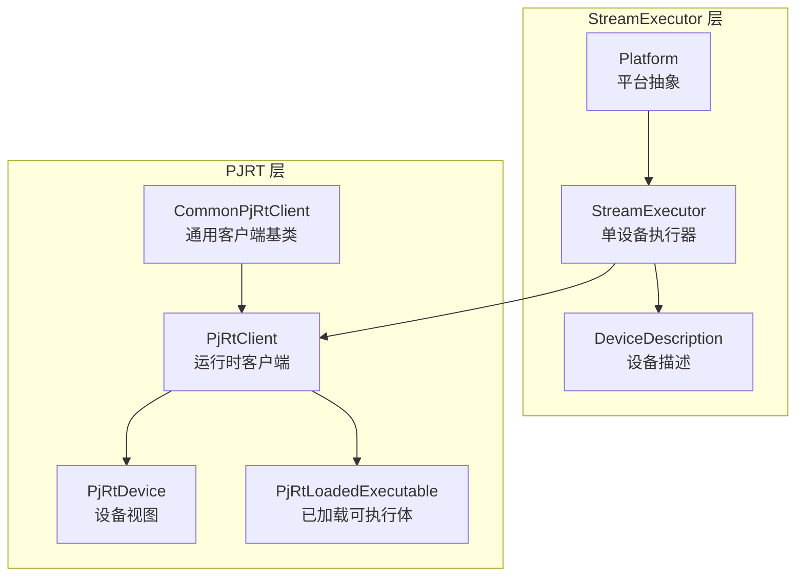
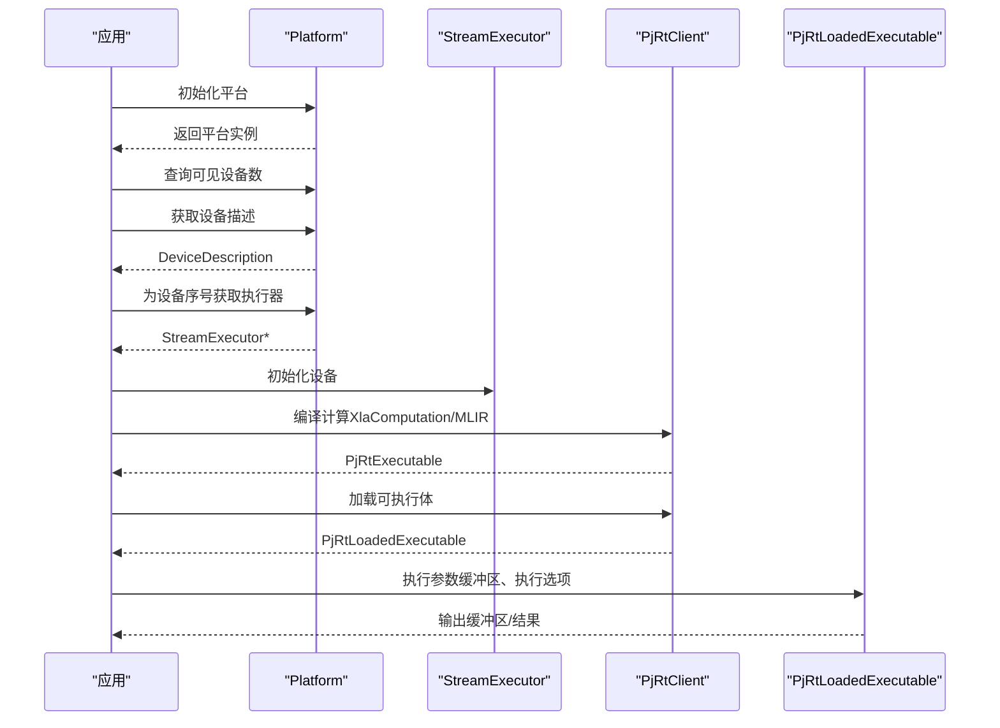
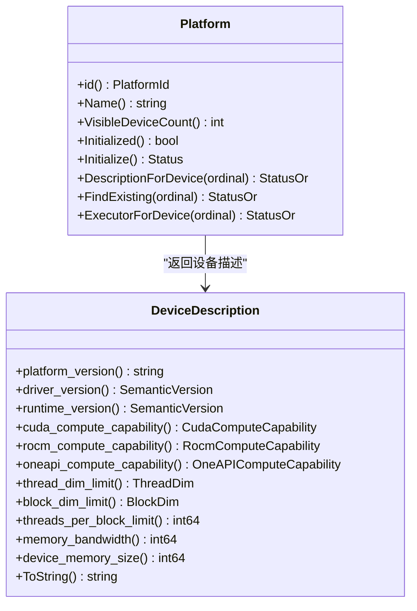
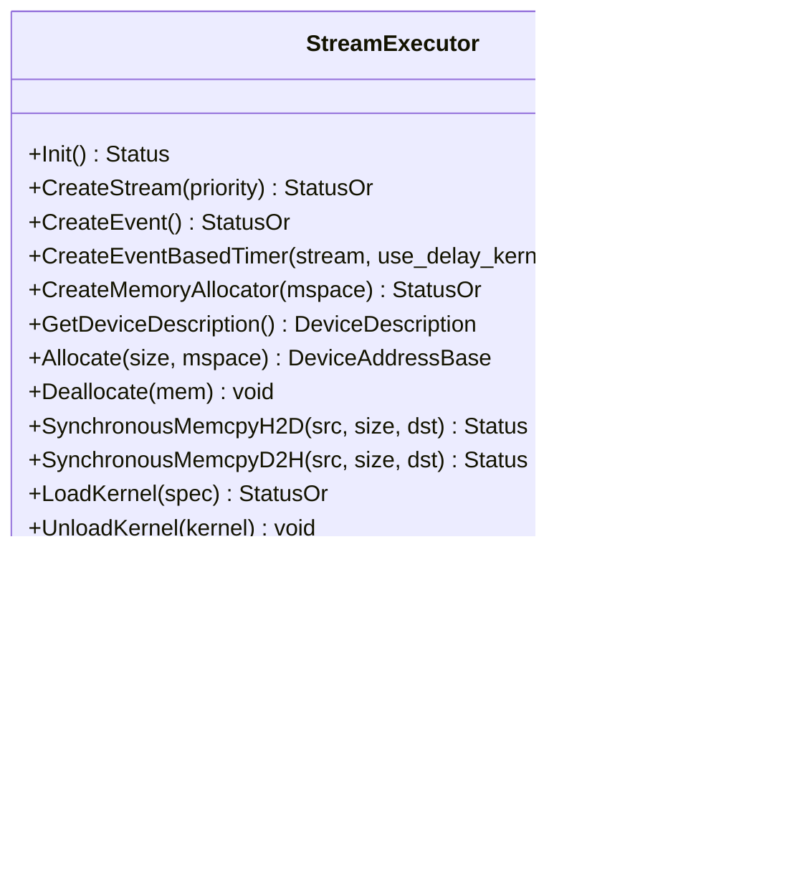
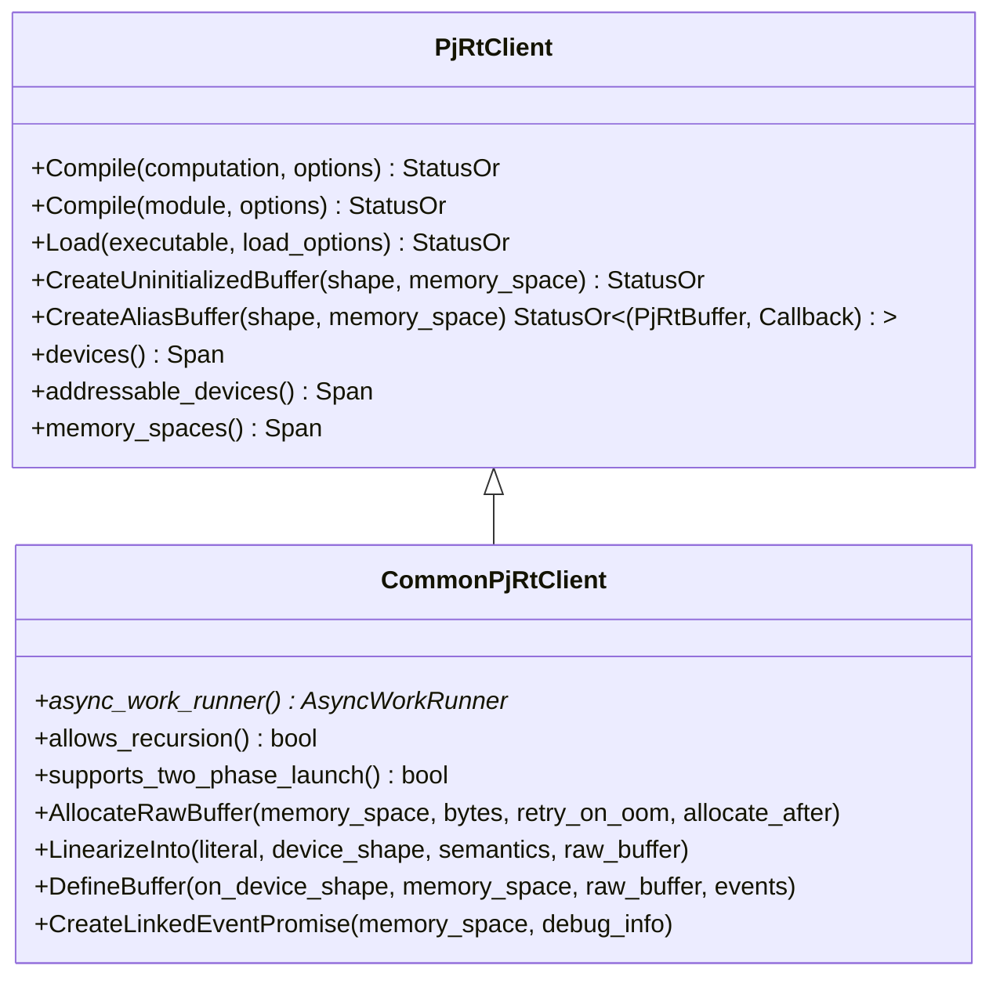
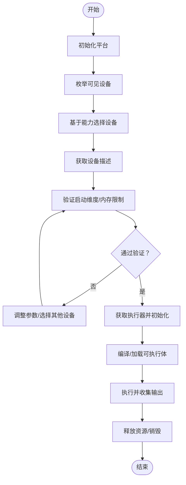
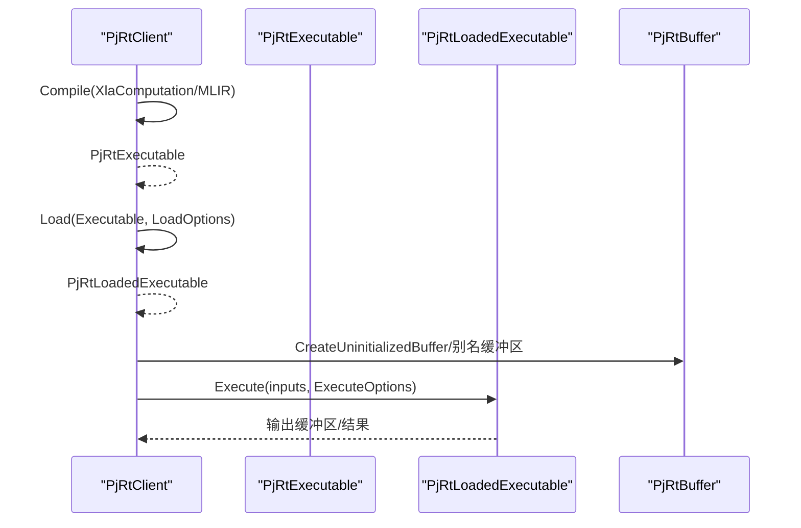
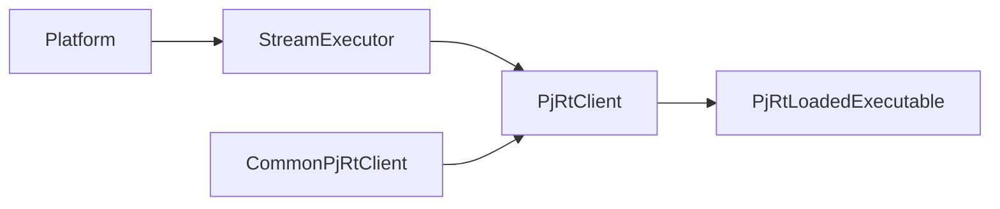

# 后端接口设计

<cite>
**本文引用的文件**
- [xla/stream_executor/platform.h](file://xla/stream_executor/platform.h)
- [xla/stream_executor/device_description.h](file://xla/stream_executor/device_description.h)
- [xla/stream_executor/stream_executor.h](file://xla/stream_executor/stream_executor.h)
- [xla/stream_executor/platform_id.h](file://xla/stream_executor/platform_id.h)
- [xla/pjrt/pjrt_client.h](file://xla/pjrt/pjrt_client.h)
- [xla/pjrt/common_pjrt_client.h](file://xla/pjrt/common_pjrt_client.h)
</cite>

## 目录
1. [引言](#引言)
2. [项目结构](#项目结构)
3. [核心组件](#核心组件)
4. [架构总览](#架构总览)
5. [详细组件分析](#详细组件分析)
6. [依赖关系分析](#依赖关系分析)
7. [性能考量](#性能考量)
8. [故障排查指南](#故障排查指南)
9. [结论](#结论)
10. [附录](#附录)

## 引言
本文件面向XLA后端接口设计，聚焦于后端抽象、编译器集成与设备管理等关键能力，系统阐述后端生命周期、流执行器池化与资源管理、设备枚举与选择验证、错误处理与状态检查，并通过序列图与类图展示关键交互流程，帮助读者在不深入源码的前提下理解并正确使用后端接口进行编译与执行。

## 项目结构
XLA后端接口由两层抽象构成：
- StreamExecutor层：面向具体加速器平台（如CUDA、ROCm、SYCL）的单设备抽象，负责内核加载、内存分配、事件与计时器、BLAS/FFT/DNN支持等。
- PJRT层：面向多设备、多主机的运行时客户端抽象，负责编译、加载可执行体、缓冲区管理、跨设备/跨主机传输、异步工作调度等。

图表来源
- [xla/stream_executor/platform.h](file://xla/stream_executor/platform.h#L44-L104)
- [xla/stream_executor/stream_executor.h](file://xla/stream_executor/stream_executor.h#L70-L428)
- [xla/stream_executor/device_description.h](file://xla/stream_executor/device_description.h#L201-L621)
- [xla/pjrt/pjrt_client.h](file://xla/pjrt/pjrt_client.h#L509-L800)
- [xla/pjrt/common_pjrt_client.h](file://xla/pjrt/common_pjrt_client.h#L56-L323)

章节来源
- [xla/stream_executor/platform.h](file://xla/stream_executor/platform.h#L44-L104)
- [xla/stream_executor/stream_executor.h](file://xla/stream_executor/stream_executor.h#L70-L428)
- [xla/stream_executor/device_description.h](file://xla/stream_executor/device_description.h#L201-L621)
- [xla/pjrt/pjrt_client.h](file://xla/pjrt/pjrt_client.h#L509-L800)
- [xla/pjrt/common_pjrt_client.h](file://xla/pjrt/common_pjrt_client.h#L56-L323)

## 核心组件
- 平台抽象（Platform）
  - 负责注册与标识不同后端平台（如CUDA、ROCm、SYCL），提供可见设备数量、初始化、设备描述查询、执行器获取等能力。
- 单设备执行器（StreamExecutor）
  - 面向单一设备的统一接口，封装内核加载/卸载、内存分配/释放、主机-设备拷贝、事件与计时器、BLAS/FFT/DNN支持、模块加载等。
- 设备描述（DeviceDescription）
  - 描述设备能力与限制，包括驱动版本、计算能力、内存带宽、寄存器/共享内存限制、拓扑信息等，用于编译期与运行期决策。
- 运行时客户端（PjRtClient）
  - 多设备/多主机视角的高层抽象，负责编译（XlaComputation或MLIR Module）、加载可执行体、缓冲区创建与别名、跨设备/跨主机传输、默认布局与拓扑信息等。
- 通用客户端基类（CommonPjRtClient）
  - 提供异步工作调度、OOM重试策略、原始缓冲区分配与线性化、设备事件集与调试追踪等通用能力，便于各后端实现复用。

章节来源
- [xla/stream_executor/platform.h](file://xla/stream_executor/platform.h#L44-L104)
- [xla/stream_executor/stream_executor.h](file://xla/stream_executor/stream_executor.h#L70-L428)
- [xla/stream_executor/device_description.h](file://xla/stream_executor/device_description.h#L201-L621)
- [xla/pjrt/pjrt_client.h](file://xla/pjrt/pjrt_client.h#L509-L800)
- [xla/pjrt/common_pjrt_client.h](file://xla/pjrt/common_pjrt_client.h#L56-L323)

## 架构总览
下图展示了从平台发现到编译执行的关键调用链路，以及PJRT层对StreamExecutor层的依赖关系。

图表来源
- [xla/stream_executor/platform.h](file://xla/stream_executor/platform.h#L62-L98)
- [xla/stream_executor/stream_executor.h](file://xla/stream_executor/stream_executor.h#L89-L121)
- [xla/pjrt/pjrt_client.h](file://xla/pjrt/pjrt_client.h#L634-L695)

## 详细组件分析

### 组件一：平台抽象与设备管理
- 平台职责
  - 唯一标识平台（PlatformId），提供名称、可见设备数、初始化、设备描述查询、执行器获取等。
  - 支持按设备序号查找已有执行器或创建新的执行器上下文。
- 设备描述
  - 包含平台版本、驱动/运行时版本、PCIe带宽、L2/L1缓存、寄存器/共享内存上限、线程/块维度限制、NUMA节点、厂商信息等。
  - 提供工具函数校验线程维度合法性、计算维度需求等。
- 关键接口路径
  - 平台接口定义：[Platform](file://xla/stream_executor/platform.h#L44-L104)
  - 设备描述接口定义：[DeviceDescription](file://xla/stream_executor/device_description.h#L201-L621)

图表来源
- [xla/stream_executor/platform.h](file://xla/stream_executor/platform.h#L44-L104)
- [xla/stream_executor/device_description.h](file://xla/stream_executor/device_description.h#L201-L621)

章节来源
- [xla/stream_executor/platform.h](file://xla/stream_executor/platform.h#L44-L104)
- [xla/stream_executor/device_description.h](file://xla/stream_executor/device_description.h#L201-L621)

### 组件二：单设备执行器（StreamExecutor）
- 能力范围
  - 创建/销毁流与事件、计时器、内存分配与拷贝、内核加载/卸载、模块加载、常量共享、Peer访问、统计与缓存清理等。
  - 暴露设备描述、内存限制、NUMA节点、平台优先级映射等。
- 资源管理
  - 支持“资源”附加机制，按类型ID挂载/获取资源，确保执行器销毁时一并释放。
- 关键接口路径
  - 执行器接口定义：[StreamExecutor](file://xla/stream_executor/stream_executor.h#L70-L428)

图表来源
- [xla/stream_executor/stream_executor.h](file://xla/stream_executor/stream_executor.h#L70-L428)

章节来源
- [xla/stream_executor/stream_executor.h](file://xla/stream_executor/stream_executor.h#L70-L428)

### 组件三：PJRT客户端与执行管线
- 客户端职责
  - 编译（XlaComputation或MLIR Module）、加载可执行体、创建/别名缓冲区、默认布局与拓扑、跨设备/跨主机传输、异步工作调度与追踪。
- 通用客户端基类
  - 提供异步工作调度器、OOM重试、原始缓冲区分配与线性化、设备事件集、调试追踪、复制目标形状推导等。
- 关键接口路径
  - 客户端接口定义：[PjRtClient](file://xla/pjrt/pjrt_client.h#L509-L800)
  - 通用客户端基类：[CommonPjRtClient](file://xla/pjrt/common_pjrt_client.h#L56-L323)

图表来源
- [xla/pjrt/pjrt_client.h](file://xla/pjrt/pjrt_client.h#L509-L800)
- [xla/pjrt/common_pjrt_client.h](file://xla/pjrt/common_pjrt_client.h#L56-L323)

章节来源
- [xla/pjrt/pjrt_client.h](file://xla/pjrt/pjrt_client.h#L509-L800)
- [xla/pjrt/common_pjrt_client.h](file://xla/pjrt/common_pjrt_client.h#L56-L323)

### 组件四：后端生命周期与设备枚举/选择/验证
- 生命周期
  - 平台初始化 → 设备描述查询 → 为设备序号获取执行器 → 执行器初始化 → 编译/加载 → 执行 → 销毁。
- 设备枚举与选择
  - 通过平台查询可见设备数与设备描述；根据设备描述中的计算能力、内存大小、带宽等属性进行选择。
- 验证与约束
  - 使用设备描述提供的维度限制与能力字段，确保内核启动参数合法；在编译期与运行期进行一致性检查。

图表来源
- [xla/stream_executor/platform.h](file://xla/stream_executor/platform.h#L62-L98)
- [xla/stream_executor/device_description.h](file://xla/stream_executor/device_description.h#L605-L617)
- [xla/stream_executor/stream_executor.h](file://xla/stream_executor/stream_executor.h#L89-L121)

章节来源
- [xla/stream_executor/platform.h](file://xla/stream_executor/platform.h#L62-L98)
- [xla/stream_executor/device_description.h](file://xla/stream_executor/device_description.h#L605-L617)
- [xla/stream_executor/stream_executor.h](file://xla/stream_executor/stream_executor.h#L89-L121)

### 组件五：编译与执行流程（序列图）
- 编译阶段
  - 客户端接收XlaComputation或MLIR Module，生成PjRtExecutable，随后加载为PjRtLoadedExecutable。
- 执行阶段
  - 准备输入缓冲区、构建设备事件依赖、执行并产出输出缓冲区；支持跨设备/跨主机传输与别名缓冲区。

图表来源
- [xla/pjrt/pjrt_client.h](file://xla/pjrt/pjrt_client.h#L634-L695)
- [xla/pjrt/common_pjrt_client.h](file://xla/pjrt/common_pjrt_client.h#L420-L439)

章节来源
- [xla/pjrt/pjrt_client.h](file://xla/pjrt/pjrt_client.h#L634-L695)
- [xla/pjrt/common_pjrt_client.h](file://xla/pjrt/common_pjrt_client.h#L420-L439)

## 依赖关系分析
- 平台到执行器
  - Platform负责为设备序号提供StreamExecutor实例，后者承载具体设备能力与资源。
- 执行器到PJRT
  - StreamExecutor作为底层能力提供者，被PjRtClient封装为更高层的设备视图与执行语义。
- 通用基类复用
  - CommonPjRtClient为各后端实现提供统一的缓冲区、事件、异步工作与调试追踪能力，降低重复实现成本。

图表来源
- [xla/stream_executor/platform.h](file://xla/stream_executor/platform.h#L85-L98)
- [xla/stream_executor/stream_executor.h](file://xla/stream_executor/stream_executor.h#L87-L121)
- [xla/pjrt/pjrt_client.h](file://xla/pjrt/pjrt_client.h#L509-L542)
- [xla/pjrt/common_pjrt_client.h](file://xla/pjrt/common_pjrt_client.h#L56-L100)

章节来源
- [xla/stream_executor/platform.h](file://xla/stream_executor/platform.h#L85-L98)
- [xla/stream_executor/stream_executor.h](file://xla/stream_executor/stream_executor.h#L87-L121)
- [xla/pjrt/pjrt_client.h](file://xla/pjrt/pjrt_client.h#L509-L542)
- [xla/pjrt/common_pjrt_client.h](file://xla/pjrt/common_pjrt_client.h#L56-L100)

## 性能考量
- 内存与带宽
  - 利用设备描述中的内存带宽、L2/L1缓存、共享内存与寄存器限制，指导内核维度与数据布局优化。
- 线程/块维度
  - 使用设备描述的线程/块维度限制与每SM线程上限，避免非法启动参数导致失败与回退。
- 编译缓存与统计
  - 清理编译缓存与读取分配器统计有助于定位热点与内存压力问题。
- 异步与池化
  - 通过异步工作调度器与事件机制提升并发度，减少同步阻塞。

## 故障排查指南
- 常见错误与检查点
  - 设备不可用/上下文冲突：确认平台初始化与设备上下文状态。
  - 内存不足/越界：检查设备内存限制与分配大小，必要时启用OOM重试策略。
  - 启动参数非法：依据设备描述的线程/块维度限制与每块线程上限进行修正。
  - Peer访问失败：检查CanEnablePeerAccessTo与EnablePeerAccessTo的返回值。
- 状态与日志
  - 使用提取API调用轨迹与设置参数日志模式，辅助定位问题。
  - 读取分配器统计与设备内存使用情况，评估资源占用。

章节来源
- [xla/stream_executor/stream_executor.h](file://xla/stream_executor/stream_executor.h#L190-L250)
- [xla/stream_executor/stream_executor.h](file://xla/stream_executor/stream_executor.h#L318-L350)
- [xla/pjrt/common_pjrt_client.h](file://xla/pjrt/common_pjrt_client.h#L71-L83)

## 结论
XLA后端接口以StreamExecutor为核心，向上通过PJRT客户端提供统一的编译与执行体验。平台抽象确保多后端一致性，设备描述为编译与运行期决策提供依据，通用客户端基类则沉淀了缓冲区、事件与异步调度等共性能力。遵循本文所述生命周期、设备选择与验证流程、错误处理与性能优化建议，可稳定高效地完成从编译到执行的全链路任务。

## 附录
- 平台标识与名称
  - 平台ID与名称元数据由平台ID信息类提供，确保唯一标识与可读性。
- 实际使用建议
  - 在编译前先查询设备描述并进行参数合法性校验；
  - 对大内存操作启用OOM重试与统计监控；
  - 使用事件与计时器进行性能剖析与瓶颈定位。

章节来源
- [xla/stream_executor/platform_id.h](file://xla/stream_executor/platform_id.h#L24-L61)