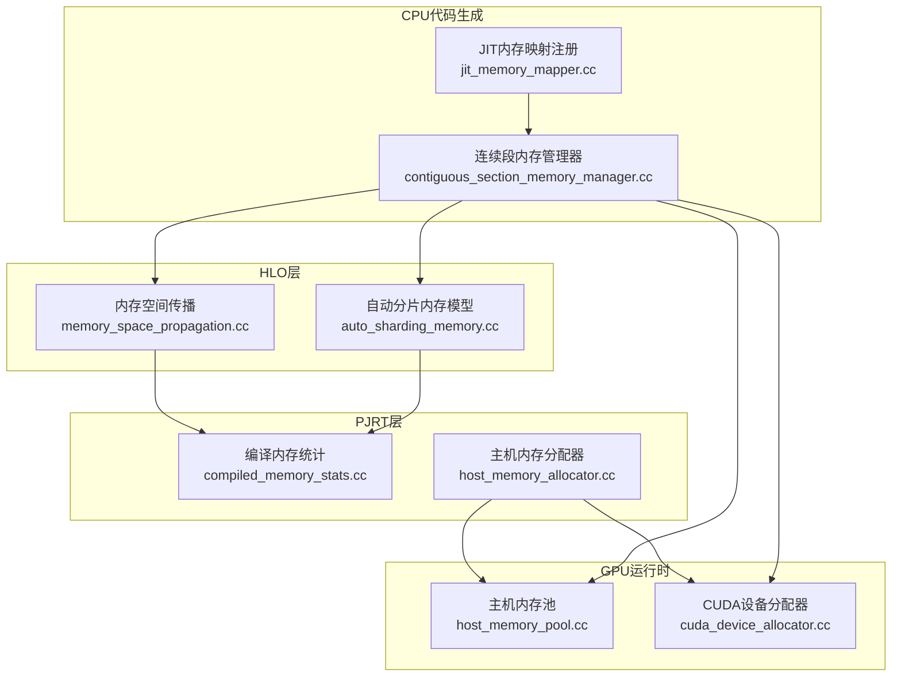
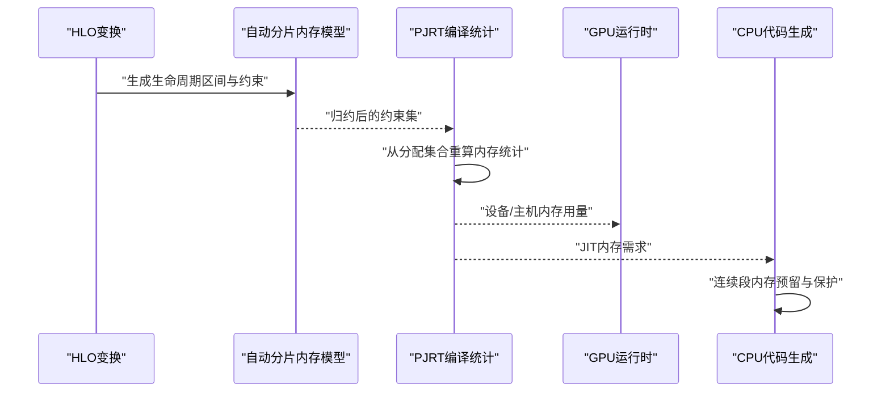
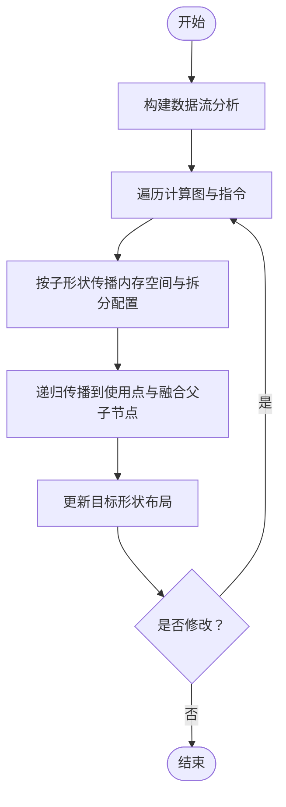
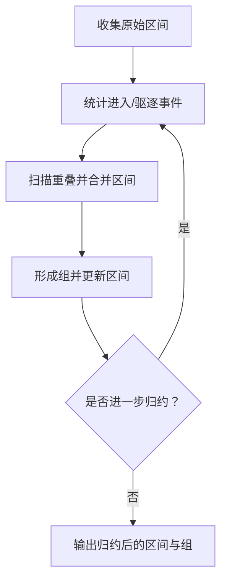
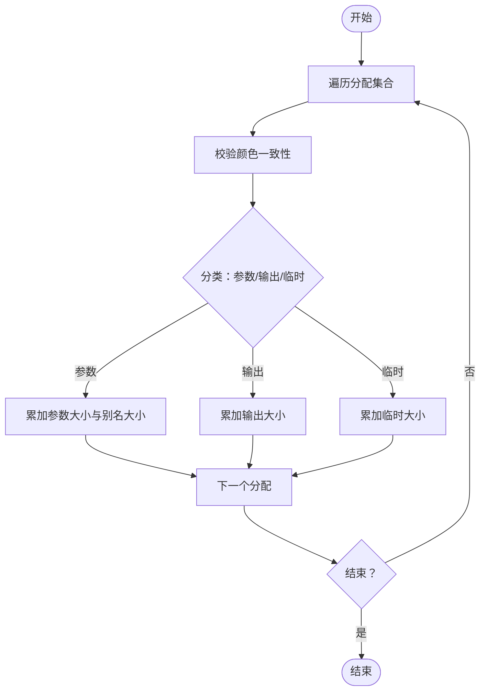
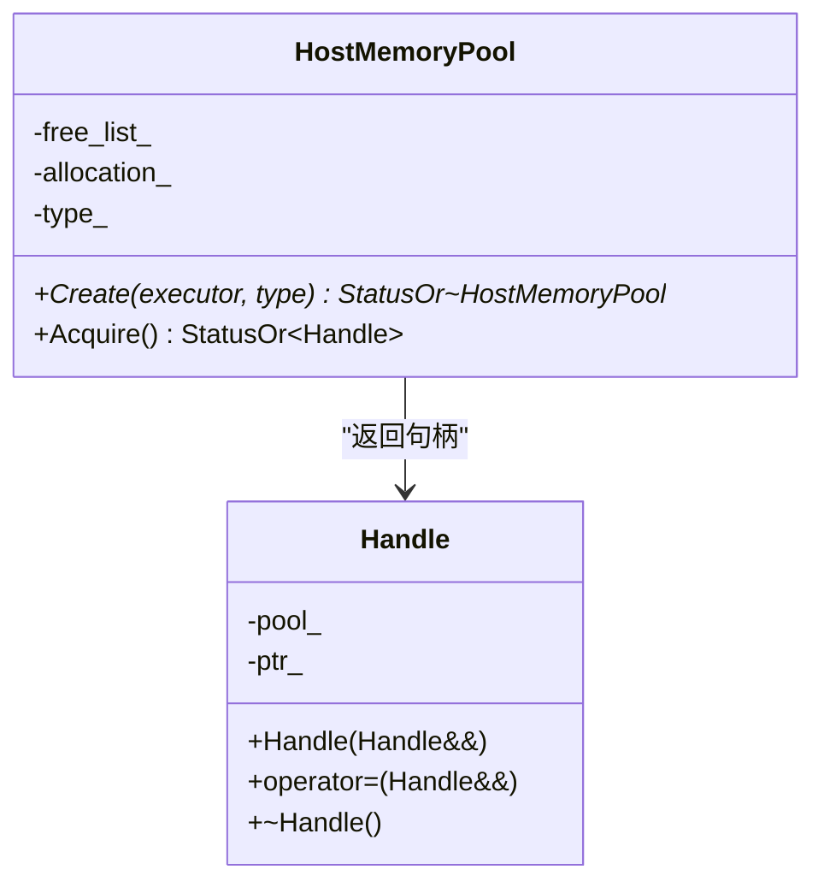
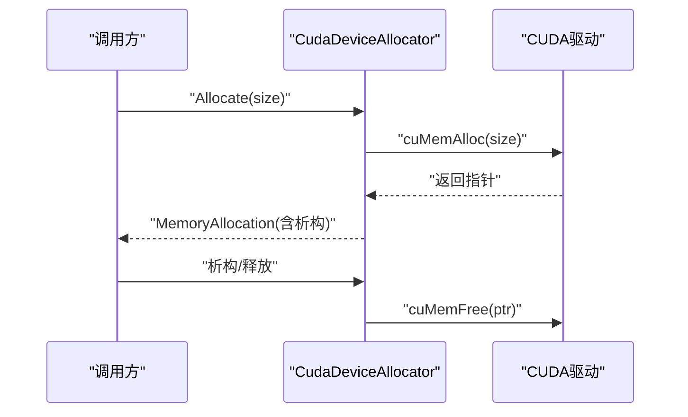
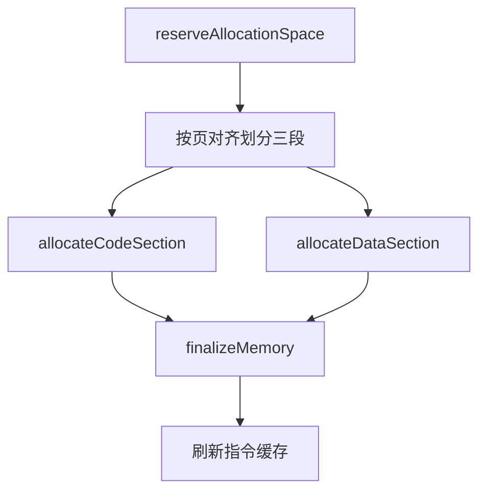
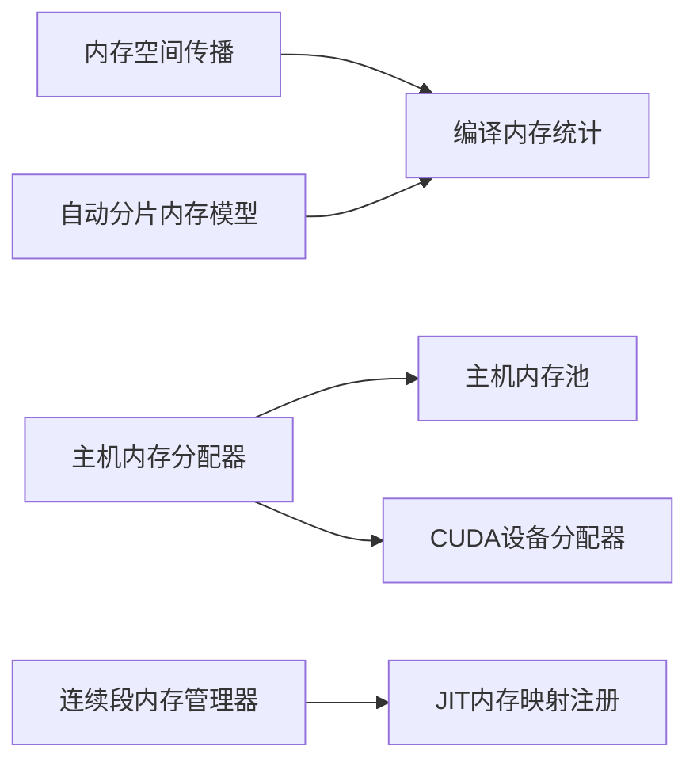

# 内存优化策略

<cite>
**本文引用的文件**
- [xla/pjrt/compiled_memory_stats.cc](file://xla/pjrt/compiled_memory_stats.cc)
- [xla/backends/cpu/codegen/contiguous_section_memory_manager.cc](file://xla/backends/cpu/codegen/contiguous_section_memory_manager.cc)
- [xla/backends/cpu/codegen/jit_memory_mapper.cc](file://xla/backends/cpu/codegen/jit_memory_mapper.cc)
- [xla/backends/gpu/runtime/host_memory_pool.cc](file://xla/backends/gpu/runtime/host_memory_pool.cc)
- [xla/hlo/experimental/auto_sharding/auto_sharding_memory.cc](file://xla/hlo/experimental/auto_sharding/auto_sharding_memory.cc)
- [xla/hlo/transforms/memory_space_propagation.cc](file://xla/hlo/transforms/memory_space_propagation.cc)
- [xla/pjrt/host_memory_allocator.cc](file://xla/pjrt/host_memory_allocator.cc)
- [xla/stream_executor/cuda/cuda_device_allocator.cc](file://xla/stream_executor/cuda/cuda_device_allocator.cc)
</cite>

## 目录
1. [引言](#引言)
2. [项目结构](#项目结构)
3. [核心组件](#核心组件)
4. [架构总览](#架构总览)
5. [详细组件分析](#详细组件分析)
6. [依赖关系分析](#依赖关系分析)
7. [性能考量](#性能考量)
8. [故障排查指南](#故障排查指南)
9. [结论](#结论)
10. [附录](#附录)

## 引言
本文件系统性梳理XLA在内存优化方面的策略与实现，覆盖缓冲区分配与复用、内存空间布局与层次化存储、拷贝消除与访问模式优化、碎片化治理、内存使用分析与泄漏检测，以及面向不同场景的最佳实践与调优建议。内容基于仓库中的实际实现文件进行归纳总结，并通过图示展示关键流程与组件交互。

## 项目结构
围绕内存优化的关键实现分布在以下模块：
- HLO层：内存空间传播、自动分片内存模型与时间项归约
- PJRT层：编译后内存统计、主机内存分配器
- GPU运行时：主机内存池、设备内存分配器
- CPU代码生成：连续段内存管理器、JIT内存映射注册
- 分析与度量：内存统计聚合、内存空间传播

**图表来源**
- [xla/hlo/transforms/memory_space_propagation.cc](file://xla/hlo/transforms/memory_space_propagation.cc#L37-L106)
- [xla/hlo/experimental/auto_sharding/auto_sharding_memory.cc](file://xla/hlo/experimental/auto_sharding/auto_sharding_memory.cc#L56-L139)
- [xla/pjrt/compiled_memory_stats.cc](file://xla/pjrt/compiled_memory_stats.cc#L34-L99)
- [xla/pjrt/host_memory_allocator.cc](file://xla/pjrt/host_memory_allocator.cc#L27-L44)
- [xla/backends/gpu/runtime/host_memory_pool.cc](file://xla/backends/gpu/runtime/host_memory_pool.cc#L35-L85)
- [xla/stream_executor/cuda/cuda_device_allocator.cc](file://xla/stream_executor/cuda/cuda_device_allocator.cc#L104-L114)
- [xla/backends/cpu/codegen/contiguous_section_memory_manager.cc](file://xla/backends/cpu/codegen/contiguous_section_memory_manager.cc#L57-L171)
- [xla/backends/cpu/codegen/jit_memory_mapper.cc](file://xla/backends/cpu/codegen/jit_memory_mapper.cc#L50-L69)

**章节来源**
- [xla/hlo/transforms/memory_space_propagation.cc](file://xla/hlo/transforms/memory_space_propagation.cc#L37-L106)
- [xla/hlo/experimental/auto_sharding/auto_sharding_memory.cc](file://xla/hlo/experimental/auto_sharding/auto_sharding_memory.cc#L56-L139)
- [xla/pjrt/compiled_memory_stats.cc](file://xla/pjrt/compiled_memory_stats.cc#L34-L99)
- [xla/pjrt/host_memory_allocator.cc](file://xla/pjrt/host_memory_allocator.cc#L27-L44)
- [xla/backends/gpu/runtime/host_memory_pool.cc](file://xla/backends/gpu/runtime/host_memory_pool.cc#L35-L85)
- [xla/stream_executor/cuda/cuda_device_allocator.cc](file://xla/stream_executor/cuda/cuda_device_allocator.cc#L104-L114)
- [xla/backends/cpu/codegen/contiguous_section_memory_manager.cc](file://xla/backends/cpu/codegen/contiguous_section_memory_manager.cc#L57-L171)
- [xla/backends/cpu/codegen/jit_memory_mapper.cc](file://xla/backends/cpu/codegen/jit_memory_mapper.cc#L50-L69)

## 核心组件
- 内存空间传播：在HLO图中将参数/输出/融合节点的子形状内存空间一致化，确保跨层级布局一致性，减少不必要的显存/主机内存拷贝与类型转换。
- 自动分片内存模型与时间项归约：对生命周期区间进行合并与分组，降低内存约束项数量，指导更紧凑的缓冲区分配与复用。
- 编译后内存统计：从分配集合重新计算参数、输出、临时与别名缓冲区在设备与主机侧的大小，区分别名与非别名，辅助资源预算与峰值估算。
- 主机内存池：GPU主机侧固定块内存池，支持并发安全的预分配块借用与归还，降低频繁小块分配带来的开销与碎片。
- CUDA设备分配器：基于CUDA驱动接口的设备内存分配与释放封装，提供地址基类与状态日志，便于追踪与诊断。
- 连续段内存管理器：为JIT生成的代码段与数据段提供连续内存区域的预留、对齐与保护设置，提升指令缓存命中与执行安全性。
- JIT内存映射注册：按区域名称注册可插拔的内存映射器，统一JIT代码生成阶段的内存分配策略。

**章节来源**
- [xla/hlo/transforms/memory_space_propagation.cc](file://xla/hlo/transforms/memory_space_propagation.cc#L108-L184)
- [xla/hlo/experimental/auto_sharding/auto_sharding_memory.cc](file://xla/hlo/experimental/auto_sharding/auto_sharding_memory.cc#L141-L268)
- [xla/pjrt/compiled_memory_stats.cc](file://xla/pjrt/compiled_memory_stats.cc#L34-L99)
- [xla/backends/gpu/runtime/host_memory_pool.cc](file://xla/backends/gpu/runtime/host_memory_pool.cc#L35-L85)
- [xla/stream_executor/cuda/cuda_device_allocator.cc](file://xla/stream_executor/cuda/cuda_device_allocator.cc#L104-L114)
- [xla/backends/cpu/codegen/contiguous_section_memory_manager.cc](file://xla/backends/cpu/codegen/contiguous_section_memory_manager.cc#L57-L171)
- [xla/backends/cpu/codegen/jit_memory_mapper.cc](file://xla/backends/cpu/codegen/jit_memory_mapper.cc#L50-L69)

## 架构总览
XLA内存优化贯穿编译期与运行期：
- 编译期：通过HLO变换确定内存空间与布局，结合自动分片模型压缩生命周期约束；最终生成可执行体并记录缓冲区分配。
- 运行期：根据分配结果统计设备/主机内存用量，按需进行主机内存池复用与设备内存分配；在CPU路径上采用连续段内存管理器保障JIT代码段安全与高效。

**图表来源**
- [xla/hlo/experimental/auto_sharding/auto_sharding_memory.cc](file://xla/hlo/experimental/auto_sharding/auto_sharding_memory.cc#L105-L139)
- [xla/pjrt/compiled_memory_stats.cc](file://xla/pjrt/compiled_memory_stats.cc#L34-L99)
- [xla/backends/cpu/codegen/contiguous_section_memory_manager.cc](file://xla/backends/cpu/codegen/contiguous_section_memory_manager.cc#L78-L171)

## 详细组件分析

### 组件A：内存空间传播（MemorySpacePropagation）
- 目标：在参数、输出、融合节点及其嵌套结构之间传播子形状的内存空间与拆分配置，保证布局一致性，避免跨内存空间的数据搬运。
- 关键逻辑：
  - 遍历模块中的计算图与指令，对参数子形状、根输出子形状、融合输入/输出子形状进行传播。
  - 使用数据流分析定位值的位置，递归传播至使用点与父/子融合节点。
  - 更新目标形状的内存空间与拆分配置，返回是否修改。
- 性能影响：减少布局不一致导致的额外拷贝与类型转换，提升跨层访问效率。

**图表来源**
- [xla/hlo/transforms/memory_space_propagation.cc](file://xla/hlo/transforms/memory_space_propagation.cc#L37-L106)
- [xla/hlo/transforms/memory_space_propagation.cc](file://xla/hlo/transforms/memory_space_propagation.cc#L108-L184)

**章节来源**
- [xla/hlo/transforms/memory_space_propagation.cc](file://xla/hlo/transforms/memory_space_propagation.cc#L37-L106)
- [xla/hlo/transforms/memory_space_propagation.cc](file://xla/hlo/transforms/memory_space_propagation.cc#L108-L184)

### 组件B：自动分片内存模型与时间项归约（MemoryTermReducer）
- 目标：对生命周期区间进行合并与分组，减少约束项数量，从而指导更紧凑的缓冲区分配与复用。
- 关键逻辑：
  - 基于“进入/驱逐”事件扫描，寻找可合并的区间重叠，形成组以减少约束项数。
  - 提供获取归约后的时间点集合，用于建立充分的内存约束。
- 复杂度：区间扫描与重叠计算，整体复杂度与事件数线性相关，归约后显著降低约束规模。

**图表来源**
- [xla/hlo/experimental/auto_sharding/auto_sharding_memory.cc](file://xla/hlo/experimental/auto_sharding/auto_sharding_memory.cc#L141-L268)
- [xla/hlo/experimental/auto_sharding/auto_sharding_memory.cc](file://xla/hlo/experimental/auto_sharding/auto_sharding_memory.cc#L287-L339)

**章节来源**
- [xla/hlo/experimental/auto_sharding/auto_sharding_memory.cc](file://xla/hlo/experimental/auto_sharding/auto_sharding_memory.cc#L56-L139)
- [xla/hlo/experimental/auto_sharding/auto_sharding_memory.cc](file://xla/hlo/experimental/auto_sharding/auto_sharding_memory.cc#L141-L268)
- [xla/hlo/experimental/auto_sharding/auto_sharding_memory.cc](file://xla/hlo/experimental/auto_sharding/auto_sharding_memory.cc#L287-L339)

### 组件C：编译后内存统计（CompiledMemoryStats）
- 目标：从缓冲区分配集合中重新计算参数、输出、临时与别名缓冲区在设备与主机侧的大小，区分别名与非别名，弥补执行器分配统计的不足。
- 关键逻辑：
  - 遍历分配集合，校验同一分配内的逻辑缓冲区颜色一致（默认与HLO值内存空间一致）。
  - 按入口参数、可能存活输出、预分配临时缓冲区分组累加大小。
  - 区分主机与设备侧，分别统计参数、输出、临时与别名大小。

**图表来源**
- [xla/pjrt/compiled_memory_stats.cc](file://xla/pjrt/compiled_memory_stats.cc#L34-L99)

**章节来源**
- [xla/pjrt/compiled_memory_stats.cc](file://xla/pjrt/compiled_memory_stats.cc#L34-L99)

### 组件D：主机内存池（HostMemoryPool）
- 目标：在GPU主机侧提供固定块内存池，支持并发借用与归还，降低频繁小块分配的开销与碎片。
- 关键逻辑：
  - 创建一次性大块内存，切分为固定数量的元素块，维护空闲列表。
  - Acquire返回句柄，内部持有指针；句柄析构或移动赋值时自动归还。
  - 资源耗尽时返回资源耗尽错误，提示并发调用过多。

**图表来源**
- [xla/backends/gpu/runtime/host_memory_pool.cc](file://xla/backends/gpu/runtime/host_memory_pool.cc#L35-L85)

**章节来源**
- [xla/backends/gpu/runtime/host_memory_pool.cc](file://xla/backends/gpu/runtime/host_memory_pool.cc#L35-L85)

### 组件E：CUDA设备分配器（CudaDeviceAllocator）
- 目标：封装cuMemAlloc/cuMemFree，提供设备内存分配对象，记录分配与释放日志，便于诊断。
- 关键逻辑：
  - Allocate：激活设备上下文，调用cuMemAlloc，返回带析构回调的MemoryAllocation对象。
  - 析构：若指针非空则调用cuMemFree释放。
  - 日志：记录分配/释放大小与设备序号，便于性能与问题定位。

**图表来源**
- [xla/stream_executor/cuda/cuda_device_allocator.cc](file://xla/stream_executor/cuda/cuda_device_allocator.cc#L104-L114)

**章节来源**
- [xla/stream_executor/cuda/cuda_device_allocator.cc](file://xla/stream_executor/cuda/cuda_device_allocator.cc#L36-L97)

### 组件F：连续段内存管理器（ContiguousSectionMemoryManager）
- 目标：为JIT生成的代码段、只读数据段与读写数据段提供连续内存区域，按页对齐预留，设置保护位，刷新指令缓存。
- 关键逻辑：
  - reserveAllocationSpace：计算各段大小与页对齐，申请连续内存并划分三段。
  - allocateCodeSection/allocateDataSection：按只读/读写选择对应段进行子分配。
  - finalizeMemory：设置代码段可读可执行、只读段只读，刷新指令缓存。

**图表来源**
- [xla/backends/cpu/codegen/contiguous_section_memory_manager.cc](file://xla/backends/cpu/codegen/contiguous_section_memory_manager.cc#L78-L171)

**章节来源**
- [xla/backends/cpu/codegen/contiguous_section_memory_manager.cc](file://xla/backends/cpu/codegen/contiguous_section_memory_manager.cc#L57-L171)

### 组件G：JIT内存映射注册（JitMemoryMapper）
- 目标：按区域名称注册可插拔的内存映射器，统一JIT代码生成阶段的内存分配策略。
- 关键逻辑：
  - 注册器：原子保存获取器，线程安全地缓存实例。
  - 获取器：按区域名查找或创建内存映射器实例并返回。

**章节来源**
- [xla/backends/cpu/codegen/jit_memory_mapper.cc](file://xla/backends/cpu/codegen/jit_memory_mapper.cc#L42-L69)

## 依赖关系分析
- 内存空间传播依赖数据流分析与布局工具，确保传播过程稳定且可逆。
- 自动分片内存模型依赖生命周期区间与重叠计算，输出归约后的约束集供统计与分配使用。
- 编译后内存统计依赖缓冲区分配集合与布局信息，区分主机/设备与别名关系。
- 主机内存池与CUDA设备分配器分别服务于GPU主机侧与设备侧，作为运行期分配器的基础。
- 连续段内存管理器与JIT内存映射注册共同支撑CPU路径上的JIT代码段安全与高效。

**图表来源**
- [xla/hlo/transforms/memory_space_propagation.cc](file://xla/hlo/transforms/memory_space_propagation.cc#L37-L106)
- [xla/hlo/experimental/auto_sharding/auto_sharding_memory.cc](file://xla/hlo/experimental/auto_sharding/auto_sharding_memory.cc#L105-L139)
- [xla/pjrt/compiled_memory_stats.cc](file://xla/pjrt/compiled_memory_stats.cc#L34-L99)
- [xla/pjrt/host_memory_allocator.cc](file://xla/pjrt/host_memory_allocator.cc#L27-L44)
- [xla/backends/gpu/runtime/host_memory_pool.cc](file://xla/backends/gpu/runtime/host_memory_pool.cc#L35-L85)
- [xla/stream_executor/cuda/cuda_device_allocator.cc](file://xla/stream_executor/cuda/cuda_device_allocator.cc#L104-L114)
- [xla/backends/cpu/codegen/contiguous_section_memory_manager.cc](file://xla/backends/cpu/codegen/contiguous_section_memory_manager.cc#L57-L171)
- [xla/backends/cpu/codegen/jit_memory_mapper.cc](file://xla/backends/cpu/codegen/jit_memory_mapper.cc#L50-L69)

**章节来源**
- [xla/hlo/transforms/memory_space_propagation.cc](file://xla/hlo/transforms/memory_space_propagation.cc#L37-L106)
- [xla/hlo/experimental/auto_sharding/auto_sharding_memory.cc](file://xla/hlo/experimental/auto_sharding/auto_sharding_memory.cc#L105-L139)
- [xla/pjrt/compiled_memory_stats.cc](file://xla/pjrt/compiled_memory_stats.cc#L34-L99)
- [xla/pjrt/host_memory_allocator.cc](file://xla/pjrt/host_memory_allocator.cc#L27-L44)
- [xla/backends/gpu/runtime/host_memory_pool.cc](file://xla/backends/gpu/runtime/host_memory_pool.cc#L35-L85)
- [xla/stream_executor/cuda/cuda_device_allocator.cc](file://xla/stream_executor/cuda/cuda_device_allocator.cc#L104-L114)
- [xla/backends/cpu/codegen/contiguous_section_memory_manager.cc](file://xla/backends/cpu/codegen/contiguous_section_memory_manager.cc#L57-L171)
- [xla/backends/cpu/codegen/jit_memory_mapper.cc](file://xla/backends/cpu/codegen/jit_memory_mapper.cc#L50-L69)

## 性能考量
- 缓冲区分配与复用
  - 利用主机内存池减少频繁小块分配与碎片；在GPU路径上优先复用已分配块。
  - 在CPU路径上使用连续段内存管理器，减少跨段跳转与指令缓存失效。
- 内存空间传播
  - 保持参数/输出/融合节点子形状内存空间一致，避免跨内存空间拷贝与布局转换。
- 生命周期归约
  - 通过自动分片内存模型归约约束项，降低峰值内存占用与分配压力。
- 设备/主机内存分离统计
  - 使用编译后内存统计区分设备与主机侧用量，识别潜在的过度主机侧传输瓶颈。
- 对齐与保护
  - 连续段内存管理器按页对齐与设置保护位，有助于提高缓存命中与执行安全性。

[本节为通用性能讨论，无需列出具体文件来源]

## 故障排查指南
- 内存统计异常
  - 确认分配集合的颜色一致性检查是否通过；若失败，检查自定义着色器或布局变更。
  - 对比编译后统计与执行器统计差异，关注别名缓冲区是否被正确计入。
- 主机内存池耗尽
  - 观察并发调用是否超过池容量；必要时增大池大小或减少并发。
- 设备内存分配失败
  - 查看设备上下文激活与cuMemAlloc返回状态；确认设备内存可用量与对齐要求。
- JIT代码段保护失败
  - 检查finalizeMemory返回的错误码，确认代码段/只读段保护设置是否成功。

**章节来源**
- [xla/pjrt/compiled_memory_stats.cc](file://xla/pjrt/compiled_memory_stats.cc#L53-L66)
- [xla/backends/gpu/runtime/host_memory_pool.cc](file://xla/backends/gpu/runtime/host_memory_pool.cc#L43-L55)
- [xla/stream_executor/cuda/cuda_device_allocator.cc](file://xla/stream_executor/cuda/cuda_device_allocator.cc#L36-L67)
- [xla/backends/cpu/codegen/contiguous_section_memory_manager.cc](file://xla/backends/cpu/codegen/contiguous_section_memory_manager.cc#L148-L171)

## 结论
XLA的内存优化策略在编译期与运行期协同工作：编译期通过内存空间传播与自动分片内存模型降低约束复杂度与峰值占用；运行期通过主机内存池、设备分配器与连续段内存管理器提升分配效率与执行稳定性。配合编译后内存统计，可实现对设备/主机内存的精细化观测与调优。

[本节为总结性内容，无需列出具体文件来源]

## 附录
- 应用场景与最佳实践
  - 大批量短生命周期小缓冲：优先使用主机内存池，控制并发与池大小。
  - CPU JIT密集型任务：启用连续段内存管理器，确保指令缓存友好。
  - 跨内存空间频繁访问：通过内存空间传播统一布局，减少拷贝。
  - 多设备/多主机混合：结合编译后统计与设备/主机侧用量，平衡传输与计算。
- 工具与方法
  - 使用编译后内存统计进行资源预算与峰值估算。
  - 结合设备/主机侧分配器日志与指令缓存刷新机制进行性能回归分析。
  - 在自动分片路径下，优先使用生命周期归约以降低约束规模。

[本节为通用指导，无需列出具体文件来源]