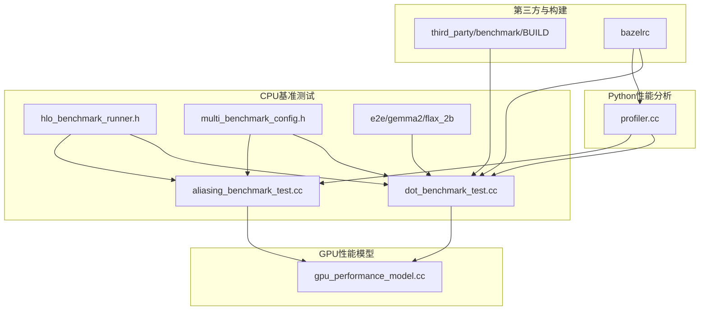
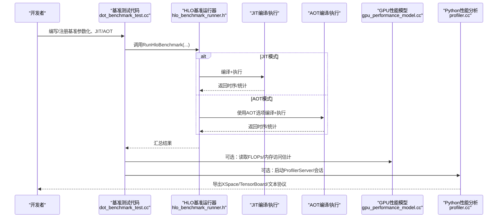
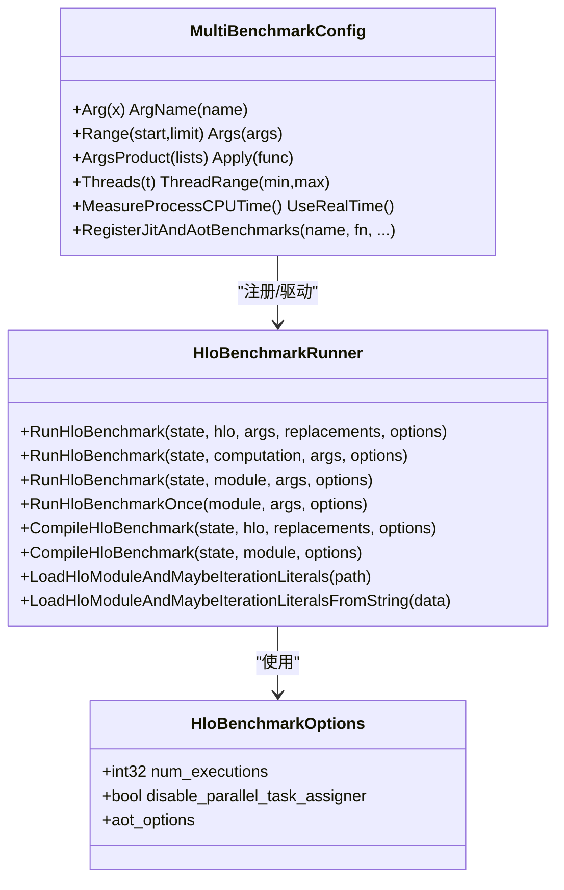
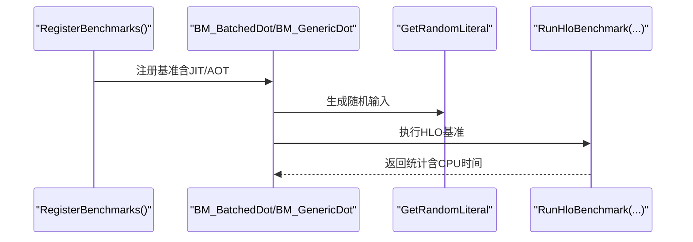
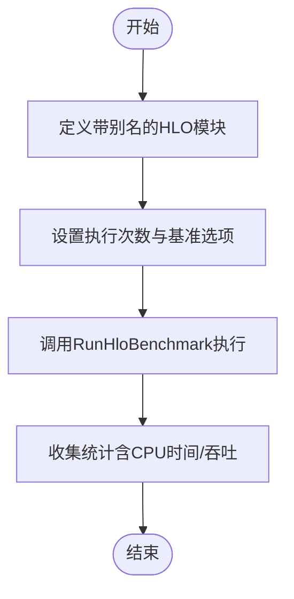
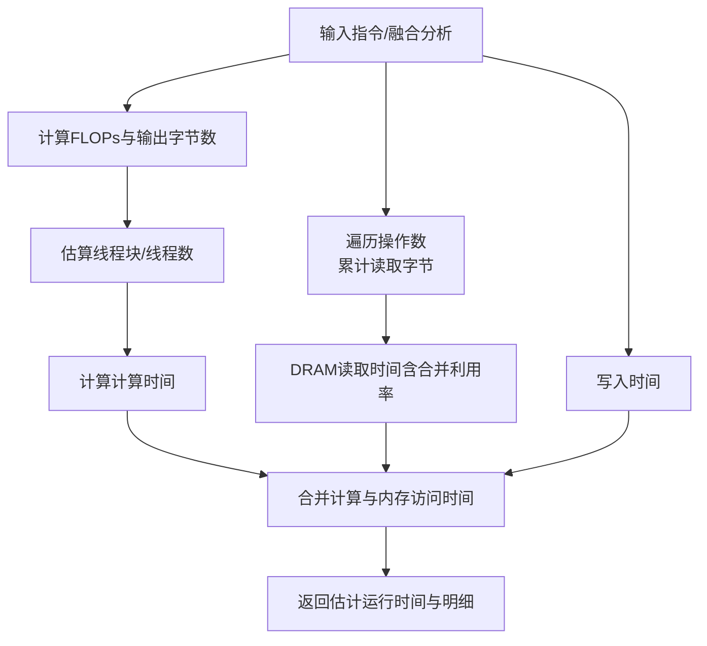
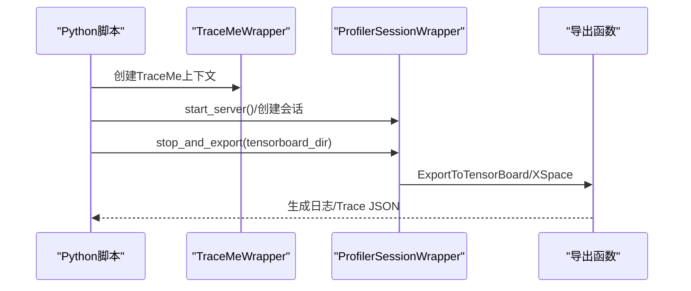
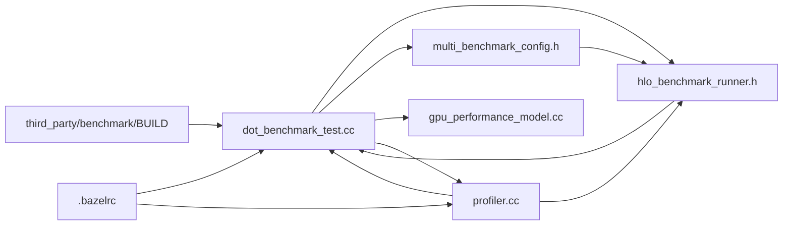

# 基准测试与性能分析

<cite>
**本文引用的文件**   
- [xla/backends/cpu/benchmarks/hlo_benchmark_runner.h](file://xla/backends/cpu/benchmarks/hlo_benchmark_runner.h)
- [xla/backends/cpu/benchmarks/multi_benchmark_config.h](file://xla/backends/cpu/benchmarks/multi_benchmark_config.h)
- [xla/backends/cpu/benchmarks/dot_benchmark_test.cc](file://xla/backends/cpu/benchmarks/dot_benchmark_test.cc)
- [xla/backends/cpu/benchmarks/aliasing_benchmark_test.cc](file://xla/backends/cpu/benchmarks/aliasing_benchmark_test.cc)
- [xla/service/gpu/model/gpu_performance_model.cc](file://xla/service/gpu/model/gpu_performance_model.cc)
- [xla/python/profiler.cc](file://xla/python/profiler.cc)
- [third_party/benchmark/BUILD](file://third_party/benchmark/BUILD)
- [.bazelrc](file://.bazelrc)
- [xla/backends/cpu/benchmarks/e2e/gemma2/flax_2b/benchmark.py](file://xla/backends/cpu/benchmarks/e2e/gemma2/flax_2b/benchmark.py)
- [xla/backends/cpu/benchmarks/e2e/gemma2/flax_2b/run.sh](file://xla/backends/cpu/benchmarks/e2e/gemma2/flax_2b/run.sh)
- [xla/backends/cpu/benchmarks/e2e/gemma2/flax_2b/setup.sh](file://xla/backends/cpu/benchmarks/e2e/gemma2/flax_2b/setup.sh)
- [xla/backends/cpu/benchmarks/e2e/gemma2/flax_2b/config.sh](file://xla/backends/cpu/benchmarks/e2e/gemma2/flax_2b/config.sh)
- [xla/backends/cpu/benchmarks/e2e/gemma2/flax_2b/README.md](file://xla/backends/cpu/benchmarks/e2e/gemma2/flax_2b/README.md)
</cite>

## 目录
1. [简介](#简介)
2. [项目结构](#项目结构)
3. [核心组件](#核心组件)
4. [架构总览](#架构总览)
5. [详细组件分析](#详细组件分析)
6. [依赖关系分析](#依赖关系分析)
7. [性能考量](#性能考量)
8. [故障排查指南](#故障排查指南)
9. [结论](#结论)
10. [附录](#附录)

## 简介
本文件面向XLA的基准测试与性能分析，系统性阐述以下内容：
- 性能测试框架的使用：如何编写、执行与分析基准测试（含JIT/AOT对比、参数化与统计聚合）。
- 性能分析工具：CPU/GPU性能计数器、内存带宽监控、执行时间统计与Python侧采集导出。
- 性能回归检测与CI流程：在持续集成中运行基准测试与性能回归检测的建议实践。
- 性能瓶颈识别：计算密集型与内存密集型问题的诊断路径与方法。
- 对比分析与报告解读：优化前后对比、指标归因与报告解读要点。
- 自定义性能指标与监控体系：扩展指标定义与监控系统搭建思路。

## 项目结构
围绕基准测试与性能分析，XLA仓库的关键位置如下：
- CPU基准测试与运行器：xla/backends/cpu/benchmarks
- GPU性能模型：xla/service/gpu/model
- Python性能分析接口：xla/python/profiler.cc
- 第三方基准库：third_party/benchmark
- Bazel配置与标志：.bazelrc
- 端到端（E2E）基准示例：xla/backends/cpu/benchmarks/e2e/gemma2/flax_2b

**图示来源**
- [xla/backends/cpu/benchmarks/hlo_benchmark_runner.h](file://xla/backends/cpu/benchmarks/hlo_benchmark_runner.h#L1-L108)
- [xla/backends/cpu/benchmarks/multi_benchmark_config.h](file://xla/backends/cpu/benchmarks/multi_benchmark_config.h#L1-L307)
- [xla/backends/cpu/benchmarks/dot_benchmark_test.cc](file://xla/backends/cpu/benchmarks/dot_benchmark_test.cc#L1-L247)
- [xla/backends/cpu/benchmarks/aliasing_benchmark_test.cc](file://xla/backends/cpu/benchmarks/aliasing_benchmark_test.cc#L1-L67)
- [xla/service/gpu/model/gpu_performance_model.cc](file://xla/service/gpu/model/gpu_performance_model.cc#L1-L324)
- [xla/python/profiler.cc](file://xla/python/profiler.cc#L1-L390)
- [third_party/benchmark/BUILD](file://third_party/benchmark/BUILD)
- [.bazelrc](file://.bazelrc)

**章节来源**
- [xla/backends/cpu/benchmarks/hlo_benchmark_runner.h](file://xla/backends/cpu/benchmarks/hlo_benchmark_runner.h#L1-L108)
- [xla/backends/cpu/benchmarks/multi_benchmark_config.h](file://xla/backends/cpu/benchmarks/multi_benchmark_config.h#L1-L307)
- [xla/backends/cpu/benchmarks/dot_benchmark_test.cc](file://xla/backends/cpu/benchmarks/dot_benchmark_test.cc#L1-L247)
- [xla/backends/cpu/benchmarks/aliasing_benchmark_test.cc](file://xla/backends/cpu/benchmarks/aliasing_benchmark_test.cc#L1-L67)
- [xla/service/gpu/model/gpu_performance_model.cc](file://xla/service/gpu/model/gpu_performance_model.cc#L1-L324)
- [xla/python/profiler.cc](file://xla/python/profiler.cc#L1-L390)
- [third_party/benchmark/BUILD](file://third_party/benchmark/BUILD)
- [.bazelrc](file://.bazelrc)

## 核心组件
- HLO基准运行器：封装HLO模块编译与执行，支持参数化替换、AOT选项、一次性运行等能力。
- 多基准配置器：统一设置多个基准的参数（如Arg/Range/Threads/统计），并支持JIT与AOT双模式注册。
- GPU性能模型：基于FLOPs、内存访问与线程块维度估算指令/融合的执行时间，并可写入后端配置作为重定时时成本。
- Python性能分析接口：提供ProfilerServer、会话管理、TraceMe元数据、FDO指令集分析与聚合等功能。
- 端到端示例：Gemma2 Flax 2B端到端基准脚本与运行脚本，便于复现实战场景。

**章节来源**
- [xla/backends/cpu/benchmarks/hlo_benchmark_runner.h](file://xla/backends/cpu/benchmarks/hlo_benchmark_runner.h#L40-L104)
- [xla/backends/cpu/benchmarks/multi_benchmark_config.h](file://xla/backends/cpu/benchmarks/multi_benchmark_config.h#L36-L307)
- [xla/service/gpu/model/gpu_performance_model.cc](file://xla/service/gpu/model/gpu_performance_model.cc#L47-L120)
- [xla/python/profiler.cc](file://xla/python/profiler.cc#L109-L390)
- [xla/backends/cpu/benchmarks/e2e/gemma2/flax_2b/benchmark.py](file://xla/backends/cpu/benchmarks/e2e/gemma2/flax_2b/benchmark.py)

## 架构总览
下图展示从“基准测试编写”到“性能分析与导出”的整体流程，涵盖CPU基准运行器、GPU性能模型以及Python侧采集与聚合。

**图示来源**
- [xla/backends/cpu/benchmarks/dot_benchmark_test.cc](file://xla/backends/cpu/benchmarks/dot_benchmark_test.cc#L198-L247)
- [xla/backends/cpu/benchmarks/hlo_benchmark_runner.h](file://xla/backends/cpu/benchmarks/hlo_benchmark_runner.h#L47-L91)
- [xla/service/gpu/model/gpu_performance_model.cc](file://xla/service/gpu/model/gpu_performance_model.cc#L297-L320)
- [xla/python/profiler.cc](file://xla/python/profiler.cc#L151-L231)

## 详细组件分析

### 组件A：HLO基准运行器与多基准配置
- HLO基准运行器提供：
  - 以字符串或HLO计算/模块形式运行基准。
  - 支持参数化替换（键值映射）、一次性运行、仅编译基准。
  - AOT编译选项与并行任务分配开关。
- 多基准配置器提供：
  - 批量设置Arg/Range/Threads/统计/复杂度等。
  - 统一注册JIT与AOT两个版本的基准。
  - 宏简化基准注册与命名。

**图示来源**
- [xla/backends/cpu/benchmarks/hlo_benchmark_runner.h](file://xla/backends/cpu/benchmarks/hlo_benchmark_runner.h#L40-L104)
- [xla/backends/cpu/benchmarks/multi_benchmark_config.h](file://xla/backends/cpu/benchmarks/multi_benchmark_config.h#L36-L307)

**章节来源**
- [xla/backends/cpu/benchmarks/hlo_benchmark_runner.h](file://xla/backends/cpu/benchmarks/hlo_benchmark_runner.h#L40-L104)
- [xla/backends/cpu/benchmarks/multi_benchmark_config.h](file://xla/backends/cpu/benchmarks/multi_benchmark_config.h#L258-L307)

### 组件B：点积基准（计算密集型）
- 特征：
  - 参数化批量矩阵乘（BatchedDot）与通用Dot（GenericDot）。
  - 随机输入生成与类型覆盖（F32/BF16/S8/S32）。
  - 注册JIT/AOT双模式，开启进程级CPU时间测量。
- 流程：
  - 构造HLO模块或使用builder创建计算图。
  - 生成随机输入字面量。
  - 调用基准运行器执行并收集统计。

**图示来源**
- [xla/backends/cpu/benchmarks/dot_benchmark_test.cc](file://xla/backends/cpu/benchmarks/dot_benchmark_test.cc#L77-L153)
- [xla/backends/cpu/benchmarks/dot_benchmark_test.cc](file://xla/backends/cpu/benchmarks/dot_benchmark_test.cc#L198-L247)

**章节来源**
- [xla/backends/cpu/benchmarks/dot_benchmark_test.cc](file://xla/backends/cpu/benchmarks/dot_benchmark_test.cc#L70-L247)

### 组件C：别名基准（内存密集型）
- 特征：
  - 使用HLO别名特性构造输入输出别名，评估别名对执行的影响。
  - 通过参数控制执行次数，观察吞吐与资源占用。
- 流程：
  - 定义带别名的HLO模块。
  - 设置执行次数与基准选项。
  - 运行并收集结果。

**图示来源**
- [xla/backends/cpu/benchmarks/aliasing_benchmark_test.cc](file://xla/backends/cpu/benchmarks/aliasing_benchmark_test.cc#L30-L54)

**章节来源**
- [xla/backends/cpu/benchmarks/aliasing_benchmark_test.cc](file://xla/backends/cpu/benchmarks/aliasing_benchmark_test.cc#L27-L67)

### 组件D：GPU性能模型（FLOPs/内存/线程块）
- 功能：
  - 基于FLOPs、读写字节、线程块/线程数估算指令执行时间。
  - 融合场景下合并计算与内存访问时间。
  - 将估计结果写入后端配置，用于重定时时成本。
- 关键点：
  - 读/写时间采用DRAM启发式模型与合并利用率。
  - 支持缓存命中加速重复查询。

**图示来源**
- [xla/service/gpu/model/gpu_performance_model.cc](file://xla/service/gpu/model/gpu_performance_model.cc#L57-L120)
- [xla/service/gpu/model/gpu_performance_model.cc](file://xla/service/gpu/model/gpu_performance_model.cc#L122-L224)
- [xla/service/gpu/model/gpu_performance_model.cc](file://xla/service/gpu/model/gpu_performance_model.cc#L226-L295)
- [xla/service/gpu/model/gpu_performance_model.cc](file://xla/service/gpu/model/gpu_performance_model.cc#L297-L320)

**章节来源**
- [xla/service/gpu/model/gpu_performance_model.cc](file://xla/service/gpu/model/gpu_performance_model.cc#L47-L324)

### 组件E：Python性能分析接口
- 能力：
  - 启动ProfilerServer，创建/停止ProfilerSession，导出到TensorBoard与Trace JSON。
  - 提供TraceMe上下文包装，支持动态元数据注入。
  - 将XSpace转换为ProfiledInstructions Proto，支持百分位聚合与文本协议导出。
- 使用建议：
  - 在关键路径包裹TraceMe，标注阶段与超参。
  - 通过会话收集完成后导出，结合TensorBoard进行可视化。

**图示来源**
- [xla/python/profiler.cc](file://xla/python/profiler.cc#L151-L231)
- [xla/python/profiler.cc](file://xla/python/profiler.cc#L307-L321)
- [xla/python/profiler.cc](file://xla/python/profiler.cc#L323-L387)

**章节来源**
- [xla/python/profiler.cc](file://xla/python/profiler.cc#L109-L390)

### 组件F：端到端（E2E）基准（Gemma2 Flax 2B）
- 内容：
  - benchmark.py：定义端到端基准入口与参数。
  - run.sh/setup.sh/config.sh：环境准备、运行与配置脚本。
  - README.md：使用说明与注意事项。
- 价值：
  - 提供真实工作负载的基准参考，便于在CI中稳定复现。

**章节来源**
- [xla/backends/cpu/benchmarks/e2e/gemma2/flax_2b/benchmark.py](file://xla/backends/cpu/benchmarks/e2e/gemma2/flax_2b/benchmark.py)
- [xla/backends/cpu/benchmarks/e2e/gemma2/flax_2b/run.sh](file://xla/backends/cpu/benchmarks/e2e/gemma2/flax_2b/run.sh)
- [xla/backends/cpu/benchmarks/e2e/gemma2/flax_2b/setup.sh](file://xla/backends/cpu/benchmarks/e2e/gemma2/flax_2b/setup.sh)
- [xla/backends/cpu/benchmarks/e2e/gemma2/flax_2b/config.sh](file://xla/backends/cpu/benchmarks/e2e/gemma2/flax_2b/config.sh)
- [xla/backends/cpu/benchmarks/e2e/gemma2/flax_2b/README.md](file://xla/backends/cpu/benchmarks/e2e/gemma2/flax_2b/README.md)

## 依赖关系分析
- 基准测试依赖第三方benchmark库与XLA内部运行器；Bazel标志控制行为（如AOT开关）。
- GPU性能模型依赖设备描述、融合分析与成本分析；Python性能分析依赖TSL Profiler RPC与XPlane转换工具链。

**图示来源**
- [xla/backends/cpu/benchmarks/dot_benchmark_test.cc](file://xla/backends/cpu/benchmarks/dot_benchmark_test.cc#L198-L247)
- [xla/backends/cpu/benchmarks/hlo_benchmark_runner.h](file://xla/backends/cpu/benchmarks/hlo_benchmark_runner.h#L47-L91)
- [xla/backends/cpu/benchmarks/multi_benchmark_config.h](file://xla/backends/cpu/benchmarks/multi_benchmark_config.h#L258-L307)
- [xla/service/gpu/model/gpu_performance_model.cc](file://xla/service/gpu/model/gpu_performance_model.cc#L47-L120)
- [xla/python/profiler.cc](file://xla/python/profiler.cc#L151-L231)
- [third_party/benchmark/BUILD](file://third_party/benchmark/BUILD)
- [.bazelrc](file://.bazelrc)

**章节来源**
- [third_party/benchmark/BUILD](file://third_party/benchmark/BUILD)
- [.bazelrc](file://.bazelrc)

## 性能考量
- 计算密集型（如点积）：
  - 关注FLOPs与内核执行时间，评估融合收益与线程块/线程数配置。
  - 利用GPU性能模型的FLOPs估计与读写时间分解，定位瓶颈是计算还是访存。
- 内存密集型（如别名/大张量）：
  - 关注读写字节、合并效率与DRAM带宽利用率。
  - 通过别名基准验证别名策略对吞吐与内存占用的影响。
- CPU时间测量：
  - 使用多基准配置器开启进程级CPU时间测量，有助于区分内核时间与主机调度开销。
- AOT对比：
  - 通过JIT/AOT双模式对比，评估编译开销与运行时优化差异。

[本节为通用指导，无需特定文件引用]

## 故障排查指南
- 基准未执行：
  - 检查是否设置了基准过滤器或未进入主函数执行路径。
  - 确认已正确初始化benchmark与测试框架。
- 性能分析无数据：
  - 确认已启动ProfilerServer并正确创建会话。
  - 检查导出目录权限与路径。
- 结果异常：
  - 核对HLO参数化替换是否正确。
  - 检查AOT选项与并行任务分配开关设置。

**章节来源**
- [xla/backends/cpu/benchmarks/dot_benchmark_test.cc](file://xla/backends/cpu/benchmarks/dot_benchmark_test.cc#L234-L247)
- [xla/python/profiler.cc](file://xla/python/profiler.cc#L151-L231)

## 结论
- XLA提供了完善的CPU基准测试框架（HLO运行器+多基准配置）与GPU性能模型，配合Python侧性能分析工具，能够覆盖从“计算/内存瓶颈识别”到“端到端工作负载”的全链路性能分析。
- 建议在CI中固定运行关键基准（含JIT/AOT对比），并结合TensorBoard可视化与FDO指令集分析，形成稳定的性能回归检测流程。

[本节为总结，无需特定文件引用]

## 附录

### A. 基准测试编写与执行清单
- 明确目标：计算/内存/吞吐/延迟。
- 选择或构造HLO：使用字符串模板或builder/HloModule。
- 参数化：Arg/Range/ArgsProduct组合覆盖关键维度。
- 模式对比：启用JIT/AOT双模式，比较编译与运行时差异。
- 统计与CPU时间：开启进程级CPU时间测量与必要统计。
- 执行与结果：运行基准，收集均值/分位数/吞吐等指标。

**章节来源**
- [xla/backends/cpu/benchmarks/multi_benchmark_config.h](file://xla/backends/cpu/benchmarks/multi_benchmark_config.h#L180-L223)
- [xla/backends/cpu/benchmarks/dot_benchmark_test.cc](file://xla/backends/cpu/benchmarks/dot_benchmark_test.cc#L198-L247)

### B. 性能分析工具使用技巧
- TraceMe：在关键阶段包裹TraceMe，动态追加元数据，便于后续聚合分析。
- 会话管理：创建会话后在合适时机停止并导出，支持TensorBoard与Trace JSON。
- FDO指令集：将XSpace转换为ProfiledInstructions，按百分位聚合，辅助跨运行对比。

**章节来源**
- [xla/python/profiler.cc](file://xla/python/profiler.cc#L307-L387)

### C. 性能回归检测与CI流程建议
- CI中固定运行关键基准（含JIT/AOT），设定阈值与告警。
- 将TensorBoard与Trace导出纳入Artifacts，便于回溯。
- 对比不同提交的FDO指令集，识别热点变化。

[本节为通用实践建议，无需特定文件引用]

### D. 自定义性能指标与监控系统搭建
- 指标定义：结合FLOPs、内存带宽、线程利用率等，建立业务相关KPI。
- 监控系统：将XSpace/TensorBoard与内部监控平台对接，实现自动采集与告警。

[本节为通用实践建议，无需特定文件引用]