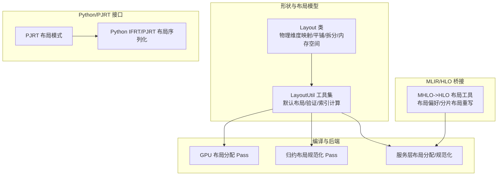
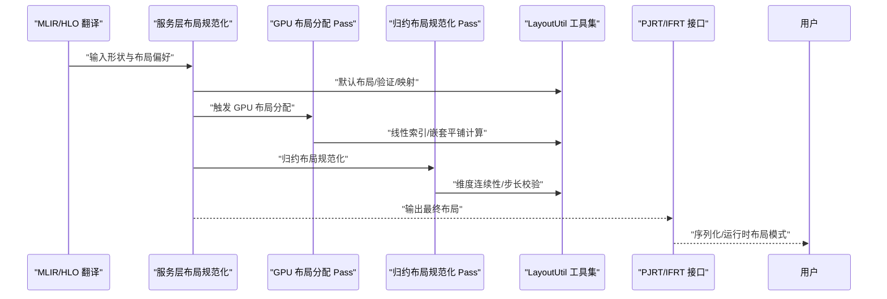
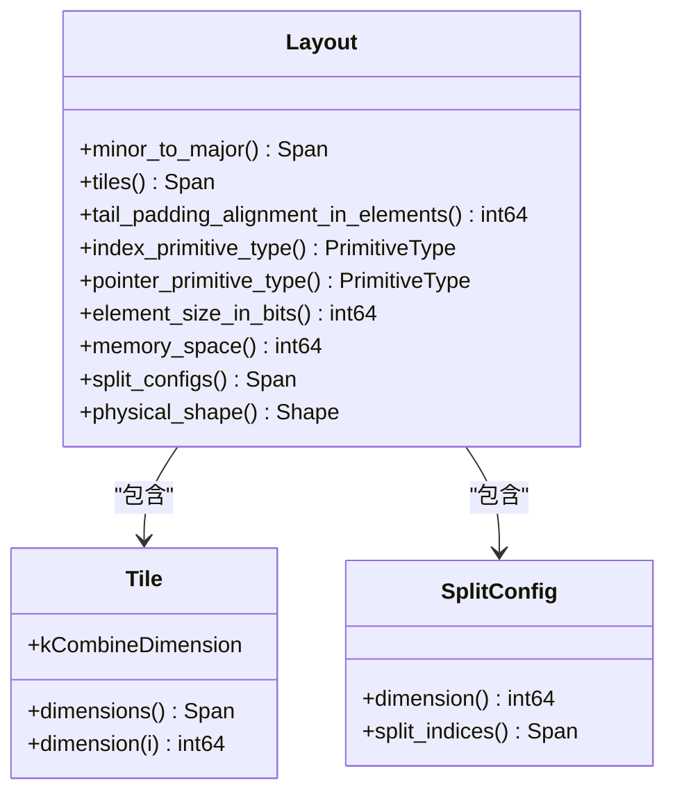
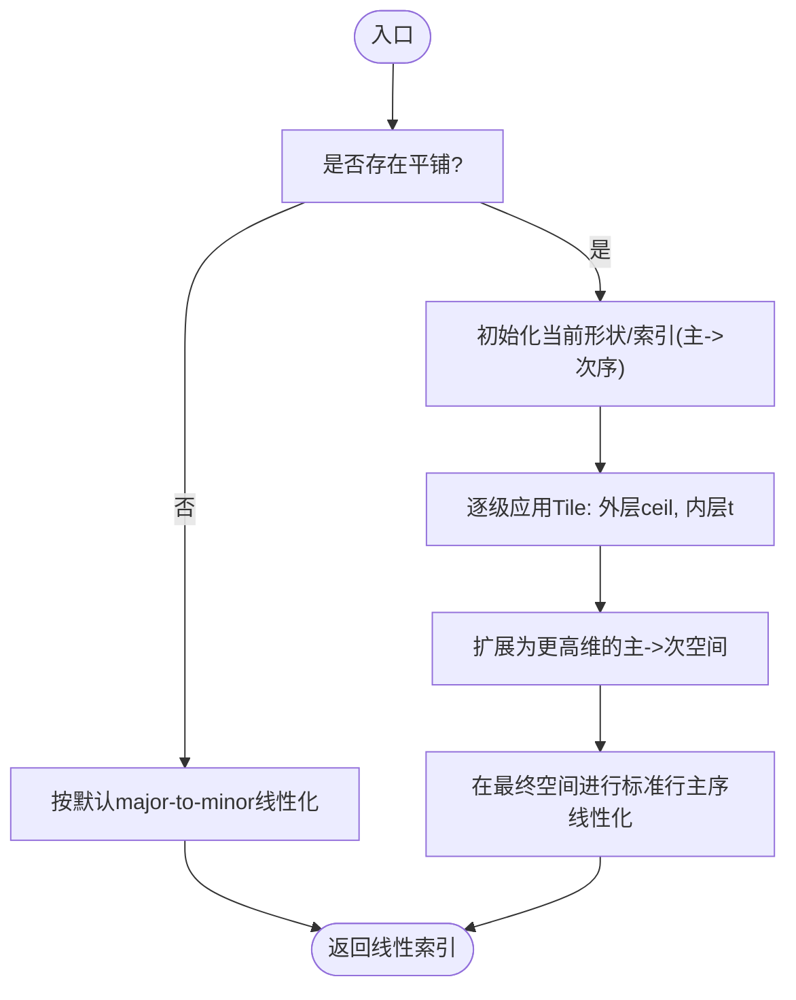
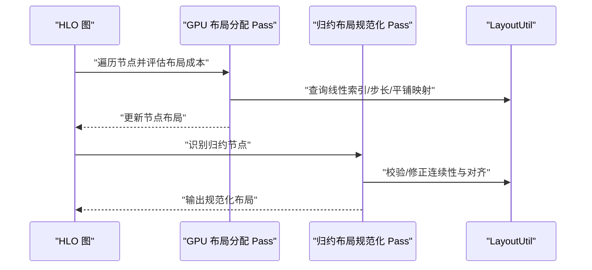
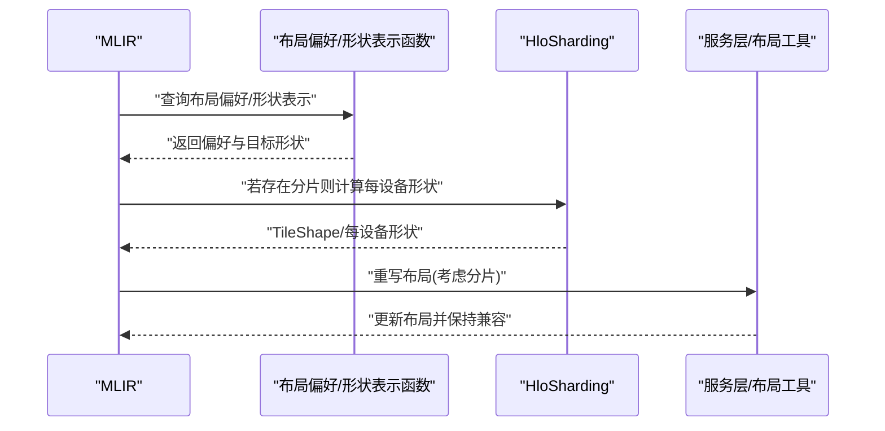
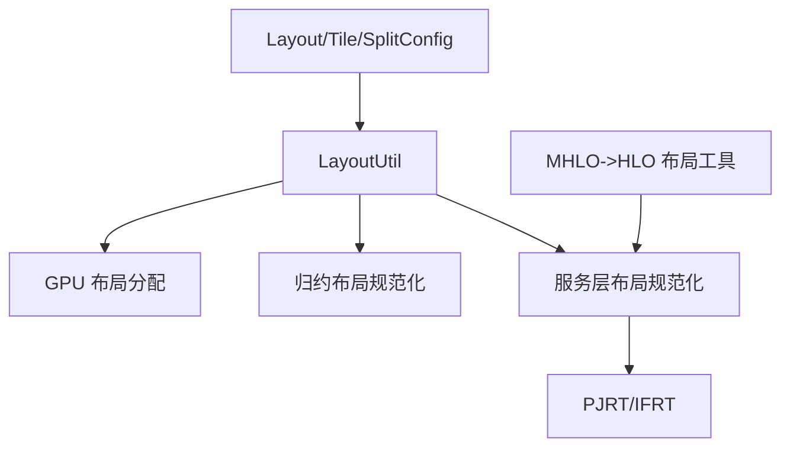

# 布局分配优化

<cite>
**本文引用的文件**
- [xla/layout.h](file://xla/layout.h)
- [xla/layout.cc](file://xla/layout.cc)
- [xla/layout_util.h](file://xla/layout_util.h)
- [xla/layout_util.cc](file://xla/layout_util.cc)
- [xla/hlo/translate/mhlo_to_hlo/layout_util.h](file://xla/hlo/translate/mhlo_to_hlo/layout_util.h)
- [xla/hlo/translate/mhlo_to_hlo/layout_util.cc](file://xla/hlo/translate/mhlo_to_hlo/layout_util.cc)
- [xla/backends/gpu/transforms/layout_assignment.h](file://xla/backends/gpu/transforms/layout_assignment.h)
- [xla/backends/gpu/transforms/layout_assignment.cc](file://xla/backends/gpu/transforms/layout_assignment.cc)
- [xla/backends/gpu/transforms/reduction_layout_normalizer.h](file://xla/backends/gpu/transforms/reduction_layout_normalizer.h)
- [xla/backends/gpu/transforms/reduction_layout_normalizer.cc](file://xla/backends/gpu/transforms/reduction_layout_normalizer.cc)
- [xla/service/layout_assignment.h](file://xla/service/layout_assignment.h)
- [xla/service/layout_normalization.h](file://xla/service/layout_normalization.h)
- [xla/pjrt/layout_mode.h](file://xla/pjrt/layout_mode.h)
- [xla/pjrt/layout_mode.cc](file://xla/pjrt/layout_mode.cc)
- [xla/python/ifrt/layout.h](file://xla/python/ifrt/layout.h)
- [xla/python/ifrt/layout_serdes.cc](file://xla/python/ifrt/layout_serdes.cc)
- [xla/python/pjrt_ifrt/pjrt_layout.h](file://xla/python/pjrt_ifrt/pjrt_layout.h)
- [xla/python/pjrt_ifrt/pjrt_layout_serdes.cc](file://xla/python/pjrt_ifrt/pjrt_layout_serdes.cc)
</cite>

## 目录
1. [引言](#引言)
2. [项目结构](#项目结构)
3. [核心组件](#核心组件)
4. [架构总览](#架构总览)
5. [详细组件分析](#详细组件分析)
6. [依赖关系分析](#依赖关系分析)
7. [性能考量](#性能考量)
8. [故障排查指南](#故障排查指南)
9. [结论](#结论)
10. [附录](#附录)

## 引言
本文件系统性阐述XLA中的布局分配与优化机制，聚焦于数据布局对性能的影响（内存访问模式、缓存效率、带宽利用率），解释布局分配算法的工作原理及在多级内存间的组织策略，梳理支持的布局类型与适用场景，说明布局转换的成本与时机选择，并讨论布局优化与编译期其他优化的协同关系。同时给出布局分析工具与调试技巧，以及面向不同硬件平台的最佳实践。

## 项目结构
XLA的布局子系统由以下层次构成：
- 形状与布局模型：定义布局的物理维度映射、平铺（tiling）、尾部填充、拆分配置、内存空间等。
- 布局工具集：提供默认布局生成、布局验证、线性索引计算、逻辑到物理维度映射等实用函数。
- 编译后端与服务层：在GPU等后端中进行布局分配与规范化；在服务层统一布局规范化流程。
- MLIR/HLO桥接：在从MHLO翻译到HLO时处理布局偏好与分片后的布局重写。
- Python/PJRT接口：提供布局序列化/反序列化与运行时布局模式控制。

**图表来源**
- [xla/layout.h](file://xla/layout.h#L184-L512)
- [xla/layout_util.h](file://xla/layout_util.h#L38-L296)
- [xla/backends/gpu/transforms/layout_assignment.h](file://xla/backends/gpu/transforms/layout_assignment.h)
- [xla/backends/gpu/transforms/reduction_layout_normalizer.h](file://xla/backends/gpu/transforms/reduction_layout_normalizer.h)
- [xla/service/layout_assignment.h](file://xla/service/layout_assignment.h)
- [xla/service/layout_normalization.h](file://xla/service/layout_normalization.h)
- [xla/hlo/translate/mhlo_to_hlo/layout_util.h](file://xla/hlo/translate/mhlo_to_hlo/layout_util.h#L33-L82)
- [xla/pjrt/layout_mode.h](file://xla/pjrt/layout_mode.h)
- [xla/python/ifrt/layout.h](file://xla/python/ifrt/layout.h)
- [xla/python/pjrt_ifrt/pjrt_layout.h](file://xla/python/pjrt_ifrt/pjrt_layout.h)

**章节来源**
- [xla/layout.h](file://xla/layout.h#L184-L512)
- [xla/layout_util.h](file://xla/layout_util.h#L38-L296)

## 核心组件
- 布局类（Layout）：描述张量在内存中的物理组织方式，包含 minor-to-major 维度顺序、可选的平铺（Tile）、尾部填充对齐、索引/指针类型、元素位宽、内存空间、拆分配置（SplitConfig）、物理形状等。
- 平铺（Tile）：用于分块存储，提升缓存命中与向量化效率。
- 拆分配置（SplitConfig）：描述在多内存/设备间如何切分维度。
- 布局工具集（LayoutUtil）：提供默认布局、布局验证、逻辑/物理维度映射、线性索引计算、嵌套平铺索引映射、内存空间查询、字节步长校验、最大分片尺寸等。

**章节来源**
- [xla/layout.h](file://xla/layout.h#L44-L110)
- [xla/layout.h](file://xla/layout.h#L122-L182)
- [xla/layout.h](file://xla/layout.h#L184-L512)
- [xla/layout_util.h](file://xla/layout_util.h#L38-L296)

## 架构总览
XLA在编译期通过Pass完成布局分配与规范化，运行期通过PJRT与Python接口管理布局偏好与序列化。整体流程如下：

**图表来源**
- [xla/service/layout_normalization.h](file://xla/service/layout_normalization.h)
- [xla/backends/gpu/transforms/layout_assignment.h](file://xla/backends/gpu/transforms/layout_assignment.h)
- [xla/backends/gpu/transforms/reduction_layout_normalizer.h](file://xla/backends/gpu/transforms/reduction_layout_normalizer.h)
- [xla/layout_util.h](file://xla/layout_util.h#L247-L261)
- [xla/hlo/translate/mhlo_to_hlo/layout_util.h](file://xla/hlo/translate/mhlo_to_hlo/layout_util.h#L33-L82)
- [xla/pjrt/layout_mode.h](file://xla/pjrt/layout_mode.h)

## 详细组件分析

### 布局类与平铺/拆分
- 物理维度映射：minor_to_major决定“最快变化”到“最慢变化”的维度顺序，直接影响内存访问局部性。
- 平铺（Tile）：通过在尾部维度上分块，提升缓存命中与SIMD向量化效率；支持组合维度（kCombineDimension）以合并相邻维度后再分块。
- 尾部填充对齐：确保总元素数按指定粒度对齐，便于非平铺布局也能满足硬件/内核对齐要求。
- 拆分配置（SplitConfig）：在物理维度上按索引切分，适配多内存/设备场景。
- 内存空间：标识布局所处的内存域（主机/设备/快速内存等）。

**图表来源**
- [xla/layout.h](file://xla/layout.h#L44-L110)
- [xla/layout.h](file://xla/layout.h#L122-L182)
- [xla/layout.h](file://xla/layout.h#L184-L512)

**章节来源**
- [xla/layout.h](file://xla/layout.h#L44-L110)
- [xla/layout.h](file://xla/layout.h#L122-L182)
- [xla/layout.h](file://xla/layout.h#L184-L512)

### 布局工具集（LayoutUtil）
- 默认布局：major-to-minor（dim 0 最大）作为默认布局，适配多数后端的内存访问习惯。
- 验证：检查minor_to_major是否为合法排列、平铺是否有效、元素位宽与内存空间等约束。
- 映射：Major()/Minor()提供逻辑维度到物理维度的双向映射；MakeLogicalToPhysical()返回逆映射。
- 线性索引：LinearIndex（仅顶层平铺）与LinearIndexForNestedTiling（嵌套平铺）分别用于索引到线性偏移的正向与逆向映射。
- 步长校验：ByteStridesIsMajorToMinor用于判断给定字节步长是否符合“主到次”降序。
- 分片：MaxSplitSize/MaxElementsInPerSplit用于估算每分片最大元素数，辅助内存规划。

**图表来源**
- [xla/layout_util.cc](file://xla/layout_util.cc#L576-L650)

**章节来源**
- [xla/layout_util.h](file://xla/layout_util.h#L38-L296)
- [xla/layout_util.cc](file://xla/layout_util.cc#L526-L650)
- [xla/layout_util.cc](file://xla/layout_util.cc#L756-L768)
- [xla/layout_util.cc](file://xla/layout_util.cc#L770-L804)

### GPU布局分配与归约规范化
- GPU布局分配Pass：在GPU后端中根据算子特性与硬件特性（如SMEM/L1/L2/寄存器）选择或调整布局，以提升访存与吞吐。
- 归约布局规范化Pass：保证归约操作的输入/输出布局满足硬件对连续性、对齐与步长的要求，避免跨块/跨线程的非连续访问。

**图表来源**
- [xla/backends/gpu/transforms/layout_assignment.h](file://xla/backends/gpu/transforms/layout_assignment.h)
- [xla/backends/gpu/transforms/layout_assignment.cc](file://xla/backends/gpu/transforms/layout_assignment.cc)
- [xla/backends/gpu/transforms/reduction_layout_normalizer.h](file://xla/backends/gpu/transforms/reduction_layout_normalizer.h)
- [xla/backends/gpu/transforms/reduction_layout_normalizer.cc](file://xla/backends/gpu/transforms/reduction_layout_normalizer.cc)
- [xla/layout_util.h](file://xla/layout_util.h#L247-L261)

**章节来源**
- [xla/backends/gpu/transforms/layout_assignment.h](file://xla/backends/gpu/transforms/layout_assignment.h)
- [xla/backends/gpu/transforms/layout_assignment.cc](file://xla/backends/gpu/transforms/layout_assignment.cc)
- [xla/backends/gpu/transforms/reduction_layout_normalizer.h](file://xla/backends/gpu/transforms/reduction_layout_normalizer.h)
- [xla/backends/gpu/transforms/reduction_layout_normalizer.cc](file://xla/backends/gpu/transforms/reduction_layout_normalizer.cc)

### MHLO/HLO桥接中的布局偏好与分片布局重写
- 布局偏好：在TPU等平台上，允许选择紧凑分块填充布局或线性布局，以匹配设备原生布局或主机布局。
- 分片布局重写：当存在分片（sharding）时，根据每设备形状与布局偏好重写整体布局，确保各设备视图一致且高效。

**图表来源**
- [xla/hlo/translate/mhlo_to_hlo/layout_util.h](file://xla/hlo/translate/mhlo_to_hlo/layout_util.h#L33-L82)
- [xla/hlo/translate/mhlo_to_hlo/layout_util.cc](file://xla/hlo/translate/mhlo_to_hlo/layout_util.cc#L34-L67)

**章节来源**
- [xla/hlo/translate/mhlo_to_hlo/layout_util.h](file://xla/hlo/translate/mhlo_to_hlo/layout_util.h#L33-L82)
- [xla/hlo/translate/mhlo_to_hlo/layout_util.cc](file://xla/hlo/translate/mhlo_to_hlo/layout_util.cc#L34-L67)

### 运行时布局模式与序列化
- PJRT布局模式：在运行时控制布局策略（如是否启用紧凑布局、线性布局等）。
- Python IFRT/PJRT布局序列化：提供布局对象的序列化/反序列化能力，便于跨进程/跨语言传递。

**图表来源**
- [xla/pjrt/layout_mode.h](file://xla/pjrt/layout_mode.h)
- [xla/pjrt/layout_mode.cc](file://xla/pjrt/layout_mode.cc)
- [xla/python/ifrt/layout.h](file://xla/python/ifrt/layout.h)
- [xla/python/ifrt/layout_serdes.cc](file://xla/python/ifrt/layout_serdes.cc)
- [xla/python/pjrt_ifrt/pjrt_layout.h](file://xla/python/pjrt_ifrt/pjrt_layout.h)
- [xla/python/pjrt_ifrt/pjrt_layout_serdes.cc](file://xla/python/pjrt_ifrt/pjrt_layout_serdes.cc)

**章节来源**
- [xla/pjrt/layout_mode.h](file://xla/pjrt/layout_mode.h)
- [xla/pjrt/layout_mode.cc](file://xla/pjrt/layout_mode.cc)
- [xla/python/ifrt/layout.h](file://xla/python/ifrt/layout.h)
- [xla/python/ifrt/layout_serdes.cc](file://xla/python/ifrt/layout_serdes.cc)
- [xla/python/pjrt_ifrt/pjrt_layout.h](file://xla/python/pjrt_ifrt/pjrt_layout.h)
- [xla/python/pjrt_ifrt/pjrt_layout_serdes.cc](file://xla/python/pjrt_ifrt/pjrt_layout_serdes.cc)

## 依赖关系分析
- 布局类与工具集：Layout/Tile/SplitConfig是基础数据结构，LayoutUtil提供对这些结构的构造、验证、映射与索引计算。
- 后端Pass：GPU布局分配与归约规范化依赖LayoutUtil的索引/步长/映射能力。
- 服务层：统一布局规范化流程，协调后端Pass与MLIR/HLO桥接。
- 运行时：PJRT/IFRT负责布局模式与序列化，确保跨边界一致性。

**图表来源**
- [xla/layout.h](file://xla/layout.h#L184-L512)
- [xla/layout_util.h](file://xla/layout_util.h#L38-L296)
- [xla/backends/gpu/transforms/layout_assignment.h](file://xla/backends/gpu/transforms/layout_assignment.h)
- [xla/backends/gpu/transforms/reduction_layout_normalizer.h](file://xla/backends/gpu/transforms/reduction_layout_normalizer.h)
- [xla/service/layout_normalization.h](file://xla/service/layout_normalization.h)
- [xla/hlo/translate/mhlo_to_hlo/layout_util.h](file://xla/hlo/translate/mhlo_to_hlo/layout_util.h#L33-L82)
- [xla/pjrt/layout_mode.h](file://xla/pjrt/layout_mode.h)

**章节来源**
- [xla/layout.h](file://xla/layout.h#L184-L512)
- [xla/layout_util.h](file://xla/layout_util.h#L38-L296)
- [xla/backends/gpu/transforms/layout_assignment.h](file://xla/backends/gpu/transforms/layout_assignment.h)
- [xla/backends/gpu/transforms/reduction_layout_normalizer.h](file://xla/backends/gpu/transforms/reduction_layout_normalizer.h)
- [xla/service/layout_normalization.h](file://xla/service/layout_normalization.h)
- [xla/hlo/translate/mhlo_to_hlo/layout_util.h](file://xla/hlo/translate/mhlo_to_hlo/layout_util.h#L33-L82)
- [xla/pjrt/layout_mode.h](file://xla/pjrt/layout_mode.h)

## 性能考量
- 内存访问模式
  - minor_to_major决定“最快变化”维度，应尽量与数据访问模式一致（如卷积的通道维常设为最不重要维以提升通道连续性）。
  - 平铺（Tile）可将局部性差的全局访问转化为局部性好的块访问，显著提升缓存命中率。
- 缓存效率
  - 尾部填充对齐与平铺共同作用，使数据在缓存行/寄存器块内连续，减少跨行/跨块的无效加载。
  - 嵌套平铺（多级Tile）可进一步细化块大小，适配不同层级缓存（L1/L2/SMEM）。
- 带宽利用率
  - 步长校验（ByteStridesIsMajorToMinor）可帮助识别非最优布局导致的非连续访问，从而降低带宽利用率。
  - 归约规范化确保归约轴上的连续访问，避免跨线程/跨块的分散写入。
- 算法复杂度
  - 线性索引计算（含嵌套平铺）的时间复杂度与维度数量成线性关系，空间复杂度与平铺层数相关。
  - LayoutUtil的映射与校验函数均为O(d)，适合在编译期批量执行。

[本节为通用性能讨论，无需具体文件分析]

## 故障排查指南
- 布局验证失败
  - 现象：LayoutUtil::ValidateLayoutForShape返回错误，提示minor_to_major越界、重复值、平铺非法或元素位宽非法。
  - 排查：检查minor_to_major是否为0..n-1的排列；确认平铺维度均大于0且能整除对应形状维度；检查元素位宽与内存空间设置。
- 线性索引异常
  - 现象：嵌套平铺下的线性索引与预期不符。
  - 排查：确认平铺顺序与维度映射正确；核对LinearIndexForNestedTiling的输入索引与形状维度一致。
- 归约性能低
  - 现象：归约操作吞吐低，疑似非连续访问。
  - 排查：使用ByteStridesIsMajorToMinor校验步长；检查归约维度是否连续；必要时调整minor_to_major或插入归约规范化Pass。
- 分片布局不一致
  - 现象：多设备上布局不一致导致通信/别名失效。
  - 排查：在MHLO->HLO阶段调用RewriteLayoutWithShardedShape，确保每设备形状的布局一致；必要时插入Reshape以修正表示。

**章节来源**
- [xla/layout_util.cc](file://xla/layout_util.cc#L222-L293)
- [xla/layout_util.cc](file://xla/layout_util.cc#L576-L650)
- [xla/layout_util.cc](file://xla/layout_util.cc#L756-L768)
- [xla/hlo/translate/mhlo_to_hlo/layout_util.cc](file://xla/hlo/translate/mhlo_to_hlo/layout_util.cc#L34-L67)

## 结论
XLA的布局子系统通过“物理维度映射+平铺+尾部填充+拆分配置”的组合，在编译期与运行期协同实现高性能的数据组织。合理选择minor_to_major、设计平铺策略、进行归约规范化与分片布局重写，是获得高缓存命中、高带宽利用率的关键。结合LayoutUtil提供的验证与映射工具，可在不同硬件平台上实现稳定高效的布局优化。

[本节为总结，无需具体文件分析]

## 附录

### 支持的布局类型与适用场景
- 默认布局（major-to-minor）：适用于大多数后端与算子，提供稳定的内存访问顺序。
- 平铺布局（Tile）：适用于需要提升缓存局部性的密集算子（卷积、GEMM等）。
- 紧凑分块填充布局（TPU偏好）：在TPU上更贴近硬件原生布局，减少转换开销。
- 线性布局（主机偏好）：在主机侧更常见，TPU上可能需要转换。

**章节来源**
- [xla/layout_util.h](file://xla/layout_util.h#L74-L88)
- [xla/hlo/translate/mhlo_to_hlo/layout_util.h](file://xla/hlo/translate/mhlo_to_hlo/layout_util.h#L33-L51)

### 布局转换成本与时机
- 成本：布局转换通常涉及重排/重写，可能引入额外的reshape/transpose或数据搬运。
- 时机：优先在编译期（Pass链）完成布局分配与规范化；在MLIR/HLO桥接阶段处理分片布局重写；运行期通过PJRT模式与序列化维持一致性。

**章节来源**
- [xla/hlo/translate/mhlo_to_hlo/layout_util.cc](file://xla/hlo/translate/mhlo_to_hlo/layout_util.cc#L69-L117)
- [xla/pjrt/layout_mode.h](file://xla/pjrt/layout_mode.h)

### 布局优化与其他编译优化的关系
- 与分片（Sharding）：分片后需重写布局以匹配每设备形状；布局偏好影响分片后的数据分布。
- 与归约（Reduction）：归约规范化确保归约轴连续，避免跨块写放大。
- 与内联/融合：合适的布局可促进算子融合与内联，减少中间缓冲。

**章节来源**
- [xla/backends/gpu/transforms/reduction_layout_normalizer.h](file://xla/backends/gpu/transforms/reduction_layout_normalizer.h)
- [xla/hlo/translate/mhlo_to_hlo/layout_util.h](file://xla/hlo/translate/mhlo_to_hlo/layout_util.h#L69-L73)

### 布局分析工具与调试技巧
- 使用LayoutUtil::ValidateLayoutForShape进行布局合法性检查。
- 使用LinearIndex/LinearIndexForNestedTiling验证索引映射正确性。
- 使用ByteStridesIsMajorToMinor检查步长是否符合主到次降序。
- 在服务层与后端Pass中打印布局字符串（Layout::ToString）辅助定位问题。

**章节来源**
- [xla/layout_util.cc](file://xla/layout_util.cc#L222-L293)
- [xla/layout.cc](file://xla/layout.cc#L278-L388)
- [xla/layout_util.cc](file://xla/layout_util.cc#L756-L768)

### 面向特定硬件平台的最佳实践
- GPU
  - 利用平铺与尾部填充对齐，提升共享内存/寄存器局部性；归约规范化确保连续写。
- TPU
  - 优先紧凑分块填充布局；在主机与设备之间进行一致的布局转换。
- 主机/CPU
  - 采用线性布局；注意对齐与缓存行大小，避免跨行访问。

**章节来源**
- [xla/hlo/translate/mhlo_to_hlo/layout_util.h](file://xla/hlo/translate/mhlo_to_hlo/layout_util.h#L33-L51)
- [xla/backends/gpu/transforms/layout_assignment.h](file://xla/backends/gpu/transforms/layout_assignment.h)
- [xla/backends/gpu/transforms/reduction_layout_normalizer.h](file://xla/backends/gpu/transforms/reduction_layout_normalizer.h)