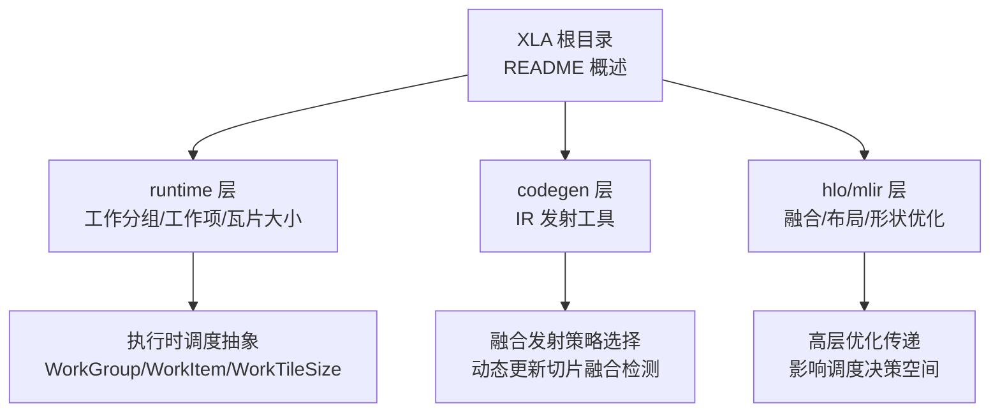
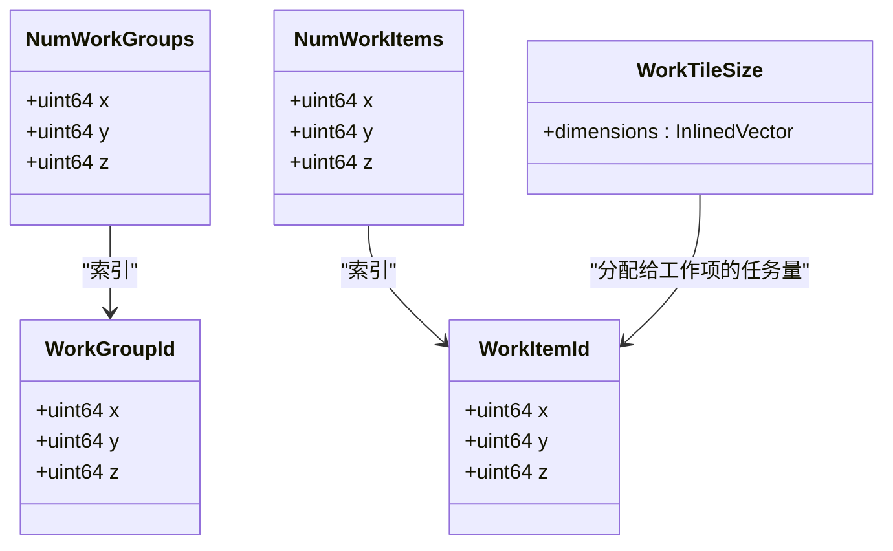
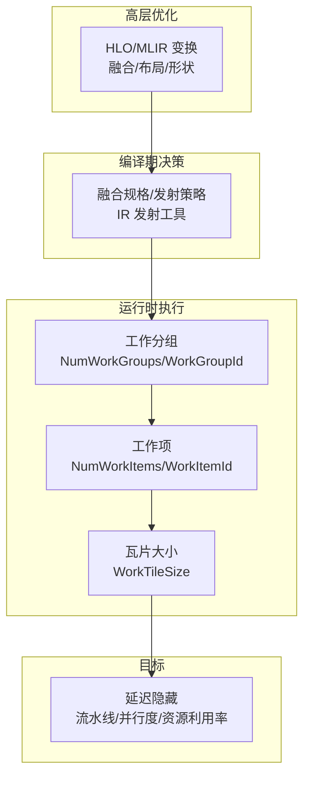
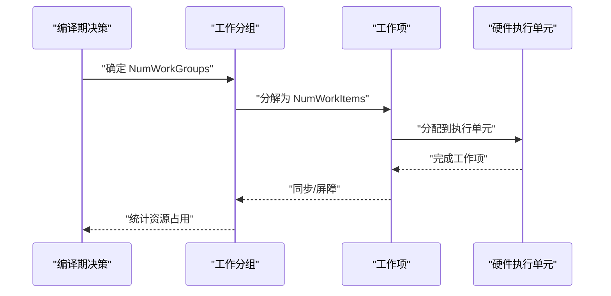
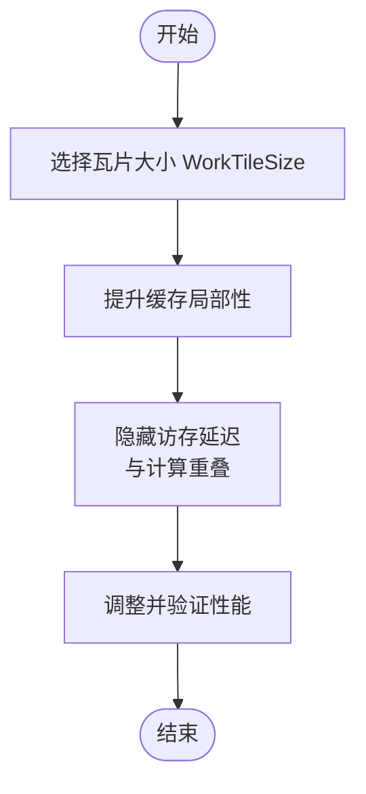
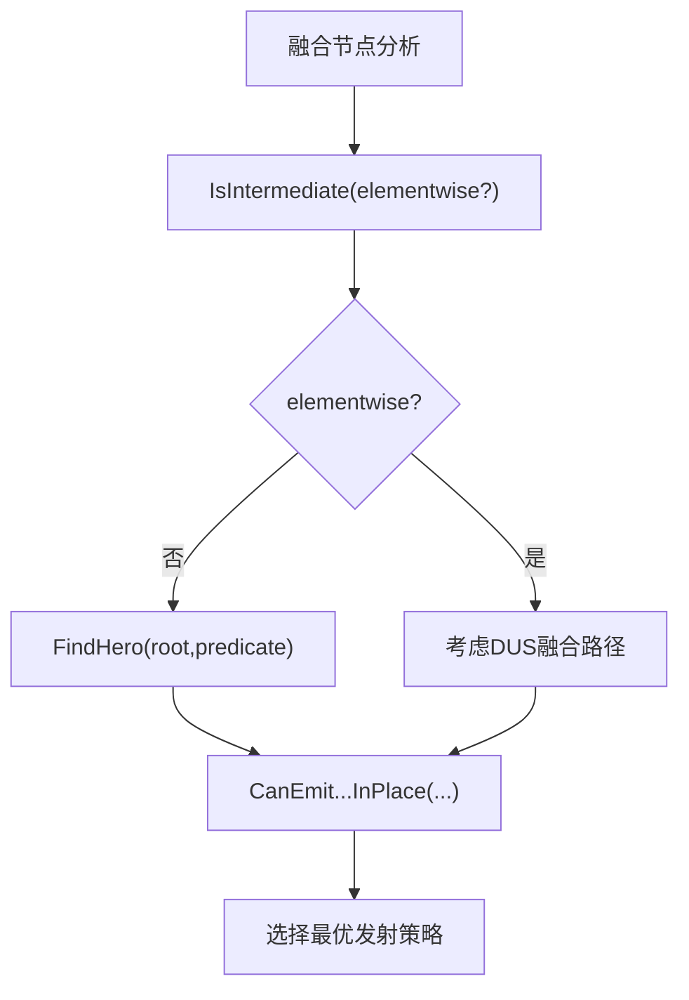

# 延迟隐藏调度

<cite>
**本文引用的文件**
- [xla/README.md](file://xla/README.md)
- [xla/runtime/work_group.h](file://xla/runtime/work_group.h)
- [xla/runtime/work_item.h](file://xla/runtime/work_item.h)
- [xla/runtime/work_tile_size.h](file://xla/runtime/work_tile_size.h)
- [xla/codegen/ir_emission_utils.h](file://xla/codegen/ir_emission_utils.h)
</cite>

## 目录
1. [引言](#引言)
2. [项目结构](#项目结构)
3. [核心组件](#核心组件)
4. [架构总览](#架构总览)
5. [详细组件分析](#详细组件分析)
6. [依赖关系分析](#依赖关系分析)
7. [性能考量](#性能考量)
8. [故障排查指南](#故障排查指南)
9. [结论](#结论)
10. [附录](#附录)

## 引言
本文件围绕XLA（加速线性代数）中的“延迟隐藏调度”主题，系统梳理与之相关的核心概念、数据结构与执行层次，并结合现有源码注释与结构化信息，给出可操作的分析框架与实践建议。需要特别说明的是：当前仓库中与“延迟隐藏调度”的直接实现细节并未以独立模块形式呈现；本文基于现有头文件与目录组织，从执行层级、工作单元划分、发射策略等角度，构建一个面向性能优化的分析视图，帮助读者理解在XLA中如何通过工作分组、工作项与瓦片大小等维度来设计与评估延迟隐藏策略。

## 项目结构
XLA当前处于迁移阶段，顶层目录正在重构，核心能力逐步迁移到backends、hlo、mlir、pjrt、runtime等子目录。与延迟隐藏调度直接相关的现有线索主要体现在以下位置：
- runtime层：定义了工作分组、工作项与瓦片大小等基础抽象，这些是实现“流水线并行与资源占用优化”的关键数据结构。
- codegen层：包含IR发射工具函数，用于判断融合节点是否适合特定发射路径（如动态更新切片融合），这与“计算重叠机会识别”和“内存访问模式优化”密切相关。
- hlo与mlir：作为高层IR与变换层，提供融合、布局、形状等优化的基础，间接影响调度器的决策空间。

图表来源
- [xla/README.md](file://xla/README.md#L19-L103)
- [xla/runtime/work_group.h](file://xla/runtime/work_group.h#L25-L28)
- [xla/runtime/work_item.h](file://xla/runtime/work_item.h#L25-L28)
- [xla/runtime/work_tile_size.h](file://xla/runtime/work_tile_size.h#L28-L32)
- [xla/codegen/ir_emission_utils.h](file://xla/codegen/ir_emission_utils.h#L35-L51)

章节来源
- [xla/README.md](file://xla/README.md#L19-L103)

## 核心组件
本节聚焦于与延迟隐藏调度直接相关的三类基础数据结构及其职责：
- 工作分组（WorkGroup）：在GPU上对应block，在CPU上对应线程池任务粒度。它是实现“并行度与资源占用平衡”的基本单位。
- 工作项（WorkItem）：在GPU上对应SIMT线程，在CPU上对应内核循环的一次迭代。它是“流水线调度”的最小执行单元。
- 瓦片大小（WorkTileSize）：定义每个工作项应处理的元素数量。合理的瓦片大小有助于隐藏访存延迟、提升缓存命中率。

图表来源
- [xla/runtime/work_group.h](file://xla/runtime/work_group.h#L29-L57)
- [xla/runtime/work_item.h](file://xla/runtime/work_item.h#L29-L57)
- [xla/runtime/work_tile_size.h](file://xla/runtime/work_tile_size.h#L32-L43)

章节来源
- [xla/runtime/work_group.h](file://xla/runtime/work_group.h#L25-L57)
- [xla/runtime/work_item.h](file://xla/runtime/work_item.h#L25-L57)
- [xla/runtime/work_tile_size.h](file://xla/runtime/work_tile_size.h#L28-L43)

## 架构总览
下图展示了延迟隐藏调度在XLA中的潜在作用位置：从高层IR优化到运行时执行抽象，再到具体发射策略选择。该图强调了“工作分组—工作项—瓦片大小”三层抽象如何协同，以实现计算与访存的重叠，从而隐藏硬件延迟。

图表来源
- [xla/codegen/ir_emission_utils.h](file://xla/codegen/ir_emission_utils.h#L35-L72)
- [xla/runtime/work_group.h](file://xla/runtime/work_group.h#L25-L57)
- [xla/runtime/work_item.h](file://xla/runtime/work_item.h#L25-L57)
- [xla/runtime/work_tile_size.h](file://xla/runtime/work_tile_size.h#L28-L43)

## 详细组件分析

### 组件一：工作分组与工作项（并行度与资源占用）
- 工作分组（WorkGroup）：注释明确指出其在GPU上对应block、在CPU上对应线程池任务。这是实现“资源占用控制”的关键：过多的工作分组会过度占用SM/执行单元，过少则无法充分利用并行资源。
- 工作项（WorkItem）：注释指出其在GPU上对应SIMT线程，在CPU上对应内核循环一次迭代。这是“流水线调度”的最小单位，直接影响指令级并行与寄存器压力。

图表来源
- [xla/runtime/work_group.h](file://xla/runtime/work_group.h#L25-L28)
- [xla/runtime/work_item.h](file://xla/runtime/work_item.h#L25-L28)

章节来源
- [xla/runtime/work_group.h](file://xla/runtime/work_group.h#L25-L57)
- [xla/runtime/work_item.h](file://xla/runtime/work_item.h#L25-L57)

### 组件二：瓦片大小（内存层次与访存延迟隐藏）
- 瓦片大小（WorkTileSize）：注释说明其定义“每个工作项应处理的元素数量”，且空瓦片按单元素处理。合理的瓦片大小能提升缓存局部性，减少访存等待时间，是实现“计算与访存重叠”的关键手段之一。

图表来源
- [xla/runtime/work_tile_size.h](file://xla/runtime/work_tile_size.h#L28-L43)

章节来源
- [xla/runtime/work_tile_size.h](file://xla/runtime/work_tile_size.h#L28-L43)

### 组件三：IR发射策略与融合（计算重叠机会识别）
- IR发射工具（ir_emission_utils.h）：提供了判断中间节点是否为elementwise、查找“英雄节点”（hero）、以及检测动态更新切片融合（DUS）的能力。这些工具可用于识别“可内联/可重排/可融合”的计算片段，从而创造更多“计算重叠机会”。

图表来源
- [xla/codegen/ir_emission_utils.h](file://xla/codegen/ir_emission_utils.h#L35-L72)

章节来源
- [xla/codegen/ir_emission_utils.h](file://xla/codegen/ir_emission_utils.h#L35-L72)

## 依赖关系分析
- 运行时抽象依赖于编译期决策：编译器在hlo/mlir层进行融合与布局优化后，通过ir_emission_utils.h提供的工具进一步细化发射策略；随后由runtime层的WorkGroup/WorkItem/WorkTileSize承载到具体执行。
- 资源占用与延迟隐藏之间存在权衡：工作分组过大可能导致资源争用，工作项过小可能增加同步开销；瓦片大小不当会降低缓存命中率，导致访存延迟无法被有效隐藏。

图表来源
- [xla/codegen/ir_emission_utils.h](file://xla/codegen/ir_emission_utils.h#L35-L72)
- [xla/runtime/work_group.h](file://xla/runtime/work_group.h#L25-L57)
- [xla/runtime/work_item.h](file://xla/runtime/work_item.h#L25-L57)
- [xla/runtime/work_tile_size.h](file://xla/runtime/work_tile_size.h#L28-L43)

章节来源
- [xla/codegen/ir_emission_utils.h](file://xla/codegen/ir_emission_utils.h#L35-L72)
- [xla/runtime/work_group.h](file://xla/runtime/work_group.h#L25-L57)
- [xla/runtime/work_item.h](file://xla/runtime/work_item.h#L25-L57)
- [xla/runtime/work_tile_size.h](file://xla/runtime/work_tile_size.h#L28-L43)

## 性能考量
- 并行度优化
  - 工作分组规模应与硬件执行单元数量匹配，避免过度并行导致资源争用。
  - 工作项粒度需兼顾指令级并行与寄存器压力，确保流水线稳定推进。
- 资源利用率提升
  - 合理设置瓦片大小以提升缓存命中率，减少访存等待。
  - 利用融合与内联策略减少中间缓冲与同步次数。
- 计算重叠机会
  - 通过elementwise检测与DUS融合识别，将多个小计算合并为更大、更连续的计算块，提高访存与计算的重叠概率。
- 策略选择标准
  - 循环展开：在保证寄存器与缓存压力的前提下，适度展开以提升ILP与吞吐。
  - 向量化：根据数据类型与硬件支持，尽量采用向量宽度以提升内存带宽利用率。
  - 内存层次优化：优先提升L1/L2局部性，再考虑全局内存的合并访问模式。

## 故障排查指南
- 缓存未命中导致延迟高
  - 检查瓦片大小是否合理，尝试增大或调整维度顺序以提升局部性。
- 并行度不足或过度
  - 校验工作分组与工作项规模，确认未超过硬件执行单元上限。
- 同步开销过高
  - 审视融合策略与发射路径，减少不必要的屏障与临时缓冲。
- 元素级操作过多
  - 使用elementwise检测与融合工具，将小操作合并为更大的向量化块。

## 结论
XLA的延迟隐藏调度并非单一模块，而是由“高层IR优化—编译期发射策略—运行时执行抽象”共同构成的体系。通过工作分组、工作项与瓦片大小的协同设计，配合融合与内联策略，可以在不同硬件平台上实现更优的计算与访存重叠，从而有效隐藏延迟、提升整体吞吐。建议在实际工程中以性能指标为驱动，持续迭代上述参数与策略组合。

## 附录
- 相关文件路径与职责概览
  - [xla/runtime/work_group.h](file://xla/runtime/work_group.h#L25-L57)：工作分组与工作项的定义与用途说明
  - [xla/runtime/work_item.h](file://xla/runtime/work_item.h#L25-L57)：工作项的定义与用途说明
  - [xla/runtime/work_tile_size.h](file://xla/runtime/work_tile_size.h#L28-L43)：瓦片大小的定义与用途说明
  - [xla/codegen/ir_emission_utils.h](file://xla/codegen/ir_emission_utils.h#L35-L72)：融合与发射策略相关的工具函数声明
  - [xla/README.md](file://xla/README.md#L19-L103)：XLA目录结构与迁移说明