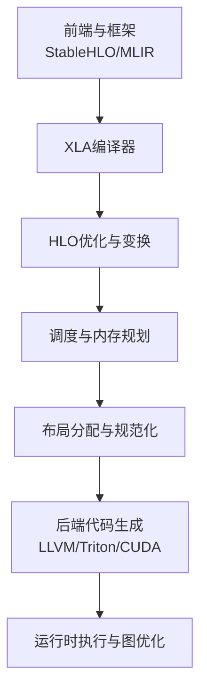
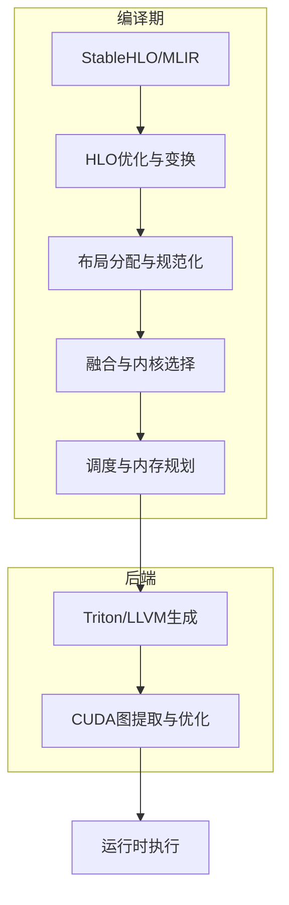
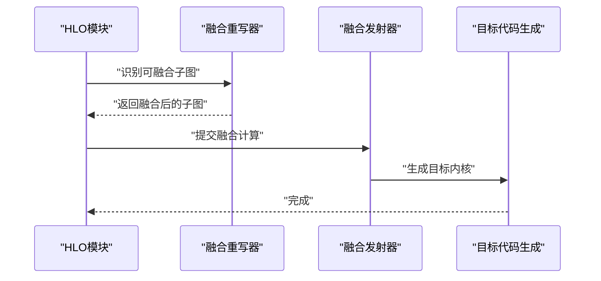
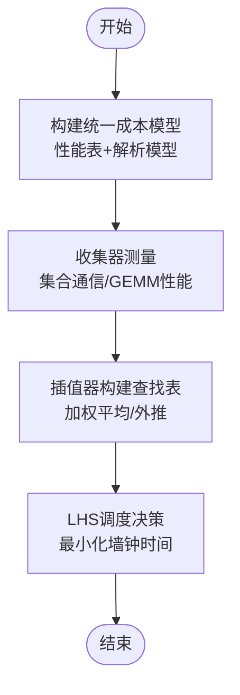
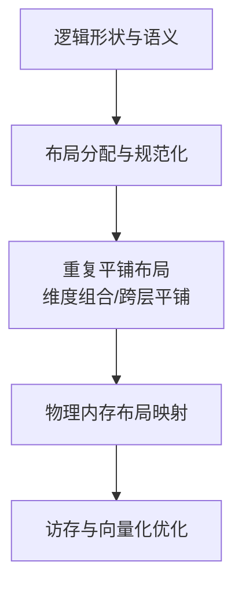
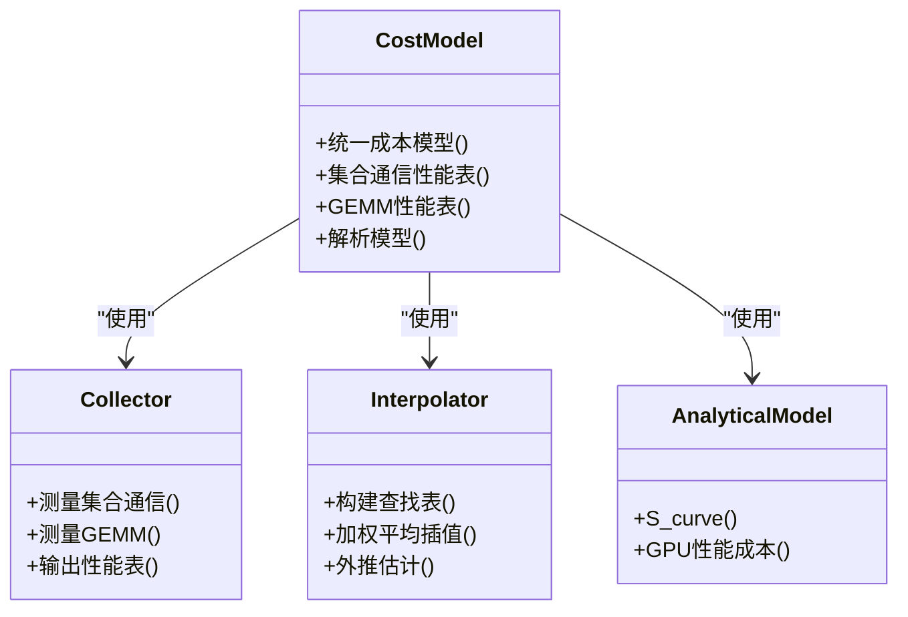
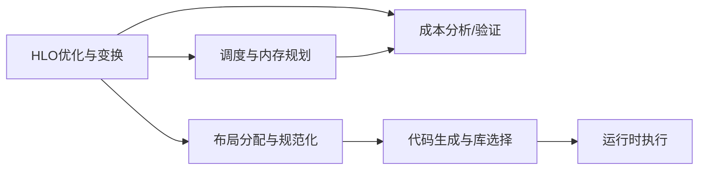

# 性能优化

<cite>
**本文引用的文件**
- [xla\README.md](file://xla/README.md)
- [docs\lhs_cost_model.md](file://docs/lhs_cost_model.md)
- [docs\tiled_layout.md](file://docs/tiled_layout.md)
- [docs\hlo_passes.md](file://docs/hlo_passes.md)
- [docs\gpu_architecture.md](file://docs/gpu_architecture.md)
- [xla\service\latency_hiding_scheduler.h](file://xla/service/latency_hiding_scheduler.h)
- [xla\hlo\transforms\simplifiers\hlo_memory_scheduler.h](file://xla/hlo/transforms/simplifiers/hlo_memory_scheduler.h)
- [xla\service\gpu\gpu_latency_hiding_scheduler.h](file://xla/service/gpu/gpu_latency_hiding_scheduler.h)
- [xla\service\gpu\model\gpu_hlo_cost_analysis.h](file://xla/service/gpu/model/gpu_hlo_cost_analysis.h)
- [xla\service\hlo_cost_analysis.h](file://xla/service/hlo_cost_analysis.h)
- [xla\service\gpu\model\gpu_dot_fusion_cost_model.h](file://xla/service/gpu/model/gpu_dot_fusion_cost_model.h)
- [xla\service\gpu\model\sol_gpu_cost_model.h](file://xla/service/gpu/model/sol_gpu_cost_model.h)
- [xla\service\gpu\model\gpu_cost_model_stats_collection.h](file://xla/service/gpu/model/gpu_cost_model_stats_collection.h)
- [xla\service\gpu\model\sol_gpu_cost_model_stats_collection.h](file://xla/service/gpu/model/sol_gpu_cost_model_stats_collection.h)
- [xla\backends\gpu\transforms\layout_assignment.h](file://xla/backends/gpu/transforms/layout_assignment.h)
- [xla\service\layout_assignment.h](file://xla/service/layout_assignment.h)
- [xla\layout.h](file://xla/layout.h)
- [xla\layout_util.h](file://xla/layout_util.h)
- [xla\service\gpu\conv_layout_normalization.h](file://xla/service/gpu/conv_layout_normalization.h)
- [xla\service\cpu\cpu_layout_assignment.h](file://xla/service/cpu/cpu_layout_assignment.h)
- [xla\backends\gpu\codegen\triton\fusion.h](file://xla/backends/gpu/codegen/triton/fusion.h)
- [xla\backends\gpu\codegen\kernels\cutlass_gemm_fusion.h](file://xla/backends/gpu/codegen/kernels/cutlass_gemm_fusion.h)
- [xla\backends\gpu\transforms\cudnn_fusion_compiler.h](file://xla/backends/gpu/transforms/cudnn_fusion_compiler.h)
- [xla\backends\gpu\transforms\copy_fusion.h](file://xla/backends/gpu/transforms/copy_fusion.h)
- [xla\backends\gpu\transforms\conv_fusion_rewriter.h](file://xla/backends/gpu/transforms/conv_fusion_rewriter.h)
- [xla\backends\gpu\transforms\dynamic_slice_fusion_rewriter.h](file://xla/backends/gpu/transforms/dynamic_slice_fusion_rewriter.h)
- [xla\backends\cpu\codegen\emitters\cpu_fusion_emitter.h](file://xla/backends/cpu/codegen/emitters/cpu_fusion_emitter.h)
- [xla\backends\cpu\codegen\emitters\cpu_fusion_emitter_config.h](file://xla/backends/cpu/codegen/emitters/cpu_fusion_emitter_config.h)
- [xla\backends\cpu\codegen\fusion_compiler.h](file://xla/backends/cpu/codegen/fusion_compiler.h)
- [xla\backends\cpu\codegen\tiled\tiled_fusion_emitter.h](file://xla/backends/cpu/codegen/tiled/tiled_fusion_emitter.h)
- [xla\backends\cpu\onednn_fusion.h](file://xla/backends/cpu/onednn_fusion.h)
- [xla\service\gpu\gpu_latency_hiding_scheduler.h](file://xla/service/gpu/gpu_latency_hiding_scheduler.h)
- [xla\hlo\transforms\simplifiers\hlo_memory_scheduler.h](file://xla/hlo/transforms/simplifiers/hlo_memory_scheduler.h)
- [xla\service\gpu\model\gpu_hlo_cost_analysis.h](file://xla/service/gpu/model/gpu_hlo_cost_analysis.h)
- [xla\service\hlo_cost_analysis.h](file://xla/service/hlo_cost_analysis.h)
- [xla\service\gpu\model\gpu_dot_fusion_cost_model.h](file://xla/service/gpu/model/gpu_dot_fusion_cost_model.h)
- [xla\service\gpu\model\sol_gpu_cost_model.h](file://xla/service/gpu/model/sol_gpu_cost_model.h)
- [xla\service\gpu\model\gpu_cost_model_stats_collection.h](file://xla/service/gpu/model/gpu_cost_model_stats_collection.h)
- [xla\service\gpu\model\sol_gpu_cost_model_stats_collection.h](file://xla/service/gpu/model/sol_gpu_cost_model_stats_collection.h)
- [xla\backends\gpu\transforms\layout_assignment.h](file://xla/backends/gpu/transforms/layout_assignment.h)
- [xla\service\layout_assignment.h](file://xla/service/layout_assignment.h)
- [xla\layout.h](file://xla/layout.h)
- [xla\layout_util.h](file://xla/layout_util.h)
- [xla\service\gpu\conv_layout_normalization.h](file://xla/service/gpu/conv_layout_normalization.h)
- [xla\service\cpu\cpu_layout_assignment.h](file://xla/service/cpu/cpu_layout_assignment.h)
- [xla\backends\gpu\codegen\triton\fusion.h](file://xla/backends/gpu/codegen/triton/fusion.h)
- [xla\backends\gpu\codegen\kernels\cutlass_gemm_fusion.h](file://xla/backends/gpu/codegen/kernels/cutlass_gemm_fusion.h)
- [xla\backends\gpu\transforms\cudnn_fusion_compiler.h](file://xla/backends/gpu/transforms/cudnn_fusion_compiler.h)
- [xla\backends\gpu\transforms\copy_fusion.h](file://xla/backends/gpu/transforms/copy_fusion.h)
- [xla\backends\gpu\transforms\conv_fusion_rewriter.h](file://xla/backends/gpu/transforms/conv_fusion_rewriter.h)
- [xla\backends\gpu\transforms\dynamic_slice_fusion_rewriter.h](file://xla/backends/gpu/transforms/dynamic_slice_fusion_rewriter.h)
- [xla\backends\cpu\codegen\emitters\cpu_fusion_emitter.h](file://xla/backends/cpu/codegen/emitters/cpu_fusion_emitter.h)
- [xla\backends\cpu\codegen\emitters\cpu_fusion_emitter_config.h](file://xla/backends/cpu/codegen/emitters/cpu_fusion_emitter_config.h)
- [xla\backends\cpu\codegen\fusion_compiler.h](file://xla/backends/cpu/codegen/fusion_compiler.h)
- [xla\backends\cpu\codegen\tiled\tiled_fusion_emitter.h](file://xla/backends/cpu/codegen/tiled/tiled_fusion_emitter.h)
- [xla\backends\cpu\onednn_fusion.h](file://xla/backends/cpu/onednn_fusion.h)
</cite>

## 目录
1. [引言](#引言)
2. [项目结构](#项目结构)
3. [核心组件](#核心组件)
4. [架构总览](#架构总览)
5. [详细组件分析](#详细组件分析)
6. [依赖关系分析](#依赖关系分析)
7. [性能考量](#性能考量)
8. [故障排查指南](#故障排查指南)
9. [结论](#结论)
10. [附录](#附录)

## 引言
本文件面向XLA的性能优化主题，系统梳理并解释以下关键技术与实践：操作融合、延迟隐藏调度、布局优化与成本建模；给出性能分析方法、评估与预测流程；总结不同优化技术的应用场景、效果与相互影响；并提供基于硬件特性与工作负载选择优化策略的指导，包含基准测试、瓶颈分析与调优建议，以及在准确性、效率与可维护性之间的平衡策略。

## 项目结构
XLA作为面向线性代数的领域特定编译器，围绕HLO图进行多轮优化与变换，并在不同后端（CPU/GPU/TPU）上生成高效代码。其性能优化涉及多个层次：
- HLO级优化：重计算、代数简化、常量折叠、死代码消除、重排与融合等。
- 调度与内存：延迟隐藏调度、内存调度、缓冲区分配与生命周期管理。
- 布局与数据格式：物理布局选择与传播、重复平铺布局、维度组合等。
- 成本建模：针对GEMM、集合通信、融合等的性能表与解析模型，用于估计与预测运行时。

图表来源
- [xla\README.md](file://xla/README.md#L1-L103)
- [docs\gpu_architecture.md](file://docs/gpu_architecture.md#L1-L254)

章节来源
- [xla\README.md](file://xla/README.md#L1-L103)
- [docs\gpu_architecture.md](file://docs/gpu_architecture.md#L1-L254)

## 核心组件
- 操作融合：将多个算子合并到单个内核中，减少中间存储与带宽占用，显著提升内存带宽受限场景下的吞吐。
- 延迟隐藏调度：通过调度与通信/计算重叠，最大化利用异构设备的并行能力，缩短整体墙钟时间。
- 布局优化：选择最优物理布局（含重复平铺），匹配硬件向量宽度与缓存特性，降低访存代价。
- 成本建模：以性能表与解析模型估算GEMM、集合通信与融合等开销，支撑编译期决策与参数搜索。

章节来源
- [docs\hlo_passes.md](file://docs/hlo_passes.md#L1-L231)
- [docs\gpu_architecture.md](file://docs/gpu_architecture.md#L130-L206)
- [docs\tiled_layout.md](file://docs/tiled_layout.md#L1-L196)
- [docs\lhs_cost_model.md](file://docs/lhs_cost_model.md#L1-L236)

## 架构总览
下图展示XLA在GPU后端的典型流水线：从StableHLO/MLIR输入，经由HLO优化、布局分配、融合与调度，再到Triton/LLVM生成与CUDA图优化执行。

图表来源
- [docs\gpu_architecture.md](file://docs/gpu_architecture.md#L20-L254)

章节来源
- [docs\gpu_architecture.md](file://docs/gpu_architecture.md#L20-L254)

## 详细组件分析

### 操作融合（Fusion）
- 目标：将多个连续算子合并为单一内核，避免中间张量写回高带宽内存（如HBM），直接在寄存器或共享内存传递。
- 关键机制：
  - 融合模式识别与重写：卷积/归一化等融合重写器、动态切片融合重写器、复制融合等。
  - 后端融合发射：Triton融合、cuBLAS/CUTLASS GEMM融合、ONEDNN融合等。
  - 成本模型：GEMM融合成本模型、SOL GPU成本模型等，辅助决定是否融合及参数配置。
- 典型收益：在内存带宽受限场景显著降低带宽压力，提高吞吐；对计算密集型场景也有正向作用。

图表来源
- [xla\backends\gpu\transforms\conv_fusion_rewriter.h](file://xla/backends/gpu/transforms/conv_fusion_rewriter.h)
- [xla\backends\gpu\transforms\copy_fusion.h](file://xla/backends/gpu/transforms/copy_fusion.h)
- [xla\backends\gpu\transforms\dynamic_slice_fusion_rewriter.h](file://xla/backends/gpu/transforms/dynamic_slice_fusion_rewriter.h)
- [xla\backends\gpu\codegen\triton\fusion.h](file://xla/backends/gpu/codegen/triton/fusion.h)
- [xla\backends\gpu\codegen\kernels\cutlass_gemm_fusion.h](file://xla/backends/gpu/codegen/kernels/cutlass_gemm_fusion.h)
- [xla\backends\cpu\onednn_fusion.h](file://xla/backends/cpu/onednn_fusion.h)

章节来源
- [docs\gpu_architecture.md](file://docs/gpu_architecture.md#L155-L206)
- [xla\service\gpu\model\gpu_dot_fusion_cost_model.h](file://xla/service/gpu/model/gpu_dot_fusion_cost_model.h)
- [xla\service\gpu\model\sol_gpu_cost_model.h](file://xla/service/gpu/model/sol_gpu_cost_model.h)

### 延迟隐藏调度（Latency Hiding Scheduler, LHS）
- 目标：最小化墙钟时间，通过调度使计算与通信/内存操作重叠，隐藏延迟。
- 组成：
  - 统一成本模型：混合性能表与解析模型；对集合通信使用性能表插值，对GEMM使用FLOPS饱和外推，对其他内核使用GPU性能成本模型。
  - 收集器与插值器：针对集合通信与GEMM分别构建性能表，运行时按查询点进行加权平均插值。
  - 分析模型：S-curve网络屋顶线模型，结合固定网络属性与集合通信输入，估计集合通信时间。
- 应用：在多设备/多节点场景中，通过合理的调度与重叠策略，显著缩短整体执行时间。

图表来源
- [docs\lhs_cost_model.md](file://docs/lhs_cost_model.md#L1-L236)
- [xla\service\gpu\model\gpu_hlo_cost_analysis.h](file://xla/service/gpu/model/gpu_hlo_cost_analysis.h)
- [xla\service\hlo_cost_analysis.h](file://xla/service/hlo_cost_analysis.h)
- [xla\service\gpu\gpu_latency_hiding_scheduler.h](file://xla/service/gpu/gpu_latency_hiding_scheduler.h)
- [xla\service\latency_hiding_scheduler.h](file://xla/service/latency_hiding_scheduler.h)
- [xla\hlo\transforms\simplifiers\hlo_memory_scheduler.h](file://xla/hlo/transforms/simplifiers/hlo_memory_scheduler.h)

章节来源
- [docs\lhs_cost_model.md](file://docs/lhs_cost_model.md#L1-L236)
- [xla\service\gpu\gpu_latency_hiding_scheduler.h](file://xla/service/gpu/gpu_latency_hiding_scheduler.h)
- [xla\service\latency_hiding_scheduler.h](file://xla/service/latency_hiding_scheduler.h)
- [xla\hlo\transforms\simplifiers\hlo_memory_scheduler.h](file://xla/hlo/transforms/simplifiers/hlo_memory_scheduler.h)

### 布局优化（Layout Assignment 与 Tiled Layout）
- 目标：选择与硬件向量宽度、缓存与带宽特性相匹配的物理布局，减少访存代价。
- 关键点：
  - 布局分配：在HLO中为每个操作选择最优布局（如卷积在Ampere上偏NHWC），并传播至图中，冲突处插入拷贝。
  - 重复平铺布局：TPU广泛采用二维/多级平铺，将逻辑形状分解为物理块，提升向量化与带宽利用率。
  - 维度组合：允许在平铺前对相邻维度进行组合，进一步优化访问模式。
- 影响：直接影响访存带宽与寄存器/共享内存占用，是融合与调度收益的重要前提。

图表来源
- [docs\tiled_layout.md](file://docs/tiled_layout.md#L1-L196)
- [xla\service\layout_assignment.h](file://xla/service/layout_assignment.h)
- [xla\backends\gpu\transforms\layout_assignment.h](file://xla/backends/gpu/transforms/layout_assignment.h)
- [xla\service\gpu\conv_layout_normalization.h](file://xla/service/gpu/conv_layout_normalization.h)
- [xla\service\cpu\cpu_layout_assignment.h](file://xla/service/cpu/cpu_layout_assignment.h)
- [xla\layout.h](file://xla/layout.h)
- [xla\layout_util.h](file://xla/layout_util.h)

章节来源
- [docs\tiled_layout.md](file://docs/tiled_layout.md#L1-L196)
- [xla\service\layout_assignment.h](file://xla/service/layout_assignment.h)
- [xla\backends\gpu\transforms\layout_assignment.h](file://xla/backends/gpu/transforms/layout_assignment.h)
- [xla\service\gpu\conv_layout_normalization.h](file://xla/service/gpu/conv_layout_normalization.h)
- [xla\service\cpu\cpu_layout_assignment.h](file://xla/service/cpu/cpu_layout_assignment.h)
- [xla\layout.h](file://xla/layout.h)
- [xla\layout_util.h](file://xla/layout_util.h)

### 成本建模（Cost Modeling）
- 组成：
  - 集合通信性能表：收集器与插值器，支持按传输大小与设备数的加权平均插值。
  - GEMM性能表：通过FLOPS饱和外推，支持跨维度的4D空间插值。
  - 解析模型：S-curve网络屋顶线模型，结合NIC速度、RTT等网络属性估计集合通信时间。
  - GPU性能成本模型：对非GEMM/非集合通信的内核进行解析建模，辅助融合与调度决策。
- 用途：在编译期对不同策略进行快速评估与预测，指导融合、布局与调度选择。

图表来源
- [docs\lhs_cost_model.md](file://docs/lhs_cost_model.md#L22-L236)
- [xla\service\gpu\model\gpu_hlo_cost_analysis.h](file://xla/service/gpu/model/gpu_hlo_cost_analysis.h)
- [xla\service\hlo_cost_analysis.h](file://xla/service/hlo_cost_analysis.h)
- [xla\service\gpu\model\gpu_dot_fusion_cost_model.h](file://xla/service/gpu/model/gpu_dot_fusion_cost_model.h)
- [xla\service\gpu\model\sol_gpu_cost_model.h](file://xla/service/gpu/model/sol_gpu_cost_model.h)

章节来源
- [docs\lhs_cost_model.md](file://docs/lhs_cost_model.md#L1-L236)
- [xla\service\gpu\model\gpu_hlo_cost_analysis.h](file://xla/service/gpu/model/gpu_hlo_cost_analysis.h)
- [xla\service\hlo_cost_analysis.h](file://xla/service/hlo_cost_analysis.h)
- [xla\service\gpu\model\gpu_dot_fusion_cost_model.h](file://xla/service/gpu/model/gpu_dot_fusion_cost_model.h)
- [xla\service\gpu\model\sol_gpu_cost_model.h](file://xla/service/gpu/model/sol_gpu_cost_model.h)

## 依赖关系分析
- HLO优化与变换依赖于分析工具（数据流、别名、成本分析）与验证器，确保变换正确性与不变式保持。
- 布局分配与规范化依赖于布局工具与后端特定的布局规范化器。
- 调度与内存规划依赖于成本模型与内存调度器，以统一成本模型为依据进行决策。
- 代码生成依赖于融合发射器与后端库（cuDNN/Triton/CUTLASS/ONEDNN）的选择与参数配置。

图表来源
- [docs\hlo_passes.md](file://docs/hlo_passes.md#L196-L231)
- [xla\service\layout_assignment.h](file://xla/service/layout_assignment.h)
- [xla\service\hlo_cost_analysis.h](file://xla/service/hlo_cost_analysis.h)
- [docs\gpu_architecture.md](file://docs/gpu_architecture.md#L217-L254)

章节来源
- [docs\hlo_passes.md](file://docs/hlo_passes.md#L196-L231)
- [xla\service\layout_assignment.h](file://xla/service/layout_assignment.h)
- [xla\service\hlo_cost_analysis.h](file://xla/service/hlo_cost_analysis.h)
- [docs\gpu_architecture.md](file://docs/gpu_architecture.md#L217-L254)

## 性能考量
- 优化策略选择
  - 内存带宽受限：优先融合与布局优化，减少中间存储；配合延迟隐藏调度提升并发。
  - 计算密集：在保证带宽不成为瓶颈的前提下，适度放宽融合以降低寄存器/共享内存压力。
  - 多设备/多节点：重点使用LHS与集合通信性能表，合理重叠通信与计算。
- 成本建模与参数搜索
  - 使用性能表与解析模型进行快速评估，结合统计收集工具（如GPU成本模型统计收集）迭代优化。
  - 对融合参数（如tile大小）与布局参数进行网格搜索，结合成本模型选择最优组合。
- 可维护性与准确性
  - 在追求极致性能的同时，保留必要的验证与分析工具，确保变换的正确性与稳定性。
  - 将成本模型参数化与可配置化，便于在不同硬件/工作负载下快速切换。

[本节为通用性能讨论，无需列出具体文件来源]

## 故障排查指南
- 融合失败或性能退化
  - 检查融合重写器与发射器配置，确认融合边界与参数设置是否合理。
  - 使用成本模型统计收集工具定位热点，评估融合带来的带宽节省与寄存器/共享内存压力。
- 布局不匹配导致的性能问题
  - 核查布局分配与规范化过程，关注拷贝插入与维度组合策略。
  - 对比不同布局下的访存模式与向量化效率。
- 调度不合理导致的延迟未隐藏
  - 审视LHS的成本模型配置与插值结果，检查集合通信与计算的重叠策略。
  - 结合内存调度器与缓冲区分配结果，确认是否存在过度内存占用导致调度退化。

章节来源
- [xla\service\gpu\model\gpu_cost_model_stats_collection.h](file://xla/service/gpu/model/gpu_cost_model_stats_collection.h)
- [xla\service\gpu\model\sol_gpu_cost_model_stats_collection.h](file://xla/service/gpu/model/sol_gpu_cost_model_stats_collection.h)
- [xla\service\gpu\gpu_latency_hiding_scheduler.h](file://xla/service/gpu/gpu_latency_hiding_scheduler.h)
- [xla\service\latency_hiding_scheduler.h](file://xla/service/latency_hiding_scheduler.h)
- [xla\service\layout_assignment.h](file://xla/service/layout_assignment.h)

## 结论
XLA的性能优化体系以HLO为中心，贯穿优化、调度、布局与成本建模四个层面。通过融合、延迟隐藏调度与布局优化，结合性能表与解析模型，可在不同硬件与工作负载下取得良好性能。实践中应以成本建模为依据进行快速评估与参数搜索，在准确性、效率与可维护性之间取得平衡。

[本节为总结性内容，无需列出具体文件来源]

## 附录
- 基准测试与瓶颈分析建议
  - 使用成本模型统计收集工具采集运行时指标，结合HLO可视化与调度日志定位瓶颈。
  - 对关键路径进行参数扫描（融合tile、布局、调度策略），比较吞吐与延迟。
- 调优清单
  - 确认融合策略与发射器配置是否匹配硬件特性。
  - 检查布局分配与规范化是否引入不必要的拷贝。
  - 校验LHS成本模型参数与插值结果是否反映真实网络与硬件状态。
  - 在多设备场景下验证通信与计算重叠的有效性。

[本节为通用指导，无需列出具体文件来源]