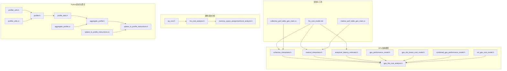
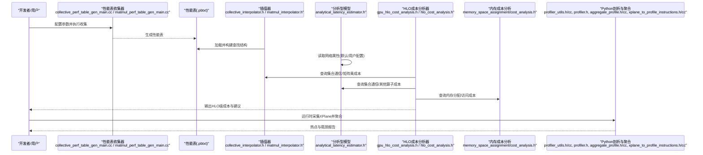
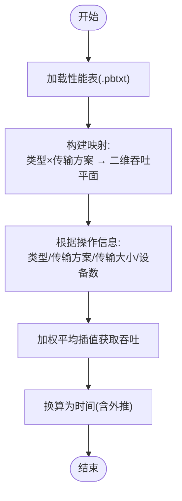
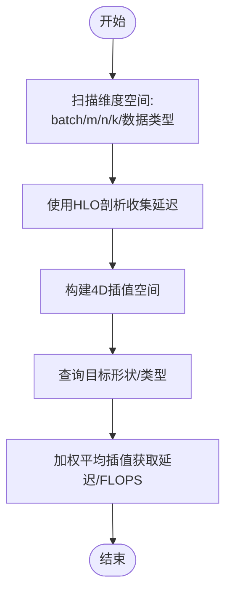
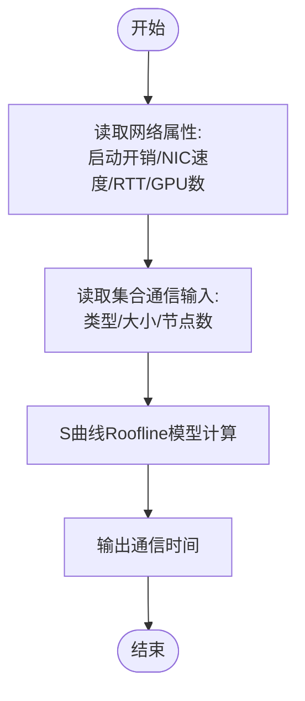
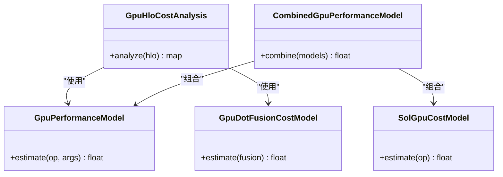
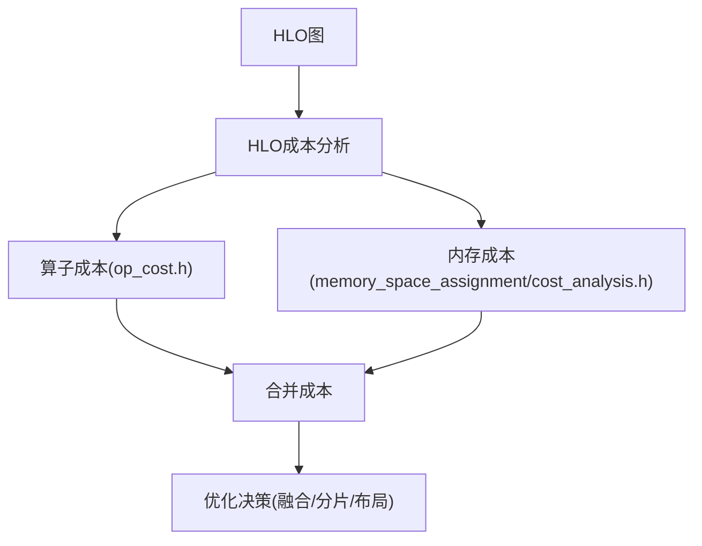
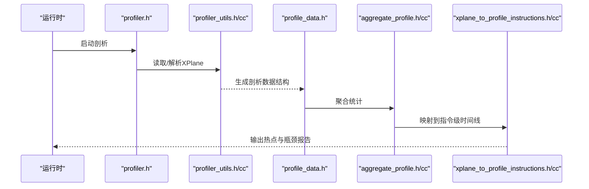
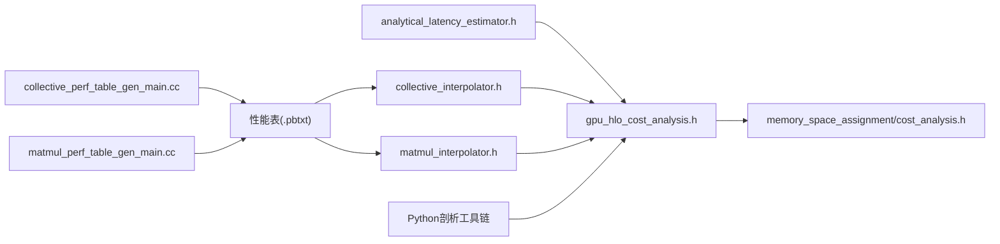

# 成本建模与预测

<cite>
**本文引用的文件**
- [docs/lhs_cost_model.md](file://docs/lhs_cost_model.md)
- [xla/service/cost_modelling/op_cost.h](file://xla/service/cost_modelling/op_cost.h)
- [xla/service/gpu/model/collective_interpolator.h](file://xla/service/gpu/model/collective_interpolator.h)
- [xla/service/gpu/model/matmul_interpolator.h](file://xla/service/gpu/model/matmul_interpolator.h)
- [xla/service/gpu/model/gpu_performance_model.h](file://xla/service/gpu/model/gpu_performance_model.h)
- [xla/service/gpu/model/analytical_latency_estimator.h](file://xla/service/gpu/model/analytical_latency_estimator.h)
- [xla/service/gpu/model/gpu_hlo_cost_analysis.h](file://xla/service/gpu/model/gpu_hlo_cost_analysis.h)
- [xla/service/gpu/model/gpu_dot_fusion_cost_model.h](file://xla/service/gpu/model/gpu_dot_fusion_cost_model.h)
- [xla/service/gpu/model/combined_gpu_performance_model.h](file://xla/service/gpu/model/combined_gpu_performance_model.h)
- [xla/service/gpu/model/sol_gpu_cost_model.h](file://xla/service/gpu/model/sol_gpu_cost_model.h)
- [xla/service/hlo_cost_analysis.h](file://xla/service/hlo_cost_analysis.h)
- [xla/service/memory_space_assignment/cost_analysis.h](file://xla/service/memory_space_assignment/cost_analysis.h)
- [xla/tools/collective_perf_table_gen_main.cc](file://xla/tools/collective_perf_table_gen_main.cc)
- [xla/tools/matmul_perf_table_gen_main.cc](file://xla/tools/matmul_perf_table_gen_main.cc)
- [xla/python/profiler_utils.h](file://xla/python/profiler_utils.h)
- [xla/python/profiler_utils.cc](file://xla/python/profiler_utils.cc)
- [xla/python/profiler.h](file://xla/python/profiler.h)
- [xla/python/profile_data.h](file://xla/python/profile_data.h)
- [xla/python/aggregate_profile.h](file://xla/python/aggregate_profile.h)
- [xla/python/aggregate_profile.cc](file://xla/python/aggregate_profile.cc)
- [xla/python/xplane_to_profile_instructions.h](file://xla/python/xplane_to_profile_instructions.h)
- [xla/python/xplane_to_profile_instructions.cc](file://xla/python/xplane_to_profile_instructions.cc)
</cite>

## 目录
1. [引言](#引言)
2. [项目结构](#项目结构)
3. [核心组件](#核心组件)
4. [架构总览](#架构总览)
5. [详细组件分析](#详细组件分析)
6. [依赖关系分析](#依赖关系分析)
7. [性能考量](#性能考量)
8. [故障排查指南](#故障排查指南)
9. [结论](#结论)
10. [附录](#附录)

## 引言
本文件面向XLA成本建模与预测系统，系统性阐述延迟预测、计算复杂度估算与内存访问成本计算的设计原理与实现机制；解释不同硬件平台的成本模型差异及校准/验证流程；记录成本分析工具的使用方法（性能热点识别与瓶颈定位）；说明成本建模在编译优化决策中的作用与基于成本预测选择最优策略的方法；并提供扩展成本模型与自定义成本函数的实现指南。

## 项目结构
XLA的成本建模体系由“性能表收集器”“插值器/解析器”“分析型成本模型”“HLO成本分析器”等模块组成，并通过Python侧的剖析工具与聚合统计形成端到端的成本分析链路。下图概览了主要模块及其交互：

图表来源
- [docs/lhs_cost_model.md](file://docs/lhs_cost_model.md#L1-L236)
- [xla/tools/collective_perf_table_gen_main.cc](file://xla/tools/collective_perf_table_gen_main.cc)
- [xla/tools/matmul_perf_table_gen_main.cc](file://xla/tools/matmul_perf_table_gen_main.cc)
- [xla/service/gpu/model/collective_interpolator.h](file://xla/service/gpu/model/collective_interpolator.h)
- [xla/service/gpu/model/matmul_interpolator.h](file://xla/service/gpu/model/matmul_interpolator.h)
- [xla/service/gpu/model/analytical_latency_estimator.h](file://xla/service/gpu/model/analytical_latency_estimator.h)
- [xla/service/gpu/model/gpu_performance_model.h](file://xla/service/gpu/model/gpu_performance_model.h)
- [xla/service/gpu/model/gpu_hlo_cost_analysis.h](file://xla/service/gpu/model/gpu_hlo_cost_analysis.h)
- [xla/service/gpu/model/gpu_dot_fusion_cost_model.h](file://xla/service/gpu/model/gpu_dot_fusion_cost_model.h)
- [xla/service/gpu/model/combined_gpu_performance_model.h](file://xla/service/gpu/model/combined_gpu_performance_model.h)
- [xla/service/gpu/model/sol_gpu_cost_model.h](file://xla/service/gpu/model/sol_gpu_cost_model.h)
- [xla/service/hlo_cost_analysis.h](file://xla/service/hlo_cost_analysis.h)
- [xla/service/memory_space_assignment/cost_analysis.h](file://xla/service/memory_space_assignment/cost_analysis.h)
- [xla/service/cost_modelling/op_cost.h](file://xla/service/cost_modelling/op_cost.h)
- [xla/python/profiler_utils.h](file://xla/python/profiler_utils.h)
- [xla/python/profiler_utils.cc](file://xla/python/profiler_utils.cc)
- [xla/python/profiler.h](file://xla/python/profiler.h)
- [xla/python/profile_data.h](file://xla/python/profile_data.h)
- [xla/python/aggregate_profile.h](file://xla/python/aggregate_profile.h)
- [xla/python/aggregate_profile.cc](file://xla/python/aggregate_profile.cc)
- [xla/python/xplane_to_profile_instructions.h](file://xla/python/xplane_to_profile_instructions.h)
- [xla/python/xplane_to_profile_instructions.cc](file://xla/python/xplane_to_profile_instructions.cc)

章节来源
- [docs/lhs_cost_model.md](file://docs/lhs_cost_model.md#L1-L236)

## 核心组件
- 性能表收集器：负责在特定参数空间内测量并生成性能表（如集合通信与GEMM），供后续插值器使用。
- 插值器：在编译期消费性能表，对未直接观测的点进行插值估计，支撑调度与融合决策。
- 分析型成本模型：以固定网络属性与数学模型估算集合通信延迟，或以解析公式估算其他算子成本。
- HLO成本分析器：对HLO图进行逐节点成本评估，结合内存分配与访问模式给出综合成本。
- Python剖析与聚合：提供从XPlane到可读指标的转换、聚合与可视化能力，辅助热点识别与模型校准。

章节来源
- [docs/lhs_cost_model.md](file://docs/lhs_cost_model.md#L22-L236)
- [xla/service/gpu/model/collective_interpolator.h](file://xla/service/gpu/model/collective_interpolator.h)
- [xla/service/gpu/model/matmul_interpolator.h](file://xla/service/gpu/model/matmul_interpolator.h)
- [xla/service/gpu/model/analytical_latency_estimator.h](file://xla/service/gpu/model/analytical_latency_estimator.h)
- [xla/service/gpu/model/gpu_hlo_cost_analysis.h](file://xla/service/gpu/model/gpu_hlo_cost_analysis.h)
- [xla/service/hlo_cost_analysis.h](file://xla/service/hlo_cost_analysis.h)
- [xla/service/memory_space_assignment/cost_analysis.h](file://xla/service/memory_space_assignment/cost_analysis.h)
- [xla/python/profiler.h](file://xla/python/profiler.h)
- [xla/python/profile_data.h](file://xla/python/profile_data.h)
- [xla/python/aggregate_profile.h](file://xla/python/aggregate_profile.h)
- [xla/python/xplane_to_profile_instructions.h](file://xla/python/xplane_to_profile_instructions.h)

## 架构总览
下图展示了成本建模在编译期与运行期的关键交互路径，以及性能表与分析模型如何共同驱动延迟预测与优化决策。

图表来源
- [xla/tools/collective_perf_table_gen_main.cc](file://xla/tools/collective_perf_table_gen_main.cc)
- [xla/tools/matmul_perf_table_gen_main.cc](file://xla/tools/matmul_perf_table_gen_main.cc)
- [xla/service/gpu/model/collective_interpolator.h](file://xla/service/gpu/model/collective_interpolator.h)
- [xla/service/gpu/model/matmul_interpolator.h](file://xla/service/gpu/model/matmul_interpolator.h)
- [xla/service/gpu/model/analytical_latency_estimator.h](file://xla/service/gpu/model/analytical_latency_estimator.h)
- [xla/service/gpu/model/gpu_hlo_cost_analysis.h](file://xla/service/gpu/model/gpu_hlo_cost_analysis.h)
- [xla/service/hlo_cost_analysis.h](file://xla/service/hlo_cost_analysis.h)
- [xla/service/memory_space_assignment/cost_analysis.h](file://xla/service/memory_space_assignment/cost_analysis.h)
- [xla/python/profiler_utils.h](file://xla/python/profiler_utils.h)
- [xla/python/profiler_utils.cc](file://xla/python/profiler_utils.cc)
- [xla/python/aggregate_profile.h](file://xla/python/aggregate_profile.h)
- [xla/python/aggregate_profile.cc](file://xla/python/aggregate_profile.cc)
- [xla/python/xplane_to_profile_instructions.h](file://xla/python/xplane_to_profile_instructions.h)
- [xla/python/xplane_to_profile_instructions.cc](file://xla/python/xplane_to_profile_instructions.cc)

## 详细组件分析

### 组件A：集合通信成本模型（性能表+插值）
- 设计要点
  - 使用“吞吐量”而非原始延迟存储，便于对超出测量范围的传输尺寸进行外推。
  - 基于二维平面（传输大小、设备数）进行加权平均插值，查询点为操作的（类型、传输方案）映射。
  - 对未饱和区域采用外推假设，若未包含饱和点，可能导致大尺寸传输的运行时间高估。
- 关键接口与数据流
  - 收集器：遍历集合通信类型、传输尺寸、传输方案与设备规模，使用现有多主机HLO运行器与执行剖析数据收集性能。
  - 插值器：初始化时将表转为键值映射（类型×传输方案→二维吞吐平面），查询时按欧氏距离加权平均获取吞吐，再换算为时间。
- 复杂度与性能
  - 初始化：O(N)建立查找结构（N为表项数量）。
  - 查询：近似O(1)（取决于插值权重计算与邻域大小）。
- 调优与校准
  - 用户可通过环境变量与XLA标志设置NIC速度、每节点GPU数等网络属性，以适配目标硬件。
  - 若用户自定义表，需确保包含带宽饱和区域的测量，避免低估最大吞吐导致大传输外推误差。

图表来源
- [docs/lhs_cost_model.md](file://docs/lhs_cost_model.md#L22-L118)
- [xla/tools/collective_perf_table_gen_main.cc](file://xla/tools/collective_perf_table_gen_main.cc)
- [xla/service/gpu/model/collective_interpolator.h](file://xla/service/gpu/model/collective_interpolator.h)

章节来源
- [docs/lhs_cost_model.md](file://docs/lhs_cost_model.md#L22-L118)
- [xla/tools/collective_perf_table_gen_main.cc](file://xla/tools/collective_perf_table_gen_main.cc)
- [xla/service/gpu/model/collective_interpolator.h](file://xla/service/gpu/model/collective_interpolator.h)

### 组件B：GEMM成本模型（性能表+插值）
- 设计要点
  - 通过测量不同批维度、非收缩维度与收缩维度、数据类型的HLO dot运行时间，重建FLOPS。
  - 利用FLOPS饱和特性进行外推，构建四维欧氏空间进行加权平均插值。
- 关键接口与数据流
  - 收集器：在静态维度空间内扫描，使用HLO算子剖析基础设施收集延迟。
  - 插值器：构建4D空间并进行加权平均插值，必要时按字节数归一化处理未知数据类型。
- 复杂度与性能
  - 初始化：O(N)建立查找结构。
  - 查询：近似O(1)。
- 调优与校准
  - 默认数据类型组合已覆盖主流混合精度；若涉及特殊类型，需补充对应表项。

图表来源
- [docs/lhs_cost_model.md](file://docs/lhs_cost_model.md#L121-L180)
- [xla/tools/matmul_perf_table_gen_main.cc](file://xla/tools/matmul_perf_table_gen_main.cc)
- [xla/service/gpu/model/matmul_interpolator.h](file://xla/service/gpu/model/matmul_interpolator.h)

章节来源
- [docs/lhs_cost_model.md](file://docs/lhs_cost_model.md#L121-L180)
- [xla/tools/matmul_perf_table_gen_main.cc](file://xla/tools/matmul_perf_table_gen_main.cc)
- [xla/service/gpu/model/matmul_interpolator.h](file://xla/service/gpu/model/matmul_interpolator.h)

### 组件C：分析型成本模型（S曲线集合通信）
- 设计要点
  - 基于固定网络属性（启动开销、网卡速度、RTT）与集合通信类型、传输大小、节点数，构建S曲线 Roofline 模型。
  - 默认自动检测平台并使用常见架构的预设值，支持通过XLA标志覆盖。
- 关键接口与数据流
  - 输入：网络属性（用户可配置）、集合通信输入（类型、大小、节点数）。
  - 输出：估计的通信时间。
- 复杂度与性能
  - 计算开销极低，适合在调度器中高频调用。
- 调优与校准
  - 通过环境变量与XLA标志设置NIC速度与每节点GPU数，以匹配实际拓扑。

图表来源
- [docs/lhs_cost_model.md](file://docs/lhs_cost_model.md#L182-L236)
- [xla/service/gpu/model/analytical_latency_estimator.h](file://xla/service/gpu/model/analytical_latency_estimator.h)

章节来源
- [docs/lhs_cost_model.md](file://docs/lhs_cost_model.md#L182-L236)
- [xla/service/gpu/model/analytical_latency_estimator.h](file://xla/service/gpu/model/analytical_latency_estimator.h)

### 组件D：GPU性能成本模型族
- 组成
  - GPU性能模型：通用算子性能估计。
  - GPU HLO成本分析：对HLO节点进行成本评估。
  - GPU点积融合成本模型：针对融合策略的成本估算。
  - 组合GPU性能模型：整合多种来源的成本。
  - SOL GPU成本模型：面向特定架构的简化成本模型。
- 数据流
  - 插值器/分析模型输出作为输入，结合内存分配与访问模式，得到最终成本。

图表来源
- [xla/service/gpu/model/gpu_performance_model.h](file://xla/service/gpu/model/gpu_performance_model.h)
- [xla/service/gpu/model/gpu_hlo_cost_analysis.h](file://xla/service/gpu/model/gpu_hlo_cost_analysis.h)
- [xla/service/gpu/model/gpu_dot_fusion_cost_model.h](file://xla/service/gpu/model/gpu_dot_fusion_cost_model.h)
- [xla/service/gpu/model/combined_gpu_performance_model.h](file://xla/service/gpu/model/combined_gpu_performance_model.h)
- [xla/service/gpu/model/sol_gpu_cost_model.h](file://xla/service/gpu/model/sol_gpu_cost_model.h)

章节来源
- [xla/service/gpu/model/gpu_performance_model.h](file://xla/service/gpu/model/gpu_performance_model.h)
- [xla/service/gpu/model/gpu_hlo_cost_analysis.h](file://xla/service/gpu/model/gpu_hlo_cost_analysis.h)
- [xla/service/gpu/model/gpu_dot_fusion_cost_model.h](file://xla/service/gpu/model/gpu_dot_fusion_cost_model.h)
- [xla/service/gpu/model/combined_gpu_performance_model.h](file://xla/service/gpu/model/combined_gpu_performance_model.h)
- [xla/service/gpu/model/sol_gpu_cost_model.h](file://xla/service/gpu/model/sol_gpu_cost_model.h)

### 组件E：HLO与内存成本分析
- HLO成本分析：对HLO图进行逐节点成本评估，考虑算子类型、形状、数据类型与内存布局。
- 内存空间分配成本分析：评估内存分配与访问成本，指导分片与布局选择。
- 组合成本：将算子成本与内存成本合并，用于编译器优化决策。

图表来源
- [xla/service/hlo_cost_analysis.h](file://xla/service/hlo_cost_analysis.h)
- [xla/service/cost_modelling/op_cost.h](file://xla/service/cost_modelling/op_cost.h)
- [xla/service/memory_space_assignment/cost_analysis.h](file://xla/service/memory_space_assignment/cost_analysis.h)

章节来源
- [xla/service/hlo_cost_analysis.h](file://xla/service/hlo_cost_analysis.h)
- [xla/service/cost_modelling/op_cost.h](file://xla/service/cost_modelling/op_cost.h)
- [xla/service/memory_space_assignment/cost_analysis.h](file://xla/service/memory_space_assignment/cost_analysis.h)

### 组件F：Python剖析与聚合工具链
- 功能
  - 将XPlane剖析数据转换为可读指标与指令级时间线。
  - 聚合热点与瓶颈，辅助成本模型校准与验证。
- 关键组件
  - profiler_utils：剖析数据读取与预处理。
  - profiler：剖析器接口。
  - profile_data：剖析数据结构。
  - aggregate_profile：聚合统计。
  - xplane_to_profile_instructions：XPlane到指令级映射。

图表来源
- [xla/python/profiler.h](file://xla/python/profiler.h)
- [xla/python/profiler_utils.h](file://xla/python/profiler_utils.h)
- [xla/python/profiler_utils.cc](file://xla/python/profiler_utils.cc)
- [xla/python/profile_data.h](file://xla/python/profile_data.h)
- [xla/python/aggregate_profile.h](file://xla/python/aggregate_profile.h)
- [xla/python/aggregate_profile.cc](file://xla/python/aggregate_profile.cc)
- [xla/python/xplane_to_profile_instructions.h](file://xla/python/xplane_to_profile_instructions.h)
- [xla/python/xplane_to_profile_instructions.cc](file://xla/python/xplane_to_profile_instructions.cc)

章节来源
- [xla/python/profiler.h](file://xla/python/profiler.h)
- [xla/python/profiler_utils.h](file://xla/python/profiler_utils.h)
- [xla/python/profiler_utils.cc](file://xla/python/profiler_utils.cc)
- [xla/python/profile_data.h](file://xla/python/profile_data.h)
- [xla/python/aggregate_profile.h](file://xla/python/aggregate_profile.h)
- [xla/python/aggregate_profile.cc](file://xla/python/aggregate_profile.cc)
- [xla/python/xplane_to_profile_instructions.h](file://xla/python/xplane_to_profile_instructions.h)
- [xla/python/xplane_to_profile_instructions.cc](file://xla/python/xplane_to_profile_instructions.cc)

## 依赖关系分析
- 组件耦合
  - 插值器与分析模型共同为HLO成本分析器提供底层算子成本。
  - HLO成本分析器与内存成本分析器共同决定优化策略。
  - Python剖析工具链为模型校准与验证提供实证数据。
- 可能的循环依赖
  - 当前设计以“收集器→表→插值器/分析模型→HLO成本分析器→优化器”单向依赖为主，未见明显循环。
- 外部依赖
  - 平台与网络属性（NIC速度、RTT、拓扑）影响分析型模型与插值外推的准确性。

图表来源
- [xla/tools/collective_perf_table_gen_main.cc](file://xla/tools/collective_perf_table_gen_main.cc)
- [xla/tools/matmul_perf_table_gen_main.cc](file://xla/tools/matmul_perf_table_gen_main.cc)
- [xla/service/gpu/model/collective_interpolator.h](file://xla/service/gpu/model/collective_interpolator.h)
- [xla/service/gpu/model/matmul_interpolator.h](file://xla/service/gpu/model/matmul_interpolator.h)
- [xla/service/gpu/model/analytical_latency_estimator.h](file://xla/service/gpu/model/analytical_latency_estimator.h)
- [xla/service/gpu/model/gpu_hlo_cost_analysis.h](file://xla/service/gpu/model/gpu_hlo_cost_analysis.h)
- [xla/service/memory_space_assignment/cost_analysis.h](file://xla/service/memory_space_assignment/cost_analysis.h)
- [xla/python/profiler_utils.h](file://xla/python/profiler_utils.h)
- [xla/python/profiler_utils.cc](file://xla/python/profiler_utils.cc)

章节来源
- [xla/tools/collective_perf_table_gen_main.cc](file://xla/tools/collective_perf_table_gen_main.cc)
- [xla/tools/matmul_perf_table_gen_main.cc](file://xla/tools/matmul_perf_table_gen_main.cc)
- [xla/service/gpu/model/collective_interpolator.h](file://xla/service/gpu/model/collective_interpolator.h)
- [xla/service/gpu/model/matmul_interpolator.h](file://xla/service/gpu/model/matmul_interpolator.h)
- [xla/service/gpu/model/analytical_latency_estimator.h](file://xla/service/gpu/model/analytical_latency_estimator.h)
- [xla/service/gpu/model/gpu_hlo_cost_analysis.h](file://xla/service/gpu/model/gpu_hlo_cost_analysis.h)
- [xla/service/memory_space_assignment/cost_analysis.h](file://xla/service/memory_space_assignment/cost_analysis.h)
- [xla/python/profiler_utils.h](file://xla/python/profiler_utils.h)
- [xla/python/profiler_utils.cc](file://xla/python/profiler_utils.cc)

## 性能考量
- 查询复杂度
  - 插值器与分析模型均为常数级查询，适合在调度器高频使用。
- 外推风险
  - 若性能表未覆盖饱和区域，可能导致大尺寸外推偏慢；应优先保证饱和点测量。
- 网络属性敏感性
  - 分析型模型对NIC速度、RTT、拓扑高度敏感，需按目标硬件正确配置。
- 内存与带宽
  - 内存成本分析需结合访问模式与带宽限制，避免仅依赖算子FLOPS。

## 故障排查指南
- 症状：集合通信外推过快/过慢
  - 排查：确认性能表是否包含饱和点；检查网络属性配置是否与实际一致。
- 症状：GEMM外推异常
  - 排查：确认数据类型与维度覆盖；检查插值权重与归一化逻辑。
- 症状：HLO成本与实测偏差较大
  - 排查：使用Python剖析工具链采集XPlane，定位热点与瓶颈；对比指令级时间线与成本模型输出。
- 症状：融合收益与模型预测不符
  - 排查：检查融合成本模型与内存成本分析是否匹配实际访存模式。

章节来源
- [docs/lhs_cost_model.md](file://docs/lhs_cost_model.md#L87-L118)
- [xla/python/profiler.h](file://xla/python/profiler.h)
- [xla/python/profiler_utils.h](file://xla/python/profiler_utils.h)
- [xla/python/profiler_utils.cc](file://xla/python/profiler_utils.cc)
- [xla/python/xplane_to_profile_instructions.h](file://xla/python/xplane_to_profile_instructions.h)
- [xla/python/xplane_to_profile_instructions.cc](file://xla/python/xplane_to_profile_instructions.cc)

## 结论
XLA的成本建模体系通过“性能表+插值”与“分析型模型”的互补，在不同硬件平台上实现了对集合通信、GEMM与其他算子的高效成本估计。结合HLO与内存成本分析，系统能够为编译优化提供可靠的延迟预测与收益评估。通过Python剖析工具链，用户可以完成模型校准与验证，持续提升预测精度与优化效果。

## 附录
- 成本模型校准与验证流程
  - 使用性能表收集器在目标硬件上生成/更新性能表。
  - 在分析型模型中设置正确的网络属性。
  - 使用Python剖析工具链采集XPlane，映射到指令级时间线并进行聚合统计。
  - 对比模型预测与实测结果，调整模型参数或补充性能表。
- 基于成本预测的优化策略选择
  - 以HLO成本分析器输出为依据，比较不同优化方案（融合、分片、布局）的成本与收益。
  - 优先选择成本降低且内存压力可控的策略。
- 扩展与自定义成本函数指南
  - 新增算子成本：在HLO成本分析器中添加对应算子的成本计算逻辑。
  - 新增性能表：扩展收集器参数空间，生成新表并接入插值器。
  - 新增分析模型：在分析型模型中实现新的数学模型，并通过标志暴露配置项。