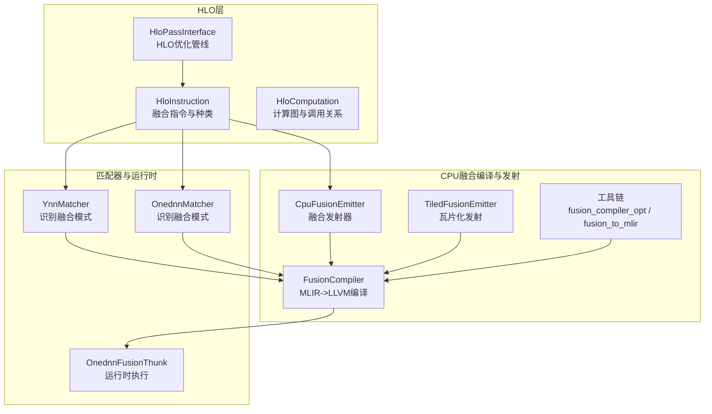
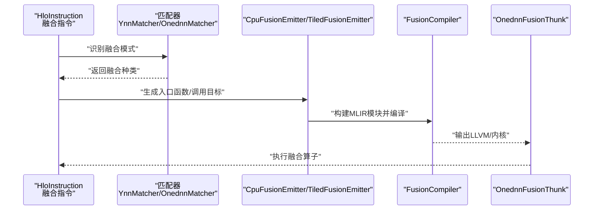
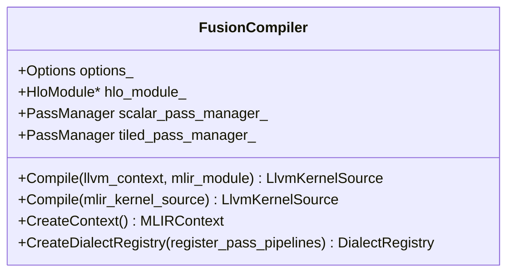
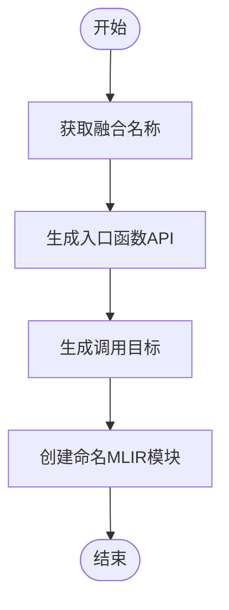
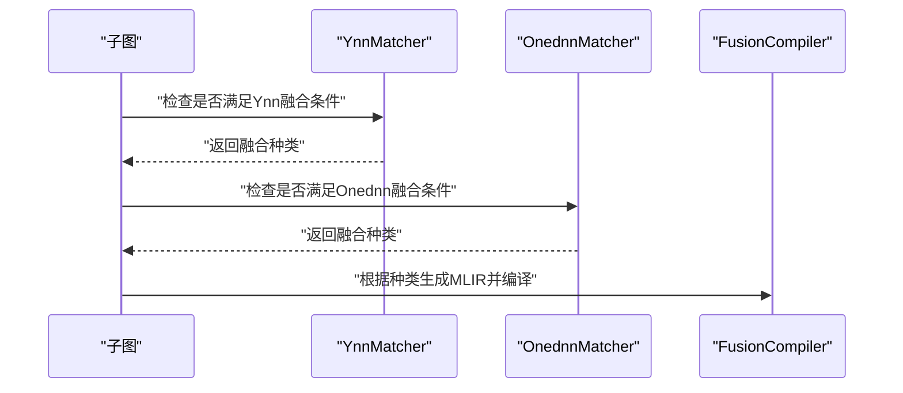
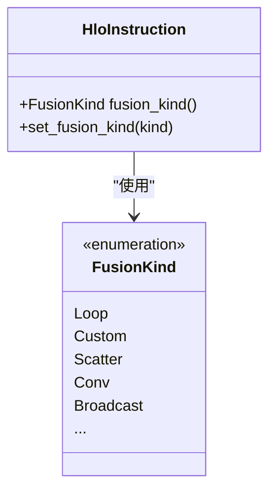

# 操作融合优化

<cite>
**本文引用的文件**
- [xla\backends\cpu\codegen\fusion_compiler.h](file://xla\backends\cpu\codegen\fusion_compiler.h)
- [xla\backends\cpu\codegen\emitters\cpu_fusion_emitter.h](file://xla\backends\cpu\codegen\emitters\cpu_fusion_emitter.h)
- [xla\backends\cpu\codegen\emitters\cpu_fusion_emitter_config.h](file://xla\backends\cpu\codegen\emitters\cpu_fusion_emitter_config.h)
- [xla\backends\cpu\codegen\emitters\cpu_fusion_emitter.cc](file://xla\backends\cpu\codegen\emitters\cpu_fusion_emitter.cc)
- [xla\backends\cpu\codegen\fusion_compiler.cc](file://xla\backends\cpu\codegen\fusion_compiler.cc)
- [xla\backends\cpu\codegen\fusion_emitter.h](file://xla\backends\cpu\codegen\fusion_emitter.h)
- [xla\backends\cpu\codegen\fusion_emitter.cc](file://xla\backends\cpu\codegen\fusion_emitter.cc)
- [xla\backends\cpu\codegen\tiled\tiled_fusion_emitter.h](file://xla\backends\cpu\codegen\tiled\tiled_fusion_emitter.h)
- [xla\backends\cpu\codegen\tiled\tiled_fusion_emitter.cc](file://xla\backends\cpu\codegen\tiled\tiled_fusion_emitter.cc)
- [xla\backends\cpu\transforms\ynn_matcher.h](file://xla\backends\cpu\transforms\ynn_matcher.h)
- [xla\backends\cpu\transforms\ynn_matcher.cc](file://xla\backends\cpu\transforms\ynn_matcher.cc)
- [xla\backends\cpu\transforms\onednn_matcher.h](file://xla\backends\cpu\transforms\onednn_matcher.h)
- [xla\backends\cpu\transforms\onednn_matcher.cc](file://xla\backends\cpu\transforms\onednn_matcher.cc)
- [xla\backends\cpu\runtime\onednn\onednn_fusion_thunk.cc](file://xla\backends\cpu\runtime\onednn\onednn_fusion_thunk.cc)
- [xla\backends\cpu\runtime\onednn\onednn_fusion_thunk.h](file://xla\backends\cpu\runtime\onednn\onednn_fusion_thunk.h)
- [xla\backends\cpu\codegen\tools\fusion_compiler_opt.cc](file://xla\backends\cpu\codegen\tools\fusion_compiler_opt.cc)
- [xla\backends\cpu\codegen\tools\fusion_to_mlir.cc](file://xla\backends\cpu\codegen\tools\fusion_to_mlir.cc)
- [xla\hlo\pass\hlo_pass_interface.h](file://xla\hlo\pass\hlo_pass_interface.h)
- [xla\hlo\ir\hlo_instruction.h](file://xla\hlo\ir\hlo_instruction.h)
- [xla\hlo\ir\hlo_computation.h](file://xla\hlo\ir\hlo_computation.h)
- [docs\hlo_passes.md](file://docs\hlo_passes.md)
- [xla\backends\cpu\benchmarks\fusion_benchmark_test.cc](file://xla\backends\cpu\benchmarks\fusion_benchmark_test.cc)
- [xla\backends\cpu\benchmarks\ynn_fusion_benchmark_test.cc](file://xla\backends\cpu\benchmarks\ynn_fusion_benchmark_test.cc)
- [xla\backends\autotuner\autotuner.cc](file://xla\backends\autotuner\autotuner.cc)
- [xla\backends\cpu\autotuner\llvm_kernel_backend.cc](file://xla\backends\cpu\autotuner\llvm_kernel_backend.cc)
- [xla\backends\cpu\autotuner\llvm_kernel_backend_test.cc](file://xla\backends\cpu\autotuner\llvm_kernel_backend_test.cc)
</cite>

## 目录
1. [引言](#引言)
2. [项目结构](#项目结构)
3. [核心组件](#核心组件)
4. [架构总览](#架构总览)
5. [详细组件分析](#详细组件分析)
6. [依赖关系分析](#依赖关系分析)
7. [性能考量](#性能考量)
8. [故障排查指南](#故障排查指南)
9. [结论](#结论)
10. [附录](#附录)

## 引言
本文件聚焦于XLA在CPU后端的操作融合优化，系统性阐述融合类型（如逐元素融合、广播融合、卷积融合等）的识别与应用、融合算法实现机制、融合收益与成本评估方法、融合过程中的内存访问模式优化、融合后代码生成与优化策略，并给出融合配置选项、性能影响分析与最佳实践。文档同时提供可定位到具体源码路径的示例，帮助读者快速理解与验证不同融合类型的实现与效果。

## 项目结构
围绕“融合优化”的关键目录与文件如下：
- 后端融合编译与发射：xla\backends\cpu\codegen\fusion_compiler.*、xla\backends\cpu\codegen\emitters\cpu_fusion_emitter.*
- 瓦片化融合发射器：xla\backends\cpu\codegen\tiled\tiled_fusion_emitter.*
- 匹配器（识别融合模式）：xla\backends\cpu\transforms\ynn_matcher.*、xla\backends\cpu\transforms\onednn_matcher.*
- 运行时融合Thunk：xla\backends\cpu\runtime\onednn\onednn_fusion_thunk.*
- 工具链：xla\backends\cpu\codegen\tools\fusion_compiler_opt.cc、xla\backends\cpu\codegen\tools\fusion_to_mlir.cc
- HLO层接口与管道：xla\hlo\pass\hlo_pass_interface.h、xla\hlo\ir\hlo_instruction.h、xla\hlo\ir\hlo_computation.h
- 文档与基准测试：docs\hlo_passes.md、xla\backends\cpu\benchmarks\fusion_benchmark_test.cc、xla\backends\cpu\benchmarks\ynn_fusion_benchmark_test.cc
- 自动调优与融合支持：xla\backends\autotuner\autotuner.cc、xla\backends\cpu\autotuner\llvm_kernel_backend.cc、xla\backends\cpu\autotuner\llvm_kernel_backend_test.cc

图表来源
- [xla\hlo\pass\hlo_pass_interface.h](file://xla\hlo\pass\hlo_pass_interface.h#L40-L141)
- [xla\hlo\ir\hlo_instruction.h](file://xla\hlo\ir\hlo_instruction.h#L290-L300)
- [xla\backends\cpu\codegen\fusion_compiler.h](file://xla\backends\cpu\codegen\fusion_compiler.h#L41-L78)
- [xla\backends\cpu\codegen\emitters\cpu_fusion_emitter.h](file://xla\backends\cpu\codegen\emitters\cpu_fusion_emitter.h#L47-L66)
- [xla\backends\cpu\codegen\tiled\tiled_fusion_emitter.h](file://xla\backends\cpu\codegen\tiled\tiled_fusion_emitter.h)
- [xla\backends\cpu\transforms\ynn_matcher.h](file://xla\backends\cpu\transforms\ynn_matcher.h#L112-L112)
- [xla\backends\cpu\transforms\onednn_matcher.h](file://xla\backends\cpu\transforms\onednn_matcher.h#L80-L80)
- [xla\backends\cpu\runtime\onednn\onednn_fusion_thunk.h](file://xla\backends\cpu\runtime\onednn\onednn_fusion_thunk.h)

章节来源
- [docs\hlo_passes.md](file://docs\hlo_passes.md#L1-L231)
- [xla\hlo\pass\hlo_pass_interface.h](file://xla\hlo\pass\hlo_pass_interface.h#L40-L141)
- [xla\hlo\ir\hlo_instruction.h](file://xla\hlo\ir\hlo_instruction.h#L290-L300)

## 核心组件
- 融合编译器（FusionCompiler）
  - 将MLIR模块编译为LLVM IR，区分标量与瓦片化两种流水线，支持向量化宽度、快速数学标志等选项。
  - 关键接口：Compile(MLIR->LLVM)、Compile(MlirKernelSource->LlvmKernelSource)、CreateContext/Registry。
- 融合发射器（CpuFusionEmitter）
  - 生成入口函数API、调用目标、命名融合模块、默认索引映射等；支持C风格内核命名策略。
- 瓦片化融合发射器（TiledFusionEmitter）
  - 面向瓦片化内核的发射逻辑，与标量路径并行存在。
- 匹配器（YnnMatcher/OnednnMatcher）
  - 识别特定融合模式（如Ynn、OneDNN），返回融合种类字符串，驱动后续编译与运行时执行。
- 运行时融合Thunk（OnednnFusionThunk）
  - 承载融合算子的运行时执行，连接发射结果与后端执行环境。
- 工具链
  - fusion_compiler_opt：融合编译器的命令行工具入口。
  - fusion_to_mlir：将融合转换为MLIR模块的工具。

章节来源
- [xla\backends\cpu\codegen\fusion_compiler.h](file://xla\backends\cpu\codegen\fusion_compiler.h#L41-L78)
- [xla\backends\cpu\codegen\emitters\cpu_fusion_emitter.h](file://xla\backends\cpu\codegen\emitters\cpu_fusion_emitter.h#L47-L66)
- [xla\backends\cpu\codegen\tiled\tiled_fusion_emitter.h](file://xla\backends\cpu\codegen\tiled\tiled_fusion_emitter.h)
- [xla\backends\cpu\transforms\ynn_matcher.h](file://xla\backends\cpu\transforms\ynn_matcher.h#L112-L112)
- [xla\backends\cpu\transforms\onednn_matcher.h](file://xla\backends\cpu\transforms\onednn_matcher.h#L80-L80)
- [xla\backends\cpu\runtime\onednn\onednn_fusion_thunk.h](file://xla\backends\cpu\runtime\onednn\onednn_fusion_thunk.h)
- [xla\backends\cpu\codegen\tools\fusion_compiler_opt.cc](file://xla\backends\cpu\codegen\tools\fusion_compiler_opt.cc)
- [xla\backends\cpu\codegen\tools\fusion_to_mlir.cc](file://xla\backends\cpu\codegen\tools\fusion_to_mlir.cc)

## 架构总览
下图展示了从HLO融合指令到最终LLVM/运行时执行的整体流程，包括匹配器识别、发射器生成、编译器编译与运行时Thunk执行。

图表来源
- [xla\hlo\ir\hlo_instruction.h](file://xla\hlo\ir\hlo_instruction.h#L290-L300)
- [xla\backends\cpu\transforms\ynn_matcher.h](file://xla\backends\cpu\transforms\ynn_matcher.h#L112-L112)
- [xla\backends\cpu\transforms\onednn_matcher.h](file://xla\backends\cpu\transforms\onednn_matcher.h#L80-L80)
- [xla\backends\cpu\codegen\emitters\cpu_fusion_emitter.h](file://xla\backends\cpu\codegen\emitters\cpu_fusion_emitter.h#L47-L66)
- [xla\backends\cpu\codegen\fusion_compiler.h](file://xla\backends\cpu\codegen\fusion_compiler.h#L41-L78)
- [xla\backends\cpu\runtime\onednn\onednn_fusion_thunk.cc](file://xla\backends\cpu\runtime\onednn\onednn_fusion_thunk.cc)

## 详细组件分析

### 组件A：融合编译器（FusionCompiler）
- 职责
  - 接收MLIR模块，通过标量/瓦片化两条Pass Pipeline编译为LLVM IR或LLVM Kernel Source。
  - 提供静态上下文与方言注册能力，便于测试与工具链集成。
- 关键点
  - 选项包含向量化宽度、验证级别、快速min/max开关、快速数学标志等。
  - 标量与瓦片化流水线语义差异较大，未来有统一化的重构空间。
- 典型使用场景
  - 在CPU后端，将匹配器识别出的融合模式转换为可执行的LLVM内核。

图表来源
- [xla\backends\cpu\codegen\fusion_compiler.h](file://xla\backends\cpu\codegen\fusion_compiler.h#L41-L78)

章节来源
- [xla\backends\cpu\codegen\fusion_compiler.h](file://xla\backends\cpu\codegen\fusion_compiler.h#L41-L78)

### 组件B：融合发射器（CpuFusionEmitter）
- 职责
  - 生成融合入口函数API、命名融合模块、默认索引映射、调用目标提供者。
  - 支持C风格内核命名策略，结合父模块名与融合名生成稳定符号名。
- 关键点
  - 与BufferAssignment协作，确保内存布局与访问模式优化。
  - 与ComputationPartitioner配合，将复杂融合拆分为多个分区计算。

图表来源
- [xla\backends\cpu\codegen\emitters\cpu_fusion_emitter.h](file://xla\backends\cpu\codegen\emitters\cpu_fusion_emitter.h#L47-L66)

章节来源
- [xla\backends\cpu\codegen\emitters\cpu_fusion_emitter.h](file://xla\backends\cpu\codegen\emitters\cpu_fusion_emitter.h#L47-L66)

### 组件C：匹配器（YnnMatcher / OnednnMatcher）
- 职责
  - 识别符合特定融合模式的子图，返回融合种类字符串（如Ynn、OneDNN）。
  - 作为融合编译前的关键判定环节，决定是否进行融合以及采用何种融合策略。
- 关键点
  - 通过融合种类字符串与运行时Thunk对接，形成“识别—编译—执行”的闭环。

图表来源
- [xla\backends\cpu\transforms\ynn_matcher.h](file://xla\backends\cpu\transforms\ynn_matcher.h#L112-L112)
- [xla\backends\cpu\transforms\onednn_matcher.h](file://xla\backends\cpu\transforms\onednn_matcher.h#L80-L80)

章节来源
- [xla\backends\cpu\transforms\ynn_matcher.h](file://xla\backends\cpu\transforms\ynn_matcher.h#L112-L112)
- [xla\backends\cpu\transforms\onednn_matcher.h](file://xla\backends\cpu\transforms\onednn_matcher.h#L80-L80)

### 组件D：运行时融合Thunk（OnednnFusionThunk）
- 职责
  - 承载融合算子的运行时执行，负责调度与执行已编译的融合内核。
- 关键点
  - 与发射器/编译器输出的内核格式保持一致，确保执行路径稳定可靠。

章节来源
- [xla\backends\cpu\runtime\onednn\onednn_fusion_thunk.h](file://xla\backends\cpu\runtime\onednn\onednn_fusion_thunk.h)
- [xla\backends\cpu\runtime\onednn\onednn_fusion_thunk.cc](file://xla\backends\cpu\runtime\onednn\onednn_fusion_thunk.cc)

### 组件E：HLO融合指令与种类
- 职责
  - 定义融合指令的种类（如Loop、Custom等），并提供查询/设置融合种类的接口。
- 关键点
  - 融合种类是匹配器与编译器之间的契约，直接影响后续编译策略与运行时行为。

图表来源
- [xla\hlo\ir\hlo_instruction.h](file://xla\hlo\ir\hlo_instruction.h#L290-L300)
- [xla\hlo\ir\hlo_instruction.h](file://xla\hlo\ir\hlo_instruction.h#L2297-L2300)

章节来源
- [xla\hlo\ir\hlo_instruction.h](file://xla\hlo\ir\hlo_instruction.h#L290-L300)
- [xla\hlo\ir\hlo_instruction.h](file://xla\hlo\ir\hlo_instruction.h#L2297-L2300)

### 组件F：HLO优化管线与融合的关系
- 职责
  - HLO Pass框架提供统一的优化与变换入口，融合通常在Pass流水线中被识别与应用。
- 关键点
  - 通过RunState与变更集合，Pass可以迭代地作用于计算图，逐步完成融合与优化。

章节来源
- [xla\hlo\pass\hlo_pass_interface.h](file://xla\hlo\pass\hlo_pass_interface.h#L40-L141)
- [docs\hlo_passes.md](file://docs\hlo_passes.md#L1-L231)

## 依赖关系分析
- 耦合与内聚
  - 匹配器与发射器之间通过“融合种类”耦合，编译器与运行时Thunk之间通过“内核格式”耦合。
  - 发射器与编译器共享MLIR上下文与方言注册，保证生成与编译的一致性。
- 外部依赖
  - MLIR/LLVM作为编译后端，提供强大的中间表示与优化能力。
- 潜在循环依赖
  - 当前设计以“识别→发射→编译→执行”单向流动为主，未见明显循环依赖。

图表来源
- [xla\backends\cpu\transforms\ynn_matcher.h](file://xla\backends\cpu\transforms\ynn_matcher.h#L112-L112)
- [xla\backends\cpu\transforms\onednn_matcher.h](file://xla\backends\cpu\transforms\onednn_matcher.h#L80-L80)
- [xla\backends\cpu\codegen\emitters\cpu_fusion_emitter.h](file://xla\backends\cpu\codegen\emitters\cpu_fusion_emitter.h#L47-L66)
- [xla\backends\cpu\codegen\fusion_compiler.h](file://xla\backends\cpu\codegen\fusion_compiler.h#L41-L78)
- [xla\backends\cpu\runtime\onednn\onednn_fusion_thunk.h](file://xla\backends\cpu\runtime\onednn\onednn_fusion_thunk.h)
- [xla\hlo\ir\hlo_instruction.h](file://xla\hlo\ir\hlo_instruction.h#L290-L300)

## 性能考量
- 融合收益与成本评估
  - 收益：减少内存往返、降低函数调用开销、提升缓存局部性、利用SIMD向量化。
  - 成本：增加内核复杂度、可能引入额外的索引计算与分支。
- 内存访问模式优化
  - 通过默认索引映射与瓦片化发射器，尽量使访问模式对缓存友好。
  - 与BufferAssignment协作，避免临时缓冲区与重复加载。
- 向量化与快速数学
  - FusionCompiler选项支持向量化宽度与快速数学标志，可在精度与吞吐间权衡。
- 基准测试参考
  - 提供多种融合类型的基准测试，可用于对比不同融合策略的性能表现。

章节来源
- [xla\backends\cpu\codegen\fusion_compiler.h](file://xla\backends\cpu\codegen\fusion_compiler.h#L43-L48)
- [xla\backends\cpu\codegen\emitters\cpu_fusion_emitter.h](file://xla\backends\cpu\codegen\emitters\cpu_fusion_emitter.h#L43-L45)
- [xla\backends\cpu\benchmarks\fusion_benchmark_test.cc](file://xla\backends\cpu\benchmarks\fusion_benchmark_test.cc#L35-L293)
- [xla\backends\cpu\benchmarks\ynn_fusion_benchmark_test.cc](file://xla\backends\cpu\benchmarks\ynn_fusion_benchmark_test.cc)

## 故障排查指南
- 融合未生效
  - 检查匹配器是否识别到融合模式（查看匹配器返回的融合种类）。
  - 确认发射器是否成功生成入口函数与命名模块。
- 编译失败
  - 使用工具链fusion_to_mlir与fusion_compiler_opt进行最小化复现，逐步缩小问题范围。
  - 检查MLIR上下文与方言注册是否完整。
- 运行时异常
  - 对照OnednnFusionThunk的输入输出格式，确认与发射器/编译器输出一致。
- 自动调优相关
  - 若启用自动调优，检查Autotuner对融合模块的处理逻辑与提取策略。

章节来源
- [xla\backends\cpu\codegen\tools\fusion_to_mlir.cc](file://xla\backends\cpu\codegen\tools\fusion_to_mlir.cc)
- [xla\backends\cpu\codegen\tools\fusion_compiler_opt.cc](file://xla\backends\cpu\codegen\tools\fusion_compiler_opt.cc)
- [xla\backends\cpu\runtime\onednn\onednn_fusion_thunk.cc](file://xla\backends\cpu\runtime\onednn\onednn_fusion_thunk.cc)
- [xla\backends\autotuner\autotuner.cc](file://xla\backends\autotuner\autotuner.cc#L172-L200)

## 结论
XLA在CPU后端的融合优化以“识别—发射—编译—执行”为主线，通过匹配器识别融合模式、发射器生成MLIR模块、编译器将MLIR编译为LLVM内核、运行时Thunk执行融合算子，形成完整的流水线。该体系兼顾了灵活性与可扩展性，既支持通用融合（如逐元素、广播），也支持专用融合（如Ynn、OneDNN）。通过基准测试与自动调优，可进一步量化融合收益并指导配置选择。

## 附录
- 融合类型与识别
  - 识别器：YnnMatcher、OnednnMatcher
  - 融合种类：见HloInstruction::FusionKind枚举
- 代码示例路径（不展示具体代码内容）
  - 融合编译器选项与接口：[xla\backends\cpu\codegen\fusion_compiler.h](file://xla\backends\cpu\codegen\fusion_compiler.h#L41-L78)
  - 融合发射器入口函数与命名：[xla\backends\cpu\codegen\emitters\cpu_fusion_emitter.h](file://xla\backends\cpu\codegen\emitters\cpu_fusion_emitter.h#L47-L66)
  - 默认索引映射与命名规则：[xla\backends\cpu\codegen\emitters\cpu_fusion_emitter.cc](file://xla\backends\cpu\codegen\emitters\cpu_fusion_emitter.cc)
  - 瓦片化发射器接口：[xla\backends\cpu\codegen\tiled\tiled_fusion_emitter.h](file://xla\backends\cpu\codegen\tiled\tiled_fusion_emitter.h)
  - 匹配器融合种类返回：[xla\backends\cpu\transforms\ynn_matcher.h](file://xla\backends\cpu\transforms\ynn_matcher.h#L112-L112)、[xla\backends\cpu\transforms\onednn_matcher.h](file://xla\backends\cpu\transforms\onednn_matcher.h#L80-L80)
  - 运行时融合Thunk：[xla\backends\cpu\runtime\onednn\onednn_fusion_thunk.h](file://xla\backends\cpu\runtime\onednn\onednn_fusion_thunk.h)
  - 工具链入口：[xla\backends\cpu\codegen\tools\fusion_compiler_opt.cc](file://xla\backends\cpu\codegen\tools\fusion_compiler_opt.cc)、[xla\backends\cpu\codegen\tools\fusion_to_mlir.cc](file://xla\backends\cpu\codegen\tools\fusion_to_mlir.cc)
  - HLO融合指令与种类：[xla\hlo\ir\hlo_instruction.h](file://xla\hlo\ir\hlo_instruction.h#L290-L300)
  - HLO Pass框架：[xla\hlo\pass\hlo_pass_interface.h](file://xla\hlo\pass\hlo_pass_interface.h#L40-L141)
  - 文档与Pass概览：[docs\hlo_passes.md](file://docs\hlo_passes.md#L1-L231)
  - 基准测试参考：[xla\backends\cpu\benchmarks\fusion_benchmark_test.cc](file://xla\backends\cpu\benchmarks\fusion_benchmark_test.cc#L35-L293)、[xla\backends\cpu\benchmarks\ynn_fusion_benchmark_test.cc](file://xla\backends\cpu\benchmarks\ynn_fusion_benchmark_test.cc)
  - 自动调优与融合支持：[xla\backends\autotuner\autotuner.cc](file://xla\backends\autotuner\autotuner.cc#L172-L200)、[xla\backends\cpu\autotuner\llvm_kernel_backend.cc](file://xla\backends\cpu\autotuner\llvm_kernel_backend.cc#L46-L54)、[xla\backends\cpu\autotuner\llvm_kernel_backend_test.cc](file://xla\backends\cpu\autotuner\llvm_kernel_backend_test.cc#L37-L60)