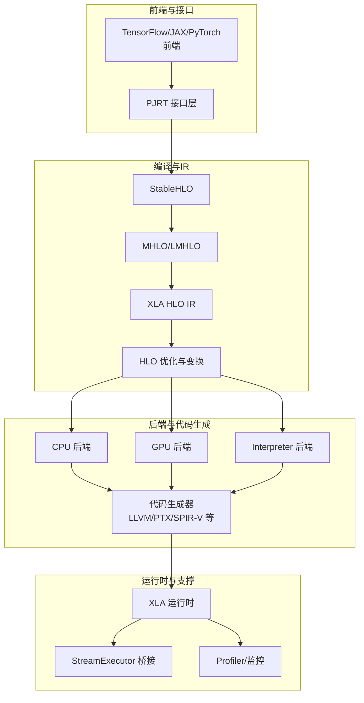
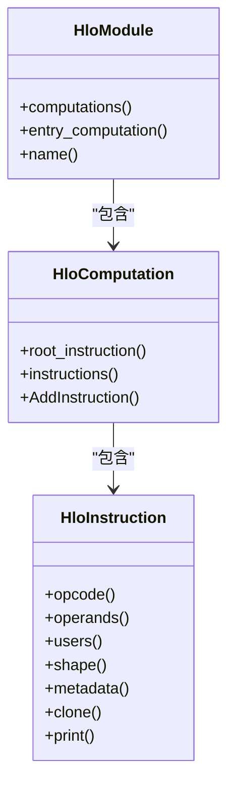
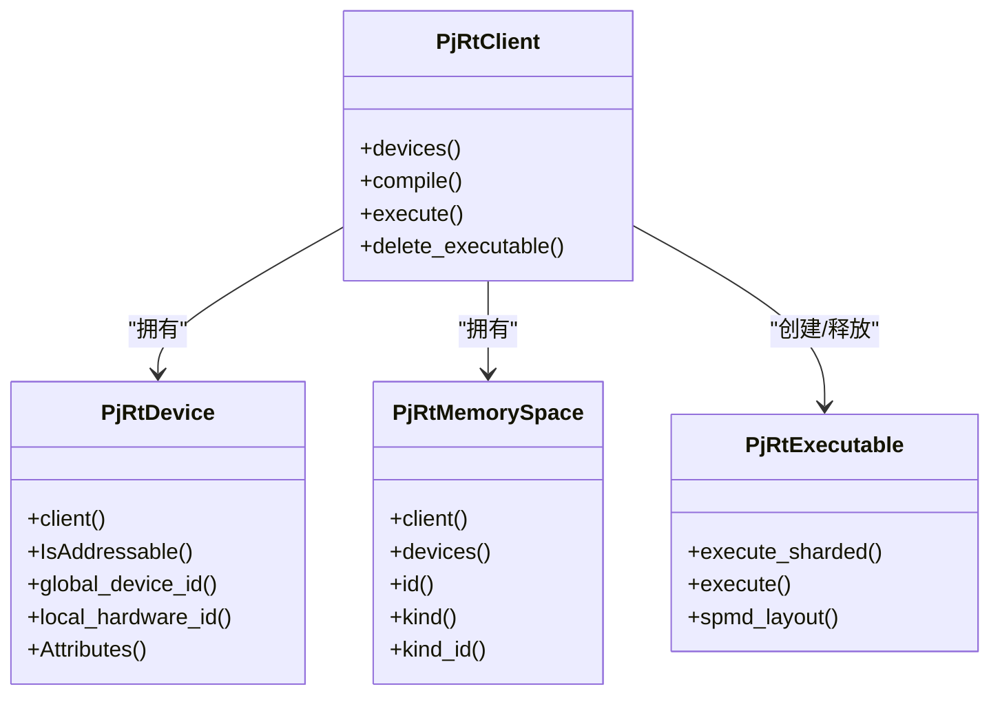
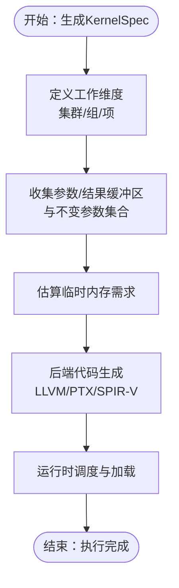
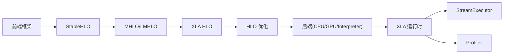

# 架构设计

<cite>
**本文引用的文件**
- [README.md](file://README.md)
- [docs/architecture.md](file://docs/architecture.md)
- [xla/README.md](file://xla/README.md)
- [xla/mlir_hlo/README.md](file://xla/mlir_hlo/README.md)
- [xla/hlo/ir/hlo_instruction.h](file://xla/hlo/ir/hlo_instruction.h)
- [xla/pjrt/pjrt_client.h](file://xla/pjrt/pjrt_client.h)
- [xla/codegen/kernel_spec.h](file://xla/codegen/kernel_spec.h)
- [xla/backends/cpu/README.md](file://xla/backends/cpu/README.md)
- [xla/backends/gpu/README.md](file://xla/backends/gpu/README.md)
- [xla/backends/interpreter/README.md](file://xla/backends/interpreter/README.md)
- [xla/backends/profiler/README.md](file://xla/backends/profiler/README.md)
- [xla/service/README.md](file://xla/service/README.md)
- [xla/stream_executor/README.md](file://xla/stream_executor/README.md)
- [xla/python/README.md](file://xla/python/README.md)
- [xla/mlir/README.md](file://xla/mlir/README.md)
- [xla/mlir_hlo/README.md](file://xla/mlir_hlo/README.md)
- [xla/pjrt/README.md](file://xla/pjrt/README.md)
- [xla/runtime/README.md](file://xla/runtime/README.md)
- [xla/tools/README.md](file://xla/tools/README.md)
- [xla/translate/README.md](file://xla/translate/README.md)
- [xla/AGENTS.md](file://xla/AGENTS.md)
- [xla/GEMINI.md](file://xla/GEMINI.md)
- [xla/xla.proto](file://xla/xla.proto)
- [xla/xla_data.proto](file://xla/xla_data.proto)
- [xla/autotuning.proto](file://xla/autotuning.proto)
- [xla/autotune_results.proto](file://xla/autotune_results.proto)
- [third_party/tsl/tsl/profiler/protobuf/profile.proto](file://third_party/tsl/tsl/profiler/protobuf/profile.proto)
- [third_party/tsl/tsl/profiler/protobuf/xplane.proto](file://third_party/tsl/tsl/profiler/protobuf/xplane.proto)
</cite>

## 目录
1. [引言](#引言)
2. [项目结构](#项目结构)
3. [核心组件](#核心组件)
4. [架构总览](#架构总览)
5. [详细组件分析](#详细组件分析)
6. [依赖关系分析](#依赖关系分析)
7. [性能考量](#性能考量)
8. [故障排查指南](#故障排查指南)
9. [结论](#结论)
10. [附录](#附录)

## 引言
本架构文档面向XLA（Accelerated Linear Algebra）在OpenXLA生态中的整体设计与实现，聚焦于高层目标、架构模式、系统边界、组件交互、数据流与集成方式。文档特别强调以下方面：
- 高层目标：提升执行速度、降低内存占用、减少对自定义算子的依赖、增强可移植性
- 核心IR与编译管线：从StableHLO到HLO再到后端代码生成的演进路径
- MLIR集成：MHLO/LMHLO等方言与XLA HLO的协同
- 后端抽象层：CPU/GPU/Interpreter等后端的统一接口与差异化实现
- 安全性、监控与灾难恢复：贯穿运行时与工具链的可观测性与稳定性保障
- 基础设施与可扩展性：多平台、多设备、多进程/多主机部署拓扑
- 技术栈与第三方依赖：LLVM、StableHLO、MLIR、CUDA/ROCm等

## 项目结构
XLA采用模块化分层组织，核心目录包括：
- backends：后端实现（CPU/GPU/Interpreter/Profiler等）
- hlo：HLO IR与优化、变换、评估器等
- mlir/mlir_hlo：MLIR方言与转换（含已弃用的独立仓库说明）
- pjrt：跨平台运行时接口（PJRT）
- codegen：内核规格、发射器、工具与低级IR生成
- runtime：执行图、资源使用、挂起检测等运行时支撑
- service：服务端相关（历史遗留，现逐步迁移）
- stream_executor：底层设备抽象与执行引擎桥接
- python：Python绑定与IFRT/PJRT IFRT桥接
- tools：编译、测试、工具链
- translate：StableHLO/MHLO/HLO之间的互转
- third_party：第三方库与依赖（如LLVM、CUDA、protobuf等）



图表来源
- [docs/architecture.md](file://docs/architecture.md#L35-L72)
- [xla/README.md](file://xla/README.md#L19-L103)
- [xla/mlir_hlo/README.md](file://xla/mlir_hlo/README.md#L106-L244)

章节来源
- [README.md](file://README.md#L1-L50)
- [docs/architecture.md](file://docs/architecture.md#L1-L72)
- [xla/README.md](file://xla/README.md#L1-L103)

## 核心组件
- HLO IR与指令模型：以有向无环图（DAG）表示计算，支持形状、布局、分片与元数据管理，是XLA优化与后端适配的核心中间表示
- PJRT客户端接口：统一的跨平台执行接口，屏蔽后端差异，提供设备、内存空间、可执行对象与异步执行能力
- 代码生成器与内核规格：KernelSpec定义工作集群/组/项维度、参数缓冲区、结果缓冲区、不变参数集合与临时内存需求，驱动LLVM/NVPTX/ROCm/SYCL等后端生成机器码
- 后端抽象层：CPU/GPU/Interpreter等后端共享统一接口，通过目标特定优化与代码生成实现高效执行
- MLIR集成：MHLO/LMHLO方言与XLA HLO的转换与融合，支撑动态形状、控制流与更广泛的优化
- 运行时与支撑：执行图、资源使用统计、挂起检测、事件池与异步工作调度

章节来源
- [xla/hlo/ir/hlo_instruction.h](file://xla/hlo/ir/hlo_instruction.h#L16-L101)
- [xla/pjrt/pjrt_client.h](file://xla/pjrt/pjrt_client.h#L70-L112)
- [xla/codegen/kernel_spec.h](file://xla/codegen/kernel_spec.h#L37-L114)

## 架构总览
XLA的编译与执行流程遵循“前端→IR→优化→后端→代码生成→运行时”的经典流水线，并通过PJRT实现跨平台统一接口。StableHLO作为前端到编译器的稳定桥梁，MHLO/LMHLO提供MLIR层面的灵活性与实验能力，HLO承载XLA内部优化与后端适配，最终由后端代码生成器产出目标机器码并在运行时执行。

```mermaid
sequenceDiagram
participant FE as "前端框架<br/>TF/JAX/PyTorch"
participant PJRT as "PJRT 客户端"
participant SHLO as "StableHLO"
participant MHLO as "MHLO/LMHLO"
participant HLO as "XLA HLO IR"
participant OPT as "HLO 优化/变换"
participant BE as "后端( CPU/GPU/Interpreter )"
participant CG as "代码生成器"
participant RT as "XLA 运行时"
FE->>PJRT : 提交计算图/函数
PJRT->>SHLO : 转换为 StableHLO
SHLO->>MHLO : 转换为 MHLO/LMHLO
MHLO->>HLO : 转换为 XLA HLO
HLO->>OPT : 执行目标无关优化
OPT->>BE : 传递后端特定优化
BE->>CG : 生成目标代码(LLVM/PTX/SPIR-V)
CG->>RT : 加载/调度执行
RT-->>PJRT : 返回结果/事件
```

图表来源
- [docs/architecture.md](file://docs/architecture.md#L35-L72)
- [xla/mlir_hlo/README.md](file://xla/mlir_hlo/README.md#L106-L244)
- [xla/pjrt/pjrt_client.h](file://xla/pjrt/pjrt_client.h#L70-L112)

## 详细组件分析

### HLO IR与指令模型
- 设计理念：以不可变张量与静态形状为核心，提供正交算子集，便于全局优化与后端适配
- 数据结构：指令节点、计算图、模块、分片与布局信息，支持克隆、遍历与打印选项
- 复杂度与优化：基于DAG的指令序列化与迭代器封装，支持常量折叠、公共子表达式消除、融合与内存分配分析
- 错误处理：通过absl::Status/StatusOr进行错误传播，配合致命错误sink与调试上下文工具



图表来源
- [xla/hlo/ir/hlo_instruction.h](file://xla/hlo/ir/hlo_instruction.h#L80-L166)

章节来源
- [xla/hlo/ir/hlo_instruction.h](file://xla/hlo/ir/hlo_instruction.h#L16-L200)

### PJRT客户端接口
- 统一抽象：PjRtClient封装设备、内存空间、可执行对象与编译选项；PjRtDevice提供设备描述与属性；PjRtMemorySpace抽象不同内存域
- 异步执行：Future与事件池机制支持非阻塞执行与并发调度
- 分布式与多进程：支持多主机、多设备拓扑，协调服务与键值存储接口
- 编译与执行：CompileOptions、Layout、Literal与ExecutableForwarder构成完整的编译-加载-执行闭环



图表来源
- [xla/pjrt/pjrt_client.h](file://xla/pjrt/pjrt_client.h#L74-L200)

章节来源
- [xla/pjrt/pjrt_client.h](file://xla/pjrt/pjrt_client.h#L70-L200)

### 代码生成器与内核规格
- KernelSpec：定义内核名称、工作维度（集群/组/项）、参数与结果缓冲区、不变参数集合与临时内存需求
- 工作维度映射：GPU后端映射到cluster/block/thread；CPU后端映射到线程池任务；确保空间划分与数据局部性优化
- 与运行时协作：结合BufferAssignment与ShapedSlice，明确输入输出布局与切片，驱动后端运行时加载与调度



图表来源
- [xla/codegen/kernel_spec.h](file://xla/codegen/kernel_spec.h#L37-L114)

章节来源
- [xla/codegen/kernel_spec.h](file://xla/codegen/kernel_spec.h#L37-L114)

### 后端抽象层（CPU/GPU/Interpreter/Profiler）
- CPU后端：多ISA支持，XNN融合与自动调优，面向通用CPU优化
- GPU后端：CUDA/ROCm/SYCL等，LLVM NVPTX/AMDGPU/SPIRV后端，内核调度与共享内存优化
- Interpreter后端：用于验证与调试，不依赖硬件加速
- Profiler后端：提供性能分析与事件采集，支撑端到端性能回路

章节来源
- [xla/backends/cpu/README.md](file://xla/backends/cpu/README.md)
- [xla/backends/gpu/README.md](file://xla/backends/gpu/README.md)
- [xla/backends/interpreter/README.md](file://xla/backends/interpreter/README.md)
- [xla/backends/profiler/README.md](file://xla/backends/profiler/README.md)

### MLIR集成与HLO方言
- MHLO/LMHLO：提供动态形状、控制流与多结果操作，作为XLA HLO的补充与实验平台
- 转换与互操作：StableHLO↔MHLO↔HLO的双向转换，支撑前端到后端的完整链路
- 兼容性与迁移：当前XLA GPU代码生成正在向MLIR迁移，保持与现有HLO优化的兼容

章节来源
- [xla/mlir_hlo/README.md](file://xla/mlir_hlo/README.md#L106-L244)
- [xla/mlir/README.md](file://xla/mlir/README.md)
- [xla/translate/README.md](file://xla/translate/README.md)

### 运行时与支撑组件
- 执行图与资源使用：跟踪执行图、资源使用与挂起检测，保障长尾问题的可观测性
- 事件与异步：事件池、信号量与异步工作调度，支撑高并发执行
- 监控与分析：XPlane/Profile协议与分析工具，形成端到端的性能闭环

章节来源
- [xla/runtime/README.md](file://xla/runtime/README.md)
- [third_party/tsl/tsl/profiler/protobuf/profile.proto](file://third_party/tsl/tsl/profiler/protobuf/profile.proto)
- [third_party/tsl/tsl/profiler/protobuf/xplane.proto](file://third_party/tsl/tsl/profiler/protobuf/xplane.proto)

## 依赖关系分析
- 前端到编译器：StableHLO作为统一IR，避免前端差异带来的适配成本
- 编译器到后端：HLO与MHLO/LMHLO分别承担目标无关与目标相关的优化职责
- 后端到运行时：统一的KernelSpec与运行时调度接口，屏蔽硬件差异
- 第三方依赖：LLVM、CUDA/ROCm、MLIR、protobuf等，版本与兼容性通过构建配置与依赖清单管理



图表来源
- [docs/architecture.md](file://docs/architecture.md#L35-L72)
- [xla/mlir_hlo/README.md](file://xla/mlir_hlo/README.md#L106-L244)

章节来源
- [docs/architecture.md](file://docs/architecture.md#L35-L72)
- [xla/mlir_hlo/README.md](file://xla/mlir_hlo/README.md#L106-L244)

## 性能考量
- 优化策略：CSE、融合、内存分配与调度、自动调优与缓存
- 并发与调度：多工作集群/组/项维度映射，事件池与异步执行
- 内存与带宽：缓冲区分配、切片与布局优化，减少中间存储
- 可观测性：执行图、资源使用、挂起检测与性能分析，支撑持续优化

## 故障排查指南
- 错误传播：使用absl::Status/StatusOr与致命错误sink，定位编译与执行阶段的问题
- 调试工具：HLO转储、调试上下文工具、性能分析与事件采集
- 运行时稳定性：挂起检测、资源使用统计与事件池，辅助定位死锁与长尾问题

章节来源
- [xla/error/README.md](file://xla/error/README.md)
- [xla/runtime/hang_watchdog.h](file://xla/runtime/hang_watchdog.h)
- [xla/runtime/resource_use.h](file://xla/runtime/resource_use.h)

## 结论
XLA通过StableHLO与HLO/MHLO/LMHLO的分层IR设计，实现了从多前端到多后端的高性能、可移植与可扩展的编译执行体系。PJRT提供了统一的跨平台接口，后端抽象层与代码生成器保证了对不同硬件的高效适配。运行时与工具链的可观测性与稳定性保障，使系统能够在大规模部署中保持可靠与高效。

## 附录
- 技术栈与版本兼容性：LLVM、CUDA/ROCm、MLIR、protobuf等，版本与兼容性通过构建配置与依赖清单管理
- 第三方依赖：见third_party目录与各后端README
- 协议与数据模型：xla.proto、xla_data.proto、autotuning/autotune_results.proto等

章节来源
- [xla/xla.proto](file://xla/xla.proto)
- [xla/xla_data.proto](file://xla/xla_data.proto)
- [xla/autotuning.proto](file://xla/autotuning.proto)
- [xla/autotune_results.proto](file://xla/autotune_results.proto)
- [xla/AGENTS.md](file://xla/AGENTS.md)
- [xla/GEMINI.md](file://xla/GEMINI.md)