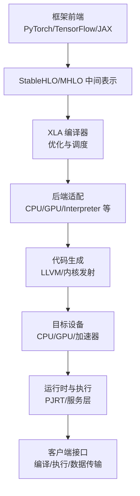
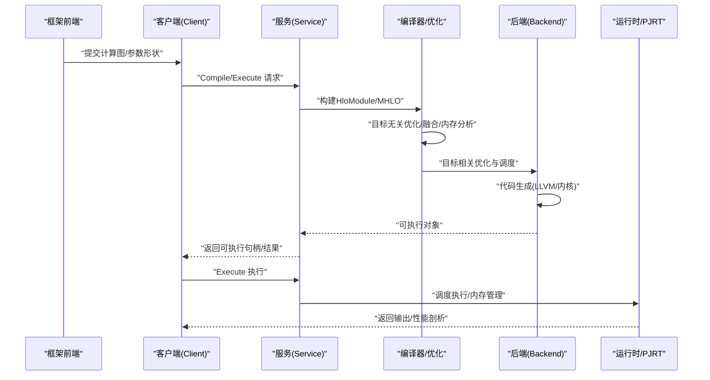
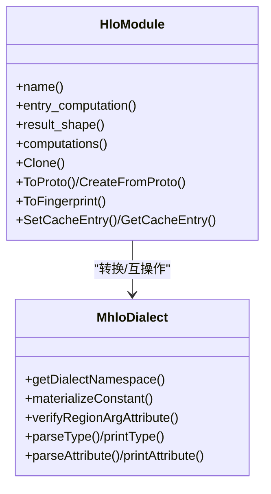
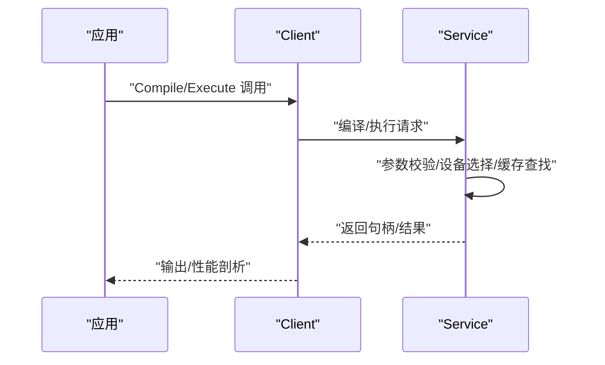
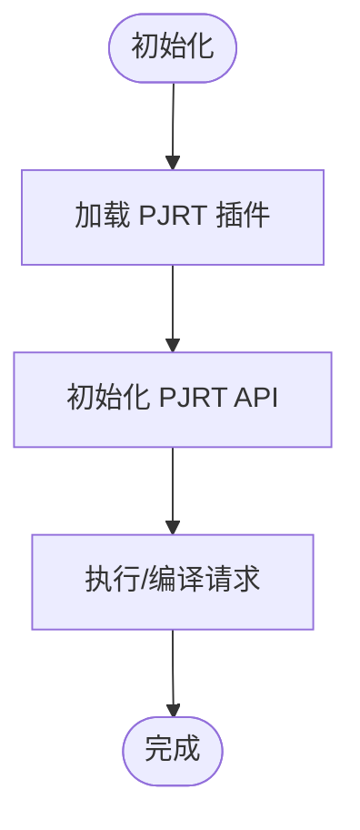

# 编译器概述

<cite>
**本文引用的文件**
- [README.md](file://README.md)
- [xla\README.md](file://xla/README.md)
- [docs\architecture.md](file://docs/architecture.md)
- [docs\index.md](file://docs/index.md)
- [xla\hlo\ir\hlo_module.h](file://xla/hlo/ir/hlo_module.h)
- [xla\mlir_hlo\mhlo\ir\hlo_ops.h](file://xla/mlir_hlo/mhlo/ir/hlo_ops.h)
- [xla\service\service.h](file://xla/service/service.h)
- [xla\client\client.h](file://xla/client/client.h)
- [xla\pjrt\pjrt_api.h](file://xla/pjrt/pjrt_api.h)
</cite>

## 目录
1. [引言](#引言)
2. [项目结构](#项目结构)
3. [核心组件](#核心组件)
4. [架构总览](#架构总览)
5. [详细组件分析](#详细组件分析)
6. [依赖分析](#依赖分析)
7. [性能考量](#性能考量)
8. [故障排查指南](#故障排查指南)
9. [结论](#结论)
10. [附录](#附录)

## 引言
本文件面向XLA编译器（加速线性代数）的综合概述，聚焦其整体目标、设计理念与核心价值主张，并系统阐述XLA如何通过提升执行速度、降低内存占用、减少对自定义算子的依赖，以及增强跨平台可移植性，来优化机器学习计算。同时，本文说明XLA在ML生态系统中的定位：作为框架前端与硬件后端之间的编译与执行桥梁；并介绍OpenXLA项目背景及XLA的发展历程。最后，给出编译器架构的高层视图，说明主要组件及其相互关系。

- XLA是面向机器学习的开源编译器，支持GPU、CPU与ML加速器等多后端，服务于PyTorch、TensorFlow、JAX等主流框架。
- 在OpenXLA生态下，XLA由多家硬件与软件厂商协作开发，强调“构建于任何地方、运行于任何地方”的可移植性与规模化性能优化能力。
- XLA的核心价值在于：以稳定、可演进的中间表示（StableHLO/MHLO）为桥梁，统一前端模型表达，向下生成高效目标码，向上提供统一的执行接口（如PJRT）。

章节来源
- file://README.md#L1-L50
- file://docs/index.md#L1-L39
- file://docs/architecture.md#L1-L72

## 项目结构
XLA仓库采用模块化组织方式，围绕“前端-中间表示-后端-运行时”分层展开。顶层README与xla目录README提供了总体概览与迁移计划；docs目录包含架构与使用文档；核心实现分布在hlo、mlir_hlo、service、client、pjrt、backends等子目录中。

- 前端与集成：client与service提供编译与执行入口；PJRT为跨后端统一执行API。
- 中间表示：HLO与MHLO分别对应传统XLA IR与基于MLIR的现代IR。
- 后端与代码生成：backends/cpu、backends/gpu等提供目标特定优化与代码生成；MLIR路径提供跨方言转换与传递。
- 运行时与工具：runtime、tools、tests等支撑执行与调试。

图表来源
- [docs\architecture.md](file://docs/architecture.md#L35-L72)
- [xla\README.md](file://xla/README.md#L19-L103)

章节来源
- file://xla/README.md#L19-L103
- file://docs/architecture.md#L35-L72

## 核心组件
- HLO模块（HloModule）
  - 表示单个可编译程序单元，包含入口计算与嵌入式计算，支持克隆、拓扑排序、布局与分片配置等。
  - 提供序列化/反序列化、指纹计算、缓存条目管理等能力，支撑编译缓存与一致性校验。
- MHLO方言（MhloDialect）
  - 定义MHLO操作集合与类型系统，作为StableHLO的MLIR实现，便于跨方言变换与工具链集成。
- 服务层（Service）
  - 统一编译与执行入口，负责参数形状验证、设备句柄分配、执行跟踪、缓存管理与结果注册。
- 客户端（Client）
  - 面向用户的编译/执行/数据传输接口封装，简化调用流程并提供生命周期管理。
- PJRT API
  - 插件化执行API，支持按设备类型加载插件、初始化与查询可用API，作为跨后端统一执行面。

章节来源
- file://xla/hlo/ir/hlo_module.h#L94-L120
- file://xla/mlir_hlo/mhlo/ir/hlo_ops.h#L55-L86
- file://xla/service/service.h#L141-L246
- file://xla/client/client.h#L42-L101
- file://xla/pjrt/pjrt_api.h#L29-L47

## 架构总览
XLA的编译与执行流程可概括为三层：前端输入与中间表示、编译期优化与调度、后端代码生成与执行。该过程强调模块化与可扩展性，便于新增后端与优化策略。

图表来源
- [docs\architecture.md](file://docs/architecture.md#L43-L66)
- [xla\service\service.h](file://xla/service/service.h#L154-L171)
- [xla\client\client.h](file://xla/client/client.h#L67-L101)

章节来源
- file://docs/architecture.md#L35-L72
- file://xla/service/service.h#L141-L246
- file://xla/client/client.h#L42-L101

## 详细组件分析

### HLO 模块与中间表示
- HloModule是HLO IR的顶层容器，承载入口计算、嵌入式计算、布局与分片信息，并提供克隆、拓扑排序、序列化/反序列化、指纹与缓存等能力。
- MHLO作为StableHLO的MLIR实现，提供统一的操作与类型系统，便于跨方言变换与工具链集成。

图表来源
- [xla\hlo\ir\hlo_module.h](file://xla/hlo/ir/hlo_module.h#L94-L120)
- [xla\hlo\ir\hlo_module.h](file://xla/hlo/ir/hlo_module.h#L524-L568)
- [xla\mlir_hlo\mhlo\ir\hlo_ops.h](file://xla/mlir_hlo/mhlo/ir/hlo_ops.h#L55-L86)

章节来源
- file://xla/hlo/ir/hlo_module.h#L94-L120
- file://xla/hlo/ir/hlo_module.h#L524-L568
- file://xla/mlir_hlo/mhlo/ir/hlo_ops.h#L55-L86

### 服务层与客户端
- Service负责编译请求的接收、模块配置、设备句柄分配、执行跟踪与缓存管理，并提供构建可执行对象与执行的统一接口。
- Client在Service之上提供更友好的编译/执行/数据传输接口，简化用户侧调用。

图表来源
- [xla\client\client.h](file://xla/client/client.h#L67-L101)
- [xla\service\service.h](file://xla/service/service.h#L154-L171)

章节来源
- file://xla/client/client.h#L42-L101
- file://xla/service/service.h#L141-L246

### PJRT 执行接口
- PJRT提供按设备类型的API加载与初始化机制，支持插件化后端接入，统一跨后端执行面。

图表来源
- [xla\pjrt\pjrt_api.h](file://xla/pjrt/pjrt_api.h#L35-L47)

章节来源
- file://xla/pjrt/pjrt_api.h#L29-L47

## 依赖分析
- 前端到中间表示：StableHLO/MHLO作为统一IR，屏蔽前端差异，确保跨框架可移植。
- 中间表示到后端：HLO/MHLO经由编译器进行目标无关与目标相关的优化，再由后端生成目标码。
- 运行时到设备：PJRT/服务层负责设备资源管理、执行调度与内存管理，向上提供一致的执行接口。

图表来源
- [docs\architecture.md](file://docs/architecture.md#L37-L66)
- [xla\service\service.h](file://xla/service/service.h#L227-L246)

章节来源
- file://docs/architecture.md#L35-L72
- file://xla/service/service.h#L227-L246

## 性能考量
- 执行速度优化：通过子图编译、短生命周期算子融合、流水线操作融合与常量传播特化，减少运行时开销。
- 内存使用优化：通过缓冲区分析与调度，消除中间存储，降低峰值内存占用。
- 自定义算子依赖降低：通过自动融合低层算子达到手写融合的性能水平，减少对定制算子的依赖。
- 可移植性：以StableHLO为桥梁，易于新增后端，使大量模型无需重写即可在新硬件上运行。

章节来源
- file://docs/architecture.md#L17-L34

## 故障排查指南
- 编译与执行问题：优先检查参数形状与布局是否匹配、设备句柄是否正确、执行选项是否合理。
- 缓存与一致性：利用HloModule的指纹与缓存接口定位重复编译或缓存不一致问题。
- 插件与后端：确认PJRT插件加载与初始化成功，设备类型映射正确。
- 性能剖析：结合服务层提供的执行剖析接口，定位热点与瓶颈。

章节来源
- file://xla/hlo/ir/hlo_module.h#L248-L265
- file://xla/pjrt/pjrt_api.h#L35-L47
- file://xla/service/service.h#L154-L171

## 结论
XLA作为OpenXLA生态的关键组成，以StableHLO/MHLO为桥梁，连接多前端与多后端，提供从编译优化到执行调度的一体化能力。其核心目标是提升执行速度、降低内存占用、减少对自定义算子的依赖，并增强跨平台可移植性。通过模块化设计与插件化执行接口（PJRT），XLA能够持续适配新的硬件与优化策略，在大规模机器学习场景中发挥关键作用。

## 附录
- OpenXLA项目背景：XLA现为OpenXLA的一部分，由多家硬件与软件厂商协作开发，强调开放、可演进与规模化。
- 发展历程：XLA最初在TensorFlow内部发展，后迁移到OpenXLA，逐步引入MLIR与现代IR体系，持续增强可移植性与可扩展性。

章节来源
- file://README.md#L11-L15
- file://docs/index.md#L8-L10
- file://xla/README.md#L9-L11