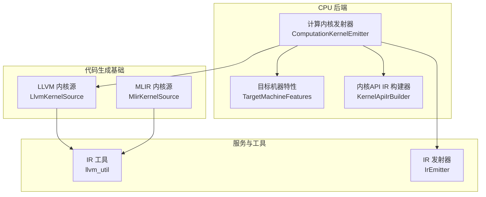
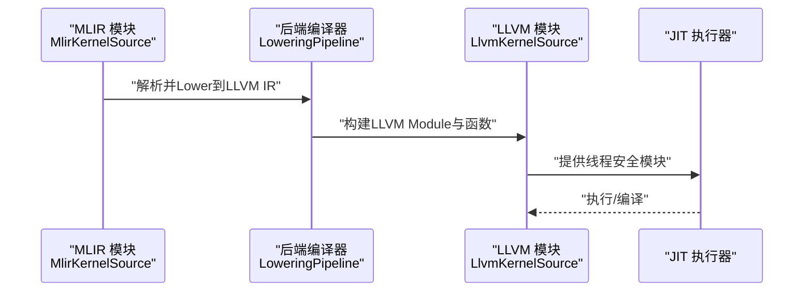
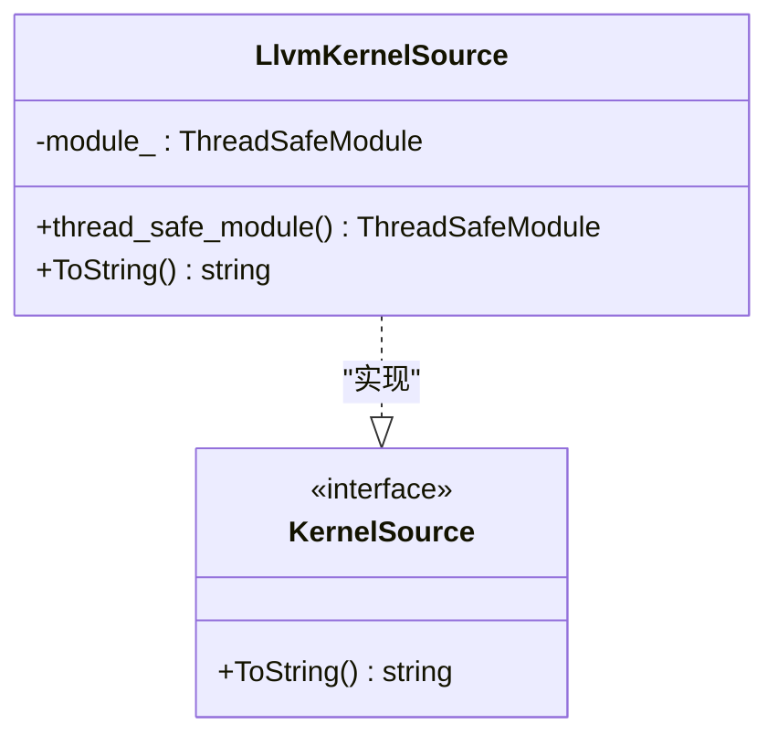
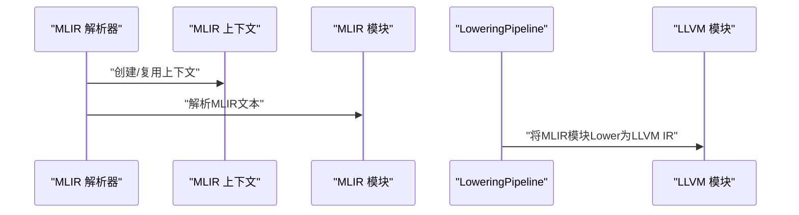
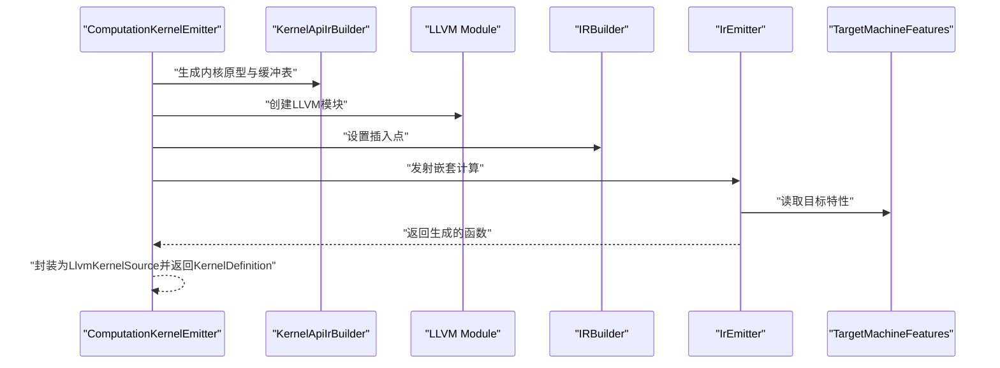
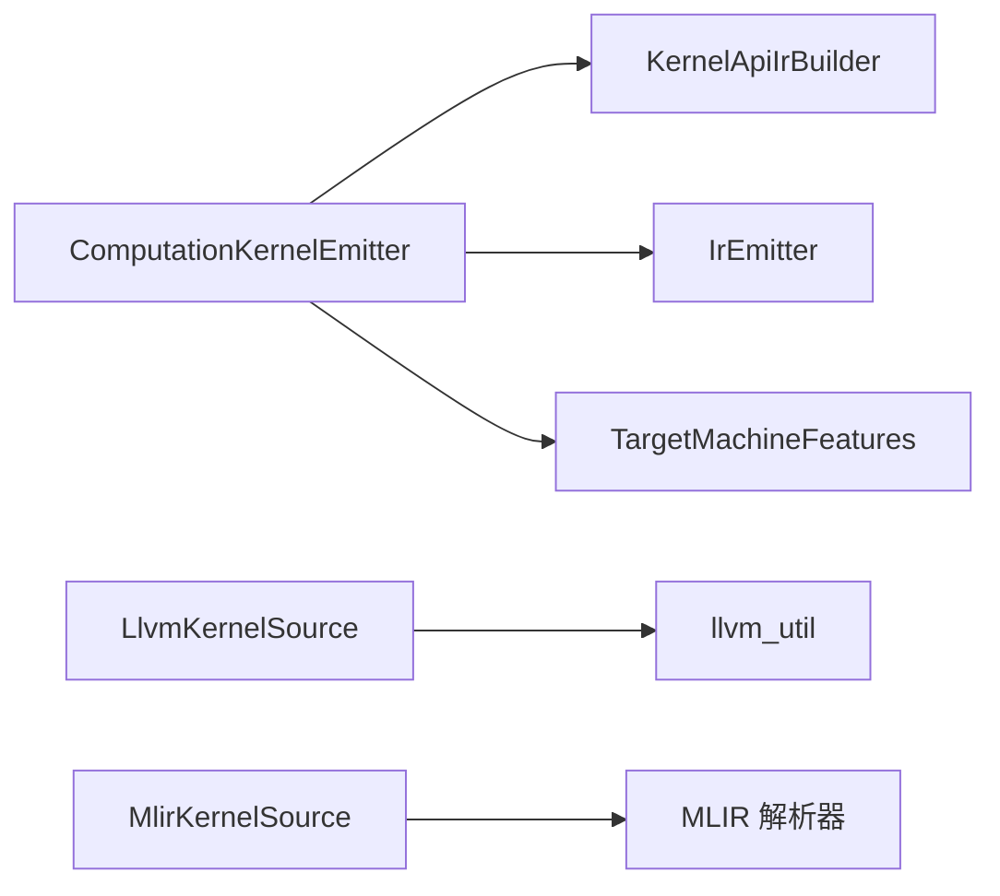

# LLVM代码生成

<cite>
**本文引用的文件**
- [xla/codegen/llvm_kernel_source.h](file://xla/codegen/llvm_kernel_source.h)
- [xla/codegen/llvm_kernel_source.cc](file://xla/codegen/llvm_kernel_source.cc)
- [xla/codegen/mlir_kernel_source.h](file://xla/codegen/mlir_kernel_source.h)
- [xla/codegen/mlir_kernel_source.cc](file://xla/codegen/mlir_kernel_source.cc)
- [xla/backends/cpu/codegen/computation_kernel_emitter.h](file://xla/backends/cpu/codegen/computation_kernel_emitter.h)
- [xla/backends/cpu/codegen/computation_kernel_emitter.cc](file://xla/backends/cpu/codegen/computation_kernel_emitter.cc)
- [xla/backends/cpu/codegen/target_machine_features.h](file://xla/backends/cpu/codegen/target_machine_features.h)
- [xla/backends/cpu/codegen/kernel_api_ir_builder.h](file://xla/backends/cpu/codegen/kernel_api_ir_builder.h)
- [xla/service/llvm_ir/llvm_util.h](file://xla/service/llvm_ir/llvm_util.h)
- [xla/service/cpu/ir_emitter.h](file://xla/service/cpu/ir_emitter.h)
- [xla/codegen/kernel_definition.h](file://xla/codegen/kernel_definition.h)
- [xla/codegen/kernel_spec.h](file://xla/codegen/kernel_spec.h)
- [xla/hlo/ir/hlo_instruction.h](file://xla/hlo/ir/hlo_instruction.h)
- [xla/service/buffer_assignment.h](file://xla/service/buffer_assignment.h)
</cite>

## 目录
1. [简介](#简介)
2. [项目结构](#项目结构)
3. [核心组件](#核心组件)
4. [架构总览](#架构总览)
5. [详细组件分析](#详细组件分析)
6. [依赖关系分析](#依赖关系分析)
7. [性能考虑](#性能考虑)
8. [故障排查指南](#故障排查指南)
9. [结论](#结论)
10. [附录](#附录)

## 简介
本文件面向LLVM后端的代码生成实现，聚焦于从MLIR到LLVM IR的转换路径、LLVM模块的优化与目标代码生成，以及XLA中与LLVM相关的关键组件设计与使用方式。重点覆盖以下方面：
- LlvmKernelSource类的设计：LLVM上下文管理、模块构建与JIT编译支持
- 从MLIR到LLVM IR的生成策略：函数内联、循环优化、寄存器分配
- 针对不同CPU架构的特定优化：SSE、AVX指令集支持
- LLVM Pass Pipeline应用：InstructionCombining、LoopVectorize等
- 调试与性能分析方法

## 项目结构
围绕LLVM代码生成的相关文件主要分布在以下位置：
- 代码生成基础与源表示：xla/codegen（包含LLVM与MLIR两种内核源）
- CPU后端代码生成器：xla/backends/cpu/codegen（包含计算内核发射器、目标特性、API IR构建器）
- LLVM IR工具与服务：xla/service/llvm_ir（包含IR打印、验证等实用工具）
- HLO与缓冲区分配：xla/hlo/ir与xla/service/buffer_assignment（用于生成阶段的形状与缓冲区布局信息）

**图表来源**
- [xla/codegen/llvm_kernel_source.h](file://xla/codegen/llvm_kernel_source.h#L34-L51)
- [xla/codegen/mlir_kernel_source.h](file://xla/codegen/mlir_kernel_source.h#L41-L76)
- [xla/backends/cpu/codegen/computation_kernel_emitter.h](file://xla/backends/cpu/codegen/computation_kernel_emitter.h#L47-L68)
- [xla/backends/cpu/codegen/target_machine_features.h](file://xla/backends/cpu/codegen/target_machine_features.h)
- [xla/backends/cpu/codegen/kernel_api_ir_builder.h](file://xla/backends/cpu/codegen/kernel_api_ir_builder.h)
- [xla/service/llvm_ir/llvm_util.h](file://xla/service/llvm_ir/llvm_util.h)
- [xla/service/cpu/ir_emitter.h](file://xla/service/cpu/ir_emitter.h)

**章节来源**
- [xla/codegen/llvm_kernel_source.h](file://xla/codegen/llvm_kernel_source.h#L16-L56)
- [xla/codegen/mlir_kernel_source.h](file://xla/codegen/mlir_kernel_source.h#L16-L81)
- [xla/backends/cpu/codegen/computation_kernel_emitter.h](file://xla/backends/cpu/codegen/computation_kernel_emitter.h#L16-L73)

## 核心组件
本节深入解析与LLVM代码生成直接相关的核心组件及其职责。

- LlvmKernelSource
  - 角色：封装一个线程安全的LLVM模块，便于在JIT执行时进行并发访问与编译
  - 关键点：持有ThreadSafeContext与ThreadSafeModule；提供ToString以导出LLVM IR字符串
  - 使用场景：作为KernelSource的LLVM实现，供上层编译器或执行器使用

- MlirKernelSource
  - 角色：封装MLIR模块与上下文，支持从字符串解析MLIR IR
  - 关键点：提供ParseFromString解析MLIR文本；模块所有权控制；ToString输出MLIR调试字符串
  - 使用场景：作为中间表示，由后端编译器进一步Lower到LLVM IR

- ComputationKernelEmitter
  - 角色：针对调用指令发射内核定义，包含嵌套计算的递归发射
  - 关键点：基于KernelApiIrBuilder生成内核原型与缓冲表；通过IrEmitter将HLO嵌套计算转为LLVM IR；结合TargetMachineFeatures进行架构相关优化
  - 输出：返回KernelDefinition与LlvmKernelSource，供后续Pass与JIT使用

- KernelApiIrBuilder
  - 角色：根据HLO配置与缓冲区布局生成内核函数原型、参数与结果缓冲区，并建立缓冲表索引
  - 关键点：选项来源于HloModuleConfig；缓冲表索引映射Slice到表项位置

- TargetMachineFeatures
  - 角色：描述目标CPU的特性（如SSE、AVX等），驱动LLVM后端选择合适的指令与优化策略

- IrEmitter
  - 角色：将HLO嵌套计算转换为LLVM IR，支持常量全局初始化、自定义调用等

**章节来源**
- [xla/codegen/llvm_kernel_source.h](file://xla/codegen/llvm_kernel_source.h#L34-L51)
- [xla/codegen/llvm_kernel_source.cc](file://xla/codegen/llvm_kernel_source.cc#L25-L28)
- [xla/codegen/mlir_kernel_source.h](file://xla/codegen/mlir_kernel_source.h#L41-L76)
- [xla/codegen/mlir_kernel_source.cc](file://xla/codegen/mlir_kernel_source.cc#L37-L57)
- [xla/backends/cpu/codegen/computation_kernel_emitter.h](file://xla/backends/cpu/codegen/computation_kernel_emitter.h#L47-L68)
- [xla/backends/cpu/codegen/computation_kernel_emitter.cc](file://xla/backends/cpu/codegen/computation_kernel_emitter.cc#L135-L232)
- [xla/backends/cpu/codegen/kernel_api_ir_builder.h](file://xla/backends/cpu/codegen/kernel_api_ir_builder.h)
- [xla/backends/cpu/codegen/target_machine_features.h](file://xla/backends/cpu/codegen/target_machine_features.h)
- [xla/service/cpu/ir_emitter.h](file://xla/service/cpu/ir_emitter.h)

## 架构总览
下图展示了从MLIR到LLVM IR的整体流程，以及关键组件之间的交互关系。

**图表来源**
- [xla/codegen/mlir_kernel_source.h](file://xla/codegen/mlir_kernel_source.h#L41-L76)
- [xla/codegen/llvm_kernel_source.h](file://xla/codegen/llvm_kernel_source.h#L34-L51)

## 详细组件分析

### LlvmKernelSource 类设计与使用
- 设计要点
  - 线程安全：通过ThreadSafeContext与ThreadSafeModule确保并发访问的安全性
  - 模块持有：构造时接收LLVMContext与Module的所有权，封装为ThreadSafeModule
  - 可移动语义：支持移动构造与赋值，便于跨组件传递
  - 可视化：ToString通过llvm_util导出LLVM IR字符串，便于调试

- 典型使用流程
  - 在发射器中创建LLVMContext与Module
  - 通过KernelApiIrBuilder生成内核原型与缓冲表
  - 使用IrEmitter将HLO嵌套计算转为LLVM IR
  - 封装为LlvmKernelSource，供后续Pass与JIT使用

**图表来源**
- [xla/codegen/llvm_kernel_source.h](file://xla/codegen/llvm_kernel_source.h#L34-L51)

**章节来源**
- [xla/codegen/llvm_kernel_source.h](file://xla/codegen/llvm_kernel_source.h#L34-L51)
- [xla/codegen/llvm_kernel_source.cc](file://xla/codegen/llvm_kernel_source.cc#L25-L28)
- [xla/service/llvm_ir/llvm_util.h](file://xla/service/llvm_ir/llvm_util.h)

### 从MLIR到LLVM IR的转换
- MlirKernelSource负责解析MLIR文本并持有MLIR上下文与模块
- LoweringPipeline将MLIR模块Lower到LLVM IR，生成LLVM Module
- 生成的LLVM IR随后可被Pass Pipeline优化，并最终由JIT编译执行

**图表来源**
- [xla/codegen/mlir_kernel_source.cc](file://xla/codegen/mlir_kernel_source.cc#L37-L57)
- [xla/codegen/mlir_kernel_source.h](file://xla/codegen/mlir_kernel_source.h#L41-L76)

**章节来源**
- [xla/codegen/mlir_kernel_source.cc](file://xla/codegen/mlir_kernel_source.cc#L37-L57)
- [xla/codegen/mlir_kernel_source.h](file://xla/codegen/mlir_kernel_source.h#L41-L76)

### ComputationKernelEmitter：内核发射与缓冲表
- 功能概述
  - 针对调用指令发射内核定义，包含对嵌套计算的递归发射
  - 基于KernelApiIrBuilder生成内核原型与缓冲表，建立Slice到缓冲表索引的映射
  - 通过IrEmitter将HLO嵌套计算转为LLVM IR，并结合TargetMachineFeatures进行架构相关优化

- 关键流程
  - 收集输入/输出切片（包括元组展开）
  - 创建LLVM模块与IRBuilder
  - 生成内核原型与缓冲表
  - 递归发射嵌套计算
  - 返回KernelDefinition与LlvmKernelSource

**图表来源**
- [xla/backends/cpu/codegen/computation_kernel_emitter.cc](file://xla/backends/cpu/codegen/computation_kernel_emitter.cc#L135-L232)
- [xla/backends/cpu/codegen/computation_kernel_emitter.h](file://xla/backends/cpu/codegen/computation_kernel_emitter.h#L47-L68)
- [xla/backends/cpu/codegen/kernel_api_ir_builder.h](file://xla/backends/cpu/codegen/kernel_api_ir_builder.h)
- [xla/service/cpu/ir_emitter.h](file://xla/service/cpu/ir_emitter.h)
- [xla/backends/cpu/codegen/target_machine_features.h](file://xla/backends/cpu/codegen/target_machine_features.h)

**章节来源**
- [xla/backends/cpu/codegen/computation_kernel_emitter.cc](file://xla/backends/cpu/codegen/computation_kernel_emitter.cc#L135-L232)
- [xla/backends/cpu/codegen/computation_kernel_emitter.h](file://xla/backends/cpu/codegen/computation_kernel_emitter.h#L47-L68)

### LLVM IR生成策略与优化
- 函数内联
  - 在发射阶段尽量保持小函数以便内联；对于常量全局与简单算子，优先内联以减少调用开销
  - 通过KernelApiIrBuilder与IrEmitter生成简洁的内核原型，利于后续Pass内联

- 循环优化
  - 利用LoopVectorize等Pass对向量化友好的循环进行向量化
  - 结合TargetMachineFeatures启用SSE/AVX指令集，提升SIMD吞吐

- 寄存器分配
  - Pass Pipeline中的指令组合与死代码消除有助于减少寄存器压力
  - 通过InstructionCombining等Pass简化IR，提高寄存器利用率

- 目标架构特定优化
  - SSE/AVX指令集支持：通过TargetMachineFeatures选择合适的ISA与ABI
  - 指令选择与调度：由LLVM后端根据目标特性自动完成

**章节来源**
- [xla/backends/cpu/codegen/computation_kernel_emitter.cc](file://xla/backends/cpu/codegen/computation_kernel_emitter.cc#L241-L247)
- [xla/backends/cpu/codegen/target_machine_features.h](file://xla/backends/cpu/codegen/target_machine_features.h)

### LLVM Pass Pipeline 应用
- InstructionCombining：合并冗余指令，简化表达式
- LoopVectorize：将标量循环向量化，利用SSE/AVX等SIMD指令
- 其他常见优化：InstructionSimplifier、DeadStoreElimination、GlobalISel等（由后端编译器统一调度）

**章节来源**
- [xla/backends/cpu/codegen/computation_kernel_emitter.cc](file://xla/backends/cpu/codegen/computation_kernel_emitter.cc#L241-L247)

## 依赖关系分析
- 组件耦合
  - ComputationKernelEmitter依赖KernelApiIrBuilder生成内核原型与缓冲表，依赖IrEmitter将HLO转为LLVM IR，依赖TargetMachineFeatures进行架构适配
  - LlvmKernelSource依赖llvm_util进行IR打印与调试
  - MlirKernelSource依赖MLIR解析器与上下文，用于从字符串解析MLIR模块

- 外部依赖
  - LLVM：IRBuilder、Module、Pass Pipeline、TargetMachine
  - MLIR：上下文、模块、解析器
  - XLA HLO与缓冲区分配：用于确定参数、结果与缓冲区布局

**图表来源**
- [xla/backends/cpu/codegen/computation_kernel_emitter.h](file://xla/backends/cpu/codegen/computation_kernel_emitter.h#L47-L68)
- [xla/backends/cpu/codegen/kernel_api_ir_builder.h](file://xla/backends/cpu/codegen/kernel_api_ir_builder.h)
- [xla/service/cpu/ir_emitter.h](file://xla/service/cpu/ir_emitter.h)
- [xla/backends/cpu/codegen/target_machine_features.h](file://xla/backends/cpu/codegen/target_machine_features.h)
- [xla/codegen/llvm_kernel_source.h](file://xla/codegen/llvm_kernel_source.h#L34-L51)
- [xla/service/llvm_ir/llvm_util.h](file://xla/service/llvm_ir/llvm_util.h)
- [xla/codegen/mlir_kernel_source.h](file://xla/codegen/mlir_kernel_source.h#L41-L76)

**章节来源**
- [xla/backends/cpu/codegen/computation_kernel_emitter.h](file://xla/backends/cpu/codegen/computation_kernel_emitter.h#L47-L68)
- [xla/codegen/llvm_kernel_source.h](file://xla/codegen/llvm_kernel_source.h#L34-L51)
- [xla/codegen/mlir_kernel_source.h](file://xla/codegen/mlir_kernel_source.h#L41-L76)

## 性能考虑
- 向量化优先：尽可能使用LoopVectorize，结合SSE/AVX指令集提升吞吐
- 内联策略：对小函数与热点路径进行内联，减少调用开销
- 寄存器压力：通过指令简化与死代码消除降低寄存器压力
- 缓冲区布局：合理规划缓冲区布局，减少内存访问开销
- 并发与线程安全：LlvmKernelSource采用ThreadSafeModule，适合多线程JIT场景

[本节为通用性能建议，不直接分析具体文件]

## 故障排查指南
- IR打印与验证
  - 使用LlvmKernelSource::ToString导出LLVM IR，结合llvm_util进行验证
  - 若Lower失败，检查MLIR解析是否成功，确认MlirKernelSource::ParseFromString返回状态

- 常见问题定位
  - MLIR解析错误：检查ParseFromString返回的状态与错误流内容
  - LLVM IR无效：使用IRBuilder生成时注意类型匹配与基本块终止
  - 目标特性不匹配：确认TargetMachineFeatures与实际CPU一致

**章节来源**
- [xla/codegen/llvm_kernel_source.cc](file://xla/codegen/llvm_kernel_source.cc#L25-L28)
- [xla/codegen/mlir_kernel_source.cc](file://xla/codegen/mlir_kernel_source.cc#L37-L57)

## 结论
本文系统梳理了XLA中LLVM代码生成的关键组件与流程，重点阐述了LlvmKernelSource与MlirKernelSource的设计与使用、从MLIR到LLVM IR的转换路径、CPU后端的内核发射策略，以及LLVM Pass Pipeline在函数内联、循环向量化与寄存器分配方面的应用。通过TargetMachineFeatures与IrEmitter的配合，系统能够针对SSE/AVX等指令集进行优化，并借助线程安全的LLVM模块支持多线程JIT执行。

[本节为总结性内容，不直接分析具体文件]

## 附录
- 相关接口与数据结构
  - KernelDefinition/Kernelspec：描述内核名称、工作组数量、参数与结果缓冲区等
  - HloInstruction/BufferAssignment：提供形状与缓冲区布局信息，支撑内核发射

**章节来源**
- [xla/codegen/kernel_definition.h](file://xla/codegen/kernel_definition.h)
- [xla/codegen/kernel_spec.h](file://xla/codegen/kernel_spec.h)
- [xla/hlo/ir/hlo_instruction.h](file://xla/hlo/ir/hlo_instruction.h)
- [xla/service/buffer_assignment.h](file://xla/service/buffer_assignment.h)