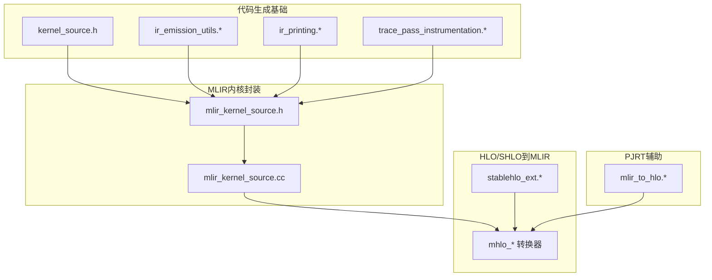
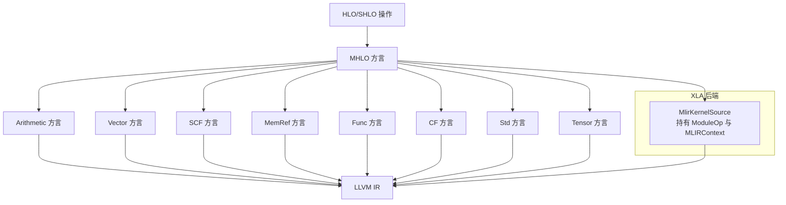
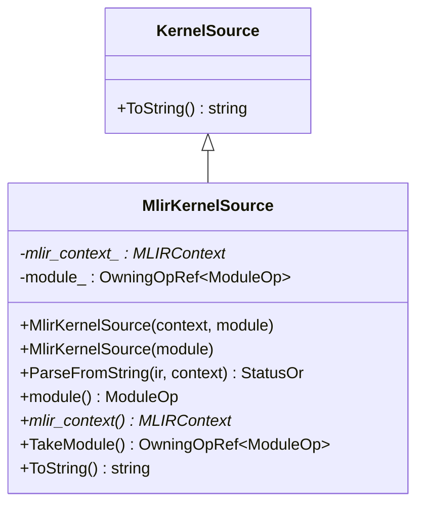
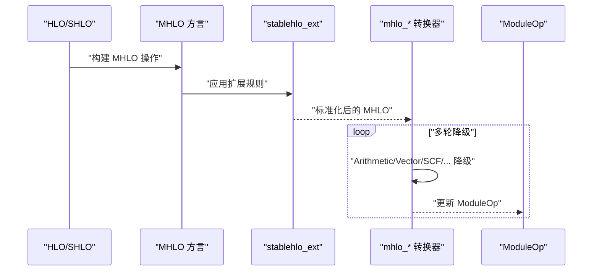
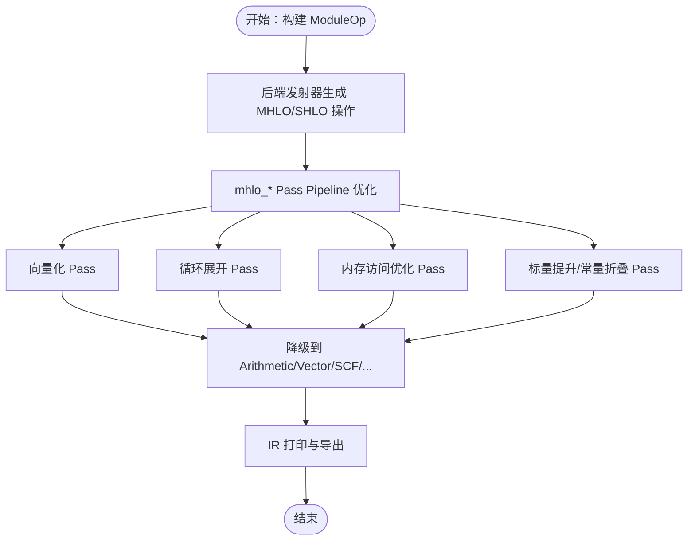
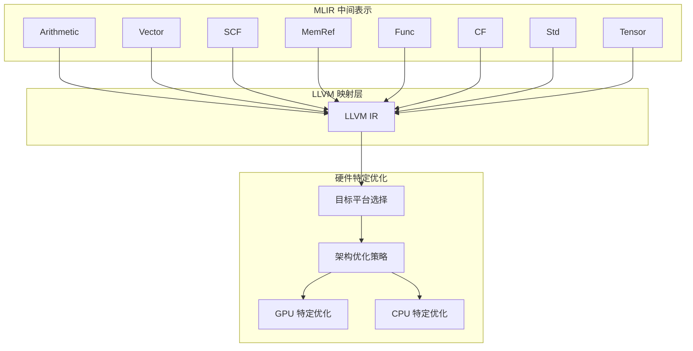
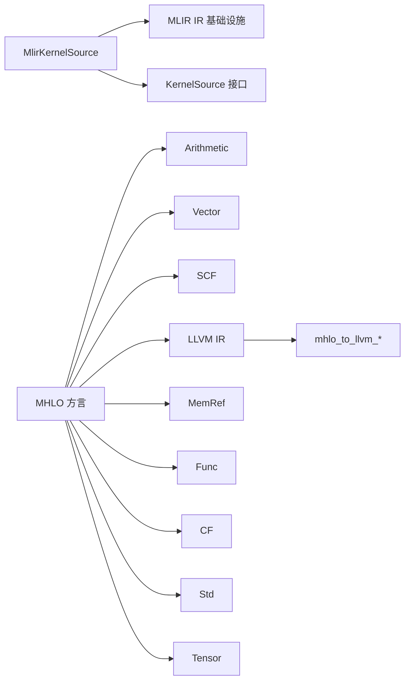

# MLIR代码生成

<cite>
**本文引用的文件**
- [mlir_kernel_source.h](file://xla/codegen/mlir_kernel_source.h)
- [mlir_kernel_source.cc](file://xla/codegen/mlir_kernel_source.cc)
- [kernel_source.h](file://xla/codegen/kernel_source.h)
- [ir_emission_utils.h](file://xla/codegen/ir_emission_utils.h)
- [ir_emission_utils.cc](file://xla/codegen/ir_emission_utils.cc)
- [ir_printing.h](file://xla/codegen/ir_printing.h)
- [ir_printing.cc](file://xla/codegen/ir_printing.cc)
- [mlir_to_hlo.h](file://xla/pjrt/mlir_to_hlo.h)
- [mlir_to_hlo.cc](file://xla/pjrt/mlir_to_hlo.cc)
- [trace_pass_instrumentation.h](file://xla/codegen/trace_pass_instrumentation.h)
- [trace_pass_instrumentation.cc](file://xla/codegen/trace_pass_instrumentation.cc)
- [stablehlo_ext.h](file://xla/mlir_hlo/stablehlo_ext/stablehlo_ext.h)
- [stablehlo_ext.cc](file://xla/mlir_hlo/stablehlo_ext/stablehlo_ext.cc)
- [mhlo_dialect.h](file://xla/mlir_hlo/mhlo_dialect.h)
- [mhlo_dialect.cc](file://xla/mlir_hlo/mhlo_dialect.cc)
- [mhlo_to_linalg.h](file://xla/mlir_hlo/mhlo_to_linalg.h)
- [mhlo_to_linalg.cc](file://xla/mlir_hlo/mhlo_to_linalg.cc)
- [mhlo_to_arithmetic.h](file://xla/mlir_hlo/mhlo_to_arithmetic.h)
- [mhlo_to_arithmetic.cc](file://xla/mlir_hlo/mhlo_to_arithmetic.cc)
- [mhlo_to_vector.h](file://xla/mlir_hlo/mhlo_to_vector.h)
- [mhlo_to_vector.cc](file://xla/mlir_hlo/mhlo_to_vector.cc)
- [mhlo_to_scf.h](file://xla/mlir_hlo/mhlo_to_scf.h)
- [mhlo_to_scf.cc](file://xla/mlir_hlo/mhlo_to_scf.cc)
- [mhlo_to_llvm.h](file://xla/mlir_hlo/mhlo_to_llvm.h)
- [mhlo_to_llvm.cc](file://xla/mlir_hlo/mhlo_to_llvm.cc)
- [mhlo_to_gpu.h](file://xla/mlir_hlo/mhlo_to_gpu.h)
- [mhlo_to_gpu.cc](file://xla/mlir_hlo/mhlo_to_gpu.cc)
- [mhlo_to_cpu.h](file://xla/mlir_hlo/mhlo_to_cpu.h)
- [mhlo_to_cpu.cc](file://xla/mlir_hlo/mhlo_to_cpu.cc)
- [mhlo_to_affine.h](file://xla/mlir_hlo/mhlo_to_affine.h)
- [mhlo_to_affine.cc](file://xla/mlir_hlo/mhlo_to_affine.cc)
- [mhlo_to_memref.h](file://xla/mlir_hlo/mhlo_to_memref.h)
- [mhlo_to_memref.cc](file://xla/mlir_hlo/mhlo_to_memref.cc)
- [mhlo_to_func.h](file://xla/mlir_hlo/mhlo_to_func.h)
- [mhlo_to_func.cc](file://xla/mlir_hlo/mhlo_to_func.cc)
- [mhlo_to_cf.h](file://xla/mlir_hlo/mhlo_to_cf.h)
- [mhlo_to_cf.cc](file://xla/mlir_hlo/mhlo_to_cf.cc)
- [mhlo_to_std.h](file://xla/mlir_hlo/mhlo_to_std.h)
- [mhlo_to_std.cc](file://xla/mlir_hlo/mhlo_to_std.cc)
- [mhlo_to_tensor.h](file://xla/mlir_hlo/mhlo_to_tensor.h)
- [mhlo_to_tensor.cc](file://xla/mlir_hlo/mhlo_to_tensor.cc)
- [mhlo_to_llvm_builtin.h](file://xla/mlir_hlo/mhlo_to_llvm_builtin.h)
- [mhlo_to_llvm_builtin.cc](file://xla/mlir_hlo/mhlo_to_llvm_builtin.cc)
- [mhlo_to_llvm_intrinsic.h](file://xla/mlir_hlo/mhlo_to_llvm_intrinsic.h)
- [mhlo_to_llvm_intrinsic.cc](file://xla/mlir_hlo/mhlo_to_llvm_intrinsic.cc)
- [mhlo_to_llvm_target.h](file://xla/mlir_hlo/mhlo_to_llvm_target.h)
- [mhlo_to_llvm_target.cc](file://xla/mlir_hlo/mhlo_to_llvm_target.cc)
- [mhlo_to_llvm_optimization.h](file://xla/mlir_hlo/mhlo_to_llvm_optimization.h)
- [mhlo_to_llvm_optimization.cc](file://xla/mlir_hlo/mhlo_to_llvm_optimization.cc)
- [mhlo_to_llvm_gpu.h](file://xla/mlir_hlo/mhlo_to_llvm_gpu.h)
- [mhlo_to_llvm_gpu.cc](file://xla/mlir_hlo/mhlo_to_llvm_gpu.cc)
- [mhlo_to_llvm_cpu.h](file://xla/mlir_hlo/mhlo_to_llvm_cpu.h)
- [mhlo_to_llvm_cpu.cc](file://xla/mlir_hlo/mhlo_to_llvm_cpu.cc)
- [mhlo_to_llvm_affine.h](file://xla/mlir_hlo/mhlo_to_llvm_affine.h)
- [mhlo_to_llvm_affine.cc](file://xla/mlir_hlo/mhlo_to_llvm_affine.cc)
- [mhlo_to_llvm_memref.h](file://xla/mlir_hlo/mhlo_to_llvm_memref.h)
- [mhlo_to_llvm_memref.cc](file://xla/mlir_hlo/mhlo_to_llvm_memref.cc)
- [mhlo_to_llvm_func.h](file://xla/mlir_hlo/mhlo_to_llvm_func.h)
- [mhlo_to_llvm_func.cc](file://xla/mlir_hlo/mhlo_to_llvm_func.cc)
- [mhlo_to_llvm_cf.h](file://xla/mlir_hlo/mhlo_to_llvm_cf.h)
- [mhlo_to_llvm_cf.cc](file://xla/mlir_hlo/mhlo_to_llvm_cf.cc)
- [mhlo_to_llvm_std.h](file://xla/mlir_hlo/mhlo_to_llvm_std.h)
- [mhlo_to_llvm_std.cc](file://xla/mlir_hlo/mhlo_to_llvm_std.cc)
- [mhlo_to_llvm_tensor.h](file://xla/mlir_hlo/mhlo_to_llvm_tensor.h)
- [mhlo_to_llvm_tensor.cc](file://xla/mlir_hlo/mhlo_to_llvm_tensor.cc)
- [mhlo_to_llvm_builtin.h](file://xla/mlir_hlo/mhlo_to_llvm_builtin.h)
- [mhlo_to_llvm_builtin.cc](file://xla/mlir_hlo/mhlo_to_llvm_builtin.cc)
- [mhlo_to_llvm_intrinsic.h](file://xla/mlir_hlo/mhlo_to_llvm_intrinsic.h)
- [mhlo_to_llvm_intrinsic.cc](file://xla/mlir_hlo/mhlo_to_llvm_intrinsic.cc)
- [mhlo_to_llvm_target.h](file://xla/mlir_hlo/mhlo_to_llvm_target.h)
- [mhlo_to_llvm_target.cc](file://xla/mlir_hlo/mhlo_to_llvm_target.cc)
- [mhlo_to_llvm_optimization.h](file://xla/mlir_hlo/mhlo_to_llvm_optimization.h)
- [mhlo_to_llvm_optimization.cc](file://xla/mlir_hlo/mhlo_to_llvm_optimization.cc)
- [mhlo_to_llvm_gpu.h](file://xla/mlir_hlo/mhlo_to_llvm_gpu.h)
- [mhlo_to_llvm_gpu.cc](file://xla/mlir_hlo/mhlo_to_llvm_gpu.cc)
- [mhlo_to_llvm_cpu.h](file://xla/mlir_hlo/mhlo_to_llvm_cpu.h)
- [mhlo_to_llvm_cpu.cc](file://xla/mlir_hlo/mhlo_to_llvm_cpu.cc)
- [mhlo_to_llvm_affine.h](file://xla/mlir_hlo/mhlo_to_llvm_affine.h)
- [mhlo_to_llvm_affine.cc](file://xla/mlir_hlo/mhlo_to_llvm_affine.cc)
- [mhlo_to_llvm_memref.h](file://xla/mlir_hlo/mhlo_to_llvm_memref.h)
- [mhlo_to_llvm_memref.cc](file://xla/mlir_hlo/mhlo_to_llvm_memref.cc)
- [mhlo_to_llvm_func.h](file://xla/mlir_hlo/mhlo_to_llvm_func.h)
- [mhlo_to_llvm_func.cc](file://xla/mlir_hlo/mhlo_to_llvm_func.cc)
- [mhlo_to_llvm_cf.h](file://xla/mlir_hlo/mhlo_to_llvm_cf.h)
- [mhlo_to_llvm_cf.cc](file://xla/mlir_hlo/mhlo_to_llvm_cf.cc)
- [mhlo_to_llvm_std.h](file://xla/mlir_hlo/mhlo_to_llvm_std.h)
- [mhlo_to_llvm_std.cc](file://xla/mlir_hlo/mhlo_to_llvm_std.cc)
- [mhlo_to_llvm_tensor.h](file://xla/mlir_hlo/mhlo_to_llvm_tensor.h)
- [mhlo_to_llvm_tensor.cc](file://xla/mlir_hlo/mhlo_to_llvm_tensor.cc)
</cite>

## 目录
1. [简介](#简介)
2. [项目结构](#项目结构)
3. [核心组件](#核心组件)
4. [架构总览](#架构总览)
5. [详细组件分析](#详细组件分析)
6. [依赖关系分析](#依赖关系分析)
7. [性能考虑](#性能考虑)
8. [故障排查指南](#故障排查指南)
9. [结论](#结论)
10. [附录](#附录)

## 简介
本文件系统性梳理XLA中基于MLIR的代码生成与优化流程，覆盖从HLO/SHLO到MLIR模块的转换、MLIR模块的构建与序列化、MLIR Pass Pipeline的优化策略（向量化、循环展开、内存访问优化），以及最终到LLVM IR的转换与针对不同硬件架构的特定优化。重点解析MlirKernelSource类的实现机制，包括MLIR上下文管理、模块所有权与序列化；并总结Arithmetic、Vector、SCF等方言在代码生成中的应用方式与优化路径。

## 项目结构
围绕MLIR代码生成的关键目录与文件如下：
- 代码生成基础与工具：xla/codegen 下的 kernel_source.h、ir_emission_utils.*、ir_printing.*、trace_pass_instrumentation.*
- MLIR内核源封装：xla/codegen/mlir_kernel_source.{h,cc}
- HLO/SHLO到MLIR转换：xla/mlir_hlo 下的 mhlo_* 与 stablehlo_ext 组件
- PJRT到HLO转换辅助：xla/pjrt/mlir_to_hlo.*

**图表来源**
- [kernel_source.h](file://xla/codegen/kernel_source.h)
- [ir_emission_utils.h](file://xla/codegen/ir_emission_utils.h)
- [ir_emission_utils.cc](file://xla/codegen/ir_emission_utils.cc)
- [ir_printing.h](file://xla/codegen/ir_printing.h)
- [ir_printing.cc](file://xla/codegen/ir_printing.cc)
- [trace_pass_instrumentation.h](file://xla/codegen/trace_pass_instrumentation.h)
- [trace_pass_instrumentation.cc](file://xla/codegen/trace_pass_instrumentation.cc)
- [mlir_kernel_source.h](file://xla/codegen/mlir_kernel_source.h)
- [mlir_kernel_source.cc](file://xla/codegen/mlir_kernel_source.cc)
- [stablehlo_ext.h](file://xla/mlir_hlo/stablehlo_ext/stablehlo_ext.h)
- [stablehlo_ext.cc](file://xla/mlir_hlo/stablehlo_ext/stablehlo_ext.cc)
- [mhlo_dialect.h](file://xla/mlir_hlo/mhlo_dialect.h)
- [mhlo_dialect.cc](file://xla/mlir_hlo/mhlo_dialect.cc)
- [mhlo_to_linalg.h](file://xla/mlir_hlo/mhlo_to_linalg.h)
- [mhlo_to_linalg.cc](file://xla/mlir_hlo/mhlo_to_linalg.cc)
- [mhlo_to_arithmetic.h](file://xla/mlir_hlo/mhlo_to_arithmetic.h)
- [mhlo_to_arithmetic.cc](file://xla/mlir_hlo/mhlo_to_arithmetic.cc)
- [mhlo_to_vector.h](file://xla/mlir_hlo/mhlo_to_vector.h)
- [mhlo_to_vector.cc](file://xla/mlir_hlo/mhlo_to_vector.cc)
- [mhlo_to_scf.h](file://xla/mlir_hlo/mhlo_to_scf.h)
- [mhlo_to_scf.cc](file://xla/mlir_hlo/mhlo_to_scf.cc)
- [mhlo_to_llvm.h](file://xla/mlir_hlo/mhlo_to_llvm.h)
- [mhlo_to_llvm.cc](file://xla/mlir_hlo/mhlo_to_llvm.cc)
- [mhlo_to_gpu.h](file://xla/mlir_hlo/mhlo_to_gpu.h)
- [mhlo_to_gpu.cc](file://xla/mlir_hlo/mhlo_to_gpu.cc)
- [mhlo_to_cpu.h](file://xla/mlir_hlo/mhlo_to_cpu.h)
- [mhlo_to_cpu.cc](file://xla/mlir_hlo/mhlo_to_cpu.cc)
- [mhlo_to_affine.h](file://xla/mlir_hlo/mhlo_to_affine.h)
- [mhlo_to_affine.cc](file://xla/mlir_hlo/mhlo_to_affine.cc)
- [mhlo_to_memref.h](file://xla/mlir_hlo/mhlo_to_memref.h)
- [mhlo_to_memref.cc](file://xla/mlir_hlo/mhlo_to_memref.cc)
- [mhlo_to_func.h](file://xla/mlir_hlo/mhlo_to_func.h)
- [mhlo_to_func.cc](file://xla/mlir_hlo/mhlo_to_func.cc)
- [mhlo_to_cf.h](file://xla/mlir_hlo/mhlo_to_cf.h)
- [mhlo_to_cf.cc](file://xla/mlir_hlo/mhlo_to_cf.cc)
- [mhlo_to_std.h](file://xla/mlir_hlo/mhlo_to_std.h)
- [mhlo_to_std.cc](file://xla/mlir_hlo/mhlo_to_std.cc)
- [mhlo_to_tensor.h](file://xla/mlir_hlo/mhlo_to_tensor.h)
- [mhlo_to_tensor.cc](file://xla/mlir_hlo/mhlo_to_tensor.cc)
- [mhlo_to_llvm_builtin.h](file://xla/mlir_hlo/mhlo_to_llvm_builtin.h)
- [mhlo_to_llvm_builtin.cc](file://xla/mlir_hlo/mhlo_to_llvm_builtin.cc)
- [mhlo_to_llvm_intrinsic.h](file://xla/mlir_hlo/mhlo_to_llvm_intrinsic.h)
- [mhlo_to_llvm_intrinsic.cc](file://xla/mlir_hlo/mhlo_to_llvm_intrinsic.cc)
- [mhlo_to_llvm_target.h](file://xla/mlir_hlo/mhlo_to_llvm_target.h)
- [mhlo_to_llvm_target.cc](file://xla/mlir_hlo/mhlo_to_llvm_target.cc)
- [mhlo_to_llvm_optimization.h](file://xla/mlir_hlo/mhlo_to_llvm_optimization.h)
- [mhlo_to_llvm_optimization.cc](file://xla/mlir_hlo/mhlo_to_llvm_optimization.cc)
- [mhlo_to_llvm_gpu.h](file://xla/mlir_hlo/mhlo_to_llvm_gpu.h)
- [mhlo_to_llvm_gpu.cc](file://xla/mlir_hlo/mhlo_to_llvm_gpu.cc)
- [mhlo_to_llvm_cpu.h](file://xla/mlir_hlo/mhlo_to_llvm_cpu.h)
- [mhlo_to_llvm_cpu.cc](file://xla/mlir_hlo/mhlo_to_llvm_cpu.cc)
- [mhlo_to_llvm_affine.h](file://xla/mlir_hlo/mhlo_to_llvm_affine.h)
- [mhlo_to_llvm_affine.cc](file://xla/mlir_hlo/mhlo_to_llvm_affine.cc)
- [mhlo_to_llvm_memref.h](file://xla/mlir_hlo/mhlo_to_llvm_memref.h)
- [mhlo_to_llvm_memref.cc](file://xla/mlir_hlo/mhlo_to_llvm_memref.cc)
- [mhlo_to_llvm_func.h](file://xla/mlir_hlo/mhlo_to_llvm_func.h)
- [mhlo_to_llvm_func.cc](file://xla/mlir_hlo/mhlo_to_llvm_func.cc)
- [mhlo_to_llvm_cf.h](file://xla/mlir_hlo/mhlo_to_llvm_cf.h)
- [mhlo_to_llvm_cf.cc](file://xla/mlir_hlo/mhlo_to_llvm_cf.cc)
- [mhlo_to_llvm_std.h](file://xla/mlir_hlo/mhlo_to_llvm_std.h)
- [mhlo_to_llvm_std.cc](file://xla/mlir_hlo/mhlo_to_llvm_std.cc)
- [mhlo_to_llvm_tensor.h](file://xla/mlir_hlo/mhlo_to_llvm_tensor.h)
- [mhlo_to_llvm_tensor.cc](file://xla/mlir_hlo/mhlo_to_llvm_tensor.cc)
- [mlir_to_hlo.h](file://xla/pjrt/mlir_to_hlo.h)
- [mlir_to_hlo.cc](file://xla/pjrt/mlir_to_hlo.cc)

**章节来源**
- [mlir_kernel_source.h](file://xla/codegen/mlir_kernel_source.h#L1-L81)
- [mlir_kernel_source.cc](file://xla/codegen/mlir_kernel_source.cc#L1-L60)
- [kernel_source.h](file://xla/codegen/kernel_source.h)
- [ir_emission_utils.h](file://xla/codegen/ir_emission_utils.h)
- [ir_emission_utils.cc](file://xla/codegen/ir_emission_utils.cc)
- [ir_printing.h](file://xla/codegen/ir_printing.h)
- [ir_printing.cc](file://xla/codegen/ir_printing.cc)
- [trace_pass_instrumentation.h](file://xla/codegen/trace_pass_instrumentation.h)
- [trace_pass_instrumentation.cc](file://xla/codegen/trace_pass_instrumentation.cc)
- [stablehlo_ext.h](file://xla/mlir_hlo/stablehlo_ext/stablehlo_ext.h)
- [stablehlo_ext.cc](file://xla/mlir_hlo/stablehlo_ext/stablehlo_ext.cc)
- [mhlo_dialect.h](file://xla/mlir_hlo/mhlo_dialect.h)
- [mhlo_dialect.cc](file://xla/mlir_hlo/mhlo_dialect.cc)
- [mhlo_to_linalg.h](file://xla/mlir_hlo/mhlo_to_linalg.h)
- [mhlo_to_linalg.cc](file://xla/mlir_hlo/mhlo_to_linalg.cc)
- [mhlo_to_arithmetic.h](file://xla/mlir_hlo/mhlo_to_arithmetic.h)
- [mhlo_to_arithmetic.cc](file://xla/mlir_hlo/mhlo_to_arithmetic.cc)
- [mhlo_to_vector.h](file://xla/mlir_hlo/mhlo_to_vector.h)
- [mhlo_to_vector.cc](file://xla/mlir_hlo/mhlo_to_vector.cc)
- [mhlo_to_scf.h](file://xla/mlir_hlo/mhlo_to_scf.h)
- [mhlo_to_scf.cc](file://xla/mlir_hlo/mhlo_to_scf.cc)
- [mhlo_to_llvm.h](file://xla/mlir_hlo/mhlo_to_llvm.h)
- [mhlo_to_llvm.cc](file://xla/mlir_hlo/mhlo_to_llvm.cc)
- [mhlo_to_gpu.h](file://xla/mlir_hlo/mhlo_to_gpu.h)
- [mhlo_to_gpu.cc](file://xla/mlir_hlo/mhlo_to_gpu.cc)
- [mhlo_to_cpu.h](file://xla/mlir_hlo/mhlo_to_cpu.h)
- [mhlo_to_cpu.cc](file://xla/mlir_hlo/mhlo_to_cpu.cc)
- [mhlo_to_affine.h](file://xla/mlir_hlo/mhlo_to_affine.h)
- [mhlo_to_affine.cc](file://xla/mlir_hlo/mhlo_to_affine.cc)
- [mhlo_to_memref.h](file://xla/mlir_hlo/mhlo_to_memref.h)
- [mhlo_to_memref.cc](file://xla/mlir_hlo/mhlo_to_memref.cc)
- [mhlo_to_func.h](file://xla/mlir_hlo/mhlo_to_func.h)
- [mhlo_to_func.cc](file://xla/mlir_hlo/mhlo_to_func.cc)
- [mhlo_to_cf.h](file://xla/mlir_hlo/mhlo_to_cf.h)
- [mhlo_to_cf.cc](file://xla/mlir_hlo/mhlo_to_cf.cc)
- [mhlo_to_std.h](file://xla/mlir_hlo/mhlo_to_std.h)
- [mhlo_to_std.cc](file://xla/mlir_hlo/mhlo_to_std.cc)
- [mhlo_to_tensor.h](file://xla/mlir_hlo/mhlo_to_tensor.h)
- [mhlo_to_tensor.cc](file://xla/mlir_hlo/mhlo_to_tensor.cc)
- [mhlo_to_llvm_builtin.h](file://xla/mlir_hlo/mhlo_to_llvm_builtin.h)
- [mhlo_to_llvm_builtin.cc](file://xla/mlir_hlo/mhlo_to_llvm_builtin.cc)
- [mhlo_to_llvm_intrinsic.h](file://xla/mlir_hlo/mhlo_to_llvm_intrinsic.h)
- [mhlo_to_llvm_intrinsic.cc](file://xla/mlir_hlo/mhlo_to_llvm_intrinsic.cc)
- [mhlo_to_llvm_target.h](file://xla/mlir_hlo/mhlo_to_llvm_target.h)
- [mhlo_to_llvm_target.cc](file://xla/mlir_hlo/mhlo_to_llvm_target.cc)
- [mhlo_to_llvm_optimization.h](file://xla/mlir_hlo/mhlo_to_llvm_optimization.h)
- [mhlo_to_llvm_optimization.cc](file://xla/mlir_hlo/mhlo_to_llvm_optimization.cc)
- [mhlo_to_llvm_gpu.h](file://xla/mlir_hlo/mhlo_to_llvm_gpu.h)
- [mhlo_to_llvm_gpu.cc](file://xla/mlir_hlo/mhlo_to_llvm_gpu.cc)
- [mhlo_to_llvm_cpu.h](file://xla/mlir_hlo/mhlo_to_llvm_cpu.h)
- [mhlo_to_llvm_cpu.cc](file://xla/mlir_hlo/mhlo_to_llvm_cpu.cc)
- [mhlo_to_llvm_affine.h](file://xla/mlir_hlo/mhlo_to_llvm_affine.h)
- [mhlo_to_llvm_affine.cc](file://xla/mlir_hlo/mhlo_to_llvm_affine.cc)
- [mhlo_to_llvm_memref.h](file://xla/mlir_hlo/mhlo_to_llvm_memref.h)
- [mhlo_to_llvm_memref.cc](file://xla/mlir_hlo/mhlo_to_llvm_memref.cc)
- [mhlo_to_llvm_func.h](file://xla/mlir_hlo/mhlo_to_llvm_func.h)
- [mhlo_to_llvm_func.cc](file://xla/mlir_hlo/mhlo_to_llvm_func.cc)
- [mhlo_to_llvm_cf.h](file://xla/mlir_hlo/mhlo_to_llvm_cf.h)
- [mhlo_to_llvm_cf.cc](file://xla/mlir_hlo/mhlo_to_llvm_cf.cc)
- [mhlo_to_llvm_std.h](file://xla/mlir_hlo/mhlo_to_llvm_std.h)
- [mhlo_to_llvm_std.cc](file://xla/mlir_hlo/mhlo_to_llvm_std.cc)
- [mhlo_to_llvm_tensor.h](file://xla/mlir_hlo/mhlo_to_llvm_tensor.h)
- [mhlo_to_llvm_tensor.cc](file://xla/mlir_hlo/mhlo_to_llvm_tensor.cc)
- [mlir_to_hlo.h](file://xla/pjrt/mlir_to_hlo.h)
- [mlir_to_hlo.cc](file://xla/pjrt/mlir_to_hlo.cc)

## 核心组件
- MlirKernelSource：封装MLIR内核源，负责持有MLIRContext与OwningOpRef<ModuleOp>，支持从字符串解析、序列化输出与模块所有权转移。
- KernelSource基类：定义统一的内核源接口，MlirKernelSource作为其具体实现之一。
- IR发射与打印：ir_emission_utils.* 提供IR发射工具，ir_printing.* 提供IR打印能力，trace_pass_instrumentation.* 支持Pass执行跟踪。
- HLO/SHLO到MLIR转换：mhlo_* 系列转换器将MHLO/SHLO降级到Arithmetic、Vector、SCF、LLVM等方言，稳定hlo扩展（stablehlo_ext）提供额外语义。
- PJRT辅助：mlir_to_hlo.* 提供从MLIR到HLO的转换能力，便于调试与验证。

**章节来源**
- [mlir_kernel_source.h](file://xla/codegen/mlir_kernel_source.h#L34-L76)
- [mlir_kernel_source.cc](file://xla/codegen/mlir_kernel_source.cc#L37-L57)
- [kernel_source.h](file://xla/codegen/kernel_source.h)
- [ir_emission_utils.h](file://xla/codegen/ir_emission_utils.h)
- [ir_emission_utils.cc](file://xla/codegen/ir_emission_utils.cc)
- [ir_printing.h](file://xla/codegen/ir_printing.h)
- [ir_printing.cc](file://xla/codegen/ir_printing.cc)
- [trace_pass_instrumentation.h](file://xla/codegen/trace_pass_instrumentation.h)
- [trace_pass_instrumentation.cc](file://xla/codegen/trace_pass_instrumentation.cc)
- [stablehlo_ext.h](file://xla/mlir_hlo/stablehlo_ext/stablehlo_ext.h)
- [stablehlo_ext.cc](file://xla/mlir_hlo/stablehlo_ext/stablehlo_ext.cc)
- [mhlo_dialect.h](file://xla/mlir_hlo/mhlo_dialect.h)
- [mhlo_dialect.cc](file://xla/mlir_hlo/mhlo_dialect.cc)
- [mlir_to_hlo.h](file://xla/pjrt/mlir_to_hlo.h)
- [mlir_to_hlo.cc](file://xla/pjrt/mlir_to_hlo.cc)

## 架构总览
下图展示从HLO/SHLO到MLIR再到LLVM的整体流程，以及MlirKernelSource在其中的角色。

**图表来源**
- [mhlo_dialect.h](file://xla/mlir_hlo/mhlo_dialect.h)
- [mhlo_dialect.cc](file://xla/mlir_hlo/mhlo_dialect.cc)
- [mhlo_to_linalg.h](file://xla/mlir_hlo/mhlo_to_linalg.h)
- [mhlo_to_linalg.cc](file://xla/mlir_hlo/mhlo_to_linalg.cc)
- [mhlo_to_arithmetic.h](file://xla/mlir_hlo/mhlo_to_arithmetic.h)
- [mhlo_to_arithmetic.cc](file://xla/mlir_hlo/mhlo_to_arithmetic.cc)
- [mhlo_to_vector.h](file://xla/mlir_hlo/mhlo_to_vector.h)
- [mhlo_to_vector.cc](file://xla/mlir_hlo/mhlo_to_vector.cc)
- [mhlo_to_scf.h](file://xla/mlir_hlo/mhlo_to_scf.h)
- [mhlo_to_scf.cc](file://xla/mlir_hlo/mhlo_to_scf.cc)
- [mhlo_to_memref.h](file://xla/mlir_hlo/mhlo_to_memref.h)
- [mhlo_to_memref.cc](file://xla/mlir_hlo/mhlo_to_memref.cc)
- [mhlo_to_func.h](file://xla/mlir_hlo/mhlo_to_func.h)
- [mhlo_to_func.cc](file://xla/mlir_hlo/mhlo_to_func.cc)
- [mhlo_to_cf.h](file://xla/mlir_hlo/mhlo_to_cf.h)
- [mhlo_to_cf.cc](file://xla/mlir_hlo/mhlo_to_cf.cc)
- [mhlo_to_std.h](file://xla/mlir_hlo/mhlo_to_std.h)
- [mhlo_to_std.cc](file://xla/mlir_hlo/mhlo_to_std.cc)
- [mhlo_to_tensor.h](file://xla/mlir_hlo/mhlo_to_tensor.h)
- [mhlo_to_tensor.cc](file://xla/mlir_hlo/mhlo_to_tensor.cc)
- [mhlo_to_llvm.h](file://xla/mlir_hlo/mhlo_to_llvm.h)
- [mhlo_to_llvm.cc](file://xla/mlir_hlo/mhlo_to_llvm.cc)
- [mlir_kernel_source.h](file://xla/codegen/mlir_kernel_source.h#L34-L76)

## 详细组件分析

### MlirKernelSource 类实现机制
- 上下文管理：构造函数可选择接管MLIRContext的所有权，或仅持有ModuleOp而不接管上下文，以适配不同后端编译器的生命周期管理。
- 模块所有权：通过OwningOpRef<mlir::ModuleOp>持有模块，提供TakeModule移动语义，允许将模块所有权转移给调用方。
- 序列化与解析：ToString返回模块的调试字符串；ParseFromString从字符串解析MLIR IR，使用SourceMgr与诊断处理器捕获错误。
- 与后端集成：作为KernelSource的具体实现，为CPU/GPU等后端编译器提供统一的MLIR内核源抽象。

**图表来源**
- [kernel_source.h](file://xla/codegen/kernel_source.h)
- [mlir_kernel_source.h](file://xla/codegen/mlir_kernel_source.h#L34-L76)

**章节来源**
- [mlir_kernel_source.h](file://xla/codegen/mlir_kernel_source.h#L34-L76)
- [mlir_kernel_source.cc](file://xla/codegen/mlir_kernel_source.cc#L37-L57)

### 从HLO到MLIR的转换流程
- MHLO方言：作为XLA的中间表示，承载HLO/SHLO操作的MLIR方言化表示。
- 稳定扩展：stablehlo_ext提供扩展能力，确保与标准SHLO的兼容与增强。
- 多阶段降级：mhlo_to_* 系列转换器将MHLO逐步降级到Arithmetic、Vector、SCF、MemRef、Func、CF、Std、Tensor等方言，最终进入LLVM IR。

**图表来源**
- [mhlo_dialect.h](file://xla/mlir_hlo/mhlo_dialect.h)
- [mhlo_dialect.cc](file://xla/mlir_hlo/mhlo_dialect.cc)
- [stablehlo_ext.h](file://xla/mlir_hlo/stablehlo_ext/stablehlo_ext.h)
- [stablehlo_ext.cc](file://xla/mlir_hlo/stablehlo_ext/stablehlo_ext.cc)
- [mhlo_to_linalg.h](file://xla/mlir_hlo/mhlo_to_linalg.h)
- [mhlo_to_linalg.cc](file://xla/mlir_hlo/mhlo_to_linalg.cc)
- [mhlo_to_arithmetic.h](file://xla/mlir_hlo/mhlo_to_arithmetic.h)
- [mhlo_to_arithmetic.cc](file://xla/mlir_hlo/mhlo_to_arithmetic.cc)
- [mhlo_to_vector.h](file://xla/mlir_hlo/mhlo_to_vector.h)
- [mhlo_to_vector.cc](file://xla/mlir_hlo/mhlo_to_vector.cc)
- [mhlo_to_scf.h](file://xla/mlir_hlo/mhlo_to_scf.h)
- [mhlo_to_scf.cc](file://xla/mlir_hlo/mhlo_to_scf.cc)
- [mhlo_to_memref.h](file://xla/mlir_hlo/mhlo_to_memref.h)
- [mhlo_to_memref.cc](file://xla/mlir_hlo/mhlo_to_memref.cc)
- [mhlo_to_func.h](file://xla/mlir_hlo/mhlo_to_func.h)
- [mhlo_to_func.cc](file://xla/mlir_hlo/mhlo_to_func.cc)
- [mhlo_to_cf.h](file://xla/mlir_hlo/mhlo_to_cf.h)
- [mhlo_to_cf.cc](file://xla/mlir_hlo/mhlo_to_cf.cc)
- [mhlo_to_std.h](file://xla/mlir_hlo/mhlo_to_std.h)
- [mhlo_to_std.cc](file://xla/mlir_hlo/mhlo_to_std.cc)
- [mhlo_to_tensor.h](file://xla/mlir_hlo/mhlo_to_tensor.h)
- [mhlo_to_tensor.cc](file://xla/mlir_hlo/mhlo_to_tensor.cc)

**章节来源**
- [mhlo_dialect.h](file://xla/mlir_hlo/mhlo_dialect.h)
- [mhlo_dialect.cc](file://xla/mlir_hlo/mhlo_dialect.cc)
- [stablehlo_ext.h](file://xla/mlir_hlo/stablehlo_ext/stablehlo_ext.h)
- [stablehlo_ext.cc](file://xla/mlir_hlo/stablehlo_ext/stablehlo_ext.cc)

### MLIR模块构建与优化（Pass Pipeline）
- 模块构建：由后端融合发射器（如CPU/GPU后端的ScatterFusion等）创建，包含必要的方言与操作。
- 优化Pass：通过mhlo_*系列转换器组织的Pass Pipeline执行优化，典型包括向量化、循环展开、内存访问模式优化、标量提升等。
- 跟踪与调试：trace_pass_instrumentation.* 提供Pass执行跟踪，便于定位性能瓶颈与优化效果验证。
- 打印与导出：ir_printing.* 提供IR打印能力，便于开发与调试。

**图表来源**
- [mhlo_to_vector.h](file://xla/mlir_hlo/mhlo_to_vector.h)
- [mhlo_to_vector.cc](file://xla/mlir_hlo/mhlo_to_vector.cc)
- [mhlo_to_scf.h](file://xla/mlir_hlo/mhlo_to_scf.h)
- [mhlo_to_scf.cc](file://xla/mlir_hlo/mhlo_to_scf.cc)
- [mhlo_to_memref.h](file://xla/mlir_hlo/mhlo_to_memref.h)
- [mhlo_to_memref.cc](file://xla/mlir_hlo/mhlo_to_memref.cc)
- [mhlo_to_arithmetic.h](file://xla/mlir_hlo/mhlo_to_arithmetic.h)
- [mhlo_to_arithmetic.cc](file://xla/mlir_hlo/mhlo_to_arithmetic.cc)
- [trace_pass_instrumentation.h](file://xla/codegen/trace_pass_instrumentation.h)
- [trace_pass_instrumentation.cc](file://xla/codegen/trace_pass_instrumentation.cc)
- [ir_printing.h](file://xla/codegen/ir_printing.h)
- [ir_printing.cc](file://xla/codegen/ir_printing.cc)

**章节来源**
- [mhlo_to_vector.h](file://xla/mlir_hlo/mhlo_to_vector.h)
- [mhlo_to_vector.cc](file://xla/mlir_hlo/mhlo_to_vector.cc)
- [mhlo_to_scf.h](file://xla/mlir_hlo/mhlo_to_scf.h)
- [mhlo_to_scf.cc](file://xla/mlir_hlo/mhlo_to_scf.cc)
- [mhlo_to_memref.h](file://xla/mlir_hlo/mhlo_to_memref.h)
- [mhlo_to_memref.cc](file://xla/mlir_hlo/mhlo_to_memref.cc)
- [mhlo_to_arithmetic.h](file://xla/mlir_hlo/mhlo_to_arithmetic.h)
- [mhlo_to_arithmetic.cc](file://xla/mlir_hlo/mhlo_to_arithmetic.cc)
- [trace_pass_instrumentation.h](file://xla/codegen/trace_pass_instrumentation.h)
- [trace_pass_instrumentation.cc](file://xla/codegen/trace_pass_instrumentation.cc)
- [ir_printing.h](file://xla/codegen/ir_printing.h)
- [ir_printing.cc](file://xla/codegen/ir_printing.cc)

### MLIR到LLVM转换与硬件特定优化
- 通用转换：mhlo_to_llvm.* 将MLIR模块转换为LLVM IR，贯穿Arithmetic、Vector、SCF、MemRef、Func、CF、Std、Tensor等方言。
- 架构特定优化：mhlo_to_llvm_target.*、mhlo_to_llvm_optimization.*、mhlo_to_llvm_gpu.*、mhlo_to_llvm_cpu.* 等提供针对目标平台的指令选择、寄存器分配启发式、SIMD向量化策略、GPU线程网格映射等优化。
- 内存与函数：mhlo_to_llvm_memref.*、mhlo_to_llvm_func.*、mhlo_to_llvm_cf.*、mhlo_to_llvm_std.*、mhlo_to_llvm_tensor.* 等分别处理内存布局、函数调用约定、控制流、标准库与张量操作到LLVM的映射。

**图表来源**
- [mhlo_to_llvm.h](file://xla/mlir_hlo/mhlo_to_llvm.h)
- [mhlo_to_llvm.cc](file://xla/mlir_hlo/mhlo_to_llvm.cc)
- [mhlo_to_llvm_target.h](file://xla/mlir_hlo/mhlo_to_llvm_target.h)
- [mhlo_to_llvm_target.cc](file://xla/mlir_hlo/mhlo_to_llvm_target.cc)
- [mhlo_to_llvm_optimization.h](file://xla/mlir_hlo/mhlo_to_llvm_optimization.h)
- [mhlo_to_llvm_optimization.cc](file://xla/mlir_hlo/mhlo_to_llvm_optimization.cc)
- [mhlo_to_llvm_gpu.h](file://xla/mlir_hlo/mhlo_to_llvm_gpu.h)
- [mhlo_to_llvm_gpu.cc](file://xla/mlir_hlo/mhlo_to_llvm_gpu.cc)
- [mhlo_to_llvm_cpu.h](file://xla/mlir_hlo/mhlo_to_llvm_cpu.h)
- [mhlo_to_llvm_cpu.cc](file://xla/mlir_hlo/mhlo_to_llvm_cpu.cc)
- [mhlo_to_llvm_memref.h](file://xla/mlir_hlo/mhlo_to_llvm_memref.h)
- [mhlo_to_llvm_memref.cc](file://xla/mlir_hlo/mhlo_to_llvm_memref.cc)
- [mhlo_to_llvm_func.h](file://xla/mlir_hlo/mhlo_to_llvm_func.h)
- [mhlo_to_llvm_func.cc](file://xla/mlir_hlo/mhlo_to_llvm_func.cc)
- [mhlo_to_llvm_cf.h](file://xla/mlir_hlo/mhlo_to_llvm_cf.h)
- [mhlo_to_llvm_cf.cc](file://xla/mlir_hlo/mhlo_to_llvm_cf.cc)
- [mhlo_to_llvm_std.h](file://xla/mlir_hlo/mhlo_to_llvm_std.h)
- [mhlo_to_llvm_std.cc](file://xla/mlir_hlo/mhlo_to_llvm_std.cc)
- [mhlo_to_llvm_tensor.h](file://xla/mlir_hlo/mhlo_to_llvm_tensor.h)
- [mhlo_to_llvm_tensor.cc](file://xla/mlir_hlo/mhlo_to_llvm_tensor.cc)

**章节来源**
- [mhlo_to_llvm.h](file://xla/mlir_hlo/mhlo_to_llvm.h)
- [mhlo_to_llvm.cc](file://xla/mlir_hlo/mhlo_to_llvm.cc)
- [mhlo_to_llvm_target.h](file://xla/mlir_hlo/mhlo_to_llvm_target.h)
- [mhlo_to_llvm_target.cc](file://xla/mlir_hlo/mhlo_to_llvm_target.cc)
- [mhlo_to_llvm_optimization.h](file://xla/mlir_hlo/mhlo_to_llvm_optimization.h)
- [mhlo_to_llvm_optimization.cc](file://xla/mlir_hlo/mhlo_to_llvm_optimization.cc)
- [mhlo_to_llvm_gpu.h](file://xla/mlir_hlo/mhlo_to_llvm_gpu.h)
- [mhlo_to_llvm_gpu.cc](file://xla/mlir_hlo/mhlo_to_llvm_gpu.cc)
- [mhlo_to_llvm_cpu.h](file://xla/mlir_hlo/mhlo_to_llvm_cpu.h)
- [mhlo_to_llvm_cpu.cc](file://xla/mlir_hlo/mhlo_to_llvm_cpu.cc)
- [mhlo_to_llvm_memref.h](file://xla/mlir_hlo/mhlo_to_llvm_memref.h)
- [mhlo_to_llvm_memref.cc](file://xla/mlir_hlo/mhlo_to_llvm_memref.cc)
- [mhlo_to_llvm_func.h](file://xla/mlir_hlo/mhlo_to_llvm_func.h)
- [mhlo_to_llvm_func.cc](file://xla/mlir_hlo/mhlo_to_llvm_func.cc)
- [mhlo_to_llvm_cf.h](file://xla/mlir_hlo/mhlo_to_llvm_cf.h)
- [mhlo_to_llvm_cf.cc](file://xla/mlir_hlo/mhlo_to_llvm_cf.cc)
- [mhlo_to_llvm_std.h](file://xla/mlir_hlo/mhlo_to_llvm_std.h)
- [mhlo_to_llvm_std.cc](file://xla/mlir_hlo/mhlo_to_llvm_std.cc)
- [mhlo_to_llvm_tensor.h](file://xla/mlir_hlo/mhlo_to_llvm_tensor.h)
- [mhlo_to_llvm_tensor.cc](file://xla/mlir_hlo/mhlo_to_llvm_tensor.cc)

### 从MLIR到HLO的转换（调试与验证）
- mlir_to_hlo.* 提供从MLIR到HLO的转换能力，便于在调试阶段验证转换正确性与回溯问题。

**章节来源**
- [mlir_to_hlo.h](file://xla/pjrt/mlir_to_hlo.h)
- [mlir_to_hlo.cc](file://xla/pjrt/mlir_to_hlo.cc)

## 依赖关系分析
- 组件耦合：MlirKernelSource依赖MLIR IR基础设施（MLIRContext、ModuleOp、OwningOpRef），并与KernelSource形成继承关系。
- 转换链路：MHLO方言经由mhlo_*系列转换器逐步降级至Arithmetic/Vector/SCF/LLVM等方言，形成清晰的依赖链。
- 硬件特定：mhlo_to_llvm_*系列模块按目标平台拆分，避免全局耦合，便于独立优化与维护。

**图表来源**
- [mlir_kernel_source.h](file://xla/codegen/mlir_kernel_source.h#L34-L76)
- [kernel_source.h](file://xla/codegen/kernel_source.h)
- [mhlo_dialect.h](file://xla/mlir_hlo/mhlo_dialect.h)
- [mhlo_to_arithmetic.h](file://xla/mlir_hlo/mhlo_to_arithmetic.h)
- [mhlo_to_vector.h](file://xla/mlir_hlo/mhlo_to_vector.h)
- [mhlo_to_scf.h](file://xla/mlir_hlo/mhlo_to_scf.h)
- [mhlo_to_llvm.h](file://xla/mlir_hlo/mhlo_to_llvm.h)
- [mhlo_to_memref.h](file://xla/mlir_hlo/mhlo_to_memref.h)
- [mhlo_to_func.h](file://xla/mlir_hlo/mhlo_to_func.h)
- [mhlo_to_cf.h](file://xla/mlir_hlo/mhlo_to_cf.h)
- [mhlo_to_std.h](file://xla/mlir_hlo/mhlo_to_std.h)
- [mhlo_to_tensor.h](file://xla/mlir_hlo/mhlo_to_tensor.h)

**章节来源**
- [mlir_kernel_source.h](file://xla/codegen/mlir_kernel_source.h#L34-L76)
- [kernel_source.h](file://xla/codegen/kernel_source.h)
- [mhlo_dialect.h](file://xla/mlir_hlo/mhlo_dialect.h)
- [mhlo_to_arithmetic.h](file://xla/mlir_hlo/mhlo_to_arithmetic.h)
- [mhlo_to_vector.h](file://xla/mlir_hlo/mhlo_to_vector.h)
- [mhlo_to_scf.h](file://xla/mlir_hlo/mhlo_to_scf.h)
- [mhlo_to_llvm.h](file://xla/mlir_hlo/mhlo_to_llvm.h)
- [mhlo_to_memref.h](file://xla/mlir_hlo/mhlo_to_memref.h)
- [mhlo_to_func.h](file://xla/mlir_hlo/mhlo_to_func.h)
- [mhlo_to_cf.h](file://xla/mlir_hlo/mhlo_to_cf.h)
- [mhlo_to_std.h](file://xla/mlir_hlo/mhlo_to_std.h)
- [mhlo_to_tensor.h](file://xla/mlir_hlo/mhlo_to_tensor.h)

## 性能考虑
- 向量化优先：通过mhlo_to_vector.*在合适的维度上引入Vector方言，结合硬件SIMD宽度进行向量化，显著提升吞吐。
- 循环优化：利用mhlo_to_scf.*进行循环展开、分块与并行化，减少分支与循环开销。
- 内存访问：mhlo_to_memref.*与mhlo_to_llvm_memref.*协同，优化缓存局部性与访存模式，降低带宽压力。
- 标量提升：mhlo_to_arithmetic.*与mhlo_to_llvm_optimization.*进行常量折叠与标量提升，减少运行时计算。
- 目标平台：mhlo_to_llvm_target.*、mhlo_to_llvm_gpu.*、mhlo_to_llvm_cpu.*根据目标ISA与指令集特性选择最优实现。

[本节为通用性能指导，不直接分析具体文件]

## 故障排查指南
- 解析失败：ParseFromString使用SourceMgr与诊断处理器捕获错误，检查输入IR格式与上下文配置。
- Pass执行问题：启用trace_pass_instrumentation.*以观察Pass执行顺序与耗时，定位异常Pass。
- IR验证：使用ir_printing.*打印中间IR，结合mlir_to_hlo.*进行回溯，确认转换一致性。
- 调试建议：在mhlo_*转换器前后插入打印与校验，逐步缩小问题范围。

**章节来源**
- [mlir_kernel_source.cc](file://xla/codegen/mlir_kernel_source.cc#L37-L57)
- [trace_pass_instrumentation.h](file://xla/codegen/trace_pass_instrumentation.h)
- [trace_pass_instrumentation.cc](file://xla/codegen/trace_pass_instrumentation.cc)
- [ir_printing.h](file://xla/codegen/ir_printing.h)
- [ir_printing.cc](file://xla/codegen/ir_printing.cc)
- [mlir_to_hlo.h](file://xla/pjrt/mlir_to_hlo.h)
- [mlir_to_hlo.cc](file://xla/pjrt/mlir_to_hlo.cc)

## 结论
XLA的MLIR代码生成体系以MlirKernelSource为核心，通过MHLO方言与mhlo_*系列转换器完成从HLO/SHLO到LLVM IR的完整链路，并在Vector、SCF、Arithmetic等方言层面实施针对性优化。配合硬件特定的mhlo_to_llvm_*模块，可在不同平台上实现高效、可移植且可调试的内核生成。借助IR打印与转换回溯能力，开发者能够快速定位问题并持续改进优化策略。

[本节为总结性内容，不直接分析具体文件]

## 附录
- 关键文件索引
  - MlirKernelSource：xla/codegen/mlir_kernel_source.{h,cc}
  - IR工具：xla/codegen/ir_emission_utils.{h,cc}、xla/codegen/ir_printing.{h,cc}
  - Pass跟踪：xla/codegen/trace_pass_instrumentation.{h,cc}
  - HLO/SHLO转换：xla/mlir_hlo/mhlo_*、xla/mlir_hlo/stablehlo_ext/*
  - MLIR到HLO：xla/pjrt/mlir_to_hlo.*

[本节为补充信息，不直接分析具体文件]