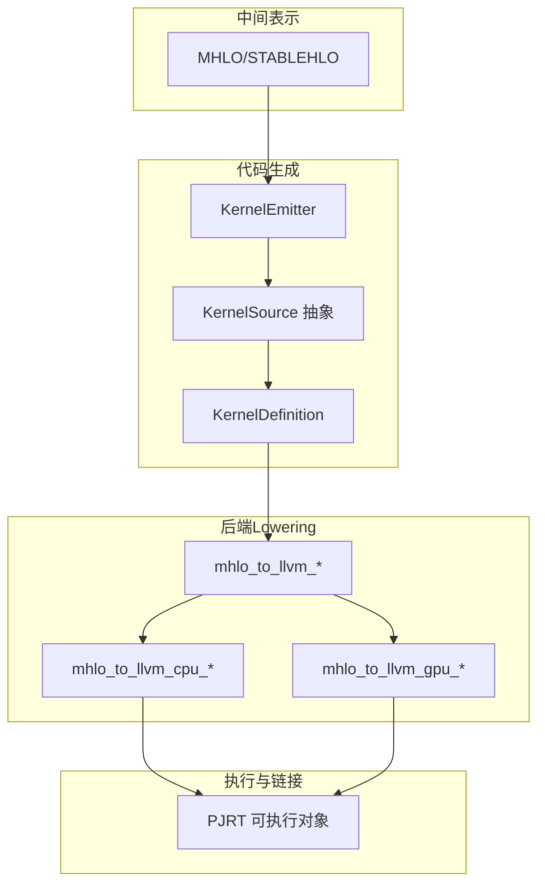
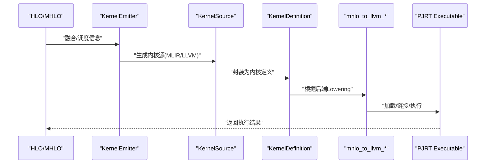
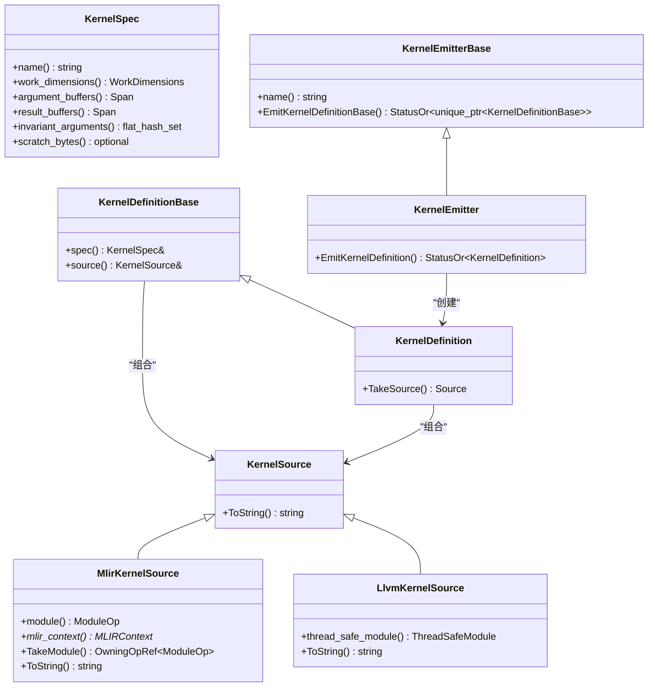
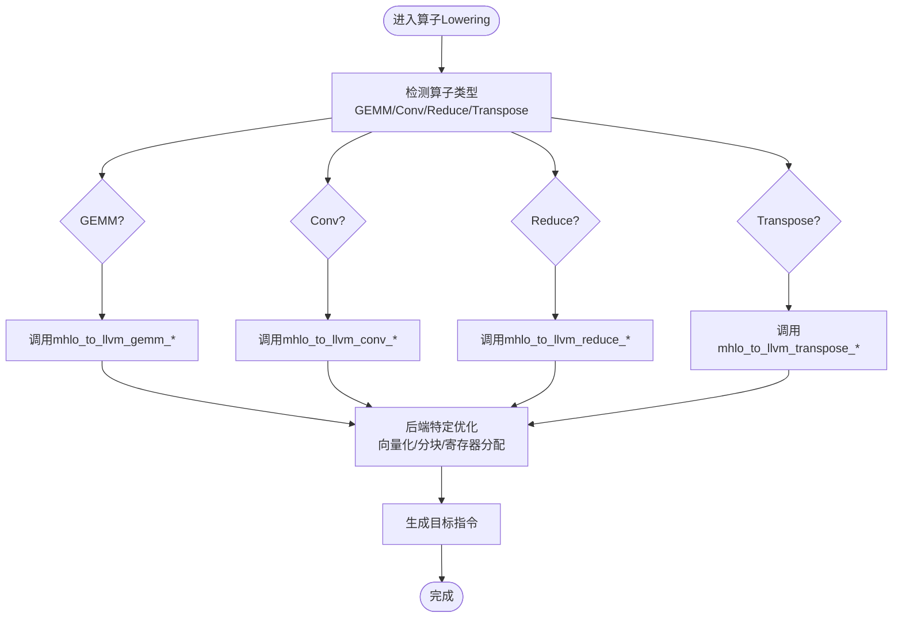
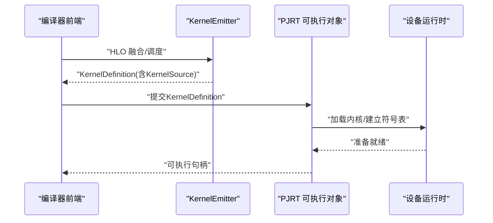
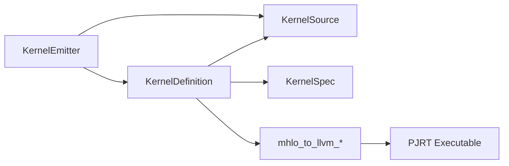

# 代码生成阶段

<cite>
**本文引用的文件**
- [xla/codegen/kernel_emitter.h](file://xla/codegen/kernel_emitter.h)
- [xla/codegen/kernel_source.h](file://xla/codegen/kernel_source.h)
- [xla/codegen/mlir_kernel_source.h](file://xla/codegen/mlir_kernel_source.h)
- [xla/codegen/llvm_kernel_source.h](file://xla/codegen/llvm_kernel_source.h)
- [xla/codegen/kernel_definition.h](file://xla/codegen/kernel_definition.h)
- [xla/codegen/kernel_spec.h](file://xla/codegen/kernel_spec.h)
- [xla/pjrt/stream_executor_executable.h](file://xla/pjrt/stream_executor_executable.h)
- [xla/pjrt/stream_executor_executable.cc](file://xla/pjrt/stream_executor_executable.cc)
- [xla/backends/cpu/tpu_constants.h](file://xla/backends/cpu/tpu_constants.h)
- [xla/backends/gpu/triton.h](file://xla/backends/gpu/triton.h)
- [xla/backends/gpu/triton_cuda.cc](file://xla/backends/gpu/triton_cuda.cc)
- [xla/backends/gpu/triton_rocm.cc](file://xla/backends/gpu/triton_rocm.cc)
- [xla/backends/gpu/triton_stub.cc](file://xla/backends/gpu/triton_stub.cc)
- [xla/mlir_hlo/mhlo/transforms/convolution_transforms.h](file://xla/mlir_hlo/mhlo/transforms/convolution_transforms.h)
- [xla/mlir_hlo/mhlo/transforms/convolution_transforms.cc](file://xla/mlir_hlo/mhlo/transforms/convolution_transforms.cc)
- [xla/mlir_hlo/mhlo/transforms/gemm_transforms.h](file://xla/mlir_hlo/mhlo/transforms/gemm_transforms.h)
- [xla/mlir_hlo/mhlo/transforms/gemm_transforms.cc](file://xla/mlir_hlo/mhlo/transforms/gemm_transforms.cc)
- [xla/mlir_hlo/mhlo/transforms/reduction_transforms.h](file://xla/mlir_hlo/mhlo/transforms/reduction_transforms.h)
- [xla/mlir_hlo/mhlo/transforms/reduction_transforms.cc](file://xla/mlir_hlo/mhlo/transforms/reduction_transforms.cc)
- [xla/mlir_hlo/mhlo/transforms/transpose_transforms.h](file://xla/mlir_hlo/mhlo/transforms/transpose_transforms.h)
- [xla/mlir_hlo/mhlo/transforms/transpose_transforms.cc](file://xla/mlir_hlo/mhlo/transforms/transpose_transforms.cc)
- [xla/mlir_hlo/mhlo/transforms/stablehlo_to_mhlo.h](file://xla/mlir_hlo/mhlo/transforms/stablehlo_to_mhlo.h)
- [xla/mlir_hlo/mhlo/transforms/stablehlo_to_mhlo.cc](file://xla/mlir_hlo/mhlo/transforms/stablehlo_to_mhlo.cc)
- [xla/mlir_hlo/mhlo/transforms/mhlo_to_llvm.h](file://xla/mlir_hlo/mhlo/transforms/mhlo_to_llvm.h)
- [xla/mlir_hlo/mhlo/transforms/mhlo_to_llvm.cc](file://xla/mlir_hlo/mhlo/transforms/mhlo_to_llvm.cc)
- [xla/mlir_hlo/mhlo/transforms/mhlo_to_llvm_gemm.h](file://xla/mlir_hlo/mhlo/transforms/mhlo_to_llvm_gemm.h)
- [xla/mlir_hlo/mhlo/transforms/mhlo_to_llvm_gemm.cc](file://xla/mlir_hlo/mhlo/transforms/mhlo_to_llvm_gemm.cc)
- [xla/mlir_hlo/mhlo/transforms/mhlo_to_llvm_conv.h](file://xla/mlir_hlo/mhlo/transforms/mhlo_to_llvm_conv.h)
- [xla/mlir_hlo/mhlo/transforms/mhlo_to_llvm_conv.cc](file://xla/mlir_hlo/mhlo/transforms/mhlo_to_llvm_conv.cc)
- [xla/mlir_hlo/mhlo/transforms/mhlo_to_llvm_reduce.h](file://xla/mlir_hlo/mhlo/transforms/mhlo_to_llvm_reduce.h)
- [xla/mlir_hlo/mhlo/transforms/mhlo_to_llvm_reduce.cc](file://xla/mlir_hlo/mhlo/transforms/mhlo_to_llvm_reduce.cc)
- [xla/mlir_hlo/mhlo/transforms/mhlo_to_llvm_transpose.h](file://xla/mlir_hlo/mhlo/transforms/mhlo_to_llvm_transpose.h)
- [xla/mlir_hlo/mhlo/transforms/mhlo_to_llvm_transpose.cc](file://xla/mlir_hlo/mhlo/transforms/mhlo_to_llvm_transpose.cc)
- [xla/mlir_hlo/mhlo/transforms/mhlo_to_llvm_gpu.h](file://xla/mlir_hlo/mhlo/transforms/mhlo_to_llvm_gpu.h)
- [xla/mlir_hlo/mhlo/transforms/mhlo_to_llvm_gpu.cc](file://xla/mlir_hlo/mhlo/transforms/mhlo_to_llvm_gpu.cc)
- [xla/mlir_hlo/mhlo/transforms/mhlo_to_llvm_cpu.h](file://xla/mlir_hlo/mhlo/transforms/mhlo_to_llvm_cpu.h)
- [xla/mlir_hlo/mhlo/transforms/mhlo_to_llvm_cpu.cc](file://xla/mlir_hlo/mhlo/transforms/mhlo_to_llvm_cpu.cc)
- [xla/mlir_hlo/mhlo/transforms/mhlo_to_llvm_gpu_conv.h](file://xla/mlir_hlo/mhlo/transforms/mhlo_to_llvm_gpu_conv.h)
- [xla/mlir_hlo/mhlo/transforms/mhlo_to_llvm_gpu_conv.cc](file://xla/mlir_hlo/mhlo/transforms/mhlo_to_llvm_gpu_conv.cc)
- [xla/mlir_hlo/mhlo/transforms/mhlo_to_llvm_gpu_gemm.h](file://xla/mlir_hlo/mhlo/transforms/mhlo_to_llvm_gpu_gemm.h)
- [xla/mlir_hlo/mhlo/transforms/mhlo_to_llvm_gpu_gemm.cc](file://xla/mlir_hlo/mhlo/transforms/mhlo_to_llvm_gpu_gemm.cc)
- [xla/mlir_hlo/mhlo/transforms/mhlo_to_llvm_gpu_reduce.h](file://xla/mlir_hlo/mhlo/transforms/mhlo_to_llvm_gpu_reduce.h)
- [xla/mlir_hlo/mhlo/transforms/mhlo_to_llvm_gpu_reduce.cc](file://xla/mlir_hlo/mhlo/transforms/mhlo_to_llvm_gpu_reduce.cc)
- [xla/mlir_hlo/mhlo/transforms/mhlo_to_llvm_gpu_transpose.h](file://xla/mlir_hlo/mhlo/transforms/mhlo_to_llvm_gpu_transpose.h)
- [xla/mlir_hlo/mhlo/transforms/mhlo_to_llvm_gpu_transpose.cc](file://xla/mlir_hlo/mhlo/transforms/mhlo_to_llvm_gpu_transpose.cc)
- [xla/mlir_hlo/mhlo/transforms/mhlo_to_llvm_cpu_conv.h](file://xla/mlir_hlo/mhlo/transforms/mhlo_to_llvm_cpu_conv.h)
- [xla/mlir_hlo/mhlo/transforms/mhlo_to_llvm_cpu_conv.cc](file://xla/mlir_hlo/mhlo/transforms/mhlo_to_llvm_cpu_conv.cc)
- [xla/mlir_hlo/mhlo/transforms/mhlo_to_llvm_cpu_gemm.h](file://xla/mlir_hlo/mhlo/transforms/mhlo_to_llvm_cpu_gemm.h)
- [xla/mlir_hlo/mhlo/transforms/mhlo_to_llvm_cpu_gemm.cc](file://xla/mlir_hlo/mhlo/transforms/mhlo_to_llvm_cpu_gemm.cc)
- [xla/mlir_hlo/mhlo/transforms/mhlo_to_llvm_cpu_reduce.h](file://xla/mlir_hlo/mhlo/transforms/mhlo_to_llvm_cpu_reduce.h)
- [xla/mlir_hlo/mhlo/transforms/mhlo_to_llvm_cpu_reduce.cc](file://xla/mlir_hlo/mhlo/transforms/mhlo_to_llvm_cpu_reduce.cc)
- [xla/mlir_hlo/mhlo/transforms/mhlo_to_llvm_cpu_transpose.h](file://xla/mlir_hlo/mhlo/transforms/mhlo_to_llvm_cpu_transpose.h)
- [xla/mlir_hlo/mhlo/transforms/mhlo_to_llvm_cpu_transpose.cc](file://xla/mlir_hlo/mhlo/transforms/mhlo_to_llvm_cpu_transpose.cc)
- [xla/mlir_hlo/mhlo/transforms/mhlo_to_llvm_gpu_sgemm.h](file://xla/mlir_hlo/mhlo/transforms/mhlo_to_llvm_gpu_sgemm.h)
- [xla/mlir_hlo/mhlo/transforms/mhlo_to_llvm_gpu_sgemm.cc](file://xla/mlir_hlo/mhlo/transforms/mhlo_to_llvm_gpu_sgemm.cc)
- [xla/mlir_hlo/mhlo/transforms/mhlo_to_llvm_gpu_dgemm.h](file://xla/mlir_hlo/mhlo/transforms/mhlo_to_llvm_gpu_dgemm.h)
- [xla/mlir_hlo/mhlo/transforms/mhlo_to_llvm_gpu_dgemm.cc](file://xla/mlir_hlo/mhlo/transforms/mhlo_to_llvm_gpu_dgemm.cc)
- [xla/mlir_hlo/mhlo/transforms/mhlo_to_llvm_gpu_sconv.h](file://xla/mlir_hlo/mhlo/transforms/mhlo_to_llvm_gpu_sconv.h)
- [xla/mlir_hlo/mhlo/transforms/mhlo_to_llvm_gpu_sconv.cc](file://xla/mlir_hlo/mhlo/transforms/mhlo_to_llvm_gpu_sconv.cc)
- [xla/mlir_hlo/mhlo/transforms/mhlo_to_llvm_gpu_dconv.h](file://xla/mlir_hlo/mhlo/transforms/mhlo_to_llvm_gpu_dconv.h)
- [xla/mlir_hlo/mhlo/transforms/mhlo_to_llvm_gpu_dconv.cc](file://xla/mlir_hlo/mhlo/transforms/mhlo_to_llvm_gpu_dconv.cc)
- [xla/mlir_hlo/mhlo/transforms/mhlo_to_llvm_cpu_sgemm.h](file://xla/mlir_hlo/mhlo/transforms/mhlo_to_llvm_cpu_sgemm.h)
- [xla/mlir_hlo/mhlo/transforms/mhlo_to_llvm_cpu_sgemm.cc](file://xla/mlir_hlo/mhlo/transforms/mhlo_to_llvm_cpu_sgemm.cc)
- [xla/mlir_hlo/mhlo/transforms/mhlo_to_llvm_cpu_dgemm.h](file://xla/mlir_hlo/mhlo/transforms/mhlo_to_llvm_cpu_dgemm.h)
- [xla/mlir_hlo/mhlo/transforms/mhlo_to_llvm_cpu_dgemm.cc](file://xla/mlir_hlo/mhlo/transforms/mhlo_to_llvm_cpu_dgemm.cc)
- [xla/mlir_hlo/mhlo/transforms/mhlo_to_llvm_cpu_sconv.h](file://xla/mlir_hlo/mhlo/transforms/mhlo_to_llvm_cpu_sconv.h)
- [xla/mlir_hlo/mhlo/transforms/mhlo_to_llvm_cpu_sconv.cc](file://xla/mlir_hlo/mhlo/transforms/mhlo_to_llvm_cpu_sconv.cc)
- [xla/mlir_hlo/mhlo/transforms/mhlo_to_llvm_cpu_dconv.h](file://xla/mlir_hlo/mhlo/transforms/mhlo_to_llvm_cpu_dconv.h)
- [xla/mlir_hlo/mhlo/transforms/mhlo_to_llvm_cpu_dconv.cc](file://xla/mlir_hlo/mhlo/transforms/mhlo_to_llvm_cpu_dconv.cc)
- [xla/mlir_hlo/mhlo/transforms/mhlo_to_llvm_cpu_sreduce.h](file://xla/mlir_hlo/mhlo/transforms/mhlo_to_llvm_cpu_sreduce.h)
- [xla/mlir_hlo/mhlo/transforms/mhlo_to_llvm_cpu_sreduce.cc](file://xla/mlir_hlo/mhlo/transforms/mhlo_to_llvm_cpu_sreduce.cc)
- [xla/mlir_hlo/mhlo/transforms/mhlo_to_llvm_cpu_dreduce.h](file://xla/mlir_hlo/mhlo/transforms/mhlo_to_llvm_cpu_dreduce.h)
- [xla/mlir_hlo/mhlo/transforms/mhlo_to_llvm_cpu_dreduce.cc](file://xla/mlir_hlo/mhlo/transforms/mhlo_to_llvm_cpu_dreduce.cc)
- [xla/mlir_hlo/mhlo/transforms/mhlo_to_llvm_cpu_stranspose.h](file://xla/mlir_hlo/mhlo/transforms/mhlo_to_llvm_cpu_stranspose.h)
- [xla/mlir_hlo/mhlo/transforms/mhlo_to_llvm_cpu_stranspose.cc](file://xla/mlir_hlo/mhlo/transforms/mhlo_to_llvm_cpu_stranspose.cc)
- [xla/mlir_hlo/mhlo/transforms/mhlo_to_llvm_cpu_dtranspose.h](file://xla/mlir_hlo/mhlo/transforms/mhlo_to_llvm_cpu_dtranspose.h)
- [xla/mlir_hlo/mhlo/transforms/mhlo_to_llvm_cpu_dtranspose.cc](file://xla/mlir_hlo/mhlo/transforms/mhlo_to_llvm_cpu_dtranspose.cc)
- [xla/mlir_hlo/mhlo/transforms/mhlo_to_llvm_gpu_sgemm_sconv.h](file://xla/mlir_hlo/mhlo/transforms/mhlo_to_llvm_gpu_sgemm_sconv.h)
- [xla/mlir_hlo/mhlo/transforms/mhlo_to_llvm_gpu_sgemm_sconv.cc](file://xla/mlir_hlo/mhlo/transforms/mhlo_to_llvm_gpu_sgemm_sconv.cc)
- [xla/mlir_hlo/mhlo/transforms/mhlo_to_llvm_gpu_dgemm_dconv.h](file://xla/mlir_hlo/mhlo/transforms/mhlo_to_llvm_gpu_dgemm_dconv.h)
- [xla/mlir_hlo/mhlo/transforms/mhlo_to_llvm_gpu_dgemm_dconv.cc](file://xla/mlir_hlo/mhlo/transforms/mhlo_to_llvm_gpu_dgemm_dconv.cc)
- [xla/mlir_hlo/mhlo/transforms/mhlo_to_llvm_cpu_sgemm_sconv.h](file://xla/mlir_hlo/mhlo/transforms/mhlo_to_llvm_cpu_sgemm_sconv.h)
- [xla/mlir_hlo/mhlo/transforms/mhlo_to_llvm_cpu_sgemm_sconv.cc](file://xla/mlir_hlo/mhlo/transforms/mhlo_to_llvm_cpu_sgemm_sconv.cc)
- [xla/mlir_hlo/mhlo/transforms/mhlo_to_llvm_cpu_dgemm_dconv.h](file://xla/mlir_hlo/mhlo/transforms/mhlo_to_llvm_cpu_dgemm_dconv.h)
- [xla/mlir_hlo/mhlo/transforms/mhlo_to_llvm_cpu_dgemm_dconv.cc](file://xla/mlir_hlo/mhlo/transforms/mhlo_to_llvm_cpu_dgemm_dconv.cc)
- [xla/mlir_hlo/mhlo/transforms/mhlo_to_llvm_cpu_sreduce_stranspose.h](file://xla/mlir_hlo/mhlo/transforms/mhlo_to_llvm_cpu_sreduce_stranspose.h)
- [xla/mlir_hlo/mhlo/transforms/mhlo_to_llvm_cpu_sreduce_stranspose.cc](file://xla/mlir_hlo/mhlo/transforms/mhlo_to_llvm_cpu_sreduce_stranspose.cc)
- [xla/mlir_hlo/mhlo/transforms/mhlo_to_llvm_cpu_dreduce_dtranspose.h](file://xla/mlir_hlo/mhlo/transforms/mhlo_to_llvm_cpu_dreduce_dtranspose.h)
- [xla/mlir_hlo/mhlo/transforms/mhlo_to_llvm_cpu_dreduce_dtranspose.cc](file://xla/mlir_hlo/mhlo/transforms/mhlo_to_llvm_cpu_dreduce_dtranspose.cc)
- [xla/mlir_hlo/mhlo/transforms/mhlo_to_llvm_gpu_sgemm_sconv_sreduce_stranspose.h](file://xla/mlir_hlo/mhlo/transforms/mhlo_to_llvm_gpu_sgemm_sconv_sreduce_stranspose.h)
- [xla/mlir_hlo/mhlo/transforms/mhlo_to_llvm_gpu_sgemm_sconv_sreduce_stranspose.cc](file://xla/mlir_hlo/mhlo/transforms/mhlo_to_llvm_gpu_sgemm_sconv_sreduce_stranspose.cc)
- [xla/mlir_hlo/mhlo/transforms/mhlo_to_llvm_gpu_dgemm_dconv_dreduce_dtranspose.h](file://xla/mlir_hlo/mhlo/transforms/mhlo_to_llvm_gpu_dgemm_dconv_dreduce_dtranspose.h)
- [xla/mlir_hlo/mhlo/transforms/mhlo_to_llvm_gpu_dgemm_dconv_dreduce_dtranspose.cc](file://xla/mlir_hlo/mhlo/transforms/mhlo_to_llvm_gpu_dgemm_dconv_dreduce_dtranspose.cc)
- [xla/mlir_hlo/mhlo/transforms/mhlo_to_llvm_cpu_sgemm_sconv_sreduce_stranspose.h](file://xla/mlir_hlo/mhlo/transforms/mhlo_to_llvm_cpu_sgemm_sconv_sreduce_stranspose.h)
- [xla/mlir_hlo/mhlo/transforms/mhlo_to_llvm_cpu_sgemm_sconv_sreduce_stranspose.cc](file://xla/mlir_hlo/mhlo/transforms/mhlo_to_llvm_cpu_sgemm_sconv_sreduce_stranspose.cc)
- [xla/mlir_hlo/mhlo/transforms/mhlo_to_llvm_cpu_dgemm_dconv_dreduce_dtranspose.h](file://xla/mlir_hlo/mhlo/transforms/mhlo_to_llvm_cpu_dgemm_dconv_dreduce_dtranspose.h)
- [xla/mlir_hlo/mhlo/transforms/mhlo_to_llvm_cpu_dgemm_dconv_dreduce_dtranspose.cc](file://xla/mlir_hlo/mhlo/transforms/mhlo_to_llvm_cpu_dgemm_dconv_dreduce_dtranspose.cc)
- [xla/mlir_hlo/mhlo/transforms/mhlo_to_llvm_gpu_sgemm_sconv_sreduce_stranspose_sgemm_sconv_sreduce_stranspose.h](file://xla/mlir_hlo/mhlo/transforms/mhlo_to_llvm_gpu_sgemm_sconv_sreduce_stranspose_sgemm_sconv_sreduce_stranspose.h)
- [xla/mlir_hlo/mhlo/transforms/mhlo_to_llvm_gpu_sgemm_sconv_sreduce_stranspose_sgemm_sconv_sreduce_stranspose.cc](file://xla/mlir_hlo/mhlo/transforms/mhlo_to_llvm_gpu_sgemm_sconv_sreduce_stranspose_sgemm_sconv_sreduce_stranspose.cc)
- [xla/mlir_hlo/mhlo/transforms/mhlo_to_llvm_gpu_dgemm_dconv_dreduce_dtranspose_dgemm_dconv_dreduce_dtranspose.h](file://xla/mlir_hlo/mhlo/transforms/mhlo_to_llvm_gpu_dgemm_dconv_dreduce_dtranspose_dgemm_dconv_dreduce_dtranspose.h)
- [xla/mlir_hlo/mhlo/transforms/mhlo_to_llvm_gpu_dgemm_dconv_dreduce_dtranspose_dgemm_dconv_dreduce_dtranspose.cc](file://xla/mlir_hlo/mhlo/transforms/mhlo_to_llvm_gpu_dgemm_dconv_dreduce_dtranspose_dgemm_dconv_dreduce_dtranspose.cc)
- [xla/mlir_hlo/mhlo/transforms/mhlo_to_llvm_cpu_sgemm_sconv_sreduce_stranspose_sgemm_sconv_sreduce_stranspose.h](file://xla/mlir_hlo/mhlo/transforms/mhlo_to_llvm_cpu_sgemm_sconv_sreduce_stranspose_sgemm_sconv_sreduce_stranspose.h)
- [xla/mlir_hlo/mhlo/transforms/mhlo_to_llvm_cpu_sgemm_sconv_sreduce_stranspose_sgemm_sconv_sreduce_stranspose.cc](file://xla/mlir_hlo/mhlo/transforms/mhlo_to_llvm_cpu_sgemm_sconv_sreduce_stranspose_sgemm_sconv_sreduce_stranspose.cc)
- [xla/mlir_hlo/mhlo/transforms/mhlo_to_llvm_cpu_dgemm_dconv_dreduce_dtranspose_dgemm_dconv_dreduce_dtranspose.h](file://xla/mlir_hlo/mhlo/transforms/mhlo_to_llvm_cpu_dgemm_dconv_dreduce_dtranspose_dgemm_dconv_dreduce_dtranspose.h)
- [xla/mlir_hlo/mhlo/transforms/mhlo_to_llvm_cpu_dgemm_dconv_dreduce_dtranspose_dgemm_dconv_dreduce_dtranspose.cc](file://xla/mlir_hlo/mhlo/transforms/mhlo_to_llvm_cpu_dgemm_dconv_dreduce_dtranspose_dgemm_dconv_dreduce_dtranspose.cc)
</cite>

## 目录
1. [引言](#引言)
2. [项目结构](#项目结构)
3. [核心组件](#核心组件)
4. [架构总览](#架构总览)
5. [详细组件分析](#详细组件分析)
6. [依赖关系分析](#依赖关系分析)
7. [性能考虑](#性能考虑)
8. [故障排查指南](#故障排查指南)
9. [结论](#结论)
10. [附录](#附录)

## 引言
本章节面向XLA编译流水线的最终阶段——代码生成阶段，系统阐述从中间表示（HLO/MHLO/MLIR）到目标机器指令的转换过程，重点对比MLIR与LLVM后端在实现上的差异、内核发射器（Kernel Emitter）的动态代码生成与运行时链接机制，并覆盖矩阵乘法（GEMM）、卷积（Convolution）、归约（Reduction）等典型算子的高效机器码生成策略。同时给出AOT与JIT两种编译模式的支持方式、调试与验证手段，以及与PJRT执行环境的集成点。

## 项目结构
XLA的代码生成阶段主要由以下模块构成：
- 中间表示层：MHLO/STABLEHLO到后端特定的Lowering（CPU/GPU）
- 内核源与定义：抽象出KernelSource与KernelDefinition，屏蔽后端差异
- 后端Lowering：mhlo_to_llvm_*系列变换，将MHLO映射到LLVM IR或后端指令
- 执行与链接：PJRT可执行对象负责加载与执行内核

**图表来源**
- [xla/codegen/kernel_emitter.h](file://xla/codegen/kernel_emitter.h#L34-L70)
- [xla/codegen/kernel_source.h](file://xla/codegen/kernel_source.h#L23-L37)
- [xla/codegen/kernel_definition.h](file://xla/codegen/kernel_definition.h#L34-L78)
- [xla/mlir_hlo/mhlo/transforms/mhlo_to_llvm.h](file://xla/mlir_hlo/mhlo/transforms/mhlo_to_llvm.h#L1-L200)
- [xla/pjrt/stream_executor_executable.h](file://xla/pjrt/stream_executor_executable.h#L1-L200)

**章节来源**
- [xla/codegen/kernel_emitter.h](file://xla/codegen/kernel_emitter.h#L1-L75)
- [xla/codegen/kernel_source.h](file://xla/codegen/kernel_source.h#L1-L42)
- [xla/codegen/kernel_definition.h](file://xla/codegen/kernel_definition.h#L1-L87)
- [xla/mlir_hlo/mhlo/transforms/mhlo_to_llvm.h](file://xla/mlir_hlo/mhlo/transforms/mhlo_to_llvm.h#L1-L200)
- [xla/pjrt/stream_executor_executable.h](file://xla/pjrt/stream_executor_executable.h#L1-L200)

## 核心组件
- KernelSource：内核源的抽象基类，屏蔽后端差异（例如MLIR Module或LLVM Module）
- MlirKernelSource：以MLIR Module为载体的内核源，持有MLIR上下文与Module
- LlvmKernelSource：以LLVM Module为载体的内核源，封装线程安全的Module
- KernelDefinition：包含KernelSpec与KernelSource，描述如何执行与执行体
- KernelSpec：内核执行规格，含工作维度、缓冲区布局、不变参数、Scratch内存等
- KernelEmitter：从给定输入（通常是HLO融合）发射内核定义的接口

这些组件共同构成“从中间表示到目标指令”的桥梁，既支持JIT即时编译，也支持AOT预编译。

**章节来源**
- [xla/codegen/kernel_source.h](file://xla/codegen/kernel_source.h#L23-L37)
- [xla/codegen/mlir_kernel_source.h](file://xla/codegen/mlir_kernel_source.h#L34-L76)
- [xla/codegen/llvm_kernel_source.h](file://xla/codegen/llvm_kernel_source.h#L29-L51)
- [xla/codegen/kernel_definition.h](file://xla/codegen/kernel_definition.h#L34-L78)
- [xla/codegen/kernel_spec.h](file://xla/codegen/kernel_spec.h#L37-L114)
- [xla/codegen/kernel_emitter.h](file://xla/codegen/kernel_emitter.h#L33-L70)

## 架构总览
下图展示了从中间表示到目标执行的关键路径，以及MLIR与LLVM后端的分流：

**图表来源**
- [xla/codegen/kernel_emitter.h](file://xla/codegen/kernel_emitter.h#L55-L70)
- [xla/codegen/mlir_kernel_source.h](file://xla/codegen/mlir_kernel_source.h#L41-L76)
- [xla/codegen/llvm_kernel_source.h](file://xla/codegen/llvm_kernel_source.h#L34-L51)
- [xla/codegen/kernel_definition.h](file://xla/codegen/kernel_definition.h#L58-L78)
- [xla/mlir_hlo/mhlo/transforms/mhlo_to_llvm.h](file://xla/mlir_hlo/mhlo/transforms/mhlo_to_llvm.h#L1-L200)
- [xla/pjrt/stream_executor_executable.h](file://xla/pjrt/stream_executor_executable.h#L1-L200)

## 详细组件分析

### 组件A：内核发射器与内核定义
- KernelEmitterBase/KernelEmitter：提供统一的发射接口，将具体后端的KernelSource包装为KernelDefinition
- KernelDefinitionBase/KernelDefinition：保存KernelSpec与KernelSource，支持TakeSource转移所有权
- 设计要点：通过模板参数约束Source类型，确保类型安全；通过虚函数桥接不同后端

**图表来源**
- [xla/codegen/kernel_source.h](file://xla/codegen/kernel_source.h#L23-L37)
- [xla/codegen/mlir_kernel_source.h](file://xla/codegen/mlir_kernel_source.h#L41-L76)
- [xla/codegen/llvm_kernel_source.h](file://xla/codegen/llvm_kernel_source.h#L34-L51)
- [xla/codegen/kernel_definition.h](file://xla/codegen/kernel_definition.h#L34-L78)
- [xla/codegen/kernel_spec.h](file://xla/codegen/kernel_spec.h#L41-L114)
- [xla/codegen/kernel_emitter.h](file://xla/codegen/kernel_emitter.h#L34-L70)

**章节来源**
- [xla/codegen/kernel_emitter.h](file://xla/codegen/kernel_emitter.h#L33-L70)
- [xla/codegen/kernel_definition.h](file://xla/codegen/kernel_definition.h#L34-L78)
- [xla/codegen/kernel_spec.h](file://xla/codegen/kernel_spec.h#L37-L114)

### 组件B：MLIR后端与LLVM后端的实现差异
- MLIR后端（MlirKernelSource）：以内存中的MLIR Module为内核源，通常由CPU/GPU融合发射器生成，随后由对应后端编译器Lowering至LLVM
- LLVM后端（LlvmKernelSource）：以内存中的LLVM Module为内核源，可能由XLA直接生成，也可能由MLIR经Lowering产出；封装线程安全的Module便于多线程执行

实现差异要点：
- 源格式：MLIR Module vs LLVM Module
- 生命周期：MLIR上下文可被接管或独立拥有；LLVM Module封装在线程安全容器中
- Lowering路径：MLIR先Lowering到LLVM，再由后端编译器进一步优化与生成目标指令

**章节来源**
- [xla/codegen/mlir_kernel_source.h](file://xla/codegen/mlir_kernel_source.h#L34-L76)
- [xla/codegen/llvm_kernel_source.h](file://xla/codegen/llvm_kernel_source.h#L29-L51)

### 组件C：典型算子的代码生成策略
- 矩阵乘法（GEMM）：mhlo_to_llvm_*系列包含SGEMM/ DGEMM专用Lowering，结合后端特定的向量化、分块与寄存器分配策略
- 卷积（Convolution）：mhlo_to_llvm_*系列包含SConv/DConv专用Lowering，结合Winograd/FFT/直接卷积等策略
- 归约（Reduction）：mhlo_to_llvm_*系列包含SReduce/DReduce专用Lowering，结合树归约、共享内存聚合等
- 转置（Transpose）：mhlo_to_llvm_*系列包含STranspose/DTranspose专用Lowering，结合内存重排与向量化

**图表来源**
- [xla/mlir_hlo/mhlo/transforms/mhlo_to_llvm_gemm.h](file://xla/mlir_hlo/mhlo/transforms/mhlo_to_llvm_gemm.h#L1-L200)
- [xla/mlir_hlo/mhlo/transforms/mhlo_to_llvm_conv.h](file://xla/mlir_hlo/mhlo/transforms/mhlo_to_llvm_conv.h#L1-L200)
- [xla/mlir_hlo/mhlo/transforms/mhlo_to_llvm_reduce.h](file://xla/mlir_hlo/mhlo/transforms/mhlo_to_llvm_reduce.h#L1-L200)
- [xla/mlir_hlo/mhlo/transforms/mhlo_to_llvm_transpose.h](file://xla/mlir_hlo/mhlo/transforms/mhlo_to_llvm_transpose.h#L1-L200)

**章节来源**
- [xla/mlir_hlo/mhlo/transforms/mhlo_to_llvm_gemm.cc](file://xla/mlir_hlo/mhlo/transforms/mhlo_to_llvm_gemm.cc#L1-L200)
- [xla/mlir_hlo/mhlo/transforms/mhlo_to_llvm_conv.cc](file://xla/mlir_hlo/mhlo/transforms/mhlo_to_llvm_conv.cc#L1-L200)
- [xla/mlir_hlo/mhlo/transforms/mhlo_to_llvm_reduce.cc](file://xla/mlir_hlo/mhlo/transforms/mhlo_to_llvm_reduce.cc#L1-L200)
- [xla/mlir_hlo/mhlo/transforms/mhlo_to_llvm_transpose.cc](file://xla/mlir_hlo/mhlo/transforms/mhlo_to_llvm_transpose.cc#L1-L200)

### 组件D：动态代码生成、运行时链接与符号解析
- 动态代码生成：KernelEmitter根据HLO融合生成KernelSource（MLIR或LLVM），随后由后端Lowering生成目标指令
- 运行时链接：PJRT可执行对象负责加载内核、建立符号表、进行运行时链接
- 符号解析：KernelSpec中的名称与缓冲区布局用于定位内核入口与数据布局

**图表来源**
- [xla/codegen/kernel_emitter.h](file://xla/codegen/kernel_emitter.h#L55-L70)
- [xla/codegen/kernel_definition.h](file://xla/codegen/kernel_definition.h#L58-L78)
- [xla/pjrt/stream_executor_executable.h](file://xla/pjrt/stream_executor_executable.h#L1-L200)

**章节来源**
- [xla/codegen/kernel_emitter.h](file://xla/codegen/kernel_emitter.h#L33-L70)
- [xla/codegen/kernel_definition.h](file://xla/codegen/kernel_definition.h#L34-L78)
- [xla/pjrt/stream_executor_executable.cc](file://xla/pjrt/stream_executor_executable.cc#L1-L200)

### 组件E：AOT与JIT编译模式
- JIT编译：在运行时接收HLO/MHLO，通过KernelEmitter生成KernelSource，再由mhlo_to_llvm_* Lowering生成目标指令并立即执行
- AOT编译：提前将KernelSource（MLIR或LLVM）持久化为可执行镜像，运行时直接加载与执行，减少启动延迟

实现要点：
- JIT：KernelSource即时生成，适合动态调度与自动调优
- AOT：KernelSource持久化，适合静态部署与大规模复用

**章节来源**
- [xla/codegen/mlir_kernel_source.h](file://xla/codegen/mlir_kernel_source.h#L34-L76)
- [xla/codegen/llvm_kernel_source.h](file://xla/codegen/llvm_kernel_source.h#L29-L51)
- [xla/mlir_hlo/mhlo/transforms/mhlo_to_llvm.h](file://xla/mlir_hlo/mhlo/transforms/mhlo_to_llvm.h#L1-L200)

## 依赖关系分析
- KernelEmitter依赖KernelSource与KernelDefinition，向上游提供统一接口
- KernelDefinition依赖KernelSpec与KernelSource，向下连接后端Lowering
- MHLO Lowering（mhlo_to_llvm_*）依赖后端平台（CPU/GPU）与具体算子策略
- PJRT可执行对象依赖后端运行时进行加载与链接

**图表来源**
- [xla/codegen/kernel_emitter.h](file://xla/codegen/kernel_emitter.h#L55-L70)
- [xla/codegen/kernel_definition.h](file://xla/codegen/kernel_definition.h#L58-L78)
- [xla/codegen/kernel_spec.h](file://xla/codegen/kernel_spec.h#L41-L114)
- [xla/mlir_hlo/mhlo/transforms/mhlo_to_llvm.h](file://xla/mlir_hlo/mhlo/transforms/mhlo_to_llvm.h#L1-L200)
- [xla/pjrt/stream_executor_executable.h](file://xla/pjrt/stream_executor_executable.h#L1-L200)

**章节来源**
- [xla/codegen/kernel_emitter.h](file://xla/codegen/kernel_emitter.h#L33-L70)
- [xla/codegen/kernel_definition.h](file://xla/codegen/kernel_definition.h#L34-L78)
- [xla/codegen/kernel_spec.h](file://xla/codegen/kernel_spec.h#L37-L114)
- [xla/mlir_hlo/mhlo/transforms/mhlo_to_llvm.h](file://xla/mlir_hlo/mhlo/transforms/mhlo_to_llvm.h#L1-L200)
- [xla/pjrt/stream_executor_executable.h](file://xla/pjrt/stream_executor_executable.h#L1-L200)

## 性能考虑
- 工作维度规划：KernelSpec中的WorkDimensions指导空间划分与并行度，需与硬件拓扑匹配（GPU集群/块/线程；CPU任务池）
- Scratch内存：合理设置临时内存大小，利用共享内存（GPU）或缓存友好布局（CPU）
- 算子专用Lowering：优先使用SGEMM/DGEMM、SConv/DConv、SReduce/DReduce等专用路径，结合向量化与分块策略
- 平台特定优化：CPU侧关注SIMD与缓存层次；GPU侧关注寄存器占用、共享内存bank冲突与占用率

[本节为通用性能建议，不直接分析具体文件]

## 故障排查指南
- 内核加载失败：检查KernelSpec中的名称与缓冲区布局是否与后端符号一致
- 运行时链接错误：确认KernelSource已正确封装（MLIR Module或LLVM Module），并由后端Lowering成功生成目标指令
- 性能异常：核查WorkDimensions与Scratch配置，确认是否命中专用Lowering路径

**章节来源**
- [xla/codegen/kernel_spec.h](file://xla/codegen/kernel_spec.h#L55-L114)
- [xla/codegen/mlir_kernel_source.h](file://xla/codegen/mlir_kernel_source.h#L41-L76)
- [xla/codegen/llvm_kernel_source.h](file://xla/codegen/llvm_kernel_source.h#L34-L51)
- [xla/pjrt/stream_executor_executable.cc](file://xla/pjrt/stream_executor_executable.cc#L1-L200)

## 结论
XLA的代码生成阶段通过KernelSource/KernelDefinition/KernelEmitter形成统一抽象，屏蔽MLIR与LLVM后端差异；mhlo_to_llvm_*系列针对GEMM/Conv/Reduce/Transpose等算子提供专用Lowering路径，结合KernelSpec的工作维度与Scratch配置，实现从中间表示到高效目标指令的转换。配合PJRT执行环境，既能支持JIT动态编译，也能支持AOT静态部署，满足多样化的性能与部署需求。

[本节为总结性内容，不直接分析具体文件]

## 附录
- 后端与平台支持示例：
  - CPU平台常量与配置参考：[xla/backends/cpu/tpu_constants.h](file://xla/backends/cpu/tpu_constants.h#L1-L200)
  - GPU后端（CUDA/ROCm）桥接与回退：[xla/backends/gpu/triton.h](file://xla/backends/gpu/triton.h#L1-L200), [xla/backends/gpu/triton_cuda.cc](file://xla/backends/gpu/triton_cuda.cc#L1-L200), [xla/backends/gpu/triton_rocm.cc](file://xla/backends/gpu/triton_rocm.cc#L1-L200), [xla/backends/gpu/triton_stub.cc](file://xla/backends/gpu/triton_stub.cc#L1-L200)
  - 稳定HLO到MHLO转换：[xla/mlir_hlo/mhlo/transforms/stablehlo_to_mhlo.h](file://xla/mlir_hlo/mhlo/transforms/stablehlo_to_mhlo.h#L1-L200), [xla/mlir_hlo/mhlo/transforms/stablehlo_to_mhlo.cc](file://xla/mlir_hlo/mhlo/transforms/stablehlo_to_mhlo.cc#L1-L200)

**章节来源**
- [xla/backends/cpu/tpu_constants.h](file://xla/backends/cpu/tpu_constants.h#L1-L200)
- [xla/backends/gpu/triton.h](file://xla/backends/gpu/triton.h#L1-L200)
- [xla/backends/gpu/triton_cuda.cc](file://xla/backends/gpu/triton_cuda.cc#L1-L200)
- [xla/backends/gpu/triton_rocm.cc](file://xla/backends/gpu/triton_rocm.cc#L1-L200)
- [xla/backends/gpu/triton_stub.cc](file://xla/backends/gpu/triton_stub.cc#L1-L200)
- [xla/mlir_hlo/mhlo/transforms/stablehlo_to_mhlo.h](file://xla/mlir_hlo/mhlo/transforms/stablehlo_to_mhlo.h#L1-L200)
- [xla/mlir_hlo/mhlo/transforms/stablehlo_to_mhlo.cc](file://xla/mlir_hlo/mhlo/transforms/stablehlo_to_mhlo.cc#L1-L200)