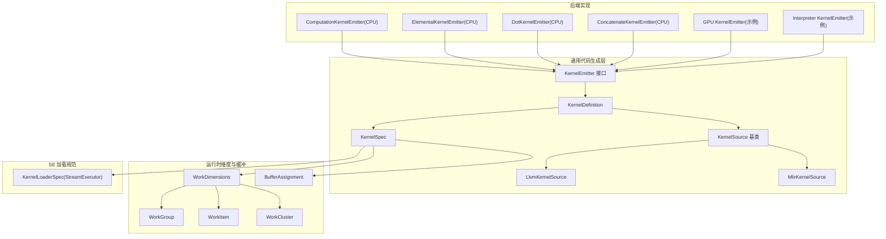
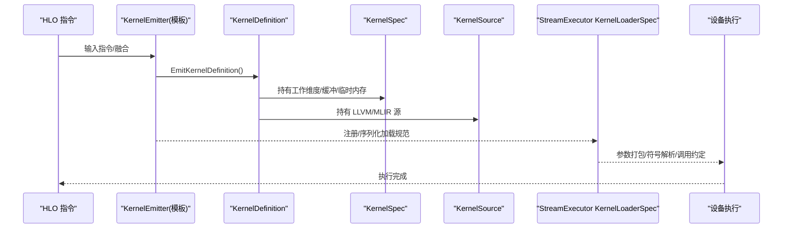
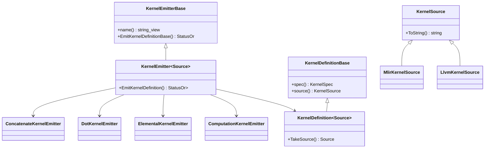
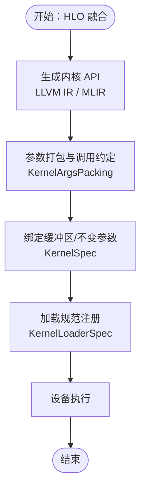
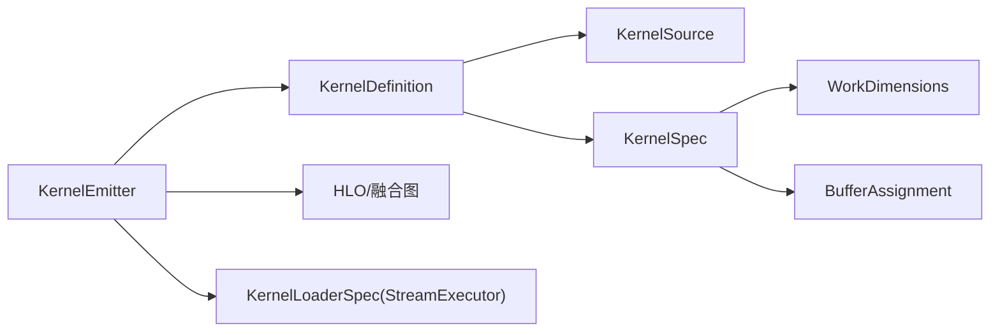

# 内核发射器

<cite>
**本文引用的文件**
- [xla/codegen/kernel_emitter.h](file://xla/codegen/kernel_emitter.h)
- [xla/codegen/kernel_definition.h](file://xla/codegen/kernel_definition.h)
- [xla/codegen/kernel_source.h](file://xla/codegen/kernel_source.h)
- [xla/codegen/llvm_kernel_source.h](file://xla/codegen/llvm_kernel_source.h)
- [xla/codegen/mlir_kernel_source.h](file://xla/codegen/mlir_kernel_source.h)
- [xla/codegen/kernel_spec.h](file://xla/codegen/kernel_spec.h)
- [xla/stream_executor/kernel_spec.h](file://xla/stream_executor/kernel_spec.h)
- [xla/backends/cpu/codegen/computation_kernel_emitter.h](file://xla/backends/cpu/codegen/computation_kernel_emitter.h)
- [xla/backends/cpu/codegen/computation_kernel_emitter.cc](file://xla/backends/cpu/codegen/computation_kernel_emitter.cc)
- [xla/backends/cpu/codegen/elemental/elemental_kernel_emitter.h](file://xla/backends/cpu/codegen/elemental/elemental_kernel_emitter.h)
- [xla/backends/cpu/codegen/elemental/elemental_kernel_emitter.cc](file://xla/backends/cpu/codegen/elemental/elemental_kernel_emitter.cc)
- [xla/backends/cpu/codegen/dot/dot_kernel_emitter.h](file://xla/backends/cpu/codegen/dot/dot_kernel_emitter.h)
- [xla/backends/cpu/codegen/dot/dot_kernel_emitter.cc](file://xla/backends/cpu/codegen/dot/dot_kernel_emitter.cc)
- [xla/backends/cpu/codegen/concatenate/concatenate_kernel_emitter.h](file://xla/backends/cpu/codegen/concatenate/concatenate_kernel_emitter.h)
- [xla/backends/cpu/codegen/concatenate/concatenate_kernel_emitter.cc](file://xla/backends/cpu/codegen/concatenate/concatenate_kernel_emitter.cc)
- [xla/backends/gpu/.../kernel_emitter.h](file://xla/backends/gpu/.../kernel_emitter.h)
- [xla/backends/gpu/.../kernel_emitter.cc](file://xla/backends/gpu/.../kernel_emitter.cc)
- [xla/backends/interpreter/.../kernel_emitter.h](file://xla/backends/interpreter/.../kernel_emitter.h)
- [xla/backends/interpreter/.../kernel_emitter.cc](file://xla/backends/interpreter/.../kernel_emitter.cc)
- [xla/ffi/type_registry.h](file://xla/ffi/type_registry.h)
- [xla/ffi/type_registry.cc](file://xla/ffi/type_registry.cc)
- [xla/ffi/ffi_api.h](file://xla/ffi/ffi_api.h)
- [xla/ffi/ffi_api.cc](file://xla/ffi/ffi_api.cc)
- [xla/ffi/call_frame.h](file://xla/ffi/call_frame.h)
- [xla/ffi/call_frame.cc](file://xla/ffi/call_frame.cc)
- [xla/runtime/work_dimensions.h](file://xla/runtime/work_dimensions.h)
- [xla/runtime/work_group.h](file://xla/runtime/work_group.h)
- [xla/runtime/work_item.h](file://xla/runtime/work_item.h)
- [xla/runtime/work_cluster.h](file://xla/runtime/work_cluster.h)
- [xla/service/buffer_assignment.h](file://xla/service/buffer_assignment.h)
- [xla/hlo/ir/hlo_instruction.h](file://xla/hlo/ir/hlo_instruction.h)
- [docs/emitters.md](file://docs/emitters.md)
</cite>

## 目录
1. [引言](#引言)
2. [项目结构](#项目结构)
3. [核心组件](#核心组件)
4. [架构总览](#架构总览)
5. [详细组件分析](#详细组件分析)
6. [依赖关系分析](#依赖关系分析)
7. [性能考量](#性能考量)
8. [故障排查指南](#故障排查指南)
9. [结论](#结论)
10. [附录：扩展指南](#附录扩展指南)

## 引言
本文件系统性阐述 XLA 内核发射器（Kernel Emitter）的设计与实现，覆盖通用发射器接口、具体硬件后端实现模式、KernelApiBuilder 的作用（API 生成、参数绑定与调用约定处理）、类型工具类（数据类型映射、布局转换与内存对齐）、运行时特性（动态代码生成、符号解析与内存管理），并给出多后端（GPU、CPU、解释器等）实现概览与扩展指南。

## 项目结构
内核发射器相关代码主要分布在以下区域：
- 通用发射框架与接口：xla/codegen 下的 kernel_emitter.h、kernel_definition.h、kernel_source.h、llvm_kernel_source.h、mlir_kernel_source.h、kernel_spec.h
- 运行时工作维度与缓冲区抽象：xla/runtime 下的 work_* 与 xla/service/buffer_assignment.h
- 后端实现示例：CPU 后端在 xla/backends/cpu/codegen 下；GPU 后端在 xla/backends/gpu/...；解释器后端在 xla/backends/interpreter/...
- StreamExecutor 层的加载规范：xla/stream_executor/kernel_spec.h
- FFI 类型与调用桥接：xla/ffi 下若干文件
- 文档：docs/emitters.md

**图表来源**
- [xla/codegen/kernel_emitter.h](file://xla/codegen/kernel_emitter.h#L29-L70)
- [xla/codegen/kernel_definition.h](file://xla/codegen/kernel_definition.h#L34-L78)
- [xla/codegen/kernel_source.h](file://xla/codegen/kernel_source.h#L23-L37)
- [xla/codegen/llvm_kernel_source.h](file://xla/codegen/llvm_kernel_source.h#L30-L51)
- [xla/codegen/mlir_kernel_source.h](file://xla/codegen/mlir_kernel_source.h#L32-L76)
- [xla/codegen/kernel_spec.h](file://xla/codegen/kernel_spec.h#L37-L114)
- [xla/runtime/work_dimensions.h](file://xla/runtime/work_dimensions.h)
- [xla/runtime/work_group.h](file://xla/runtime/work_group.h)
- [xla/runtime/work_item.h](file://xla/runtime/work_item.h)
- [xla/runtime/work_cluster.h](file://xla/runtime/work_cluster.h)
- [xla/service/buffer_assignment.h](file://xla/service/buffer_assignment.h)
- [xla/backends/cpu/codegen/computation_kernel_emitter.h](file://xla/backends/cpu/codegen/computation_kernel_emitter.h#L47-L68)
- [xla/backends/cpu/codegen/elemental/elemental_kernel_emitter.h](file://xla/backends/cpu/codegen/elemental/elemental_kernel_emitter.h)
- [xla/backends/cpu/codegen/dot/dot_kernel_emitter.h](file://xla/backends/cpu/codegen/dot/dot_kernel_emitter.h)
- [xla/backends/cpu/codegen/concatenate/concatenate_kernel_emitter.h](file://xla/backends/cpu/codegen/concatenate/concatenate_kernel_emitter.h)
- [xla/stream_executor/kernel_spec.h](file://xla/stream_executor/kernel_spec.h#L91-L220)

**章节来源**
- [xla/codegen/kernel_emitter.h](file://xla/codegen/kernel_emitter.h#L29-L70)
- [xla/codegen/kernel_definition.h](file://xla/codegen/kernel_definition.h#L34-L78)
- [xla/codegen/kernel_source.h](file://xla/codegen/kernel_source.h#L23-L37)
- [xla/codegen/llvm_kernel_source.h](file://xla/codegen/llvm_kernel_source.h#L30-L51)
- [xla/codegen/mlir_kernel_source.h](file://xla/codegen/mlir_kernel_source.h#L32-L76)
- [xla/codegen/kernel_spec.h](file://xla/codegen/kernel_spec.h#L37-L114)
- [xla/runtime/work_dimensions.h](file://xla/runtime/work_dimensions.h)
- [xla/runtime/work_group.h](file://xla/runtime/work_group.h)
- [xla/runtime/work_item.h](file://xla/runtime/work_item.h)
- [xla/runtime/work_cluster.h](file://xla/runtime/work_cluster.h)
- [xla/service/buffer_assignment.h](file://xla/service/buffer_assignment.h)
- [xla/backends/cpu/codegen/computation_kernel_emitter.h](file://xla/backends/cpu/codegen/computation_kernel_emitter.h#L47-L68)
- [xla/backends/cpu/codegen/elemental/elemental_kernel_emitter.h](file://xla/backends/cpu/codegen/elemental/elemental_kernel_emitter.h)
- [xla/backends/cpu/codegen/dot/dot_kernel_emitter.h](file://xla/backends/cpu/codegen/dot/dot_kernel_emitter.h)
- [xla/backends/cpu/codegen/concatenate/concatenate_kernel_emitter.h](file://xla/backends/cpu/codegen/concatenate/concatenate_kernel_emitter.h)
- [xla/stream_executor/kernel_spec.h](file://xla/stream_executor/kernel_spec.h#L91-L220)

## 核心组件
- 通用发射器接口
  - KernelEmitterBase：定义发射器名称与统一的 EmitKernelDefinitionBase 虚接口，返回 KernelDefinitionBase 指针，便于上层以多态方式处理不同源码类型。
  - KernelEmitter<Source>：模板接口，要求 Source 继承自 KernelSource，并返回强类型的 KernelDefinition<Source>。
- 内核定义
  - KernelDefinitionBase：持有 KernelSpec 并暴露 source() 访问器，支持移动语义。
  - KernelDefinition<Source>：强类型封装，提供 TakeSource 移交所有权的能力。
- 内核源码
  - KernelSource：抽象基类，提供 ToString() 用于人类可读表示。
  - LlvmKernelSource：持有线程安全的 LLVM Module，支持移动语义与线程安全模块访问。
  - MlirKernelSource：持有 MLIR ModuleOp 与上下文，支持解析与模块转移。
- 内核规格
  - KernelSpec：描述内核名称、工作维度、参数/结果缓冲区、不变参数集合与临时内存需求等。
- 运行时维度
  - WorkDimensions/WorkGroup/WorkItem/WorkCluster：抽象并行度与分组信息，后端负责映射到具体硬件。

**章节来源**
- [xla/codegen/kernel_emitter.h](file://xla/codegen/kernel_emitter.h#L29-L70)
- [xla/codegen/kernel_definition.h](file://xla/codegen/kernel_definition.h#L34-L78)
- [xla/codegen/kernel_source.h](file://xla/codegen/kernel_source.h#L23-L37)
- [xla/codegen/llvm_kernel_source.h](file://xla/codegen/llvm_kernel_source.h#L30-L51)
- [xla/codegen/mlir_kernel_source.h](file://xla/codegen/mlir_kernel_source.h#L32-L76)
- [xla/codegen/kernel_spec.h](file://xla/codegen/kernel_spec.h#L37-L114)
- [xla/runtime/work_dimensions.h](file://xla/runtime/work_dimensions.h)
- [xla/runtime/work_group.h](file://xla/runtime/work_group.h)
- [xla/runtime/work_item.h](file://xla/runtime/work_item.h)
- [xla/runtime/work_cluster.h](file://xla/runtime/work_cluster.h)

## 架构总览
下图展示从 HLO 到后端执行的关键路径：发射器生成 KernelDefinition，包含 KernelSpec 与 KernelSource；运行时根据后端选择加载策略（如 PTX/CUBIN 符号或直接函数指针），并通过参数打包与调用约定完成执行。

**图表来源**
- [xla/codegen/kernel_emitter.h](file://xla/codegen/kernel_emitter.h#L53-L70)
- [xla/codegen/kernel_definition.h](file://xla/codegen/kernel_definition.h#L58-L78)
- [xla/codegen/kernel_spec.h](file://xla/codegen/kernel_spec.h#L41-L114)
- [xla/codegen/llvm_kernel_source.h](file://xla/codegen/llvm_kernel_source.h#L34-L51)
- [xla/codegen/mlir_kernel_source.h](file://xla/codegen/mlir_kernel_source.h#L41-L76)
- [xla/stream_executor/kernel_spec.h](file://xla/stream_executor/kernel_spec.h#L91-L220)

## 详细组件分析

### 通用发射器接口与实现模式
- 接口职责
  - KernelEmitterBase：统一命名与多态发射入口。
  - KernelEmitter<Source>：约束 Source 必须是 KernelSource 子类，保证强类型 KernelDefinition 返回值。
- 实现模式
  - CPU 后端：ComputationKernelEmitter 通过旧式 IR 发射器生成嵌套计算内核定义，构建合成的 buffer_table，适用于高开销 thunk 路径的替代场景。
  - 元算子发射器：ElementalKernelEmitter、DotKernelEmitter、ConcatenateKernelEmitter 等针对具体算子进行内核发射，复用通用接口。
  - GPU/解释器后端：分别在各自目录下提供对应 KernelEmitter 实现，遵循相同接口契约。

**图表来源**
- [xla/codegen/kernel_emitter.h](file://xla/codegen/kernel_emitter.h#L29-L70)
- [xla/codegen/kernel_definition.h](file://xla/codegen/kernel_definition.h#L34-L78)
- [xla/codegen/kernel_source.h](file://xla/codegen/kernel_source.h#L23-L37)
- [xla/codegen/llvm_kernel_source.h](file://xla/codegen/llvm_kernel_source.h#L30-L51)
- [xla/codegen/mlir_kernel_source.h](file://xla/codegen/mlir_kernel_source.h#L32-L76)
- [xla/backends/cpu/codegen/computation_kernel_emitter.h](file://xla/backends/cpu/codegen/computation_kernel_emitter.h#L47-L68)
- [xla/backends/cpu/codegen/elemental/elemental_kernel_emitter.h](file://xla/backends/cpu/codegen/elemental/elemental_kernel_emitter.h)
- [xla/backends/cpu/codegen/dot/dot_kernel_emitter.h](file://xla/backends/cpu/codegen/dot/dot_kernel_emitter.h)
- [xla/backends/cpu/codegen/concatenate/concatenate_kernel_emitter.h](file://xla/backends/cpu/codegen/concatenate/concatenate_kernel_emitter.h)

**章节来源**
- [xla/codegen/kernel_emitter.h](file://xla/codegen/kernel_emitter.h#L29-L70)
- [xla/backends/cpu/codegen/computation_kernel_emitter.h](file://xla/backends/cpu/codegen/computation_kernel_emitter.h#L47-L68)
- [xla/backends/cpu/codegen/elemental/elemental_kernel_emitter.h](file://xla/backends/cpu/codegen/elemental/elemental_kernel_emitter.h)
- [xla/backends/cpu/codegen/dot/dot_kernel_emitter.h](file://xla/backends/cpu/codegen/dot/dot_kernel_emitter.h)
- [xla/backends/cpu/codegen/concatenate/concatenate_kernel_emitter.h](file://xla/backends/cpu/codegen/concatenate/concatenate_kernel_emitter.h)

### KernelApiBuilder 的作用与流程
- API 生成
  - 由具体发射器根据 HLO/融合图生成目标语言的内核 API（LLVM IR 或 MLIR），并封装为 LlvmKernelSource 或 MlirKernelSource。
- 参数绑定与调用约定
  - 通过 KernelSpec 描述参数/结果缓冲区与不变参数集合，结合后端 ABI 映射到具体寄存器/内存布局。
  - 在 StreamExecutor 层，KernelLoaderSpec 提供参数打包（KernelArgsPacking）与符号解析（InProcessSymbol/CUDA PTX/CUBIN），确保调用约定一致。
- 序列化与加载
  - KernelLoaderSpec 支持序列化与反序列化，便于 AOT 编译与跨进程加载。

**图表来源**
- [xla/codegen/llvm_kernel_source.h](file://xla/codegen/llvm_kernel_source.h#L30-L51)
- [xla/codegen/mlir_kernel_source.h](file://xla/codegen/mlir_kernel_source.h#L32-L76)
- [xla/codegen/kernel_spec.h](file://xla/codegen/kernel_spec.h#L41-L114)
- [xla/stream_executor/kernel_spec.h](file://xla/stream_executor/kernel_spec.h#L91-L220)

**章节来源**
- [xla/codegen/llvm_kernel_source.h](file://xla/codegen/llvm_kernel_source.h#L30-L51)
- [xla/codegen/mlir_kernel_source.h](file://xla/codegen/mlir_kernel_source.h#L32-L76)
- [xla/codegen/kernel_spec.h](file://xla/codegen/kernel_spec.h#L41-L114)
- [xla/stream_executor/kernel_spec.h](file://xla/stream_executor/kernel_spec.h#L91-L220)

### 类型工具类与数据布局
- 数据类型映射
  - 通过类型注册表（FFI Type Registry）将高层类型映射到底层 ABI 对应的类型表示，确保参数打包与调用约定一致。
- 布局转换与内存对齐
  - Shape/Layout 工具与 BufferAssignment 协作，确保内核访问的内存布局满足后端对齐与缓存友好的要求。
- FFI 桥接
  - FFI API 与 CallFrame 提供跨语言/跨层的调用桥接，配合类型注册表完成参数传递与返回值处理。

**章节来源**
- [xla/ffi/type_registry.h](file://xla/ffi/type_registry.h)
- [xla/ffi/type_registry.cc](file://xla/ffi/type_registry.cc)
- [xla/ffi/ffi_api.h](file://xla/ffi/ffi_api.h)
- [xla/ffi/ffi_api.cc](file://xla/ffi/ffi_api.cc)
- [xla/ffi/call_frame.h](file://xla/ffi/call_frame.h)
- [xla/ffi/call_frame.cc](file://xla/ffi/call_frame.cc)
- [xla/service/buffer_assignment.h](file://xla/service/buffer_assignment.h)

### 运行时特性：动态代码生成、符号解析与内存管理
- 动态代码生成
  - LlvmKernelSource 持有线程安全的 LLVM Module，可在运行时生成/优化并即时加载。
  - MlirKernelSource 保存 MLIR Module，由后端编译器进一步 Lower 到 LLVM。
- 符号解析
  - KernelLoaderSpec 支持多种加载方式：CUDA PTX/CUBIN 内存镜像、CUDA C++ 符号指针、持久化符号名等，满足不同平台与生命周期需求。
- 内存管理
  - KernelSpec 可声明临时内存需求（scratch），后端据此分配共享/缓存级别内存；BufferAssignment 负责缓冲区切片与别名分析。

**章节来源**
- [xla/codegen/llvm_kernel_source.h](file://xla/codegen/llvm_kernel_source.h#L30-L51)
- [xla/codegen/mlir_kernel_source.h](file://xla/codegen/mlir_kernel_source.h#L32-L76)
- [xla/codegen/kernel_spec.h](file://xla/codegen/kernel_spec.h#L82-L85)
- [xla/service/buffer_assignment.h](file://xla/service/buffer_assignment.h)
- [xla/stream_executor/kernel_spec.h](file://xla/stream_executor/kernel_spec.h#L91-L220)

### 多硬件后端实现概览
- CPU 后端
  - ComputationKernelEmitter：针对调用指令与嵌套计算的内核发射，适合避免 thunk 高开销的场景。
  - Elemental/Dot/Concatenate 等元算子发射器：面向具体算子的高效内核生成。
- GPU 后端
  - 通过 KernelLoaderSpec 注册 PTX/CUBIN 符号或内联 PTX/CUBIN，结合参数打包与调用约定完成执行。
- 解释器后端
  - 作为兼容与调试路径，提供与真实后端一致的发射接口与行为。

**章节来源**
- [xla/backends/cpu/codegen/computation_kernel_emitter.h](file://xla/backends/cpu/codegen/computation_kernel_emitter.h#L47-L68)
- [xla/backends/cpu/codegen/elemental/elemental_kernel_emitter.h](file://xla/backends/cpu/codegen/elemental/elemental_kernel_emitter.h)
- [xla/backends/cpu/codegen/dot/dot_kernel_emitter.h](file://xla/backends/cpu/codegen/dot/dot_kernel_emitter.h)
- [xla/backends/cpu/codegen/concatenate/concatenate_kernel_emitter.h](file://xla/backends/cpu/codegen/concatenate/concatenate_kernel_emitter.h)
- [xla/backends/gpu/.../kernel_emitter.h](file://xla/backends/gpu/.../kernel_emitter.h)
- [xla/backends/gpu/.../kernel_emitter.cc](file://xla/backends/gpu/.../kernel_emitter.cc)
- [xla/backends/interpreter/.../kernel_emitter.h](file://xla/backends/interpreter/.../kernel_emitter.h)
- [xla/backends/interpreter/.../kernel_emitter.cc](file://xla/backends/interpreter/.../kernel_emitter.cc)

## 依赖关系分析
- 组件耦合
  - KernelEmitter 依赖 KernelDefinition/KernelSource，形成清晰的“发射—定义—源码”链路。
  - KernelDefinition 依赖 KernelSpec 与 KernelSource，KernelSpec 依赖运行时维度与缓冲区抽象。
  - 后端发射器实现依赖 HLO/BufferAssignment 与目标平台 ABI。
- 外部依赖
  - LLVM（LLVM IR/JIT）、MLIR（中间表示）、StreamExecutor（加载规范与符号解析）。

**图表来源**
- [xla/codegen/kernel_emitter.h](file://xla/codegen/kernel_emitter.h#L53-L70)
- [xla/codegen/kernel_definition.h](file://xla/codegen/kernel_definition.h#L58-L78)
- [xla/codegen/kernel_source.h](file://xla/codegen/kernel_source.h#L23-L37)
- [xla/codegen/kernel_spec.h](file://xla/codegen/kernel_spec.h#L41-L114)
- [xla/runtime/work_dimensions.h](file://xla/runtime/work_dimensions.h)
- [xla/service/buffer_assignment.h](file://xla/service/buffer_assignment.h)
- [xla/stream_executor/kernel_spec.h](file://xla/stream_executor/kernel_spec.h#L91-L220)

**章节来源**
- [xla/codegen/kernel_emitter.h](file://xla/codegen/kernel_emitter.h#L53-L70)
- [xla/codegen/kernel_definition.h](file://xla/codegen/kernel_definition.h#L58-L78)
- [xla/codegen/kernel_spec.h](file://xla/codegen/kernel_spec.h#L41-L114)
- [xla/stream_executor/kernel_spec.h](file://xla/stream_executor/kernel_spec.h#L91-L220)

## 性能考量
- 并行度与局部性
  - 通过 KernelSpec 的工作维度与运行时维度，指导内核在空间上进行分区与优化数据局部性。
- 临时内存与缓存
  - 使用 scratch_bytes 指示共享/缓存级临时内存，减少全局内存往返。
- 动态生成与即时编译
  - LLVM/MLIR 源在运行时生成，可结合后端编译器进行优化，降低启动与运行时开销。
- 参数打包与 ABI
  - 统一的参数打包与调用约定减少拷贝与类型转换成本，提升吞吐。

## 故障排查指南
- 发射失败
  - 检查 KernelEmitter 返回状态，确认输入 HLO/融合图是否合法。
- 参数绑定错误
  - 核对 KernelSpec 中参数/结果缓冲区与不变参数集合，确保与 ABI 一致。
- 符号解析失败
  - 对照 KernelLoaderSpec 的加载方式（PTX/CUBIN/符号指针），确认名称与打包函数正确。
- 内存不足
  - 调整 KernelSpec 的 scratch_bytes，或优化内核对共享/缓存内存的使用。

**章节来源**
- [xla/codegen/kernel_emitter.h](file://xla/codegen/kernel_emitter.h#L33-L47)
- [xla/codegen/kernel_spec.h](file://xla/codegen/kernel_spec.h#L82-L101)
- [xla/stream_executor/kernel_spec.h](file://xla/stream_executor/kernel_spec.h#L153-L177)

## 结论
内核发射器通过统一的接口与强类型定义，将 HLO 融合映射为后端可执行的内核源码，并借助 KernelSpec 与 KernelLoaderSpec 完成并行度规划、参数绑定与符号解析。LLVM/MLIR 源码生成与运行时加载机制提供了灵活高效的动态代码生成能力，配合 FFI 类型工具与缓冲区布局，支撑多后端（CPU/GPU/解释器）的一致行为与高性能执行。

## 附录：扩展指南
- 新增操作符支持
  - 在相应后端目录新增发射器实现，继承 KernelEmitter 并实现 EmitKernelDefinition，返回强类型 KernelDefinition。
  - 在 KernelSpec 中声明必要的工作维度与临时内存需求，确保与 ABI 一致。
- 自定义发射器开发
  - 若需自定义 KernelSource 类型，继承 KernelSource 并实现 ToString 与必要的所有权转移接口。
  - 在 StreamExecutor 层注册 KernelLoaderSpec，提供参数打包与符号解析逻辑。
- 文档与示例
  - 参考现有元算子发射器（Elemental/Dot/Concatenate）与 ComputationKernelEmitter 的实现模式，保持接口一致性与可测试性。

**章节来源**
- [xla/codegen/kernel_emitter.h](file://xla/codegen/kernel_emitter.h#L53-L70)
- [xla/codegen/kernel_definition.h](file://xla/codegen/kernel_definition.h#L58-L78)
- [xla/codegen/kernel_source.h](file://xla/codegen/kernel_source.h#L23-L37)
- [xla/backends/cpu/codegen/computation_kernel_emitter.h](file://xla/backends/cpu/codegen/computation_kernel_emitter.h#L47-L68)
- [xla/backends/cpu/codegen/elemental/elemental_kernel_emitter.h](file://xla/backends/cpu/codegen/elemental/elemental_kernel_emitter.h)
- [xla/backends/cpu/codegen/dot/dot_kernel_emitter.h](file://xla/backends/cpu/codegen/dot/dot_kernel_emitter.h)
- [xla/backends/cpu/codegen/concatenate/concatenate_kernel_emitter.h](file://xla/backends/cpu/codegen/concatenate/concatenate_kernel_emitter.h)
- [xla/stream_executor/kernel_spec.h](file://xla/stream_executor/kernel_spec.h#L91-L220)
- [docs/emitters.md](file://docs/emitters.md)