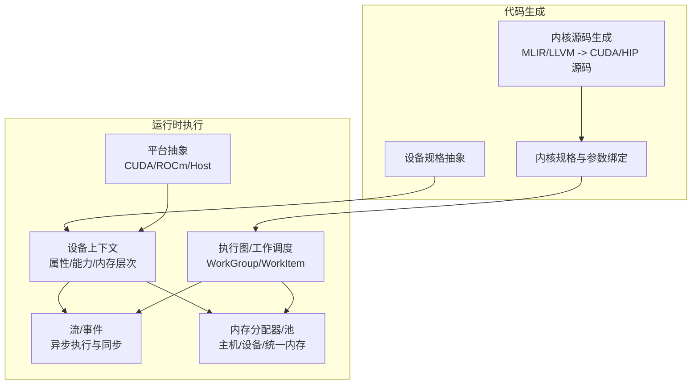
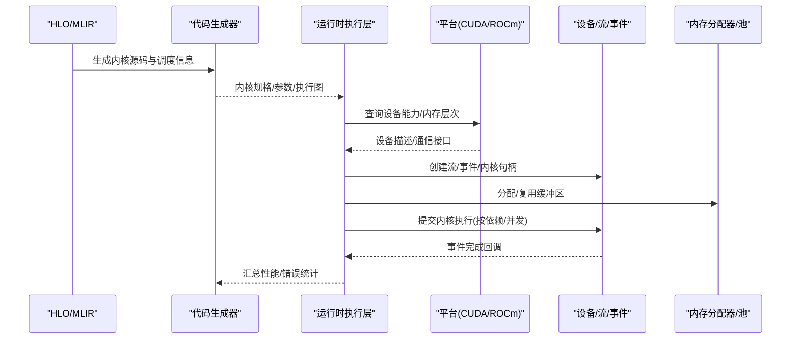
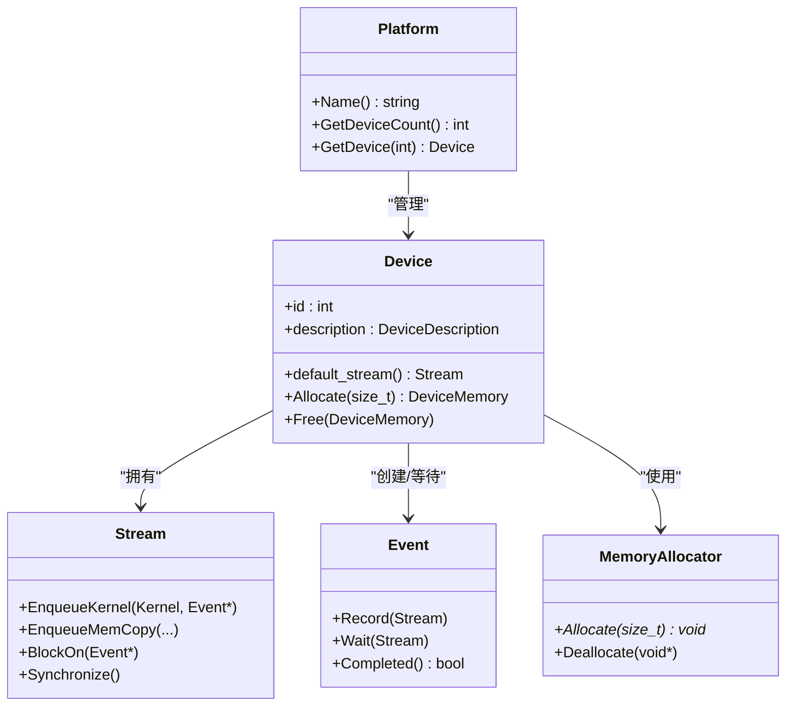
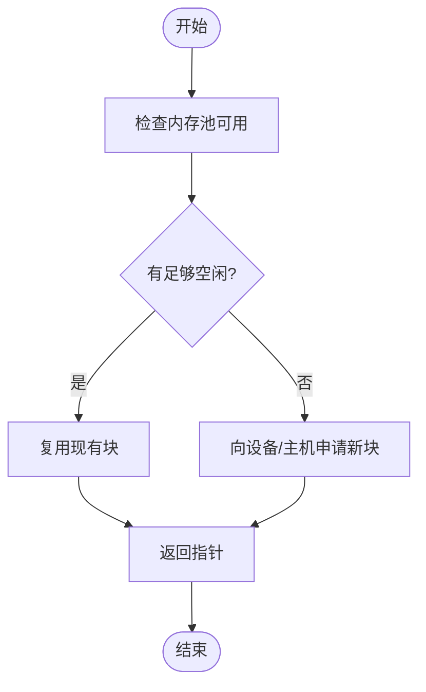
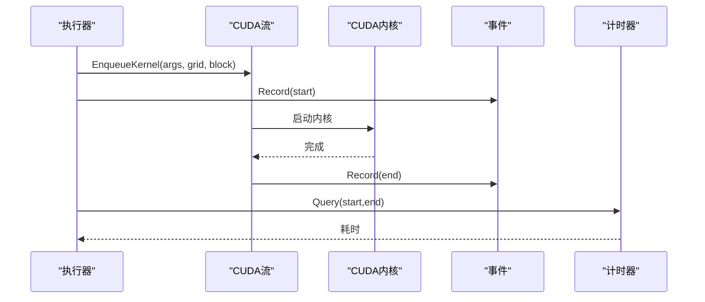
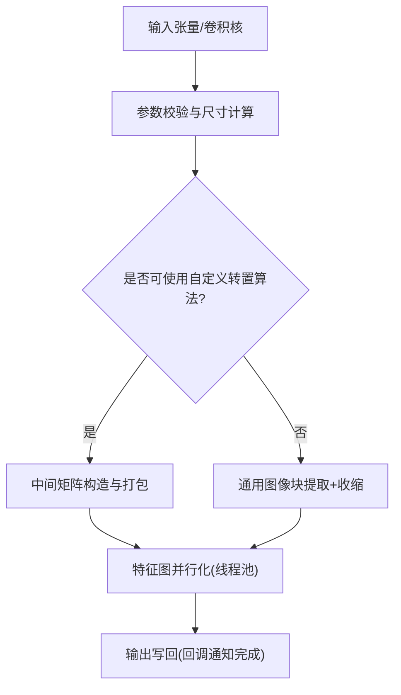
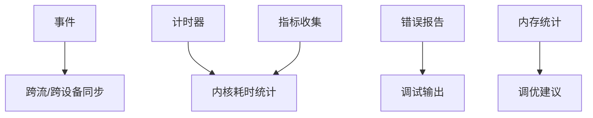
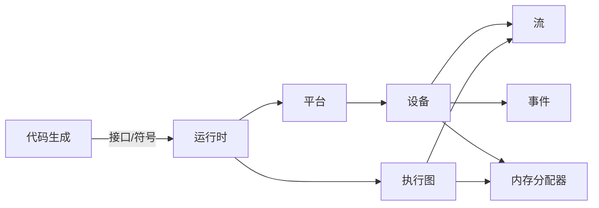

# 运行时集成

<cite>
**本文引用的文件**
- [xla/backends/cpu/runtime/buffer_allocations.h](file://xla/backends/cpu/runtime/buffer_allocations.h)
- [xla/backends/cpu/runtime/function_library.h](file://xla/backends/cpu/runtime/function_library.h)
- [xla/backends/cpu/runtime/convolution_lib.h](file://xla/backends/cpu/runtime/convolution_lib.h)
- [xla/pjrt/c_api_client/pjrt_c_api_client.h](file://xla/pjrt/c_api_client/pjrt_c_api_client.h)
- [xla/pjrt/common_pjrt_client.h](file://xla/pjrt/common_pjrt_client.h)
- [xla/pjrt/pjrt_api.h](file://xla/pjrt/pjrt_api.h)
- [xla/pjrt/event_pool.h](file://xla/pjrt/event_pool.h)
- [xla/pjrt/host_memory_allocator.h](file://xla/pjrt/host_memory_allocator.h)
- [xla/pjrt/host_memory_spaces.h](file://xla/pjrt/host_memory_spaces.h)
- [xla/pjrt/thread_pool_async_work_runner.h](file://xla/pjrt/thread_pool_async_work_runner.h)
- [xla/pjrt/worker_thread.h](file://xla/pjrt/worker_thread.h)
- [xla/pjrt/compiled_memory_stats.h](file://xla/pjrt/compiled_memory_stats.h)
- [xla/pjrt/metrics.h](file://xla/pjrt/metrics.h)
- [xla/pjrt/errors.h](file://xla/pjrt/errors.h)
- [xla/pjrt/transpose.h](file://xla/pjrt/transpose.h)
- [xla/pjrt/triton_cuda.cc](file://xla/pjrt/triton_cuda.cc)
- [xla/pjrt/triton_rocm.cc](file://xla/pjrt/triton_rocm.cc)
- [xla/pjrt/triton_stub.cc](file://xla/pjrt/triton_stub.cc)
- [xla/runtime/resource_use.h](file://xla/runtime/resource_use.h)
- [xla/runtime/execution_graph.h](file://xla/runtime/execution_graph.h)
- [xla/runtime/hang_watchdog.h](file://xla/runtime/hang_watchdog.h)
- [xla/stream_executor/cuda/cuda_activation.h](file://xla/stream_executor/cuda/cuda_activation.h)
- [xla/stream_executor/cuda/cuda_activation.cc](file://xla/stream_executor/cuda/cuda_activation.cc)
- [xla/stream_executor/cuda/cuda_dnn.h](file://xla/stream_executor/cuda/cuda_dnn.h)
- [xla/stream_executor/cuda/cuda_dnn.cc](file://xla/stream_executor/cuda/cuda_dnn.cc)
- [xla/stream_executor/cuda/cuda_gpu_executor.h](file://xla/stream_executor/cuda/cuda_gpu_executor.h)
- [xla/stream_executor/cuda/cuda_gpu_executor.cc](file://xla/stream_executor/cuda/cuda_gpu_executor.cc)
- [xla/stream_executor/cuda/cuda_stream.h](file://xla/stream_executor/cuda/cuda_stream.h)
- [xla/stream_executor/cuda/cuda_stream.cc](file://xla/stream_executor/cuda/cuda_stream.cc)
- [xla/stream_executor/cuda/cuda_timer.h](file://xla/stream_executor/cuda/cuda_timer.h)
- [xla/stream_executor/cuda/cuda_timer.cc](file://xla/stream_executor/cuda/cuda_timer.cc)
- [xla/stream_executor/cuda/cuda_device_array.h](file://xla/stream_executor/cuda/cuda_device_array.h)
- [xla/stream_executor/cuda/cuda_device_array.cc](file://xla/stream_executor/cuda/cuda_device_array.cc)
- [xla/stream_executor/cuda/cuda_device_description.h](file://xla/stream_executor/cuda/cuda_device_description.h)
- [xla/stream_executor/cuda/cuda_device_description.cc](file://xla/stream_executor/cuda/cuda_device_description.cc)
- [xla/stream_executor/cuda/cuda_rdma.h](file://xla/stream_executor/cuda/cuda_rdma.h)
- [xla/stream_executor/cuda/cuda_rdma.cc](file://xla/stream_executor/cuda/cuda_rdma.cc)
- [xla/stream_executor/cuda/cuda_ipc.h](file://xla/stream_executor/cuda/cuda_ipc.h)
- [xla/stream_executor/cuda/cuda_ipc.cc](file://xla/stream_executor/cuda/cuda_ipc.cc)
- [xla/stream_executor/cuda/cuda_memory_pool.h](file://xla/stream_executor/cuda/cuda_memory_pool.h)
- [xla/stream_executor/cuda/cuda_memory_pool.cc](file://xla/stream_executor/cuda/cuda_memory_pool.cc)
- [xla/stream_executor/cuda/cuda_kernel.h](file://xla/stream_executor/cuda/cuda_kernel.h)
- [xla/stream_executor/cuda/cuda_kernel.cc](file://xla/stream_executor/cuda/cuda_kernel.cc)
- [xla/stream_executor/cuda/cuda_semaphore.h](file://xla/stream_executor/cuda/cuda_semaphore.h)
- [xla/stream_executor/cuda/cuda_semaphore.cc](file://xla/stream_executor/cuda/cuda_semaphore.cc)
- [xla/stream_executor/cuda/cuda_platform.h](file://xla/stream_executor/cuda/cuda_platform.h)
- [xla/stream_executor/cuda/cuda_platform.cc](file://xla/stream_executor/cuda/cuda_platform.cc)
- [xla/stream_executor/rocm/rocm_activation.h](file://xla/stream_executor/rocm/rocm_activation.h)
- [xla/stream_executor/rocm/rocm_activation.cc](file://xla/stream_executor/rocm/rocm_activation.cc)
- [xla/stream_executor/rocm/rocm_gpu_executor.h](file://xla/stream_executor/rocm/rocm_gpu_executor.h)
- [xla/stream_executor/rocm/rocm_gpu_executor.cc](file://xla/stream_executor/rocm/rocm_gpu_executor.cc)
- [xla/stream_executor/rocm/rocm_stream.h](file://xla/stream_executor/rocm/rocm_stream.h)
- [xla/stream_executor/rocm/rocm_stream.cc](file://xla/stream_executor/rocm/rocm_stream.cc)
- [xla/stream_executor/rocm/rocm_device_description.h](file://xla/stream_executor/rocm/rocm_device_description.h)
- [xla/stream_executor/rocm/rocm_device_description.cc](file://xla/stream_executor/rocm/rocm_device_description.cc)
- [xla/stream_executor/rocm/rocm_memory_pool.h](file://xla/stream_executor/rocm/rocm_memory_pool.h)
- [xla/stream_executor/rocm/rocm_memory_pool.cc](file://xla/stream_executor/rocm/rocm_memory_pool.cc)
- [xla/stream_executor/rocm/rocm_kernel.h](file://xla/stream_executor/rocm/rocm_kernel.h)
- [xla/stream_executor/rocm/rocm_kernel.cc](file://xla/stream_executor/rocm/rocm_kernel.cc)
- [xla/stream_executor/rocm/rocm_platform.h](file://xla/stream_executor/rocm/rocm_platform.h)
- [xla/stream_executor/rocm/rocm_platform.cc](file://xla/stream_executor/rocm/rocm_platform.cc)
- [xla/stream_executor/platform.h](file://xla/stream_executor/platform.h)
- [xla/stream_executor/platform.cc](file://xla/stream_executor/platform.cc)
- [xla/stream_executor/device.h](file://xla/stream_executor/device.h)
- [xla/stream_executor/device.cc](file://xla/stream_executor/device.cc)
- [xla/stream_executor/stream.h](file://xla/stream_executor/stream.h)
- [xla/stream_executor/stream.cc](file://xla/stream_executor/stream.cc)
- [xla/stream_executor/memory_allocator.h](file://xla/stream_executor/memory_allocator.h)
- [xla/stream_executor/memory_allocator.cc](file://xla/stream_executor/memory_allocator.cc)
- [xla/stream_executor/kernel.h](file://xla/stream_executor/kernel.h)
- [xla/stream_executor/kernel.cc](file://xla/stream_executor/kernel.cc)
- [xla/stream_executor/dynamic_loader.h](file://xla/stream_executor/dynamic_loader.h)
- [xla/stream_executor/dynamic_loader.cc](file://xla/stream_executor/dynamic_loader.cc)
- [xla/stream_executor/event.h](file://xla/stream_executor/event.h)
- [xla/stream_executor/event.cc](file://xla/stream_executor/event.cc)
- [xla/codegen/device_spec.h](file://xla/codegen/device_spec.h)
- [xla/codegen/kernel_spec.h](file://xla/codegen/kernel_spec.h)
- [xla/codegen/ir_emission_utils.h](file://xla/codegen/ir_emission_utils.h)
- [xla/codegen/mlir_kernel_source.h](file://xla/codegen/mlir_kernel_source.h)
- [xla/codegen/llvm_kernel_source.h](file://xla/codegen/llvm_kernel_source.h)
- [xla/codegen/trace_pass_instrumentation.h](file://xla/codegen/trace_pass_instrumentation.h)
- [xla/runtime/object_pool.h](file://xla/runtime/object_pool.h)
- [xla/runtime/work_group.h](file://xla/runtime/work_group.h)
- [xla/runtime/work_item.h](file://xla/runtime/work_item.h)
- [xla/runtime/work_cluster.h](file://xla/runtime/work_cluster.h)
- [xla/runtime/work_dimensions.h](file://xla/runtime/work_dimensions.h)
- [xla/runtime/work_tile_size.h](file://xla/runtime/work_tile_size.h)
</cite>

## 目录
1. [引言](#引言)
2. [项目结构](#项目结构)
3. [核心组件](#核心组件)
4. [架构总览](#架构总览)
5. [详细组件分析](#详细组件分析)
6. [依赖关系分析](#依赖关系分析)
7. [性能考虑](#性能考虑)
8. [故障排查指南](#故障排查指南)
9. [结论](#结论)
10. [附录](#附录)

## 引言
本文件面向“代码生成的运行时集成”，系统性阐述XLA在CPU/GPU等后端上的运行时集成机制，覆盖以下关键主题：
- 设备上下文管理：平台、设备、流、事件、内存池的生命周期与协作
- 流池与内存分配：CUDA/HIP流、内存池、主机/设备内存空间与分配器
- GPU运行时实现：CUDA/HIP内核启动、同步、RDMA/IPC通信与计时
- CPU运行时优化：多线程执行、缓存友好的数据布局与卷积库
- 设备规范抽象：设备能力查询、内存层次结构、通信接口
- 性能监控与调试：事件跟踪、性能计数器、错误报告
- 运行时配置与调优：并发度、资源分配策略

## 项目结构
XLA的运行时集成由“代码生成层”和“运行时执行层”两部分构成：
- 代码生成层：负责将HLO/MLIR转换为可执行内核（CUDA/HIP/LLVM），并生成调度信息
- 运行时执行层：负责在具体硬件上执行，包含平台抽象、设备上下文、流/事件、内存分配、内核调度与同步

图表来源
- [xla/codegen/mlir_kernel_source.h](file://xla/codegen/mlir_kernel_source.h)
- [xla/codegen/llvm_kernel_source.h](file://xla/codegen/llvm_kernel_source.h)
- [xla/codegen/kernel_spec.h](file://xla/codegen/kernel_spec.h)
- [xla/codegen/device_spec.h](file://xla/codegen/device_spec.h)
- [xla/stream_executor/platform.h](file://xla/stream_executor/platform.h)
- [xla/stream_executor/device.h](file://xla/stream_executor/device.h)
- [xla/stream_executor/stream.h](file://xla/stream_executor/stream.h)
- [xla/stream_executor/memory_allocator.h](file://xla/stream_executor/memory_allocator.h)
- [xla/runtime/execution_graph.h](file://xla/runtime/execution_graph.h)

章节来源
- [xla/codegen/device_spec.h](file://xla/codegen/device_spec.h)
- [xla/codegen/kernel_spec.h](file://xla/codegen/kernel_spec.h)
- [xla/stream_executor/platform.h](file://xla/stream_executor/platform.h)
- [xla/stream_executor/device.h](file://xla/stream_executor/device.h)
- [xla/stream_executor/stream.h](file://xla/stream_executor/stream.h)
- [xla/stream_executor/memory_allocator.h](file://xla/stream_executor/memory_allocator.h)
- [xla/runtime/execution_graph.h](file://xla/runtime/execution_graph.h)

## 核心组件
- 设备上下文与平台
  - 平台抽象：统一管理不同后端（CUDA/ROCm/Host）
  - 设备描述：能力查询、内存层次、通信接口
- 流与事件
  - 异步执行单元；事件用于跨流/跨设备同步
- 内存分配与池化
  - 主机/设备/统一内存分配器；内存池减少碎片与分配开销
- 执行图与工作调度
  - 将内核调度到具体设备流，管理依赖与并发
- 函数库与符号解析
  - 运行时函数库用于解析内核与辅助函数符号

章节来源
- [xla/stream_executor/platform.h](file://xla/stream_executor/platform.h)
- [xla/stream_executor/device.h](file://xla/stream_executor/device.h)
- [xla/stream_executor/stream.h](file://xla/stream_executor/stream.h)
- [xla/stream_executor/event.h](file://xla/stream_executor/event.h)
- [xla/stream_executor/memory_allocator.h](file://xla/stream_executor/memory_allocator.h)
- [xla/runtime/execution_graph.h](file://xla/runtime/execution_graph.h)
- [xla/backends/cpu/runtime/function_library.h](file://xla/backends/cpu/runtime/function_library.h)

## 架构总览
下图展示从代码生成到运行时执行的关键交互路径。

图表来源
- [xla/codegen/mlir_kernel_source.h](file://xla/codegen/mlir_kernel_source.h)
- [xla/codegen/llvm_kernel_source.h](file://xla/codegen/llvm_kernel_source.h)
- [xla/codegen/kernel_spec.h](file://xla/codegen/kernel_spec.h)
- [xla/stream_executor/platform.h](file://xla/stream_executor/platform.h)
- [xla/stream_executor/device.h](file://xla/stream_executor/device.h)
- [xla/stream_executor/stream.h](file://xla/stream_executor/stream.h)
- [xla/stream_executor/memory_allocator.h](file://xla/stream_executor/memory_allocator.h)
- [xla/runtime/execution_graph.h](file://xla/runtime/execution_graph.h)

## 详细组件分析

### 设备上下文与平台抽象
- 平台与设备
  - 平台负责发现与初始化后端（CUDA/ROCm/Host），提供设备枚举与默认设备选择
  - 设备封装属性（SM数、内存容量、PCIe带宽、是否支持RDMA/IPC）与能力查询接口
- 设备描述
  - 设备描述包含拓扑信息、内存层次（L1/L2/L3/DRAM/UMA）、通信能力（NVLink/PCIe/IB）与特性开关
- 同步与事件
  - 事件用于跨流/跨设备同步，支持跨设备屏障与链式等待
- 通信接口
  - RDMA/IPC用于跨进程/跨设备零拷贝传输，降低延迟与提升带宽

图表来源
- [xla/stream_executor/platform.h](file://xla/stream_executor/platform.h)
- [xla/stream_executor/device.h](file://xla/stream_executor/device.h)
- [xla/stream_executor/stream.h](file://xla/stream_executor/stream.h)
- [xla/stream_executor/event.h](file://xla/stream_executor/event.h)
- [xla/stream_executor/memory_allocator.h](file://xla/stream_executor/memory_allocator.h)

章节来源
- [xla/stream_executor/platform.h](file://xla/stream_executor/platform.h)
- [xla/stream_executor/device.h](file://xla/stream_executor/device.h)
- [xla/stream_executor/event.h](file://xla/stream_executor/event.h)
- [xla/stream_executor/cuda/cuda_device_description.h](file://xla/stream_executor/cuda/cuda_device_description.h)
- [xla/stream_executor/rocm/rocm_device_description.h](file://xla/stream_executor/rocm/rocm_device_description.h)

### 流池与内存分配
- 流池
  - 多流并行执行，避免单流成为瓶颈；支持优先级队列与动态调度
- 内存池
  - 设备内存池减少频繁分配/释放带来的碎片与同步开销；支持LRU回收与阈值控制
- 主机内存空间
  - 支持NUMA感知与对齐分配，优化大块连续内存的分配与释放
- 分配器接口
  - 统一的Allocate/Deallocate接口，便于替换实现（例如统一内存）

图表来源
- [xla/stream_executor/cuda/cuda_memory_pool.h](file://xla/stream_executor/cuda/cuda_memory_pool.h)
- [xla/stream_executor/rocm/rocm_memory_pool.h](file://xla/stream_executor/rocm/rocm_memory_pool.h)
- [xla/pjrt/host_memory_allocator.h](file://xla/pjrt/host_memory_allocator.h)
- [xla/pjrt/host_memory_spaces.h](file://xla/pjrt/host_memory_spaces.h)

章节来源
- [xla/stream_executor/cuda/cuda_memory_pool.h](file://xla/stream_executor/cuda/cuda_memory_pool.h)
- [xla/stream_executor/rocm/rocm_memory_pool.h](file://xla/stream_executor/rocm/rocm_memory_pool.h)
- [xla/pjrt/host_memory_allocator.h](file://xla/pjrt/host_memory_allocator.h)
- [xla/pjrt/host_memory_spaces.h](file://xla/pjrt/host_memory_spaces.h)

### GPU运行时实现（CUDA/HIP）
- 内核启动与同步
  - 通过GPU执行器提交内核至指定流；事件用于跨流/跨设备同步
- CUDA/HIP专用组件
  - CUDA：cuDNN集成、流/事件/计时器、设备数组、RDMA/IPC、内核封装
  - ROCm：HIP等价组件，功能与接口一致
- 计时与性能
  - 使用CUDA/HIP计时器测量内核耗时；结合事件与性能计数器进行分析
- 通信与共享内存
  - RDMA/IPC用于跨进程/跨设备零拷贝；设备数组抽象统一内存与显存

图表来源
- [xla/stream_executor/cuda/cuda_gpu_executor.h](file://xla/stream_executor/cuda/cuda_gpu_executor.h)
- [xla/stream_executor/cuda/cuda_kernel.h](file://xla/stream_executor/cuda/cuda_kernel.h)
- [xla/stream_executor/cuda/cuda_stream.h](file://xla/stream_executor/cuda/cuda_stream.h)
- [xla/stream_executor/cuda/cuda_timer.h](file://xla/stream_executor/cuda/cuda_timer.h)
- [xla/stream_executor/cuda/cuda_device_array.h](file://xla/stream_executor/cuda/cuda_device_array.h)
- [xla/stream_executor/cuda/cuda_rdma.h](file://xla/stream_executor/cuda/cuda_rdma.h)
- [xla/stream_executor/cuda/cuda_ipc.h](file://xla/stream_executor/cuda/cuda_ipc.h)

章节来源
- [xla/stream_executor/cuda/cuda_gpu_executor.h](file://xla/stream_executor/cuda/cuda_gpu_executor.h)
- [xla/stream_executor/cuda/cuda_kernel.h](file://xla/stream_executor/cuda/cuda_kernel.h)
- [xla/stream_executor/cuda/cuda_stream.h](file://xla/stream_executor/cuda/cuda_stream.h)
- [xla/stream_executor/cuda/cuda_timer.h](file://xla/stream_executor/cuda/cuda_timer.h)
- [xla/stream_executor/cuda/cuda_device_array.h](file://xla/stream_executor/cuda/cuda_device_array.h)
- [xla/stream_executor/cuda/cuda_rdma.h](file://xla/stream_executor/cuda/cuda_rdma.h)
- [xla/stream_executor/cuda/cuda_ipc.h](file://xla/stream_executor/cuda/cuda_ipc.h)
- [xla/stream_executor/rocm/rocm_gpu_executor.h](file://xla/stream_executor/rocm/rocm_gpu_executor.h)
- [xla/stream_executor/rocm/rocm_kernel.h](file://xla/stream_executor/rocm/rocm_kernel.h)
- [xla/stream_executor/rocm/rocm_stream.h](file://xla/stream_executor/rocm/rocm_stream.h)

### CPU运行时优化
- 函数库与符号解析
  - 运行时函数库提供内核与比较器等符号解析，支持类型擦除与按名称解析
- 缓冲区分配
  - BufferAllocations以索引方式管理设备地址，支持切片与越界检查，保证安全访问
- 卷积库与多线程
  - 基于Eigen的卷积实现，支持2D/3D、分组卷积、扩张卷积；利用线程池并行处理特征图，减少内存占用与提升吞吐
- 工作队列与并行化
  - WorkQueue与并行化工具用于任务拆分与调度，结合DoneCallback实现异步完成通知

图表来源
- [xla/backends/cpu/runtime/function_library.h](file://xla/backends/cpu/runtime/function_library.h)
- [xla/backends/cpu/runtime/buffer_allocations.h](file://xla/backends/cpu/runtime/buffer_allocations.h)
- [xla/backends/cpu/runtime/convolution_lib.h](file://xla/backends/cpu/runtime/convolution_lib.h)

章节来源
- [xla/backends/cpu/runtime/function_library.h](file://xla/backends/cpu/runtime/function_library.h)
- [xla/backends/cpu/runtime/buffer_allocations.h](file://xla/backends/cpu/runtime/buffer_allocations.h)
- [xla/backends/cpu/runtime/convolution_lib.h](file://xla/backends/cpu/runtime/convolution_lib.h)

### 设备规范抽象与通信接口
- 设备能力查询
  - 设备描述包含SM数、内存容量、L2/L3大小、PCIe带宽、是否支持RDMA/IPC等
- 内存层次结构
  - L1/L2/L3/DRAM/UMA等层级，影响数据局部性与访问延迟
- 通信接口
  - NVLink/PCIe/IB等互连网络，支持RDMA/IPC以实现零拷贝与低延迟传输

章节来源
- [xla/stream_executor/cuda/cuda_device_description.h](file://xla/stream_executor/cuda/cuda_device_description.h)
- [xla/stream_executor/rocm/rocm_device_description.h](file://xla/stream_executor/rocm/rocm_device_description.h)
- [xla/stream_executor/cuda/cuda_rdma.h](file://xla/stream_executor/cuda/cuda_rdma.h)
- [xla/stream_executor/cuda/cuda_ipc.h](file://xla/stream_executor/cuda/cuda_ipc.h)

### 性能监控与调试支持
- 事件跟踪与计时
  - 事件用于跨流/跨设备同步；计时器用于内核耗时测量
- 性能计数器
  - 结合设备计数器与事件，统计吞吐、利用率与瓶颈
- 错误报告
  - 运行时错误封装与传播，配合日志与状态码定位问题
- 资源使用与内存统计
  - 追踪已分配/已释放/峰值内存，辅助调优与告警

图表来源
- [xla/stream_executor/event.h](file://xla/stream_executor/event.h)
- [xla/stream_executor/cuda/cuda_timer.h](file://xla/stream_executor/cuda/cuda_timer.h)
- [xla/pjrt/metrics.h](file://xla/pjrt/metrics.h)
- [xla/pjrt/errors.h](file://xla/pjrt/errors.h)
- [xla/pjrt/compiled_memory_stats.h](file://xla/pjrt/compiled_memory_stats.h)

章节来源
- [xla/pjrt/metrics.h](file://xla/pjrt/metrics.h)
- [xla/pjrt/errors.h](file://xla/pjrt/errors.h)
- [xla/pjrt/compiled_memory_stats.h](file://xla/pjrt/compiled_memory_stats.h)
- [xla/stream_executor/event.h](file://xla/stream_executor/event.h)
- [xla/stream_executor/cuda/cuda_timer.h](file://xla/stream_executor/cuda/cuda_timer.h)

### 运行时配置与调优建议
- 并发度设置
  - 线程池大小与流数量：根据SM数/PCIe带宽/NUMA节点平衡
  - 特征图并行：卷积中按特征图拆分任务，避免过度切分导致同步开销
- 资源分配策略
  - 内存池阈值：根据峰值内存设定回收策略；主机内存对齐与NUMA亲和
  - 统一内存：在设备与主机间频繁移动数据时启用，减少拷贝
- 调优流程
  - 先用事件/计时器定位瓶颈，再调整并发度与内存策略；结合指标与错误报告持续迭代

章节来源
- [xla/backends/cpu/runtime/convolution_lib.h](file://xla/backends/cpu/runtime/convolution_lib.h)
- [xla/stream_executor/cuda/cuda_memory_pool.h](file://xla/stream_executor/cuda/cuda_memory_pool.h)
- [xla/stream_executor/rocm/rocm_memory_pool.h](file://xla/stream_executor/rocm/rocm_memory_pool.h)
- [xla/pjrt/host_memory_spaces.h](file://xla/pjrt/host_memory_spaces.h)

## 依赖关系分析
- 代码生成与运行时的耦合
  - 代码生成层仅负责产出内核与调度信息；运行时层负责实际执行与资源管理
- 平台/设备/流/事件/内存的依赖链
  - 平台驱动设备；设备拥有流与事件；执行图依赖流与事件；内存分配器被设备与执行图共同使用
- 可能的循环依赖
  - 避免在运行时层直接反向依赖代码生成层；通过接口与符号表解耦

图表来源
- [xla/codegen/kernel_spec.h](file://xla/codegen/kernel_spec.h)
- [xla/stream_executor/platform.h](file://xla/stream_executor/platform.h)
- [xla/stream_executor/device.h](file://xla/stream_executor/device.h)
- [xla/stream_executor/stream.h](file://xla/stream_executor/stream.h)
- [xla/stream_executor/event.h](file://xla/stream_executor/event.h)
- [xla/stream_executor/memory_allocator.h](file://xla/stream_executor/memory_allocator.h)
- [xla/runtime/execution_graph.h](file://xla/runtime/execution_graph.h)

章节来源
- [xla/codegen/kernel_spec.h](file://xla/codegen/kernel_spec.h)
- [xla/stream_executor/platform.h](file://xla/stream_executor/platform.h)
- [xla/stream_executor/device.h](file://xla/stream_executor/device.h)
- [xla/stream_executor/stream.h](file://xla/stream_executor/stream.h)
- [xla/stream_executor/event.h](file://xla/stream_executor/event.h)
- [xla/stream_executor/memory_allocator.h](file://xla/stream_executor/memory_allocator.h)
- [xla/runtime/execution_graph.h](file://xla/runtime/execution_graph.h)

## 性能考虑
- 数据局部性
  - CPU侧：卷积库采用行主序与特征图并行，减少缓存抖动
  - GPU侧：共享内存分块与寄存器压栈，避免银行冲突
- 并发与流水
  - 多流并行与流水线化，避免同步阻塞；合理设置优先级
- 内存带宽
  - 统一内存与零拷贝传输（RDMA/IPC）降低带宽压力；内存池减少碎片
- 计时与采样
  - 使用事件与计时器进行热点定位；结合指标与错误报告进行回归分析

## 故障排查指南
- 常见问题
  - 内存不足：检查峰值内存与回收阈值；评估是否启用统一内存
  - 同步阻塞：检查事件依赖与流竞争；必要时拆分流或调整优先级
  - 性能退化：对比事件计时与指标，定位瓶颈（内存/计算/通信）
- 调试工具
  - 事件跟踪、性能计数器、错误报告与日志
  - 运行时错误封装与传播，便于快速定位

章节来源
- [xla/pjrt/errors.h](file://xla/pjrt/errors.h)
- [xla/pjrt/metrics.h](file://xla/pjrt/metrics.h)
- [xla/stream_executor/event.h](file://xla/stream_executor/event.h)
- [xla/stream_executor/cuda/cuda_timer.h](file://xla/stream_executor/cuda/cuda_timer.h)

## 结论
XLA的运行时集成通过清晰的平台/设备/流/事件/内存抽象，将代码生成与实际执行解耦。在CPU侧，借助线程池与缓存友好的数据布局实现高效卷积；在GPU侧，结合CUDA/HIP内核、计时器与RDMA/IPC实现高性能与低延迟。通过事件跟踪、性能计数器与错误报告，运行时具备完善的性能监控与调试能力。合理的并发度与资源分配策略是获得稳定高吞吐的关键。

## 附录
- 关键实现参考路径
  - 平台与设备：[platform.h](file://xla/stream_executor/platform.h)，[device.h](file://xla/stream_executor/device.h)
  - 流与事件：[stream.h](file://xla/stream_executor/stream.h)，[event.h](file://xla/stream_executor/event.h)
  - 内存分配：[memory_allocator.h](file://xla/stream_executor/memory_allocator.h)
  - CUDA/HIP运行时：[cuda_gpu_executor.h](file://xla/stream_executor/cuda/cuda_gpu_executor.h)，[rocm_gpu_executor.h](file://xla/stream_executor/rocm/rocm_gpu_executor.h)
  - CPU函数库与卷积：[function_library.h](file://xla/backends/cpu/runtime/function_library.h)，[convolution_lib.h](file://xla/backends/cpu/runtime/convolution_lib.h)
  - PjRt客户端与指标：[pjrt_api.h](file://xla/pjrt/pjrt_api.h)，[metrics.h](file://xla/pjrt/metrics.h)