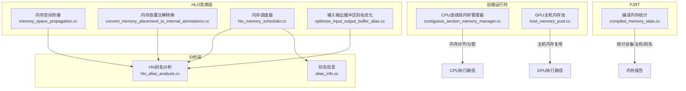
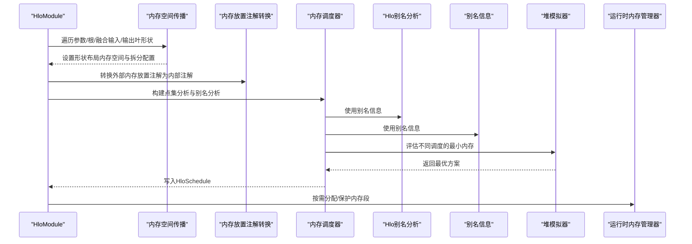
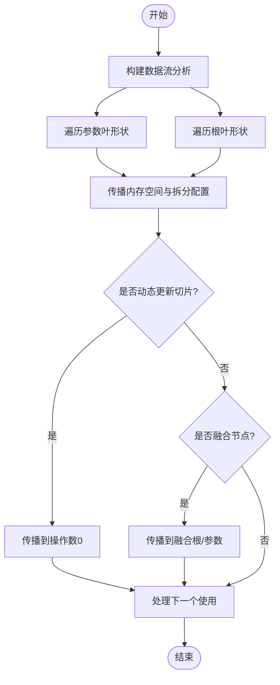
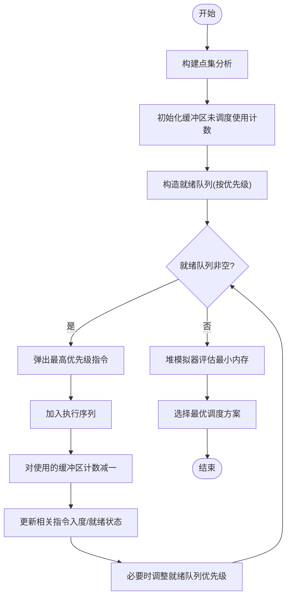
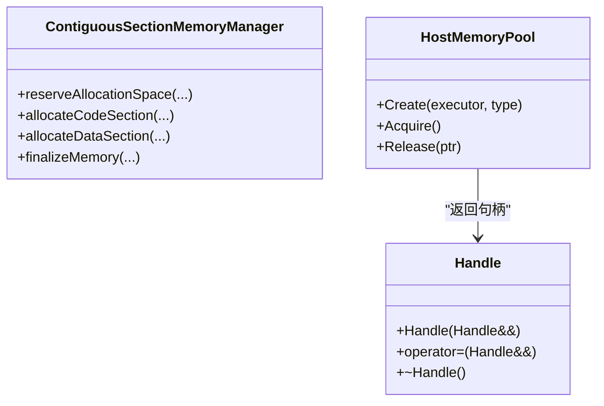
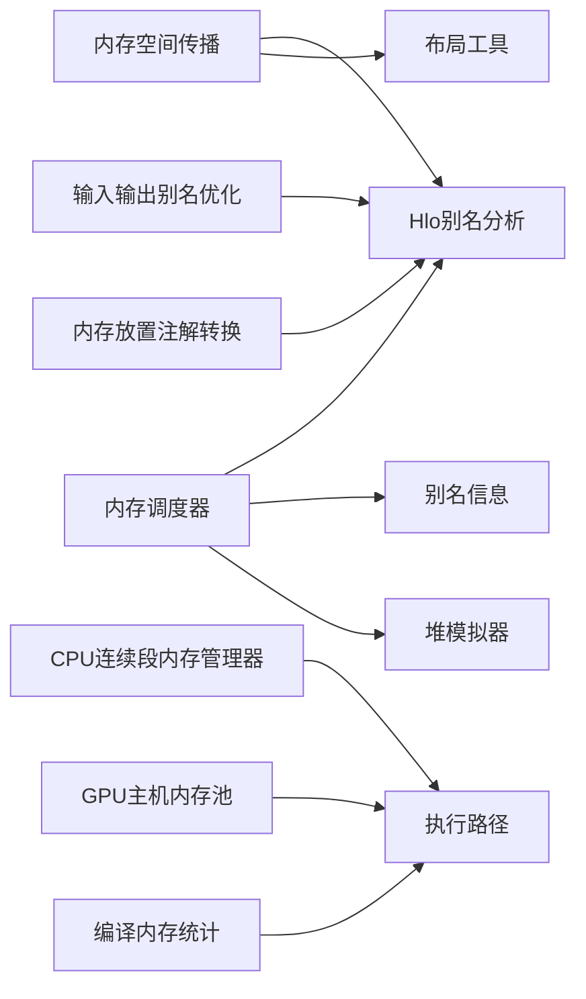

# 内存优化

<cite>
**本文引用的文件**
- [xla/hlo/transforms/memory_space_propagation.cc](file://xla/hlo/transforms/memory_space_propagation.cc)
- [xla/hlo/transforms/simplifiers/hlo_memory_scheduler.cc](file://xla/hlo/transforms/simplifiers/hlo_memory_scheduler.cc)
- [xla/hlo/transforms/convert_memory_placement_to_internal_annotations.cc](file://xla/hlo/transforms/convert_memory_placement_to_internal_annotations.cc)
- [xla/backends/cpu/codegen/contiguous_section_memory_manager.cc](file://xla/backends/cpu/codegen/contiguous_section_memory_manager.cc)
- [xla/pjrt/compiled_memory_stats.cc](file://xla/pjrt/compiled_memory_stats.cc)
- [xla/backends/gpu/runtime/host_memory_pool.cc](file://xla/backends/gpu/runtime/host_memory_pool.cc)
- [xla/hlo/analysis/hlo_alias_analysis.cc](file://xla/hlo/analysis/hlo_alias_analysis.cc)
- [xla/hlo/analysis/alias_info.cc](file://xla/hlo/analysis/alias_info.cc)
- [xla/hlo/transforms/simplifiers/optimize_input_output_buffer_alias.cc](file://xla/hlo/transforms/simplifiers/optimize_input_output_buffer_alias.cc)
- [xla/service/heap_simulator/heap_simulator.h](file://xla/service/heap_simulator/heap_simulator.h)
</cite>

## 目录
1. [简介](#简介)
2. [项目结构](#项目结构)
3. [核心组件](#核心组件)
4. [架构总览](#架构总览)
5. [详细组件分析](#详细组件分析)
6. [依赖关系分析](#依赖关系分析)
7. [性能考量](#性能考量)
8. [故障排查指南](#故障排查指南)
9. [结论](#结论)
10. [附录](#附录)

## 简介
本文件系统性阐述XLA在HLO（High-Level Optimizer）层面的内存优化机制与实现，重点覆盖以下方面：
- 内存空间传播算法：确保形状布局中的内存空间一致性，避免跨内存域的数据不一致。
- 缓冲区分配策略：通过点集分析与别名分析，识别可复用与可别名的缓冲区，降低峰值内存占用。
- 复制消除技术：基于别名信息与输入输出别名配置，消除不必要的拷贝与临时缓冲区。
- 生命周期调度：以贪心列表调度为核心，结合点集分析与堆模拟器估算峰值内存，指导指令执行顺序。
- 内存布局与池化：CPU侧连续段内存管理器与GPU主机内存池，提升内存分配效率与对齐。

本文件同时提供HLO优化前后的示意流程与图示，帮助读者理解内存优化如何减少设备内存占用并提升访问效率，以及对后续代码生成的影响。

## 项目结构
围绕内存优化的关键代码主要分布在如下模块：
- HLO变换层：内存空间传播、内存放置注解转换、内存调度与别名优化。
- 分析层：别名分析、点集分析、别名信息维护。
- 后端运行时：CPU连续段内存管理器、GPU主机内存池。
- PJRT：编译后内存统计，区分设备/主机、参数/输出/临时与别名缓冲区。

**图表来源**
- [xla/hlo/transforms/memory_space_propagation.cc](file://xla/hlo/transforms/memory_space_propagation.cc#L37-L106)
- [xla/hlo/transforms/simplifiers/hlo_memory_scheduler.cc](file://xla/hlo/transforms/simplifiers/hlo_memory_scheduler.cc#L400-L423)
- [xla/hlo/transforms/convert_memory_placement_to_internal_annotations.cc](file://xla/hlo/transforms/convert_memory_placement_to_internal_annotations.cc#L113-L129)
- [xla/hlo/transforms/simplifiers/optimize_input_output_buffer_alias.cc](file://xla/hlo/transforms/simplifiers/optimize_input_output_buffer_alias.cc)
- [xla/hlo/analysis/hlo_alias_analysis.cc](file://xla/hlo/analysis/hlo_alias_analysis.cc)
- [xla/hlo/analysis/alias_info.cc](file://xla/hlo/analysis/alias_info.cc)
- [xla/backends/cpu/codegen/contiguous_section_memory_manager.cc](file://xla/backends/cpu/codegen/contiguous_section_memory_manager.cc#L57-L114)
- [xla/backends/gpu/runtime/host_memory_pool.cc](file://xla/backends/gpu/runtime/host_memory_pool.cc#L35-L55)
- [xla/pjrt/compiled_memory_stats.cc](file://xla/pjrt/compiled_memory_stats.cc#L34-L99)

**章节来源**
- [xla/hlo/transforms/memory_space_propagation.cc](file://xla/hlo/transforms/memory_space_propagation.cc#L37-L106)
- [xla/hlo/transforms/simplifiers/hlo_memory_scheduler.cc](file://xla/hlo/transforms/simplifiers/hlo_memory_scheduler.cc#L400-L423)
- [xla/hlo/transforms/convert_memory_placement_to_internal_annotations.cc](file://xla/hlo/transforms/convert_memory_placement_to_internal_annotations.cc#L113-L129)
- [xla/backends/cpu/codegen/contiguous_section_memory_manager.cc](file://xla/backends/cpu/codegen/contiguous_section_memory_manager.cc#L57-L114)
- [xla/backends/gpu/runtime/host_memory_pool.cc](file://xla/backends/gpu/runtime/host_memory_pool.cc#L35-L55)
- [xla/pjrt/compiled_memory_stats.cc](file://xla/pjrt/compiled_memory_stats.cc#L34-L99)

## 核心组件
- 内存空间传播（Memory Space Propagation）
  - 在模块内构建数据流分析，遍历参数、根节点、融合输入/输出等叶形状，将源形状的内存空间与拆分配置传播到目标形状布局，保证一致性。
  - 支持动态更新切片、融合嵌套场景下的跨层级传播。
- 内存调度器（Memory Scheduler）
  - 基于点集分析与别名分析，采用贪心列表调度优先释放大缓冲区并定义小输出的指令序列，最小化峰值内存。
  - 提供DFS/BFS/后序等多种备选调度策略，并通过堆模拟器评估不同方案的最小内存需求。
- 输入输出缓冲区别名优化（Optimize Input/Output Buffer Alias）
  - 利用输入输出别名配置，将参数直接作为输出返回或复用中间缓冲区，消除复制。
- 内存放置注解转换（Convert Memory Placement to Internal Annotations）
  - 将前端自定义调用上的外部内存放置注解转换为内部注解，驱动后续传输或放置逻辑。
- 运行时内存管理
  - CPU连续段内存管理器：按代码/只读/读写段连续分配，支持最终保护与缓存失效。
  - GPU主机内存池：固定大小环形空闲链表，复用主机侧临时缓冲区，降低频繁分配开销。
- 编译后内存统计（Compiled Memory Stats）
  - 从分配集合中重新计算设备/主机、参数/输出/临时与别名的内存统计，区分可别名区域。

**章节来源**
- [xla/hlo/transforms/memory_space_propagation.cc](file://xla/hlo/transforms/memory_space_propagation.cc#L37-L106)
- [xla/hlo/transforms/simplifiers/hlo_memory_scheduler.cc](file://xla/hlo/transforms/simplifiers/hlo_memory_scheduler.cc#L558-L625)
- [xla/hlo/transforms/simplifiers/optimize_input_output_buffer_alias.cc](file://xla/hlo/transforms/simplifiers/optimize_input_output_buffer_alias.cc)
- [xla/hlo/transforms/convert_memory_placement_to_internal_annotations.cc](file://xla/hlo/transforms/convert_memory_placement_to_internal_annotations.cc#L113-L129)
- [xla/backends/cpu/codegen/contiguous_section_memory_manager.cc](file://xla/backends/cpu/codegen/contiguous_section_memory_manager.cc#L57-L114)
- [xla/backends/gpu/runtime/host_memory_pool.cc](file://xla/backends/gpu/runtime/host_memory_pool.cc#L35-L55)
- [xla/pjrt/compiled_memory_stats.cc](file://xla/pjrt/compiled_memory_stats.cc#L34-L99)

## 架构总览
下图展示了从HLO模块到执行路径的内存优化关键通路：内存空间传播与放置注解转换确保布局一致性；内存调度器与别名分析共同决定指令顺序与缓冲区复用；运行时内存管理器负责对齐与分配；编译后统计汇总设备/主机内存使用情况。

**图表来源**
- [xla/hlo/transforms/memory_space_propagation.cc](file://xla/hlo/transforms/memory_space_propagation.cc#L37-L106)
- [xla/hlo/transforms/convert_memory_placement_to_internal_annotations.cc](file://xla/hlo/transforms/convert_memory_placement_to_internal_annotations.cc#L113-L129)
- [xla/hlo/transforms/simplifiers/hlo_memory_scheduler.cc](file://xla/hlo/transforms/simplifiers/hlo_memory_scheduler.cc#L400-L423)
- [xla/service/heap_simulator/heap_simulator.h](file://xla/service/heap_simulator/heap_simulator.h)

## 详细组件分析

### 组件A：内存空间传播（Memory Space Propagation）
- 目标：在HLO形状布局中传播内存空间与拆分配置，确保参数、根节点、融合输入/输出之间的布局一致。
- 关键流程
  - 构建数据流分析，遍历每个计算的参数与根形状的叶形状索引。
  - 对融合计算，遍历融合参数与融合表达式根的叶形状。
  - 递归传播：遇到动态更新切片、融合根/参数、嵌套融合时，向上/向下传播至调用者/被调用者。
  - 更新目标形状布局的内存空间与拆分配置，若发生变化则标记修改。
- 复杂度与优化
  - 时间复杂度近似与值集与使用边数量线性相关；通过访问集合避免重复传播。
  - 与布局工具协作，保持拆分配置一致性，减少后续布局错误。

**图表来源**
- [xla/hlo/transforms/memory_space_propagation.cc](file://xla/hlo/transforms/memory_space_propagation.cc#L37-L106)
- [xla/hlo/transforms/memory_space_propagation.cc](file://xla/hlo/transforms/memory_space_propagation.cc#L108-L184)

**章节来源**
- [xla/hlo/transforms/memory_space_propagation.cc](file://xla/hlo/transforms/memory_space_propagation.cc#L37-L106)
- [xla/hlo/transforms/memory_space_propagation.cc](file://xla/hlo/transforms/memory_space_propagation.cc#L108-L184)

### 组件B：内存调度器（Memory Scheduler）
- 目标：通过贪心列表调度最小化峰值内存，结合点集分析与堆模拟器评估不同序列。
- 关键流程
  - 构建点集分析映射每个指令使用的逻辑缓冲区集合。
  - 计算每个逻辑缓冲区尚未调度的使用次数，统计“调度后可释放字节数”与“用户数量”作为优先级。
  - 处理特殊指令（如入/出站）以改善通信与I/O时间窗口。
  - 通过堆模拟器评估模块级最小内存需求，选择最优调度方案。
- 数据结构与复杂度
  - 使用多映射按优先级组织就绪队列，O(logN)插入/删除。
  - 通过一次拓扑扫描与增量更新，整体接近线性复杂度。

**图表来源**
- [xla/hlo/transforms/simplifiers/hlo_memory_scheduler.cc](file://xla/hlo/transforms/simplifiers/hlo_memory_scheduler.cc#L558-L625)
- [xla/hlo/transforms/simplifiers/hlo_memory_scheduler.cc](file://xla/hlo/transforms/simplifiers/hlo_memory_scheduler.cc#L400-L423)

**章节来源**
- [xla/hlo/transforms/simplifiers/hlo_memory_scheduler.cc](file://xla/hlo/transforms/simplifiers/hlo_memory_scheduler.cc#L558-L625)
- [xla/hlo/transforms/simplifiers/hlo_memory_scheduler.cc](file://xla/hlo/transforms/simplifiers/hlo_memory_scheduler.cc#L400-L423)

### 组件C：输入输出缓冲区别名优化（Optimize Input/Output Buffer Alias）
- 目标：通过输入输出别名配置，使某些运算直接复用参数或中间缓冲区，避免复制。
- 实现要点
  - 读取模块级输入输出别名配置，识别可别名的参数与输出。
  - 在满足数据依赖与生命周期约束的前提下，替换使用关系，减少临时缓冲区与拷贝。
- 影响
  - 显著降低峰值内存与带宽占用，尤其在大模型与长序列任务中收益明显。

**章节来源**
- [xla/hlo/transforms/simplifiers/optimize_input_output_buffer_alias.cc](file://xla/hlo/transforms/simplifiers/optimize_input_output_buffer_alias.cc)

### 组件D：内存放置注解转换（Convert Memory Placement to Internal Annotations）
- 目标：将前端自定义调用上的外部内存放置注解转换为内部注解，便于后续传输或放置逻辑处理。
- 关键流程
  - 遍历非融合计算中的指令，识别具有外部内存放置注解的自定义调用。
  - 根据注解类型映射到对应的内部自定义调用目标，替换使用并移除原指令。
- 效果
  - 统一注解语义，简化后续传输与放置决策。

**章节来源**
- [xla/hlo/transforms/convert_memory_placement_to_internal_annotations.cc](file://xla/hlo/transforms/convert_memory_placement_to_internal_annotations.cc#L113-L129)

### 组件E：运行时内存管理
- CPU连续段内存管理器
  - 按页对齐预留代码/只读/读写段空间，统一分配后分别设置保护属性，最后进行指令缓存失效。
  - 适合JIT代码生成与运行时内存布局。
- GPU主机内存池
  - 固定大小的主机内存块，内部维护元素指针队列，支持句柄式借用与自动归还，降低频繁分配成本。

**图表来源**
- [xla/backends/cpu/codegen/contiguous_section_memory_manager.cc](file://xla/backends/cpu/codegen/contiguous_section_memory_manager.cc#L57-L114)
- [xla/backends/gpu/runtime/host_memory_pool.cc](file://xla/backends/gpu/runtime/host_memory_pool.cc#L35-L55)

**章节来源**
- [xla/backends/cpu/codegen/contiguous_section_memory_manager.cc](file://xla/backends/cpu/codegen/contiguous_section_memory_manager.cc#L57-L114)
- [xla/backends/gpu/runtime/host_memory_pool.cc](file://xla/backends/gpu/runtime/host_memory_pool.cc#L35-L55)

### 组件F：编译后内存统计（Compiled Memory Stats）
- 目标：从分配集合中重新计算设备/主机、参数/输出/临时与别名的内存统计，区分可别名区域。
- 关键逻辑
  - 遍历所有分配，校验默认着色行为（颜色=内存空间），累加各类尺寸。
  - 区分参数（含别名）、输出、预分配临时缓冲区的设备/主机用量。
- 应用
  - 为性能分析与资源规划提供准确的内存视图，辅助定位内存热点。

**章节来源**
- [xla/pjrt/compiled_memory_stats.cc](file://xla/pjrt/compiled_memory_stats.cc#L34-L99)

## 依赖关系分析
- 内存空间传播依赖数据流分析与布局工具，确保形状布局一致性。
- 内存调度器依赖点集分析与别名分析，结合堆模拟器评估不同调度方案。
- 输入输出缓冲区别名优化依赖模块级别名配置与别名信息。
- 运行时内存管理器与编译后统计分别服务于执行期分配与编译期统计。

**图表来源**
- [xla/hlo/transforms/memory_space_propagation.cc](file://xla/hlo/transforms/memory_space_propagation.cc#L37-L106)
- [xla/hlo/transforms/simplifiers/hlo_memory_scheduler.cc](file://xla/hlo/transforms/simplifiers/hlo_memory_scheduler.cc#L400-L423)
- [xla/hlo/transforms/simplifiers/optimize_input_output_buffer_alias.cc](file://xla/hlo/transforms/simplifiers/optimize_input_output_buffer_alias.cc)
- [xla/hlo/transforms/convert_memory_placement_to_internal_annotations.cc](file://xla/hlo/transforms/convert_memory_placement_to_internal_annotations.cc#L113-L129)
- [xla/backends/cpu/codegen/contiguous_section_memory_manager.cc](file://xla/backends/cpu/codegen/contiguous_section_memory_manager.cc#L57-L114)
- [xla/backends/gpu/runtime/host_memory_pool.cc](file://xla/backends/gpu/runtime/host_memory_pool.cc#L35-L55)
- [xla/pjrt/compiled_memory_stats.cc](file://xla/pjrt/compiled_memory_stats.cc#L34-L99)

**章节来源**
- [xla/hlo/transforms/memory_space_propagation.cc](file://xla/hlo/transforms/memory_space_propagation.cc#L37-L106)
- [xla/hlo/transforms/simplifiers/hlo_memory_scheduler.cc](file://xla/hlo/transforms/simplifiers/hlo_memory_scheduler.cc#L400-L423)
- [xla/hlo/transforms/simplifiers/optimize_input_output_buffer_alias.cc](file://xla/hlo/transforms/simplifiers/optimize_input_output_buffer_alias.cc)
- [xla/hlo/transforms/convert_memory_placement_to_internal_annotations.cc](file://xla/hlo/transforms/convert_memory_placement_to_internal_annotations.cc#L113-L129)
- [xla/backends/cpu/codegen/contiguous_section_memory_manager.cc](file://xla/backends/cpu/codegen/contiguous_section_memory_manager.cc#L57-L114)
- [xla/backends/gpu/runtime/host_memory_pool.cc](file://xla/backends/gpu/runtime/host_memory_pool.cc#L35-L55)
- [xla/pjrt/compiled_memory_stats.cc](file://xla/pjrt/compiled_memory_stats.cc#L34-L99)

## 性能考量
- 内存空间传播
  - 通过布局一致性避免跨内存域访问带来的额外拷贝与同步。
  - 在融合嵌套场景中正确传播，减少布局不一致导致的回退与重排。
- 内存调度
  - 贪心列表调度优先释放大缓冲区，显著降低峰值内存；对入/出站指令的特殊处理改善I/O时间窗。
  - 多策略对比（DFS/后序/列表）与堆模拟器评估，选择更优序列。
- 别名与复制消除
  - 输入输出别名与参数别名可直接复用缓冲区，减少临时分配与带宽压力。
- 运行时内存管理
  - CPU连续段内存管理器按段分配与保护，减少碎片与保护开销。
  - GPU主机内存池通过固定块与句柄借用，降低频繁分配与锁竞争。

[本节为通用性能讨论，无需列出具体文件来源]

## 故障排查指南
- 内存空间传播后布局不一致
  - 检查融合嵌套层级的传播是否完整，确认动态更新切片与融合根/参数的传播路径。
  - 参考：内存空间传播实现与递归传播逻辑。
- 峰值内存过高
  - 检查是否存在大量标量指令未聚合成寄存器使用；确认列表调度是否启用且策略选择合理。
  - 参考：内存调度器的优先级与堆模拟器评估。
- 参数/输出未别名
  - 检查输入输出别名配置是否正确，确认别名信息与别名分析结果。
  - 参考：输入输出缓冲区别名优化与别名分析。
- 运行时分配失败
  - CPU：检查连续段预留空间与对齐要求；确认最终保护与缓存失效步骤。
  - GPU：检查主机内存池容量与并发借用上限。
  - 参考：CPU连续段内存管理器与GPU主机内存池。

**章节来源**
- [xla/hlo/transforms/memory_space_propagation.cc](file://xla/hlo/transforms/memory_space_propagation.cc#L108-L184)
- [xla/hlo/transforms/simplifiers/hlo_memory_scheduler.cc](file://xla/hlo/transforms/simplifiers/hlo_memory_scheduler.cc#L558-L625)
- [xla/hlo/transforms/simplifiers/optimize_input_output_buffer_alias.cc](file://xla/hlo/transforms/simplifiers/optimize_input_output_buffer_alias.cc)
- [xla/backends/cpu/codegen/contiguous_section_memory_manager.cc](file://xla/backends/cpu/codegen/contiguous_section_memory_manager.cc#L57-L114)
- [xla/backends/gpu/runtime/host_memory_pool.cc](file://xla/backends/gpu/runtime/host_memory_pool.cc#L35-L55)

## 结论
XLA在HLO层面通过内存空间传播、内存调度、别名分析与输入输出缓冲区别名优化，形成一套完整的内存优化体系。配合运行时内存管理器与编译后统计，能够在不牺牲正确性的前提下显著降低设备内存占用、减少带宽压力并提升执行效率。对于后续代码生成，这些优化直接影响缓冲区分配、布局与指令顺序，从而提升整体吞吐与稳定性。

[本节为总结性内容，无需列出具体文件来源]

## 附录
- HLO示例：内存优化前后对比（概念性说明）
  - 优化前：存在多个临时缓冲区与复制，峰值内存高，访问模式分散。
  - 优化后：通过内存空间传播统一布局，通过内存调度最小化峰值，通过别名消除复制，访问模式更局部化。
- 关键算法实现路径
  - 内存空间传播：见“内存空间传播”章节。
  - 内存调度：见“内存调度器”章节。
  - 别名分析与信息：见“分析层”文件。
  - 运行时内存管理：见“运行时内存管理”章节。
  - 编译后统计：见“编译后内存统计”章节。

[本节为概念性说明，无需列出具体文件来源]