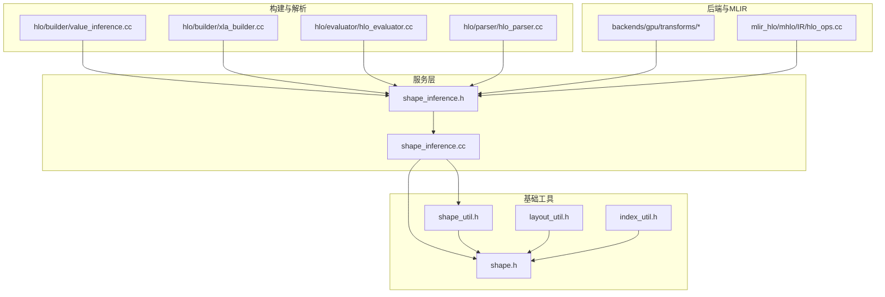
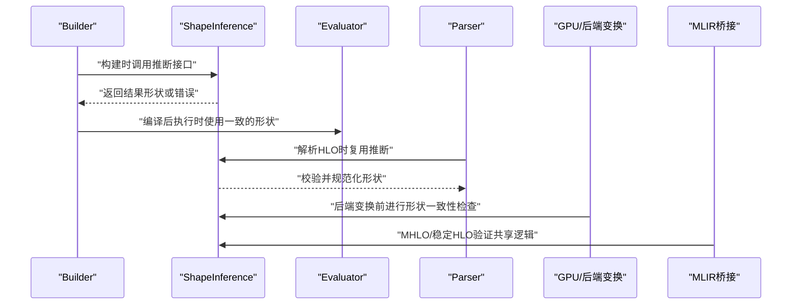
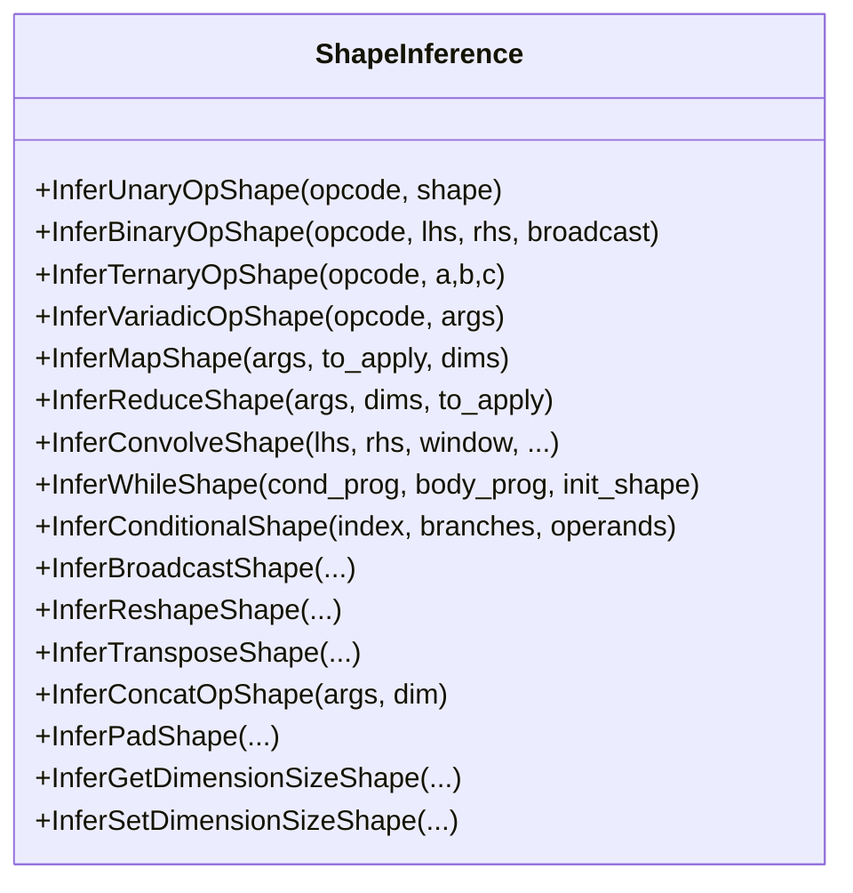
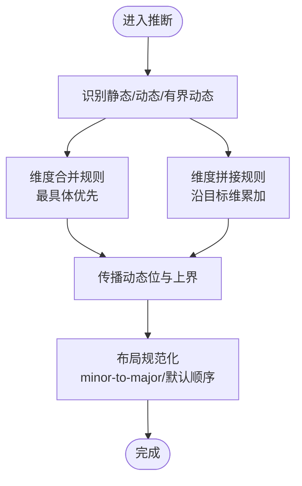
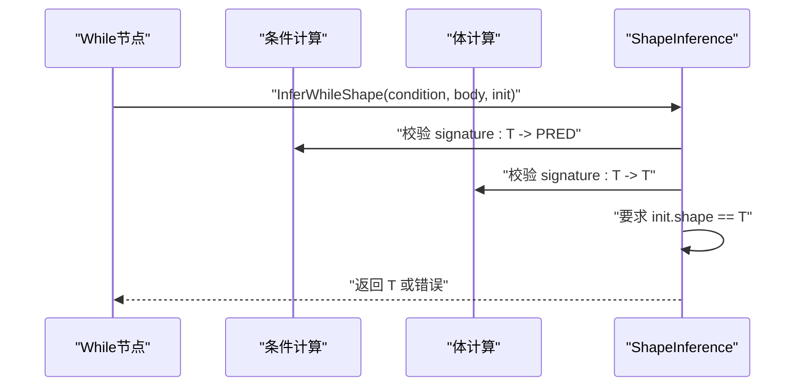
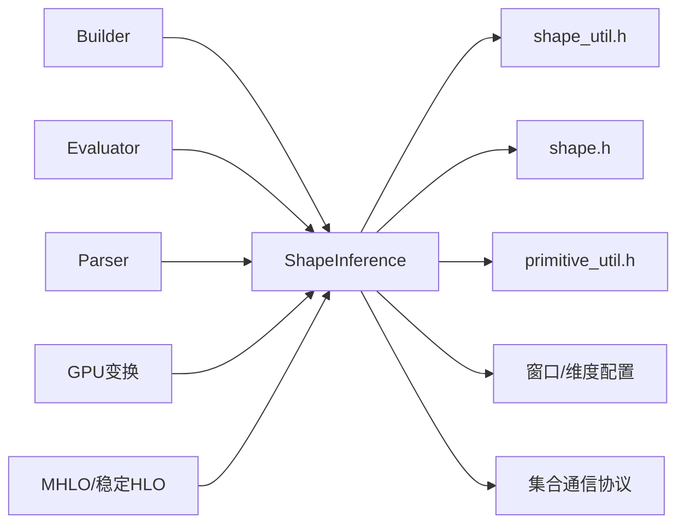

# 形状分析

<cite>
**本文引用的文件**
- [xla/service/shape_inference.h](file://xla/service/shape_inference.h)
- [xla/service/shape_inference.cc](file://xla/service/shape_inference.cc)
- [xla/shape.h](file://xla/shape.h)
- [xla/shape_util.h](file://xla/shape_util.h)
- [xla/layout_util.h](file://xla/layout_util.h)
- [xla/index_util.h](file://xla/index_util.h)
- [xla/hlo/builder/value_inference.cc](file://xla/hlo/builder/value_inference.cc)
- [xla/hlo/builder/xla_builder.cc](file://xla/hlo/builder/xla_builder.cc)
- [xla/hlo/evaluator/hlo_evaluator.cc](file://xla/hlo/evaluator/hlo_evaluator.cc)
- [xla/hlo/parser/hlo_parser.cc](file://xla/hlo/parser/hlo_parser.cc)
- [xla/backends/gpu/transforms/block_scaling_rewriter.cc](file://xla/backends/gpu/transforms/block_scaling_rewriter.cc)
- [xla/backends/gpu/transforms/conv_kind_assignment_test.cc](file://xla/backends/gpu/transforms/conv_kind_assignment_test.cc)
- [xla/backends/gpu/transforms/conv_padding_legalization.cc](file://xla/backends/gpu/transforms/conv_padding_legalization.cc)
- [xla/backends/gpu/transforms/conv_rewriter_test.cc](file://xla/backends/gpu/transforms/conv_rewriter_test.cc)
- [xla/backends/gpu/transforms/windowed_einsum_handler.cc](file://xla/backends/gpu/transforms/windowed_einsum_handler.cc)
- [xla/mlir_hlo/mhlo/IR/hlo_ops.cc](file://xla/mlir_hlo/mhlo/IR/hlo_ops.cc)
- [docs/shapes.md](file://docs/shapes.md)
</cite>

## 目录
1. [引言](#引言)
2. [项目结构](#项目结构)
3. [核心组件](#核心组件)
4. [架构总览](#架构总览)
5. [详细组件分析](#详细组件分析)
6. [依赖分析](#依赖分析)
7. [性能考虑](#性能考虑)
8. [故障排查指南](#故障排查指南)
9. [结论](#结论)
10. [附录](#附录)

## 引言
本文件系统化阐述XLA中HLO模块的形状分析与验证机制，覆盖静态形状推断、动态维度推断、布局规范化，以及复杂形状依赖关系（while循环、条件分支、动态操作）的处理方式。文档还总结了约束求解、可达性分析与形状一致性检查等关键技术，并说明形状分析如何支撑后续优化与代码生成，最后给出具体HLO示例以演示推断流程与常见错误诊断。

## 项目结构
围绕形状分析的关键代码主要分布在以下位置：
- 服务层形状推理接口与实现：xla/service/shape_inference.h/.cc
- 形状与布局工具：xla/shape.h、xla/shape_util.h、xla/layout_util.h、xla/index_util.h
- 构建期与运行期集成点：xla/hlo/builder、xla/hlo/evaluator、xla/hlo/parser
- 后端与MLIR桥接：xla/backends/gpu/transforms、xla/mlir_hlo/mhlo/IR

**图示来源**
- [xla/service/shape_inference.h](file://xla/service/shape_inference.h#L46-L450)
- [xla/service/shape_inference.cc](file://xla/service/shape_inference.cc#L1-L120)
- [xla/shape_util.h](file://xla/shape_util.h)
- [xla/shape.h](file://xla/shape.h)
- [xla/layout_util.h](file://xla/layout_util.h)
- [xla/index_util.h](file://xla/index_util.h)
- [xla/hlo/builder/value_inference.cc](file://xla/hlo/builder/value_inference.cc#L246-L260)
- [xla/hlo/builder/xla_builder.cc](file://xla/hlo/builder/xla_builder.cc#L4400-L4420)
- [xla/hlo/evaluator/hlo_evaluator.cc](file://xla/hlo/evaluator/hlo_evaluator.cc#L70-L80)
- [xla/hlo/parser/hlo_parser.cc](file://xla/hlo/parser/hlo_parser.cc#L70-L90)
- [xla/backends/gpu/transforms/block_scaling_rewriter.cc](file://xla/backends/gpu/transforms/block_scaling_rewriter.cc#L40-L50)
- [xla/mlir_hlo/mhlo/IR/hlo_ops.cc](file://xla/mlir_hlo/mhlo/IR/hlo_ops.cc#L1960-L1980)

**章节来源**
- [xla/service/shape_inference.h](file://xla/service/shape_inference.h#L46-L450)
- [xla/service/shape_inference.cc](file://xla/service/shape_inference.cc#L1-L120)
- [docs/shapes.md](file://docs/shapes.md#L1-L205)

## 核心组件
- 形状推理器（ShapeInference）
  - 提供统一的静态形状推断入口，覆盖一元/二元/三元/变参算子、映射/归约/窗口化、卷积/FFT/cholesky/triangular_solve、集合通信、切片/动态切片/更新、广播/reshape/transpose/连接、选择/裁剪/TopK、Get/SetDimensionSize等。
  - 支持动态维度与有界动态维度的推断规则，包含维度合并与拼接的“最具体”规则。
- 形状与布局工具
  - 形状构造、校验、比较、元素类型变更、动态位标记等。
  - 布局minor-to-major与索引转换工具，支持线性索引与多维索引互转。
- 构建期与解析期集成
  - Builder在构建阶段调用形状推理进行合法性检查；Evaluator与Parser在运行期/解析期复用相同推理逻辑保障一致性。

**章节来源**
- [xla/service/shape_inference.h](file://xla/service/shape_inference.h#L46-L450)
- [xla/service/shape_inference.cc](file://xla/service/shape_inference.cc#L331-L472)
- [xla/shape_util.h](file://xla/shape_util.h)
- [xla/layout_util.h](file://xla/layout_util.h)
- [xla/index_util.h](file://xla/index_util.h)
- [xla/hlo/builder/xla_builder.cc](file://xla/hlo/builder/xla_builder.cc#L4400-L4420)
- [xla/hlo/evaluator/hlo_evaluator.cc](file://xla/hlo/evaluator/hlo_evaluator.cc#L70-L80)
- [xla/hlo/parser/hlo_parser.cc](file://xla/hlo/parser/hlo_parser.cc#L70-L90)

## 架构总览
形状分析贯穿XLA生命周期：构建期（Builder）、解析期（Parser）、执行期（Evaluator），并被后端变换与MLIR桥接所复用。其核心是ShapeInference类对各类HLO操作的静态推断与一致性校验。

**图示来源**
- [xla/hlo/builder/xla_builder.cc](file://xla/hlo/builder/xla_builder.cc#L4400-L4420)
- [xla/hlo/evaluator/hlo_evaluator.cc](file://xla/hlo/evaluator/hlo_evaluator.cc#L70-L80)
- [xla/hlo/parser/hlo_parser.cc](file://xla/hlo/parser/hlo_parser.cc#L70-L90)
- [xla/backends/gpu/transforms/block_scaling_rewriter.cc](file://xla/backends/gpu/transforms/block_scaling_rewriter.cc#L40-L50)
- [xla/mlir_hlo/mhlo/IR/hlo_ops.cc](file://xla/mlir_hlo/mhlo/IR/hlo_ops.cc#L1960-L1980)

## 详细组件分析

### 组件A：形状推理器（ShapeInference）
- 职责
  - 静态形状推断：根据输入形状与操作语义推导输出形状。
  - 动态维度处理：支持静态大小、无界动态、有界动态的组合与传播。
  - 约束校验：确保广播、归约、窗口、连接、集合通信等满足维度兼容性。
- 关键算法
  - 维度合并（最具体规则）：在维度相等或存在上界时，推断出最具体的尺寸与上界。
  - 维度拼接（加法规则）：沿拼接维将各输入尺寸累加，同时传播动态属性。
  - 广播规则：支持标量广播、退化维度广播、InDim广播等。
  - while/conditional：要求计算签名匹配，初始化形状在循环体内保持不变。
- 错误处理
  - 对非法元素类型、负步幅/窗口、不兼容维度、越界维度等直接返回错误状态。

**图示来源**
- [xla/service/shape_inference.h](file://xla/service/shape_inference.h#L46-L450)

**章节来源**
- [xla/service/shape_inference.h](file://xla/service/shape_inference.h#L46-L450)
- [xla/service/shape_inference.cc](file://xla/service/shape_inference.cc#L331-L472)
- [xla/service/shape_inference.cc](file://xla/service/shape_inference.cc#L497-L589)
- [xla/service/shape_inference.cc](file://xla/service/shape_inference.cc#L789-L805)

### 组件B：动态维度推断与布局规范化
- 动态维度
  - 支持静态大小、无界动态（?）、有界动态（<=B）三种形态。
  - 拼接与合并遵循“最具体”与“加法”规则，保证在形状树上可传播且一致。
- 布局规范化
  - 默认major-to-minor顺序；minor-to-major定义内存访问模式。
  - 提供索引工具在多维索引与线性索引间转换，确保内存布局与形状一致。

**图示来源**
- [xla/service/shape_inference.cc](file://xla/service/shape_inference.cc#L242-L327)
- [xla/service/shape_inference.cc](file://xla/service/shape_inference.cc#L548-L589)
- [xla/layout_util.h](file://xla/layout_util.h)
- [xla/index_util.h](file://xla/index_util.h)

**章节来源**
- [xla/service/shape_inference.cc](file://xla/service/shape_inference.cc#L242-L327)
- [xla/service/shape_inference.cc](file://xla/service/shape_inference.cc#L548-L589)
- [xla/layout_util.h](file://xla/layout_util.h)
- [xla/index_util.h](file://xla/index_util.h)

### 组件C：复杂形状依赖关系处理
- while循环
  - 条件计算：T -> PRED；体计算：T -> T；初始化：init = T。
  - 推断要求：T在体计算前后一致，否则报错。
- 条件分支
  - 分支操作数与分支计算签名需一致，最终形状由各分支形状“最具体”合并得到。
- 动态操作
  - 动态切片/更新/reshape：起始索引与新维度大小作为形状参与推断，保持与静态版本一致的兼容性规则。

**图示来源**
- [xla/service/shape_inference.h](file://xla/service/shape_inference.h#L271-L278)
- [xla/service/shape_inference.cc](file://xla/service/shape_inference.cc#L331-L472)

**章节来源**
- [xla/service/shape_inference.h](file://xla/service/shape_inference.h#L271-L278)
- [xla/service/shape_inference.cc](file://xla/service/shape_inference.cc#L331-L472)

### 组件D：约束求解与可达性分析
- 约束求解
  - 在拼接/合并/广播等场景下，通过维度规则形成线性/非线性约束，利用“最具体”与“加法”规则求解。
- 可达性分析
  - 在条件分支与循环中，结合控制流图进行形状传播，确保不可达路径不影响活跃形状推断。
- 形状一致性检查
  - 在集合通信、卷积、窗口化等复杂算子中，严格校验维度数量、收缩/批维一致性与布局兼容性。

**章节来源**
- [xla/service/shape_inference.cc](file://xla/service/shape_inference.cc#L242-L327)
- [xla/service/shape_inference.cc](file://xla/service/shape_inference.cc#L497-L589)
- [xla/service/shape_inference.cc](file://xla/service/shape_inference.cc#L789-L805)

### 组件E：与优化与代码生成的协同
- 形状驱动的优化
  - 形状一致性是融合、重排、布局提升、集合通信分解的前提。
  - 后端变换（如GPU重写）在变换前调用形状推理进行合法性检查。
- 代码生成
  - 形状与布局决定内存布局、索引计算与向量化策略，推理结果直接影响内核参数与调度。

**章节来源**
- [xla/backends/gpu/transforms/block_scaling_rewriter.cc](file://xla/backends/gpu/transforms/block_scaling_rewriter.cc#L40-L50)
- [xla/backends/gpu/transforms/conv_padding_legalization.cc](file://xla/backends/gpu/transforms/conv_padding_legalization.cc#L30-L40)
- [xla/backends/gpu/transforms/windowed_einsum_handler.cc](file://xla/backends/gpu/transforms/windowed_einsum_handler.cc#L45-L55)
- [xla/mlir_hlo/mhlo/IR/hlo_ops.cc](file://xla/mlir_hlo/mhlo/IR/hlo_ops.cc#L1960-L1980)

## 依赖分析
- 内聚与耦合
  - ShapeInference高度内聚于HLO语义，对外仅暴露静态推断接口，内部通过shape_util与primitive_util进行形状/类型操作。
- 外部依赖
  - 与HLO IR、窗口/稀疏配置、集合通信协议等强耦合。
- 集成点
  - Builder/Evaluator/Parser/后端变换/MLIR均依赖同一套推理逻辑，保证跨阶段一致性。

**图示来源**
- [xla/service/shape_inference.h](file://xla/service/shape_inference.h#L27-L33)
- [xla/service/shape_inference.cc](file://xla/service/shape_inference.cc#L16-L53)
- [xla/hlo/builder/xla_builder.cc](file://xla/hlo/builder/xla_builder.cc#L4400-L4420)
- [xla/hlo/evaluator/hlo_evaluator.cc](file://xla/hlo/evaluator/hlo_evaluator.cc#L70-L80)
- [xla/hlo/parser/hlo_parser.cc](file://xla/hlo/parser/hlo_parser.cc#L70-L90)
- [xla/backends/gpu/transforms/block_scaling_rewriter.cc](file://xla/backends/gpu/transforms/block_scaling_rewriter.cc#L40-L50)
- [xla/mlir_hlo/mhlo/IR/hlo_ops.cc](file://xla/mlir_hlo/mhlo/IR/hlo_ops.cc#L1960-L1980)

**章节来源**
- [xla/service/shape_inference.h](file://xla/service/shape_inference.h#L27-L33)
- [xla/service/shape_inference.cc](file://xla/service/shape_inference.cc#L16-L53)

## 性能考虑
- 推断复杂度
  - 大多数操作为O(N)维度遍历；集合通信与卷积可能受窗口/分组/稀疏配置影响。
- 缓存与复用
  - 在Builder与Evaluator中避免重复推断，尽量复用已验证的形状。
- 动态维度的代价
  - 有界动态与无界动态会增加传播与校验开销，应尽量在前端稳定化。

## 故障排查指南
- 常见错误类型
  - 元素类型不匹配：如对非浮点执行需要浮点的操作。
  - 维度不兼容：广播/拼接/归约/窗口化等违反维度规则。
  - 负步幅/非正窗口：窗口参数非法。
  - while/conditional签名不匹配：T与PRED不符或初始化形状不一致。
- 定位建议
  - 从最近的调用点回溯到Builder/Evaluator/Parser，确认输入形状与属性。
  - 使用文档中的形状语法与布局说明核对HLO文本表示。

**章节来源**
- [xla/service/shape_inference.cc](file://xla/service/shape_inference.cc#L78-L84)
- [xla/service/shape_inference.cc](file://xla/service/shape_inference.cc#L185-L235)
- [xla/service/shape_inference.h](file://xla/service/shape_inference.h#L271-L278)
- [docs/shapes.md](file://docs/shapes.md#L1-L205)

## 结论
XLA的形状分析以ShapeInference为核心，通过静态推断、动态维度处理与布局规范化，确保HLO在构建、解析与执行全生命周期内的形状一致性。该机制为融合、布局优化与后端变换奠定基础，并通过统一的约束求解与可达性分析应对复杂控制流与数据流。建议在工程实践中充分利用形状信息指导优化与代码生成，同时在前端尽早稳定动态维度以降低运行期成本。

## 附录

### 示例：形状推断流程与错误诊断
- 示例1：二元广播
  - 输入：两个形状，其中一方为标量或退化维度。
  - 步骤：应用广播规则，若维度不兼容则报错；否则返回合并后的最具体形状。
  - 参考接口：[InferBinaryOpShape](file://xla/service/shape_inference.h#L62-L69)
- 示例2：while循环
  - 输入：条件计算签名、体计算签名、初始形状。
  - 步骤：校验签名匹配；要求初始化形状与体输出形状一致；否则报错。
  - 参考接口：[InferWhileShape](file://xla/service/shape_inference.h#L271-L278)
- 示例3：动态切片
  - 输入：操作数形状、起始索引形状、切片大小。
  - 步骤：校验索引与切片大小的形状兼容性；若越界或维度不匹配则报错。
  - 参考接口：[InferDynamicSliceShape](file://xla/service/shape_inference.h#L251-L256)
- 示例4：布局与索引
  - 输入：形状与布局minor-to-major。
  - 步骤：使用索引工具在多维与线性索引间转换；若布局非法则报错。
  - 参考工具：[layout_util.h](file://xla/layout_util.h)、[index_util.h](file://xla/index_util.h)

**章节来源**
- [xla/service/shape_inference.h](file://xla/service/shape_inference.h#L62-L69)
- [xla/service/shape_inference.h](file://xla/service/shape_inference.h#L271-L278)
- [xla/service/shape_inference.h](file://xla/service/shape_inference.h#L251-L256)
- [xla/layout_util.h](file://xla/layout_util.h)
- [xla/index_util.h](file://xla/index_util.h)