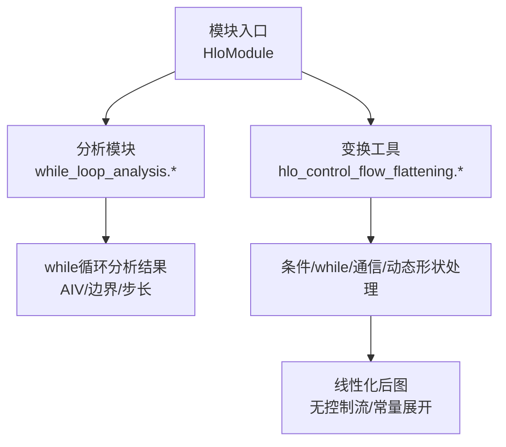
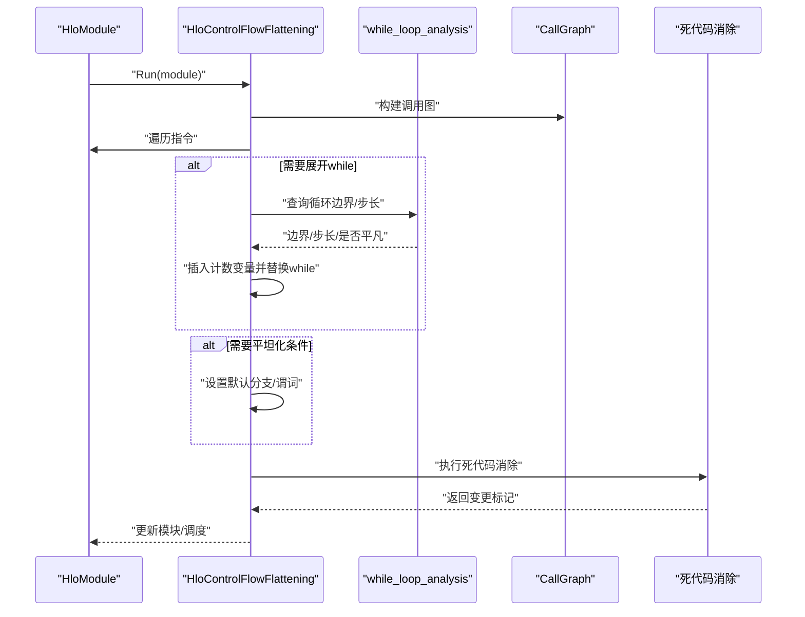
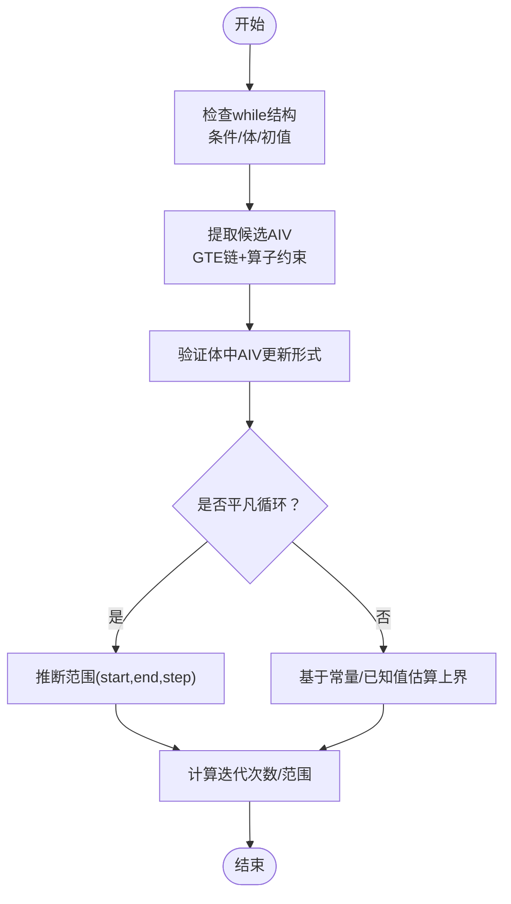
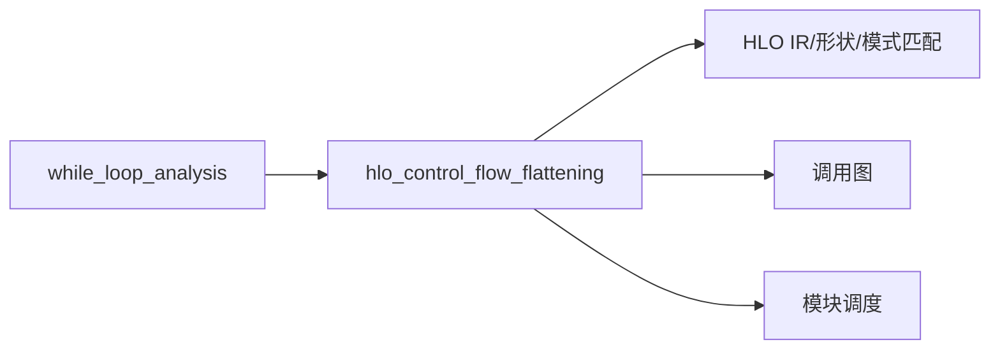

# 控制流变换

<cite>
**本文引用的文件**
- [while_loop_analysis.h](file://xla/hlo/analysis/while_loop_analysis.h)
- [while_loop_analysis.cc](file://xla/hlo/analysis/while_loop_analysis.cc)
- [hlo_control_flow_flattening.h](file://xla/tools/hlo_control_flow_flattening.h)
- [hlo_control_flow_flattening.cc](file://xla/tools/hlo_control_flow_flattening.cc)
- [README.md](file://xla/README.md)
</cite>

## 目录
1. [引言](#引言)
2. [项目结构](#项目结构)
3. [核心组件](#核心组件)
4. [架构总览](#架构总览)
5. [详细组件分析](#详细组件分析)
6. [依赖关系分析](#依赖关系分析)
7. [性能考量](#性能考量)
8. [故障排查指南](#故障排查指南)
9. [结论](#结论)
10. [附录](#附录)

## 引言
本文件系统性阐述XLA中针对HLO（高性能语言优化器）的控制流变换技术与实现，重点覆盖以下主题：
- 条件语句转换：将条件分支固定到默认分支或给定谓词，便于后续优化与测试。
- while循环展开与调度线性化：通过引入显式迭代计数变量，将受限的while循环转换为等价的线性执行序列，从而消除运行时分支。
- 控制流图分析：识别辅助归纳变量（AIV）、确定循环边界与步长、判定可展开性与安全性。
- 变换安全性验证：在变换前后保持程序行为一致，避免副作用丢失与数据竞争。
- 关键算法细节：条件展开策略、循环展开阈值与调度优化方法。
- 性能影响与示例：给出变换前后的控制流结构示意，并讨论典型性能收益。

本说明面向不同背景读者，既提供高层概念，也包含代码级分析与可视化图表。

## 项目结构
XLA的控制流变换主要分布在如下位置：
- 分析与模式匹配：xla/hlo/analysis/while_loop_analysis.*
- 控制流平坦化工具：xla/tools/hlo_control_flow_flattening.*



**图表来源**
- [README.md](file://xla/README.md#L19-L56)

**章节来源**
- [README.md](file://xla/README.md#L19-L56)

## 核心组件
- while循环分析（while_loop_analysis）
  - 提供静态归纳变量识别、循环边界与步长推断、辅助归纳变量（AIV）提取、以及“平凡循环”模式匹配等能力。
  - 支持基于模式匹配与编译期求值的安全上界估计，用于后续展开决策。
- 控制流平坦化（hlo_control_flow_flattening）
  - 将while循环替换为带上限的线性执行序列；将条件分支固定到默认分支；移除或替换通信与主机传输操作；处理动态形状布局。
  - 提供选项控制展开次数、最大外层循环与单次循环上限，确保可控的性能与稳定性。

**章节来源**
- [while_loop_analysis.h](file://xla/hlo/analysis/while_loop_analysis.h#L30-L82)
- [hlo_control_flow_flattening.h](file://xla/tools/hlo_control_flow_flattening.h#L36-L151)

## 架构总览
下图展示了从输入HLO模块到平坦化输出的整体流程，以及与分析模块的交互。



**图表来源**
- [hlo_control_flow_flattening.cc](file://xla/tools/hlo_control_flow_flattening.cc#L487-L602)
- [while_loop_analysis.cc](file://xla/hlo/analysis/while_loop_analysis.cc#L566-L757)

**章节来源**
- [hlo_control_flow_flattening.cc](file://xla/tools/hlo_control_flow_flattening.cc#L487-L602)
- [while_loop_analysis.cc](file://xla/hlo/analysis/while_loop_analysis.cc#L566-L757)

## 详细组件分析

### while循环分析（while_loop_analysis）
该模块负责在编译期对while循环进行结构性与数值性分析，以支撑后续的展开与线性化。

- 归纳变量与AIV识别
  - 通过遍历while体参数的抽取与插入点，结合可达性图限制边类型，筛选满足特定算子链（加减乘除、GTE）的候选归纳变量。
  - 过滤掉仅依赖不变量的GTE，避免将非递增变量误判为AIV。
- 循环边界与步长推断
  - 对平凡循环（初始值为常量标量、步长为正整数常量、比较为LT/LE/GT/GE之一）进行范围匹配，返回起始、结束与步长三元组。
  - 若无法直接匹配，尝试基于条件表达式的常量端与已知值集合进行保守上界估计。
- 静态迭代次数估计
  - 提供精确迭代次数与上界估计接口，支持暴力求值上限参数，兼顾模式匹配与穷举评估的权衡。



**图表来源**
- [while_loop_analysis.cc](file://xla/hlo/analysis/while_loop_analysis.cc#L274-L399)
- [while_loop_analysis.cc](file://xla/hlo/analysis/while_loop_analysis.cc#L566-L757)

**章节来源**
- [while_loop_analysis.h](file://xla/hlo/analysis/while_loop_analysis.h#L30-L82)
- [while_loop_analysis.cc](file://xla/hlo/analysis/while_loop_analysis.cc#L274-L399)
- [while_loop_analysis.cc](file://xla/hlo/analysis/while_loop_analysis.cc#L566-L757)

### 控制流平坦化（hlo_control_flow_flattening）
该工具将复杂的控制流转换为线性执行序列，便于后续优化与代码生成。

- while循环平坦化
  - 在while条件与体中分别注入一个“计数变量”，条件改为“计数 < 上限”，体中每次将计数+1。
  - 上限由多种策略确定：直接从比较常量提取、结合调用图的外层循环上限、以及用户配置的最大值。
  - 替换完成后，原while的tuple形状扩展，其非GTE用户被重写为仅保留前缀元素，保证语义等价。
- 条件分支平坦化
  - 将predicated条件与indexed条件统一替换为固定分支/索引，使用默认分支或指定谓词，确保确定性执行路径。
- 通信与主机传输处理
  - 将infeed/outfeed、send/recv、collective等操作替换为无副作用或带副作用的自定义调用，避免在离线/测试场景中产生阻塞或跨设备依赖。
- 动态形状处理
  - 可选地将入口布局的动态形状转为静态形状，配合上界假设，简化后续形状推理与内存分配。

```mermaid
sequenceDiagram
participant W as "while指令"
participant C as "条件计算"
participant B as "循环体计算"
participant U as "用户指令"
W->>C : "注入计数变量并替换根为比较"
W->>B : "在体中每次将计数+1"
W->>U : "扩展tuple形状并重写非GTE用户"
Note over W,C,B : "保持初值/步长/边界不变的等价性"
```

**图表来源**
- [hlo_control_flow_flattening.cc](file://xla/tools/hlo_control_flow_flattening.cc#L150-L267)

**章节来源**
- [hlo_control_flow_flattening.h](file://xla/tools/hlo_control_flow_flattening.h#L36-L151)
- [hlo_control_flow_flattening.cc](file://xla/tools/hlo_control_flow_flattening.cc#L150-L267)

### 关键变换算法细节
- 条件展开策略
  - 默认分支选择：predicated条件使用用户提供的布尔值；indexed条件使用最后一个分支作为默认索引。
  - 为避免DCE删除关键操作，若分支操作唯一使用者为条件，则包装为带副作用的自定义调用。
- 循环展开阈值
  - 上限来源：比较常量、外层循环上限、用户配置的最大值三者取最小。
  - 外层循环上限：通过调用图向上追溯，若当前while不在嵌套循环内且超过外层上限，则按外层上限截断。
- 调度优化
  - 变换后可能改变指令顺序，工具会更新模块调度，确保线性化后的执行顺序与变换前一致。

**章节来源**
- [hlo_control_flow_flattening.cc](file://xla/tools/hlo_control_flow_flattening.cc#L109-L148)
- [hlo_control_flow_flattening.cc](file://xla/tools/hlo_control_flow_flattening.cc#L487-L602)

### 程序行为保持与安全性
- 语义等价性
  - while平坦化通过显式计数变量与等价的比较条件，确保迭代次数与终止条件不变。
  - 条件平坦化通过固定分支索引/谓词，消除运行时分支不确定性。
- 副作用与可见性
  - 通信与主机传输被替换为自定义调用，必要时设置副作用标志，防止DCE误删。
- 死代码消除
  - 变换后立即执行DCE，清理不再使用的中间节点，减少冗余。

**章节来源**
- [hlo_control_flow_flattening.cc](file://xla/tools/hlo_control_flow_flattening.cc#L269-L423)
- [hlo_control_flow_flattening.cc](file://xla/tools/hlo_control_flow_flattening.cc#L592-L602)

## 依赖关系分析
- 模块耦合
  - while_loop_analysis与hlo_control_flow_flattening之间存在弱耦合：前者提供静态分析结果，后者据此决定展开策略与阈值。
  - 两者均依赖HLO IR与形状系统、模式匹配框架、以及调用图构建。
- 外部依赖
  - 通信与收集操作的处理依赖后端特定的自定义调用目标与调度信息。
  - 动态形状处理依赖模块配置中的入口布局信息。



**图表来源**
- [hlo_control_flow_flattening.cc](file://xla/tools/hlo_control_flow_flattening.cc#L487-L602)
- [while_loop_analysis.cc](file://xla/hlo/analysis/while_loop_analysis.cc#L566-L757)

**章节来源**
- [hlo_control_flow_flattening.cc](file://xla/tools/hlo_control_flow_flattening.cc#L487-L602)
- [while_loop_analysis.cc](file://xla/hlo/analysis/while_loop_analysis.cc#L566-L757)

## 性能考量
- 展开收益
  - 消除运行时分支与条件判断，提升指令级并行与流水线效率。
  - 便于进一步融合、向量化与寄存器分配。
- 展开代价
  - 展开规模过大可能导致指令膨胀与寄存器压力上升。
  - 阈值设置需平衡性能与资源占用。
- 典型优化链
  - 平坦化 → 死代码消除 → 形状/布局规范化 → 融合/向量化 → 寄存器分配/调度。

[本节为通用指导，不直接分析具体文件]

## 故障排查指南
- while无法展开
  - 检查是否为平凡循环：初始值、步长、比较方向是否满足要求。
  - 使用上界估计接口确认是否可安全展开。
- 条件分支导致不可预期路径
  - 确认是否启用条件平坦化，默认分支/谓词是否符合预期。
- 通信/主机传输阻塞
  - 确认是否启用了通信移除与主机传输替换；必要时设置副作用标志。
- 调度异常
  - 变换后自动更新调度；若仍异常，检查模块是否包含异步计算或复杂调度约束。

**章节来源**
- [hlo_control_flow_flattening.cc](file://xla/tools/hlo_control_flow_flattening.cc#L269-L423)
- [hlo_control_flow_flattening.cc](file://xla/tools/hlo_control_flow_flattening.cc#L592-L602)

## 结论
XLA的控制流变换通过“编译期分析 + 线性化替换”的组合，将复杂的HLO控制流转化为易于优化与代码生成的形式。while_loop_analysis提供可靠的静态分析能力，hlo_control_flow_flattening则在保证语义等价的前提下，将条件与循环转换为确定性的线性序列，并处理通信与动态形状等复杂场景。合理设置展开阈值与默认策略，可在性能与资源占用之间取得良好平衡。

[本节为总结性内容，不直接分析具体文件]

## 附录
- 示例说明（概念性）
  - 变换前：while循环，条件为“i < N”，体中“i += C”，初始i=K。
  - 变换后：引入计数变量count，条件改为“count < 上限”，体中“count += 1”，保持i的更新逻辑不变。
  - 条件分支：predicated条件固定为“true/false”，indexed条件固定为“最后一个分支”。

[本节为概念性说明，不直接分析具体文件]