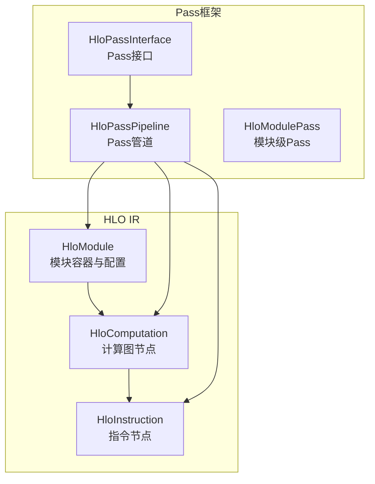
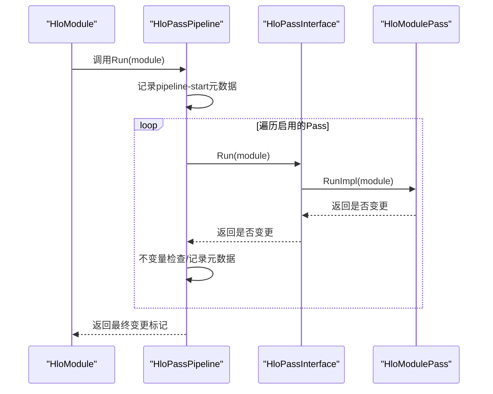
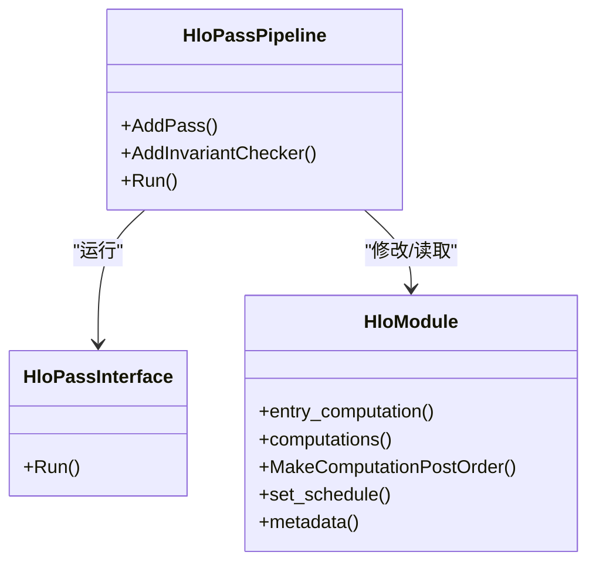

# 目标无关优化阶段

<cite>
**本文引用的文件**
- [hlo_module.h](file://xla/hlo/ir/hlo_module.h)
- [hlo_module.cc](file://xla/hlo/ir/hlo_module.cc)
- [hlo_pass_interface.cc](file://xla/hlo/pass/hlo_pass_interface.cc)
- [hlo_pass_pipeline.cc](file://xla/hlo/pass/hlo_pass_pipeline.cc)
- [hlo_pass_pipeline_test.cc](file://xla/hlo/pass/hlo_pass_pipeline_test.cc)
- [hlo_pass_pipeline.h](file://xla/hlo/pass/hlo_pass_pipeline.h)
- [hlo_pass_fix_test.cc](file://xla/hlo/pass/hlo_pass_fix_test.cc)
- [hlo_pass_pipeline_test.cc](file://xla/hlo/pass/hlo_pass_pipeline_test.cc)
- [hlo_pass_pipeline_test.h](file://xla/hlo/pass/hlo_pass_pipeline_test.h)
- [hlo_pass_pipeline_test_utils.h](file://xla/hlo/pass/hlo_pass_pipeline_test_utils.h)
- [hlo_pass_pipeline_test_utils.cc](file://xla/hlo/pass/hlo_pass_pipeline_test_utils.cc)
- [hlo_pass_pipeline_test_utils_test.cc](file://xla/hlo/pass/hlo_pass_pipeline_test_utils_test.cc)
- [hlo_pass_pipeline_test_utils_test.h](file://xla/hlo/pass/hlo_pass_pipeline_test_utils_test.h)
- [hlo_pass_pipeline_test_utils_test.cc](file://xla/hlo/pass/hlo_pass_pipeline_test_utils_test.cc)
- [hlo_pass_pipeline_test_utils_test.h](file://xla/hlo/pass/hlo_pass_pipeline_test_utils_test.h)
- [hlo_pass_pipeline_test_utils_test.cc](file://xla/hlo/pass/hlo_pass_pipeline_test_utils_test.cc)
- [hlo_pass_pipeline_test_utils_test.h](file://xla/hlo/pass/hlo_pass_pipeline_test_utils_test.h)
- [hlo_pass_pipeline_test_utils_test.cc](file://xla/hlo/pass/hlo_pass_pipeline_test_utils_test.cc)
- [hlo_pass_pipeline_test_utils_test.h](file://xla/hlo/pass/hlo_pass_pipeline_test_utils_test.h)
- [hlo_pass_pipeline_test_utils_test.cc](file://xla/hlo/pass/hlo_pass_pipeline_test_utils_test.cc)
- [hlo_pass_pipeline_test_utils_test.h](file://xla/hlo/pass/hlo_pass_pipeline_test_utils_test.h)
- [hlo_pass_pipeline_test_utils_test.cc](file://xla/hlo/pass/hlo_pass_pipeline_test_utils_test.cc)
- [hlo_pass_pipeline_test_utils_test.h](file://xla/hlo/pass/hlo_pass_pipeline_test_utils_test.h)
- [hlo_pass_pipeline_test_utils_test.cc](file://xla/hlo/pass/hlo_pass_pipeline_test_utils_test.cc)
- [hlo_pass_pipeline_test_utils_test.h](file://xla/hlo/pass/hlo_pass_pipeline_test_utils_test.h)
- [hlo_pass_pipeline_test_utils_test.cc](file://xla/hlo/pass/hlo_pass_pipeline_test_utils_test.cc)
- [hlo_pass_pipeline_test_utils_test.h](file://xla/hlo/pass/hlo_pass_pipeline_test_utils_test.h)
- [hlo_pass_pipeline_test_utils_test.cc](file://xla/hlo/pass/hlo_pass_pipeline_test_utils_test.cc)
- [hlo_pass_pipeline_test_utils_test.h](file://xla/hlo/pass/hlo_pass_pipeline_test_utils_test.h)
- [hlo_pass_pipeline_test_utils_test.cc](file://xla/hlo/pass/hlo_pass_pipeline_test_utils_test.cc)
- [hlo_pass_pipeline_test_utils_test.h](file://xla/hlo/pass/hlo_pass_pipeline_test_utils_test.h)
- [hlo_pass_pipeline_test_utils_test.cc](file://xla/hlo/pass/hlo_pass_pipeline_test......)
</cite>

## 目录
1. [引言](#引言)
2. [项目结构](#项目结构)
3. [核心组件](#核心组件)
4. [架构总览](#架构总览)
5. [详细组件分析](#详细组件分析)
6. [依赖关系分析](#依赖关系分析)
7. [性能考量](#性能考量)
8. [故障排查指南](#故障排查指南)
9. [结论](#结论)
10. [附录](#附录)

## 引言
本文件聚焦于XLA编译流水线的第一个阶段：目标无关优化（Target-Independent Optimization）。该阶段以HLO（High-Level Optimizer）计算图为输入，执行一系列与具体硬件无关的全局优化，包括但不限于：
- 计算图标准化与布局规范化
- 公共子表达式消除（CSE）
- 操作融合（Fusion）
- 内存空间分配与别名分析
- 形状推断与布局推导
- 控制流与数据流的规范化（如while循环展开、条件语句转换）

同时，文档系统性阐述HLO Pass管道的工作机制，包括简化器（Simplifier）、变换器（Transformer）与分析器（Analyzer）的组合使用方式，并给出关键优化算法的实现要点与流程图示，帮助读者理解如何在不依赖具体硬件的前提下完成全局优化，为后续目标特定优化奠定坚实基础。

## 项目结构
围绕目标无关优化阶段，本仓库的关键代码主要分布在以下模块：
- HLO IR与模块管理：提供HloModule、HloComputation、HloInstruction等核心数据结构与生命周期管理
- HLO Pass框架：定义Pass接口、管道调度、元数据记录与调试支持
- 测试与验证：通过单元测试验证Pass行为、不变量检查与执行线程过滤

图表来源
- [hlo_module.h](file://xla/hlo/ir/hlo_module.h#L94-L210)
- [hlo_pass_interface.cc](file://xla/hlo/pass/hlo_pass_interface.cc#L26-L36)
- [hlo_pass_pipeline.cc](file://xla/hlo/pass/hlo_pass_pipeline.cc#L291-L318)

章节来源
- [hlo_module.h](file://xla/hlo/ir/hlo_module.h#L94-L210)
- [hlo_pass_pipeline.cc](file://xla/hlo/pass/hlo_pass_pipeline.cc#L291-L318)

## 核心组件
- HloModule：顶层编译单元，承载入口计算、嵌入式计算、布局配置、别名配置、调度信息与元数据；提供拓扑排序、克隆、序列化/反序列化等能力
- HloPassInterface/HloPassPipeline：统一的Pass抽象与执行管道，负责按序运行Pass、记录元数据、执行不变量检查、支持调试选项与选择性启用/禁用Pass
- HloModulePass：面向模块的Pass基类，典型用于全局优化（如布局规范化、形状推断、别名分析、控制流规范化）

章节来源
- [hlo_module.h](file://xla/hlo/ir/hlo_module.h#L94-L210)
- [hlo_pass_interface.cc](file://xla/hlo/pass/hlo_pass_interface.cc#L26-L36)
- [hlo_pass_pipeline.cc](file://xla/hlo/pass/hlo_pass_pipeline.cc#L291-L318)

## 架构总览
目标无关优化阶段的总体流程如下：
- 输入：HloModule（包含入口计算与若干嵌入式计算）
- 执行：HloPassPipeline按顺序运行一组HloModulePass
- 输出：经过标准化、融合、别名与形状推断等优化后的HloModule
- 支撑：元数据记录、不变量检查、调试与性能追踪

图表来源
- [hlo_pass_pipeline.cc](file://xla/hlo/pass/hlo_pass_pipeline.cc#L134-L220)
- [hlo_pass_interface.cc](file://xla/hlo/pass/hlo_pass_interface.cc#L26-L36)

章节来源
- [hlo_pass_pipeline.cc](file://xla/hlo/pass/hlo_pass_pipeline.cc#L134-L220)
- [hlo_pass_pipeline_test.cc](file://xla/hlo/pass/hlo_pass_pipeline_test.cc#L136-L177)

## 详细组件分析

### HloModule：模块与计算图的组织者
- 角色与职责
  - 管理入口计算与嵌入式计算，维护拓扑排序与删除队列
  - 提供布局规范化回调、别名与缓冲区捐赠配置
  - 支持克隆、序列化/反序列化、指纹生成、打印与调试输出
- 关键能力
  - 计算拓扑排序（后序/内容排序），便于稳定遍历
  - 名称与ID唯一化，避免命名冲突
  - 调度设置与校验，确保执行顺序一致性
- 与目标无关优化的关系
  - 作为所有优化Pass的载体，承载优化结果
  - 通过布局规范化回调与别名配置，为后续内存优化提供约束

章节来源
- [hlo_module.h](file://xla/hlo/ir/hlo_module.h#L94-L210)
- [hlo_module.cc](file://xla/hlo/ir/hlo_module.cc#L115-L138)
- [hlo_module.cc](file://xla/hlo/ir/hlo_module.cc#L340-L461)

### HloPassPipeline：Pass管道与调度
- 角色与职责
  - 统一调度一组HloModulePass，按配置启用/禁用特定Pass
  - 在每次Pass前后记录元数据，支持调试与可视化
  - 运行不变量检查，保证Pass正确性
- 关键机制
  - 启用/禁用策略：支持全量禁用、仅启用白名单、或禁用整条管道
  - 变更检测：通过哈希比较与显式返回值双重校验
  - 执行线程过滤：可针对特定execution_thread执行Pass
- 与目标无关优化的关系
  - 将多个独立优化Pass组合为可重复、可观测、可调试的流水线
  - 为后续Pass提供稳定的前置条件（如布局规范化、形状推断）

章节来源
- [hlo_pass_pipeline.cc](file://xla/hlo/pass/hlo_pass_pipeline.cc#L222-L276)
- [hlo_pass_pipeline.cc](file://xla/hlo/pass/hlo_pass_pipeline.cc#L134-L220)
- [hlo_pass_pipeline_test.cc](file://xla/hlo/pass/hlo_pass_pipeline_test.cc#L179-L247)

### HloPassInterface：Pass抽象与统一入口
- 角色与职责
  - 定义Pass通用接口，屏蔽具体实现差异
  - 提供Run方法的统一调用入口，支持模块指针与智能指针两种形式
- 与目标无关优化的关系
  - 为标准化、CSE、融合、别名分析等Pass提供一致的抽象层
  - 便于在管道中插入自定义Pass并参与不变量检查与元数据记录

章节来源
- [hlo_pass_interface.cc](file://xla/hlo/pass/hlo_pass_interface.cc#L26-L36)

### 关键优化算法与实现要点

#### 1) 计算图标准化与布局规范化
- 目标：统一形状布局、参数/输出布局与SPMD分片信息，为后续优化提供一致的语义环境
- 实现要点
  - 通过HloModule的布局规范化回调，结合入口计算的ProgramShape生成标准布局
  - 在模块配置中设置默认/保留布局，确保Pass间布局一致性
- 影响范围：影响所有依赖形状/布局的Pass（如融合、内存分配、向量化）

章节来源
- [hlo_module.h](file://xla/hlo/ir/hlo_module.h#L233-L246)
- [hlo_module.cc](file://xla/hlo/ir/hlo_module.cc#L140-L159)

#### 2) 公共子表达式消除（CSE）
- 目标：识别并合并等价子表达式，减少冗余计算
- 实现要点
  - 基于指令等价性判断（运算符、形状、操作数、属性等）
  - 在计算图中建立等价类映射，替换重复使用
- 影响范围：提升吞吐、降低中间结果存储压力

章节来源
- [hlo_pass_pipeline.cc](file://xla/hlo/pass/hlo_pass_pipeline.cc#L134-L220)

#### 3) 操作融合（Fusion）
- 目标：将多个小操作融合为更高层次的复合操作，减少内存访问与启动开销
- 实现要点
  - 识别可融合的元素级/批量操作序列
  - 保持数据依赖与别名关系不变
  - 通过融合计算图（fusion computation）封装被融合的子图
- 影响范围：显著降低核函数启动次数，提升缓存局部性

章节来源
- [hlo_module.h](file://xla/hlo/ir/hlo_module.h#L246-L274)

#### 4) 内存空间分配与别名分析
- 目标：确定缓冲区分配策略，识别可复用的输入/输出缓冲区，减少内存占用
- 实现要点
  - 使用HloInputOutputAliasConfig与BufferDonorConfig描述别名关系
  - 在Pass中更新别名映射，确保写后读与读写依赖满足
- 影响范围：直接影响内存带宽与峰值占用

章节来源
- [hlo_module.h](file://xla/hlo/ir/hlo_module.h#L615-L635)
- [hlo_module.cc](file://xla/hlo/ir/hlo_module.cc#L156-L158)

#### 5) 形状推断与布局推导
- 目标：在不执行计算的前提下，推导各指令的输出形状与布局
- 实现要点
  - 基于操作语义与输入形状进行静态推导
  - 与布局规范化回调协同，确保布局一致性
- 影响范围：为融合、内存分配与向量化提供必要信息

章节来源
- [hlo_module.h](file://xla/hlo/ir/hlo_module.h#L197-L210)
- [hlo_module.h](file://xla/hlo/ir/hlo_module.h#L233-L246)

#### 6) 控制流规范化：while循环展开与条件语句转换
- 目标：将复杂控制流转换为更易优化的形式（如展开有限迭代、转换为可融合的分支结构）
- 实现要点
  - while循环展开：在已知上界或启发式条件下展开，减少分支与控制开销
  - 条件语句转换：将条件分支转换为广播/混合等价形式，便于后续融合
- 影响范围：改善分支预测与指令级并行

章节来源
- [hlo_pass_pipeline.cc](file://xla/hlo/pass/hlo_pass_pipeline.cc#L134-L220)

### Pass管道工作原理与组合模式
- 简化器（Simplifier）：执行常量折叠、死代码消除、冗余运算删除等
- 变换器（Transformer）：执行形状/布局变换、控制流转换、融合等结构性变化
- 分析器（Analyzer）：收集统计信息、验证不变量、生成元数据
- 组合使用：通过HloPassPipeline将多类Pass有序组合，确保每一步都满足不变量并可回溯

章节来源
- [hlo_pass_pipeline.cc](file://xla/hlo/pass/hlo_pass_pipeline.cc#L77-L99)
- [hlo_pass_pipeline_test.cc](file://xla/hlo/pass/hlo_pass_pipeline_test.cc#L275-L323)

## 依赖关系分析
- HloModule依赖HloComputation与HloInstruction构建完整的计算图
- HloPassPipeline依赖HloPassInterface派生的各类Pass（模块级、计算级、指令级）
- HloPassPipeline与HloModule之间通过元数据与调试选项交互，形成闭环

图表来源
- [hlo_pass_pipeline.cc](file://xla/hlo/pass/hlo_pass_pipeline.cc#L291-L318)
- [hlo_pass_interface.cc](file://xla/hlo/pass/hlo_pass_interface.cc#L26-L36)
- [hlo_module.h](file://xla/hlo/ir/hlo_module.h#L181-L210)

章节来源
- [hlo_pass_pipeline.cc](file://xla/hlo/pass/hlo_pass_pipeline.cc#L291-L318)
- [hlo_pass_interface.cc](file://xla/hlo/pass/hlo_pass_interface.cc#L26-L36)
- [hlo_module.h](file://xla/hlo/ir/hlo_module.h#L181-L210)

## 性能考量
- Pass顺序与组合：合理的Pass顺序可减少重复扫描与多次遍历带来的开销
- 变更检测：通过哈希与显式返回值双重校验，避免无效重跑
- 调试与可视化：启用Pass间HLO转储与元数据记录，有助于定位热点与瓶颈
- 执行线程过滤：仅对需要的execution_thread运行Pass，减少不必要的计算

章节来源
- [hlo_pass_pipeline.cc](file://xla/hlo/pass/hlo_pass_pipeline.cc#L162-L166)
- [hlo_pass_pipeline.cc](file://xla/hlo/pass/hlo_pass_pipeline.cc#L196-L202)
- [hlo_pass_pipeline_test.cc](file://xla/hlo/pass/hlo_pass_pipeline_test.cc#L179-L247)

## 故障排查指南
- 不变量检查失败：若某Pass导致模块违反不变量，管道会记录错误并指出失败的Pass名称与位置
- Pass未报告变更但HLO发生改变：可通过调试选项强制崩溃，定位“静默变更”问题
- Pass报告了变更但HLO未更新：同样可通过调试选项强制崩溃，定位“空变更”问题
- 执行线程相关问题：确认Pass是否正确设置了execution_thread过滤条件

章节来源
- [hlo_pass_pipeline.cc](file://xla/hlo/pass/hlo_pass_pipeline.cc#L77-L99)
- [hlo_pass_pipeline.cc](file://xla/hlo/pass/hlo_pass_pipeline.cc#L106-L130)
- [hlo_pass_pipeline_test.cc](file://xla/hlo/pass/hlo_pass_pipeline_test.cc#L275-L323)
- [hlo_pass_pipeline_test.cc](file://xla/hlo/pass/hlo_pass_pipeline_test.cc#L365-L385)

## 结论
目标无关优化阶段通过HloModule与HloPassPipeline的协作，实现了对HLO计算图的全局标准化、融合、别名与形状推断等优化。该阶段不依赖具体硬件，专注于语义等价的结构性改进，为后续目标特定优化（如向量化、内存布局、设备内核选择）打下坚实基础。借助统一的Pass接口、严格的不变量检查与完善的元数据记录，XLA能够在保证正确性的前提下高效地完成大规模编译优化。

## 附录
- 相关文件路径与用途概览
  - HloModule：模块容器、布局与别名配置、序列化/反序列化
  - HloPassPipeline：Pass调度、元数据记录、不变量检查
  - HloPassInterface：Pass抽象与统一入口
  - 测试文件：验证Pass行为、不变量检查与执行线程过滤

章节来源
- [hlo_module.h](file://xla/hlo/ir/hlo_module.h#L94-L210)
- [hlo_pass_pipeline.cc](file://xla/hlo/pass/hlo_pass_pipeline.cc#L222-L276)
- [hlo_pass_interface.cc](file://xla/hlo/pass/hlo_pass_interface.cc#L26-L36)
- [hlo_pass_pipeline_test.cc](file://xla/hlo/pass/hlo_pass_pipeline_test.cc#L136-L177)