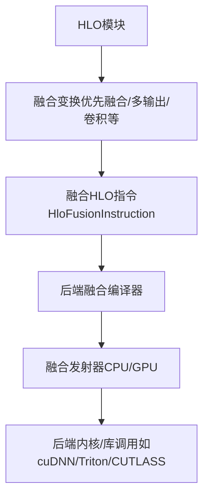
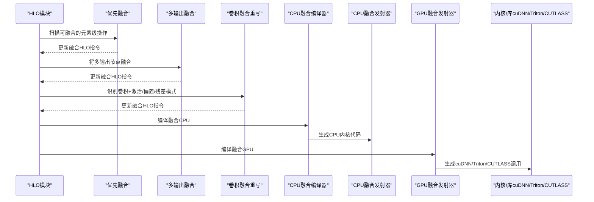
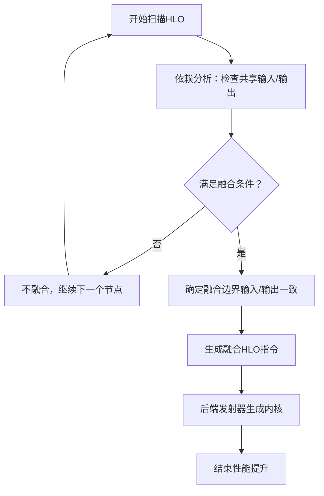
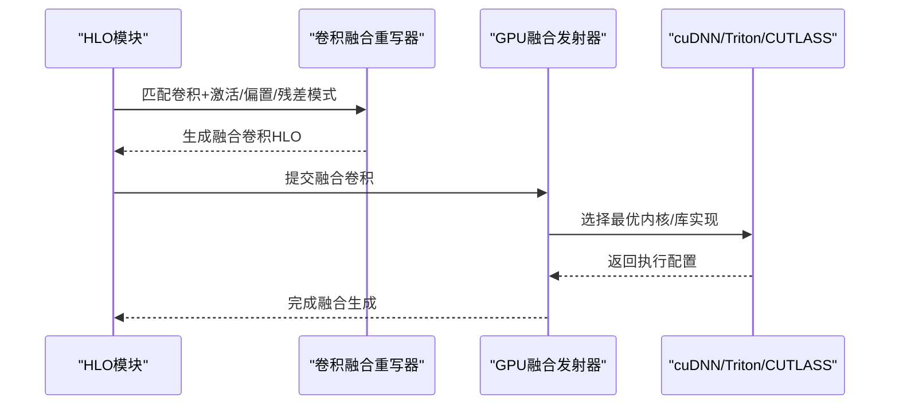
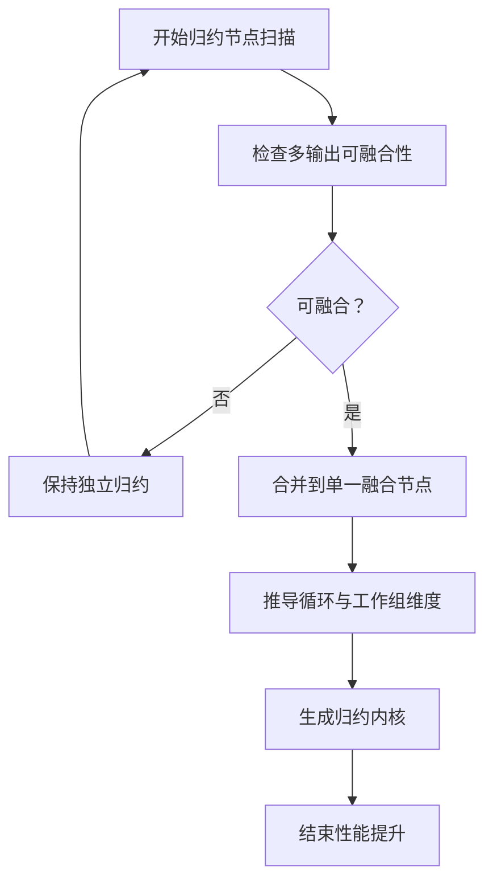
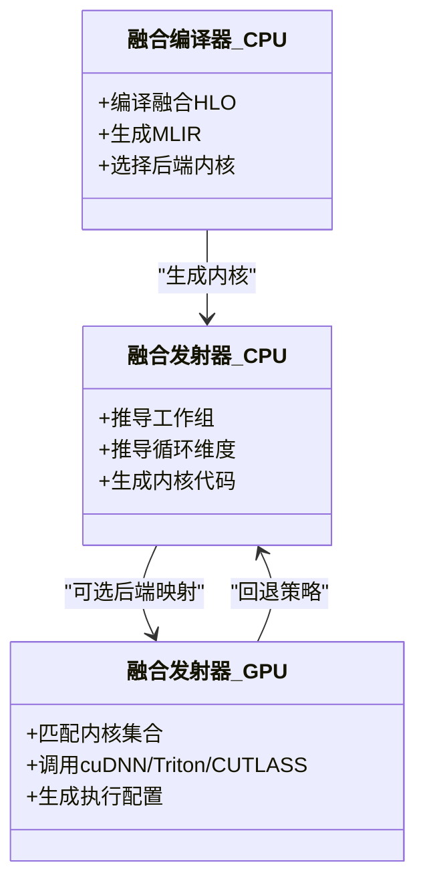
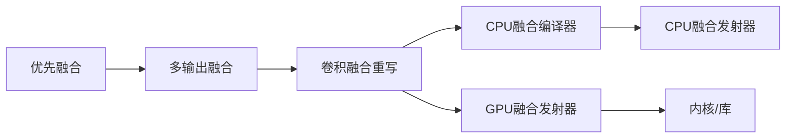

# 融合变换

<cite>
**本文引用的文件**
- [融合编译器（CPU）](file://xla/backends/cpu/codegen/fusion_compiler.cc)
- [融合发射器（CPU）](file://xla/backends/cpu/codegen/fusion_emitter.cc)
- [CPU融合发射器头文件](file://xla/backends/cpu/codegen/emitters/cpu_fusion_emitter.h)
- [CPU融合发射器实现](file://xla/backends/cpu/codegen/emitters/cpu_fusion_emitter.cc)
- [CPU散射发射器](file://xla/backends/cpu/codegen/emitters/cpu_scatter_emitter.cc)
- [GPU融合发射器](file://xla/backends/gpu/codegen/fusion_emitter.cc)
- [GPU融合内核集合](file://xla/backends/gpu/codegen/fusions.cc)
- [GPU自定义核融合](file://xla/backends/gpu/codegen/kernels/custom_kernel_fusion.cc)
- [GPU自定义核融合模式](file://xla/backends/gpu/codegen/kernels/custom_kernel_fusion_pattern.cc)
- [GPU CUTLASS GEMM融合](file://xla/backends/gpu/codegen/kernels/cutlass_gemm_fusion.cc)
- [多输出融合（GPU）](file://xla/backends/gpu/transforms/multi_output_fusion.cc)
- [优先融合（GPU）](file://xla/backends/gpu/transforms/priority_fusion.cc)
- [CNN融合重写器（GPU）](file://xla/backends/gpu/transforms/conv_fusion_rewriter.h)
- [复制融合（GPU）](file://xla/backends/gpu/transforms/copy_fusion.h)
- [GPU融合编译器（GPU）](file://xla/backends/gpu/transforms/cudnn_fusion_compiler.h)
- [GPU动态切片融合重写器](file://xla/backends/gpu/transforms/dynamic_slice_fusion_rewriter.h)
- [HLO到Thunk文档（含融合说明）](file://docs/hlo_to_thunks.md)
- [贡献指南（包含融合管道说明）](file://docs/contributing.md)
- [错误1000文档（TPU预融合重算）](file://docs/errors/error_1000.md)
- [CPU基准测试（融合）](file://xla/backends/cpu/benchmarks/fusion_benchmark_test.cc)
- [CPU基准测试（ynn融合）](file://xla/backends/cpu/benchmarks/ynn_fusion_benchmark_test.cc)
- [GPU内核平铺测试](file://xla/backends/gpu/tests/gpu_kernel_tiling_test.cc)
- [并行归约向量化测试](file://xla/backends/gpu/tests/reduction_vectorization_test.cc)
- [GPU内核复用HLO样例](file://xla/backends/gpu/tests/kernel_reuse.hlo)
</cite>

## 目录
1. [简介](#简介)
2. [项目结构](#项目结构)
3. [核心组件](#核心组件)
4. [架构总览](#架构总览)
5. [详细组件分析](#详细组件分析)
6. [依赖分析](#依赖分析)
7. [性能考量](#性能考量)
8. [故障排查指南](#故障排查指南)
9. [结论](#结论)
10. [附录](#附录)

## 简介
本文件系统性阐述XLA中HLO指令融合的技术与实现，覆盖元素级融合、卷积融合与归约融合三类典型场景。内容从融合算法的模式识别（依赖关系分析、数据流检查）、融合搜索策略与边界检测、到代码生成与后端优化展开，并结合文档与测试样例给出融合前后性能与代码生成差异的参考路径。目标是帮助读者在理解融合原理的同时，掌握在XLA流水线中定位与验证融合变换的方法。

## 项目结构
XLA的融合能力横跨前端HLO表示、中间变换阶段与后端代码生成/运行时三个层面：
- 前端与变换层：HLO模块经由一系列融合相关的变换（如优先融合、多输出融合、卷积融合重写等）进行模式识别与融合图构建。
- 后端代码生成层：融合后的HLO通过融合编译器与发射器生成后端特定的内核或调用序列（CPU/GPU），并在某些后端（如GPU）进一步映射到cuDNN/Triton/CUTLASS等库。
- 文档与测试：官方文档对融合流程有明确说明；基准与测试样例提供了性能与正确性的参考。

**图表来源**
- [HLO到Thunk文档（含融合说明）](file://docs/hlo_to_thunks.md#L90-L120)
- [融合编译器（CPU）](file://xla/backends/cpu/codegen/fusion_compiler.cc#L430-L500)
- [融合发射器（CPU）](file://xla/backends/cpu/codegen/fusion_emitter.cc#L60-L200)
- [GPU融合发射器](file://xla/backends/gpu/codegen/fusion_emitter.cc#L1-L200)

**章节来源**
- [HLO到Thunk文档（含融合说明）](file://docs/hlo_to_thunks.md#L90-L120)

## 核心组件
- 融合变换管线
  - 优先融合：在融合管道中优先尝试将相邻或可共享输入的元素级操作融合，以减少临时缓冲与内存带宽压力。
  - 多输出融合（MOF）：允许将多个输出节点融合到同一内核，提升指令级并行与缓存复用。
  - 卷积融合重写：将激活函数、偏置加法、残差连接等与卷积核融合，减少访存与提高吞吐。
- 融合HLO指令
  - HloFusionInstruction：封装融合子图，承载融合边界、输入/输出布局与属性，供后端发射器使用。
- 后端融合编译器与发射器
  - CPU：融合编译器负责将融合HLO映射到MLIR并生成目标内核；融合发射器负责工作组/循环维度推导与代码生成。
  - GPU：融合发射器与内核集合（fusions.cc）配合，支持cuDNN/Triton/CUTLASS等后端融合策略。

**章节来源**
- [优先融合（GPU）](file://xla/backends/gpu/transforms/priority_fusion.cc#L1-L200)
- [多输出融合（GPU）](file://xla/backends/gpu/transforms/multi_output_fusion.cc#L150-L200)
- [CNN融合重写器（GPU）](file://xla/backends/gpu/transforms/conv_fusion_rewriter.h#L1-L120)
- [融合编译器（CPU）](file://xla/backends/cpu/codegen/fusion_compiler.cc#L430-L500)
- [融合发射器（CPU）](file://xla/backends/cpu/codegen/fusion_emitter.cc#L60-L200)
- [GPU融合发射器](file://xla/backends/gpu/codegen/fusion_emitter.cc#L1-L200)

## 架构总览
下图展示了从HLO模块到后端内核的关键路径，以及融合变换在其中的位置与交互。

**图表来源**
- [HLO到Thunk文档（含融合说明）](file://docs/hlo_to_thunks.md#L90-L120)
- [优先融合（GPU）](file://xla/backends/gpu/transforms/priority_fusion.cc#L1-L200)
- [多输出融合（GPU）](file://xla/backends/gpu/transforms/multi_output_fusion.cc#L150-L200)
- [CNN融合重写器（GPU）](file://xla/backends/gpu/transforms/conv_fusion_rewriter.h#L1-L120)
- [融合编译器（CPU）](file://xla/backends/cpu/codegen/fusion_compiler.cc#L430-L500)
- [融合发射器（CPU）](file://xla/backends/cpu/codegen/fusion_emitter.cc#L60-L200)
- [GPU融合发射器](file://xla/backends/gpu/codegen/fusion_emitter.cc#L1-L200)

## 详细组件分析

### 元素级融合（Element-wise Fusion）
- 模式识别
  - 依赖关系分析：优先融合会检查相邻元素级操作是否共享输入或可被共享输入所驱动，避免重复读取与中间写回。
  - 数据流检查：确保融合不会引入额外的同步点或违反内存访问顺序。
- 边界检测与搜索策略
  - 在融合编译器中，融合边界通常由输入/输出形状、布局与类型一致性决定；搜索策略倾向于最大化共享输入与最小化临时缓冲。
- 代码生成
  - CPU侧通过融合发射器推导工作组与循环维度，生成高效内核；GPU侧则根据内核集合与后端库进行融合。
- 性能收益
  - 减少内存往返与临时缓冲，提升缓存命中率与指令级并行度。

**图表来源**
- [优先融合（GPU）](file://xla/backends/gpu/transforms/priority_fusion.cc#L1-L200)
- [融合编译器（CPU）](file://xla/backends/cpu/codegen/fusion_compiler.cc#L430-L500)
- [融合发射器（CPU）](file://xla/backends/cpu/codegen/fusion_emitter.cc#L60-L200)

**章节来源**
- [优先融合（GPU）](file://xla/backends/gpu/transforms/priority_fusion.cc#L1-L200)
- [融合编译器（CPU）](file://xla/backends/cpu/codegen/fusion_compiler.cc#L430-L500)
- [融合发射器（CPU）](file://xla/backends/cpu/codegen/fusion_emitter.cc#L60-L200)

### 卷积融合（Convolution Fusion）
- 模式识别
  - 卷积融合重写器识别常见的“卷积+激活/偏置/残差”组合，将其合并为单个融合节点，减少访存与算子开销。
- 边界检测与搜索策略
  - 搜索策略关注通道/空间维度的一致性与布局兼容性，确保融合后仍可利用cuDNN/Triton等库的高效实现。
- 代码生成
  - GPU侧融合发射器与内核集合协作，必要时调用cuDNN/Triton/CUTLASS以获得最佳性能。
- 性能收益
  - 减少跨算子的内存拷贝与同步，提升吞吐与能效。

**图表来源**
- [CNN融合重写器（GPU）](file://xla/backends/gpu/transforms/conv_fusion_rewriter.h#L1-L120)
- [GPU融合发射器](file://xla/backends/gpu/codegen/fusion_emitter.cc#L1-L200)
- [GPU融合内核集合](file://xla/backends/gpu/codegen/fusions.cc#L1-L200)

**章节来源**
- [CNN融合重写器（GPU）](file://xla/backends/gpu/transforms/conv_fusion_rewriter.h#L1-L120)
- [GPU融合发射器](file://xla/backends/gpu/codegen/fusion_emitter.cc#L1-L200)
- [GPU融合内核集合](file://xla/backends/gpu/codegen/fusions.cc#L1-L200)

### 归约融合（Reduction Fusion）
- 模式识别
  - 多输出融合（MOF）常用于将多个归约输出融合到同一内核，减少重复归约与内存写回。
- 边界检测与搜索策略
  - 搜索策略需考虑归约轴、数据类型与布局，确保融合后仍满足数值稳定性与并行度要求。
- 代码生成
  - CPU/GPU侧发射器根据融合HLO推导循环与工作组维度，生成高效归约内核。
- 性能收益
  - 降低内存带宽占用与同步成本，提升大规模归约的效率。

**图表来源**
- [多输出融合（GPU）](file://xla/backends/gpu/transforms/multi_output_fusion.cc#L150-L200)
- [融合发射器（CPU）](file://xla/backends/cpu/codegen/fusion_emitter.cc#L120-L190)

**章节来源**
- [多输出融合（GPU）](file://xla/backends/gpu/transforms/multi_output_fusion.cc#L150-L200)
- [融合发射器（CPU）](file://xla/backends/cpu/codegen/fusion_emitter.cc#L120-L190)

### 融合器的搜索策略、边界检测与代码生成
- 搜索策略
  - 优先融合与多输出融合在融合管道中协同工作，先做局部元素级融合，再做全局多输出融合，最后进行卷积融合重写。
- 边界检测
  - 融合边界由输入/输出形状、布局、类型一致性与后端能力共同决定；CPU/GPU侧发射器均参与边界判定与维度推导。
- 代码生成
  - CPU侧通过融合编译器与融合发射器生成内核；GPU侧通过融合发射器与内核集合/库接口生成高效实现。

**图表来源**
- [融合编译器（CPU）](file://xla/backends/cpu/codegen/fusion_compiler.cc#L430-L500)
- [融合发射器（CPU）](file://xla/backends/cpu/codegen/fusion_emitter.cc#L60-L200)
- [GPU融合发射器](file://xla/backends/gpu/codegen/fusion_emitter.cc#L1-L200)

**章节来源**
- [融合编译器（CPU）](file://xla/backends/cpu/codegen/fusion_compiler.cc#L430-L500)
- [融合发射器（CPU）](file://xla/backends/cpu/codegen/fusion_emitter.cc#L60-L200)
- [GPU融合发射器](file://xla/backends/gpu/codegen/fusion_emitter.cc#L1-L200)

### 融合如何提高计算效率与减少内存传输
- 计算效率提升
  - 通过融合减少算子数量与调度开销，提升指令级并行与缓存复用。
- 内存传输减少
  - 避免中间结果写回主存与重复读取，降低带宽压力；多输出融合进一步减少多次归约/写回。
- 融合后优化策略
  - 后端侧可进一步应用向量化、分块与寄存器分配优化；GPU侧可利用cuDNN/Triton/CUTLASS的内置优化。

**章节来源**
- [HLO到Thunk文档（含融合说明）](file://docs/hlo_to_thunks.md#L90-L120)
- [并行归约向量化测试](file://xla/backends/gpu/tests/reduction_vectorization_test.cc#L1-L60)

## 依赖分析
- 组件耦合
  - 融合变换与后端发射器之间存在强耦合：变换层决定融合边界，发射器负责维度推导与代码生成。
  - GPU侧依赖cuDNN/Triton/CUTLASS等外部库，CPU侧主要依赖内部内核生成。
- 变换顺序
  - 优先融合 → 多输出融合 → 卷积融合重写，随后进入后端编译与发射。
- 潜在环路
  - 融合变换遵循单向推进原则，避免在融合前/后插入非融合pass，确保变换的确定性与可验证性。

**图表来源**
- [贡献指南（包含融合管道说明）](file://docs/contributing.md#L60-L85)
- [HLO到Thunk文档（含融合说明）](file://docs/hlo_to_thunks.md#L90-L120)
- [优先融合（GPU）](file://xla/backends/gpu/transforms/priority_fusion.cc#L1-L200)
- [多输出融合（GPU）](file://xla/backends/gpu/transforms/multi_output_fusion.cc#L150-L200)
- [CNN融合重写器（GPU）](file://xla/backends/gpu/transforms/conv_fusion_rewriter.h#L1-L120)

**章节来源**
- [贡献指南（包含融合管道说明）](file://docs/contributing.md#L60-L85)

## 性能考量
- 融合带来的收益
  - 减少内存往返与临时缓冲，提升吞吐与能效；多输出融合显著降低归约与写回成本。
- 编译时间与数值稳定性
  - 某些后端可启用预融合重算以换取更多内存节省，但可能增加编译时间并影响数值稳定性。
- 基准与测试
  - CPU与GPU侧均有基准测试与内核复用样例，可用于对比融合前后的性能差异与代码生成差异。

**章节来源**
- [错误1000文档（TPU预融合重算）](file://docs/errors/error_1000.md#L200-L220)
- [CPU基准测试（融合）](file://xla/backends/cpu/benchmarks/fusion_benchmark_test.cc#L1-L200)
- [CPU基准测试（ynn融合）](file://xla/backends/cpu/benchmarks/ynn_fusion_benchmark_test.cc#L1-L200)
- [GPU内核平铺测试](file://xla/backends/gpu/tests/gpu_kernel_tiling_test.cc#L1-L200)
- [GPU内核复用HLO样例](file://xla/backends/gpu/tests/kernel_reuse.hlo#L90-L110)

## 故障排查指南
- 融合未发生
  - 检查是否在融合管道中添加了非融合pass；确认输入/输出形状与布局是否满足融合边界条件。
- 性能未提升
  - 对比融合前后基准测试结果；检查是否正确触发了多输出融合或卷积融合重写。
- 数值异常
  - 若启用了预融合重算，请评估其对数值稳定性的影响；必要时关闭该选项。

**章节来源**
- [贡献指南（包含融合管道说明）](file://docs/contributing.md#L60-L85)
- [错误1000文档（TPU预融合重算）](file://docs/errors/error_1000.md#L200-L220)

## 结论
XLA的融合变换通过“优先融合→多输出融合→卷积融合重写”的流水线，结合CPU/GPU两侧的融合编译器与发射器，实现了从HLO到后端内核/库的高效映射。融合在减少内存传输、提升指令级并行与缓存复用方面具有显著收益，同时需要在变换顺序、边界检测与后端适配上保持严谨，以确保性能与数值稳定性的平衡。

## 附录
- 典型HLO样例参考
  - GPU内核复用样例：用于验证融合后内核生成与布局一致性。
  - 并行归约向量化测试：用于验证多输出融合与归约优化效果。
- 关键实现路径
  - CPU融合发射器：用于推导维度与生成内核。
  - GPU融合发射器与内核集合：用于选择最优后端实现。
  - 自定义核/ CUTLASS融合：用于特定算子的高性能融合。

**章节来源**
- [GPU内核复用HLO样例](file://xla/backends/gpu/tests/kernel_reuse.hlo#L90-L110)
- [并行归约向量化测试](file://xla/backends/gpu/tests/reduction_vectorization_test.cc#L1-L60)
- [融合发射器（CPU）](file://xla/backends/cpu/codegen/fusion_emitter.cc#L60-L200)
- [GPU融合发射器](file://xla/backends/gpu/codegen/fusion_emitter.cc#L1-L200)
- [GPU自定义核融合](file://xla/backends/gpu/codegen/kernels/custom_kernel_fusion.cc#L1-L200)
- [GPU CUTLASS GEMM融合](file://xla/backends/gpu/codegen/kernels/cutlass_gemm_fusion.cc#L1-L200)