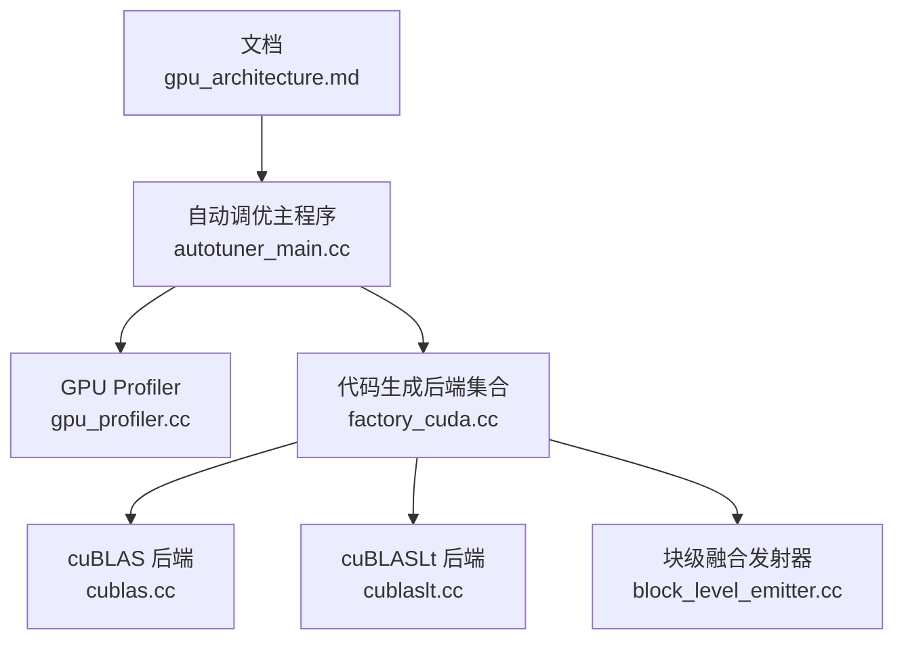
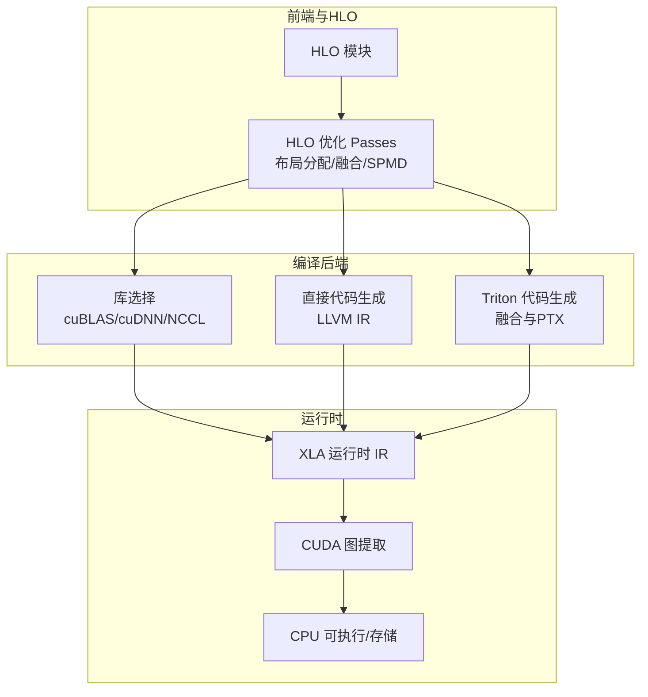
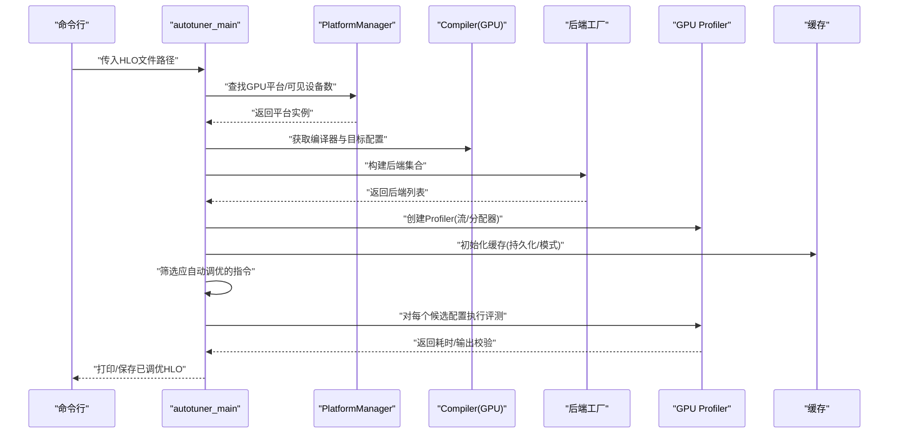
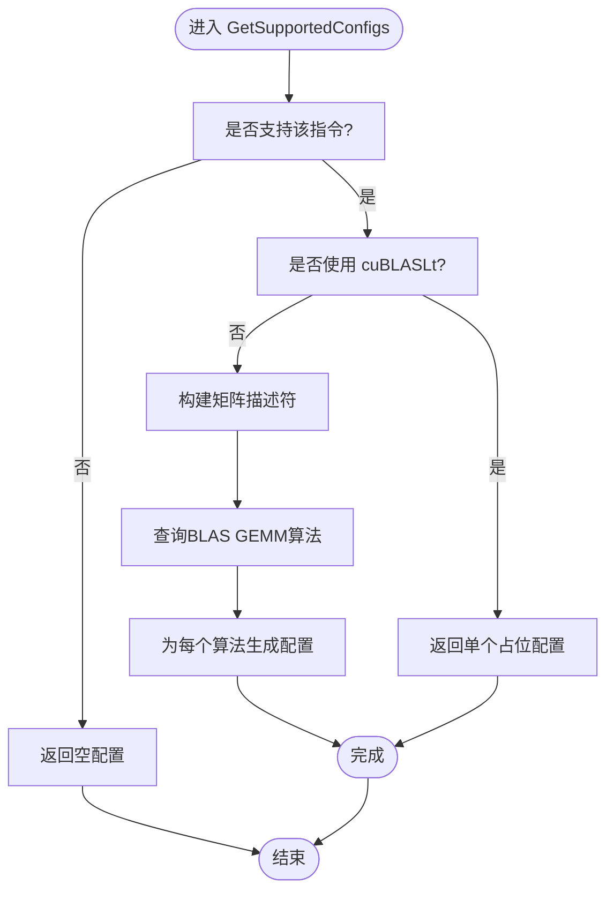
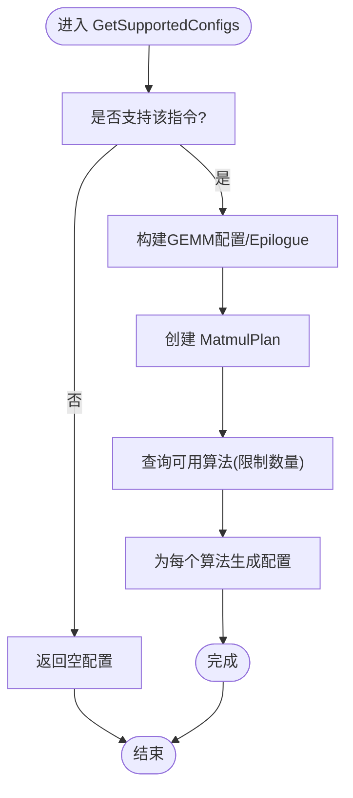
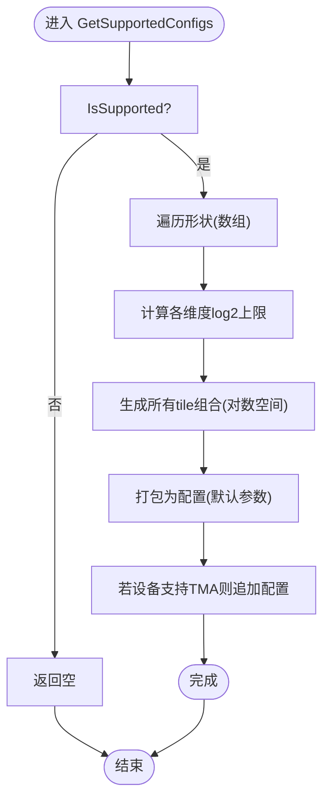
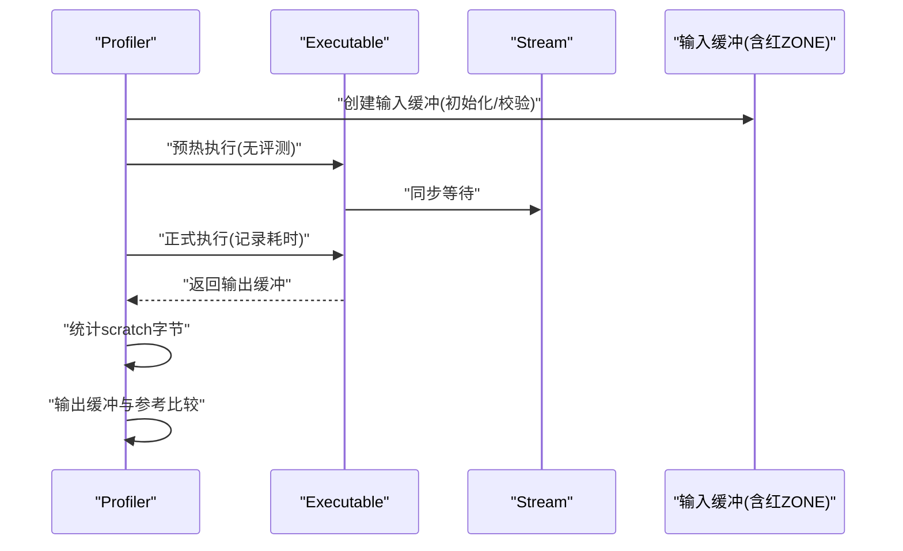
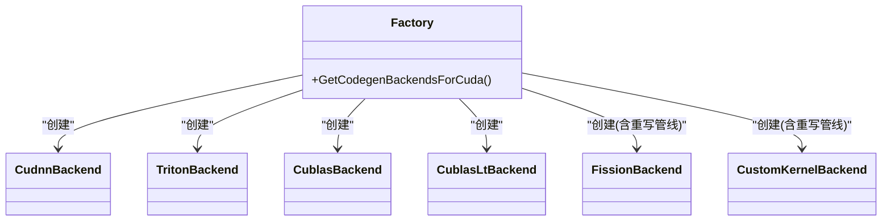
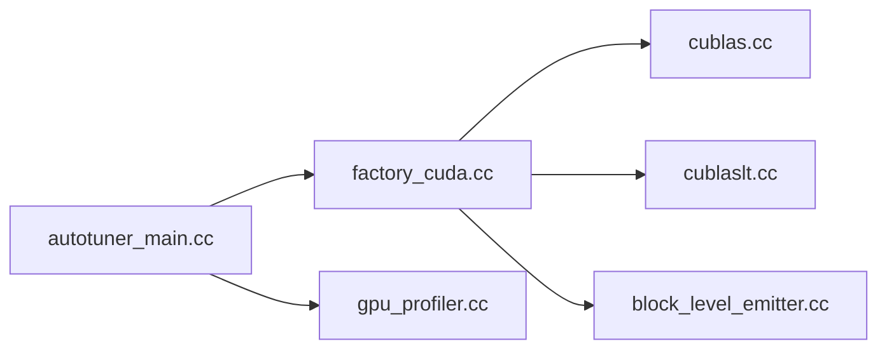

# GPU目标优化

<cite>
**本文引用的文件**
- [gpu_architecture.md](file://docs/gpu_architecture.md)
- [autotuner_main.cc](file://xla/backends/gpu/autotuner/autotuner_main.cc)
- [block_level_emitter.cc](file://xla/backends/gpu/autotuner/block_level_emitter.cc)
- [cublas.cc](file://xla/backends/gpu/autotuner/cublas.cc)
- [cublaslt.cc](file://xla/backends/gpu/autotuner/cublaslt.cc)
- [gpu_profiler.cc](file://xla/backends/gpu/autotuner/gpu_profiler.cc)
- [factory_cuda.cc](file://xla/backends/gpu/autotuner/factory_cuda.cc)
</cite>

## 目录
1. [简介](#简介)
2. [项目结构](#项目结构)
3. [核心组件](#核心组件)
4. [架构总览](#架构总览)
5. [详细组件分析](#详细组件分析)
6. [依赖关系分析](#依赖关系分析)
7. [性能考量](#性能考量)
8. [故障排查指南](#故障排查指南)
9. [结论](#结论)
10. [附录](#附录)

## 简介
本文件面向GPU目标的XLA后端优化，系统性阐述CUDA GPU特定的优化技术与实现细节，涵盖自动调优机制、内核生成与优化策略、内存层次结构优化、线程块配置与网格调度、HLO变换、寄存器与共享内存管理、以及针对SM/Warp/内存带宽等架构特性的性能优化方法。同时记录CUDA内核生成流程、编译选项与运行时优化技术，帮助读者在不同硬件代际上获得稳定且高性能的执行结果。

## 项目结构
围绕GPU优化的关键模块主要分布在以下路径：
- 文档：gpu架构与流水线说明
- 自动调优工具与后端：autotuner_main、cublas、cublaslt、block_level_emitter、gpu_profiler、factory_cuda
- 后端工厂：根据平台选择合适的代码生成后端（cuDNN、Triton、cuBLAS、cuBLASLt、Fission、Custom Kernel）

**图示来源**
- [gpu_architecture.md](file://docs/gpu_architecture.md#L20-L254)
- [autotuner_main.cc](file://xla/backends/gpu/autotuner/autotuner_main.cc#L78-L169)
- [gpu_profiler.cc](file://xla/backends/gpu/autotuner/gpu_profiler.cc#L91-L115)
- [factory_cuda.cc](file://xla/backends/gpu/autotuner/factory_cuda.cc#L84-L136)
- [cublas.cc](file://xla/backends/gpu/autotuner/cublas.cc#L45-L131)
- [cublaslt.cc](file://xla/backends/gpu/autotuner/cublaslt.cc#L86-L142)
- [block_level_emitter.cc](file://xla/backends/gpu/autotuner/block_level_emitter.cc#L217-L308)

**章节来源**
- [gpu_architecture.md](file://docs/gpu_architecture.md#L20-L254)
- [autotuner_main.cc](file://xla/backends/gpu/autotuner/autotuner_main.cc#L78-L169)
- [gpu_profiler.cc](file://xla/backends/gpu/autotuner/gpu_profiler.cc#L91-L115)
- [factory_cuda.cc](file://xla/backends/gpu/autotuner/factory_cuda.cc#L84-L136)

## 核心组件
- 自动调优主程序：加载HLO模块、获取GPU编译器、构建后端集合、创建Profiler与缓存、按条件筛选需要自动调优的指令并执行。
- GPU Profiler：负责在专用流上执行可执行体，收集计算耗时、输出缓冲区校验、红_ZONE保护检查。
- 代码生成后端：cuBLAS/cuBLASLt、cuDNN、Triton、Fission、Custom Kernel，分别处理不同算子族与融合场景。
- 块级融合发射器：基于成本模型与设备能力生成候选块级融合配置（含TMA可用性扩展），用于自动调优。

**章节来源**
- [autotuner_main.cc](file://xla/backends/gpu/autotuner/autotuner_main.cc#L86-L169)
- [gpu_profiler.cc](file://xla/backends/gpu/autotuner/gpu_profiler.cc#L132-L171)
- [factory_cuda.cc](file://xla/backends/gpu/autotuner/factory_cuda.cc#L84-L136)
- [block_level_emitter.cc](file://xla/backends/gpu/autotuner/block_level_emitter.cc#L217-L308)

## 架构总览
下图展示从HLO到GPU内核的端到端优化与生成路径，包括库选择、直接代码生成、Triton融合、以及运行时IR与CUDA图提取。

**图示来源**
- [gpu_architecture.md](file://docs/gpu_architecture.md#L20-L254)

**章节来源**
- [gpu_architecture.md](file://docs/gpu_architecture.md#L20-L254)

## 详细组件分析

### 组件A：自动调优主程序（autotuner_main）
- 功能要点
  - 加载HLO模块，解析并验证。
  - 获取GPU平台与编译器实例，构造目标配置与别名信息。
  - 初始化MLIR上下文，构建后端集合（由工厂函数提供）。
  - 创建线程池、Profiler与缓存，按条件筛选需要自动调优的指令（如融合、特定自定义调用）。
  - 执行自动调优并将结果写回HLO模块。

- 关键流程（序列图）

**图示来源**
- [autotuner_main.cc](file://xla/backends/gpu/autotuner/autotuner_main.cc#L78-L169)
- [gpu_profiler.cc](file://xla/backends/gpu/autotuner/gpu_profiler.cc#L91-L115)
- [factory_cuda.cc](file://xla/backends/gpu/autotuner/factory_cuda.cc#L84-L136)

**章节来源**
- [autotuner_main.cc](file://xla/backends/gpu/autotuner/autotuner_main.cc#L78-L169)

### 组件B：cuBLAS后端（cublas.cc）
- 支持范围：传统cuBLAS GEMM与需要cuBLASLt回退的FP8路径。
- 配置生成：若使用cuBLASLt，则返回单个占位配置；否则通过查询BLAS算法枚举生成候选配置。
- 默认配置：选择默认算法或在FP8路径中使用特殊占位值。
- 应用配置：将选定算法写回GEMM后端配置，并更新工作空间大小。

- 流程（流程图）

**图示来源**
- [cublas.cc](file://xla/backends/gpu/autotuner/cublas.cc#L45-L131)

**章节来源**
- [cublas.cc](file://xla/backends/gpu/autotuner/cublas.cc#L45-L131)

### 组件C：cuBLASLt后端（cublaslt.cc）
- 支持范围：标准与FP8的cuBLASLt Matmul。
- 配置生成：基于GEMM配置与Epilogue类型创建Matmul Plan，查询前若干算法作为候选。
- 默认配置：预设算法0与合理的工作空间大小。
- 应用配置：写回算法与工作空间大小；必要时调整输出形状中的工作空间维度。

- 流程（流程图）

**图示来源**
- [cublaslt.cc](file://xla/backends/gpu/autotuner/cublaslt.cc#L86-L142)

**章节来源**
- [cublaslt.cc](file://xla/backends/gpu/autotuner/cublaslt.cc#L86-L142)

### 组件D：块级融合发射器（block_level_emitter）
- 支持范围：仅数组形状的融合指令，要求融合计算对Triton友好。
- 配置生成：以对数尺度遍历各维度可能的tile大小，生成多维组合；对零尺寸维度做特殊处理；默认设置warps/CTAs/stages/TMA标志。
- 成本模型配置：通过索引性能模型尝试寻找最优tiling，失败则报错；成功则提取块级参数为配置。
- 应用配置：将配置写回HLO的GPU后端配置，设置融合类型为kCustom。

- 流程（流程图）

**图示来源**
- [block_level_emitter.cc](file://xla/backends/gpu/autotuner/block_level_emitter.cc#L217-L308)

**章节来源**
- [block_level_emitter.cc](file://xla/backends/gpu/autotuner/block_level_emitter.cc#L217-L308)

### 组件E：GPU Profiler（gpu_profiler）
- 输入缓冲：基于程序形状创建带红ZONE保护的输入缓冲，支持初始化与正确性检查。
- 执行与评测：在专用流上执行可执行体，先进行预热，再采集计算时间；区分输出缓冲（通常取第一个子树）。
- 输出校验：对每个叶形状比较输出与参考缓冲，确保数值一致性。
- 资源统计：统计临时/scratch缓冲占用字节数，辅助缓存与资源规划。

- 流程（序列图）

**图示来源**
- [gpu_profiler.cc](file://xla/backends/gpu/autotuner/gpu_profiler.cc#L132-L171)
- [gpu_profiler.cc](file://xla/backends/gpu/autotuner/gpu_profiler.cc#L173-L189)
- [gpu_profiler.cc](file://xla/backends/gpu/autotuner/gpu_profiler.cc#L207-L226)

**章节来源**
- [gpu_profiler.cc](file://xla/backends/gpu/autotuner/gpu_profiler.cc#L117-L171)
- [gpu_profiler.cc](file://xla/backends/gpu/autotuner/gpu_profiler.cc#L173-L189)
- [gpu_profiler.cc](file://xla/backends/gpu/autotuner/gpu_profiler.cc#L207-L226)

### 组件F：后端工厂（factory_cuda）
- 后端顺序：cuDNN、Triton、cuBLAS、cuBLASLt、Fission(cuBLAS/cuBLASLt)、Fission(Custom Kernel)。
- 重写管线：为cuBLAS路径提供GEMM重写管线（含缩放点积与算法重写），为Custom Kernel提供融合重写管线。
- 平台注册：静态注册CUDA平台ID对应的后端工厂。

- 类图（示意）

**图示来源**
- [factory_cuda.cc](file://xla/backends/gpu/autotuner/factory_cuda.cc#L84-L136)

**章节来源**
- [factory_cuda.cc](file://xla/backends/gpu/autotuner/factory_cuda.cc#L84-L136)

## 依赖关系分析
- 自动调优主程序依赖平台管理、编译器、后端工厂、Profiler与缓存。
- 各后端依赖底层BLAS/LT接口、设备描述、GEMM配置与布局信息。
- Profiler依赖流执行器、地址分配器与红ZONE校验工具。
- 工厂函数统一管理后端创建顺序与重写管线，保证测试稳定性与功能覆盖。

**图示来源**
- [autotuner_main.cc](file://xla/backends/gpu/autotuner/autotuner_main.cc#L106-L136)
- [factory_cuda.cc](file://xla/backends/gpu/autotuner/factory_cuda.cc#L84-L136)
- [gpu_profiler.cc](file://xla/backends/gpu/autotuner/gpu_profiler.cc#L91-L115)
- [cublas.cc](file://xla/backends/gpu/autotuner/cublas.cc#L45-L131)
- [cublaslt.cc](file://xla/backends/gpu/autotuner/cublaslt.cc#L86-L142)
- [block_level_emitter.cc](file://xla/backends/gpu/autotuner/block_level_emitter.cc#L217-L308)

**章节来源**
- [autotuner_main.cc](file://xla/backends/gpu/autotuner/autotuner_main.cc#L106-L136)
- [factory_cuda.cc](file://xla/backends/gpu/autotuner/factory_cuda.cc#L84-L136)

## 性能考量
- 内存层次优化
  - 利用融合减少中间结果写回HBM，优先在寄存器/共享内存传递数据。
  - 使用TMA（Hopper及以上）提升全局内存访问效率，块级发射器会自动扩展TMA配置。
  - 红ZONE保护与输出校验确保正确性，避免因越界导致的性能与稳定性问题。
- 线程块配置与网格调度
  - 基于对数尺度探索tile大小，结合设备能力与成本模型选择最优块级参数。
  - 默认配置包含warps/CTAs/stages等关键参数，可根据硬件代际微调。
- HLO变换与寄存器/共享内存管理
  - 布局分配与融合在HLO阶段完成，减少物理转置与冗余拷贝。
  - 成本模型驱动的tiling搜索，兼顾寄存器压力与共享内存占用。
- 架构特性利用
  - SM/Warp并行度：通过num_warps与num_ctas控制线程块规模与并发度。
  - 内存带宽：优先选择库内核（cuBLAS/cuDNN）或Triton融合，降低访存开销。
- 编译与运行时
  - 通过后端工厂选择最合适的实现路径；自动调优主程序统一调度评测流程。
  - 运行时IR与CUDA图提取为后续AOT编译与执行优化奠定基础。

[本节为通用指导，不直接分析具体文件]

## 故障排查指南
- 设备不可见或平台错误
  - 确认平台名称规范化与可见设备数量非零。
- Profiler创建失败
  - 检查流创建与分配器初始化；若为空则无法继续评测。
- 输出不匹配
  - 使用输出缓冲比较工具逐叶形状对比，定位不一致的张量。
- 红ZONE修改
  - 若检测到越界写入，检查内核边界、共享内存使用与布局转换逻辑。
- 自动调优未生效
  - 检查调试选项与后端允许列表，确认是否禁用了特定库或后端。

**章节来源**
- [autotuner_main.cc](file://xla/backends/gpu/autotuner/autotuner_main.cc#L87-L95)
- [gpu_profiler.cc](file://xla/backends/gpu/autotuner/gpu_profiler.cc#L117-L130)
- [gpu_profiler.cc](file://xla/backends/gpu/autotuner/gpu_profiler.cc#L191-L205)
- [gpu_profiler.cc](file://xla/backends/gpu/autotuner/gpu_profiler.cc#L207-L226)

## 结论
本文梳理了XLA GPU后端的自动调优体系与关键实现：从HLO优化、库选择与直接代码生成，到Triton融合与运行时IR/CUDA图提取。通过cuBLAS/cuBLASLt、cuDNN、Triton、Fission与Custom Kernel等后端协同，结合Profiler与成本模型驱动的块级tiling，可在不同GPU代际上实现稳定高效的内核生成与调度。建议在实际部署中结合硬件特性与工作负载，动态选择后端路径并启用TMA等新特性以进一步提升性能。

[本节为总结性内容，不直接分析具体文件]

## 附录
- 相关文档与流水线概览可参考GPU架构文档中的端到端流水线说明。

**章节来源**
- [gpu_architecture.md](file://docs/gpu_architecture.md#L20-L254)