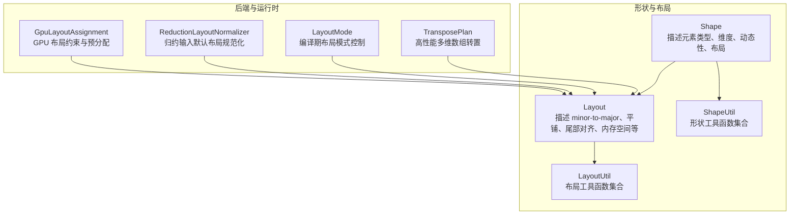
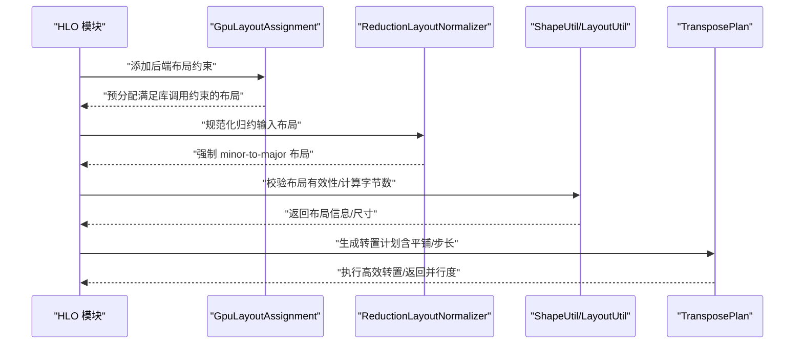
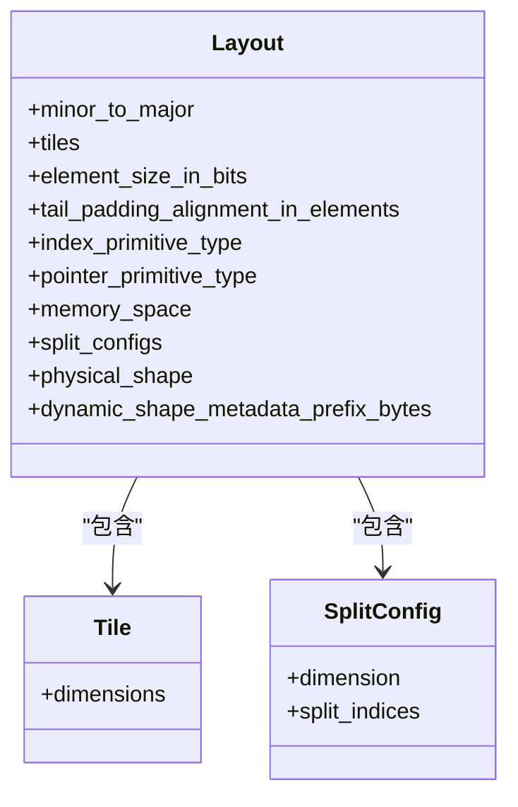
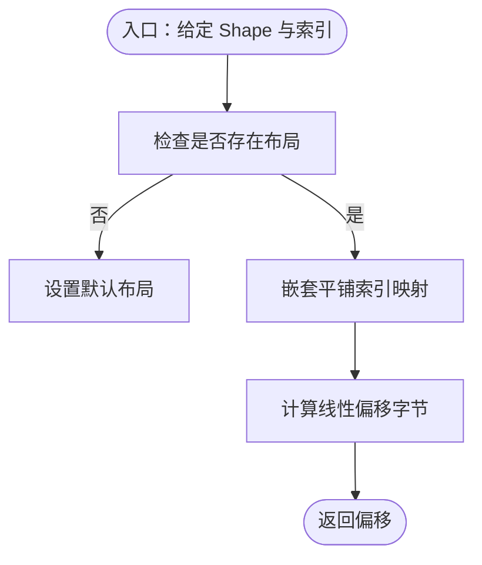
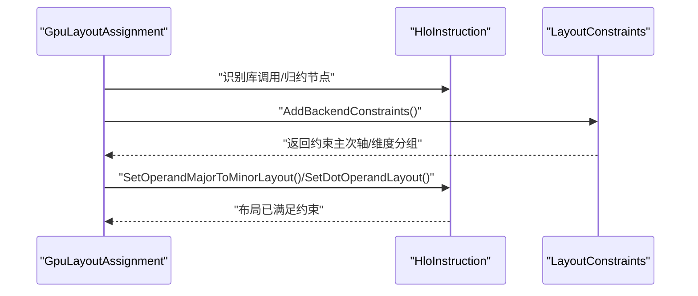
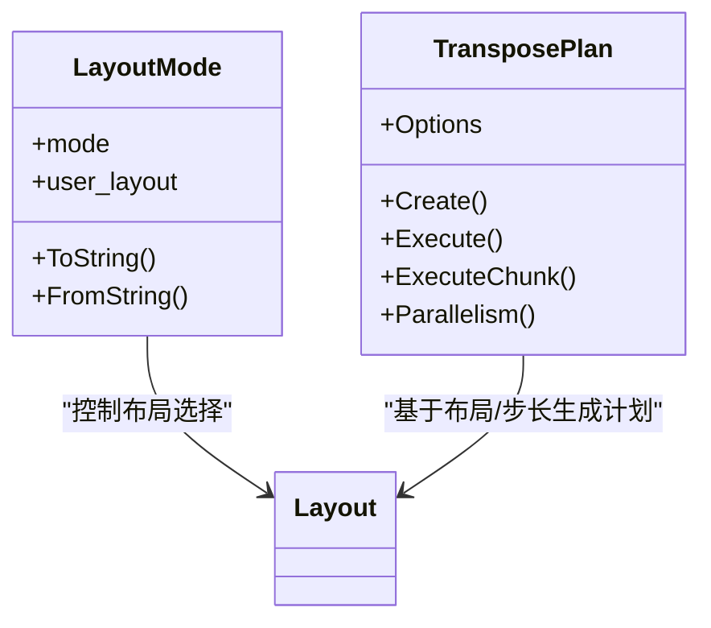
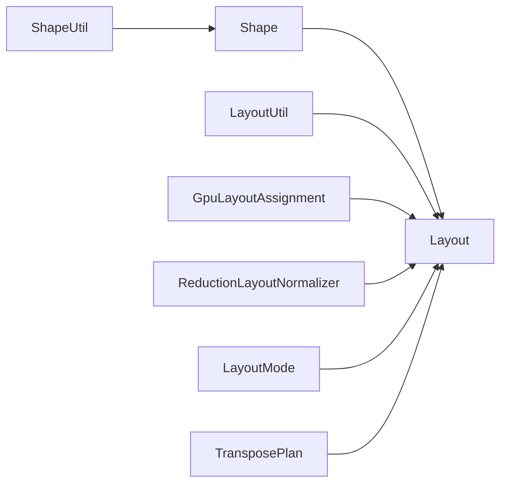

# 张量布局优化

<cite>
**本文引用的文件**
- [xla/layout.h](file://xla/layout.h)
- [xla/layout_util.h](file://xla/layout_util.h)
- [xla/shape.h](file://xla/shape.h)
- [xla/shape_util.h](file://xla/shape_util.h)
- [xla/backends/gpu/transforms/layout_assignment.h](file://xla/backends/gpu/transforms/layout_assignment.h)
- [xla/backends/gpu/transforms/reduction_layout_normalizer.h](file://xla/backends/gpu/transforms/reduction_layout_normalizer.h)
- [xla/pjrt/layout_mode.h](file://xla/pjrt/layout_mode.h)
- [xla/pjrt/transpose.h](file://xla/pjrt/transpose.h)
- [docs/tiled_layout.md](file://docs/tiled_layout.md)
</cite>

## 目录
1. [简介](#简介)
2. [项目结构](#项目结构)
3. [核心组件](#核心组件)
4. [架构总览](#架构总览)
5. [详细组件分析](#详细组件分析)
6. [依赖关系分析](#依赖关系分析)
7. [性能考量](#性能考量)
8. [故障排查指南](#故障排查指南)
9. [结论](#结论)
10. [附录](#附录)

## 简介
本文件系统化阐述 XLA 中张量布局优化的设计与实现，围绕以下目标展开：
- 解释张量内存布局的设计原理与优化策略：维度重排、数据对齐、内存访问模式优化
- 说明不同硬件架构下的最优布局方案（如 NCHW、NHWC 等），并给出选择依据
- 记录布局变换的代价模型、性能影响分析与转换开销评估方法
- 在保证计算正确性的前提下，提升内存访问效率，并处理跨设备数据传输优化

## 项目结构
XLA 的布局与形状系统由“形状（Shape）+ 布局（Layout）+ 工具函数（LayoutUtil/ShapeUtil）”构成，GPU 后端提供布局分配与规范化 Pass，PJRT 层提供布局模式与高性能转置能力。

图表来源
- [xla/shape.h](file://xla/shape.h#L61-L120)
- [xla/layout.h](file://xla/layout.h#L184-L250)
- [xla/layout_util.h](file://xla/layout_util.h#L38-L120)
- [xla/shape_util.h](file://xla/shape_util.h#L114-L180)
- [xla/backends/gpu/transforms/layout_assignment.h](file://xla/backends/gpu/transforms/layout_assignment.h#L36-L86)
- [xla/backends/gpu/transforms/reduction_layout_normalizer.h](file://xla/backends/gpu/transforms/reduction_layout_normalizer.h#L39-L49)
- [xla/pjrt/layout_mode.h](file://xla/pjrt/layout_mode.h#L34-L63)
- [xla/pjrt/transpose.h](file://xla/pjrt/transpose.h#L46-L135)

章节来源
- [xla/shape.h](file://xla/shape.h#L61-L120)
- [xla/layout.h](file://xla/layout.h#L184-L250)
- [xla/layout_util.h](file://xla/layout_util.h#L38-L120)
- [xla/shape_util.h](file://xla/shape_util.h#L114-L180)
- [xla/backends/gpu/transforms/layout_assignment.h](file://xla/backends/gpu/transforms/layout_assignment.h#L36-L86)
- [xla/backends/gpu/transforms/reduction_layout_normalizer.h](file://xla/backends/gpu/transforms/reduction_layout_normalizer.h#L39-L49)
- [xla/pjrt/layout_mode.h](file://xla/pjrt/layout_mode.h#L34-L63)
- [xla/pjrt/transpose.h](file://xla/pjrt/transpose.h#L46-L135)

## 核心组件
- 形状（Shape）
  - 描述张量的元素类型、维度大小、动态维度、布局等；支持数组、元组、缓冲区等形态
  - 提供维度操作、动态性管理、布局存在性检查等能力
- 布局（Layout）
  - 定义 minor-to-major 维度顺序、可选的平铺（Tile）、尾部对齐（tail padding）、索引/指针类型、内存空间、拆分配置（SplitConfig）等
  - 支持从/到 Proto 序列化、打印人类可读字符串、比较等
- 布局工具（LayoutUtil）
  - 提供布局构造、默认布局获取、线性索引映射（含嵌套平铺）、维度连续性判断、移动维度至主/次轴等
- 形状工具（ShapeUtil）
  - 提供形状构造、兼容性判断、字节大小计算、维度插入/删除、布局相关形状变换等
- GPU 后端 Pass
  - GpuLayoutAssignment：根据硬件特性与库调用约束预分配布局
  - ReductionLayoutNormalizer：确保归约输入采用标准 minor-to-major 布局
- PJRT 能力
  - LayoutMode：编译期布局模式（默认/用户指定/自动）
  - TransposePlan：高性能多维数组转置，支持输入/输出平铺与步长，提供并行执行与缓存

章节来源
- [xla/shape.h](file://xla/shape.h#L380-L420)
- [xla/layout.h](file://xla/layout.h#L184-L250)
- [xla/layout_util.h](file://xla/layout_util.h#L38-L120)
- [xla/shape_util.h](file://xla/shape_util.h#L545-L570)
- [xla/backends/gpu/transforms/layout_assignment.h](file://xla/backends/gpu/transforms/layout_assignment.h#L36-L86)
- [xla/backends/gpu/transforms/reduction_layout_normalizer.h](file://xla/backends/gpu/transforms/reduction_layout_normalizer.h#L39-L49)
- [xla/pjrt/layout_mode.h](file://xla/pjrt/layout_mode.h#L34-L63)
- [xla/pjrt/transpose.h](file://xla/pjrt/transpose.h#L46-L135)

## 架构总览
XLA 的布局优化贯穿编译期与运行时：
- 编译期：通过 Pass（如 GpuLayoutAssignment、ReductionLayoutNormalizer）施加硬件约束与规范化
- 运行时：通过 LayoutUtil/ShapeUtil 进行布局验证与索引映射；通过 TransposePlan 执行高效转置；通过 LayoutMode 控制布局选择策略

图表来源
- [xla/backends/gpu/transforms/layout_assignment.h](file://xla/backends/gpu/transforms/layout_assignment.h#L47-L76)
- [xla/backends/gpu/transforms/reduction_layout_normalizer.h](file://xla/backends/gpu/transforms/reduction_layout_normalizer.h#L46-L48)
- [xla/shape_util.h](file://xla/shape_util.h#L177-L202)
- [xla/layout_util.h](file://xla/layout_util.h#L242-L261)
- [xla/pjrt/transpose.h](file://xla/pjrt/transpose.h#L135-L147)

## 详细组件分析

### 组件一：布局类与平铺机制
- 关键点
  - minor_to_major：定义物理维度的主次序，决定内存访问局部性
  - Tile/SplitConfig：支持嵌套平铺与跨内存拆分，以适配不同硬件粒度
  - 尾部对齐（tail padding alignment）：确保总元素数按特定粒度对齐，便于向量化与缓存
  - 元素位宽与内存空间：影响字节占用与设备内存分配
- 设计权衡
  - 平铺能提升缓存命中与向量化效率，但会增加索引映射复杂度
  - 尾部对齐可能引入额外填充，需在带宽与访问模式间折中

图表来源
- [xla/layout.h](file://xla/layout.h#L184-L250)
- [xla/layout.h](file://xla/layout.h#L44-L110)
- [xla/layout.h](file://xla/layout.h#L122-L182)

章节来源
- [xla/layout.h](file://xla/layout.h#L184-L250)
- [xla/layout.h](file://xla/layout.h#L44-L110)
- [xla/layout.h](file://xla/layout.h#L122-L182)

### 组件二：形状与布局工具
- 关键点
  - 默认布局与升/降序布局：快速生成常见布局
  - 线性索引映射（含嵌套平铺）：在给定索引下计算内存线性偏移
  - 维度连续性判断：用于判定某些算子是否可直接按内存顺序访问
  - 字节大小计算：考虑元素类型、布局填充与指针表大小
- 性能意义
  - 线性索引映射是热点路径，需尽量减少分支与乘法次数
  - 字节大小计算用于内存预算与跨设备传输规划

图表来源
- [xla/layout_util.h](file://xla/layout_util.h#L242-L261)
- [xla/shape_util.h](file://xla/shape_util.h#L177-L202)

章节来源
- [xla/layout_util.h](file://xla/layout_util.h#L242-L261)
- [xla/shape_util.h](file://xla/shape_util.h#L177-L202)

### 组件三：GPU 后端布局分配与规范化
- GpuLayoutAssignment
  - 针对卷积/归约等库调用施加布局约束，确保与 cuDNN/TensorRT 等库期望一致
  - 通过 SetDotOperandLayout/SetOperandMajorToMinorLayout 等辅助函数设定 operand 的主次轴组合
- ReductionLayoutNormalizer
  - 将归约输入强制为 minor-to-major 布局，避免因布局不一致导致的额外转置或低效访问

图表来源
- [xla/backends/gpu/transforms/layout_assignment.h](file://xla/backends/gpu/transforms/layout_assignment.h#L47-L76)
- [xla/backends/gpu/transforms/reduction_layout_normalizer.h](file://xla/backends/gpu/transforms/reduction_layout_normalizer.h#L46-L48)

章节来源
- [xla/backends/gpu/transforms/layout_assignment.h](file://xla/backends/gpu/transforms/layout_assignment.h#L36-L86)
- [xla/backends/gpu/transforms/reduction_layout_normalizer.h](file://xla/backends/gpu/transforms/reduction_layout_normalizer.h#L39-L49)

### 组件四：PJRT 布局模式与高性能转置
- LayoutMode
  - 提供三种布局模式：默认紧凑布局、用户指定布局、自动布局
  - 与 MLIR 属性 mhlo.layout_mode 对应，便于在编译阶段统一布局策略
- TransposePlan
  - 支持输入/输出平铺与步长，自动生成并行执行计划
  - 可请求输入/输出连续性，保证块内访问局部性
  - 提供缓存以复用昂贵的计划构建过程

图表来源
- [xla/pjrt/layout_mode.h](file://xla/pjrt/layout_mode.h#L34-L63)
- [xla/pjrt/transpose.h](file://xla/pjrt/transpose.h#L135-L147)

章节来源
- [xla/pjrt/layout_mode.h](file://xla/pjrt/layout_mode.h#L34-L63)
- [xla/pjrt/transpose.h](file://xla/pjrt/transpose.h#L46-L135)

## 依赖关系分析
- 形状与布局
  - Shape 持有 Layout，二者共同描述张量的逻辑与物理结构
  - LayoutUtil/ShapeUtil 在编译期进行布局验证、索引映射与字节大小计算
- 后端 Pass
  - GpuLayoutAssignment 依赖设备能力与库调用约束，向 Layout 注入硬件友好的 minor-to-major 组合
  - ReductionLayoutNormalizer 依赖 Layout 的 minor-to-major 规范化能力
- 运行时
  - TransposePlan 依赖 Layout 的平铺与步长信息，生成高效的循环与并行策略

图表来源
- [xla/shape.h](file://xla/shape.h#L394-L412)
- [xla/layout_util.h](file://xla/layout_util.h#L242-L261)
- [xla/shape_util.h](file://xla/shape_util.h#L177-L202)
- [xla/backends/gpu/transforms/layout_assignment.h](file://xla/backends/gpu/transforms/layout_assignment.h#L47-L76)
- [xla/backends/gpu/transforms/reduction_layout_normalizer.h](file://xla/backends/gpu/transforms/reduction_layout_normalizer.h#L46-L48)
- [xla/pjrt/layout_mode.h](file://xla/pjrt/layout_mode.h#L34-L63)
- [xla/pjrt/transpose.h](file://xla/pjrt/transpose.h#L135-L147)

章节来源
- [xla/shape.h](file://xla/shape.h#L394-L412)
- [xla/layout_util.h](file://xla/layout_util.h#L242-L261)
- [xla/shape_util.h](file://xla/shape_util.h#L177-L202)
- [xla/backends/gpu/transforms/layout_assignment.h](file://xla/backends/gpu/transforms/layout_assignment.h#L47-L76)
- [xla/backends/gpu/transforms/reduction_layout_normalizer.h](file://xla/backends/gpu/transforms/reduction_layout_normalizer.h#L46-L48)
- [xla/pjrt/layout_mode.h](file://xla/pjrt/layout_mode.h#L34-L63)
- [xla/pjrt/transpose.h](file://xla/pjrt/transpose.h#L135-L147)

## 性能考量
- 维度重排与访问局部性
  - minor_to_major 决定内存访问顺序，应尽量使最内层维度对应连续访问
  - 对于卷积/归约等算子，遵循库期望的布局（如 NCHW/NHWC）可显著降低额外转置成本
- 数据对齐与填充
  - 尾部对齐与平铺可提升缓存命中与向量化效率，但会引入额外填充
  - 需结合硬件向量化宽度与缓存行大小进行权衡
- 转置与跨设备传输
  - 使用 TransposePlan 生成高效转置计划，优先保证内层维度连续
  - 跨设备传输前尽量进行布局规范化与转置合并，减少多次拷贝与布局变换
- 成本模型与评估
  - 布局变换成本主要来自：索引映射复杂度、额外转置、内存填充与缓存未命中
  - 通过 ShapeUtil/ByteSizeOf 与 LayoutUtil/LinearIndexForNestedTiling 估算内存占用与访问成本
  - 利用 TransposePlan 的并行度与缓存，评估不同布局组合的吞吐差异

[本节为通用指导，无需列出具体文件来源]

## 故障排查指南
- 布局不一致
  - 症状：归约或库调用失败，提示布局不匹配
  - 处理：启用 ReductionLayoutNormalizer 强制 minor-to-major；检查 GpuLayoutAssignment 是否正确注入约束
- 索引映射异常
  - 症状：内存访问越界或结果错误
  - 处理：核对 Layout 的 minor_to_major 与 Tile 配置；使用 LayoutUtil 的线性索引映射函数进行验证
- 转置性能不佳
  - 症状：转置吞吐低、缓存命中差
  - 处理：调整 TransposePlan 的输入/输出平铺与步长；请求输出连续性；复用 TransposePlanCache
- 跨设备传输卡顿
  - 症状：主机与设备之间频繁拷贝
  - 处理：在编译期通过 LayoutMode 指定设备侧布局；在运行时避免不必要的布局变换

章节来源
- [xla/backends/gpu/transforms/reduction_layout_normalizer.h](file://xla/backends/gpu/transforms/reduction_layout_normalizer.h#L39-L49)
- [xla/backends/gpu/transforms/layout_assignment.h](file://xla/backends/gpu/transforms/layout_assignment.h#L47-L76)
- [xla/layout_util.h](file://xla/layout_util.h#L242-L261)
- [xla/pjrt/transpose.h](file://xla/pjrt/transpose.h#L135-L147)
- [xla/pjrt/layout_mode.h](file://xla/pjrt/layout_mode.h#L34-L63)

## 结论
XLA 的布局优化体系通过“形状 + 布局 + 工具函数 + 后端 Pass + 运行时转置”的协同，在保证计算正确性的前提下，最大化内存访问效率。针对不同硬件（尤其是 GPU），应优先采用符合库期望的布局（如 NCHW/NHWC），并通过平铺、尾部对齐与高性能转置进一步提升吞吐。编译期的布局规范化与运行时的布局模式控制共同构成了完整的优化闭环。

[本节为总结，无需列出具体文件来源]

## 附录
- 平铺布局文档参考：docs/tiled_layout.md
- 常见布局格式选择建议
  - 卷积：NCHW 在多数 GPU 上具有更好的内存访问局部性与向量化效率
  - 图像处理流水线：NHWC 在某些库与 CPU 优化上表现更佳
  - 归约：minor-to-major 布局通常能减少额外转置与提高缓存命中

章节来源
- [docs/tiled_layout.md](file://docs/tiled_layout.md)