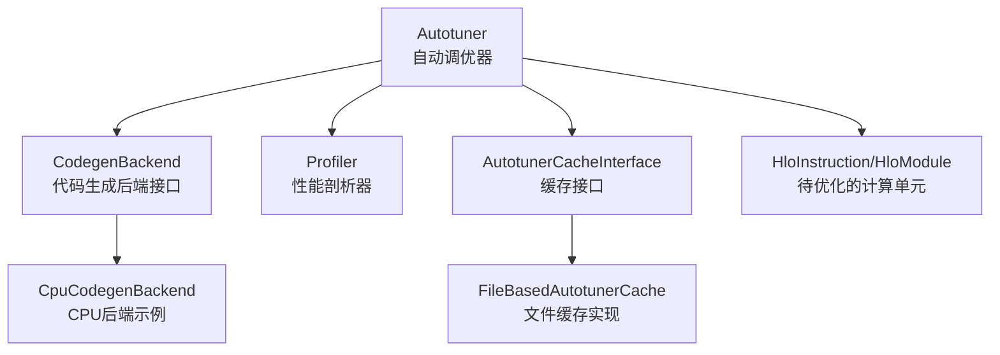
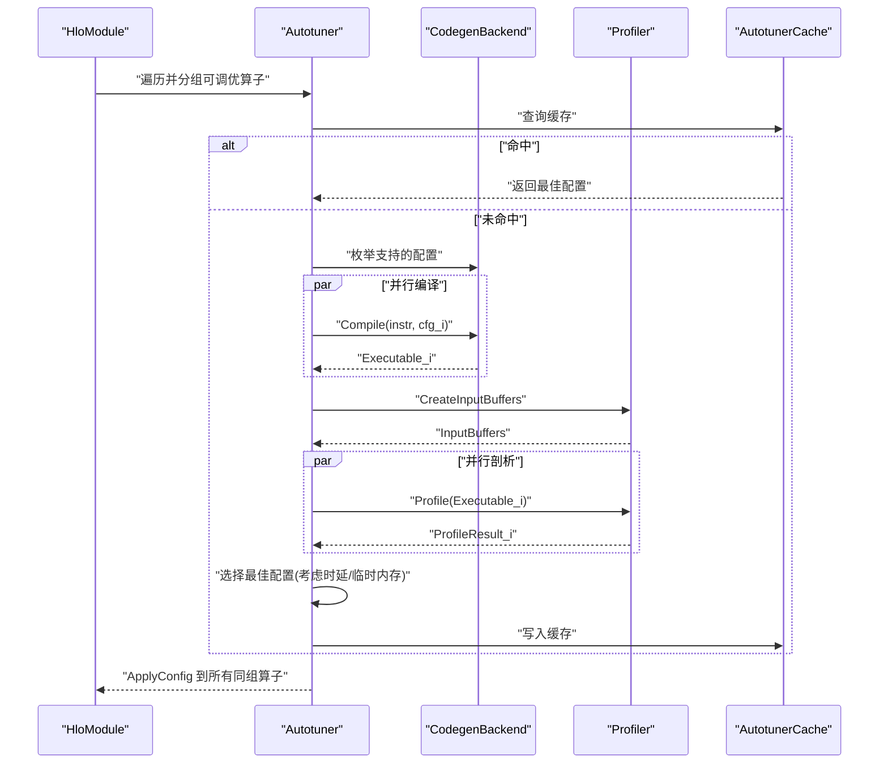
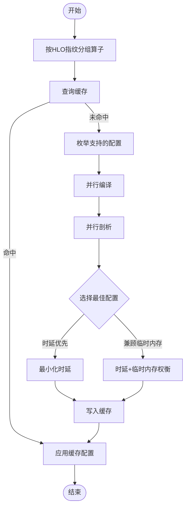
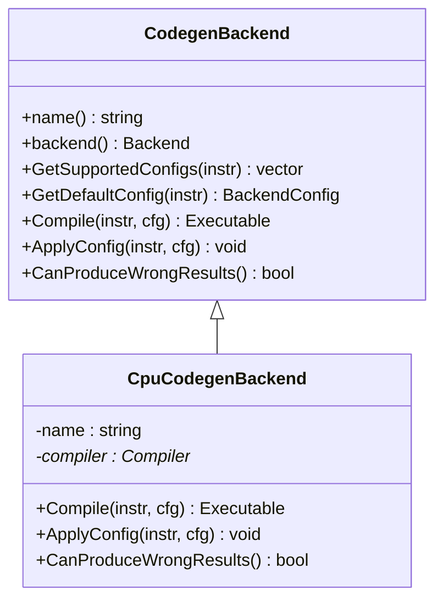
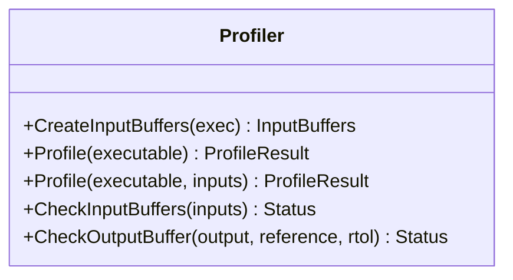
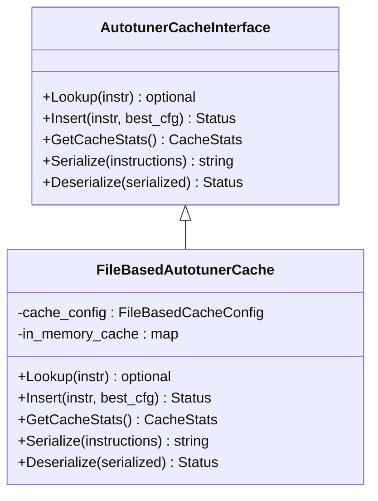
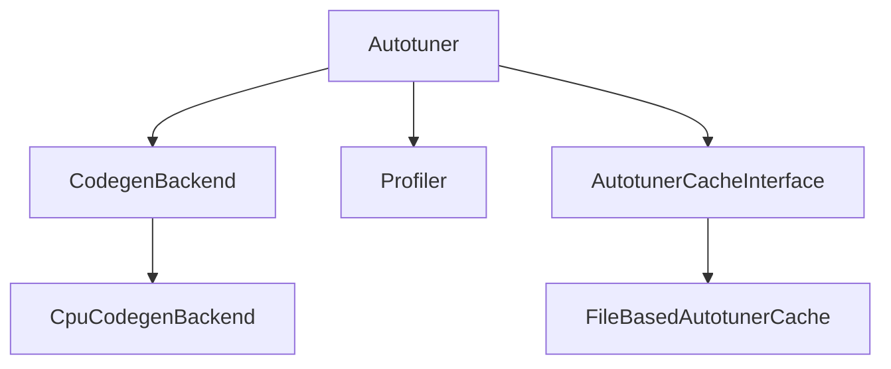

# 目标特定优化阶段

<cite>
**本文引用的文件**
- [xla\backends\autotuner\autotuner.h](file://xla\backends\autotuner\autotuner.h)
- [xla\backends\autotuner\autotuner.cc](file://xla\backends\autotuner\autotuner.cc)
- [xla\backends\autotuner\codegen_backend.h](file://xla\backends\autotuner\codegen_backend.h)
- [xla\backends\autotuner\profiler.h](file://xla\backends\autotuner\profiler.h)
- [xla\backends\autotuner\autotuner_cache_interface.h](file://xla\backends\autotuner\autotuner_cache_interface.h)
- [xla\backends\autotuner\file_based_autotuner_cache.h](file://xla\backends\autotuner\file_based_autotuner_cache.h)
- [xla\backends\cpu\autotuner\cpu_codegen_backend.h](file://xla\backends\cpu\autotuner\cpu_codegen_backend.h)
- [xla\autotune_result_wrapper.h](file://xla\autotune_result_wrapper.h)
</cite>

## 目录
1. [引言](#引言)
2. [项目结构](#项目结构)
3. [核心组件](#核心组件)
4. [架构总览](#架构总览)
5. [详细组件分析](#详细组件分析)
6. [依赖关系分析](#依赖关系分析)
7. [性能考量](#性能考量)
8. [故障排查指南](#故障排查指南)
9. [结论](#结论)

## 引言
本文件聚焦于XLA编译流水线的“目标特定优化阶段”。该阶段的核心任务是：在给定硬件后端（如CPU/GPU等）上，对HLO计算图中的算子或融合单元进行配置空间搜索与选择，以获得在吞吐量、延迟、功耗与数值正确性之间达到最优权衡的执行配置。文档将系统阐述以下内容：
- 针对特定硬件架构的优化策略与算法
- 自动调优机制：性能模型训练与参数搜索
- 关键技术：张量布局优化、指令调度与寄存器分配的映射
- 设备特性适配：如GPU架构、CPU缓存层次
- 目标特定的代码变换与优化技术
- 多目标平衡策略（吞吐量、延迟、功耗）

## 项目结构
围绕目标特定优化阶段的关键代码位于XLA后端自动调优子系统，主要由如下模块构成：
- 自动调优器：负责收集候选配置、并行编译、性能评估、结果选择与缓存
- 代码生成后端接口：抽象不同后端（CPU/GPU等）的配置空间与编译能力
- 性能剖析器：统一的输入缓冲管理与执行时延测量
- 缓存接口与实现：持久化与跨进程共享调优结果
- CPU后端示例：展示如何通过现有编译器运行时完成目标特定编译

图表来源
- [xla\backends\autotuner\autotuner.h](file://xla\backends\autotuner\autotuner.h#L97-L247)
- [xla\backends\autotuner\codegen_backend.h](file://xla\backends\autotuner\codegen_backend.h#L37-L69)
- [xla\backends\autotuner\profiler.h](file://xla\backends\autotuner\profiler.h#L55-L89)
- [xla\backends\autotuner\autotuner_cache_interface.h](file://xla\backends\autotuner\autotuner_cache_interface.h#L36-L71)
- [xla\backends\autotuner\file_based_autotuner_cache.h](file://xla\backends\autotuner\file_based_autotuner_cache.h#L77-L115)
- [xla\backends\cpu\autotuner\cpu_codegen_backend.h](file://xla\backends\cpu\autotuner\cpu_codegen_backend.h#L40-L71)

章节来源
- [xla\backends\autotuner\autotuner.h](file://xla\backends\autotuner\autotuner.h#L97-L247)
- [xla\backends\autotuner\autotuner.cc](file://xla\backends\autotuner\autotuner.cc#L157-L171)
- [xla\backends\autotuner\codegen_backend.h](file://xla\backends\autotuner\codegen_backend.h#L37-L69)
- [xla\backends\autotuner\profiler.h](file://xla\backends\autotuner\profiler.h#L55-L89)
- [xla\backends\autotuner\autotuner_cache_interface.h](file://xla\backends\autotuner\autotuner_cache_interface.h#L36-L71)
- [xla\backends\autotuner\file_based_autotuner_cache.h](file://xla\backends\autotuner\file_based_autotuner_cache.h#L77-L115)
- [xla\backends\cpu\autotuner\cpu_codegen_backend.h](file://xla\backends\cpu\autotuner\cpu_codegen_backend.h#L40-L71)

## 核心组件
- 自动调优器（Autotuner）
  - 职责：识别可调优算子分组、查询/填充缓存、并行编译候选配置、性能评估与结果选择、日志与HLO转储
  - 关键流程：按HLO指纹分组→查询缓存→若无则枚举支持的配置→并行编译→剖析→选择最佳配置→写入缓存
- 代码生成后端接口（CodegenBackend）
  - 职责：暴露后端名称、后端类型、获取支持配置、默认配置、编译与应用配置
  - 作用：屏蔽不同后端差异，统一自动调优入口
- 性能剖析器（Profiler）
  - 职责：为可执行体创建输入缓冲、执行并测量时延、检查输出与边界越界
  - 作用：提供统一的性能评估与正确性校验能力
- 缓存接口与实现（AutotunerCacheInterface/FileBasedAutotunerCache）
  - 职责：缓存命中/插入、序列化/反序列化、统计信息
  - 作用：加速重复编译、支持多进程共享调优结果
- CPU后端示例（CpuCodegenBackend）
  - 职责：基于主机平台编译器运行时完成编译与配置应用
  - 作用：演示如何接入现有编译器栈

章节来源
- [xla\backends\autotuner\autotuner.h](file://xla\backends\autotuner\autotuner.h#L97-L247)
- [xla\backends\autotuner\autotuner.cc](file://xla\backends\autotuner\autotuner.cc#L173-L199)
- [xla\backends\autotuner\codegen_backend.h](file://xla\backends\autotuner\codegen_backend.h#L37-L69)
- [xla\backends\autotuner\profiler.h](file://xla\backends\autotuner\profiler.h#L55-L89)
- [xla\backends\autotuner\autotuner_cache_interface.h](file://xla\backends\autotuner\autotuner_cache_interface.h#L36-L71)
- [xla\backends\autotuner\file_based_autotuner_cache.h](file://xla\backends\autotuner\file_based_autotuner_cache.h#L77-L115)
- [xla\backends\cpu\autotuner\cpu_codegen_backend.h](file://xla\backends\cpu\autotuner\cpu_codegen_backend.h#L40-L71)

## 架构总览
下图展示了从HLO到目标特定配置选择的整体流程，以及各组件间的交互。

图表来源
- [xla\backends\autotuner\autotuner.cc](file://xla\backends\autotuner\autotuner.cc#L173-L199)
- [xla\backends\autotuner\autotuner.cc](file://xla\backends\autotuner\autotuner.cc#L364-L420)
- [xla\backends\autotuner\autotuner.cc](file://xla\backends\autotuner\autotuner.cc#L593-L646)
- [xla\backends\autotuner\autotuner.cc](file://xla\backends\autotuner\autotuner.cc#L520-L539)

## 详细组件分析

### 自动调优器（Autotuner）
- 分组与指纹去重：使用HLO字符串指纹对等价算子进行分组，避免重复调优
- 并行编译与剖析：通过线程池并发编译与剖析，显著缩短调优时间
- 结果选择策略：
  - 基于时延的最小化
  - 可选地同时优化临时内存占用（在时延容忍窗口内）
  - 支持确定性选择首个有效配置以保证可重复性
- 正确性校验：可选的参考输出对比与边界越界检查
- 寄存器溢出控制：可拒绝可能导致寄存器溢出的配置
- 日志与HLO转储：便于问题定位与复现

图表来源
- [xla\backends\autotuner\autotuner.cc](file://xla\backends\autotuner\autotuner.cc#L461-L484)
- [xla\backends\autotuner\autotuner.cc](file://xla\backends\autotuner\autotuner.cc#L364-L420)
- [xla\backends\autotuner\autotuner.cc](file://xla\backends\autotuner\autotuner.cc#L648-L702)

章节来源
- [xla\backends\autotuner\autotuner.h](file://xla\backends\autotuner\autotuner.h#L97-L247)
- [xla\backends\autotuner\autotuner.cc](file://xla\backends\autotuner\autotuner.cc#L173-L199)
- [xla\backends\autotuner\autotuner.cc](file://xla\backends\autotuner\autotuner.cc#L364-L420)
- [xla\backends\autotuner\autotuner.cc](file://xla\backends\autotuner\autotuner.cc#L593-L646)
- [xla\backends\autotuner\autotuner.cc](file://xla\backends\autotuner\autotuner.cc#L648-L702)

### 代码生成后端接口（CodegenBackend）
- 抽象统一：不同后端（如CPU/GPU）通过同一接口暴露配置空间与编译能力
- 关键方法：
  - 获取支持配置：用于自动调优器枚举候选
  - 默认配置：在禁用自动调优时回退
  - 编译与应用配置：将配置应用于HLO并产出可执行体
- 可信度：后端可声明是否可能产生错误结果，以便自动调优器跳过或严格校验

图表来源
- [xla\backends\autotuner\codegen_backend.h](file://xla\backends\autotuner\codegen_backend.h#L37-L69)
- [xla\backends\cpu\autotuner\cpu_codegen_backend.h](file://xla\backends\cpu\autotuner\cpu_codegen_backend.h#L40-L71)

章节来源
- [xla\backends\autotuner\codegen_backend.h](file://xla\backends\autotuner\codegen_backend.h#L37-L69)
- [xla\backends\cpu\autotuner\cpu_codegen_backend.h](file://xla\backends\cpu\autotuner\cpu_codegen_backend.h#L40-L71)

### 性能剖析器（Profiler）
- 输入缓冲管理：为每个可执行体创建与输入形状一致的设备侧缓冲
- 执行与测量：统一的剖析接口，返回时延与临时内存使用
- 正确性检查：支持红区检查与输出对比，确保数值正确性
- 可扩展性：不同后端（CPU/GPU）可实现各自的Profiler

图表来源
- [xla\backends\autotuner\profiler.h](file://xla\backends\autotuner\profiler.h#L55-L89)

章节来源
- [xla\backends\autotuner\profiler.h](file://xla\backends\autotuner\profiler.h#L55-L89)

### 缓存接口与文件缓存实现
- 接口职责：查询/插入、序列化/反序列化、缓存统计
- 文件缓存实现要点：
  - 以HLO指纹+设备描述+版本拼接为内存键，避免冲突
  - 按SHA256命名持久化文件，原子写入（临时目录→重命名）
  - 支持只读/只写/读写模式，便于离线/在线调优

图表来源
- [xla\backends\autotuner\autotuner_cache_interface.h](file://xla\backends\autotuner\autotuner_cache_interface.h#L36-L71)
- [xla\backends\autotuner\file_based_autotuner_cache.h](file://xla\backends\autotuner\file_based_autotuner_cache.h#L77-L115)

章节来源
- [xla\backends\autotuner\autotuner_cache_interface.h](file://xla\backends\autotuner\autotuner_cache_interface.h#L36-L71)
- [xla\backends\autotuner\file_based_autotuner_cache.h](file://xla\backends\autotuner\file_based_autotuner_cache.h#L77-L115)

### 目标特定优化策略与算法
- 硬件架构适配
  - GPU：通过后端配置空间控制块大小、网格维度、共享内存使用、寄存器限制等；自动调优器在编译阶段即剔除会导致寄存器溢出的配置
  - CPU：利用主机平台编译器能力，结合向量化、循环展开、SIMD等指令级优化
- 自动调优机制
  - 参数搜索：枚举后端支持的配置空间（如核函数参数、布局策略、分块尺寸等）
  - 性能模型：以剖析时延作为目标函数；可选地引入临时内存作为次优目标
  - 并发策略：并行编译与剖析，减少整体调优时间
- 张量布局优化
  - 在HLO层面选择合适的布局（如NCHW/NHWC），并在后端配置中体现
  - 通过缓存与跨进程KV存储实现布局策略的共享与复用
- 指令调度与寄存器分配
  - 后端编译器负责具体调度与寄存器分配；自动调优器通过拒绝寄存器溢出配置来间接约束
  - 对于GPU，可通过后端配置限制寄存器使用上限，避免溢出导致的吞吐下降
- 设备特性适配
  - GPU架构：不同SM数、共享内存容量、寄存器数量、L2带宽等影响块大小与共享内存使用
  - CPU缓存层次：L1/L2/L3缓存大小与带宽影响分块与局部性优化策略
- 多目标平衡
  - 吞吐量优先：最小化平均时延
  - 延迟优先：最小化最大/尾部时延
  - 功耗优先：通过降低时钟频率或减少活跃核心数（由外部调度器配合）与减小临时内存占用协同实现

章节来源
- [xla\backends\autotuner\autotuner.cc](file://xla\backends\autotuner\autotuner.cc#L341-L362)
- [xla\backends\autotuner\autotuner.cc](file://xla\backends\autotuner\autotuner.cc#L671-L699)
- [xla\backends\autotuner\file_based_autotuner_cache.h](file://xla\backends\autotuner\file_based_autotuner_cache.h#L36-L56)

### 目标特定的代码变换与优化技术
- HLO层面的变换：在应用后端配置前，先将单个HLO指令抽取到独立模块，应用配置后再编译，确保变换与优化的隔离
- 配置应用：后端可将HLO替换为新的指令序列（例如融合拆分、布局转换等），自动调优器负责在所有等价算子上应用相同配置
- 离线/在线缓存：通过文件缓存与分布式KV存储实现跨进程与跨会话的配置复用

章节来源
- [xla\backends\autotuner\autotuner.cc](file://xla\backends\autotuner\autotuner.cc#L704-L718)
- [xla\backends\autotuner\autotuner.cc](file://xla\backends\autotuner\autotuner.cc#L201-L299)
- [xla\autotune_result_wrapper.h](file://xla\autotune_result_wrapper.h#L28-L65)

## 依赖关系分析
- 组件耦合
  - Autotuner依赖CodegenBackend与Profiler以完成配置枚举、编译与剖析
  - Autotuner通过AutotunerCacheInterface实现缓存与序列化
  - CpuCodegenBackend依赖主机平台编译器完成编译
- 外部依赖
  - 线程池：用于并行编译与剖析
  - 设备描述：用于缓存键的一部分，确保跨设备一致性
  - KV存储：用于分布式场景下的调优结果共享

图表来源
- [xla\backends\autotuner\autotuner.h](file://xla\backends\autotuner\autotuner.h#L238-L247)
- [xla\backends\autotuner\autotuner_cache_interface.h](file://xla\backends\autotuner\autotuner_cache_interface.h#L36-L71)
- [xla\backends\autotuner\file_based_autotuner_cache.h](file://xla\backends\autotuner\file_based_autotuner_cache.h#L77-L115)
- [xla\backends\cpu\autotuner\cpu_codegen_backend.h](file://xla\backends\cpu\autotuner\cpu_codegen_backend.h#L40-L71)

章节来源
- [xla\backends\autotuner\autotuner.h](file://xla\backends\autotuner\autotuner.h#L238-L247)
- [xla\backends\autotuner\autotuner_cache_interface.h](file://xla\backends\autotuner\autotuner_cache_interface.h#L36-L71)
- [xla\backends\autotuner\file_based_autotuner_cache.h](file://xla\backends\autotuner\file_based_autotuner_cache.h#L77-L115)
- [xla\backends\cpu\autotuner\cpu_codegen_backend.h](file://xla\backends\cpu\autotuner\cpu_codegen_backend.h#L40-L71)

## 性能考量
- 并行化：充分利用线程池并行编译与剖析，显著缩短调优时间
- 缓存策略：命中率直接影响端到端性能；文件缓存与分布式KV存储提升复用效率
- 寄存器溢出防护：自动拒绝可能导致溢出的配置，避免运行时性能骤降
- 临时内存优化：在时延容忍窗口内选择更省临时内存的配置，有助于降低带宽压力与能耗
- 设备特性：根据设备描述（如SM数、寄存器/共享内存容量）调整配置空间与搜索范围

## 故障排查指南
- 编译失败：检查后端配置合法性与设备资源限制（寄存器/共享内存）
- 运行失败：确认输入缓冲创建与初始化策略，启用红区检查定位越界
- 数值错误：启用参考输出对比，设置合理相对容差
- 缓存异常：检查缓存目录权限、文件完整性与版本兼容性
- 分布式调优：确认KV存储可用性与键命名一致性

章节来源
- [xla\backends\autotuner\autotuner.cc](file://xla\backends\autotuner\autotuner.cc#L341-L362)
- [xla\backends\autotuner\autotuner.cc](file://xla\backends\autotuner\autotuner.cc#L600-L636)
- [xla\backends\autotuner\file_based_autotuner_cache.h](file://xla\backends\autotuner\file_based_autotuner_cache.h#L105-L108)

## 结论
目标特定优化阶段通过“统一接口 + 并行搜索 + 性能剖析 + 缓存复用”的闭环，实现了对不同硬件架构的高效适配。其关键在于：
- 将后端配置空间标准化为可枚举的候选集合
- 以时延与临时内存为主要优化目标，辅以寄存器溢出防护与正确性校验
- 通过缓存与分布式KV存储实现跨进程与跨会话的配置复用
- 在HLO层面进行隔离变换，确保优化过程可追踪、可调试