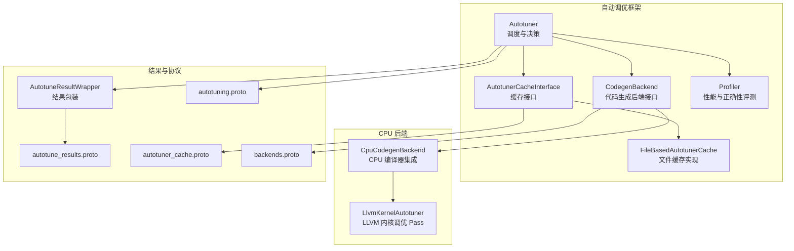
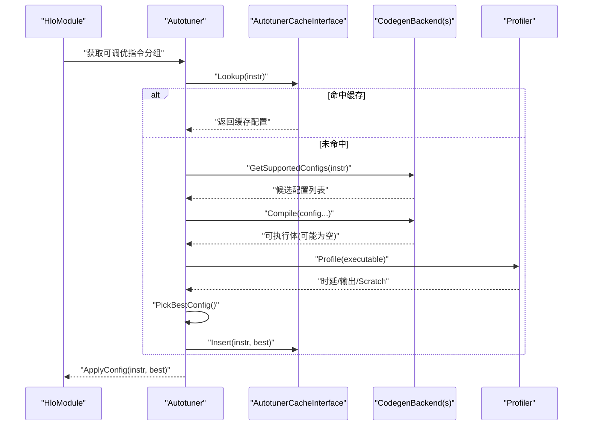
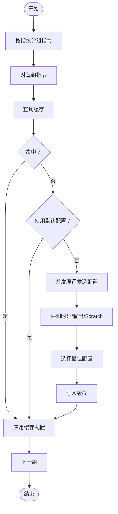
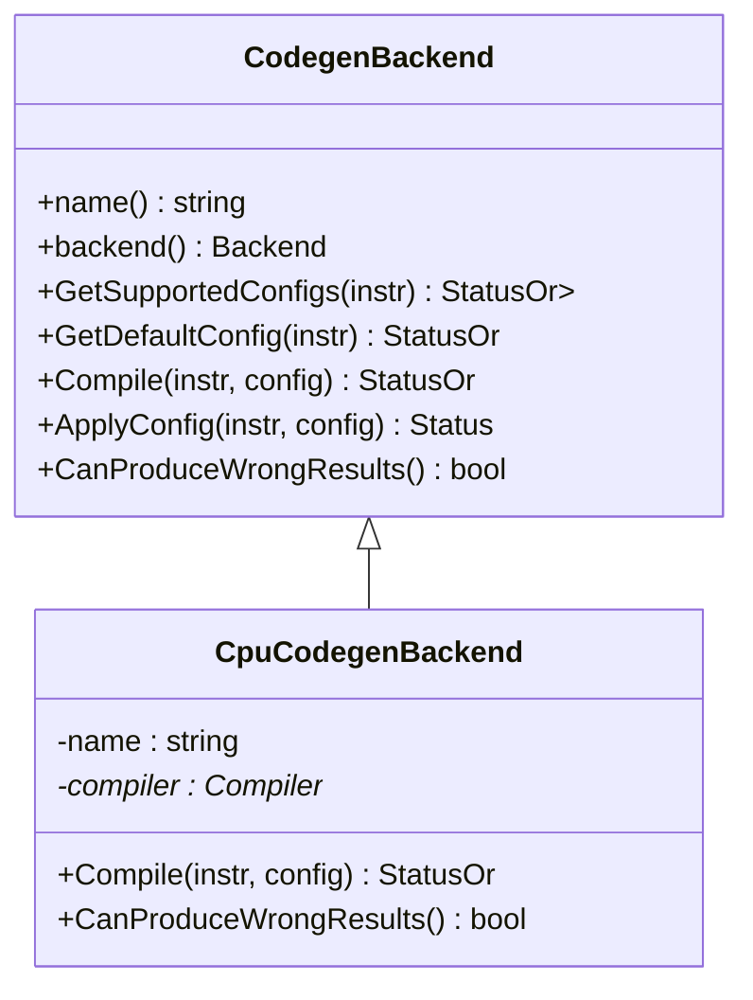
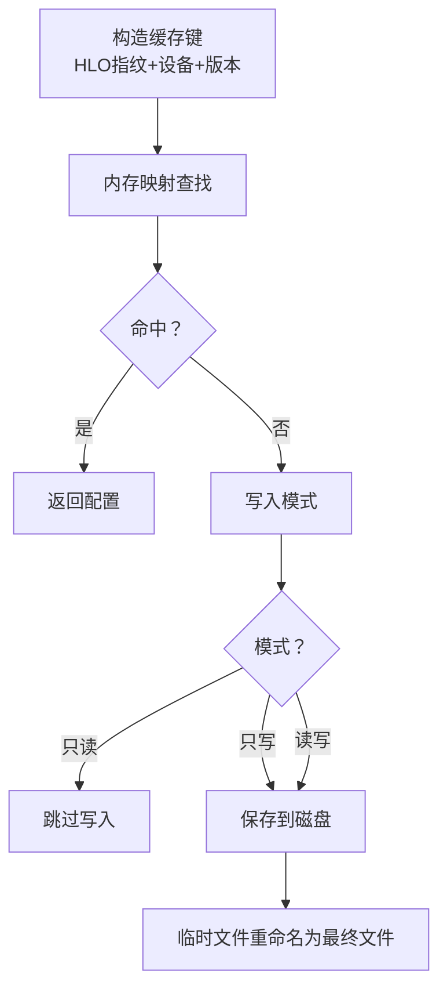
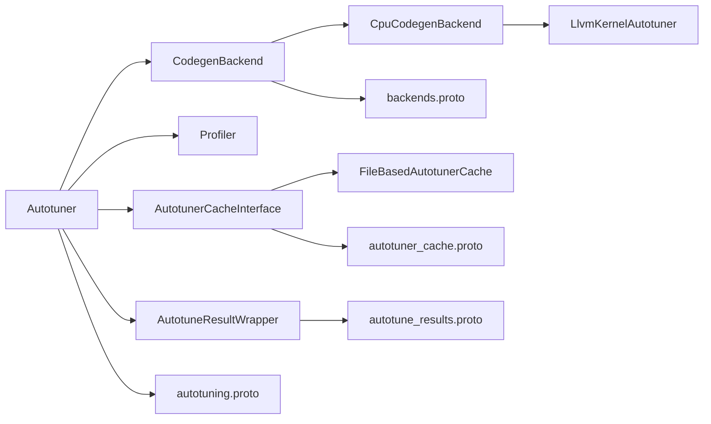

# 自动调优机制

<cite>
**本文引用的文件**
- [xla/backends/autotuner/autotuner.h](file://xla/backends/autotuner/autotuner.h)
- [xla/backends/autotuner/autotuner.cc](file://xla/backends/autotuner/autotuner.cc)
- [xla/backends/autotuner/autotuner_cache_interface.h](file://xla/backends/autotuner/autotuner_cache_interface.h)
- [xla/backends/autotuner/file_based_autotuner_cache.h](file://xla/backends/autotuner/file_based_autotuner_cache.h)
- [xla/backends/autotuner/codegen_backend.h](file://xla/backends/autotuner/codegen_backend.h)
- [xla/backends/autotuner/profiler.h](file://xla/backends/autotuner/profiler.h)
- [xla/backends/cpu/autotuner/cpu_codegen_backend.h](file://xla/backends/cpu/autotuner/cpu_codegen_backend.h)
- [xla/backends/cpu/autotuner/llvm_kernel_autotuner.h](file://xla/backends/cpu/autotuner/llvm_kernel_autotuner.h)
- [xla/autotune_result_wrapper.cc](file://xla/autotune_result_wrapper.cc)
- [xla/autotune_results.proto](file://xla/autotune_results.proto)
- [xla/autotuning.proto](file://xla/autotuning.proto)
- [xla/backends/autotuner/autotuner_cache.proto](file://xla/backends/autotuner/autotuner_cache.proto)
- [xla/backends/autotuner/backends.proto](file://xla/backends/autotuner/backends.proto)
</cite>

## 目录
1. [简介](#简介)
2. [项目结构](#项目结构)
3. [核心组件](#核心组件)
4. [架构总览](#架构总览)
5. [详细组件分析](#详细组件分析)
6. [依赖关系分析](#依赖关系分析)
7. [性能考量](#性能考量)
8. [故障排查指南](#故障排查指南)
9. [结论](#结论)
10. [附录](#附录)

## 简介
本文件系统性阐述 XLA 的自动调优机制，覆盖从性能模型训练、参数空间搜索到优化算法的全流程；详述调优缓存机制、性能基准测试与结果评估策略；记录不同硬件后端（CPU/GPU 等）的调优配置、搜索策略与收敛条件；解释如何在调优精度与性能开销之间取得平衡，并处理不确定性因素（如数值校验失败、寄存器溢出等）。文档同时提供代码级架构图与流程图，帮助读者快速理解实现细节。

## 项目结构
自动调优相关代码主要集中在以下模块：
- 后端无关的自动调优框架：autotuner.h/.cc、autotuner_cache_interface.h、file_based_autotuner_cache.h、codegen_backend.h、profiler.h
- CPU 后端适配：cpu_codegen_backend.h、llvm_kernel_autotuner.h
- 结果封装与协议：autotune_result_wrapper.cc、autotune_results.proto、autotuning.proto、autotuner_cache.proto、backends.proto

**图表来源**
- [xla/backends/autotuner/autotuner.h](file://xla/backends/autotuner/autotuner.h#L97-L251)
- [xla/backends/autotuner/autotuner.cc](file://xla/backends/autotuner/autotuner.cc#L157-L309)
- [xla/backends/autotuner/autotuner_cache_interface.h](file://xla/backends/autotuner/autotuner_cache_interface.h#L36-L76)
- [xla/backends/autotuner/file_based_autotuner_cache.h](file://xla/backends/autotuner/file_based_autotuner_cache.h#L58-L120)
- [xla/backends/autotuner/codegen_backend.h](file://xla/backends/autotuner/codegen_backend.h#L34-L74)
- [xla/backends/autotuner/profiler.h](file://xla/backends/autotuner/profiler.h#L53-L93)
- [xla/backends/cpu/autotuner/cpu_codegen_backend.h](file://xla/backends/cpu/autotuner/cpu_codegen_backend.h#L38-L77)
- [xla/backends/cpu/autotuner/llvm_kernel_autotuner.h](file://xla/backends/cpu/autotuner/llvm_kernel_autotuner.h#L35-L52)
- [xla/autotune_result_wrapper.cc](file://xla/autotune_result_wrapper.cc#L21-L82)
- [xla/autotune_results.proto](file://xla/autotune_results.proto)
- [xla/autotuning.proto](file://xla/autotuning.proto)
- [xla/backends/autotuner/autotuner_cache.proto](file://xla/backends/autotuner/autotuner_cache.proto)
- [xla/backends/autotuner/backends.proto](file://xla/backends/autotuner/backends.proto)

**章节来源**
- [xla/backends/autotuner/autotuner.h](file://xla/backends/autotuner/autotuner.h#L1-L251)
- [xla/backends/autotuner/autotuner.cc](file://xla/backends/autotuner/autotuner.cc#L1-L897)

## 核心组件
- Autotuner：自动调优主控制器，负责按 HLO 指令指纹分组、查询/插入缓存、并发编译候选配置、性能评测与最佳配置选择、日志与 HLO 转储。
- CodegenBackend：代码生成后端接口，抽象不同后端（CPU/GPU 等）的配置枚举、默认配置、编译与应用配置能力。
- Profiler：统一的性能评测与正确性检查接口，支持输入输出缓冲管理、红区检测、随机初始化、Scratch 内存统计。
- AutotunerCacheInterface/FileBasedAutotunerCache：缓存接口与文件持久化实现，支持内存映射与原子写入，键包含 HLO、设备与版本信息。
- CpuCodegenBackend/LlvmKernelAutotuner：CPU 后端适配层，基于主机编译器进行指令模块编译，并通过 LLVM 内核调优 Pass 进一步探索内核参数。

**章节来源**
- [xla/backends/autotuner/autotuner.h](file://xla/backends/autotuner/autotuner.h#L97-L251)
- [xla/backends/autotuner/autotuner.cc](file://xla/backends/autotuner/autotuner.cc#L157-L309)
- [xla/backends/autotuner/codegen_backend.h](file://xla/backends/autotuner/codegen_backend.h#L34-L74)
- [xla/backends/autotuner/profiler.h](file://xla/backends/autotuner/profiler.h#L53-L93)
- [xla/backends/autotuner/autotuner_cache_interface.h](file://xla/backends/autotuner/autotuner_cache_interface.h#L36-L76)
- [xla/backends/autotuner/file_based_autotuner_cache.h](file://xla/backends/autotuner/file_based_autotuner_cache.h#L58-L120)
- [xla/backends/cpu/autotuner/cpu_codegen_backend.h](file://xla/backends/cpu/autotuner/cpu_codegen_backend.h#L38-L77)
- [xla/backends/cpu/autotuner/llvm_kernel_autotuner.h](file://xla/backends/cpu/autotuner/llvm_kernel_autotuner.h#L35-L52)

## 架构总览
自动调优的整体流程如下：Autotuner 对模块中的指令进行指纹分组，优先查询缓存；若无命中且允许调优，则并发编译所有支持的配置，使用 Profiler 进行性能与正确性评测，依据配置结果选择最佳配置，并更新缓存。分布式场景下，通过多进程键值存储聚合各分片结果。

**图表来源**
- [xla/backends/autotuner/autotuner.cc](file://xla/backends/autotuner/autotuner.cc#L173-L299)
- [xla/backends/autotuner/autotuner.h](file://xla/backends/autotuner/autotuner.h#L97-L251)
- [xla/backends/autotuner/codegen_backend.h](file://xla/backends/autotuner/codegen_backend.h#L34-L74)
- [xla/backends/autotuner/profiler.h](file://xla/backends/autotuner/profiler.h#L53-L93)
- [xla/backends/autotuner/autotuner_cache_interface.h](file://xla/backends/autotuner/autotuner_cache_interface.h#L36-L76)

## 详细组件分析

### 组件一：Autotuner（自动调优主控制器）
- 职责
  - 指令指纹分组与去重，避免重复调优相同语义的指令。
  - 缓存查询与回退策略：命中则直接应用；未命中且允许时进行调优；可强制使用默认配置或严格要求缓存存在。
  - 并发编译与评测：支持线程池并发编译，跳过评测以保证确定性或仅剩一个配置时。
  - 最佳配置选择：以时延为主目标，可选“同窗口内最小 Scratch”策略；失败项单独统计。
  - 正确性保障：可选红区检测与参考输出对比，支持容差控制与崩溃策略。
  - 日志与转储：可将每次评测结果与 HLO 前后状态写入文件，便于复盘。
- 关键流程
  - GetAutotuningCandidates：按 HLO 指纹分组，确保确定性遍历。
  - GetConfig/TuneBestConfig：查询缓存/默认/调优三阶段，返回 Future 配合并发。
  - CompileAll/ProfileAll/PickBestConfig：编译-评测-选择的流水线。
  - 分布式分片：按分片桶大小切分指令，各自调优后通过 KV 存储聚合结果。

**图表来源**
- [xla/backends/autotuner/autotuner.cc](file://xla/backends/autotuner/autotuner.cc#L422-L459)
- [xla/backends/autotuner/autotuner.cc](file://xla/backends/autotuner/autotuner.cc#L311-L339)
- [xla/backends/autotuner/autotuner.cc](file://xla/backends/autotuner/autotuner.cc#L364-L420)
- [xla/backends/autotuner/autotuner.cc](file://xla/backends/autotuner/autotuner.cc#L593-L646)
- [xla/backends/autotuner/autotuner.cc](file://xla/backends/autotuner/autotuner.cc#L648-L702)

**章节来源**
- [xla/backends/autotuner/autotuner.h](file://xla/backends/autotuner/autotuner.h#L97-L251)
- [xla/backends/autotuner/autotuner.cc](file://xla/backends/autotuner/autotuner.cc#L173-L299)

### 组件二：CodegenBackend（代码生成后端接口）
- 抽象能力
  - 获取支持的配置集合、默认配置、编译单个配置为可执行体、将配置应用到 HLO 指令。
  - 标识后端是否可能产生错误结果，用于参考输出选择与安全策略。
- CPU 后端
  - CpuCodegenBackend：基于主机编译器创建模块并编译，适用于 CPU 后端。
  - LlvmKernelAutotuner：作为 HLO Pass 在模块层面触发 LLVM 内核参数调优。

**图表来源**
- [xla/backends/autotuner/codegen_backend.h](file://xla/backends/autotuner/codegen_backend.h#L34-L74)
- [xla/backends/cpu/autotuner/cpu_codegen_backend.h](file://xla/backends/cpu/autotuner/cpu_codegen_backend.h#L38-L77)

**章节来源**
- [xla/backends/autotuner/codegen_backend.h](file://xla/backends/autotuner/codegen_backend.h#L34-L74)
- [xla/backends/cpu/autotuner/cpu_codegen_backend.h](file://xla/backends/cpu/autotuner/cpu_codegen_backend.h#L38-L77)
- [xla/backends/cpu/autotuner/llvm_kernel_autotuner.h](file://xla/backends/cpu/autotuner/llvm_kernel_autotuner.h#L35-L52)

### 组件三：Profiler（性能评测与正确性检查）
- 能力
  - 创建设备侧输入缓冲、评测单个可执行体、检查输入缓冲红区越界、比较输出与参考输出。
  - 支持随机初始化与红区填充，便于发现越界问题。
- 使用策略
  - 可选参考输出生成（优先选择不产错结果的后端），用于后续输出一致性校验。
  - 时延与 Scratch 字节双目标，支持“同窗口内最小 Scratch”策略。

**章节来源**
- [xla/backends/autotuner/profiler.h](file://xla/backends/autotuner/profiler.h#L53-L93)
- [xla/backends/autotuner/autotuner.cc](file://xla/backends/autotuner/autotuner.cc#L593-L646)
- [xla/backends/autotuner/autotuner.cc](file://xla/backends/autotuner/autotuner.cc#L720-L739)
- [xla/backends/autotuner/autotuner.cc](file://xla/backends/autotuner/autotuner.cc#L741-L754)

### 组件四：缓存机制（AutotunerCacheInterface 与 FileBasedAutotunerCache）
- 接口职责
  - Lookup/Insert：按指令查询/写入最佳配置；支持序列化/反序列化以支撑分布式场景。
  - CacheStats：统计命中与未命中次数。
- 文件缓存实现
  - 键设计：HLO 指纹、设备描述字符串、版本号拼接为内存映射键；磁盘键为 Protobuf，文件名采用哈希避免大文件与损坏风险。
  - 原子写入：先写临时文件再重命名，降低读取半成品的风险。
  - 模式：只读/只写/读写，便于离线训练与在线加速。

**图表来源**
- [xla/backends/autotuner/autotuner_cache_interface.h](file://xla/backends/autotuner/autotuner_cache_interface.h#L36-L76)
- [xla/backends/autotuner/file_based_autotuner_cache.h](file://xla/backends/autotuner/file_based_autotuner_cache.h#L58-L120)
- [xla/backends/autotuner/autotuner.cc](file://xla/backends/autotuner/autotuner.cc#L486-L518)

**章节来源**
- [xla/backends/autotuner/autotuner_cache_interface.h](file://xla/backends/autotuner/autotuner_cache_interface.h#L36-L76)
- [xla/backends/autotuner/file_based_autotuner_cache.h](file://xla/backends/autotuner/file_based_autotuner_cache.h#L58-L120)

### 组件五：结果封装与协议（AutotuneResultWrapper 与 Protobuf）
- AutotuneResultWrapper：将 AutotuneResults 中的条目与键解包/打包为可跨模块传递的包装对象，便于日志与持久化。
- 协议定义：autotune_results.proto、autotuning.proto、autotuner_cache.proto、backends.proto 提供序列化结构与枚举，确保跨语言/跨后端一致性。

**章节来源**
- [xla/autotune_result_wrapper.cc](file://xla/autotune_result_wrapper.cc#L21-L82)
- [xla/autotune_results.proto](file://xla/autotune_results.proto)
- [xla/autotuning.proto](file://xla/autotuning.proto)
- [xla/backends/autotuner/autotuner_cache.proto](file://xla/backends/autotuner/autotuner_cache.proto)
- [xla/backends/autotuner/backends.proto](file://xla/backends/autotuner/backends.proto)

## 依赖关系分析
- Autotuner 依赖 CodegenBackend 列表以枚举配置与编译；依赖 Profiler 执行评测；依赖 AutotunerCacheInterface 进行缓存读写。
- CPU 后端通过 CpuCodegenBackend 实现 CodegenBackend 接口，并可结合 LlvmKernelAutotuner 进行内核参数探索。
- 结果与缓存通过 Protobuf 序列化，确保跨进程/跨版本兼容。

**图表来源**
- [xla/backends/autotuner/autotuner.h](file://xla/backends/autotuner/autotuner.h#L97-L251)
- [xla/backends/autotuner/codegen_backend.h](file://xla/backends/autotuner/codegen_backend.h#L34-L74)
- [xla/backends/autotuner/profiler.h](file://xla/backends/autotuner/profiler.h#L53-L93)
- [xla/backends/autotuner/autotuner_cache_interface.h](file://xla/backends/autotuner/autotuner_cache_interface.h#L36-L76)
- [xla/backends/cpu/autotuner/cpu_codegen_backend.h](file://xla/backends/cpu/autotuner/cpu_codegen_backend.h#L38-L77)
- [xla/backends/cpu/autotuner/llvm_kernel_autotuner.h](file://xla/backends/cpu/autotuner/llvm_kernel_autotuner.h#L35-L52)
- [xla/autotune_result_wrapper.cc](file://xla/autotune_result_wrapper.cc#L21-L82)

**章节来源**
- [xla/backends/autotuner/autotuner.h](file://xla/backends/autotuner/autotuner.h#L97-L251)
- [xla/backends/autotuner/autotuner.cc](file://xla/backends/autotuner/autotuner.cc#L157-L309)

## 性能考量
- 并发编译：通过线程池并发编译候选配置，显著缩短调优时间；当仅有一个有效配置或开启“选择首个配置”时可跳过评测，保证确定性与低开销。
- 寄存器溢出过滤：在允许的情况下拒绝可能导致寄存器溢出的配置，避免运行期不稳定。
- Scratch 优化：在“同窗口内最小 Scratch”策略下，可能选择略慢但更省内存的配置，平衡吞吐与资源占用。
- 缓存命中率：文件缓存采用哈希文件名与原子写入，减少锁竞争与 IO 开销；内存映射键提升查找效率。
- 分布式分片：按桶划分指令，各分片独立调优并通过 KV 存储聚合，避免全局锁争用。

[本节为通用性能讨论，无需列出具体文件来源]

## 故障排查指南
- 编译失败/执行失败：Autotuner 将失败项记录为 ConfigResult.Failure，PickBestConfig 会优先选择无失败项的配置；若全部失败，返回错误并汇总失败原因。
- 红区检测失败：输入缓冲越界会触发失败，建议增大红区填充或检查输入构造逻辑。
- 输出不一致：启用参考输出对比与容差控制；若后端可能产错结果则跳过该后端生成参考。
- 寄存器溢出：若不允许溢出，含溢出风险的配置会被丢弃；可通过调整后端参数或禁用该策略定位问题。
- 缓存异常：文件缓存采用临时文件+重命名策略；若出现损坏，可清理对应哈希文件并重新调优。

**章节来源**
- [xla/backends/autotuner/autotuner.cc](file://xla/backends/autotuner/autotuner.cc#L341-L362)
- [xla/backends/autotuner/autotuner.cc](file://xla/backends/autotuner/autotuner.cc#L614-L646)
- [xla/backends/autotuner/autotuner.cc](file://xla/backends/autotuner/autotuner.cc#L741-L754)
- [xla/backends/autotuner/file_based_autotuner_cache.h](file://xla/backends/autotuner/file_based_autotuner_cache.h#L58-L120)

## 结论
XLA 的自动调优机制以 Autotuner 为核心，结合 CodegenBackend、Profiler 与缓存系统，形成“查询-编译-评测-选择-应用-缓存”的闭环。通过并发编译、Scratch 优化、红区检测与参考输出校验，系统在保证正确性的前提下追求性能最优。文件缓存与分布式分片进一步提升了可扩展性与复用性。针对不同硬件后端，只需实现 CodegenBackend 接口即可无缝接入调优流程。

[本节为总结性内容，无需列出具体文件来源]

## 附录
- 参数空间搜索与优化算法
  - 搜索策略：按后端枚举配置，必要时并发编译；在仅剩一个有效配置或开启“首个配置”时跳过评测。
  - 优化目标：以时延为主，可选“同窗口内最小 Scratch”策略；失败项不参与选择。
- 不同硬件平台的调优配置
  - CPU：CpuCodegenBackend 基于主机编译器；可配合 LlvmKernelAutotuner 探索内核参数。
  - GPU：后端接口同样适用，具体配置由相应 CodegenBackend 提供。
- 收敛条件与不确定性处理
  - 收敛：当所有候选配置均被评测或仅剩一个有效配置时停止；若全部失败则报错。
  - 不确定性：通过参考输出对比与红区检测降低数值与内存错误风险；寄存器溢出过滤提升稳定性。

[本节为概念性补充，无需列出具体文件来源]