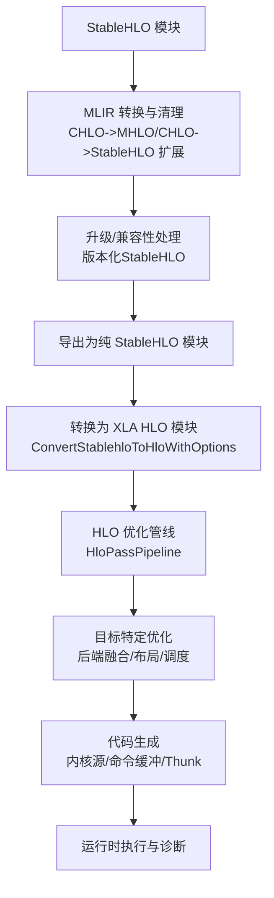
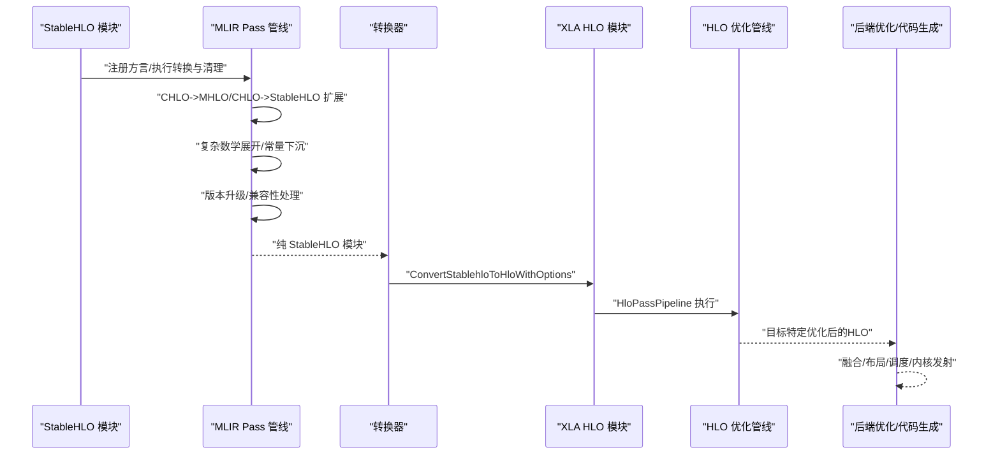
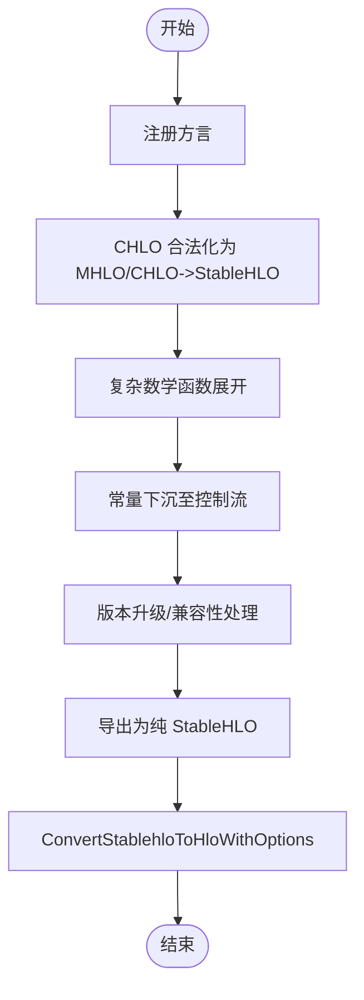
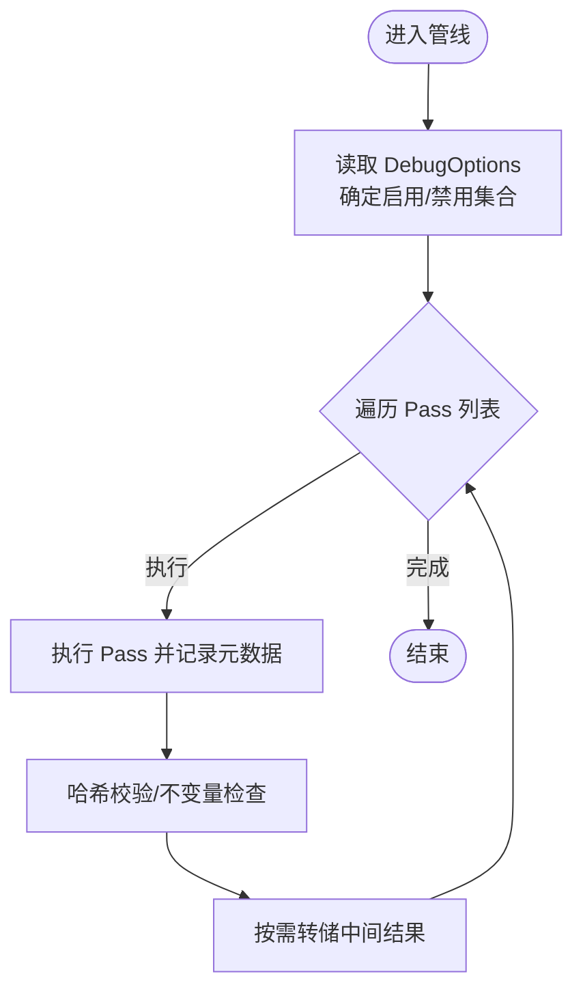
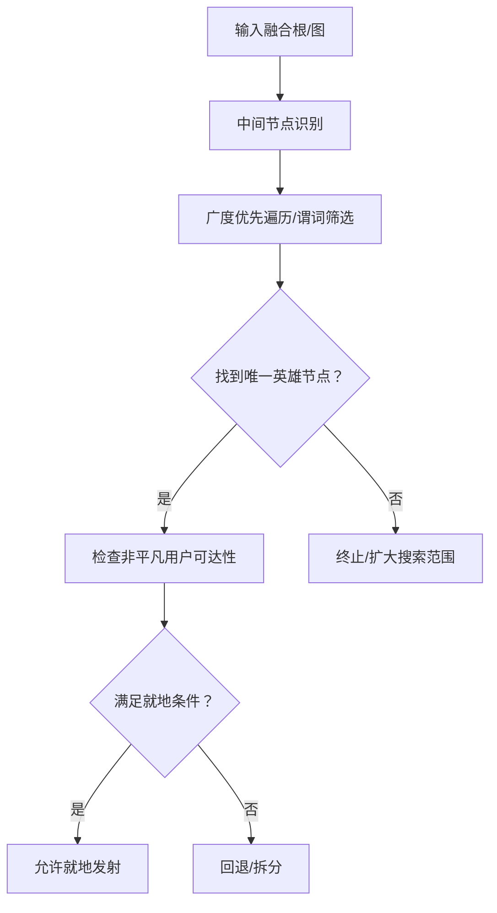
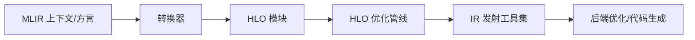

# 编译流水线

<cite>
**本文引用的文件**
- [xla\pjrt\mlir_to_hlo.cc](file://xla/pjrt/mlir_to_hlo.cc)
- [xla\hlo\pass\hlo_pass_pipeline.cc](file://xla/hlo/pass/hlo_pass_pipeline.cc)
- [xla\codegen\ir_emission_utils.cc](file://xla/codegen/ir_emission_utils.cc)
- [xla\mlir_hlo\mhlo\transforms\stablehlo_legalize_to_hlo\stablehlo_legalize_to_hlo_pass.cc](file://xla/mlir_hlo/mhlo/transforms/stablehlo_legalize_to_hlo/stablehlo_legalize_to_hlo_pass.cc)
- [xla\xla.proto](file://xla/xla.proto)
</cite>

## 目录
1. [引言](#引言)
2. [项目结构](#项目结构)
3. [核心组件](#核心组件)
4. [架构总览](#架构总览)
5. [详细组件分析](#详细组件分析)
6. [依赖关系分析](#依赖关系分析)
7. [性能考量](#性能考量)
8. [故障排查指南](#故障排查指南)
9. [结论](#结论)
10. [附录](#附录)

## 引言
本文件系统性梳理XLA从StableHLO到目标机器指令的完整编译流水线，覆盖三大阶段：目标无关的优化与分析、目标特定的优化、目标特定的代码生成。重点阐述以下内容：
- 从StableHLO方言到内部HLO方言的转换机制与路径选择（通过MLIR Pass链）。
- 编译器如何利用MLIR与稳定化序列化能力，确保跨版本兼容与可移植性。
- 在HLO层面的优化管线（Pass Pipeline）如何组织与执行，以及调试选项对流程的影响。
- 关键优化技术在XLA中的落地：公共子表达式消除、操作融合、缓冲区分配与就地更新判定等。
- 与LLVM/后端集成的代码生成路径（以GPU为例），以及与XLA HLO IR的衔接点。

## 项目结构
XLA编译流水线涉及多个层次：
- 前端与中间表示层：StableHLO/CHLO/MHLO/SHardy等MLIR方言与转换Pass。
- 内部HLO模块：XLA的HLO IR与模块化优化管线。
- 目标特定层：CPU/GPU等后端的融合、内核发射与命令缓冲生成。
- 运行时与元数据：执行图、内存分配、调试与诊断。

图表来源
- [xla\pjrt\mlir_to_hlo.cc](file://xla/pjrt/mlir_to_hlo.cc#L96-L178)
- [xla\hlo\pass\hlo_pass_pipeline.cc](file://xla/hlo/pass/hlo_pass_pipeline.cc#L134-L220)
- [xla\mlir_hlo\mhlo\transforms\stablehlo_legalize_to_hlo\stablehlo_legalize_to_hlo_pass.cc](file://xla/mlir_hlo/mhlo/transforms/stablehlo_legalize_to_hlo/stablehlo_legalize_to_hlo_pass.cc#L95-L119)

章节来源
- [xla\pjrt\mlir_to_hlo.cc](file://xla/pjrt/mlir_to_hlo.cc#L85-L178)
- [xla\hlo\pass\hlo_pass_pipeline.cc](file://xla/hlo/pass/hlo_pass_pipeline.cc#L44-L321)
- [xla\mlir_hlo\mhlo\transforms\stablehlo_legalize_to_hlo\stablehlo_legalize_to_hlo_pass.cc](file://xla/mlir_hlo/mhlo/transforms/stablehlo_legalize_to_hlo/stablehlo_legalize_to_hlo_pass.cc#L92-L120)

## 核心组件
- MLIR到XLA HLO转换器：负责注册方言、执行一系列MLIR Pass（CHLO->MHLO、复杂数学扩展、常量下沉、版本升级等），最终调用ConvertStablehloToHloWithOptions生成HLO模块。
- HLO优化管线：统一管理Pass的启用/禁用、按需转储、统计与错误上报，并在每次Pass后执行不变量检查。
- IR发射工具集：提供融合根选择、动态更新切片就地发射判定、中间节点识别等能力，支撑目标特定的融合与内存优化。
- 稳定化序列化与兼容性：通过StableHLO版本化序列化与兼容扩展，保证跨版本插件与框架的兼容性。

章节来源
- [xla\pjrt\mlir_to_hlo.cc](file://xla/pjrt/mlir_to_hlo.cc#L96-L178)
- [xla\hlo\pass\hlo_pass_pipeline.cc](file://xla/hlo/pass/hlo_pass_pipeline.cc#L134-L220)
- [xla\codegen\ir_emission_utils.cc](file://xla/codegen/ir_emission_utils.cc#L42-L112)
- [xla\mlir_hlo\mhlo\transforms\stablehlo_legalize_to_hlo\stablehlo_legalize_to_hlo_pass.cc](file://xla/mlir_hlo/mhlo/transforms/stablehlo_legalize_to_hlo/stablehlo_legalize_to_hlo_pass.cc#L95-L119)

## 架构总览
下图展示从StableHLO到HLO再到后端代码生成的整体流程，以及关键Pass的作用与数据流。

图表来源
- [xla\pjrt\mlir_to_hlo.cc](file://xla/pjrt/mlir_to_hlo.cc#L103-L177)
- [xla\hlo\pass\hlo_pass_pipeline.cc](file://xla/hlo/pass/hlo_pass_pipeline.cc#L134-L220)

## 详细组件分析

### 组件A：StableHLO到HLO的转换与序列化
- 方言注册与上下文构建：在解析与转换前，注册StableHLO、CHLO、MHLO、Shardy等方言，确保后续Pass能正确处理对应操作。
- 转换与清理管线：
  - 将CHLO高阶算子合法化为MHLO或StableHLO。
  - 展开复杂数学函数（如log1p等）。
  - 将常量下沉至控制流区域，满足XLA功能化控制流要求。
  - 版本升级与兼容性扩展，必要时进行反向兼容展开。
- 导出与序列化：
  - 支持将模块导出为纯StableHLO，以便后续HLO导入。
  - 提供版本化StableHLO序列化能力，支持混合方言的可选策略与向前/向后兼容。
- 错误处理与诊断：通过MLIR诊断处理器捕获失败原因，并返回可读的错误信息。

图表来源
- [xla\pjrt\mlir_to_hlo.cc](file://xla/pjrt/mlir_to_hlo.cc#L103-L177)

章节来源
- [xla\pjrt\mlir_to_hlo.cc](file://xla/pjrt/mlir_to_hlo.cc#L85-L178)
- [xla\mlir_hlo\mhlo\transforms\stablehlo_legalize_to_hlo\stablehlo_legalize_to_hlo_pass.cc](file://xla/mlir_hlo/mhlo/transforms/stablehlo_legalize_to_hlo/stablehlo_legalize_to_hlo_pass.cc#L95-L119)

### 组件B：HLO优化管线（目标无关优化）
- 管线组织：根据DebugOptions启用/禁用特定Pass，支持仅执行指定名称的Pass集合；支持全禁用所有HLO Pass。
- 执行与验证：在每次Pass前后记录元数据、转储HLO、执行不变量检查；对“静默变更/无变更却报告变更”进行严格校验。
- 统计与日志：记录每个Pass的耗时、错误码与是否引起变化，便于性能分析与问题定位。

图表来源
- [xla\hlo\pass\hlo_pass_pipeline.cc](file://xla/hlo/pass/hlo_pass_pipeline.cc#L134-L220)

章节来源
- [xla\hlo\pass\hlo_pass_pipeline.cc](file://xla/hlo/pass/hlo_pass_pipeline.cc#L134-L220)

### 组件C：IR发射与融合辅助（目标特定优化）
- 中间节点识别：判断元素级/位变/重塑/转置等“轻量”节点，作为融合候选或旁路。
- 融合根选择：基于广度优先遍历与谓词筛选，寻找合适的“英雄节点”作为融合根。
- 动态更新切片就地发射判定：检查多用户路径、索引一致性、缓冲区切片等约束，决定是否可安全原地更新。

图表来源
- [xla\codegen\ir_emission_utils.cc](file://xla/codegen/ir_emission_utils.cc#L74-L112)
- [xla\codegen\ir_emission_utils.cc](file://xla/codegen/ir_emission_utils.cc#L149-L289)

章节来源
- [xla\codegen\ir_emission_utils.cc](file://xla/codegen/ir_emission_utils.cc#L42-L112)
- [xla\codegen\ir_emission_utils.cc](file://xla/codegen/ir_emission_utils.cc#L149-L289)

### 组件D：稳定化序列化与兼容性
- 版本化序列化：根据请求的目标版本与当前框架版本，选择较小者作为序列化版本，避免前向不兼容。
- 混合方言策略：在允许的情况下，支持混合稳定方言的序列化；否则先导出为纯StableHLO。
- 兼容性扩展：在序列化前执行兼容性展开，确保旧插件可理解。

章节来源
- [xla\pjrt\mlir_to_hlo.cc](file://xla/pjrt/mlir_to_hlo.cc#L284-L361)

## 依赖关系分析
- MLIR与StableHLO/CHLO/MHLO/SHardy方言之间的依赖：转换器在解析与转换前注册所需方言，确保Pass链能正确处理各操作。
- HLO优化管线与调试选项：DebugOptions影响Pass启用/禁用、转储正则、错误行为等，从而改变整个优化流程。
- IR发射工具与HLO模块：融合判定依赖HLO指令树结构与形状信息，缓冲区分配接口用于就地发射决策。

图表来源
- [xla\pjrt\mlir_to_hlo.cc](file://xla/pjrt/mlir_to_hlo.cc#L85-L94)
- [xla\hlo\pass\hlo_pass_pipeline.cc](file://xla/hlo/pass/hlo_pass_pipeline.cc#L222-L276)
- [xla\codegen\ir_emission_utils.cc](file://xla/codegen/ir_emission_utils.cc#L291-L301)

章节来源
- [xla\pjrt\mlir_to_hlo.cc](file://xla/pjrt/mlir_to_hlo.cc#L85-L94)
- [xla\hlo\pass\hlo_pass_pipeline.cc](file://xla/hlo/pass/hlo_pass_pipeline.cc#L222-L276)
- [xla\codegen\ir_emission_utils.cc](file://xla/codegen/ir_emission_utils.cc#L291-L301)

## 性能考量
- Pass粒度与顺序：通过HloPassPipeline按序执行，减少不必要的重复扫描；启用/禁用特定Pass可显著影响编译时间与质量。
- 调试选项成本：开启严格校验（如静默变更检测）会引入额外的哈希计算与不变量检查，建议在性能敏感场景谨慎使用。
- 序列化与兼容性：版本化序列化与兼容展开可能增加转换开销，但能提升跨版本稳定性与可移植性。
- 融合与就地：合理的融合与就地更新可降低内存带宽与临时缓冲，但需要严格的约束检查以避免数据竞争。

## 故障排查指南
- MLIR转换失败：查看转换器中MLIR诊断处理器返回的错误信息，关注CHLO->MHLO/CHLO->StableHLO扩展、复杂数学展开、常量下沉等步骤的失败位置。
- HLO Pass异常：检查HloPassPipeline的错误记录与转储文件名，确认具体是哪个Pass导致失败；结合DebugOptions的启用/禁用列表定位问题。
- 就地发射被拒绝：检查动态更新切片就地发射判定逻辑中的约束（多用户路径、索引一致性、缓冲区切片等），确认是否违反了就地更新的安全条件。
- 版本化序列化错误：确认请求的目标版本与当前框架版本的关系，必要时放宽混合方言策略或进行兼容性展开后再序列化。

章节来源
- [xla\pjrt\mlir_to_hlo.cc](file://xla/pjrt/mlir_to_hlo.cc#L150-L153)
- [xla\hlo\pass\hlo_pass_pipeline.cc](file://xla/hlo/pass/hlo_pass_pipeline.cc#L187-L191)
- [xla\codegen\ir_emission_utils.cc](file://xla/codegen/ir_emission_utils.cc#L149-L289)

## 结论
XLA编译流水线以MLIR为桥梁，将StableHLO转换为内部HLO，再通过标准化的HLO优化管线与目标特定的融合/代码生成实现高效执行。关键优化技术（如融合、就地更新、Pass级不变量检查）贯穿全流程，配合稳定化序列化与兼容性处理，确保在不同后端与版本间的可移植性与可靠性。实践中应结合DebugOptions与转储机制，持续优化Pass组合与融合策略，以获得最佳的编译性能与运行时效率。

## 附录
- 关键配置项参考：DebugOptions中包含大量与编译/调试相关的标志位，可用于控制Pass启用、转储、严格性与后端特性等。例如：
  - 后端无关选项：如xla_enable_hlo_sharding_v3、xla_unsupported_crash_on_hlo_pass_silent_hlo_change等。
  - 后端特定选项：如CPU调度类型、库融合类型、XNN图融合模式等。

章节来源
- [xla\xla.proto](file://xla/xla.proto#L148-L200)