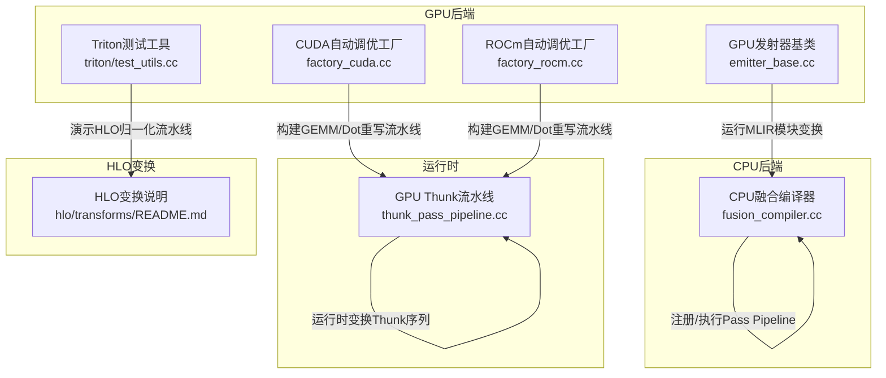
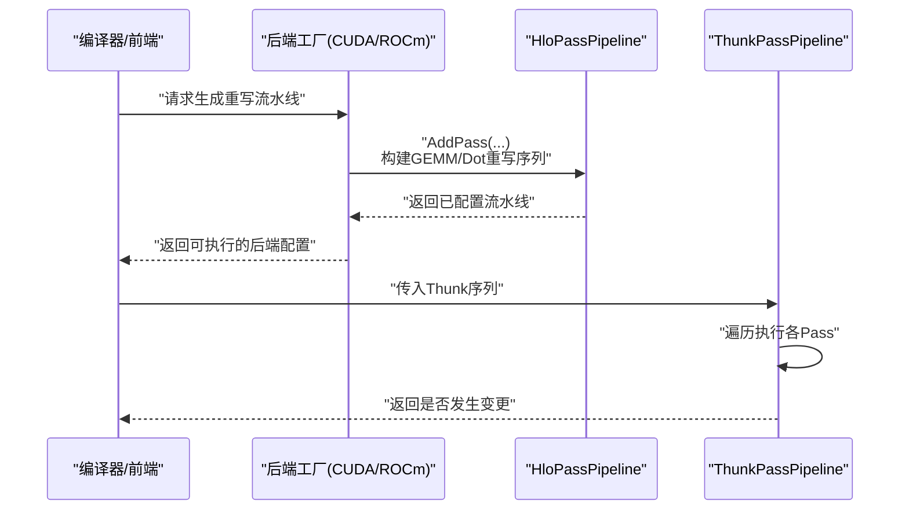
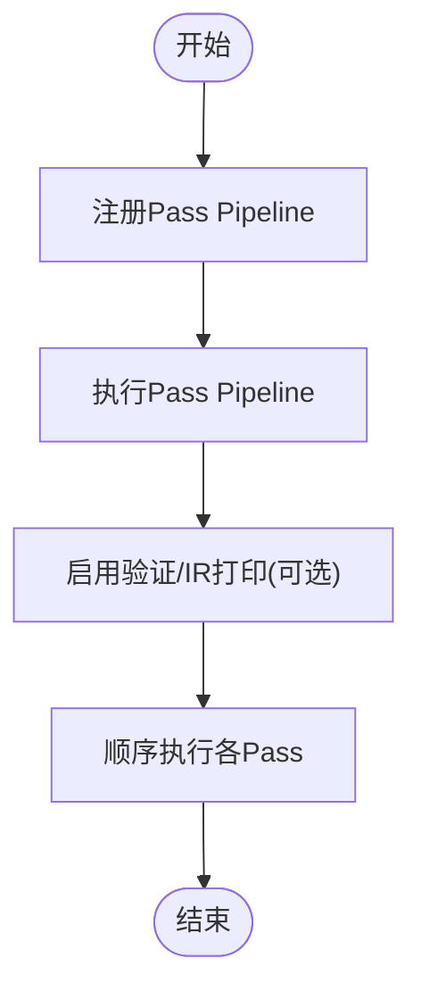
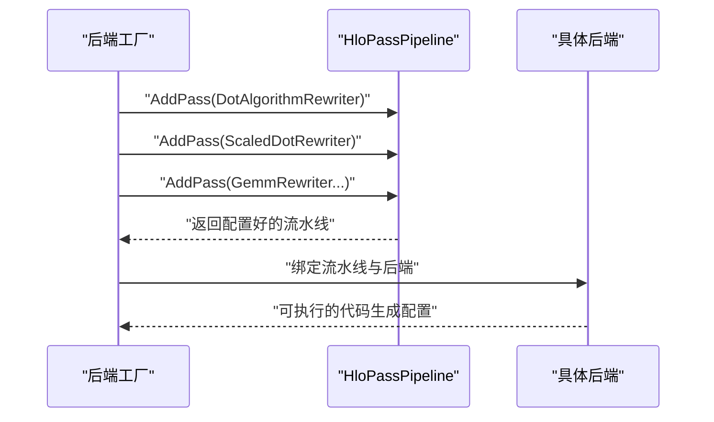
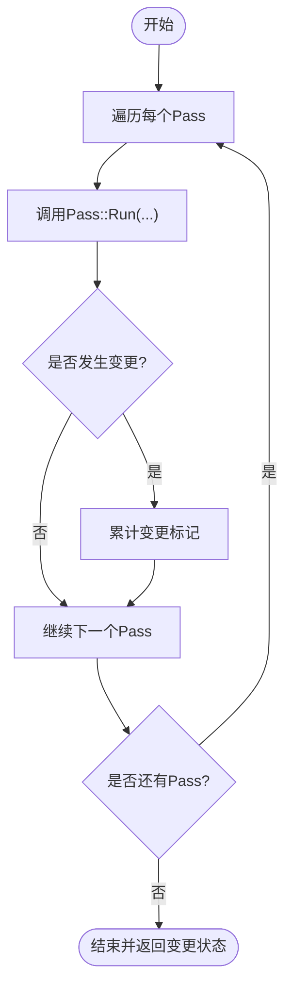
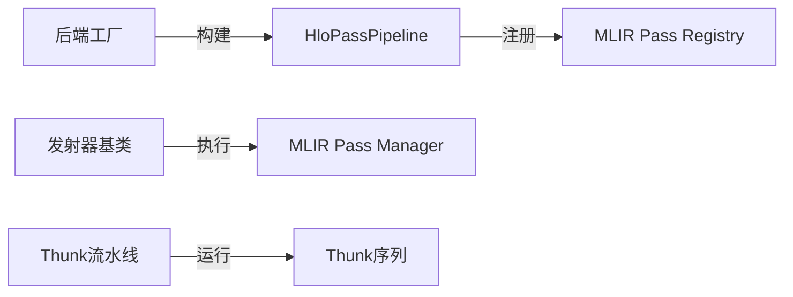

# HLO变换流水线

<cite>
**本文引用的文件**
- [xla\hlo\transforms\README.md](file://xla\hlo\transforms\README.md)
- [xla\backends\cpu\codegen\fusion_compiler.cc](file://xla\backends\cpu\codegen\fusion_compiler.cc)
- [xla\backends\gpu\autotuner\factory_cuda.cc](file://xla\backends\gpu\autotuner\factory_cuda.cc)
- [xla\backends\gpu\autotuner\factory_rocm.cc](file://xla\backends\gpu\autotuner\factory_rocm.cc)
- [xla\backends\gpu\runtime\thunk_pass_pipeline.cc](file://xla\backends\gpu\runtime\thunk_pass_pipeline.cc)
- [xla\backends\gpu\codegen\emitters\emitter_base.cc](file://xla\backends\gpu\codegen\emitters\emitter_base.cc)
- [xla\backends\gpu\codegen\triton\test_utils.cc](file://xla\backends\gpu\codegen\triton\test_utils.cc)
- [xla\backends\gpu\autotuner\fission_backend_test.cc](file://xla\backends\gpu\autotuner\fission_backend_test.cc)
</cite>

## 目录
1. [简介](#简介)
2. [项目结构](#项目结构)
3. [核心组件](#核心组件)
4. [架构总览](#架构总览)
5. [详细组件分析](#详细组件分析)
6. [依赖分析](#依赖分析)
7. [性能考虑](#性能考虑)
8. [故障排查指南](#故障排查指南)
9. [结论](#结论)

## 简介
本文件系统性梳理XLA中HLO变换流水线的设计与实现，覆盖编译前、编译后与运行时三大阶段的流水线类型、构建方式、配置参数、执行顺序、依赖关系与终止条件，并给出性能优化与调试技巧。重点参考文件包括CPU/GPU后端的融合编译器、GPU自动调优工厂、运行时Thunk流水线以及相关测试与工具。

## 项目结构
围绕HLO变换流水线的关键代码分布在以下模块：
- 后端通用：CPU融合编译器（Pass Pipeline注册与执行）
- GPU后端：CUDA/ROCm自动调优工厂（基于不同后端的重写流水线）
- 运行时：GPU Thunk流水线（运行时对Thunk序列进行变换）
- 工具与测试：用于验证与演示的测试工具与示例

**图示来源**
- [xla\backends\cpu\codegen\fusion_compiler.cc](file://xla\backends\cpu\codegen\fusion_compiler.cc#L135-L200)
- [xla\backends\gpu\autotuner\factory_cuda.cc](file://xla\backends\gpu\autotuner\factory_cuda.cc#L54-L80)
- [xla\backends\gpu\autotuner\factory_rocm.cc](file://xla\backends\gpu\autotuner\factory_rocm.cc#L53-L72)
- [xla\backends\gpu\codegen\emitters\emitter_base.cc](file://xla\backends\gpu\codegen\emitters\emitter_base.cc#L186-L388)
- [xla\backends\gpu\codegen\triton\test_utils.cc](file://xla\backends\gpu\codegen\triton\test_utils.cc#L153-L153)
- [xla\backends\gpu\runtime\thunk_pass_pipeline.cc](file://xla\backends\gpu\runtime\thunk_pass_pipeline.cc#L32-L46)
- [xla\hlo\transforms\README.md](file://xla\hlo\transforms\README.md#L1-L1)

**章节来源**
- [xla\hlo\transforms\README.md](file://xla\hlo\transforms\README.md#L1-L1)
- [xla\backends\cpu\codegen\fusion_compiler.cc](file://xla\backends\cpu\codegen\fusion_compiler.cc#L135-L200)
- [xla\backends\gpu\autotuner\factory_cuda.cc](file://xla\backends\gpu\autotuner\factory_cuda.cc#L54-L80)
- [xla\backends\gpu\autotuner\factory_rocm.cc](file://xla\backends\gpu\autotuner\factory_rocm.cc#L53-L72)
- [xla\backends\gpu\runtime\thunk_pass_pipeline.cc](file://xla\backends\gpu\runtime\thunk_pass_pipeline.cc#L32-L46)
- [xla\backends\gpu\codegen\emitters\emitter_base.cc](file://xla\backends\gpu\codegen\emitters\emitter_base.cc#L186-L388)
- [xla\backends\gpu\codegen\triton\test_utils.cc](file://xla\backends\gpu\codegen\triton\test_utils.cc#L153-L153)

## 核心组件
- Pass Pipeline注册与执行框架
  - 在CPU融合编译器中，通过统一接口注册命名的Pass Pipeline，并在需要时执行，支持可选的IR打印与验证级别控制。
- GPU后端重写流水线
  - CUDA/ROCm工厂根据设备能力与选项构建GEMM/Dot算法重写流水线，包含算法选择、缩放点积重写与具体GEMM重写器。
- 运行时Thunk流水线
  - 对Thunk序列按序执行变换Pass，返回是否发生变更，便于短路与增量优化。
- MLIR模块级变换与发射
  - 发射器基类封装了在特定HLO模块上运行Pass Pipeline的流程，支持阶段化转储与跟踪。

**章节来源**
- [xla\backends\cpu\codegen\fusion_compiler.cc](file://xla\backends\cpu\codegen\fusion_compiler.cc#L135-L200)
- [xla\backends\gpu\autotuner\factory_cuda.cc](file://xla\backends\gpu\autotuner\factory_cuda.cc#L54-L80)
- [xla\backends\gpu\autotuner\factory_rocm.cc](file://xla\backends\gpu\autotuner\factory_rocm.cc#L53-L72)
- [xla\backends\gpu\runtime\thunk_pass_pipeline.cc](file://xla\backends\gpu\runtime\thunk_pass_pipeline.cc#L32-L46)
- [xla\backends\gpu\codegen\emitters\emitter_base.cc](file://xla\backends\gpu\codegen\emitters\emitter_base.cc#L186-L388)

## 架构总览
下图展示从高层视角看，HLO变换流水线在编译期与运行时的交互关系：编译期由后端工厂生成针对硬件的重写流水线；运行时对Thunk序列进行进一步变换以适配目标设备。

**图示来源**
- [xla\backends\gpu\autotuner\factory_cuda.cc](file://xla\backends\gpu\autotuner\factory_cuda.cc#L54-L80)
- [xla\backends\gpu\autotuner\factory_rocm.cc](file://xla\backends\gpu\autotuner\factory_rocm.cc#L53-L72)
- [xla\backends\gpu\runtime\thunk_pass_pipeline.cc](file://xla\backends\gpu\runtime\thunk_pass_pipeline.cc#L32-L46)

## 详细组件分析

### 组件A：CPU融合编译器的Pass Pipeline
- 职责
  - 注册命名的Pass Pipeline，提供统一的回调注册与选项处理接口。
  - 执行Pass Pipeline，支持可选的IR打印与验证级别控制，便于调试与诊断。
- 关键流程
  - 注册阶段：通过回调函数向OpPassManager注入一系列Pass。
  - 执行阶段：启用验证、IR打印（调试级别），并执行Pass序列。
- 变换顺序与终止条件
  - 顺序：由注册时的Pass添加顺序决定；执行时逐个Pass顺序运行。
  - 终止：单次执行通常在所有Pass完成后结束；若需多次迭代，应在上层逻辑中循环调用。
- 性能与调试
  - 高日志级别下禁用多线程以保证输出一致性。
  - 可开启验证器与IR打印，但会增加开销。

**图示来源**
- [xla\backends\cpu\codegen\fusion_compiler.cc](file://xla\backends\cpu\codegen\fusion_compiler.cc#L135-L200)

**章节来源**
- [xla\backends\cpu\codegen\fusion_compiler.cc](file://xla\backends\cpu\codegen\fusion_compiler.cc#L135-L200)

### 组件B：GPU后端工厂的重写流水线
- 职责
  - 基于设备描述与选项（如是否启用cuBLASLt）构建针对GEMM/Dot的重写流水线。
  - 支持多种后端组合（如cuDNN、cuBLAS、Triton、Fission等），并通过Allowlist控制可用后端。
- 关键流程
  - 构建重写流水线：添加算法选择、缩放点积重写、GEMM重写器等。
  - 组装后端：将重写流水线与具体后端（如FissionBackend）绑定，形成可执行的代码生成路径。
- 变换顺序与终止条件
  - 顺序：算法选择 → 缩放点积重写 → GEMM重写器（按注册顺序）。
  - 终止：单次流水线执行完成即终止；若需进一步优化，可在上层引入迭代或分阶段策略。
- 性能与调试
  - 不同后端组合影响吞吐与内存占用，建议结合设备能力与算子特性选择最优组合。
  - 可通过Allowlist固定后端顺序，确保测试稳定性。

**图示来源**
- [xla\backends\gpu\autotuner\factory_cuda.cc](file://xla\backends\gpu\autotuner\factory_cuda.cc#L54-L80)
- [xla\backends\gpu\autotuner\factory_rocm.cc](file://xla\backends\gpu\autotuner\factory_rocm.cc#L53-L72)

**章节来源**
- [xla\backends\gpu\autotuner\factory_cuda.cc](file://xla\backends\gpu\autotuner\factory_cuda.cc#L54-L80)
- [xla\backends\gpu\autotuner\factory_rocm.cc](file://xla\backends\gpu\autotuner\factory_rocm.cc#L53-L72)

### 组件C：运行时Thunk流水线
- 职责
  - 对给定的Thunk序列按序执行变换Pass，返回是否发生变更，便于短路与增量优化。
- 关键流程
  - 遍历passes_列表，依次调用每个Pass的Run方法。
  - 汇总每个Pass的变更结果，最终返回整体是否发生变化。
- 变换顺序与终止条件
  - 顺序：按passes_中定义的顺序执行。
  - 终止：当前批次执行完毕；若需多次迭代，应在上层逻辑中循环。
- 性能与调试
  - 单次执行成本低，适合在运行时做轻量级优化。
  - 可通过日志查看当前执行的Pass名称，辅助定位问题。

**图示来源**
- [xla\backends\gpu\runtime\thunk_pass_pipeline.cc](file://xla\backends\gpu\runtime\thunk_pass_pipeline.cc#L32-L46)

**章节来源**
- [xla\backends\gpu\runtime\thunk_pass_pipeline.cc](file://xla\backends\gpu\runtime\thunk_pass_pipeline.cc#L32-L46)

### 组件D：MLIR模块级变换与发射
- 职责
  - 在特定HLO模块上运行Pass Pipeline，支持阶段化转储与跟踪，便于调试与可视化。
- 关键流程
  - 将MLIR模块传递给Pass Manager，按注册的Pipeline执行。
  - 在关键阶段转储模块内容，便于对比前后差异。
- 变换顺序与终止条件
  - 顺序：由Pipeline注册时的Pass顺序决定。
  - 终止：模块级Pipeline执行完成后结束。
- 性能与调试
  - 转储功能有助于定位问题，但会带来I/O开销，建议仅在调试时启用。

**章节来源**
- [xla\backends\gpu\codegen\emitters\emitter_base.cc](file://xla\backends\gpu\codegen\emitters\emitter_base.cc#L186-L388)

### 组件E：HLO变换流水线示例与测试
- 流水线示例
  - Triton测试工具中演示了“HLO浮点数归一化”流水线，展示了如何组织与运行一组变换Pass。
- 测试与验证
  - fission后端测试中提供了多个重写流水线的构造与使用示例，便于理解不同场景下的流水线配置。

**章节来源**
- [xla\backends\gpu\codegen\triton\test_utils.cc](file://xla\backends\gpu\codegen\triton\test_utils.cc#L153-L153)
- [xla\backends\gpu\autotuner\fission_backend_test.cc](file://xla\backends\gpu\autotuner\fission_backend_test.cc#L226-L244)

## 依赖分析
- 组件耦合
  - 后端工厂依赖HloPassPipeline接口以构建重写流水线。
  - 运行时Thunk流水线独立于编译期流水线，但两者均面向HLO/Thunk的变换。
  - 发射器基类负责在MLIR模块层面执行变换，与编译期流水线协同工作。
- 外部依赖
  - MLIR Pass Registry与Pass Manager用于注册与执行Pass。
  - 设备描述信息用于决定重写策略（如是否启用特定算法）。

**图示来源**
- [xla\backends\gpu\autotuner\factory_cuda.cc](file://xla\backends\gpu\autotuner\factory_cuda.cc#L54-L80)
- [xla\backends\gpu\codegen\emitters\emitter_base.cc](file://xla\backends\gpu\codegen\emitters\emitter_base.cc#L186-L388)
- [xla\backends\gpu\runtime\thunk_pass_pipeline.cc](file://xla\backends\gpu\runtime\thunk_pass_pipeline.cc#L32-L46)

**章节来源**
- [xla\backends\gpu\autotuner\factory_cuda.cc](file://xla\backends\gpu\autotuner\factory_cuda.cc#L54-L80)
- [xla\backends\gpu\codegen\emitters\emitter_base.cc](file://xla\backends\gpu\codegen\emitters\emitter_base.cc#L186-L388)
- [xla\backends\gpu\runtime\thunk_pass_pipeline.cc](file://xla\backends\gpu\runtime\thunk_pass_pipeline.cc#L32-L46)

## 性能考虑
- 流水线长度与复杂度
  - Pass数量越多，执行时间越长；应按需裁剪，避免冗余Pass。
- 验证与IR打印
  - 调试时开启验证与IR打印有助于定位问题，但会显著增加开销；生产环境建议关闭。
- 设备相关优化
  - 后端工厂会依据设备能力选择合适的算法与后端组合；优先选择与算子匹配度高的组合。
- 运行时优化
  - Thunk流水线适合轻量级运行时优化，可作为编译期优化的补充。

## 故障排查指南
- 调试日志
  - 在高日志级别下禁用多线程，确保输出一致；通过阶段化转储对比前后差异。
- 验证失败
  - 开启验证器可帮助发现IR不一致问题；必要时降低并发或关闭IR打印以排除干扰。
- 后端选择
  - 使用Allowlist固定后端顺序，减少不确定性；在测试环境中保持稳定。
- 运行时问题
  - 通过日志查看当前执行的Pass名称，定位具体环节；若Pass返回未变更，检查输入是否已满足期望形态。

**章节来源**
- [xla\backends\cpu\codegen\fusion_compiler.cc](file://xla\backends\cpu\codegen\fusion_compiler.cc#L188-L200)
- [xla\backends\gpu\runtime\thunk_pass_pipeline.cc](file://xla\backends\gpu\runtime\thunk_pass_pipeline.cc#L32-L46)

## 结论
HLO变换流水线在XLA中贯穿编译期与运行时，分别承担算法重写、算子融合与运行时优化的任务。通过统一的Pass Pipeline注册与执行框架，结合后端工厂的设备感知配置，能够灵活地构建面向不同硬件与算子特性的优化流水线。实践中应关注流水线长度、验证与IR打印的成本，并利用阶段化转储与日志进行高效调试。