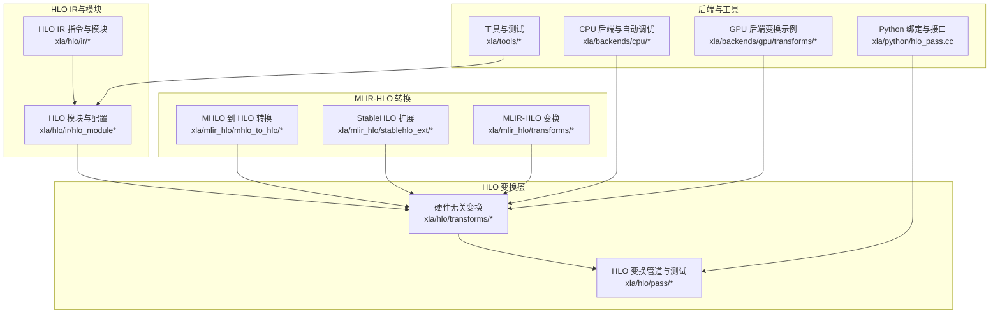
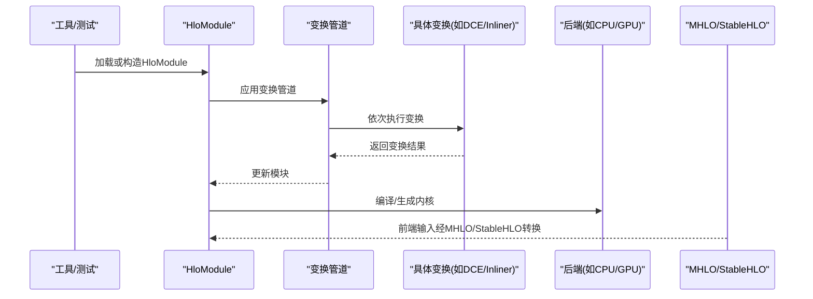
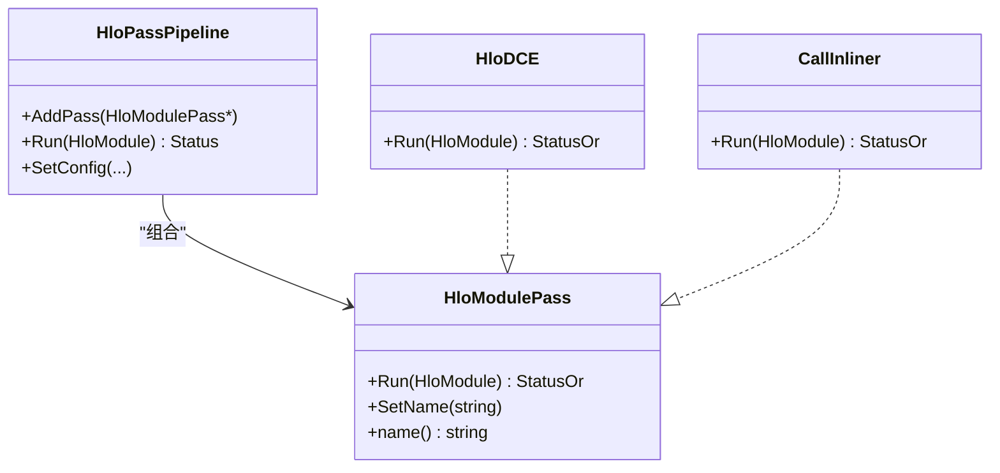
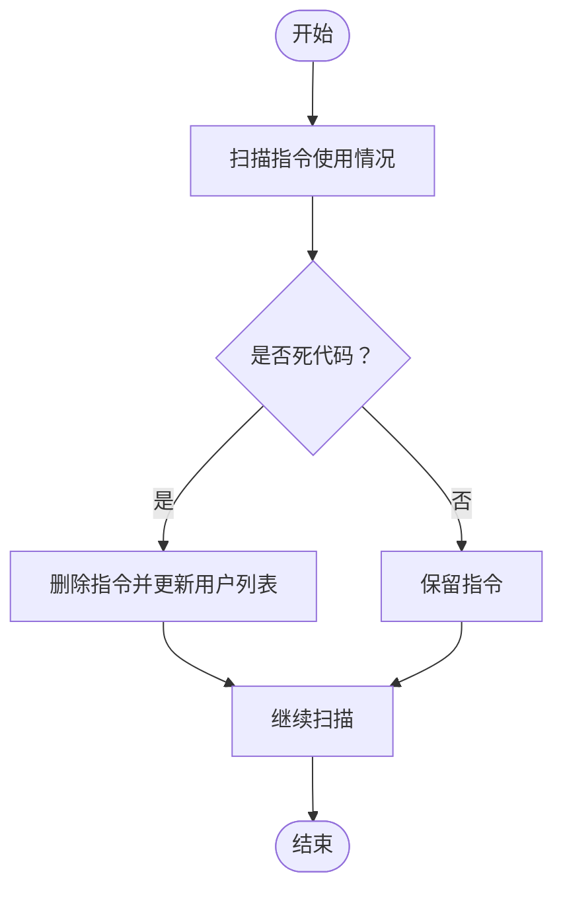
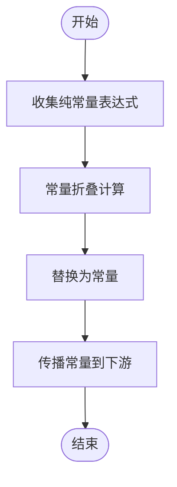
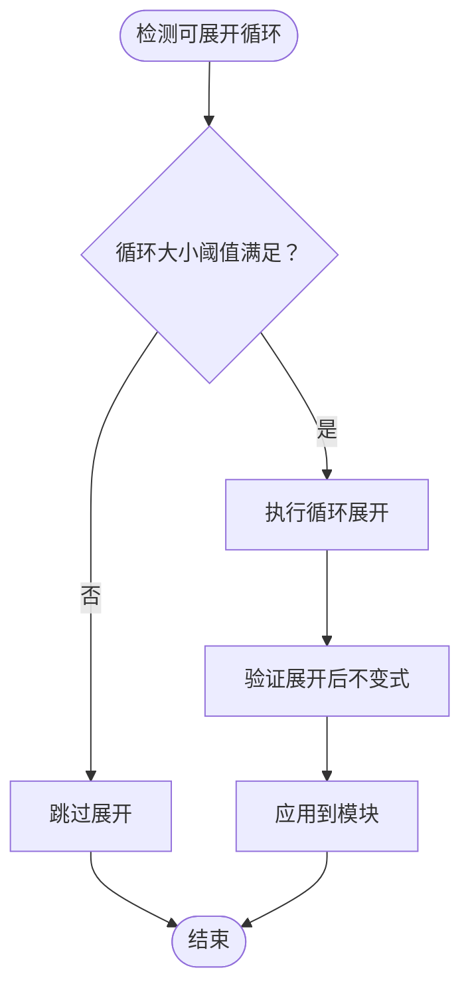
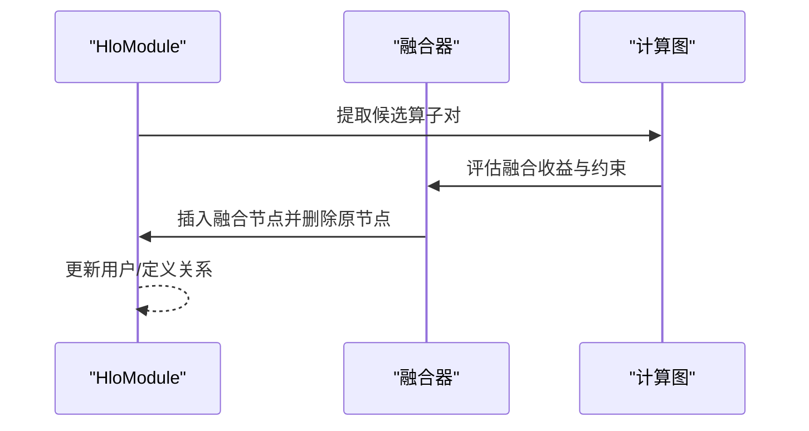
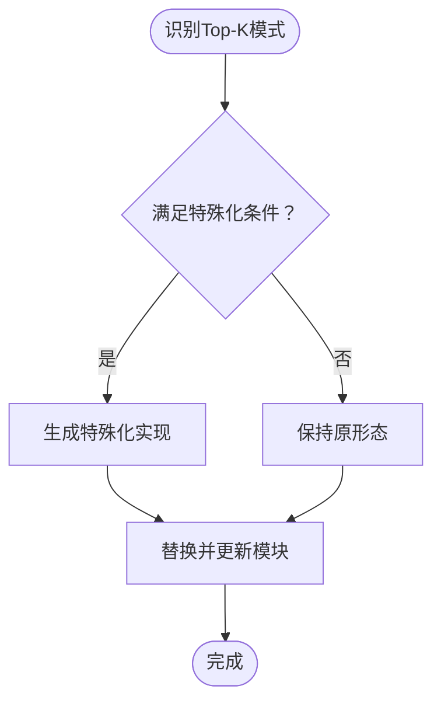
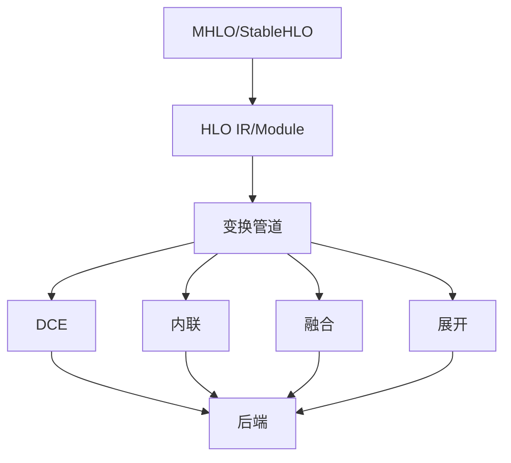

# HLO变换系统

<cite>
**本文档引用的文件**
- [xla/hlo/transforms/README.md](file://xla/hlo/transforms/README.md)
- [xla/python/hlo_pass.cc](file://xla/python/hlo_pass.cc)
- [xla/hlo/pass/hlo_pass_pipeline_test.cc](file://xla/hlo/pass/hlo_pass_pipeline_test.cc)
- [xla/backends/gpu/transforms/topk_specializer_test.cc](file://xla/backends/gpu/transforms/topk_specializer_test.cc)
- [xla/codegen/testlib/kernel_runner_extension.cc](file://xla/codegen/testlib/kernel_runner_extension.cc)
- [xla/service/hlo_module_test.cc](file://xla/service/hlo_module_test.cc)
- [xla/tools/run_hlo_module_bin_test.cc](file://xla/tools/run_hlo_module_bin_test.cc)
- [xla/backends/cpu/autotuner/llvm_kernel_backend.cc](file://xla/backends/cpu/autotuner/llvm_kernel_backend.cc)
- [xla/backends/cpu/autotuner/llvm_kernel_backend_test.cc](file://xla/backends/cpu/autotuner/llvm_kernel_backend_test.cc)
- [xla/hlo/ir/hlo_module_test.cc](file://xla/hlo/ir/hlo_module_test.cc)
- [xla/hlo/pass/hlo_pass_fix_test.cc](file://xla/hlo/pass/hlo_pass_fix_test.cc)
- [xla/mlir_hlo/transforms/README.md](file://xla/mlir_hlo/transforms/README.md)
- [xla/mlir_hlo/mhlo_to_hlo/README.md](file://xla/mlir_hlo/mhlo_to_hlo/README.md)
- [xla/mlir_hlo/stablehlo_ext/README.md](file://xla/mlir_hlo/stablehlo_ext/README.md)
</cite>

## 目录
1. [简介](#简介)
2. [项目结构](#项目结构)
3. [核心组件](#核心组件)
4. [架构总览](#架构总览)
5. [详细组件分析](#详细组件分析)
6. [依赖关系分析](#依赖关系分析)
7. [性能考量](#性能考量)
8. [故障排查指南](#故障排查指南)
9. [结论](#结论)
10. [附录](#附录)

## 简介
本文件面向HLO（High-Level Optimizer）变换系统，系统性梳理其变换规则、优化策略与实现机制，覆盖常量折叠、死代码消除、循环展开、融合操作等关键主题；并给出简化器、展开器、变换器的设计原理、实现细节与扩展接口，帮助开发者在XLA中进行自定义变换的开发与集成。

## 项目结构
XLA的HLO变换体系由多层组成：硬件无关的HLO变换（位于xla/hlo/transforms）、MLIR-HLO转换与扩展（位于xla/mlir_hlo）、以及后端特定的变换与测试（如GPU、CPU）。下图展示与HLO变换相关的主要模块及其职责：

图表来源
- [xla/hlo/transforms/README.md](file://xla/hlo/transforms/README.md#L1-L1)
- [xla/python/hlo_pass.cc](file://xla/python/hlo_pass.cc#L38-L49)
- [xla/mlir_hlo/transforms/README.md](file://xla/mlir_hlo/transforms/README.md)
- [xla/mlir_hlo/mhlo_to_hlo/README.md](file://xla/mlir_hlo/mhlo_to_hlo/README.md)
- [xla/mlir_hlo/stablehlo_ext/README.md](file://xla/mlir_hlo/stablehlo_ext/README.md)

章节来源
- [xla/hlo/transforms/README.md](file://xla/hlo/transforms/README.md#L1-L1)
- [xla/python/hlo_pass.cc](file://xla/python/hlo_pass.cc#L38-L49)

## 核心组件
- HLO模块与指令：HLO模块承载计算图，包含计算单元（computation）与指令序列；模块配置控制变换与编译行为。
- 变换接口与管道：通过HloModulePass接口定义变换，使用管道组合多个变换以实现复杂优化序列。
- MLIR-HLO桥接：MHLO/StableHLO到HLO的转换，使上层前端（如JAX、TensorFlow）产出的中间表示可被XLA处理。
- 后端特定变换：CPU/GPU后端针对目标硬件特性定制的变换与自动调优逻辑。
- Python绑定：为变换提供Python侧接口，便于脚本化与调试。

章节来源
- [xla/codegen/testlib/kernel_runner_extension.cc](file://xla/codegen/testlib/kernel_runner_extension.cc#L361-L364)
- [xla/python/hlo_pass.cc](file://xla/python/hlo_pass.cc#L38-L49)
- [xla/service/hlo_module_test.cc](file://xla/service/hlo_module_test.cc#L82-L82)
- [xla/tools/run_hlo_module_bin_test.cc](file://xla/tools/run_hlo_module_bin_test.cc#L62-L62)

## 架构总览
下图展示了从模块加载到变换执行的整体流程，以及与MLIR-HLO的衔接点：

图表来源
- [xla/tools/run_hlo_module_bin_test.cc](file://xla/tools/run_hlo_module_bin_test.cc#L62-L62)
- [xla/python/hlo_pass.cc](file://xla/python/hlo_pass.cc#L38-L49)
- [xla/backends/cpu/autotuner/llvm_kernel_backend.cc](file://xla/backends/cpu/autotuner/llvm_kernel_backend.cc#L46-L84)

## 详细组件分析

### 变换接口与管道设计
- 接口抽象：HloModulePass定义了模块级变换的统一接口，支持查询、验证与执行。
- 管道组合：通过管道将多个变换按序执行，形成可配置的优化流水线。
- 测试与验证：提供丰富的测试样例，验证变换顺序、副作用与正确性。

图表来源
- [xla/python/hlo_pass.cc](file://xla/python/hlo_pass.cc#L38-L49)
- [xla/hlo/pass/hlo_pass_pipeline_test.cc](file://xla/hlo/pass/hlo_pass_pipeline_test.cc#L50-L116)

章节来源
- [xla/python/hlo_pass.cc](file://xla/python/hlo_pass.cc#L38-L49)
- [xla/hlo/pass/hlo_pass_pipeline_test.cc](file://xla/hlo/pass/hlo_pass_pipeline_test.cc#L50-L116)

### 死代码消除（DCE）
- 触发条件：存在不可达或无副作用且不被输出使用的指令。
- 应用顺序：通常在融合、内联之后执行，避免误删活跃数据。
- 效果评估：减少内存占用与计算开销，提升后续变换效率。

图表来源
- [xla/python/hlo_pass.cc](file://xla/python/hlo_pass.cc#L45-L45)

章节来源
- [xla/python/hlo_pass.cc](file://xla/python/hlo_pass.cc#L45-L45)

### 常量折叠
- 触发条件：表达式仅由常量与确定性算子构成。
- 应用顺序：在DCE之前，尽早消除冗余计算。
- 效果评估：降低运行时开销，减少中间值存储。

图表来源
- [xla/hlo/pass/hlo_pass_fix_test.cc](file://xla/hlo/pass/hlo_pass_fix_test.cc#L44-L44)

章节来源
- [xla/hlo/pass/hlo_pass_fix_test.cc](file://xla/hlo/pass/hlo_pass_fix_test.cc#L44-L44)

### 循环展开与展开器
- 触发条件：循环体小且可预测，展开能带来并行度与减少分支。
- 应用顺序：在融合与布局优化之后，避免破坏已有的并行结构。
- 效果评估：减少循环开销，提高指令级并行度；需权衡寄存器压力。

图表来源
- [xla/backends/cpu/autotuner/llvm_kernel_backend.cc](file://xla/backends/cpu/autotuner/llvm_kernel_backend.cc#L65-L84)
- [xla/backends/cpu/autotuner/llvm_kernel_backend_test.cc](file://xla/backends/cpu/autotuner/llvm_kernel_backend_test.cc#L117-L164)

章节来源
- [xla/backends/cpu/autotuner/llvm_kernel_backend.cc](file://xla/backends/cpu/autotuner/llvm_kernel_backend.cc#L65-L84)
- [xla/backends/cpu/autotuner/llvm_kernel_backend_test.cc](file://xla/backends/cpu/autotuner/llvm_kernel_backend_test.cc#L117-L164)

### 融合操作（Fusion）
- 触发条件：相邻算子间存在共享数据访问，融合可减少内存往返。
- 应用顺序：在布局与并行化之后，确保融合后的节点仍可高效调度。
- 效果评估：提升缓存命中率与吞吐，需注意融合粒度与寄存器压力。

图表来源
- [xla/backends/cpu/autotuner/llvm_kernel_backend.cc](file://xla/backends/cpu/autotuner/llvm_kernel_backend.cc#L46-L54)

章节来源
- [xla/backends/cpu/autotuner/llvm_kernel_backend.cc](file://xla/backends/cpu/autotuner/llvm_kernel_backend.cc#L46-L54)

### 特殊化变换示例（Top-K）
- 触发条件：特定算子模式（如Top-K）需要特殊处理以匹配后端实现。
- 应用顺序：在通用变换之后，保证特殊化不会破坏其他优化。
- 效果评估：提升特定算子的执行效率与兼容性。

图表来源
- [xla/backends/gpu/transforms/topk_specializer_test.cc](file://xla/backends/gpu/transforms/topk_specializer_test.cc#L113-L113)

章节来源
- [xla/backends/gpu/transforms/topk_specializer_test.cc](file://xla/backends/gpu/transforms/topk_specializer_test.cc#L113-L113)

### MLIR-HLO桥接与扩展
- MHLO到HLO：将MHLO/StableHLO转换为XLA内部HLO，以便统一的变换与编译。
- 扩展能力：通过稳定扩展接口支持新语义与后端特性。
- 变换集成：MLIR层的变换与XLA变换层协同工作。

图表来源
- [xla/mlir_hlo/mhlo_to_hlo/README.md](file://xla/mlir_hlo/mhlo_to_hlo/README.md)
- [xla/mlir_hlo/stablehlo_ext/README.md](file://xla/mlir_hlo/stablehlo_ext/README.md)
- [xla/mlir_hlo/transforms/README.md](file://xla/mlir_hlo/transforms/README.md)

章节来源
- [xla/mlir_hlo/mhlo_to_hlo/README.md](file://xla/mlir_hlo/mhlo_to_hlo/README.md)
- [xla/mlir_hlo/stablehlo_ext/README.md](file://xla/mlir_hlo/stablehlo_ext/README.md)
- [xla/mlir_hlo/transforms/README.md](file://xla/mlir_hlo/transforms/README.md)

## 依赖关系分析
- 模块依赖：HLO IR与模块是所有变换的基础；变换层依赖模块提供的遍历与修改接口。
- 管道依赖：变换管道负责编排多个变换的执行顺序与状态传递。
- 后端依赖：后端特定变换依赖模块布局、并行化信息与目标硬件特性。
- MLIR依赖：MHLO/StableHLO转换器与扩展为XLA提供前端兼容性。

图表来源
- [xla/python/hlo_pass.cc](file://xla/python/hlo_pass.cc#L38-L49)
- [xla/backends/cpu/autotuner/llvm_kernel_backend.cc](file://xla/backends/cpu/autotuner/llvm_kernel_backend.cc#L46-L84)
- [xla/mlir_hlo/mhlo_to_hlo/README.md](file://xla/mlir_hlo/mhlo_to_hlo/README.md)

章节来源
- [xla/python/hlo_pass.cc](file://xla/python/hlo_pass.cc#L38-L49)
- [xla/backends/cpu/autotuner/llvm_kernel_backend.cc](file://xla/backends/cpu/autotuner/llvm_kernel_backend.cc#L46-L84)

## 性能考量
- 变换顺序的重要性：错误的顺序可能导致重复工作或破坏优化效果。例如，先做常量折叠再做DCE，可显著减少后续扫描的工作量。
- 展开与融合的权衡：循环展开会增加指令体积，需结合寄存器与缓存限制综合评估；融合能减少访存但可能增大寄存器压力。
- 后端特性：CPU/GPU后端对并行度、向量化、内存层次有不同要求，应根据目标平台调整变换策略。
- MLIR桥接成本：MHLO/StableHLO转换与验证会引入额外开销，应在必要时启用。

## 故障排查指南
- 变换失败定位：通过管道日志与断言，确认具体哪个变换返回失败或产生非法状态。
- 使用测试基类：继承HloHardwareIndependentTestBase等测试基类，快速复现问题并隔离影响范围。
- 模块状态检查：利用HloModule的缓存条目与配置项，验证变换前后模块一致性。
- 后端回归：针对后端特定变换（如Top-K特殊化），编写针对性测试用例，确保兼容性。

章节来源
- [xla/hlo/ir/hlo_module_test.cc](file://xla/hlo/ir/hlo_module_test.cc#L1458-L1458)
- [xla/service/hlo_module_test.cc](file://xla/service/hlo_module_test.cc#L82-L82)
- [xla/backends/gpu/transforms/topk_specializer_test.cc](file://xla/backends/gpu/transforms/topk_specializer_test.cc#L113-L113)

## 结论
XLA的HLO变换系统通过模块化、可组合的变换接口与管道，实现了从常量折叠、死代码消除到循环展开与融合的全栈优化。配合MLIR-HLO桥接与后端特定优化，系统在跨平台与高性能之间取得平衡。开发者可通过统一接口扩展自定义变换，并借助测试与工具链保障质量与性能。

## 附录
- 扩展接口与自定义变换开发指南
  - 实现HloModulePass接口，定义Run方法与名称。
  - 在测试中使用HloPassPipeline添加并验证变换顺序与效果。
  - 针对后端特性，参考CPU/GPU示例实现特殊化或自动调优逻辑。
  - 通过Python绑定导出接口，便于脚本化与调试。

章节来源
- [xla/python/hlo_pass.cc](file://xla/python/hlo_pass.cc#L38-L49)
- [xla/hlo/pass/hlo_pass_pipeline_test.cc](file://xla/hlo/pass/hlo_pass_pipeline_test.cc#L50-L116)
- [xla/backends/gpu/transforms/topk_specializer_test.cc](file://xla/backends/gpu/transforms/topk_specializer_test.cc#L113-L113)
- [xla/backends/cpu/autotuner/llvm_kernel_backend.cc](file://xla/backends/cpu/autotuner/llvm_kernel_backend.cc#L46-L84)