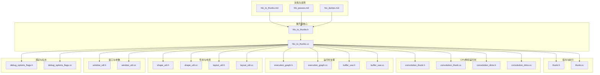
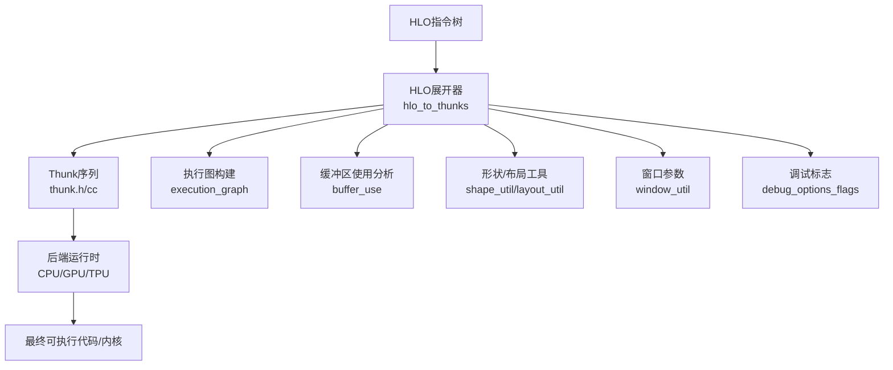
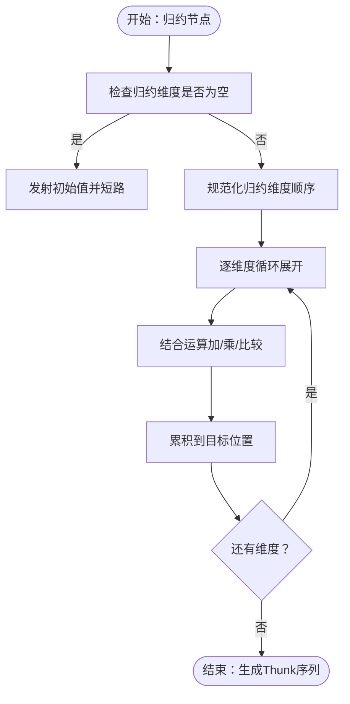
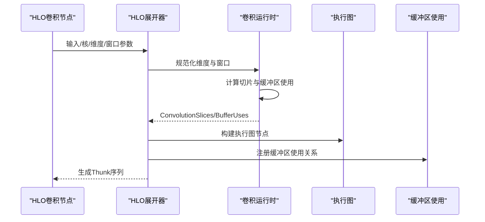
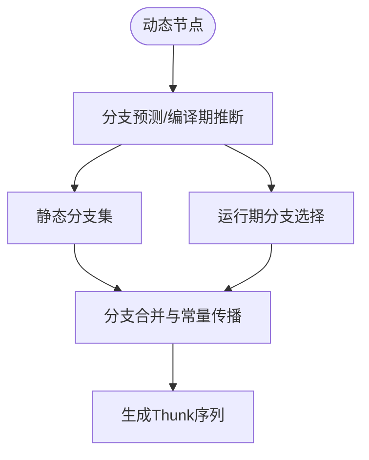
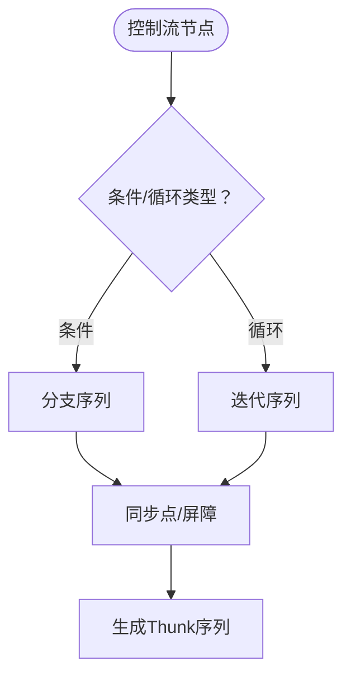
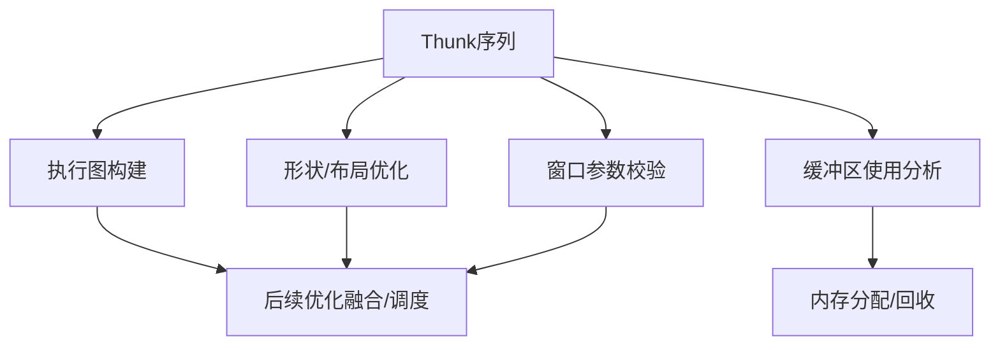
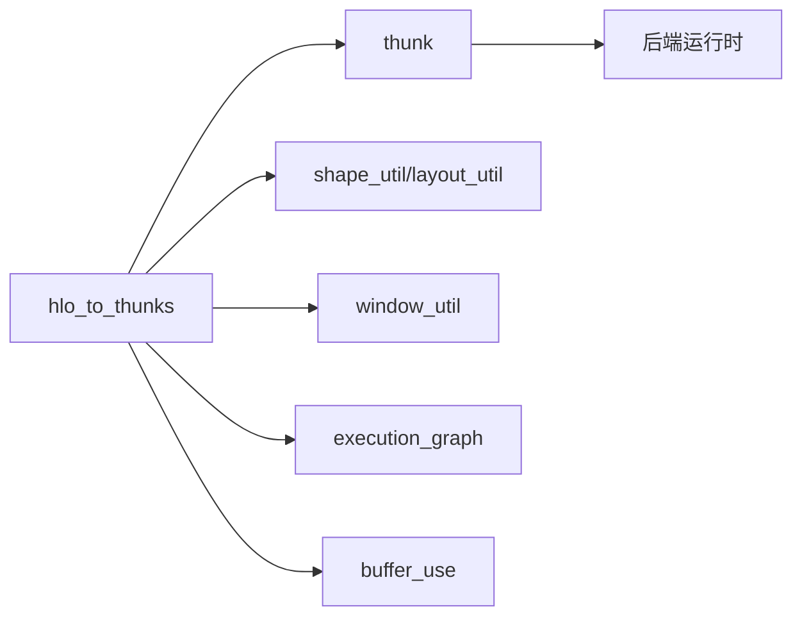

# HLO展开器

<cite>
**本文引用的文件**
- [README.md](file://README.md)
- [hlo_to_thunks.md](file://docs/hlo_to_thunks.md)
- [hlo_passes.md](file://docs/hlo_passes.md)
- [hlo_dumps.md](file://docs/hlo_dumps.md)
- [hlo_to_thunks.h](file://xla/codegen/hlo_to_thunks.h)
- [hlo_to_thunks.cc](file://xla/codegen/hlo_to_thunks.cc)
- [thunk.h](file://xla/codegen/thunk.h)
- [thunk.cc](file://xla/codegen/thunk.cc)
- [convolution_thunk.h](file://xla/backends/cpu/runtime/convolution_thunk.h)
- [convolution_thunk.cc](file://xla/backends/cpu/runtime/convolution_thunk.cc)
- [convolution_dims.h](file://xla/backends/cpu/runtime/convolution_dims.h)
- [convolution_dims.cc](file://xla/backends/cpu/runtime/convolution_dims.cc)
- [buffer_use.h](file://xla/runtime/buffer_use.h)
- [buffer_use.cc](file://xla/runtime/buffer_use.cc)
- [execution_graph.h](file://xla/runtime/execution_graph.h)
- [execution_graph.cc](file://xla/runtime/execution_graph.cc)
- [shape_util.h](file://xla/shape_util.h)
- [shape_util.cc](file://xla/shape_util.cc)
- [layout_util.h](file://xla/layout_util.h)
- [layout_util.cc](file://xla/layout_util.cc)
- [window_util.h](file://xla/window_util.h)
- [window_util.cc](file://xla/window_util.cc)
- [debug_options_flags.h](file://xla/debug_options_flags.h)
- [debug_options_flags.cc](file://xla/debug_options_flags.cc)
</cite>

## 目录
1. [简介](#简介)
2. [项目结构](#项目结构)
3. [核心组件](#核心组件)
4. [架构总览](#架构总览)
5. [详细组件分析](#详细组件分析)
6. [依赖关系分析](#依赖关系分析)
7. [性能考虑](#性能考虑)
8. [故障排查指南](#故障排查指南)
9. [结论](#结论)
10. [附录](#附录)

## 简介
本文件系统性阐述XLA中的HLO展开器（HLO Unroller）的设计与实现，聚焦于将复杂HLO指令展开为可直接生成后端代码的基本指令序列（Thunk）。重点覆盖以下展开策略与场景：
- 归约展开：将高维归约映射为循环或分块执行序列，并处理初始值与结合律优化。
- 卷积展开：将卷积算子分解为窗口滑动、点积与累加序列，结合维度规范与缓冲区使用分析。
- 动态操作展开：对形状或索引动态变化的节点进行静态化或分支展开。
- 控制流展开：将条件与循环等控制流转换为线性序列或并行片段。

同时，文档说明展开后的指令序列如何进入后续优化阶段（如融合、布局优化、内存分配），以及可配置项与性能调优建议。

## 项目结构
围绕HLO展开器的关键目录与文件如下：
- 文档与设计说明：docs/hlo_to_thunks.md、docs/hlo_passes.md、docs/hlo_dumps.md
- 展开器核心：xla/codegen/hlo_to_thunks.{h,cc}
- 指令表示与执行：xla/codegen/thunk.{h,cc}
- CPU卷积运行时：xla/backends/cpu/runtime/convolution_thunk.{h,cc}、xla/backends/cpu/runtime/convolution_dims.{h,cc}
- 运行时图与缓冲区使用：xla/runtime/execution_graph.{h,cc}、xla/runtime/buffer_use.{h,cc}
- 形状与布局工具：xla/shape_util.{h,cc}、xla/layout_util.{h,cc}
- 窗口与卷积参数：xla/window_util.{h,cc}
- 调试与标志：xla/debug_options_flags.{h,cc}

**图表来源**
- [hlo_to_thunks.h](file://xla/codegen/hlo_to_thunks.h#L1-L200)
- [hlo_to_thunks.cc](file://xla/codegen/hlo_to_thunks.cc#L1-L500)
- [thunk.h](file://xla/codegen/thunk.h#L1-L200)
- [thunk.cc](file://xla/codegen/thunk.cc#L1-L200)
- [convolution_thunk.h](file://xla/backends/cpu/runtime/convolution_thunk.h#L1-L120)
- [convolution_thunk.cc](file://xla/backends/cpu/runtime/convolution_thunk.cc#L1-L200)
- [convolution_dims.h](file://xla/backends/cpu/runtime/convolution_dims.h#L1-L150)
- [convolution_dims.cc](file://xla/backends/cpu/runtime/convolution_dims.cc#L1-L200)
- [execution_graph.h](file://xla/runtime/execution_graph.h#L1-L200)
- [execution_graph.cc](file://xla/runtime/execution_graph.cc#L1-L200)
- [buffer_use.h](file://xla/runtime/buffer_use.h#L1-L200)
- [buffer_use.cc](file://xla/runtime/buffer_use.cc#L1-L200)
- [shape_util.h](file://xla/shape_util.h#L1-L200)
- [shape_util.cc](file://xla/shape_util.cc#L1-L200)
- [layout_util.h](file://xla/layout_util.h#L1-L200)
- [layout_util.cc](file://xla/layout_util.cc#L1-L200)
- [window_util.h](file://xla/window_util.h#L1-L200)
- [window_util.cc](file://xla/window_util.cc#L1-L200)
- [debug_options_flags.h](file://xla/debug_options_flags.h#L1-L200)
- [debug_options_flags.cc](file://xla/debug_options_flags.cc#L1-L200)

**章节来源**
- [README.md](file://README.md#L1-L200)
- [hlo_to_thunks.md](file://docs/hlo_to_thunks.md#L1-L300)
- [hlo_passes.md](file://docs/hlo_passes.md#L1-L300)
- [hlo_dumps.md](file://docs/hlo_dumps.md#L1-L300)

## 核心组件
- HLO展开器（hlo_to_thunks）
  - 负责将HLO指令树转换为Thunk序列，贯穿归约、卷积、动态与控制流等复杂节点的展开策略。
  - 提供统一接口以适配不同后端（CPU/GPU/TPU）的运行时生成。
- Thunk（thunk）
  - 表示可执行的后端指令单元，包含执行事件、缓冲区使用、参数绑定等。
- CPU卷积运行时（convolution_thunk、convolution_dims）
  - 将卷积算子展开为窗口滑动、点积与累加序列，并输出对应的缓冲区使用信息。
- 运行时图与缓冲区使用（execution_graph、buffer_use）
  - 构建执行图，追踪缓冲区生命周期与使用关系，支持后续优化与内存分配。
- 形状与布局工具（shape_util、layout_util）
  - 规范形状与布局，确保展开过程中维度与数据布局一致。
- 窗口与卷积参数（window_util）
  - 解析卷积窗口、步幅、填充等参数，驱动展开逻辑。
- 调试与标志（debug_options_flags）
  - 提供调试开关与编译期/运行期标志，辅助定位展开问题。

**章节来源**
- [hlo_to_thunks.h](file://xla/codegen/hlo_to_thunks.h#L1-L200)
- [hlo_to_thunks.cc](file://xla/codegen/hlo_to_thunks.cc#L1-L500)
- [thunk.h](file://xla/codegen/thunk.h#L1-L200)
- [thunk.cc](file://xla/codegen/thunk.cc#L1-L200)
- [convolution_thunk.h](file://xla/backends/cpu/runtime/convolution_thunk.h#L1-L120)
- [convolution_thunk.cc](file://xla/backends/cpu/runtime/convolution_thunk.cc#L1-L200)
- [convolution_dims.h](file://xla/backends/cpu/runtime/convolution_dims.h#L1-L150)
- [convolution_dims.cc](file://xla/backends/cpu/runtime/convolution_dims.cc#L1-L200)
- [execution_graph.h](file://xla/runtime/execution_graph.h#L1-L200)
- [execution_graph.cc](file://xla/runtime/execution_graph.cc#L1-L200)
- [buffer_use.h](file://xla/runtime/buffer_use.h#L1-L200)
- [buffer_use.cc](file://xla/runtime/buffer_use.cc#L1-L200)
- [shape_util.h](file://xla/shape_util.h#L1-L200)
- [shape_util.cc](file://xla/shape_util.cc#L1-L200)
- [layout_util.h](file://xla/layout_util.h#L1-L200)
- [layout_util.cc](file://xla/layout_util.cc#L1-L200)
- [window_util.h](file://xla/window_util.h#L1-L200)
- [window_util.cc](file://xla/window_util.cc#L1-L200)
- [debug_options_flags.h](file://xla/debug_options_flags.h#L1-L200)
- [debug_options_flags.cc](file://xla/debug_options_flags.cc#L1-L200)

## 架构总览
下图展示从HLO到Thunk的展开与执行路径，以及与运行时图、缓冲区使用的关系。

**图表来源**
- [hlo_to_thunks.h](file://xla/codegen/hlo_to_thunks.h#L1-L200)
- [hlo_to_thunks.cc](file://xla/codegen/hlo_to_thunks.cc#L1-L500)
- [thunk.h](file://xla/codegen/thunk.h#L1-L200)
- [thunk.cc](file://xla/codegen/thunk.cc#L1-L200)
- [execution_graph.h](file://xla/runtime/execution_graph.h#L1-L200)
- [execution_graph.cc](file://xla/runtime/execution_graph.cc#L1-L200)
- [buffer_use.h](file://xla/runtime/buffer_use.h#L1-L200)
- [buffer_use.cc](file://xla/runtime/buffer_use.cc#L1-L200)
- [shape_util.h](file://xla/shape_util.h#L1-L200)
- [shape_util.cc](file://xla/shape_util.cc#L1-L200)
- [layout_util.h](file://xla/layout_util.h#L1-L200)
- [layout_util.cc](file://xla/layout_util.cc#L1-L200)
- [window_util.h](file://xla/window_util.h#L1-L200)
- [window_util.cc](file://xla/window_util.cc#L1-L200)
- [debug_options_flags.h](file://xla/debug_options_flags.h#L1-L200)
- [debug_options_flags.cc](file://xla/debug_options_flags.cc#L1-L200)

## 详细组件分析

### 归约展开（Reduction Unrolling）
- 展开策略
  - 将多维归约逐步映射为循环或分块执行，按归约维度顺序进行迭代。
  - 对初始值进行边界处理，确保结合律下的正确性（如加法、乘法、最大/最小等）。
  - 在可能的情况下，利用向量化与局部缓存减少访存。
- 边界条件
  - 处理空归约维度（size=1）与零元素归约。
  - 避免重复初始化与冗余写回。
- 后续优化
  - 归约融合：相邻归约合并以减少中间缓冲区。
  - 布局优化：调整输入布局以提升缓存命中。

**图表来源**
- [hlo_to_thunks.cc](file://xla/codegen/hlo_to_thunks.cc#L1-L500)
- [thunk.h](file://xla/codegen/thunk.h#L1-L200)
- [thunk.cc](file://xla/codegen/thunk.cc#L1-L200)

**章节来源**
- [hlo_to_thunks.cc](file://xla/codegen/hlo_to_thunks.cc#L1-L500)
- [thunk.h](file://xla/codegen/thunk.h#L1-L200)
- [thunk.cc](file://xla/codegen/thunk.cc#L1-L200)

### 卷积展开（Convolution Unrolling）
- 展开策略
  - 将卷积分解为窗口滑动、输入块提取、点积与累加序列。
  - 使用卷积维度规范（ConvolutionCanonicalDims）与窗口参数（Window）驱动展开。
  - 输出缓冲区使用（ConvolutionBufferUses）用于后续内存规划。
- 边界条件
  - 处理填充（padding）、步幅（stride）、扩张（dilation）导致的边界不完整块。
  - 对输出尺寸进行校验，避免越界访问。
- 后续优化
  - 分块与重排：按硬件特性重排维度以提升访存效率。
  - 融合：与激活函数、偏置等算子融合减少访存。

**图表来源**
- [hlo_to_thunks.cc](file://xla/codegen/hlo_to_thunks.cc#L1-L500)
- [convolution_thunk.h](file://xla/backends/cpu/runtime/convolution_thunk.h#L1-L120)
- [convolution_thunk.cc](file://xla/backends/cpu/runtime/convolution_thunk.cc#L1-L200)
- [convolution_dims.h](file://xla/backends/cpu/runtime/convolution_dims.h#L1-L150)
- [convolution_dims.cc](file://xla/backends/cpu/runtime/convolution_dims.cc#L1-L200)
- [execution_graph.h](file://xla/runtime/execution_graph.h#L1-L200)
- [execution_graph.cc](file://xla/runtime/execution_graph.cc#L1-L200)
- [buffer_use.h](file://xla/runtime/buffer_use.h#L1-L200)
- [buffer_use.cc](file://xla/runtime/buffer_use.cc#L1-L200)

**章节来源**
- [hlo_to_thunks.cc](file://xla/codegen/hlo_to_thunks.cc#L1-L500)
- [convolution_thunk.h](file://xla/backends/cpu/runtime/convolution_thunk.h#L1-L120)
- [convolution_thunk.cc](file://xla/backends/cpu/runtime/convolution_thunk.cc#L1-L200)
- [convolution_dims.h](file://xla/backends/cpu/runtime/convolution_dims.h#L1-L150)
- [convolution_dims.cc](file://xla/backends/cpu/runtime/convolution_dims.cc#L1-L200)
- [execution_graph.h](file://xla/runtime/execution_graph.h#L1-L200)
- [execution_graph.cc](file://xla/runtime/execution_graph.cc#L1-L200)
- [buffer_use.h](file://xla/runtime/buffer_use.h#L1-L200)
- [buffer_use.cc](file://xla/runtime/buffer_use.cc#L1-L200)

### 动态操作展开（Dynamic Operations）
- 展开策略
  - 对动态形状/索引的节点，优先在编译期推断确定性分支，或在运行期生成分支选择逻辑。
  - 将动态分支转换为静态分支集合，并通过条件跳转或掩码控制执行路径。
- 边界条件
  - 处理动态参数越界与空输入。
  - 保证分支间状态一致性（如缓冲区生命周期）。
- 后续优化
  - 分支合并：相同路径合并以减少Thunk数量。
  - 条件常量传播：消除无意义的条件判断。

**图表来源**
- [hlo_to_thunks.cc](file://xla/codegen/hlo_to_thunks.cc#L1-L500)
- [thunk.h](file://xla/codegen/thunk.h#L1-L200)
- [thunk.cc](file://xla/codegen/thunk.cc#L1-L200)

**章节来源**
- [hlo_to_thunks.cc](file://xla/codegen/hlo_to_thunks.cc#L1-L500)
- [thunk.h](file://xla/codegen/thunk.h#L1-L200)
- [thunk.cc](file://xla/codegen/thunk.cc#L1-L200)

### 控制流展开（Control Flow）
- 展开策略
  - 条件：将条件节点转换为分支序列，必要时引入同步点。
  - 循环：将循环体展开为固定次数迭代或条件退出序列。
- 边界条件
  - 处理空循环体与单次迭代。
  - 维护循环不变量与副作用顺序。
- 后续优化
  - 循环融合与展开深度控制。
  - 条件消除与死代码清理。

**图表来源**
- [hlo_to_thunks.cc](file://xla/codegen/hlo_to_thunks.cc#L1-L500)
- [thunk.h](file://xla/codegen/thunk.h#L1-L200)
- [thunk.cc](file://xla/codegen/thunk.cc#L1-L200)

**章节来源**
- [hlo_to_thunks.cc](file://xla/codegen/hlo_to_thunks.cc#L1-L500)
- [thunk.h](file://xla/codegen/thunk.h#L1-L200)
- [thunk.cc](file://xla/codegen/thunk.cc#L1-L200)

### 展开后的指令序列优化与后续处理
- 执行图构建（execution_graph）
  - 将Thunk序列组织为有向无环图，标注依赖与执行顺序。
- 缓冲区使用分析（buffer_use）
  - 追踪每个缓冲区的读写边界与生命周期，为内存池与释放时机提供依据。
- 形状与布局优化（shape_util、layout_util）
  - 规范形状与布局，确保跨设备一致性与高效访存。
- 窗口参数校验（window_util）
  - 校验窗口、步幅、填充等参数，防止展开后越界。

**图表来源**
- [hlo_to_thunks.cc](file://xla/codegen/hlo_to_thunks.cc#L1-L500)
- [execution_graph.h](file://xla/runtime/execution_graph.h#L1-L200)
- [execution_graph.cc](file://xla/runtime/execution_graph.cc#L1-L200)
- [buffer_use.h](file://xla/runtime/buffer_use.h#L1-L200)
- [buffer_use.cc](file://xla/runtime/buffer_use.cc#L1-L200)
- [shape_util.h](file://xla/shape_util.h#L1-L200)
- [shape_util.cc](file://xla/shape_util.cc#L1-L200)
- [layout_util.h](file://xla/layout_util.h#L1-L200)
- [layout_util.cc](file://xla/layout_util.cc#L1-L200)
- [window_util.h](file://xla/window_util.h#L1-L200)
- [window_util.cc](file://xla/window_util.cc#L1-L200)

**章节来源**
- [execution_graph.h](file://xla/runtime/execution_graph.h#L1-L200)
- [execution_graph.cc](file://xla/runtime/execution_graph.cc#L1-L200)
- [buffer_use.h](file://xla/runtime/buffer_use.h#L1-L200)
- [buffer_use.cc](file://xla/runtime/buffer_use.cc#L1-L200)
- [shape_util.h](file://xla/shape_util.h#L1-L200)
- [shape_util.cc](file://xla/shape_util.cc#L1-L200)
- [layout_util.h](file://xla/layout_util.h#L1-L200)
- [layout_util.cc](file://xla/layout_util.cc#L1-L200)
- [window_util.h](file://xla/window_util.h#L1-L200)
- [window_util.cc](file://xla/window_util.cc#L1-L200)

## 依赖关系分析
- 组件耦合
  - HLO展开器高度依赖形状/布局工具与窗口参数解析，以确保展开正确性。
  - 与执行图和缓冲区使用模块紧密耦合，形成“展开→图构建→内存分析”的流水线。
- 外部集成点
  - 后端运行时（CPU/GPU/TPU）通过Thunk接口对接，具体实现由后端独立完成。
- 潜在环路
  - 展开器仅单向依赖上述模块，不存在循环依赖。

**图表来源**
- [hlo_to_thunks.cc](file://xla/codegen/hlo_to_thunks.cc#L1-L500)
- [thunk.h](file://xla/codegen/thunk.h#L1-L200)
- [shape_util.h](file://xla/shape_util.h#L1-L200)
- [layout_util.h](file://xla/layout_util.h#L1-L200)
- [window_util.h](file://xla/window_util.h#L1-L200)
- [execution_graph.h](file://xla/runtime/execution_graph.h#L1-L200)
- [buffer_use.h](file://xla/runtime/buffer_use.h#L1-L200)

**章节来源**
- [hlo_to_thunks.cc](file://xla/codegen/hlo_to_thunks.cc#L1-L500)
- [thunk.h](file://xla/codegen/thunk.h#L1-L200)
- [shape_util.h](file://xla/shape_util.h#L1-L200)
- [layout_util.h](file://xla/layout_util.h#L1-L200)
- [window_util.h](file://xla/window_util.h#L1-L200)
- [execution_graph.h](file://xla/runtime/execution_graph.h#L1-L200)
- [buffer_use.h](file://xla/runtime/buffer_use.h#L1-L200)

## 性能考虑
- 展开深度与融合
  - 控制循环展开深度，避免过度展开导致寄存器压力与指令缓存膨胀。
  - 优先进行算子融合（如卷积+偏置+激活），减少中间缓冲区与访存。
- 内存访问模式
  - 利用形状/布局工具规范化数据布局，提升缓存命中率。
  - 对卷积等算子采用分块策略，匹配硬件缓存层次。
- 并行与同步
  - 在条件/循环展开中合理插入同步点，避免数据竞争。
- 调试与可视化
  - 使用调试标志与HLO转储功能定位性能瓶颈与错误展开。

[本节为通用指导，无需列出具体文件来源]

## 故障排查指南
- 常见问题
  - 展开后出现越界：检查窗口参数与填充设置，确认维度规范。
  - 归约结果异常：核查初始值与结合运算顺序。
  - 动态分支崩溃：增加边界检查与默认分支处理。
- 定位手段
  - 启用调试标志与HLO转储，观察展开前后的指令序列。
  - 通过执行图与缓冲区使用分析定位资源冲突与生命周期问题。

**章节来源**
- [hlo_dumps.md](file://docs/hlo_dumps.md#L1-L300)
- [debug_options_flags.h](file://xla/debug_options_flags.h#L1-L200)
- [debug_options_flags.cc](file://xla/debug_options_flags.cc#L1-L200)
- [execution_graph.h](file://xla/runtime/execution_graph.h#L1-L200)
- [execution_graph.cc](file://xla/runtime/execution_graph.cc#L1-L200)
- [buffer_use.h](file://xla/runtime/buffer_use.h#L1-L200)
- [buffer_use.cc](file://xla/runtime/buffer_use.cc#L1-L200)

## 结论
HLO展开器通过系统化的展开策略与严格的边界处理，将复杂HLO指令转化为高效的Thunk序列，并与执行图、缓冲区使用及形状/布局工具协同，形成完整的编译后端流水线。针对归约、卷积、动态与控制流等场景，展开器提供了可扩展的实现框架；配合融合、布局优化与内存分析，能够有效提升执行性能与稳定性。

[本节为总结性内容，无需列出具体文件来源]

## 附录
- 配置选项与调试
  - 调试标志：通过调试标志启用详细日志与验证。
  - HLO转储：在关键阶段输出HLO与Thunk序列，便于分析。
- 参考文档
  - HLO展开与Thunk生成：参阅相关文档与源码注释。

**章节来源**
- [hlo_to_thunks.md](file://docs/hlo_to_thunks.md#L1-L300)
- [hlo_passes.md](file://docs/hlo_passes.md#L1-L300)
- [hlo_dumps.md](file://docs/hlo_dumps.md#L1-L300)
- [debug_options_flags.h](file://xla/debug_options_flags.h#L1-L200)
- [debug_options_flags.cc](file://xla/debug_options_flags.cc#L1-L200)