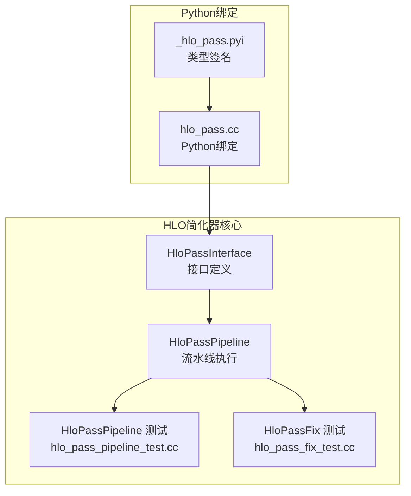
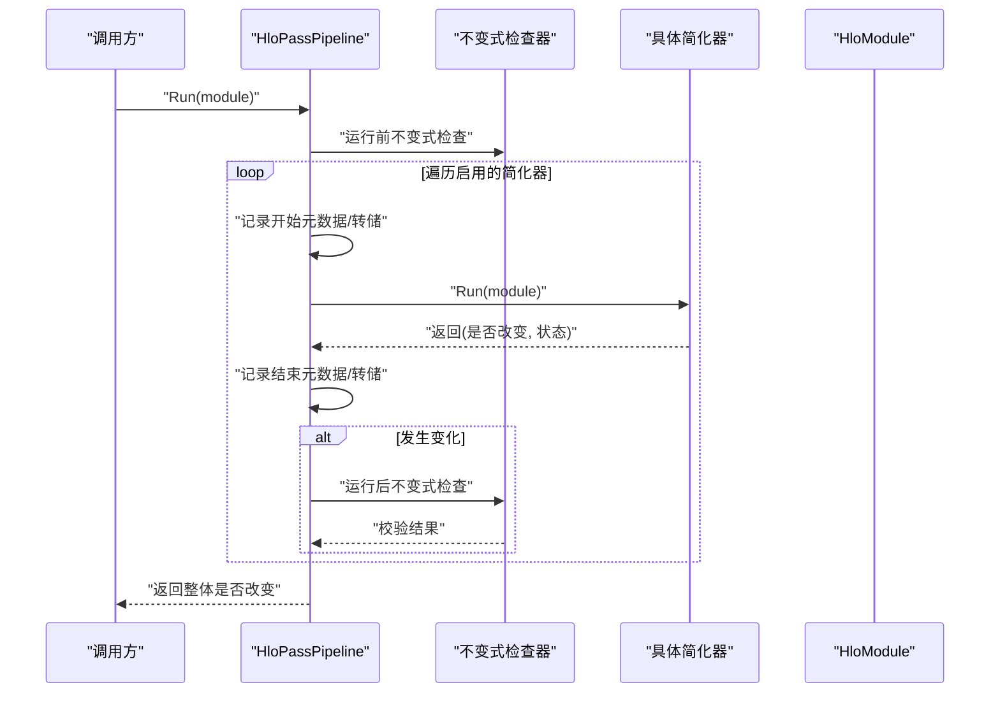
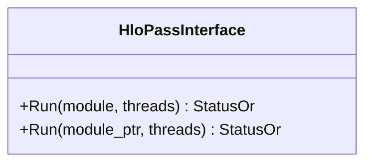
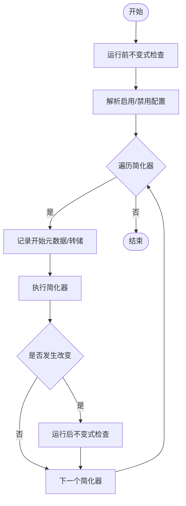
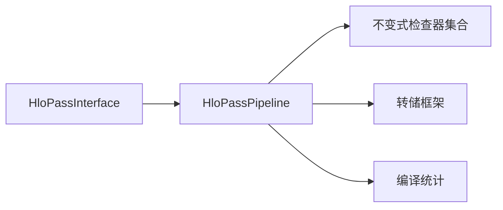

# HLO简化器

<cite>
**本文引用的文件**
- [hlo_pass_interface.cc](file://xla/hlo/pass/hlo_pass_interface.cc)
- [hlo_pass_pipeline.cc](file://xla/hlo/pass/hlo_pass_pipeline.cc)
- [hlo_pass_pipeline_test.cc](file://xla/hlo/pass/hlo_pass_pipeline_test.cc)
- [hlo_pass_fix_test.cc](file://xla/hlo/pass/hlo_pass_fix_test.cc)
- [hlo_pass.cc](file://xla/python/hlo_pass.cc)
- [hlo_pass.pyi](file://xla/python/_hlo_pass.pyi)
</cite>

## 目录
1. [简介](#简介)
2. [项目结构](#项目结构)
3. [核心组件](#核心组件)
4. [架构总览](#架构总览)
5. [详细组件分析](#详细组件分析)
6. [依赖关系分析](#依赖关系分析)
7. [性能考量](#性能考量)
8. [故障排查指南](#故障排查指南)
9. [结论](#结论)
10. [附录](#附录)

## 简介
本文件系统化梳理XLA中的HLO（High-Level Optimizer）简化器体系，聚焦于HLO指令的简化规则与优化策略，包括常量折叠、死代码消除、算术恒等式应用、形状规范化等。文档从接口设计、流水线执行、调试与验证机制等维度，解释简化器的触发条件、匹配模式、替换规则、执行顺序与依赖关系，并给出性能影响分析与调试方法，帮助读者在不破坏计算正确性的前提下理解并使用HLO简化器。

## 项目结构
围绕HLO简化器的关键实现位于以下路径：
- C++接口与流水线：xla/hlo/pass
- Python绑定：xla/python

图表来源
- [hlo_pass_interface.cc](file://xla/hlo/pass/hlo_pass_interface.cc#L1-L39)
- [hlo_pass_pipeline.cc](file://xla/hlo/pass/hlo_pass_pipeline.cc#L1-L321)
- [hlo_pass_pipeline_test.cc](file://xla/hlo/pass/hlo_pass_pipeline_test.cc)
- [hlo_pass_fix_test.cc](file://xla/hlo/pass/hlo_pass_fix_test.cc)
- [hlo_pass.cc](file://xla/python/hlo_pass.cc)
- [hlo_pass.pyi](file://xla/python/_hlo_pass.pyi)

章节来源
- [hlo_pass_interface.cc](file://xla/hlo/pass/hlo_pass_interface.cc#L1-L39)
- [hlo_pass_pipeline.cc](file://xla/hlo/pass/hlo_pass_pipeline.cc#L1-L321)

## 核心组件
- HloPassInterface：定义所有HLO简化器必须实现的统一接口，提供Run重载以支持模块指针与智能指针两种调用方式，并返回是否对图产生变化的布尔值。
- HloPassPipeline：负责按配置启用/禁用简化器、记录元数据、执行前/后不变式检查、统计与转储、以及逐个运行简化器并聚合变更状态。
- Python绑定：通过C++桥接提供Python侧的简化器调用能力，便于脚本化与测试。

章节来源
- [hlo_pass_interface.cc](file://xla/hlo/pass/hlo_pass_interface.cc#L26-L36)
- [hlo_pass_pipeline.cc](file://xla/hlo/pass/hlo_pass_pipeline.cc#L291-L318)
- [hlo_pass.cc](file://xla/python/hlo_pass.cc)
- [hlo_pass.pyi](file://xla/python/_hlo_pass.pyi)

## 架构总览
HLO简化器采用“接口+流水线”的分层设计。流水线负责调度与治理，具体简化器实现各自匹配与替换逻辑。流水线在每次运行前后记录元数据、执行不变式检查、支持基于正则表达式的HLO转储、并根据调试选项进行严格校验。

图表来源
- [hlo_pass_pipeline.cc](file://xla/hlo/pass/hlo_pass_pipeline.cc#L134-L220)
- [hlo_pass_pipeline.cc](file://xla/hlo/pass/hlo_pass_pipeline.cc#L77-L99)

章节来源
- [hlo_pass_pipeline.cc](file://xla/hlo/pass/hlo_pass_pipeline.cc#L44-L75)
- [hlo_pass_pipeline.cc](file://xla/hlo/pass/hlo_pass_pipeline.cc#L134-L220)

## 详细组件分析

### 组件A：HloPassInterface 接口
- 职责
  - 统一简化器的入口，屏蔽模块指针与智能指针差异。
  - 返回值包含“是否改变”与错误状态，便于上层流水线聚合。
- 关键点
  - Run重载确保兼容不同所有权模型。
  - 返回值用于流水线判断后续流程（如不变式检查、转储、统计）。

图表来源
- [hlo_pass_interface.cc](file://xla/hlo/pass/hlo_pass_interface.cc#L26-L36)

章节来源
- [hlo_pass_interface.cc](file://xla/hlo/pass/hlo_pass_interface.cc#L26-L36)

### 组件B：HloPassPipeline 流水线
- 启用/禁用机制
  - 支持通过命令行开关禁用全部或按名称禁用特定简化器；也可仅启用指定列表。
  - 若同时设置禁用与仅启用，则后者优先覆盖前者。
- 执行流程
  - 运行前不变式检查，记录开始元数据与可选转储。
  - 逐个运行简化器，记录开始/结束元数据、统计耗时、转储满足条件的中间结果。
  - 每次简化器导致变化后，运行后不变式检查，确保正确性。
- 调试与验证
  - 基于哈希的“静默变更/空操作”校验，防止简化器误报或漏报。
  - 提供正则匹配的HLO转储，便于定位问题。
  - 收集每个简化器的执行状态码与耗时，便于性能分析。

图表来源
- [hlo_pass_pipeline.cc](file://xla/hlo/pass/hlo_pass_pipeline.cc#L222-L276)
- [hlo_pass_pipeline.cc](file://xla/hlo/pass/hlo_pass_pipeline.cc#L134-L220)

章节来源
- [hlo_pass_pipeline.cc](file://xla/hlo/pass/hlo_pass_pipeline.cc#L222-L276)
- [hlo_pass_pipeline.cc](file://xla/hlo/pass/hlo_pass_pipeline.cc#L134-L220)
- [hlo_pass_pipeline.cc](file://xla/hlo/pass/hlo_pass_pipeline.cc#L101-L132)

### 组件C：Python绑定与类型签名
- Python绑定
  - 通过C++桥接提供简化器调用能力，便于在Python中编排与测试。
- 类型签名
  - 提供类型注解，辅助IDE与静态检查工具理解接口契约。

章节来源
- [hlo_pass.cc](file://xla/python/hlo_pass.cc)
- [hlo_pass.pyi](file://xla/python/_hlo_pass.pyi)

## 依赖关系分析
- 组件耦合
  - HloPassPipeline依赖HloPassInterface实现多态调度。
  - 不变式检查器作为独立组件被流水线在关键节点调用，保证简化器不引入结构性错误。
- 外部依赖
  - 日志与剖析工具（TraceMe、ScopedAnnotation）用于性能追踪与可视化。
  - 转储框架用于按需输出中间HLO文本，便于调试。
- 可能的循环依赖
  - 接口与流水线之间为单向依赖，无循环。

图表来源
- [hlo_pass_pipeline.cc](file://xla/hlo/pass/hlo_pass_pipeline.cc#L77-L99)
- [hlo_pass_pipeline.cc](file://xla/hlo/pass/hlo_pass_pipeline.cc#L278-L289)

章节来源
- [hlo_pass_pipeline.cc](file://xla/hlo/pass/hlo_pass_pipeline.cc#L77-L99)
- [hlo_pass_pipeline.cc](file://xla/hlo/pass/hlo_pass_pipeline.cc#L278-L289)

## 性能考量
- 执行顺序与依赖
  - 流水线按配置顺序依次运行简化器，简化器之间的依赖应通过不变式检查与合理的顺序来保障。
- 成本控制
  - 通过启用/禁用列表与正则转储减少不必要的I/O与计算。
  - 利用统计信息识别热点简化器，指导优化。
- 正确性与性能平衡
  - 不变式检查与变更校验会带来额外开销，建议在开发/调试阶段开启，在生产中按需关闭。

## 故障排查指南
- 常见问题
  - 简化器报告“未改变但HLO已变/已改变但报告未变”：由哈希校验触发，提示简化器实现或调用方存在不一致。
  - 不变式检查失败：简化器可能破坏了图的结构约束，需要修正匹配/替换逻辑。
- 定位方法
  - 使用正则转储在关键简化器前后输出HLO文本，比对差异。
  - 查看流水线记录的元数据与统计，定位耗时长或频繁失败的简化器。
- 相关测试
  - 通过单元测试与集成测试验证简化器行为与稳定性。

章节来源
- [hlo_pass_pipeline.cc](file://xla/hlo/pass/hlo_pass_pipeline.cc#L101-L132)
- [hlo_pass_pipeline_test.cc](file://xla/hlo/pass/hlo_pass_pipeline_test.cc)
- [hlo_pass_fix_test.cc](file://xla/hlo/pass/hlo_pass_fix_test.cc)

## 结论
HLO简化器通过统一接口与严格的流水线治理，实现了可扩展、可观测、可调试的优化体系。遵循正确的匹配与替换规则、利用不变式检查与变更校验、结合转储与统计信息，可以在不破坏计算正确性的前提下显著提升HLO质量与执行效率。

## 附录
- 术语
  - HLO：高层优化器中间表示。
  - 简化器：针对HLO图执行规则化变换的组件。
  - 不变式检查：在关键节点验证图结构与语义约束的检查器。
- 参考文件
  - [hlo_pass_interface.cc](file://xla/hlo/pass/hlo_pass_interface.cc#L1-L39)
  - [hlo_pass_pipeline.cc](file://xla/hlo/pass/hlo_pass_pipeline.cc#L1-L321)
  - [hlo_pass_pipeline_test.cc](file://xla/hlo/pass/hlo_pass_pipeline_test.cc)
  - [hlo_pass_fix_test.cc](file://xla/hlo/pass/hlo_pass_fix_test.cc)
  - [hlo_pass.cc](file://xla/python/hlo_pass.cc)
  - [hlo_pass.pyi](file://xla/python/_hlo_pass.pyi)