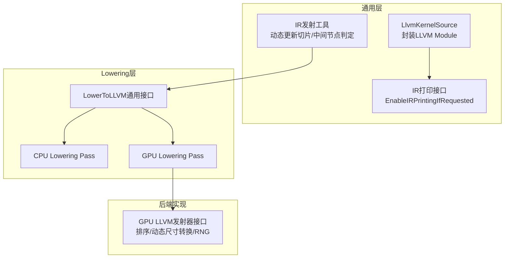
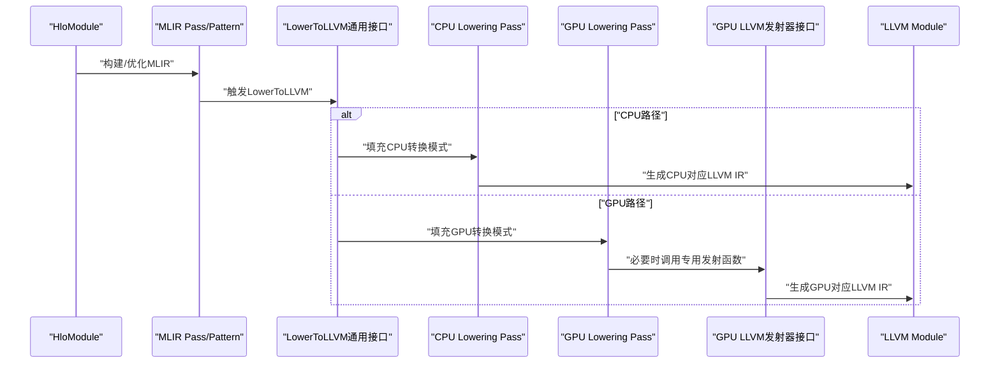
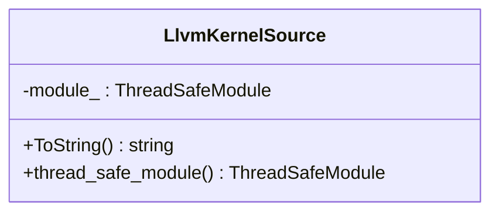
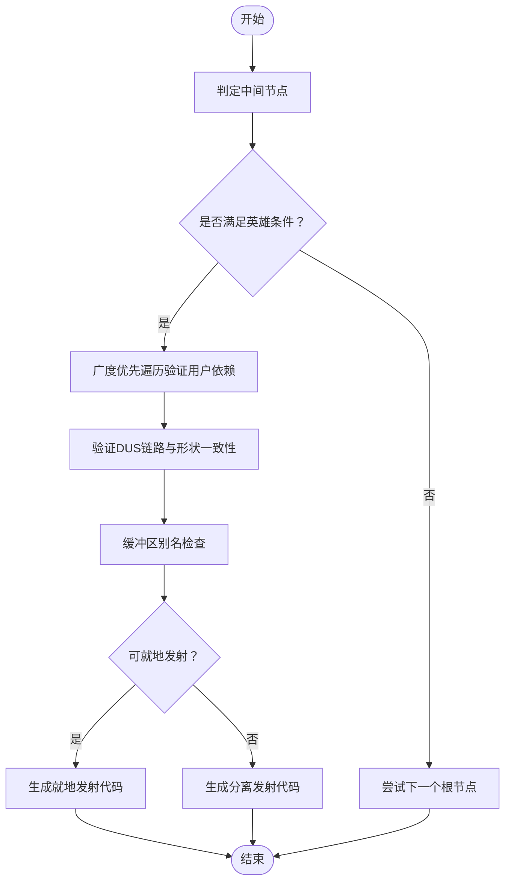
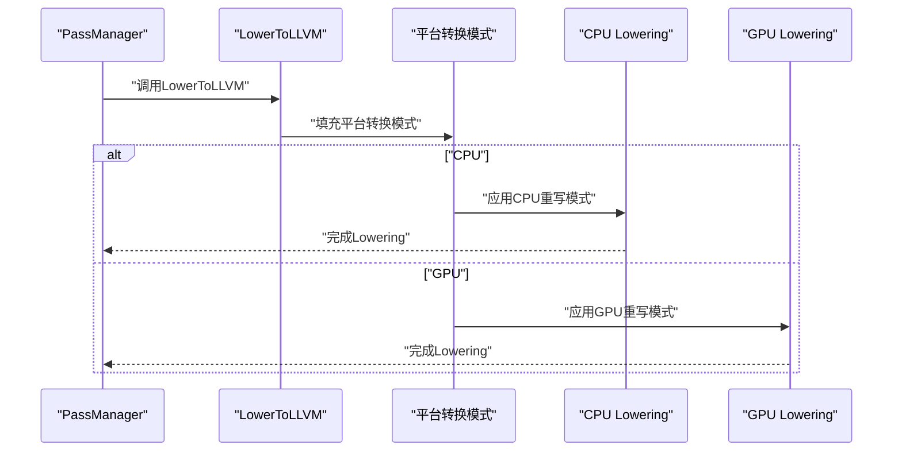
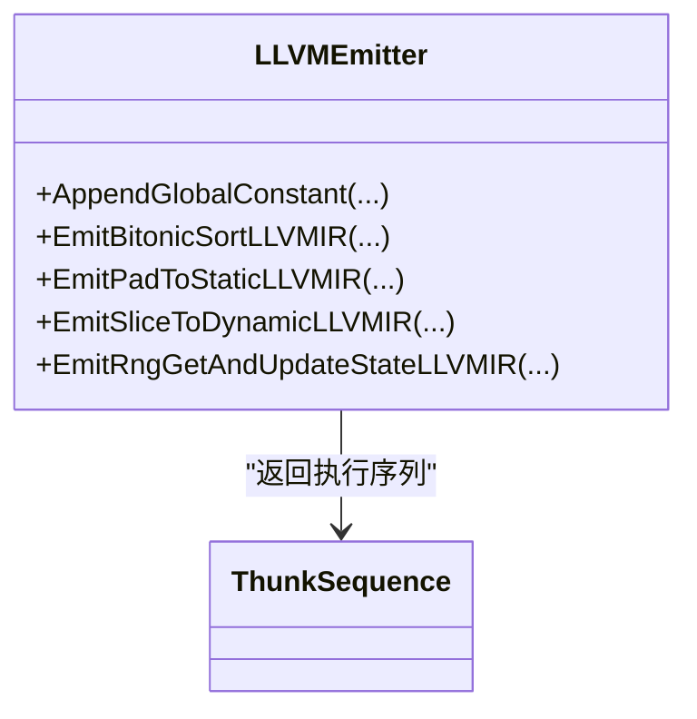
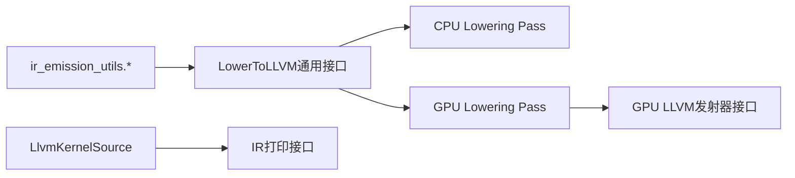

# LLVM IR生成

<cite>
**本文引用的文件**
- [xla/codegen/llvm_kernel_source.h](file://xla/codegen/llvm_kernel_source.h)
- [xla/codegen/llvm_kernel_source.cc](file://xla/codegen/llvm_kernel_source.cc)
- [xla/codegen/ir_emission_utils.h](file://xla/codegen/ir_emission_utils.h)
- [xla/codegen/ir_emission_utils.cc](file://xla/codegen/ir_emission_utils.cc)
- [xla/codegen/ir_printing.h](file://xla/codegen/ir_printing.h)
- [xla/codegen/emitters/transforms/lower_to_llvm_common.h](file://xla/codegen/emitters/transforms/lower_to_llvm_common.h)
- [xla/codegen/emitters/transforms/lower_to_llvm_cpu.h](file://xla/codegen/emitters/transforms/lower_to_llvm_cpu.h)
- [xla/codegen/emitters/transforms/lower_to_llvm_gpu.h](file://xla/codegen/emitters/transforms/lower_to_llvm_gpu.h)
- [xla/backends/gpu/codegen/llvm/llvm_emitter.h](file://xla/backends/gpu/codegen/llvm/llvm_emitter.h)
- [xla/backends/cpu/codegen/emitters/transforms/lower_to_llvm.cc](file://xla/backends/cpu/codegen/emitters/transforms/lower_to_llvm.cc)
</cite>

## 目录
1. [简介](#简介)
2. [项目结构](#项目结构)
3. [核心组件](#核心组件)
4. [架构总览](#架构总览)
5. [详细组件分析](#详细组件分析)
6. [依赖关系分析](#依赖关系分析)
7. [性能考虑](#性能考虑)
8. [故障排查指南](#故障排查指南)
9. [结论](#结论)
10. [附录](#附录)

## 简介
本文件系统性梳理XLA中面向LLVM IR的代码生成模块，覆盖从HLO指令到LLVM IR的转换路径、类型映射、指令转换与优化策略，并对LLVM IR生成工具函数的使用方法（数据类型处理、内存操作、控制流管理）进行说明。同时记录LLVM编译器集成点（编译选项配置与目标平台支持），并提供中间表示检查与性能分析等调试方法。

## 项目结构
围绕LLVM IR生成的关键目录与文件如下：
- 通用LLVM内核封装与打印：xla/codegen/llvm_kernel_source.*
- IR发射辅助工具：xla/codegen/ir_emission_utils.*
- MLIR到LLVM Lowering通用接口：xla/codegen/emitters/transforms/*
- 平台特定Lowering（CPU/GPU）：xla/backends/*/codegen/emitters/transforms/*
- GPU专用LLVM发射器接口：xla/backends/gpu/codegen/llvm/llvm_emitter.h
- MLIR IR打印与日志开关：xla/codegen/ir_printing.h

图表来源
- [xla/codegen/llvm_kernel_source.h](file://xla/codegen/llvm_kernel_source.h#L34-L51)
- [xla/codegen/ir_printing.h](file://xla/codegen/ir_printing.h#L40-L47)
- [xla/codegen/ir_emission_utils.h](file://xla/codegen/ir_emission_utils.h#L35-L72)
- [xla/codegen/emitters/transforms/lower_to_llvm_common.h](file://xla/codegen/emitters/transforms/lower_to_llvm_common.h#L28-L36)
- [xla/codegen/emitters/transforms/lower_to_llvm_cpu.h](file://xla/codegen/emitters/transforms/lower_to_llvm_cpu.h#L28-L31)
- [xla/codegen/emitters/transforms/lower_to_llvm_gpu.h](file://xla/codegen/emitters/transforms/lower_to_llvm_gpu.h#L33-L38)
- [xla/backends/gpu/codegen/llvm/llvm_emitter.h](file://xla/backends/gpu/codegen/llvm/llvm_emitter.h#L32-L142)

章节来源
- [xla/codegen/llvm_kernel_source.h](file://xla/codegen/llvm_kernel_source.h#L1-L56)
- [xla/codegen/ir_printing.h](file://xla/codegen/ir_printing.h#L1-L52)
- [xla/codegen/ir_emission_utils.h](file://xla/codegen/ir_emission_utils.h#L1-L76)
- [xla/codegen/emitters/transforms/lower_to_llvm_common.h](file://xla/codegen/emitters/transforms/lower_to_llvm_common.h#L1-L42)
- [xla/codegen/emitters/transforms/lower_to_llvm_cpu.h](file://xla/codegen/emitters/transforms/lower_to_llvm_cpu.h#L1-L37)
- [xla/codegen/emitters/transforms/lower_to_llvm_gpu.h](file://xla/codegen/emitters/transforms/lower_to_llvm_gpu.h#L1-L44)
- [xla/backends/gpu/codegen/llvm/llvm_emitter.h](file://xla/backends/gpu/codegen/llvm/llvm_emitter.h#L1-L146)

## 核心组件
- LlvmKernelSource：封装线程安全的LLVM Module，提供字符串化输出能力，便于调试与持久化。
- IR发射工具集：包含中间节点识别、动态更新切片融合判断、按根节点遍历寻找“英雄”节点等，支撑更高效的发射策略。
- LowerToLLVM通用接口：定义统一的MLIR到LLVM Lowering入口，支持平台回调注入与数学函数Lowering开关。
- 平台Lowering Pass：CPU/GPU分别提供独立Pass工厂与注册宏，用于在不同后端上执行Lowering。
- GPU LLVM发射器接口：提供排序、动态/静态数组互转、随机状态更新等专用发射函数原型，作为后端具体实现的契约。

章节来源
- [xla/codegen/llvm_kernel_source.h](file://xla/codegen/llvm_kernel_source.h#L34-L51)
- [xla/codegen/llvm_kernel_source.cc](file://xla/codegen/llvm_kernel_source.cc#L25-L28)
- [xla/codegen/ir_emission_utils.h](file://xla/codegen/ir_emission_utils.h#L35-L72)
- [xla/codegen/emitters/transforms/lower_to_llvm_common.h](file://xla/codegen/emitters/transforms/lower_to_llvm_common.h#L28-L36)
- [xla/codegen/emitters/transforms/lower_to_llvm_cpu.h](file://xla/codegen/emitters/transforms/lower_to_llvm_cpu.h#L28-L31)
- [xla/codegen/emitters/transforms/lower_to_llvm_gpu.h](file://xla/codegen/emitters/transforms/lower_to_llvm_gpu.h#L33-L38)
- [xla/backends/gpu/codegen/llvm/llvm_emitter.h](file://xla/backends/gpu/codegen/llvm/llvm_emitter.h#L32-L142)

## 架构总览
下图展示从HLO到LLVM IR的主要路径：HLO经由融合与布局分析后进入MLIR阶段，随后通过LowerToLLVM通用接口在CPU/GPU后端执行Lowering，最终生成LLVM IR模块；GPU侧可进一步调用专用发射器接口生成特定算子的LLVM IR。

图表来源
- [xla/codegen/emitters/transforms/lower_to_llvm_common.h](file://xla/codegen/emitters/transforms/lower_to_llvm_common.h#L28-L36)
- [xla/codegen/emitters/transforms/lower_to_llvm_cpu.h](file://xla/codegen/emitters/transforms/lower_to_llvm_cpu.h#L28-L31)
- [xla/codegen/emitters/transforms/lower_to_llvm_gpu.h](file://xla/codegen/emitters/transforms/lower_to_llvm_gpu.h#L33-L38)
- [xla/backends/gpu/codegen/llvm/llvm_emitter.h](file://xla/backends/gpu/codegen/llvm/llvm_emitter.h#L32-L142)

## 详细组件分析

### 组件A：LlvmKernelSource（LLVM内核源）
- 职责：持有线程安全的LLVM Module，提供字符串化输出，便于调试与持久化。
- 关键点：
  - 使用线程安全上下文封装模块，确保并发安全。
  - ToString通过回调访问模块内容，避免直接暴露内部结构。
- 典型用法路径：
  - 创建后通过ToString导出LLVM IR文本。
  - 在编译流程末尾或调试阶段输出中间结果。

图表来源
- [xla/codegen/llvm_kernel_source.h](file://xla/codegen/llvm_kernel_source.h#L34-L51)
- [xla/codegen/llvm_kernel_source.cc](file://xla/codegen/llvm_kernel_source.cc#L25-L28)

章节来源
- [xla/codegen/llvm_kernel_source.h](file://xla/codegen/llvm_kernel_source.h#L34-L51)
- [xla/codegen/llvm_kernel_source.cc](file://xla/codegen/llvm_kernel_source.cc#L25-L28)

### 组件B：IR发射工具集（ir_emission_utils.*）
- 功能概览：
  - 判定中间节点（元素化/位移/重塑/转置等）以指导融合与发射顺序。
  - 在融合根集合上寻找满足条件的“英雄”节点，辅助选择最优发射路径。
  - 针对动态更新切片（DUS）融合，判断是否可就地发射，避免竞态并保证形状一致性。
- 复杂度与优化：
  - 中间节点判定基于操作数数量与语义，时间复杂度近似O(N)遍历。
  - “英雄”节点搜索采用广度优先遍历，结合中间节点剪枝，避免非必要分支。
  - DUS就地发射涉及多轮BFS验证索引一致性与缓冲区别名，整体复杂度与节点数线性相关。

图表来源
- [xla/codegen/ir_emission_utils.cc](file://xla/codegen/ir_emission_utils.cc#L74-L112)
- [xla/codegen/ir_emission_utils.cc](file://xla/codegen/ir_emission_utils.cc#L149-L289)

章节来源
- [xla/codegen/ir_emission_utils.h](file://xla/codegen/ir_emission_utils.h#L35-L72)
- [xla/codegen/ir_emission_utils.cc](file://xla/codegen/ir_emission_utils.cc#L42-L112)
- [xla/codegen/ir_emission_utils.cc](file://xla/codegen/ir_emission_utils.cc#L149-L289)

### 组件C：LowerToLLVM通用接口与平台Pass
- LowerToLLVM通用接口：
  - 提供统一入口，允许平台注入自定义转换模式与目标约束。
  - 支持数学函数Lowering开关，便于在不同平台启用/禁用特定数学优化。
- CPU Lowering Pass：
  - 基于XLA CPU方言与重写模式，贪婪应用转换以降低到LLVM IR。
  - 可配置向量宽度偏好，影响SIMD指令生成。
- GPU Lowering Pass：
  - 接受设备描述或字符串形式的设备信息，生成对应GPU后端的LLVM IR。
  - 支持多种GPU后端（如NVPTX/AMDGPU/SPIR-V）的差异化Lowering。

图表来源
- [xla/codegen/emitters/transforms/lower_to_llvm_common.h](file://xla/codegen/emitters/transforms/lower_to_llvm_common.h#L28-L36)
- [xla/backends/cpu/codegen/emitters/transforms/lower_to_llvm.cc](file://xla/backends/cpu/codegen/emitters/transforms/lower_to_llvm.cc#L42-L53)
- [xla/codegen/emitters/transforms/lower_to_llvm_gpu.h](file://xla/codegen/emitters/transforms/lower_to_llvm_gpu.h#L33-L38)

章节来源
- [xla/codegen/emitters/transforms/lower_to_llvm_common.h](file://xla/codegen/emitters/transforms/lower_to_llvm_common.h#L28-L36)
- [xla/codegen/emitters/transforms/lower_to_llvm_cpu.h](file://xla/codegen/emitters/transforms/lower_to_llvm_cpu.h#L28-L31)
- [xla/codegen/emitters/transforms/lower_to_llvm_gpu.h](file://xla/codegen/emitters/transforms/lower_to_llvm_gpu.h#L33-L38)
- [xla/backends/cpu/codegen/emitters/transforms/lower_to_llvm.cc](file://xla/backends/cpu/codegen/emitters/transforms/lower_to_llvm.cc#L42-L53)

### 组件D：GPU LLVM发射器接口（专用算子）
- 能力范围：
  - 全局常量附加（用于嵌入小参数表）。
  - 比特onic排序发射（Bitonic Sort）。
  - 动态/静态数组互转（padToStatic/sliceToDynamic）。
  - 随机状态获取与更新。
- 控制流与内存：
  - 发射器返回Thunk序列，驱动运行时调度与同步。
  - 通过IrEmitterContext传递设备上下文、缓冲区分配等信息。

图表来源
- [xla/backends/gpu/codegen/llvm/llvm_emitter.h](file://xla/backends/gpu/codegen/llvm/llvm_emitter.h#L32-L142)

章节来源
- [xla/backends/gpu/codegen/llvm/llvm_emitter.h](file://xla/backends/gpu/codegen/llvm/llvm_emitter.h#L32-L142)

### 组件E：IR打印与日志开关（MLIR/LLVM）
- MLIR IR打印：
  - 条件性启用IR打印，支持按正则过滤Pass名称，输出至指定目录或测试输出目录。
  - 输出格式为MLIR文本，便于与Lowering各阶段对照。
- LLVM IR打印：
  - 通过LlvmKernelSource的ToString导出LLVM IR文本，便于在编译后检查。

章节来源
- [xla/codegen/ir_printing.h](file://xla/codegen/ir_printing.h#L26-L47)
- [xla/codegen/llvm_kernel_source.cc](file://xla/codegen/llvm_kernel_source.cc#L25-L28)

## 依赖关系分析
- 组件耦合：
  - LowerToLLVM通用接口与平台Pass解耦，通过回调注入平台模式，降低跨后端重复实现。
  - IR发射工具集为Lowering前的启发式优化提供依据，提升融合与就地发射成功率。
  - GPU LLVM发射器接口与运行时Thunk序列耦合，确保发射的LLVM IR可被正确调度执行。
- 外部依赖：
  - MLIR LLVMIR方言与转换框架。
  - LLVM ExecutionEngine/Orc线程安全模块封装。
  - 后端设备描述与库（如NVPTX/libdevice、AMDGPU/SPIR-V）。

图表来源
- [xla/codegen/ir_emission_utils.h](file://xla/codegen/ir_emission_utils.h#L35-L72)
- [xla/codegen/emitters/transforms/lower_to_llvm_common.h](file://xla/codegen/emitters/transforms/lower_to_llvm_common.h#L28-L36)
- [xla/codegen/emitters/transforms/lower_to_llvm_cpu.h](file://xla/codegen/emitters/transforms/lower_to_llvm_cpu.h#L28-L31)
- [xla/codegen/emitters/transforms/lower_to_llvm_gpu.h](file://xla/codegen/emitters/transforms/lower_to_llvm_gpu.h#L33-L38)
- [xla/backends/gpu/codegen/llvm/llvm_emitter.h](file://xla/backends/gpu/codegen/llvm/llvm_emitter.h#L32-L142)
- [xla/codegen/llvm_kernel_source.h](file://xla/codegen/llvm_kernel_source.h#L34-L51)
- [xla/codegen/ir_printing.h](file://xla/codegen/ir_printing.h#L40-L47)

## 性能考虑
- 融合与就地发射：
  - 利用IR发射工具集尽早识别中间节点与DUS融合，减少临时缓冲与拷贝。
  - 对可就地发射的DUS融合，避免额外内存占用与潜在竞争。
- 向量化与SIMD：
  - CPU Lowering Pass支持向量宽度偏好，合理设置可提升SIMD利用率。
- Lowering质量：
  - 通过LowerToLLVM通用接口注入平台模式，确保数学函数与内存访问Lowering符合目标平台特性。
- 运行时调度：
  - GPU发射器返回的Thunk序列应尽量减少同步点，提高并行度。

## 故障排查指南
- 中间表示检查：
  - 使用EnableIRPrintingIfRequested在MLIR阶段输出Pass前后的IR，定位Lowering问题。
  - 编译完成后使用LlvmKernelSource::ToString导出LLVM IR，比对期望指令序列。
- 常见问题定位：
  - 若DUS就地发射失败：检查缓冲区别名与索引一致性，确认形状与访问模式满足要求。
  - 若CPU向量化效果不佳：调整Lowering向量宽度偏好，或检查融合策略。
  - 若GPU Lowering异常：确认设备描述与目标后端匹配，检查libdevice/NVPTX版本。
- 调试建议：
  - 分阶段开启IR打印（HLO → MLIR → LLVM），缩小问题范围。
  - 结合性能计数器与运行时日志，定位热点与瓶颈。

章节来源
- [xla/codegen/ir_printing.h](file://xla/codegen/ir_printing.h#L26-L47)
- [xla/codegen/llvm_kernel_source.cc](file://xla/codegen/llvm_kernel_source.cc#L25-L28)
- [xla/codegen/ir_emission_utils.cc](file://xla/codegen/ir_emission_utils.cc#L149-L289)

## 结论
XLA的LLVM IR生成模块通过“IR发射工具集 + LowerToLLVM通用接口 + 平台特定Pass + 专用发射器接口”的分层设计，在保持跨后端一致性的同时，提供了灵活的优化空间。借助中间表示打印与就地发射策略，可在CPU/GPU平台上获得高质量的LLVM IR与良好性能表现。

## 附录
- 类型映射与指令转换要点（概念性说明）：
  - 元素化与位移/重塑/转置等中间节点在Lowering前被识别，有助于简化LLVM IR中的索引计算。
  - 数学与内存访问模式通过Lowering转换为平台特定的LLVM IR，必要时启用数学函数Lowering开关。
- 工具函数使用建议（概念性说明）：
  - 数据类型处理：优先使用平台模式提供的类型转换器，确保与目标ABI一致。
  - 内存操作：利用缓冲区分配与别名分析，减少不必要的拷贝与同步。
  - 控制流管理：通过Thunk序列与运行时同步机制，保证多核/多设备场景下的正确性与性能。