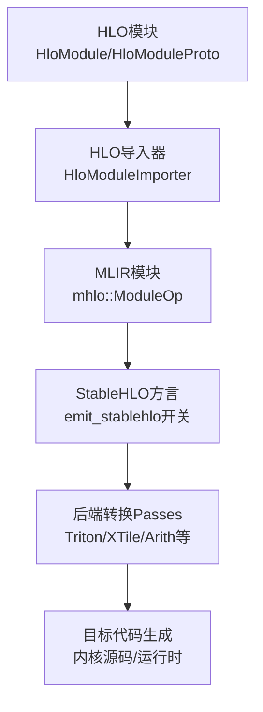
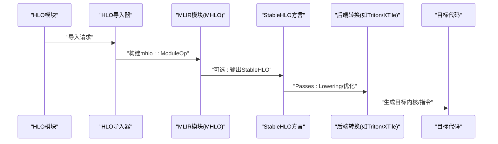
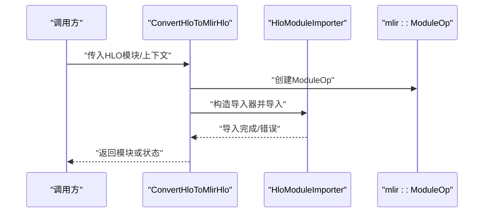
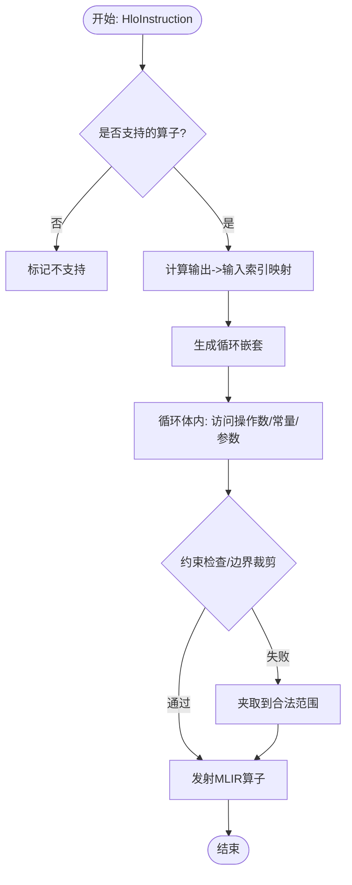
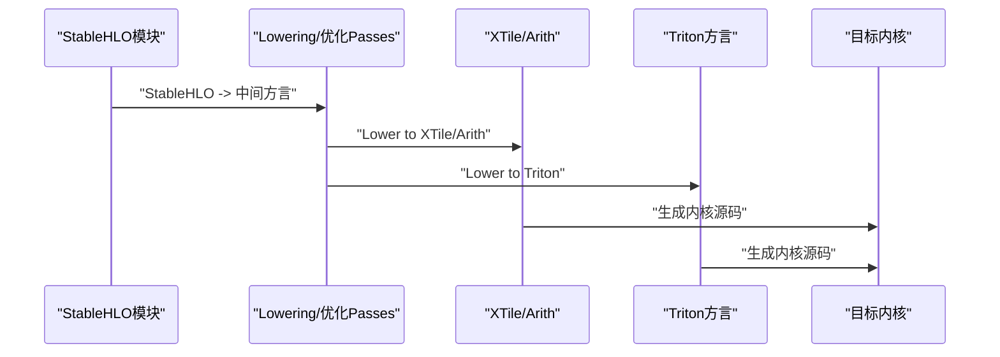
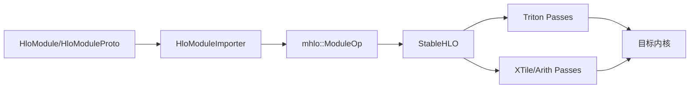

# MLIR转换

<cite>
**本文引用的文件**
- [elemental_hlo_to_mlir.cc](file://xla/codegen/emitters/elemental_hlo_to_mlir.cc)
- [elemental_hlo_to_mlir.h](file://xla/codegen/emitters/elemental_hlo_to_mlir.h)
- [hlo_to_mlir_hlo.cc](file://xla/hlo/translate/hlo_to_mhlo/hlo_to_mlir_hlo.cc)
- [hlo_to_mlir_hlo.h](file://xla/hlo/translate/hlo_to_mhlo/hlo_to_mlir_hlo.h)
- [stablehlo_axpy.mlir](file://xla/examples/axpy/stablehlo_axpy.mlir)
- [stablehlo_lower_to_triton.cc](file://xla/backends/gpu/codegen/triton/transforms/stablehlo_lower_to_triton.cc)
- [lower_stablehlo_to_xtile.cc](file://xla/codegen/xtile/ir/transforms/lower_stablehlo_to_xtile.cc)
- [lower_stablehlo_to_arith.cc](file://xla/codegen/xtile/ir/transforms/lower_stablehlo_to_arith.cc)
- [mlir_kernel_source.cc](file://xla/codegen/mlir_kernel_source.cc)
- [mlir_kernel_source.h](file://xla/codegen/mlir_kernel_source.h)
- [trace_pass_instrumentation.cc](file://xla/codegen/trace_pass_instrumentation.cc)
- [trace_pass_instrumentation.h](file://xla/codegen/trace_pass_instrumentation.h)
- [mlir_to_hlo.cc](file://xla/pjrt/mlir_to_hlo.cc)
- [mlir_to_hlo.h](file://xla/pjrt/mlir_to_hlo.h)
</cite>

## 目录
1. [简介](#简介)
2. [项目结构](#项目结构)
3. [核心组件](#核心组件)
4. [架构总览](#架构总览)
5. [详细组件分析](#详细组件分析)
6. [依赖关系分析](#依赖关系分析)
7. [性能考量](#性能考量)
8. [故障排查指南](#故障排查指南)
9. [结论](#结论)
10. [附录](#附录)

## 简介
本文件系统性梳理XLA中从HLO到MLIR的转换体系，覆盖以下关键主题：
- HLO到MLIR（MHLO/StableHLO）的导入与稳定化流程
- 方言转换与属性传递机制
- 模式匹配与操作重写、结构变换
- 后端适配器（如GPU Triton、XTile等）的目标特定转换
- 转换流水线监控与调试验证方法

该文档面向对XLA内部转换链路感兴趣的工程师与研究者，既提供高层概览也包含代码级细节与可视化图示。

## 项目结构
围绕MLIR转换的关键目录与文件如下：
- HLO到MLIR导入层：位于 hlo/translate/hlo_to_mhlo，负责将HLO模块导入为MLIR模块（可选输出为StableHLO）
- 元素级发射器：位于 codegen/emitters，将HLO计算图映射为基于索引映射的MLIR张量/向量循环
- 后端转换与适配：位于 backends/*/codegen/* 与 codegen/xtile/ir/transforms，针对具体后端进行方言降级与优化
- 示例与测试：位于 examples/axpy 与各后端 transforms/tests 目录
- 运行时与工具：PJRT侧的MLIR-HLO互转、跟踪与调试工具

图表来源
- [hlo_to_mlir_hlo.cc](file://xla/hlo/translate/hlo_to_mhlo/hlo_to_mlir_hlo.cc#L34-L55)
- [hlo_to_mlir_hlo.h](file://xla/hlo/translate/hlo_to_mhlo/hlo_to_mlir_hlo.h#L42-L69)

章节来源
- [hlo_to_mlir_hlo.cc](file://xla/hlo/translate/hlo_to_mhlo/hlo_to_mlir_hlo.cc#L34-L80)
- [hlo_to_mlir_hlo.h](file://xla/hlo/translate/hlo_to_mhlo/hlo_to_mlir_hlo.h#L35-L70)

## 核心组件
- HLO导入与稳定化
  - 提供将HLO模块导入为MLIR模块的统一入口，支持选择是否扁平化函数参数/结果以及是否输出StableHLO方言
  - 导入过程中通过诊断处理器捕获并报告错误
- 元素级发射器
  - 基于索引映射（IndexingMap）在MLIR中生成循环体，处理归约、窗口归约、拼接、动态切片/更新、填充、点积/卷积、参数访问、常量等
  - 支持约束检查、边界夹取、类型转换与广播兼容
- 后端适配器
  - 将StableHLO或中间方言（如XTile、Arith）进一步降级为目标后端（如Triton、LLVM/Vector）
  - 针对不同硬件特性（如向量化、内存布局、寄存器分配）进行结构变换与优化
- 调试与验证
  - 提供转换流水线跟踪、Pass执行监控、错误诊断与状态返回
  - 支持从MLIR回转到HLO以进行一致性验证

章节来源
- [elemental_hlo_to_mlir.cc](file://xla/codegen/emitters/elemental_hlo_to_mlir.cc#L169-L621)
- [elemental_hlo_to_mlir.h](file://xla/codegen/emitters/elemental_hlo_to_mlir.h#L44-L150)
- [hlo_to_mlir_hlo.cc](file://xla/hlo/translate/hlo_to_mhlo/hlo_to_mlir_hlo.cc#L34-L80)

## 架构总览
下图展示从HLO到目标后端的整体转换路径，包括导入、稳定化、方言转换与后端适配。

图表来源
- [hlo_to_mlir_hlo.cc](file://xla/hlo/translate/hlo_to_mhlo/hlo_to_mlir_hlo.cc#L34-L55)
- [stablehlo_lower_to_triton.cc](file://xla/backends/gpu/codegen/triton/transforms/stablehlo_lower_to_triton.cc)
- [lower_stablehlo_to_xtile.cc](file://xla/codegen/xtile/ir/transforms/lower_stablehlo_to_xtile.cc)
- [lower_stablehlo_to_arith.cc](file://xla/codegen/xtile/ir/transforms/lower_stablehlo_to_arith.cc)

## 详细组件分析

### HLO到MLIR导入与稳定化
- 功能要点
  - 统一接口支持HloModule与HloModuleProto两种输入
  - 可配置是否导入所有计算（非仅入口可达）、是否扁平化元组参数/结果
  - 可选输出StableHLO方言（通过emit_stablehlo标志）
  - 使用诊断处理器集中捕获导入阶段的错误
- 关键流程
  - 创建MLIR模块
  - 调用HloModuleImporter执行导入
  - 返回模块或直接写入已有模块

图表来源
- [hlo_to_mlir_hlo.cc](file://xla/hlo/translate/hlo_to_mhlo/hlo_to_mlir_hlo.cc#L34-L80)
- [hlo_to_mlir_hlo.h](file://xla/hlo/translate/hlo_to_mhlo/hlo_to_mlir_hlo.h#L42-L69)

章节来源
- [hlo_to_mlir_hlo.cc](file://xla/hlo/translate/hlo_to_mhlo/hlo_to_mlir_hlo.cc#L34-L80)
- [hlo_to_mlir_hlo.h](file://xla/hlo/translate/hlo_to_mhlo/hlo_to_mlir_hlo.h#L35-L70)

### 元素级发射器：从HLO到MLIR循环
- 设计思想
  - 以IndexingMap为核心，将HLO指令的输出索引映射到输入索引，从而生成对应MLIR循环
  - 对常见算子（归约、窗口归约、拼接、动态切片/更新、填充、点积/卷积、常量、参数等）分别实现发射逻辑
  - 支持约束检查、边界夹取、类型转换与广播兼容
- 关键能力
  - 循环嵌套生成与迭代变量初始化
  - 归约/窗口归约的reducer子图调用
  - 动态索引的规范校验与边界裁剪
  - 复数/浮点/整型/布尔类型的兼容处理
- 适用范围
  - 支持大多数元素级HLO算子
  - 不支持异步通信、FFT、排序、自定义调用、while/conditional等复杂控制流

图表来源
- [elemental_hlo_to_mlir.cc](file://xla/codegen/emitters/elemental_hlo_to_mlir.cc#L169-L621)
- [elemental_hlo_to_mlir.h](file://xla/codegen/emitters/elemental_hlo_to_mlir.h#L101-L129)

章节来源
- [elemental_hlo_to_mlir.cc](file://xla/codegen/emitters/elemental_hlo_to_mlir.cc#L169-L621)
- [elemental_hlo_to_mlir.h](file://xla/codegen/emitters/elemental_hlo_to_mlir.h#L44-L150)

### StableHLO到后端方言的转换与适配
- Triton后端
  - 将StableHLO算子降级为Triton方言，结合形状推断与内存布局优化
  - 示例文件展示了StableHLO样例与编译测试
- XTile后端
  - 提供StableHLO到XTile/Arith的降级与优化序列
  - 包含测试用例，验证Lowering正确性
- 通用策略
  - 通过一系列Passes进行模式匹配与重写
  - 结合向量化、内存拷贝展开、循环融合等优化
  - 针对目标硬件特性（寄存器、缓存、SIMD宽度）进行结构变换

图表来源
- [stablehlo_lower_to_triton.cc](file://xla/backends/gpu/codegen/triton/transforms/stablehlo_lower_to_triton.cc)
- [lower_stablehlo_to_xtile.cc](file://xla/codegen/xtile/ir/transforms/lower_stablehlo_to_xtile.cc)
- [lower_stablehlo_to_arith.cc](file://xla/codegen/xtile/ir/transforms/lower_stablehlo_to_arith.cc)
- [stablehlo_axpy.mlir](file://xla/examples/axpy/stablehlo_axpy.mlir)

章节来源
- [stablehlo_lower_to_triton.cc](file://xla/backends/gpu/codegen/triton/transforms/stablehlo_lower_to_triton.cc)
- [lower_stablehlo_to_xtile.cc](file://xla/codegen/xtile/ir/transforms/lower_stablehlo_to_xtile.cc)
- [lower_stablehlo_to_arith.cc](file://xla/codegen/xtile/ir/transforms/lower_stablehlo_to_arith.cc)
- [stablehlo_axpy.mlir](file://xla/examples/axpy/stablehlo_axpy.mlir)

### 内核源码生成与运行时集成
- MLIR内核源码生成
  - 提供MLIR内核源码的封装与管理接口，便于后端生成目标代码
- PJRT侧MLIR-HLO互转
  - 支持从MLIR回转到HLO，用于验证转换正确性与一致性

章节来源
- [mlir_kernel_source.cc](file://xla/codegen/mlir_kernel_source.cc)
- [mlir_kernel_source.h](file://xla/codegen/mlir_kernel_source.h)
- [mlir_to_hlo.cc](file://xla/pjrt/mlir_to_hlo.cc)
- [mlir_to_hlo.h](file://xla/pjrt/mlir_to_hlo.h)

## 依赖关系分析
- 导入层依赖
  - HLO导入API依赖HloModuleImporter与MLIR上下文
  - 导入阶段使用诊断处理器统一处理错误
- 发射器依赖
  - 元素级发射器依赖索引分析、类型工具、算子映射与MLIR方言（Arith/SCF/Tensor/Vector/Complex）
  - 支持多种数值类型与复数运算
- 后端转换依赖
  - StableHLO到后端的降级依赖目标后端的方言与Passes
  - 示例与测试文件提供回归验证

图表来源
- [hlo_to_mlir_hlo.cc](file://xla/hlo/translate/hlo_to_mhlo/hlo_to_mlir_hlo.cc#L34-L55)
- [stablehlo_lower_to_triton.cc](file://xla/backends/gpu/codegen/triton/transforms/stablehlo_lower_to_triton.cc)
- [lower_stablehlo_to_xtile.cc](file://xla/codegen/xtile/ir/transforms/lower_stablehlo_to_xtile.cc)
- [lower_stablehlo_to_arith.cc](file://xla/codegen/xtile/ir/transforms/lower_stablehlo_to_arith.cc)

章节来源
- [hlo_to_mlir_hlo.cc](file://xla/hlo/translate/hlo_to_mhlo/hlo_to_mlir_hlo.cc#L34-L80)

## 性能考量
- 循环与向量化
  - 发射器支持将最后符号维向量化，需满足符号范围为[0, 2]/[0, 4]等条件
  - 通过循环嵌套与迭代变量初始化减少分支开销
- 类型与精度
  - 浮点扩展/截断与bf16处理在累加路径中需注意精度损失
  - 复数运算采用专用算子，避免多次拆装
- 广播与边界
  - 动态索引与边界裁剪在循环体内进行，应尽量减少额外比较
- 后端优化
  - StableHLO到后端的Passes通常包含融合、展开与寄存器分配优化
  - 针对目标硬件的内存访问模式与SIMD宽度进行适配

## 故障排查指南
- 导入阶段
  - 使用诊断处理器捕获导入错误，定位HLO模块问题
  - 检查emit_stablehlo与扁平化参数设置是否符合预期
- 发射阶段
  - 若出现“动态索引非标量”错误，确认已执行动态索引规范化Pass
  - 检查索引映射是否正确，边界裁剪是否生效
- 后端转换
  - 逐步启用Passes，观察StableHLO到目标方言的每一步变化
  - 使用示例文件与测试用例进行回归验证
- 调试工具
  - 利用转换流水线跟踪与Pass执行监控，定位瓶颈与异常
  - 在PJRT侧使用MLIR-HLO互转进行一致性检查

章节来源
- [hlo_to_mlir_hlo.cc](file://xla/hlo/translate/hlo_to_mhlo/hlo_to_mlir_hlo.cc#L51-L54)
- [elemental_hlo_to_mlir.cc](file://xla/codegen/emitters/elemental_hlo_to_mlir.cc#L304-L318)
- [trace_pass_instrumentation.cc](file://xla/codegen/trace_pass_instrumentation.cc)
- [trace_pass_instrumentation.h](file://xla/codegen/trace_pass_instrumentation.h)
- [mlir_to_hlo.cc](file://xla/pjrt/mlir_to_hlo.cc)
- [mlir_to_hlo.h](file://xla/pjrt/mlir_to_hlo.h)

## 结论
XLA的MLIR转换体系以HLO导入为基础，通过稳定的MHLO/StableHLO表示与元素级发射器生成高效循环，再由后端适配器将中间表示降级为目标硬件。该体系具备清晰的模块边界、完善的错误诊断与验证手段，并通过示例与测试保障转换质量。对于新后端接入，建议遵循StableHLO到目标方言的标准化Passes序列，并结合向量化与内存优化策略提升性能。

## 附录
- 示例与测试
  - StableHLO示例文件可用于验证导入与Lowering流程
  - 各后端transforms/tests目录提供具体Passes的输入/输出样例
- 工具与接口
  - MLIR内核源码封装便于后端集成
  - PJRT侧MLIR-HLO互转接口支持一致性验证

章节来源
- [stablehlo_axpy.mlir](file://xla/examples/axpy/stablehlo_axpy.mlir)
- [mlir_kernel_source.cc](file://xla/codegen/mlir_kernel_source.cc)
- [mlir_kernel_source.h](file://xla/codegen/mlir_kernel_source.h)
- [mlir_to_hlo.cc](file://xla/pjrt/mlir_to_hlo.cc)
- [mlir_to_hlo.h](file://xla/pjrt/mlir_to_hlo.h)