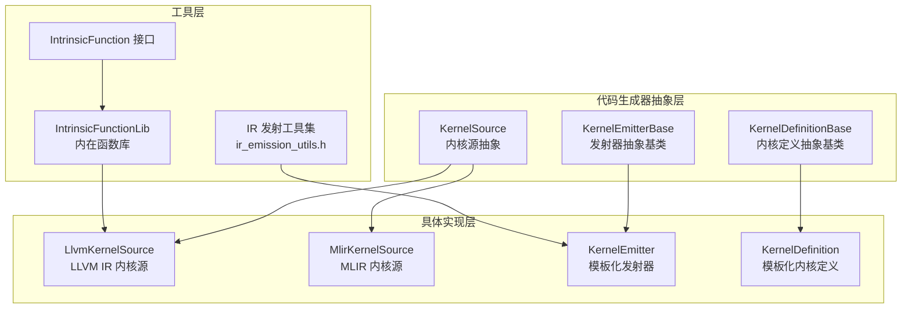
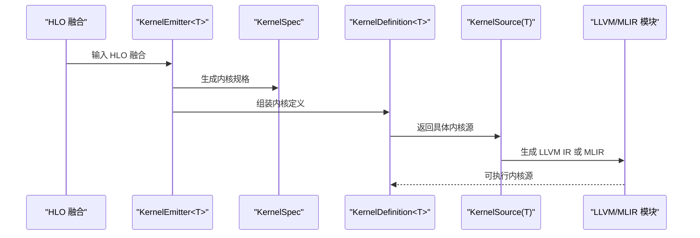
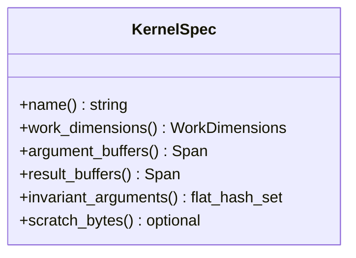
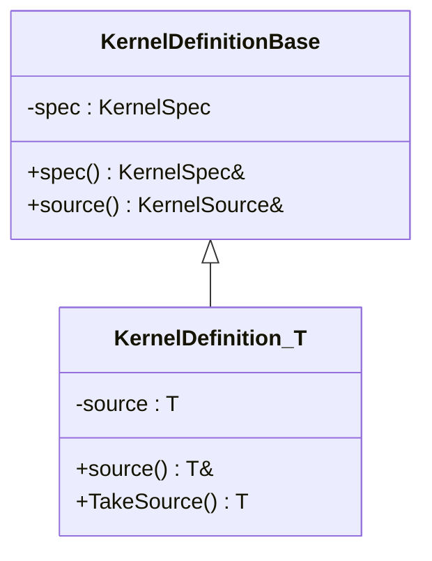
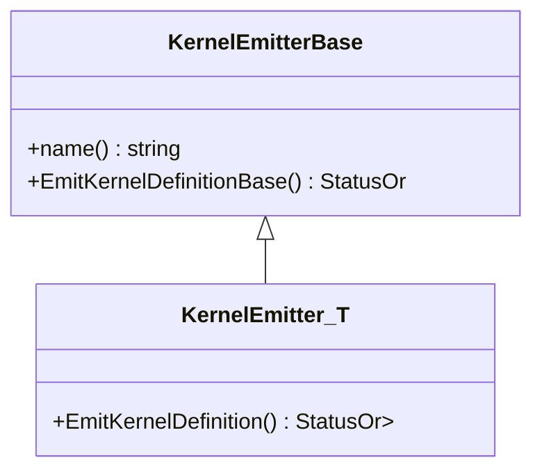
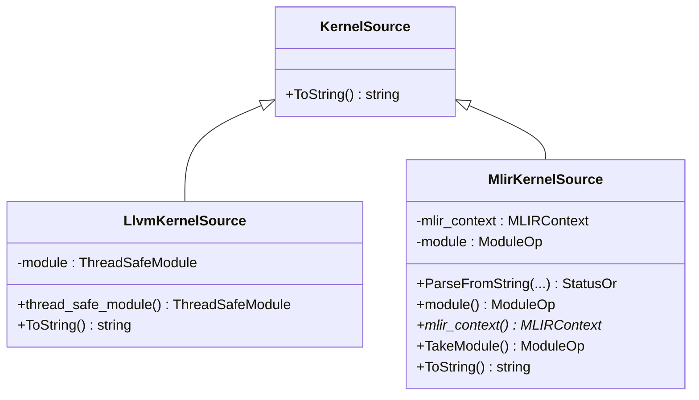
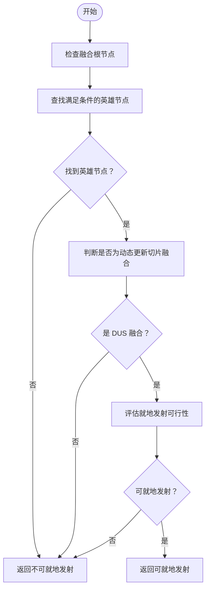
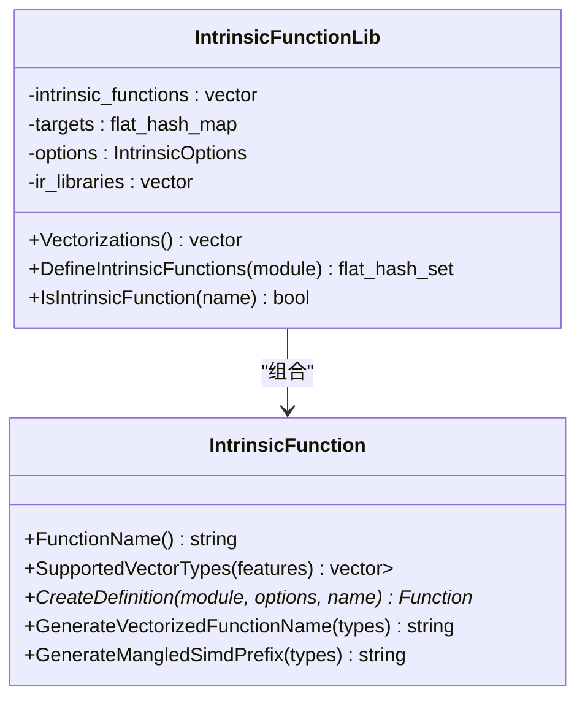
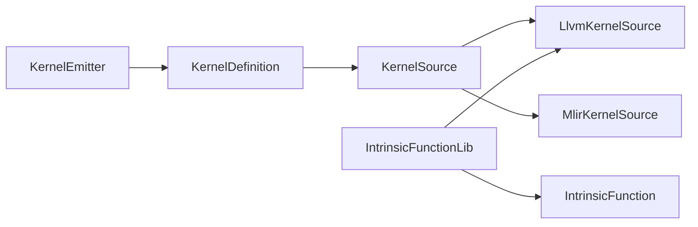

# 代码生成器

<cite>
**本文引用的文件**
- [xla/codegen/kernel_emitter.h](file://xla/codegen/kernel_emitter.h)
- [xla/codegen/kernel_spec.h](file://xla/codegen/kernel_spec.h)
- [xla/codegen/kernel_source.h](file://xla/codegen/kernel_source.h)
- [xla/codegen/kernel_definition.h](file://xla/codegen/kernel_definition.h)
- [xla/codegen/llvm_kernel_source.h](file://xla/codegen/llvm_kernel_source.h)
- [xla/codegen/mlir_kernel_source.h](file://xla/codegen/mlir_kernel_source.h)
- [xla/codegen/ir_emission_utils.h](file://xla/codegen/ir_emission_utils.h)
- [xla/codegen/intrinsic_lib.h](file://xla/codegen/intrinsic_lib.h)
- [xla/codegen/intrinsic_function.h](file://xla/codegen/intrinsic_function.h)
</cite>

## 目录
1. [引言](#引言)
2. [项目结构](#项目结构)
3. [核心组件](#核心组件)
4. [架构总览](#架构总览)
5. [详细组件分析](#详细组件分析)
6. [依赖关系分析](#依赖关系分析)
7. [性能考量](#性能考量)
8. [故障排查指南](#故障排查指南)
9. [结论](#结论)
10. [附录](#附录)

## 引言
本文件系统性梳理 XLA 代码生成器（Codegen）在从 HLO 指令到目标代码（LLVM IR/MLIR）的生成路径中的关键模块与流程，重点覆盖以下方面：
- 从 HLO 融合到内核规格（KernelSpec）与内核定义（KernelDefinition）的映射
- LLVM IR 与 MLIR 内核源（KernelSource）的抽象与使用
- 发射器（KernelEmitter）的统一接口与模板化实现
- 基于 HLO 的发射工具（IR emission utilities）
- 数学内在函数库（IntrinsicFunctionLib）与向量化近似替换
- 针对寄存器分配、内存访问模式与向量化的优化策略
- 扩展接口与自定义发射器的开发方法

## 项目结构
XLA 代码生成器位于 xla/codegen 目录下，采用“抽象基类 + 模板特化 + 后端特定实现”的分层设计：
- 抽象层：KernelSource、KernelEmitterBase、KernelDefinitionBase
- 具体层：LLVM IR 与 MLIR 内核源；模板化 KernelDefinition 与 KernelEmitter
- 工具层：IR 发射工具与数学内在函数库

图表来源
- [xla/codegen/kernel_source.h](file://xla/codegen/kernel_source.h#L23-L37)
- [xla/codegen/kernel_emitter.h](file://xla/codegen/kernel_emitter.h#L34-L70)
- [xla/codegen/kernel_definition.h](file://xla/codegen/kernel_definition.h#L34-L78)
- [xla/codegen/llvm_kernel_source.h](file://xla/codegen/llvm_kernel_source.h#L34-L51)
- [xla/codegen/mlir_kernel_source.h](file://xla/codegen/mlir_kernel_source.h#L41-L76)
- [xla/codegen/ir_emission_utils.h](file://xla/codegen/ir_emission_utils.h#L35-L72)
- [xla/codegen/intrinsic_function.h](file://xla/codegen/intrinsic_function.h#L36-L59)
- [xla/codegen/intrinsic_lib.h](file://xla/codegen/intrinsic_lib.h#L43-L67)

章节来源
- [xla/codegen/kernel_source.h](file://xla/codegen/kernel_source.h#L23-L37)
- [xla/codegen/kernel_emitter.h](file://xla/codegen/kernel_emitter.h#L34-L70)
- [xla/codegen/kernel_definition.h](file://xla/codegen/kernel_definition.h#L34-L78)
- [xla/codegen/llvm_kernel_source.h](file://xla/codegen/llvm_kernel_source.h#L34-L51)
- [xla/codegen/mlir_kernel_source.h](file://xla/codegen/mlir_kernel_source.h#L41-L76)
- [xla/codegen/ir_emission_utils.h](file://xla/codegen/ir_emission_utils.h#L35-L72)
- [xla/codegen/intrinsic_function.h](file://xla/codegen/intrinsic_function.h#L36-L59)
- [xla/codegen/intrinsic_lib.h](file://xla/codegen/intrinsic_lib.h#L43-L67)

## 核心组件
- 内核源（KernelSource）：抽象内核生成结果，支持 LLVM IR 与 MLIR 两种后端源。
- 内核规格（KernelSpec）：描述内核执行所需的并行维度、缓冲区布局、不变参数集合与临时内存需求。
- 内核定义（KernelDefinition<T>）：将 KernelSpec 与具体 KernelSource 绑定，提供取用与转移所有权的能力。
- 发射器（KernelEmitter<T>）：面向给定内核源类型 T，从 HLO 融合生成 KernelDefinition<T>。
- IR 发射工具（ir_emission_utils.h）：提供 HLO 融合特性判断与动态更新切片发射能力评估等工具。
- 数学内在函数库（IntrinsicFunctionLib）：提供向量化近似替换、内置函数定义注入与特征感知的向量化描述。

章节来源
- [xla/codegen/kernel_source.h](file://xla/codegen/kernel_source.h#L23-L37)
- [xla/codegen/kernel_spec.h](file://xla/codegen/kernel_spec.h#L41-L114)
- [xla/codegen/kernel_definition.h](file://xla/codegen/kernel_definition.h#L58-L78)
- [xla/codegen/kernel_emitter.h](file://xla/codegen/kernel_emitter.h#L56-L70)
- [xla/codegen/ir_emission_utils.h](file://xla/codegen/ir_emission_utils.h#L35-L72)
- [xla/codegen/intrinsic_lib.h](file://xla/codegen/intrinsic_lib.h#L43-L67)

## 架构总览
XLA 代码生成器以“HLO 融合 → 内核规格 → 内核定义 → 内核源（LLVM/MLIR）”为主线，结合 IR 发射工具与内在函数库完成从高层算子到目标代码的生成与优化。

图表来源
- [xla/codegen/kernel_emitter.h](file://xla/codegen/kernel_emitter.h#L56-L70)
- [xla/codegen/kernel_spec.h](file://xla/codegen/kernel_spec.h#L41-L114)
- [xla/codegen/kernel_definition.h](file://xla/codegen/kernel_definition.h#L58-L78)
- [xla/codegen/kernel_source.h](file://xla/codegen/kernel_source.h#L23-L37)
- [xla/codegen/llvm_kernel_source.h](file://xla/codegen/llvm_kernel_source.h#L34-L51)
- [xla/codegen/mlir_kernel_source.h](file://xla/codegen/mlir_kernel_source.h#L41-L76)

## 详细组件分析

### 组件一：内核规格（KernelSpec）
- 职责：描述内核执行的并行维度（工作簇、工作组、工作项）、参数与结果缓冲区切片、不变参数集合、以及所需临时内存大小。
- 关键点：
  - 并行维度语义由后端约定（如 GPU 的集群/块/线程映射），用于空间划分与数据局部性优化。
  - 不变参数集合用于运行时避免重复传输或重绑定。
  - 临时内存（scratch）通常映射到共享内存或缓存友好的运行时缓冲区。

图表来源
- [xla/codegen/kernel_spec.h](file://xla/codegen/kernel_spec.h#L41-L114)

章节来源
- [xla/codegen/kernel_spec.h](file://xla/codegen/kernel_spec.h#L41-L114)

### 组件二：内核定义（KernelDefinition<T>）
- 职责：持有 KernelSpec，并封装具体 KernelSource 类型 T 的实例，提供常量引用、可变引用与所有权转移接口。
- 关键点：模板化设计确保类型安全，TakeSource 支持将内核源移交给下游编译/装载流程。

图表来源
- [xla/codegen/kernel_definition.h](file://xla/codegen/kernel_definition.h#L34-L78)

章节来源
- [xla/codegen/kernel_definition.h](file://xla/codegen/kernel_definition.h#L34-L78)

### 组件三：发射器（KernelEmitter<T>）
- 职责：面向具体内核源类型 T，从 HLO 融合中生成 KernelDefinition<T>；通过基类接口向上转型为 KernelDefinitionBase，便于统一管理。
- 关键点：静态断言保证 T 必须是 KernelSource 的派生类型；模板化接口简化后端特定实现。

图表来源
- [xla/codegen/kernel_emitter.h](file://xla/codegen/kernel_emitter.h#L34-L70)

章节来源
- [xla/codegen/kernel_emitter.h](file://xla/codegen/kernel_emitter.h#L34-L70)

### 组件四：内核源（KernelSource 及其实现）
- KernelSource：抽象内核源字符串化接口。
- LlvmKernelSource：封装线程安全的 LLVM Module，支持移动语义与字符串化。
- MlirKernelSource：封装 MLIR ModuleOp 与其上下文，支持解析、移动所有权与字符串化。

图表来源
- [xla/codegen/kernel_source.h](file://xla/codegen/kernel_source.h#L23-L37)
- [xla/codegen/llvm_kernel_source.h](file://xla/codegen/llvm_kernel_source.h#L34-L51)
- [xla/codegen/mlir_kernel_source.h](file://xla/codegen/mlir_kernel_source.h#L41-L76)

章节来源
- [xla/codegen/kernel_source.h](file://xla/codegen/kernel_source.h#L23-L37)
- [xla/codegen/llvm_kernel_source.h](file://xla/codegen/llvm_kernel_source.h#L34-L51)
- [xla/codegen/mlir_kernel_source.h](file://xla/codegen/mlir_kernel_source.h#L41-L76)

### 组件五：IR 发射工具（ir_emission_utils.h）
- 功能要点：
  - 判断中间节点是否为元素级（IsIntermediate）
  - 在融合根节点上查找满足条件的“英雄节点”（FindHero）
  - 判断动态更新切片融合（IsDynamicUpdateSliceFusion）
  - 获取输出所“定义”的动态更新切片子图（GetOutputDefiningDynamicUpdateSlices）
  - 评估是否可就地发射动态更新切片（CanEmitFusedDynamicUpdateSliceInPlace）

图表来源
- [xla/codegen/ir_emission_utils.h](file://xla/codegen/ir_emission_utils.h#L35-L72)

章节来源
- [xla/codegen/ir_emission_utils.h](file://xla/codegen/ir_emission_utils.h#L35-L72)

### 组件六：数学内在函数库（IntrinsicFunctionLib 与 IntrinsicFunction）
- IntrinsicFunction：定义单个向量化数学近似的接口，包含函数名、支持的向量类型、生成定义与向量化函数名/前缀等。
- IntrinsicFunctionLib：
  - 提供向量化描述（Vectorizations），驱动 LLVM 向量化 Pass 将标量数学函数向量化为自定义调用
  - 注入内置函数定义（DefineIntrinsicFunctions），进行内联、常量传播与早期 CSE，移除死代码
  - 查询某函数是否为内置函数（IsIntrinsicFunction）

图表来源
- [xla/codegen/intrinsic_function.h](file://xla/codegen/intrinsic_function.h#L36-L59)
- [xla/codegen/intrinsic_lib.h](file://xla/codegen/intrinsic_lib.h#L43-L67)

章节来源
- [xla/codegen/intrinsic_function.h](file://xla/codegen/intrinsic_function.h#L36-L59)
- [xla/codegen/intrinsic_lib.h](file://xla/codegen/intrinsic_lib.h#L43-L67)

## 依赖关系分析
- KernelEmitter<T> 依赖 KernelSource 的派生类型 T，通过模板约束保证类型安全
- KernelDefinition<T> 依赖 KernelSpec 与具体 KernelSource 实例
- LlvmKernelSource/MlirKernelSource 分别依赖 LLVM/MLIR 运行时对象
- IntrinsicFunctionLib 依赖 LLVM TargetLibraryInfo 与 LLVM IR Module，配合向量化描述与内置函数定义注入

图表来源
- [xla/codegen/kernel_emitter.h](file://xla/codegen/kernel_emitter.h#L56-L70)
- [xla/codegen/kernel_definition.h](file://xla/codegen/kernel_definition.h#L58-L78)
- [xla/codegen/kernel_source.h](file://xla/codegen/kernel_source.h#L23-L37)
- [xla/codegen/llvm_kernel_source.h](file://xla/codegen/llvm_kernel_source.h#L34-L51)
- [xla/codegen/mlir_kernel_source.h](file://xla/codegen/mlir_kernel_source.h#L41-L76)
- [xla/codegen/intrinsic_lib.h](file://xla/codegen/intrinsic_lib.h#L43-L67)
- [xla/codegen/intrinsic_function.h](file://xla/codegen/intrinsic_function.h#L36-L59)

章节来源
- [xla/codegen/kernel_emitter.h](file://xla/codegen/kernel_emitter.h#L56-L70)
- [xla/codegen/kernel_definition.h](file://xla/codegen/kernel_definition.h#L58-L78)
- [xla/codegen/kernel_source.h](file://xla/codegen/kernel_source.h#L23-L37)
- [xla/codegen/llvm_kernel_source.h](file://xla/codegen/llvm_kernel_source.h#L34-L51)
- [xla/codegen/mlir_kernel_source.h](file://xla/codegen/mlir_kernel_source.h#L41-L76)
- [xla/codegen/intrinsic_lib.h](file://xla/codegen/intrinsic_lib.h#L43-L67)
- [xla/codegen/intrinsic_function.h](file://xla/codegen/intrinsic_function.h#L36-L59)

## 性能考量
- 寄存器分配与向量化
  - 通过 IntrinsicFunctionLib 的向量化描述（Vectorizations）引导 LLVM 向量化 Pass，将标量数学函数向量化为自定义近似函数，减少标量开销并提升吞吐
  - 自定义近似函数在 DefineIntrinsicFunctions 中被注入并内联，随后进行常量传播与早期 CSE，降低冗余计算
- 内存访问模式优化
  - KernelSpec 的并行维度与缓冲区切片（ShapedSlice）为后端划分与数据局部性优化提供依据；不变参数集合（invariant_arguments）减少不必要的数据搬运
- 临时内存（Scratch）
  - 通过 scratch_bytes 指示后端共享/缓存友好内存需求，有助于减少全局内存带宽压力

章节来源
- [xla/codegen/intrinsic_lib.h](file://xla/codegen/intrinsic_lib.h#L43-L67)
- [xla/codegen/kernel_spec.h](file://xla/codegen/kernel_spec.h#L82-L101)

## 故障排查指南
- 发射失败或不匹配
  - 确认 HLO 融合根节点满足 IR 发射工具的前置条件（如是否存在英雄节点、是否为动态更新切片融合）
  - 使用 IR 发射工具的判断函数（如 CanEmitFusedDynamicUpdateSliceInPlace）评估就地发射可行性
- 内核源问题
  - 若使用 LLVM IR 源，确认 ThreadSafeModule 构造与移动语义正确
  - 若使用 MLIR 源，确认 ModuleOp 与 MLIR 上下文的生命周期与所有权转移（TakeModule）
- 向量化近似未生效
  - 检查 Vectorizations 是否被 LLVM Pass 链采纳
  - 确认 DefineIntrinsicFunctions 成功注入并完成内联与死代码清理

章节来源
- [xla/codegen/ir_emission_utils.h](file://xla/codegen/ir_emission_utils.h#L35-L72)
- [xla/codegen/llvm_kernel_source.h](file://xla/codegen/llvm_kernel_source.h#L34-L51)
- [xla/codegen/mlir_kernel_source.h](file://xla/codegen/mlir_kernel_source.h#L41-L76)
- [xla/codegen/intrinsic_lib.h](file://xla/codegen/intrinsic_lib.h#L43-L67)

## 结论
XLA 代码生成器通过 KernelSource/KernelSpec/KernelDefinition/KernelEmitter 的分层抽象，将 HLO 融合映射为可执行的 LLVM/MLIR 内核源；IR 发射工具与内在函数库进一步完善了从高层算子到高性能目标代码的生成链路。该体系既保证了类型安全与后端解耦，又为扩展与优化提供了清晰的接口与路径。

## 附录
- 扩展接口与自定义发射器开发建议
  - 新增后端内核源：继承 KernelSource 并实现 ToString；若涉及 LLVM/MLIR，参考 LlvmKernelSource/MlirKernelSource 的封装方式
  - 新增发射器：继承 KernelEmitterBase 并特化 KernelEmitter<T>，在 EmitKernelDefinition 中生成 KernelSpec 与 KernelDefinition<T>
  - 新增数学近似：实现 IntrinsicFunction 接口，提供支持的向量类型与定义生成逻辑；注册至 IntrinsicFunctionLib
  - 集成 IR 发射工具：在 HLO 层面利用 ir_emission_utils.h 的工具函数进行融合特性判断与可行性评估

章节来源
- [xla/codegen/kernel_source.h](file://xla/codegen/kernel_source.h#L23-L37)
- [xla/codegen/kernel_emitter.h](file://xla/codegen/kernel_emitter.h#L56-L70)
- [xla/codegen/intrinsic_function.h](file://xla/codegen/intrinsic_function.h#L36-L59)
- [xla/codegen/intrinsic_lib.h](file://xla/codegen/intrinsic_lib.h#L43-L67)
- [xla/codegen/ir_emission_utils.h](file://xla/codegen/ir_emission_utils.h#L35-L72)