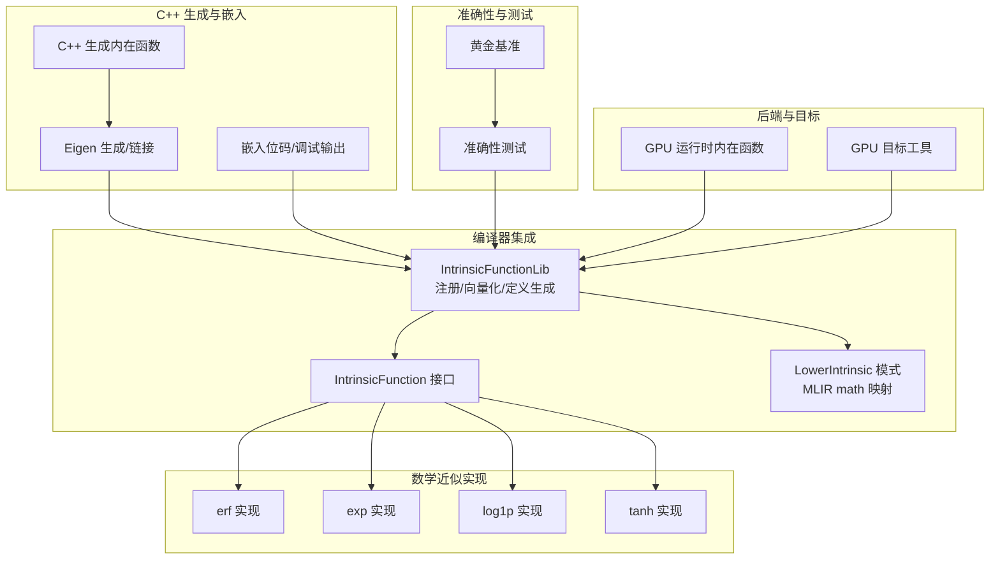
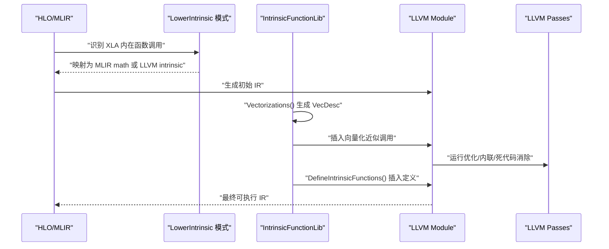
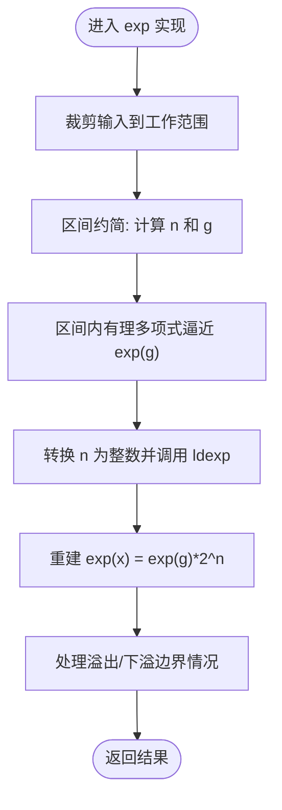
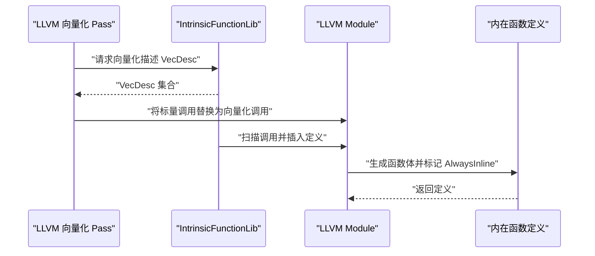
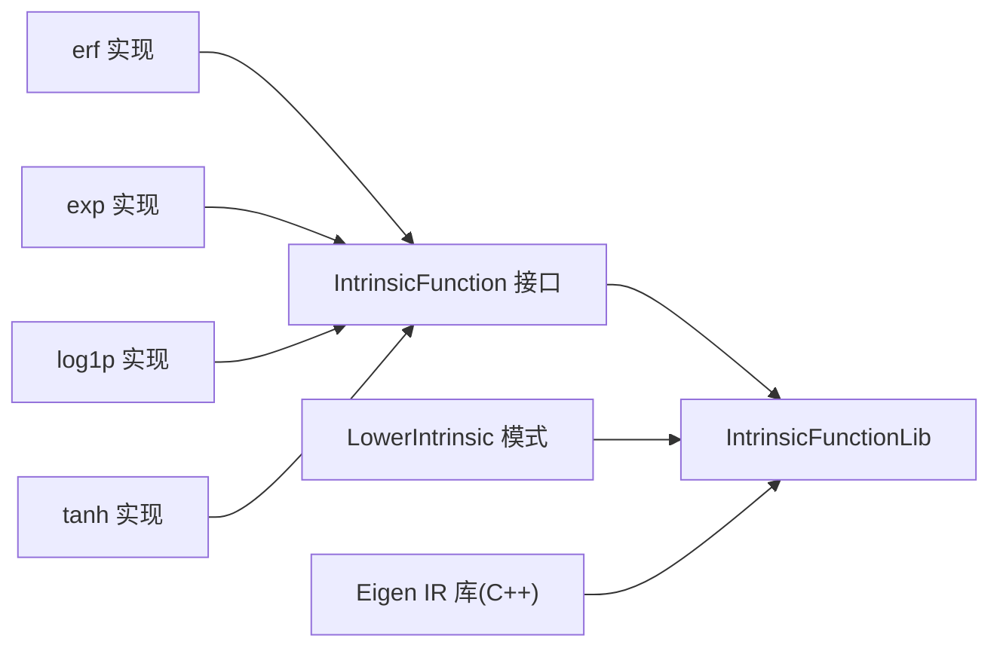

# 内在函数

<cite>
**本文引用的文件**
- [xla/codegen/intrinsic_lib.h](file://xla/codegen/intrinsic_lib.h)
- [xla/codegen/intrinsic_lib.cc](file://xla/codegen/intrinsic_lib.cc)
- [xla/codegen/intrinsic_function.h](file://xla/codegen/intrinsic_function.h)
- [xla/codegen/emitters/transforms/lower_xla_intrinsic_lib.cc](file://xla/codegen/emitters/transforms/lower_xla_intrinsic_lib.cc)
- [xla/codegen/intrinsic/erf.cc](file://xla/codegen/intrinsic/erf.cc)
- [xla/codegen/intrinsic/exp.cc](file://xla/codegen/intrinsic/exp.cc)
- [xla/codegen/intrinsic/log1p.cc](file://xla/codegen/intrinsic/log1p.cc)
- [xla/codegen/intrinsic/tanh.cc](file://xla/codegen/intrinsic/tanh.cc)
- [xla/codegen/intrinsic/cpp/cpp_gen_intrinsics.cc](file://xla/codegen/intrinsic/cpp/cpp_gen_intrinsics.cc)
- [xla/codegen/intrinsic/cpp/eigen_unary.cc](file://xla/codegen/intrinsic/cpp/eigen_unary.cc)
- [xla/codegen/intrinsic/cpp/embed_bitcode.cc](file://xla/codegen/intrinsic/cpp/embed_bitcode.cc)
- [xla/codegen/intrinsic/cpp/dump_llvm_ir.cc](file://xla/codegen/intrinsic/cpp/dump_llvm_ir.cc)
- [xla/codegen/intrinsic/accuracy/intrinsic_accuracy_test.cc](file://xla/codegen/intrinsic/accuracy/intrinsic_accuracy_test.cc)
- [xla/codegen/intrinsic/accuracy/golden_baselines.cc](file://xla/codegen/intrinsic/accuracy/golden_baselines.cc)
- [xla/codegen/intrinsic/intrinsic_compiler_lib.cc](file://xla/codegen/intrinsic/intrinsic_compiler_lib.cc)
- [xla/codegen/intrinsic/intrinsic_compiler_lib_test.cc](file://xla/codegen/intrinsic/intrinsic_compiler_lib_test.cc)
- [xla/backends/gpu/runtime/runtime_intrinsics.cc](file://xla/backends/gpu/runtime/runtime_intrinsics.cc)
- [xla/service/gpu/target_util.cc](file://xla/service/gpu/target_util.cc)
</cite>

## 目录
1. [简介](#简介)
2. [项目结构](#项目结构)
3. [核心组件](#核心组件)
4. [架构总览](#架构总览)
5. [组件详解](#组件详解)
6. [依赖关系分析](#依赖关系分析)
7. [性能考量](#性能考量)
8. [故障排查指南](#故障排查指南)
9. [结论](#结论)
10. [附录：扩展与配置](#附录扩展与配置)

## 简介
本文件系统性阐述 XLA 内在函数（Intrinsic）体系的设计与实现，覆盖数学与数值计算内在函数（如指数、对数、误差函数、双曲正切等）、编译器集成流程（从 HLO 到 MLIR/LLVM 的 lowering、向量化、内联与函数定义生成）、优化策略（精度控制、性能权衡、硬件特定优化），以及扩展接口（新增自定义数学函数与配置方法）。文档面向不同技术背景的读者，既提供高层概览，也包含代码级图示与定位路径。

## 项目结构
与内在函数相关的关键目录与文件：
- 编译器集成与库管理
  - xla/codegen/intrinsic_lib.{h,cc}: 内在函数库入口，负责注册内置内在函数、生成向量化描述、扫描模块并插入内在函数定义。
  - xla/codegen/intrinsic_function.h: 内在函数抽象接口，统一支持多类型/多向量宽度的近似实现。
  - xla/codegen/emitters/transforms/lower_xla_intrinsic_lib.cc: 将 XLA 内在函数映射到 MLIR math 原语或 LLVM intrinsic。
- 数学近似实现
  - xla/codegen/intrinsic/erf.cc, exp.cc, log1p.cc, tanh.cc: 各种数学函数的 LLVM IR 近似实现。
- C++ 生成与嵌入
  - xla/codegen/intrinsic/cpp/cpp_gen_intrinsics.cc, eigen_unary.cc, embed_bitcode.cc, dump_llvm_ir.cc: C++ 侧生成、链接与调试工具。
- 准确性与测试
  - xla/codegen/intrinsic/accuracy/intrinsic_accuracy_test.cc, golden_baselines.cc: 准确性评估与基准数据。
- 编译期工具链
  - xla/codegen/intrinsic/intrinsic_compiler_lib.{cc,test}: 编译期内在函数编译与验证。
- 后端与目标平台
  - xla/backends/gpu/runtime/runtime_intrinsics.cc: GPU 运行时内在函数支持。
  - xla/service/gpu/target_util.cc: GPU 平台内在函数/原语选择与映射。

**图表来源**
- [xla/codegen/intrinsic_lib.cc](file://xla/codegen/intrinsic_lib.cc#L150-L174)
- [xla/codegen/intrinsic_function.h](file://xla/codegen/intrinsic_function.h#L36-L59)
- [xla/codegen/emitters/transforms/lower_xla_intrinsic_lib.cc](file://xla/codegen/emitters/transforms/lower_xla_intrinsic_lib.cc#L278-L281)
- [xla/codegen/intrinsic/erf.cc](file://xla/codegen/intrinsic/erf.cc#L107-L138)
- [xla/codegen/intrinsic/exp.cc](file://xla/codegen/intrinsic/exp.cc#L54-L222)
- [xla/codegen/intrinsic/log1p.cc](file://xla/codegen/intrinsic/log1p.cc#L49-L127)
- [xla/codegen/intrinsic/tanh.cc](file://xla/codegen/intrinsic/tanh.cc#L167-L201)
- [xla/codegen/intrinsic/cpp/cpp_gen_intrinsics.cc](file://xla/codegen/intrinsic/cpp/cpp_gen_intrinsics.cc)
- [xla/codegen/intrinsic/cpp/eigen_unary.cc](file://xla/codegen/intrinsic/cpp/eigen_unary.cc)
- [xla/codegen/intrinsic/cpp/embed_bitcode.cc](file://xla/codegen/intrinsic/cpp/embed_bitcode.cc)
- [xla/codegen/intrinsic/accuracy/intrinsic_accuracy_test.cc](file://xla/codegen/intrinsic/accuracy/intrinsic_accuracy_test.cc)
- [xla/codegen/intrinsic/accuracy/golden_baselines.cc](file://xla/codegen/intrinsic/accuracy/golden_baselines.cc)
- [xla/backends/gpu/runtime/runtime_intrinsics.cc](file://xla/backends/gpu/runtime/runtime_intrinsics.cc)
- [xla/service/gpu/target_util.cc](file://xla/service/gpu/target_util.cc#L67-L73)

**章节来源**
- [xla/codegen/intrinsic_lib.h](file://xla/codegen/intrinsic_lib.h#L34-L67)
- [xla/codegen/intrinsic_lib.cc](file://xla/codegen/intrinsic_lib.cc#L150-L174)

## 核心组件
- IntrinsicFunction 抽象接口：定义了“被近似的函数名”、“支持的向量类型集合”、“按签名生成 LLVM IR 定义”、“向量化函数名与 SIMD 前缀生成”的统一规范。
- IntrinsicFunctionLib：负责：
  - 注册内置内在函数（如 exp、log1p、erf、rsqrt、tanh、ldexp、fptrunc）。
  - 生成 VecDesc 向量化描述，驱动 LLVM 向量化 Pass 将标量数学函数替换为向量化近似调用。
  - 在优化后扫描模块中的调用，按需插入相应内在函数定义，并进行早期内联与死代码消除。
  - 针对 CPU 设备类型，链接 C++ 生成的 IR 库（如 Eigen）以提供额外近似实现。
- LowerIntrinsic 模式：将 XLA 内在函数映射到 MLIR math 原语或 LLVM intrinsic，确保后续代码生成阶段能正确处理。

**章节来源**
- [xla/codegen/intrinsic_function.h](file://xla/codegen/intrinsic_function.h#L31-L59)
- [xla/codegen/intrinsic_lib.cc](file://xla/codegen/intrinsic_lib.cc#L150-L174)
- [xla/codegen/intrinsic_lib.cc](file://xla/codegen/intrinsic_lib.cc#L227-L266)
- [xla/codegen/intrinsic_lib.cc](file://xla/codegen/intrinsic_lib.cc#L292-L322)
- [xla/codegen/emitters/transforms/lower_xla_intrinsic_lib.cc](file://xla/codegen/emitters/transforms/lower_xla_intrinsic_lib.cc#L278-L281)

## 架构总览
下图展示了从 HLO/MLIR 到 LLVM IR 的内在函数 lowering 流程，以及内在函数库如何参与向量化与定义生成：

**图表来源**
- [xla/codegen/emitters/transforms/lower_xla_intrinsic_lib.cc](file://xla/codegen/emitters/transforms/lower_xla_intrinsic_lib.cc#L278-L281)
- [xla/codegen/intrinsic_lib.cc](file://xla/codegen/intrinsic_lib.cc#L227-L266)
- [xla/codegen/intrinsic_lib.cc](file://xla/codegen/intrinsic_lib.cc#L292-L322)

## 组件详解

### 数学与数值计算内在函数实现
- 误差函数（erf）
  - 使用有理插值多项式实现，针对 |x| 的阈值进行裁剪与符号处理；通过 FMA intrinsics 提升乘加效率。
  - 支持 f32 标量与向量类型。
- 指数函数（exp）
  - 采用区间约简与分段有理逼近：先将 x 约简为 g ∈ [-ln2/2, ln2/2]，再在小区间上用 P/Q 多项式逼近 exp(g)，最后通过 2^n 重建（使用整数移位实现的 ldexp）。
  - 对溢出/下溢输入显式选择 ±∞/0，保证数值稳定性。
  - 仅支持 f64 类型。
- 对数一类（log1p）
  - 根据 |x| 的大小选择两种策略：大输入直接用 log(x+1)；小输入使用基于 Cephes 的有理逼近，结合 x² 项提升精度。
- 双曲正切（tanh）
  - 针对不同精度（f16/f32/f64）采用不同的多项式系数与输入裁剪范围；对极大输入直接返回 ±1；在 f32 中启用 FMA 以提升性能。

**图表来源**
- [xla/codegen/intrinsic/exp.cc](file://xla/codegen/intrinsic/exp.cc#L116-L218)

**章节来源**
- [xla/codegen/intrinsic/erf.cc](file://xla/codegen/intrinsic/erf.cc#L36-L105)
- [xla/codegen/intrinsic/erf.cc](file://xla/codegen/intrinsic/erf.cc#L107-L138)
- [xla/codegen/intrinsic/exp.cc](file://xla/codegen/intrinsic/exp.cc#L54-L222)
- [xla/codegen/intrinsic/log1p.cc](file://xla/codegen/intrinsic/log1p.cc#L49-L127)
- [xla/codegen/intrinsic/tanh.cc](file://xla/codegen/intrinsic/tanh.cc#L167-L201)

### 编译器集成：函数调用转换、参数传递与返回值处理
- 调用转换
  - LowerIntrinsic 模式将 XLA 内在函数映射到 MLIR math 原语或 LLVM intrinsic，便于后续代码生成。
- 参数传递与返回值
  - 所有内在函数均以 LLVM FunctionType::get(type, {type}, false) 形式声明，参数与返回值类型一致；向量化版本通过 Type 描述器确定元素类型与向量宽度。
- 向量化与替换
  - IntrinsicFunctionLib::Vectorizations() 生成 VecDesc，驱动 LLVM 向量化 Pass 将标量调用替换为向量化近似调用。
- 定义生成与内联
  - DefineIntrinsicFunctions() 扫描模块中被调用的目标函数，按需生成定义并设置 AlwaysInline 属性，随后运行早期优化 Pass 清理冗余。

**图表来源**
- [xla/codegen/intrinsic_lib.cc](file://xla/codegen/intrinsic_lib.cc#L227-L266)
- [xla/codegen/intrinsic_lib.cc](file://xla/codegen/intrinsic_lib.cc#L292-L322)

**章节来源**
- [xla/codegen/intrinsic_lib.cc](file://xla/codegen/intrinsic_lib.cc#L227-L266)
- [xla/codegen/intrinsic_lib.cc](file://xla/codegen/intrinsic_lib.cc#L292-L322)
- [xla/codegen/emitters/transforms/lower_xla_intrinsic_lib.cc](file://xla/codegen/emitters/transforms/lower_xla_intrinsic_lib.cc#L278-L281)

### 优化策略：精度控制、性能权衡与硬件特定优化
- 精度控制
  - exp 对 f64 使用更高精度常数与区间约简策略；tanh 针对 f16/f32/f64 分别采用不同系数与裁剪范围；log1p 在小输入使用有理逼近，在大输入直接调用 log 以避免舍入误差。
- 性能权衡
  - 向量化：通过 VecDesc 与 LLVM 向量化 Pass 提升吞吐；FMA intrinsics 用于乘加组合，减少中间舍入。
  - 内联与早期优化：定义标记 AlwaysInline，并运行 SCCP/EarlyCSE/GlobalDCE 等 Pass，去除冗余计算。
- 硬件特定优化
  - GPU 平台：根据目标架构（nvptx/amdgpu/spir）选择合适的 intrinsic 或函数；运行时内在函数在后端中实现。
  - CPU 平台：在特定设备类型下链接 C++ 生成的 IR 库（如 Eigen），提供高效的近似实现。

**章节来源**
- [xla/codegen/intrinsic/exp.cc](file://xla/codegen/intrinsic/exp.cc#L54-L61)
- [xla/codegen/intrinsic/tanh.cc](file://xla/codegen/intrinsic/tanh.cc#L183-L198)
- [xla/codegen/intrinsic/log1p.cc](file://xla/codegen/intrinsic/log1p.cc#L76-L122)
- [xla/codegen/intrinsic_lib.cc](file://xla/codegen/intrinsic_lib.cc#L150-L158)
- [xla/service/gpu/target_util.cc](file://xla/service/gpu/target_util.cc#L67-L73)
- [xla/service/gpu/target_util.cc](file://xla/service/gpu/target_util.cc#L459-L466)
- [xla/backends/gpu/runtime/runtime_intrinsics.cc](file://xla/backends/gpu/runtime/runtime_intrinsics.cc)

## 依赖关系分析
- 组件耦合
  - IntrinsicFunctionLib 依赖 IntrinsicFunction 抽象接口与具体实现（erf、exp、log1p、tanh 等），并通过 VecDesc 驱动 LLVM 向量化。
  - LowerIntrinsic 模式与 MLIR math 原语/LLVM intrinsic 存在映射关系，确保 IR 一致性。
- 外部依赖
  - LLVM IRBuilder、Intrinsics、Passes（AlwaysInliner、EarlyCSE、GlobalDCE 等）。
  - C++ 生成库（如 Eigen）在 CPU 平台提供额外近似实现。
- 循环依赖
  - 无直接循环；IntrinsicFunctionLib 仅单向依赖具体实现类。

**图表来源**
- [xla/codegen/intrinsic_function.h](file://xla/codegen/intrinsic_function.h#L36-L59)
- [xla/codegen/intrinsic_lib.cc](file://xla/codegen/intrinsic_lib.cc#L150-L174)
- [xla/codegen/emitters/transforms/lower_xla_intrinsic_lib.cc](file://xla/codegen/emitters/transforms/lower_xla_intrinsic_lib.cc#L278-L281)
- [xla/codegen/intrinsic/cpp/eigen_unary.cc](file://xla/codegen/intrinsic/cpp/eigen_unary.cc)

**章节来源**
- [xla/codegen/intrinsic_lib.cc](file://xla/codegen/intrinsic_lib.cc#L150-L174)
- [xla/codegen/intrinsic_function.h](file://xla/codegen/intrinsic_function.h#L36-L59)

## 性能考量
- 向量化与 SIMD
  - 通过 VecDesc 描述不同向量宽度间的替换关系，使 LLVM 能将标量数学函数自动向量化为近似实现。
- 内存与寄存器
  - 使用常量折叠与早期常量传播（SCCP/EarlyCSE）减少重复计算；通过 AlwaysInline 降低调用开销。
- 硬件特性
  - 在 GPU 平台利用目标 intrinsic 与运行时内在函数；在 CPU 平台借助 C++ 生成库（如 Eigen）提供高效实现。
- 精度与速度
  - 不同函数采用不同策略：tanh 在 f32 中启用 FMA 提升速度；exp 对 f64 使用高精度常数；log1p 在小输入使用有理逼近以提升精度。

[本节为通用指导，无需列出具体文件来源]

## 故障排查指南
- 模块校验失败
  - DefineIntrinsicFunctions() 在完成定义插入后会进行模块校验，若失败会输出 IR 以便定位问题。
- 向量化不生效
  - 检查 Vectorizations() 生成的 VecDesc 是否正确，确认目标类型与向量宽度匹配；确保 LowerIntrinsic 模式已将调用映射到可向量化形式。
- 精度异常
  - 核对 exp/tanh/log1p 的输入范围与裁剪逻辑；检查是否选择了正确的实现分支（如 f16/f32/f64）。
- GPU 平台问题
  - 检查目标工具选择的 intrinsic 或函数映射是否正确；确认运行时内在函数可用。

**章节来源**
- [xla/codegen/intrinsic_lib.cc](file://xla/codegen/intrinsic_lib.cc#L318-L321)
- [xla/codegen/intrinsic/exp.cc](file://xla/codegen/intrinsic/exp.cc#L116-L129)
- [xla/codegen/intrinsic/tanh.cc](file://xla/codegen/intrinsic/tanh.cc#L183-L198)
- [xla/codegen/intrinsic/log1p.cc](file://xla/codegen/intrinsic/log1p.cc#L76-L122)
- [xla/service/gpu/target_util.cc](file://xla/service/gpu/target_util.cc#L459-L466)

## 结论
XLA 内在函数系统通过统一的抽象接口与编译器集成机制，实现了数学与数值计算内在函数的高效向量化与近似实现。其设计兼顾精度与性能，并针对不同硬件平台提供优化路径。通过准确性测试与基准数据，系统能够持续保证近似质量。对于扩展需求，可通过新增 IntrinsicFunction 实现与注册流程，快速接入新的数学函数。

[本节为总结性内容，无需列出具体文件来源]

## 附录：扩展与配置
- 新增数学函数步骤
  - 实现 IntrinsicFunction 接口：定义 FunctionName、SupportedVectorTypes、CreateDefinition、GenerateVectorizedFunctionName、GenerateMangledSimdPrefix。
  - 在 IntrinsicFunctionLib 构造函数中注册新实现。
  - 若需要 C++ 生成的 IR，可在 CPU 平台通过 CppGenIntrinsicLibrary 链接。
- 配置选项
  - IntrinsicOptions：包含设备类型与特性字符串，影响支持的向量类型与实现分支。
  - 目标平台映射：GPU 平台通过 target_util 选择对应 intrinsic 或函数。
- 调试与验证
  - 使用 dump_llvm_ir 输出中间 IR；通过 accuracy 测试与 golden 基准评估近似误差。

**章节来源**
- [xla/codegen/intrinsic_function.h](file://xla/codegen/intrinsic_function.h#L36-L59)
- [xla/codegen/intrinsic_lib.cc](file://xla/codegen/intrinsic_lib.cc#L150-L174)
- [xla/codegen/intrinsic/cpp/cpp_gen_intrinsics.cc](file://xla/codegen/intrinsic/cpp/cpp_gen_intrinsics.cc)
- [xla/codegen/intrinsic/cpp/embed_bitcode.cc](file://xla/codegen/intrinsic/cpp/embed_bitcode.cc)
- [xla/codegen/intrinsic/cpp/dump_llvm_ir.cc](file://xla/codegen/intrinsic/cpp/dump_llvm_ir.cc)
- [xla/codegen/intrinsic/accuracy/intrinsic_accuracy_test.cc](file://xla/codegen/intrinsic/accuracy/intrinsic_accuracy_test.cc)
- [xla/codegen/intrinsic/accuracy/golden_baselines.cc](file://xla/codegen/intrinsic/accuracy/golden_baselines.cc)
- [xla/codegen/intrinsic/intrinsic_compiler_lib.cc](file://xla/codegen/intrinsic/intrinsic_compiler_lib.cc)
- [xla/codegen/intrinsic/intrinsic_compiler_lib_test.cc](file://xla/codegen/intrinsic/intrinsic_compiler_lib_test.cc)
- [xla/service/gpu/target_util.cc](file://xla/service/gpu/target_util.cc#L67-L73)