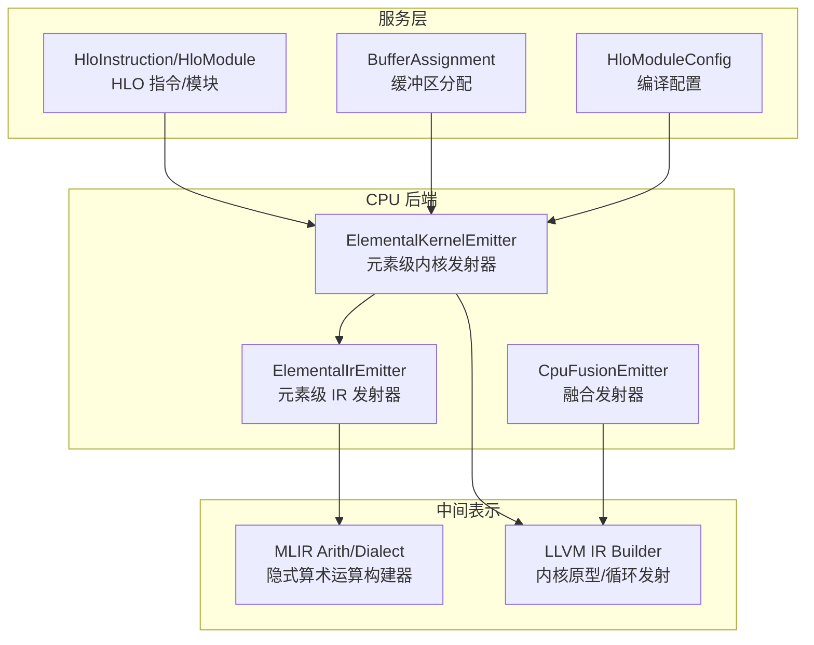
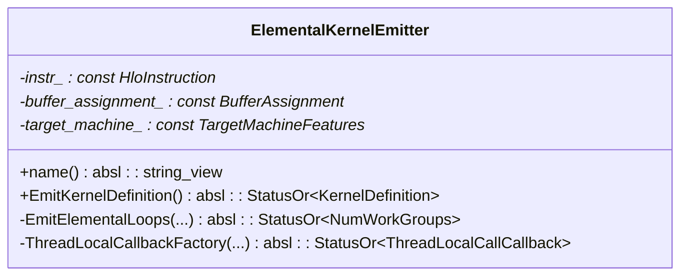
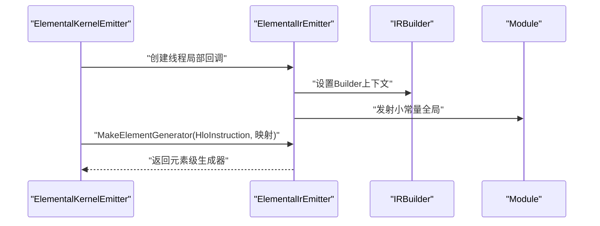
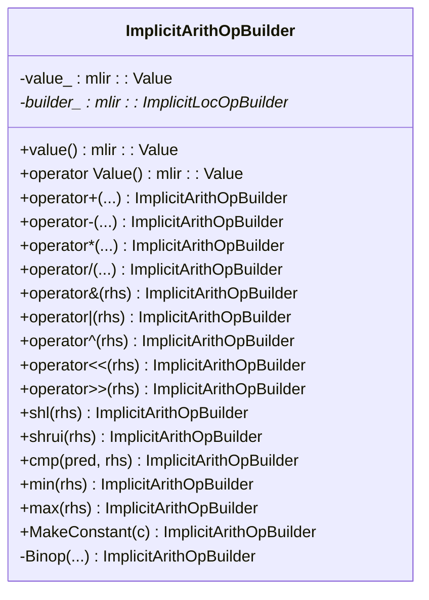
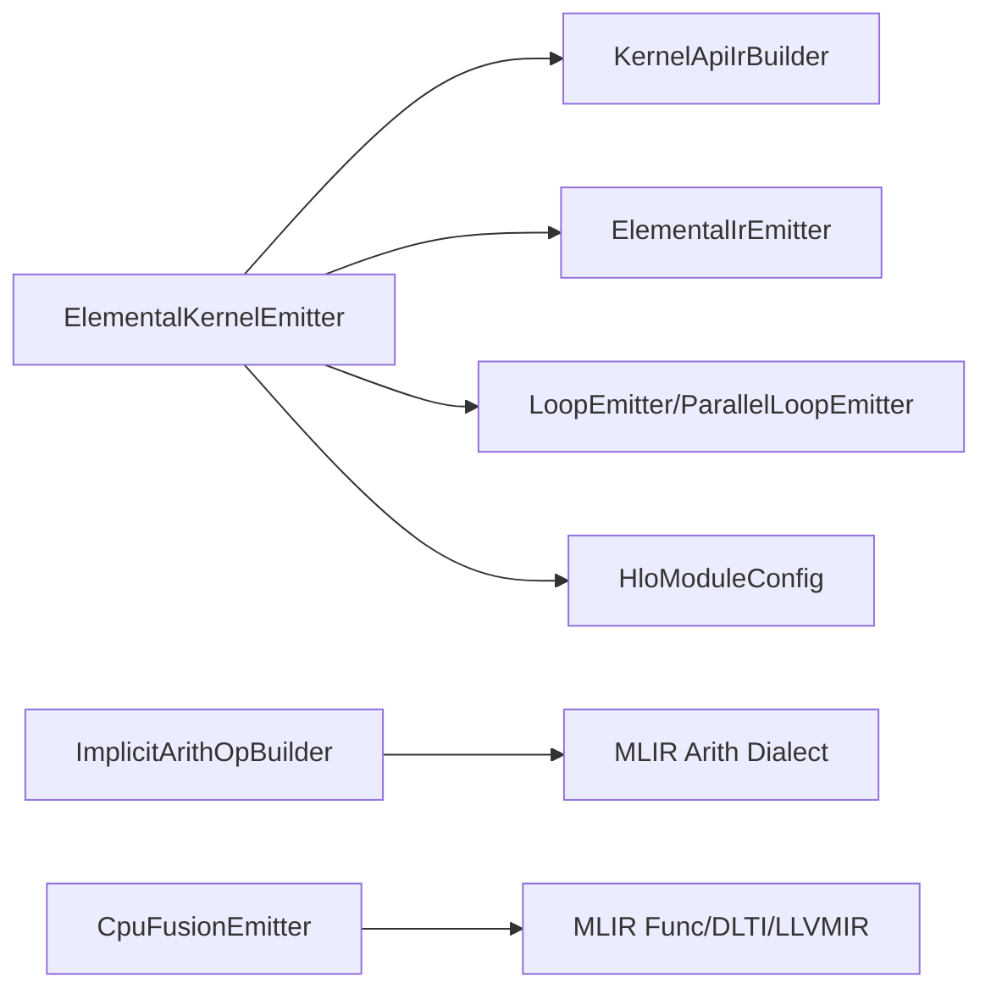

# 元素级发射器

<cite>
**本文引用的文件**
- [elemental_kernel_emitter.h](file://xla/backends/cpu/codegen/elemental/elemental_kernel_emitter.h)
- [elemental_kernel_emitter.cc](file://xla/backends/cpu/codegen/elemental/elemental_kernel_emitter.cc)
- [implicit_arith_op_builder.h](file://xla/codegen/emitters/implicit_arith_op_builder.h)
- [implicit_arith_op_builder.cc](file://xla/codegen/emitters/implicit_arith_op_builder.cc)
- [cpu_fusion_emitter.h](file://xla/backends/cpu/codegen/emitters/cpu_fusion_emitter.h)
- [cpu_fusion_emitter.cc](file://xla/backends/cpu/codegen/emitters/cpu_fusion_emitter.cc)
- [elemental_ir_emitter.h](file://xla/service/elemental_ir_emitter.h)
- [elemental_ir_emitter.cc](file://xla/service/elemental_ir_emitter.cc)
- [elemental_ir_emitter.h](file://xla/service/cpu/elemental_ir_emitter.h)
- [elemental_ir_emitter.cc](file://xla/service/cpu/elemental_ir_emitter.cc)
</cite>

## 目录
1. [简介](#简介)
2. [项目结构](#项目结构)
3. [核心组件](#核心组件)
4. [架构总览](#架构总览)
5. [详细组件分析](#详细组件分析)
6. [依赖关系分析](#依赖关系分析)
7. [性能考量](#性能考量)
8. [故障排查指南](#故障排查指南)
9. [结论](#结论)
10. [附录：常见元素级操作发射示例](#附录常见元素级操作发射示例)

## 简介
本文件系统性阐述 XLA CPU 后端中的“元素级内核发射器”，聚焦于单个数据元素的发射流程，覆盖算术运算、比较操作与位运算的生成路径；同时详解“隐式算术运算构建器”的设计与用法，包括类型推导、精度控制与溢出处理策略，并给出元素级发射器的 API 接口规范（参数传递、返回值、错误检查）以及典型场景的发射示例（标量、向量、张量元素访问）。

## 项目结构
围绕元素级发射器的相关模块主要分布在以下位置：
- 元素级内核发射器：位于后端 CPU 的 codegen/elemental 目录，负责将 HLO 指令映射为可执行的 LLVM IR 内核。
- 隐式算术运算构建器：位于 codegen/emitters 目录，提供 MLIR arith 操作的便捷封装，支持整数二元运算、比较、位运算与 min/max 等。
- 融合发射器：位于 backends/cpu/codegen/emitters，用于多指令融合场景下的入口函数与调用目标生成。
- 元素级 IR 发射器：位于 service 层，提供从 HLO 到元素级 IR 的生成器与回调机制，是元素级发射器的关键依赖。



图表来源
- [elemental_kernel_emitter.h](file://xla/backends/cpu/codegen/elemental/elemental_kernel_emitter.h#L35-L64)
- [elemental_kernel_emitter.cc](file://xla/backends/cpu/codegen/elemental/elemental_kernel_emitter.cc#L164-L245)
- [implicit_arith_op_builder.h](file://xla/codegen/emitters/implicit_arith_op_builder.h#L27-L98)
- [cpu_fusion_emitter.h](file://xla/backends/cpu/codegen/emitters/cpu_fusion_emitter.h#L47-L66)

章节来源
- [elemental_kernel_emitter.h](file://xla/backends/cpu/codegen/elemental/elemental_kernel_emitter.h#L1-L69)
- [elemental_kernel_emitter.cc](file://xla/backends/cpu/codegen/elemental/elemental_kernel_emitter.cc#L1-L339)
- [implicit_arith_op_builder.h](file://xla/codegen/emitters/implicit_arith_op_builder.h#L1-L103)
- [implicit_arith_op_builder.cc](file://xla/codegen/emitters/implicit_arith_op_builder.cc#L1-L185)
- [cpu_fusion_emitter.h](file://xla/backends/cpu/codegen/emitters/cpu_fusion_emitter.h#L1-L74)
- [cpu_fusion_emitter.cc](file://xla/backends/cpu/codegen/emitters/cpu_fusion_emitter.cc#L1-L318)

## 核心组件
- 元素级内核发射器（ElementalKernelEmitter）
  - 负责根据 HLO 指令生成 LLVM IR 内核定义，支持并行外维分区、快速数学标志设置、线程局部回调等。
  - 关键职责：构造内核原型、生成元素级生成器、发射循环、计算工作组数量。
- 元素级 IR 发射器（ElementalIrEmitter）
  - 提供从 HLO 到元素级 IR 的生成器与回调，支持嵌套计算、小常量全局、线程局部调用等。
- 隐式算术运算构建器（ImplicitArithOpBuilder）
  - 封装 MLIR arith 操作，提供整型加减乘除、位运算、比较、min/max 与移位等便捷接口，自动处理类型推导与常量构造。
- 融合发射器（CpuFusionEmitter）
  - 为融合图生成入口函数与调用目标，支持索引映射、线程瓦片与对齐约束。

章节来源
- [elemental_kernel_emitter.h](file://xla/backends/cpu/codegen/elemental/elemental_kernel_emitter.h#L35-L64)
- [elemental_kernel_emitter.cc](file://xla/backends/cpu/codegen/elemental/elemental_kernel_emitter.cc#L171-L245)
- [elemental_ir_emitter.h](file://xla/service/elemental_ir_emitter.h)
- [elemental_ir_emitter.cc](file://xla/service/elemental_ir_emitter.cc)
- [implicit_arith_op_builder.h](file://xla/codegen/emitters/implicit_arith_op_builder.h#L27-L98)
- [implicit_arith_op_builder.cc](file://xla/codegen/emitters/implicit_arith_op_builder.cc#L34-L182)
- [cpu_fusion_emitter.h](file://xla/backends/cpu/codegen/emitters/cpu_fusion_emitter.h#L47-L66)

## 架构总览
元素级发射器的整体流程如下：
- 输入：HLO 指令、缓冲区分配、目标机器特性、HLO 模块配置。
- 输出：内核定义（包含内核原型、工作分组、参数与结果缓冲区描述、LLVM 源码）。
- 关键步骤：
  - 创建 LLVM 上下文与模块，生成内核原型（含参数/结果缓冲区、工作组 ID 等）。
  - 构造元素级生成器（基于操作数到元素访问的映射）。
  - 依据是否并行化与多结果情况选择循环发射策略。
  - 可选：生成并注册线程局部回调，以支持嵌套计算与自定义调用。
  - 返回 KernelDefinition 与 LlvmKernelSource。

```mermaid
sequenceDiagram
participant HLO as "HloInstruction"
participant Emitter as "ElementalKernelEmitter"
participant KAPI as "KernelApiIrBuilder"
participant EIE as "ElementalIrEmitter"
participant Loop as "LoopEmitter/ParallelLoopEmitter"
participant IRB as "IRBuilder(LLVM)"
participant Mod as "LLVM Module"
HLO->>Emitter : "构造实例"
Emitter->>KAPI : "生成内核原型"
KAPI-->>Emitter : "KernelPrototype"
Emitter->>IRB : "设置fast-math标志"
Emitter->>EIE : "创建线程局部回调"
EIE-->>Emitter : "ThreadLocalCallCallback"
Emitter->>Emitter : "构建元素级生成器"
Emitter->>Loop : "发射循环(单/并行/多结果)"
Loop-->>Emitter : "返回工作分组数"
Emitter->>Mod : "封装为LlvmKernelSource"
Emitter-->>HLO : "返回KernelDefinition"
```

图表来源
- [elemental_kernel_emitter.cc](file://xla/backends/cpu/codegen/elemental/elemental_kernel_emitter.cc#L171-L245)
- [elemental_kernel_emitter.cc](file://xla/backends/cpu/codegen/elemental/elemental_kernel_emitter.cc#L247-L294)
- [elemental_kernel_emitter.cc](file://xla/backends/cpu/codegen/elemental/elemental_kernel_emitter.cc#L296-L336)

章节来源
- [elemental_kernel_emitter.cc](file://xla/backends/cpu/codegen/elemental/elemental_kernel_emitter.cc#L171-L245)
- [elemental_kernel_emitter.cc](file://xla/backends/cpu/codegen/elemental/elemental_kernel_emitter.cc#L247-L294)
- [elemental_kernel_emitter.cc](file://xla/backends/cpu/codegen/elemental/elemental_kernel_emitter.cc#L296-L336)

## 详细组件分析

### 组件一：元素级内核发射器（ElementalKernelEmitter）
- 角色定位
  - 作为 KernelEmitter 的具体实现，面向 CPU 后端，将单个 HLO 指令映射为 LLVM IR 内核。
- 关键方法
  - EmitKernelDefinition：主发射入口，负责内核原型生成、元素级生成器构建、循环发射与工作分组统计。
  - EmitElementalLoops：根据指令类型与并行配置选择循环策略（单分区、并行分区、多结果融合）。
  - ThreadLocalCallbackFactory：创建线程局部回调，用于嵌套计算与小常量全局的发射。
- 并行与分区
  - 支持通过 BackendConfig 的 outer_dimension_partitions 进行外维并行分区，动态计算每个工作组的下界/上界。
- 多结果限制
  - 多结果仅在 Fusion/Reduce/ReduceWindow 中受支持；其他类型指令若存在多个结果将触发错误。



图表来源
- [elemental_kernel_emitter.h](file://xla/backends/cpu/codegen/elemental/elemental_kernel_emitter.h#L35-L64)

章节来源
- [elemental_kernel_emitter.h](file://xla/backends/cpu/codegen/elemental/elemental_kernel_emitter.h#L35-L64)
- [elemental_kernel_emitter.cc](file://xla/backends/cpu/codegen/elemental/elemental_kernel_emitter.cc#L171-L245)
- [elemental_kernel_emitter.cc](file://xla/backends/cpu/codegen/elemental/elemental_kernel_emitter.cc#L247-L294)
- [elemental_kernel_emitter.cc](file://xla/backends/cpu/codegen/elemental/elemental_kernel_emitter.cc#L296-L336)

### 组件二：元素级 IR 发射器（ElementalIrEmitter）
- 角色定位
  - 提供 MakeElementGenerator，将 HLO 指令映射为元素级生成器；支持线程局部回调、嵌套计算发射与小常量全局。
- 与元素级发射器的关系
  - ElementalKernelEmitter 在 EmitKernelDefinition 中创建 CpuElementalIrEmitter，并将其作为 ThreadLocalCallCallback 的持有者，确保在内核中可调用嵌套计算或自定义逻辑。



图表来源
- [elemental_kernel_emitter.cc](file://xla/backends/cpu/codegen/elemental/elemental_kernel_emitter.cc#L206-L224)
- [elemental_kernel_emitter.cc](file://xla/backends/cpu/codegen/elemental/elemental_kernel_emitter.cc#L296-L336)
- [elemental_ir_emitter.cc](file://xla/service/elemental_ir_emitter.cc)

章节来源
- [elemental_kernel_emitter.cc](file://xla/backends/cpu/codegen/elemental/elemental_kernel_emitter.cc#L206-L224)
- [elemental_kernel_emitter.cc](file://xla/backends/cpu/codegen/elemental/elemental_kernel_emitter.cc#L296-L336)
- [elemental_ir_emitter.h](file://xla/service/elemental_ir_emitter.h)
- [elemental_ir_emitter.cc](file://xla/service/elemental_ir_emitter.cc)

### 组件三：隐式算术运算构建器（ImplicitArithOpBuilder）
- 设计目标
  - 以 Value 包装提供整型运算的运算符重载，使 MLIR arith 操作更易读且类型安全。
- 支持能力
  - 整型二元运算：加(+)、减(-)、乘(*)、除(/)（有符号整数除法）。
  - 位运算：与(&)、或(|)、异或(^)、左移(<<)、右移(>>)（逻辑右移）。
  - 比较：cmp(pred, rhs)、==、!= 等。
  - 最值：min、max。
  - 常量：MakeConstant，自动根据当前 Value 类型选择 index 或 int 常量。
- 类型推导与精度控制
  - 通过模板与 create<Op> 实现类型推导；当输入为 index 类型时，优先使用 index 常量构造，保证与当前表达式的类型一致。
- 溢出处理
  - arith 操作默认采用二进制补码算术，不进行显式溢出检测；如需溢出语义，应在上层逻辑中插入饱和或检查操作。



图表来源
- [implicit_arith_op_builder.h](file://xla/codegen/emitters/implicit_arith_op_builder.h#L27-L98)
- [implicit_arith_op_builder.cc](file://xla/codegen/emitters/implicit_arith_op_builder.cc#L34-L182)

章节来源
- [implicit_arith_op_builder.h](file://xla/codegen/emitters/implicit_arith_op_builder.h#L27-L98)
- [implicit_arith_op_builder.cc](file://xla/codegen/emitters/implicit_arith_op_builder.cc#L34-L182)

### 组件四：融合发射器（CpuFusionEmitter）
- 角色定位
  - 面向融合图（Fusion/Reduce/ReduceWindow 等），生成入口函数与调用目标，支持线程瓦片、索引映射与对齐约束。
- 与元素级发射器的关系
  - 融合发射器负责更高层的图级组织与调用关系，元素级发射器则专注于单指令的内核生成。

章节来源
- [cpu_fusion_emitter.h](file://xla/backends/cpu/codegen/emitters/cpu_fusion_emitter.h#L47-L66)
- [cpu_fusion_emitter.cc](file://xla/backends/cpu/codegen/emitters/cpu_fusion_emitter.cc#L173-L241)
- [cpu_fusion_emitter.cc](file://xla/backends/cpu/codegen/emitters/cpu_fusion_emitter.cc#L243-L291)

## 依赖关系分析
- 元素级内核发射器依赖
  - KernelApiIrBuilder：生成内核原型（参数/结果缓冲区、工作组 ID 等）。
  - ElementalIrEmitter：生成元素级生成器与线程局部回调。
  - LoopEmitter/ParallelLoopEmitter：根据是否并行与多结果选择循环发射策略。
  - HloModuleConfig：获取 fast-math 标志与调试选项。
- 隐式算术运算构建器依赖
  - MLIR Arith Dialect：提供 AddIOp/SubIOp/MulIOp/DivSIOp/AndIOp/OrIOp/XOrIOp/ShLIOp/ShRUIOp/CmpIOp/MinSIOp/MaxSIOp 等。
- 融合发射器依赖
  - MLIR Func/DLTI/LLVMIR 等方言与转换管线，负责从融合子图到 MLIR 的映射与导出。



图表来源
- [elemental_kernel_emitter.cc](file://xla/backends/cpu/codegen/elemental/elemental_kernel_emitter.cc#L182-L200)
- [implicit_arith_op_builder.cc](file://xla/codegen/emitters/implicit_arith_op_builder.cc#L20-L23)
- [cpu_fusion_emitter.cc](file://xla/backends/cpu/codegen/emitters/cpu_fusion_emitter.cc#L36-L58)

章节来源
- [elemental_kernel_emitter.cc](file://xla/backends/cpu/codegen/elemental/elemental_kernel_emitter.cc#L182-L200)
- [implicit_arith_op_builder.cc](file://xla/codegen/emitters/implicit_arith_op_builder.cc#L20-L23)
- [cpu_fusion_emitter.cc](file://xla/backends/cpu/codegen/emitters/cpu_fusion_emitter.cc#L36-L58)

## 性能考量
- 快速数学标志
  - 在内核入口处设置 fast-math 标志，有助于提升浮点运算性能，但可能影响数值稳定性与精度。
- 并行外维分区
  - 通过 outer_dimension_partitions 将外维划分为多个分区，结合工作组 ID 动态加载分区边界，提高并行度与负载均衡。
- 循环发射策略
  - 单结果指令优先使用高效循环；多结果仅在 Fusion/Reduce/ReduceWindow 中启用，避免复杂度与开销。
- 线程局部回调
  - 将嵌套计算与小常量全局一次性发射，减少重复开销，提升内核整体吞吐。

章节来源
- [elemental_kernel_emitter.cc](file://xla/backends/cpu/codegen/elemental/elemental_kernel_emitter.cc#L198-L200)
- [elemental_kernel_emitter.cc](file://xla/backends/cpu/codegen/elemental/elemental_kernel_emitter.cc#L277-L293)
- [elemental_kernel_emitter.cc](file://xla/backends/cpu/codegen/elemental/elemental_kernel_emitter.cc#L314-L326)

## 故障排查指南
- 多结果不支持
  - 当指令具有多个结果且非 Fusion/Reduce/ReduceWindow 时，会返回内部错误。请确认指令类型或拆分融合。
- HloModule 为空
  - EmitKernelDefinition 中若 HloModule 为空，将返回内部错误。请检查 HLO 图构建与模块配置。
- 并行配置无效
  - outer_dimension_partitions 为空或非法时，不会启用并行分区。请检查 BackendConfig 设置。
- fast-min-max 开关
  - 若开启 xla_cpu_enable_fast_min_max，可能影响最小/最大运算的语义。请按需调整调试选项。

章节来源
- [elemental_kernel_emitter.cc](file://xla/backends/cpu/codegen/elemental/elemental_kernel_emitter.cc#L177-L180)
- [elemental_kernel_emitter.cc](file://xla/backends/cpu/codegen/elemental/elemental_kernel_emitter.cc#L261-L265)
- [elemental_kernel_emitter.cc](file://xla/backends/cpu/codegen/elemental/elemental_kernel_emitter.cc#L215-L218)

## 结论
元素级内核发射器通过 KernelApiIrBuilder 生成内核原型，借助 ElementalIrEmitter 构建元素级生成器与线程局部回调，结合 LoopEmitter/ParallelLoopEmitter 完成循环发射与并行分区，最终输出可执行的 LLVM IR 内核。隐式算术运算构建器为 MLIR arith 操作提供了简洁、类型安全的封装，便于在元素级发射过程中表达复杂的整型运算与比较逻辑。融合发射器则负责更高层的图级组织与调用关系。整体设计在保证灵活性的同时兼顾性能与可维护性。

## 附录：常见元素级操作发射示例
以下示例以“路径引用”形式给出，便于在源码中定位具体实现与调用点：

- 标量运算（加法）
  - 元素级生成器构建：参考 [elemental_kernel_emitter.cc](file://xla/backends/cpu/codegen/elemental/elemental_kernel_emitter.cc#L206-L213)
  - 线程局部回调注册：参考 [elemental_kernel_emitter.cc](file://xla/backends/cpu/codegen/elemental/elemental_kernel_emitter.cc#L328-L335)
  - 隐式算术运算使用：参考 [implicit_arith_op_builder.cc](file://xla/codegen/emitters/implicit_arith_op_builder.cc#L34-L41)

- 向量运算（逐元素乘法）
  - 元素级生成器映射操作数到元素访问：参考 [elemental_kernel_emitter.cc](file://xla/backends/cpu/codegen/elemental/elemental_kernel_emitter.cc#L206-L213)
  - 隐式算术运算乘法：参考 [implicit_arith_op_builder.cc](file://xla/codegen/emitters/implicit_arith_op_builder.cc#L52-L59)

- 张量元素访问（索引与比较）
  - 索引访问由 KernelApiIrBuilder 的参数 EmitReadArrayElement 提供：参考 [elemental_kernel_emitter.cc](file://xla/backends/cpu/codegen/elemental/elemental_kernel_emitter.cc#L210-L211)
  - 比较操作封装：参考 [implicit_arith_op_builder.cc](file://xla/codegen/emitters/implicit_arith_op_builder.cc#L127-L135)

- 并行外维分区（多工作组）
  - 分区配置解析：参考 [elemental_kernel_emitter.cc](file://xla/backends/cpu/codegen/elemental/elemental_kernel_emitter.cc#L77-L91)
  - 分区边界生成与加载：参考 [elemental_kernel_emitter.cc](file://xla/backends/cpu/codegen/elemental/elemental_kernel_emitter.cc#L93-L160)
  - 并行循环发射：参考 [elemental_kernel_emitter.cc](file://xla/backends/cpu/codegen/elemental/elemental_kernel_emitter.cc#L279-L288)

- 多结果融合（Fusion/Reduce/ReduceWindow）
  - 多结果支持条件：参考 [elemental_kernel_emitter.cc](file://xla/backends/cpu/codegen/elemental/elemental_kernel_emitter.cc#L254-L256)
  - 单结果循环发射：参考 [elemental_kernel_emitter.cc](file://xla/backends/cpu/codegen/elemental/elemental_kernel_emitter.cc#L291-L292)

- API 接口规范（参数/返回/错误）
  - EmitKernelDefinition 返回 KernelDefinition（包含内核名称、工作分组、参数/结果缓冲区描述与不变参数）：参考 [elemental_kernel_emitter.cc](file://xla/backends/cpu/codegen/elemental/elemental_kernel_emitter.cc#L240-L244)
  - 错误检查：内部错误返回与状态传播：参考 [elemental_kernel_emitter.cc](file://xla/backends/cpu/codegen/elemental/elemental_kernel_emitter.cc#L179-L180)、[elemental_kernel_emitter.cc](file://xla/backends/cpu/codegen/elemental/elemental_kernel_emitter.cc#L262-L265)