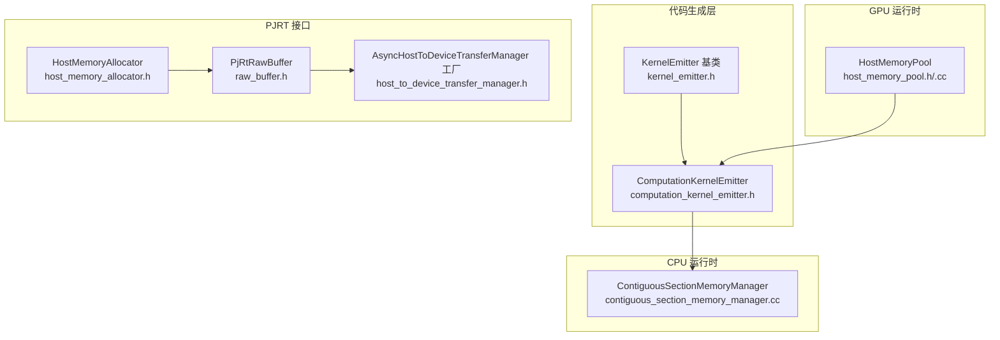
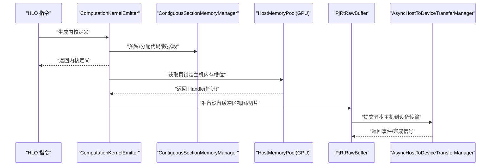
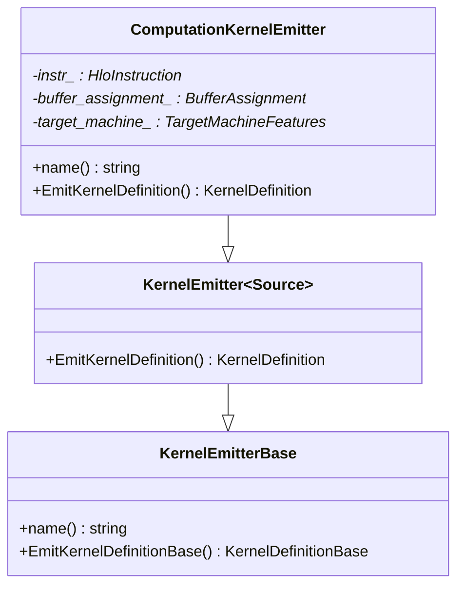
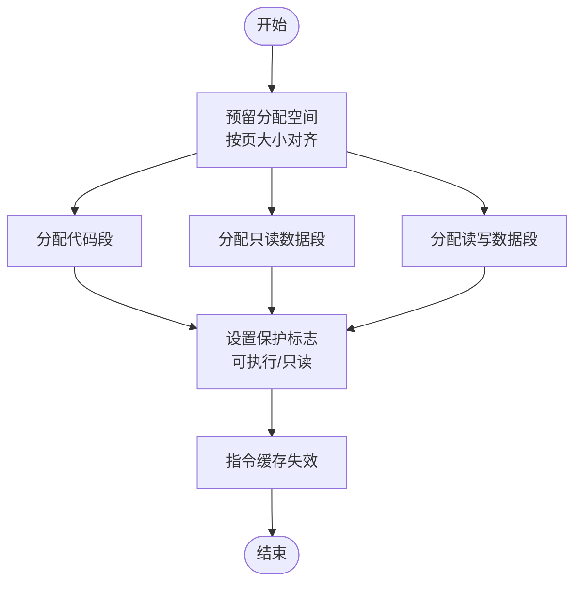
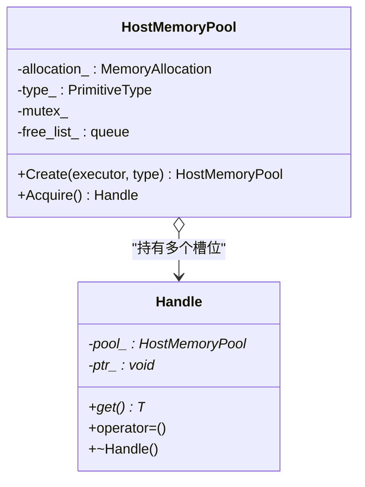
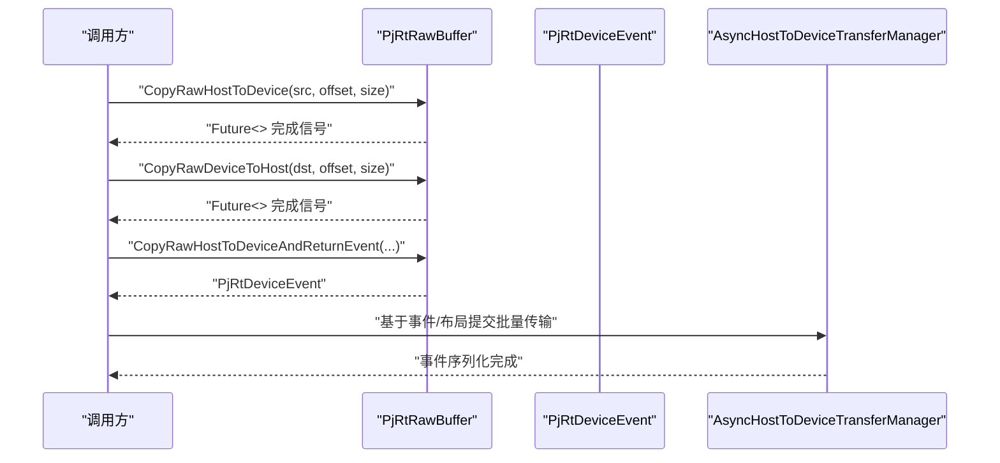
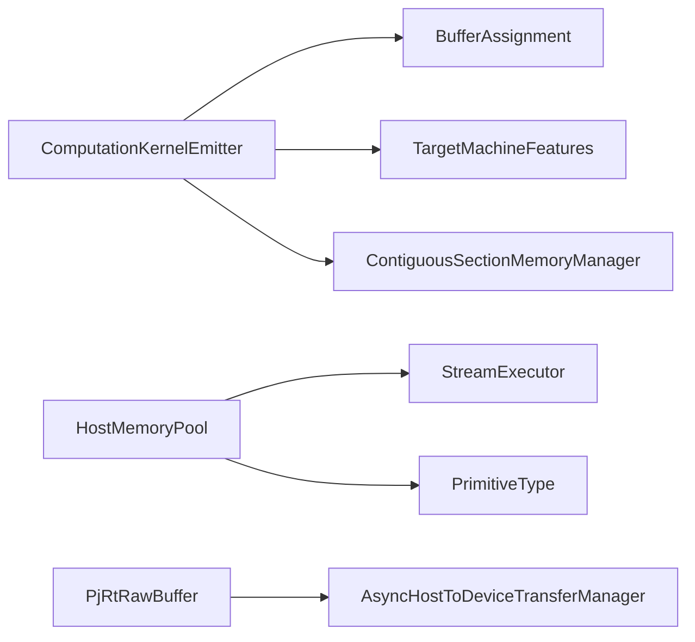

# 内存发射器

<cite>
**本文引用的文件**
- [kernel_emitter.h](file://xla/codegen/kernel_emitter.h)
- [computation_kernel_emitter.h](file://xla/backends/cpu/codegen/computation_kernel_emitter.h)
- [contiguous_section_memory_manager.cc](file://xla/backends/cpu/codegen/contiguous_section_memory_manager.cc)
- [host_memory_pool.h](file://xla/backends/gpu/runtime/host_memory_pool.h)
- [host_memory_pool.cc](file://xla/backends/gpu/runtime/host_memory_pool.cc)
- [host_memory_allocator.h](file://xla/pjrt/host_memory_allocator.h)
- [raw_buffer.h](file://xla/pjrt/raw_buffer.h)
- [host_to_device_transfer_manager.h](file://xla/pjrt/host_to_device_transfer_manager.h)
</cite>

## 目录
1. [简介](#简介)
2. [项目结构](#项目结构)
3. [核心组件](#核心组件)
4. [架构总览](#架构总览)
5. [组件详细分析](#组件详细分析)
6. [依赖关系分析](#依赖关系分析)
7. [性能考量](#性能考量)
8. [故障排查指南](#故障排查指南)
9. [结论](#结论)

## 简介
本文件围绕 XLA 的“内存内核发射器”主题，系统化梳理与内存相关的发射流程：从数据传输（主机到设备、设备到设备）、内存分配与缓冲区管理，到内核参数绑定（打包、对齐、字节序），再到类型系统（数据类型映射、尺寸计算、布局转换）。同时给出内存优化策略（内存池、预取、零拷贝）与调试技巧（泄漏检测、访问冲突诊断、性能瓶颈定位），帮助读者在理解整体架构的同时，掌握可操作的工程实践。

## 项目结构
与内存发射器直接相关的关键模块分布如下：
- 代码生成与内核发射基类：位于 xla/codegen/kernel_emitter.h，定义了统一的 KernelEmitter 接口与基类。
- CPU 后端的计算内核发射器：位于 xla/backends/cpu/codegen/computation_kernel_emitter.h，负责将嵌套计算与调用指令发射为内核定义。
- CPU 后端的连续段内存管理器：位于 xla/backends/cpu/codegen/contiguous_section_memory_manager.cc，用于在一块连续内存中划分代码段、只读数据段与读写数据段，并进行最终保护与缓存失效。
- GPU 后端的主机内存池：位于 xla/backends/gpu/runtime/host_memory_pool.h 和 .cc，提供固定大小的页锁定主机内存块池，减少频繁分配/释放带来的开销。
- 主机内存分配器接口：位于 xla/pjrt/host_memory_allocator.h，抽象出主机侧内存分配、映射/取消映射回调与对齐要求。
- 原始缓冲区接口：位于 xla/pjrt/raw_buffer.h，提供不安全但高效的主机/设备间直接传输与切片能力，以及事件驱动的异步语义。
- 异步主机到设备传输管理器工厂：位于 xla/pjrt/host_to_device_transfer_manager.h，用于创建异步传输管理器以协调多输入布局与内存空间。

**图示来源**
- [kernel_emitter.h](file://xla/codegen/kernel_emitter.h#L34-L70)
- [computation_kernel_emitter.h](file://xla/backends/cpu/codegen/computation_kernel_emitter.h#L47-L68)
- [contiguous_section_memory_manager.cc](file://xla/backends/cpu/codegen/contiguous_section_memory_manager.cc#L57-L173)
- [host_memory_pool.h](file://xla/backends/gpu/runtime/host_memory_pool.h#L43-L100)
- [host_memory_allocator.h](file://xla/pjrt/host_memory_allocator.h#L32-L83)
- [raw_buffer.h](file://xla/pjrt/raw_buffer.h#L40-L182)
- [host_to_device_transfer_manager.h](file://xla/pjrt/host_to_device_transfer_manager.h#L25-L29)

**章节来源**
- [kernel_emitter.h](file://xla/codegen/kernel_emitter.h#L34-L70)
- [computation_kernel_emitter.h](file://xla/backends/cpu/codegen/computation_kernel_emitter.h#L47-L68)
- [contiguous_section_memory_manager.cc](file://xla/backends/cpu/codegen/contiguous_section_memory_manager.cc#L57-L173)
- [host_memory_pool.h](file://xla/backends/gpu/runtime/host_memory_pool.h#L43-L100)
- [host_memory_allocator.h](file://xla/pjrt/host_memory_allocator.h#L32-L83)
- [raw_buffer.h](file://xla/pjrt/raw_buffer.h#L40-L182)
- [host_to_device_transfer_manager.h](file://xla/pjrt/host_to_device_transfer_manager.h#L25-L29)

## 核心组件
- KernelEmitter 基类与模板特化：统一的内核发射接口，派生类负责从 HLO 融合等输入生成具体内核定义。
- ComputationKernelEmitter：面向调用指令与嵌套计算的内核发射器，使用 LLVM 源码作为后端，生成包含参数表的合成缓冲区布局。
- ContiguousSectionMemoryManager：在单块连续内存中划分代码/只读/读写段，支持对齐、保护与缓存失效，确保 JIT 生成代码可执行且一致。
- HostMemoryPool：GPU 后端的主机内存池，按 PrimitiveType 切分固定数量的页锁定标量槽位，降低并发执行时的分配/释放成本。
- HostMemoryAllocator：抽象主机内存分配器，支持对齐、NUMA 提示、映射/取消映射回调。
- PjRtRawBuffer：原始缓冲区接口，提供主机/设备直接传输、切片、动态形状读取、事件驱动的异步复制与调度。
- AsyncHostToDeviceTransferManager 工厂：根据形状规格与设备布局创建异步传输管理器，协调多输入的布局与内存空间。

**章节来源**
- [kernel_emitter.h](file://xla/codegen/kernel_emitter.h#L34-L70)
- [computation_kernel_emitter.h](file://xla/backends/cpu/codegen/computation_kernel_emitter.h#L47-L68)
- [contiguous_section_memory_manager.cc](file://xla/backends/cpu/codegen/contiguous_section_memory_manager.cc#L57-L173)
- [host_memory_pool.h](file://xla/backends/gpu/runtime/host_memory_pool.h#L43-L100)
- [host_memory_allocator.h](file://xla/pjrt/host_memory_allocator.h#L32-L83)
- [raw_buffer.h](file://xla/pjrt/raw_buffer.h#L40-L182)
- [host_to_device_transfer_manager.h](file://xla/pjrt/host_to_device_transfer_manager.h#L25-L29)

## 架构总览
下图展示从 HLO 到内核发射、内存分配与传输的整体路径，以及与 PJRT 原始缓冲区的交互。

**图示来源**
- [computation_kernel_emitter.h](file://xla/backends/cpu/codegen/computation_kernel_emitter.h#L47-L68)
- [contiguous_section_memory_manager.cc](file://xla/backends/cpu/codegen/contiguous_section_memory_manager.cc#L78-L173)
- [host_memory_pool.h](file://xla/backends/gpu/runtime/host_memory_pool.h#L43-L100)
- [raw_buffer.h](file://xla/pjrt/raw_buffer.h#L81-L182)
- [host_to_device_transfer_manager.h](file://xla/pjrt/host_to_device_transfer_manager.h#L25-L29)

## 组件详细分析

### 内核发射器基类与计算内核发射器
- KernelEmitterBase/KernelEmitter：定义统一发射接口，派生类通过 EmitKernelDefinition 产出 KernelDefinition；模板参数 Source 决定源码类型（如 LLVM/MLIR）。
- ComputationKernelEmitter：针对调用指令与嵌套计算，借助旧版 IR 发射器生成内核定义，构建包含参数与中间结果的合成缓冲区表，未来可能改为栈分配小缓冲区。

**图示来源**
- [kernel_emitter.h](file://xla/codegen/kernel_emitter.h#L34-L70)
- [computation_kernel_emitter.h](file://xla/backends/cpu/codegen/computation_kernel_emitter.h#L47-L68)

**章节来源**
- [kernel_emitter.h](file://xla/codegen/kernel_emitter.h#L34-L70)
- [computation_kernel_emitter.h](file://xla/backends/cpu/codegen/computation_kernel_emitter.h#L47-L68)

### 连续段内存管理器（CPU）
- 功能要点：在单块连续内存中划分代码段、只读数据段、读写数据段；按页大小与对齐要求进行对齐填充；最终设置代码段可执行、只读段只读，并进行指令缓存失效。
- 关键流程：预留空间 -> 分配各段 -> 最终保护与缓存失效。

**图示来源**
- [contiguous_section_memory_manager.cc](file://xla/backends/cpu/codegen/contiguous_section_memory_manager.cc#L78-L173)

**章节来源**
- [contiguous_section_memory_manager.cc](file://xla/backends/cpu/codegen/contiguous_section_memory_manager.cc#L57-L173)

### GPU 主机内存池
- 设计目标：为需要在执行期间使用的主机侧标量值提供页锁定内存池，避免每次执行都进行昂贵的分配/释放。
- 使用方式：Create 创建池（指定 PrimitiveType），Acquire 获取一个 Handle（内部持有一个指针），Handle 析构时自动归还；若并发超过池容量会报资源耗尽错误。

**图示来源**
- [host_memory_pool.h](file://xla/backends/gpu/runtime/host_memory_pool.h#L43-L100)
- [host_memory_pool.cc](file://xla/backends/gpu/runtime/host_memory_pool.cc#L35-L85)

**章节来源**
- [host_memory_pool.h](file://xla/backends/gpu/runtime/host_memory_pool.h#L43-L100)
- [host_memory_pool.cc](file://xla/backends/gpu/runtime/host_memory_pool.cc#L35-L85)

### 主机内存分配器接口
- 抽象：HostMemoryAllocator 定义了最小对齐、映射/取消映射回调、NUMA 节点提示等选项；BasicHostMemoryAllocator 基于 tsl::Allocator 实现。
- 用途：为需要与设备侧共享或桥接的主机内存提供统一分配入口，便于与驱动/运行时集成。

**章节来源**
- [host_memory_allocator.h](file://xla/pjrt/host_memory_allocator.h#L32-L83)

### 原始缓冲区与传输管理
- PjRtRawBuffer：提供不安全但高效的主机/设备直接传输、切片、动态形状读取、事件驱动的异步复制与调度；支持返回设备事件以便串行化依赖。
- 异步传输管理器工厂：根据形状规格与设备布局创建异步传输管理器，协调多输入的布局与内存空间。

**图示来源**
- [raw_buffer.h](file://xla/pjrt/raw_buffer.h#L81-L182)
- [host_to_device_transfer_manager.h](file://xla/pjrt/host_to_device_transfer_manager.h#L25-L29)

**章节来源**
- [raw_buffer.h](file://xla/pjrt/raw_buffer.h#L40-L182)
- [host_to_device_transfer_manager.h](file://xla/pjrt/host_to_device_transfer_manager.h#L25-L29)

## 依赖关系分析
- ComputationKernelEmitter 依赖 BufferAssignment 与 TargetMachineFeatures，用于生成内核定义与目标特性适配。
- ContiguousSectionMemoryManager 依赖 LLVM 的 SectionMemoryManager 与系统内存接口，负责连续内存的划分与保护。
- HostMemoryPool 依赖 StreamExecutor 的主机内存分配能力与 PrimitiveType 的字宽计算。
- PjRtRawBuffer 与 AsyncHostToDeviceTransferManager 协同，形成事件驱动的异步传输链路。

**图示来源**
- [computation_kernel_emitter.h](file://xla/backends/cpu/codegen/computation_kernel_emitter.h#L47-L68)
- [contiguous_section_memory_manager.cc](file://xla/backends/cpu/codegen/contiguous_section_memory_manager.cc#L57-L173)
- [host_memory_pool.h](file://xla/backends/gpu/runtime/host_memory_pool.h#L43-L100)
- [raw_buffer.h](file://xla/pjrt/raw_buffer.h#L81-L182)
- [host_to_device_transfer_manager.h](file://xla/pjrt/host_to_device_transfer_manager.h#L25-L29)

**章节来源**
- [computation_kernel_emitter.h](file://xla/backends/cpu/codegen/computation_kernel_emitter.h#L47-L68)
- [contiguous_section_memory_manager.cc](file://xla/backends/cpu/codegen/contiguous_section_memory_manager.cc#L57-L173)
- [host_memory_pool.h](file://xla/backends/gpu/runtime/host_memory_pool.h#L43-L100)
- [raw_buffer.h](file://xla/pjrt/raw_buffer.h#L81-L182)
- [host_to_device_transfer_manager.h](file://xla/pjrt/host_to_device_transfer_manager.h#L25-L29)

## 性能考量
- 内存池管理
  - GPU 主机内存池：通过固定数量的页锁定槽位复用，显著降低频繁分配/释放的开销；注意并发度阈值，避免超出池容量导致资源耗尽。
  - 连续段内存管理：在单块连续内存中分配多段，减少碎片与跨段跳转，提升缓存局部性。
- 预取技术
  - 在发射内核前，尽可能提前触发异步主机到设备传输，利用事件驱动的流水线，减少等待时间。
  - 对于多输入，使用 AsyncHostToDeviceTransferManager 批量提交，减少同步次数。
- 零拷贝传输
  - 若底层驱动支持，尽量使用注册/映射的内存区域，避免额外的拷贝步骤；HostMemoryAllocator 支持映射/取消映射回调，便于与零拷贝路径对接。
- 参数绑定与对齐
  - 依据目标平台的对齐要求进行参数打包与缓冲区对齐，避免越界与性能回退。
  - 字节序由底层驱动与数据类型映射保证一致性，无需手动处理。

[本节为通用性能建议，不直接分析具体文件]

## 故障排查指南
- 内存泄漏检测
  - HostMemoryPool 的 Handle 析构会自动归还槽位，若出现“所有元素均被占用”的错误，检查是否正确释放 Handle 或增加池容量。
  - PjRtRawBuffer 的生命周期管理依赖引用计数，确保在复制/切片后及时释放不再使用的句柄。
- 访问冲突诊断
  - 使用 PjRtRawBuffer 返回的设备事件进行串行化，避免同一缓冲区在不同阶段并发读写。
  - 对于动态形状，先通过 RemoveDynamicShapeMetadataIfPresent 清理元信息，再进行线性化读取。
- 性能瓶颈分析
  - 关注连续段内存管理器的最终保护与缓存失效步骤，确保代码段可执行、只读段只读，避免运行时权限变更带来的开销。
  - 检查异步传输链路中的事件依赖是否过长，必要时拆分批次或调整布局以减少阻塞。

**章节来源**
- [host_memory_pool.cc](file://xla/backends/gpu/runtime/host_memory_pool.cc#L43-L85)
- [raw_buffer.h](file://xla/pjrt/raw_buffer.h#L121-L182)
- [contiguous_section_memory_manager.cc](file://xla/backends/cpu/codegen/contiguous_section_memory_manager.cc#L148-L171)

## 结论
XLA 的内存内核发射器通过“发射器基类 + 平台特定实现 + 内存管理器 + 原始缓冲区接口”的组合，实现了从 HLO 到可执行内核的高效映射，并在内存分配、传输与同步方面提供了灵活而强大的工具集。结合内存池、预取与事件驱动的异步传输，可在复杂工作负载下获得稳定且高性能的执行表现。实际工程中应重点关注参数对齐、事件串行化与动态形状处理，以获得最佳的可靠性与性能。