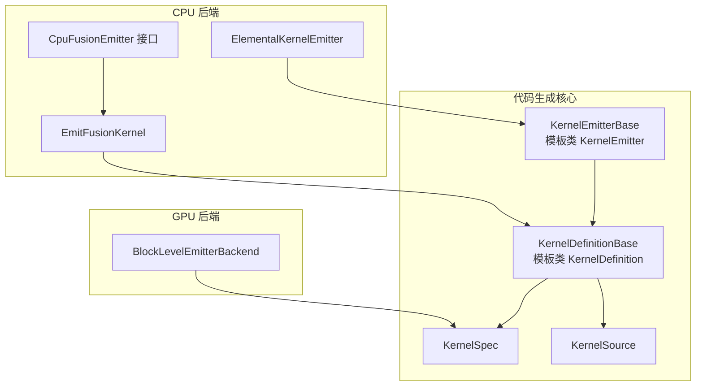
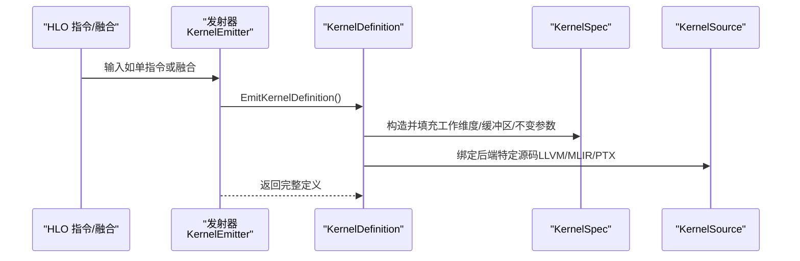
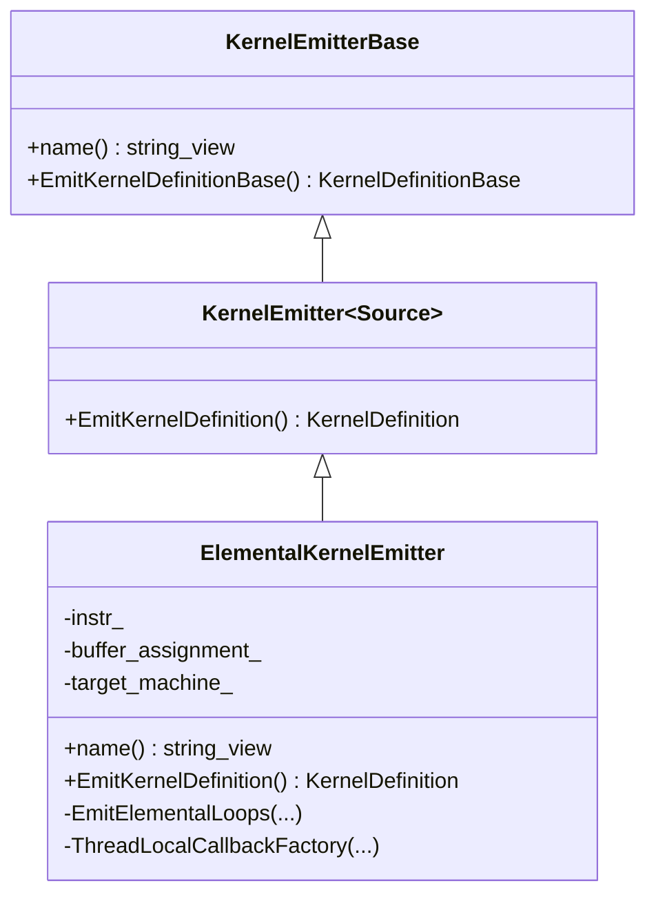
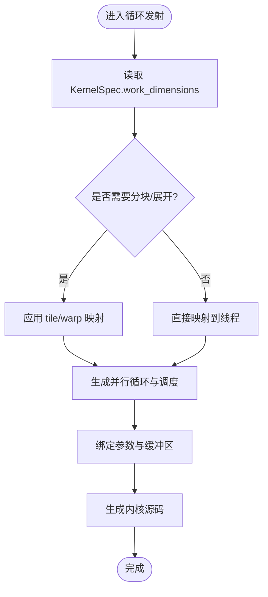
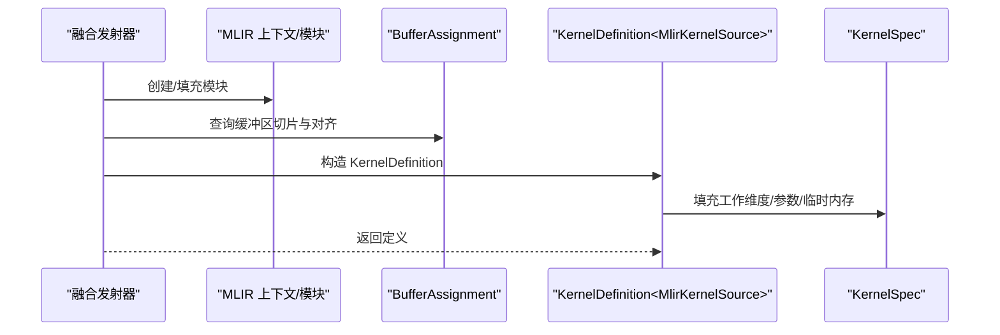
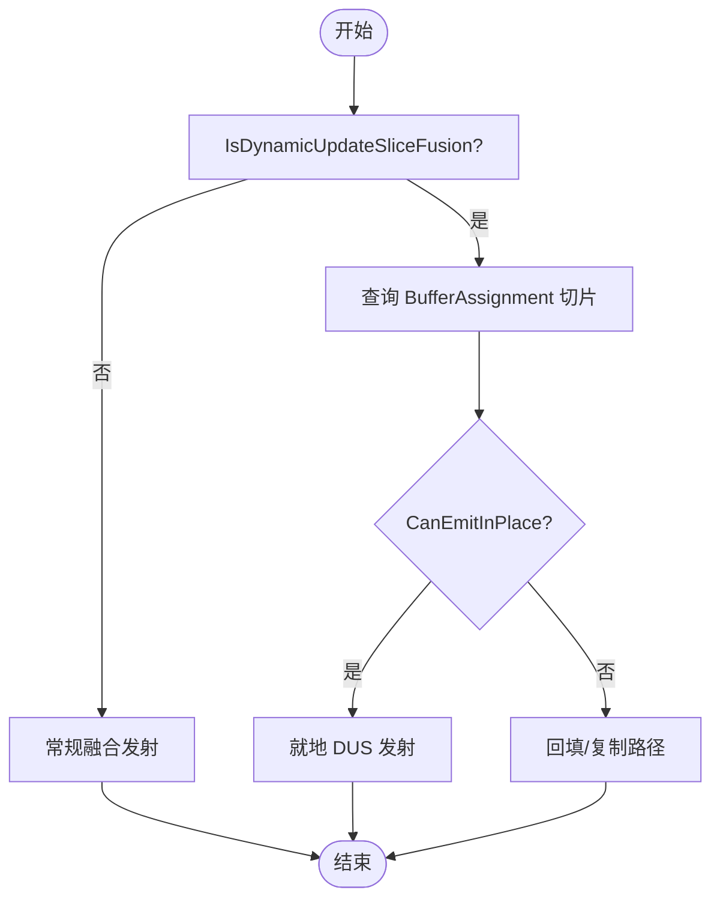
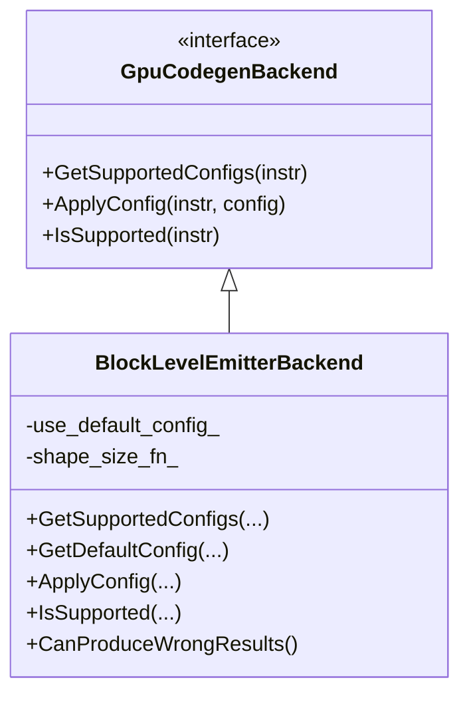
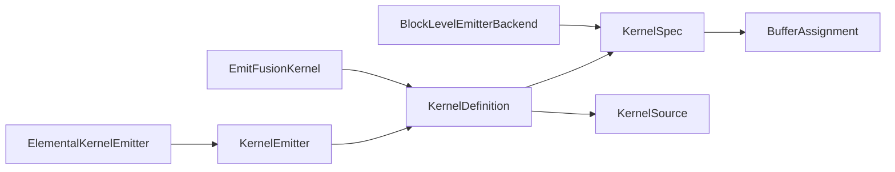

# 内核发射器

<cite>
**本文引用的文件**
- [kernel_emitter.h](file://xla/codegen/kernel_emitter.h)
- [kernel_definition.h](file://xla/codegen/kernel_definition.h)
- [kernel_source.h](file://xla/codegen/kernel_source.h)
- [kernel_spec.h](file://xla/codegen/kernel_spec.h)
- [ir_emission_utils.h](file://xla/codegen/ir_emission_utils.h)
- [elemental_kernel_emitter.h](file://xla/backends/cpu/codegen/elemental/elemental_kernel_emitter.h)
- [fusion_emitter.h](file://xla/backends/cpu/codegen/fusion_emitter.h)
- [cpu_fusion_emitter.h](file://xla/backends/cpu/codegen/emitters/cpu_fusion_emitter.h)
- [block_level_emitter.h](file://xla/backends/gpu/autotuner/block_level_emitter.h)
</cite>

## 目录
1. [简介](#简介)
2. [项目结构](#项目结构)
3. [核心组件](#核心组件)
4. [架构总览](#架构总览)
5. [详细组件分析](#详细组件分析)
6. [依赖关系分析](#依赖关系分析)
7. [性能考虑](#性能考虑)
8. [故障排查指南](#故障排查指南)
9. [结论](#结论)
10. [附录](#附录)

## 简介
本文件系统性梳理 XLA 内核发射器体系，聚焦以下目标：
- 解释各类发射器的工作原理：元素级发射器、循环发射器、融合发射器、动态更新发射器（DUS）。
- 总结发射器 API 的设计模式：参数绑定、内存布局、并行调度。
- 记录扩展机制：如何开发与注册自定义发射器。
- 提供性能优化建议：寄存器使用、内存访问模式、向量化策略。

该文档面向对底层计算图到内核生成感兴趣的工程师与研究者，既包含高层架构说明，也包含代码级关系与调用序列图示。

## 项目结构
XLA 的内核发射器位于代码生成（codegen）层，并按后端细分。核心抽象在 xla/codegen 下，CPU/GPU 后端分别在 xla/backends/*/codegen 中实现具体发射器。

**图表来源**
- [kernel_emitter.h](file://xla/codegen/kernel_emitter.h#L34-L70)
- [kernel_definition.h](file://xla/codegen/kernel_definition.h#L34-L78)
- [kernel_spec.h](file://xla/codegen/kernel_spec.h#L41-L114)
- [kernel_source.h](file://xla/codegen/kernel_source.h#L26-L37)
- [elemental_kernel_emitter.h](file://xla/backends/cpu/codegen/elemental/elemental_kernel_emitter.h#L35-L64)
- [fusion_emitter.h](file://xla/backends/cpu/codegen/fusion_emitter.h#L31-L34)
- [cpu_fusion_emitter.h](file://xla/backends/cpu/codegen/emitters/cpu_fusion_emitter.h#L47-L66)
- [block_level_emitter.h](file://xla/backends/gpu/autotuner/block_level_emitter.h#L43-L88)

**章节来源**
- [kernel_emitter.h](file://xla/codegen/kernel_emitter.h#L34-L70)
- [kernel_definition.h](file://xla/codegen/kernel_definition.h#L34-L78)
- [kernel_spec.h](file://xla/codegen/kernel_spec.h#L41-L114)
- [kernel_source.h](file://xla/codegen/kernel_source.h#L26-L37)

## 核心组件
- KernelEmitterBase/KernelEmitter：定义发射器接口，负责从输入（如 HLO 融合）生成 KernelDefinition。
- KernelDefinitionBase/KernelDefinition：封装 KernelSpec 与 KernelSource，作为运行时可执行单元。
- KernelSpec：描述内核的并行维度、缓冲区布局、不变参数集合与临时内存需求。
- KernelSource：后端特定的内核源表示（如 LLVM IR、PTX）。
- IR 发射工具：提供判断融合是否适合 DUS、寻找“英雄指令”等辅助能力。

这些组件共同构成“从计算图到可执行内核”的桥梁，确保编译期规格与运行期调度一致。

**章节来源**
- [kernel_emitter.h](file://xla/codegen/kernel_emitter.h#L34-L70)
- [kernel_definition.h](file://xla/codegen/kernel_definition.h#L34-L78)
- [kernel_spec.h](file://xla/codegen/kernel_spec.h#L41-L114)
- [kernel_source.h](file://xla/codegen/kernel_source.h#L26-L37)
- [ir_emission_utils.h](file://xla/codegen/ir_emission_utils.h#L35-L72)

## 架构总览
下图展示从 HLO 到内核定义的整体流程，以及 CPU/GPU 后端的差异点。

**图表来源**
- [kernel_emitter.h](file://xla/codegen/kernel_emitter.h#L56-L70)
- [kernel_definition.h](file://xla/codegen/kernel_definition.h#L59-L78)
- [kernel_spec.h](file://xla/codegen/kernel_spec.h#L45-L101)
- [kernel_source.h](file://xla/codegen/kernel_source.h#L26-L37)

## 详细组件分析

### 元素级发射器（ElementalKernelEmitter）
- 角色：针对逐元素运算或可分解为逐元素操作的 HLO 指令，生成内核定义。
- 关键点：
  - 并行化：通过工作组（work groups）划分任务，支持线程池并行。
  - 参数绑定：结合 BufferAssignment 将输入/输出张量映射到内核参数。
  - IR 生成：借助 CPU 元素级 IR 发射器与 LLVM IR Builder 生成内核原型与循环。
- 典型流程：解析指令 → 选择元素生成器 → 生成并行循环 → 返回 KernelDefinition。

**图表来源**
- [kernel_emitter.h](file://xla/codegen/kernel_emitter.h#L56-L70)
- [elemental_kernel_emitter.h](file://xla/backends/cpu/codegen/elemental/elemental_kernel_emitter.h#L35-L64)

**章节来源**
- [elemental_kernel_emitter.h](file://xla/backends/cpu/codegen/elemental/elemental_kernel_emitter.h#L35-L64)

### 循环发射器（Loop Emitter）
- 角色：将高维计算映射到工作集群/组/项的层次化并行，控制循环展开、分块与调度。
- 关联：与 KernelSpec 的工作维度紧密耦合；通过 WorkDimensions 描述集群数、组数、线程数。
- 实践要点：根据数据局部性选择合适的 tile/warp/thread 组织；避免分支发散。

**图表来源**
- [kernel_spec.h](file://xla/codegen/kernel_spec.h#L59-L80)

**章节来源**
- [kernel_spec.h](file://xla/codegen/kernel_spec.h#L59-L80)

### 融合发射器（Fusion Emitter）
- 角色：将多个算子融合为单一内核，减少访存与启动开销。
- CPU 路径：
  - 接口：EmitFusionKernel（返回 KernelDefinition<MlirKernelSource>）。
  - 支持：默认缓冲区对齐、入口函数 API、调用目标生成、命名规范等。
  - 可选：瓦片化发射器（enable_tiled_emitter）以提升访存与向量化效率。
- GPU 路径（Triton 自动调优）：
  - BlockLevelEmitterBackend：枚举/应用块级融合配置，用于自动调优。

**图表来源**
- [fusion_emitter.h](file://xla/backends/cpu/codegen/fusion_emitter.h#L31-L34)
- [cpu_fusion_emitter.h](file://xla/backends/cpu/codegen/emitters/cpu_fusion_emitter.h#L47-L66)

**章节来源**
- [fusion_emitter.h](file://xla/backends/cpu/codegen/fusion_emitter.h#L31-L34)
- [cpu_fusion_emitter.h](file://xla/backends/cpu/codegen/emitters/cpu_fusion_emitter.h#L47-L66)

### 动态更新发射器（DUS）
- 适用场景：融合中存在动态切片/更新（如动态更新切片）。
- 判断逻辑：通过 IR 发射工具判断融合是否可就地（in-place）发射 DUS，避免额外拷贝。
- 关键能力：
  - IsDynamicUpdateSliceFusion：识别 DUS 融合。
  - CanEmitFusedDynamicUpdateSliceInPlace：基于分配信息判断是否可就地。
  - GetOutputDefiningDynamicUpdateSlices：定位定义结果的动态更新切片。

**图表来源**
- [ir_emission_utils.h](file://xla/codegen/ir_emission_utils.h#L43-L72)

**章节来源**
- [ir_emission_utils.h](file://xla/codegen/ir_emission_utils.h#L43-L72)

### GPU 自动调优发射器（BlockLevelEmitterBackend）
- 作用：在 GPU 上对块级融合进行自动调优，生成多种瓦片配置并评估成本。
- 关键点：
  - GetSupportedConfigs：枚举支持的块级配置。
  - ApplyConfig：将配置应用到 HLO 指令。
  - IsSupported：判定指令是否受支持。
  - CanProduceWrongResults：明确该后端不作为参考基准。

**图表来源**
- [block_level_emitter.h](file://xla/backends/gpu/autotuner/block_level_emitter.h#L43-L88)

**章节来源**
- [block_level_emitter.h](file://xla/backends/gpu/autotuner/block_level_emitter.h#L43-L88)

## 依赖关系分析
- 抽象层与实现层分离：KernelEmitter/Definition/Source 为通用抽象，后端在各自目录实现具体发射器。
- 缓冲区与布局：BufferAssignment 提供张量切片与对齐信息，贯穿发射器与运行时。
- 工作维度：KernelSpec 的 WorkDimensions 由后端代码生成器与运行时共同约定。
- 自动调优：GPU 后端通过 BlockLevelEmitterBackend 与成本模型协作，选择最优块级配置。

**图表来源**
- [kernel_emitter.h](file://xla/codegen/kernel_emitter.h#L56-L70)
- [kernel_definition.h](file://xla/codegen/kernel_definition.h#L59-L78)
- [kernel_spec.h](file://xla/codegen/kernel_spec.h#L45-L101)
- [elemental_kernel_emitter.h](file://xla/backends/cpu/codegen/elemental/elemental_kernel_emitter.h#L35-L64)
- [fusion_emitter.h](file://xla/backends/cpu/codegen/fusion_emitter.h#L31-L34)
- [block_level_emitter.h](file://xla/backends/gpu/autotuner/block_level_emitter.h#L43-L88)

**章节来源**
- [kernel_emitter.h](file://xla/codegen/kernel_emitter.h#L56-L70)
- [kernel_definition.h](file://xla/codegen/kernel_definition.h#L59-L78)
- [kernel_spec.h](file://xla/codegen/kernel_spec.h#L45-L101)
- [elemental_kernel_emitter.h](file://xla/backends/cpu/codegen/elemental/elemental_kernel_emitter.h#L35-L64)
- [fusion_emitter.h](file://xla/backends/cpu/codegen/fusion_emitter.h#L31-L34)
- [block_level_emitter.h](file://xla/backends/gpu/autotuner/block_level_emitter.h#L43-L88)

## 性能考虑
- 寄存器使用
  - 减少中间变量溢出到内存：合并计算、重用寄存器、避免冗余加载。
  - 控制活跃寄存器数量：通过融合与循环展开平衡寄存器压力。
- 内存访问模式
  - 连续访问优先：按内存布局顺序遍历，避免跨步访问。
  - 对齐与缓存友好：利用 BufferAssignment 的对齐信息，尽量满足缓存行对齐。
  - 分块（tile）策略：将大问题分解为小块，提升缓存命中率。
- 向量化策略
  - 利用后端特性：CPU 使用 SIMD，GPU 使用 warp 级并行。
  - 融合减少访存：将多次访存合并为一次处理，提高吞吐。
  - DUS 就地更新：避免额外内存拷贝，降低带宽占用。
- 并行调度
  - 合理设置工作维度：集群/组/线程数应与硬件拓扑匹配。
  - 避免分支发散：保持线程束内的路径一致性。
  - 自动调优：GPU 后端通过块级配置自动探索最优参数组合。

## 故障排查指南
- 发射失败或结果错误
  - 检查缓冲区切片与对齐：确认 BufferAssignment 是否正确映射。
  - 核对工作维度：确保 KernelSpec 的 WorkDimensions 与后端约定一致。
  - 验证 DUS 条件：若使用动态更新，确认 CanEmitFusedDynamicUpdateSliceInPlace 成立。
- 性能异常
  - 分析访存模式：是否存在跨步/非对齐访问。
  - 检查融合粒度：过细或过粗都会影响性能。
  - GPU 自动调优：尝试启用/调整块级配置，观察吞吐变化。
- 扩展与注册
  - 新增发射器：继承 KernelEmitter<T>，实现 EmitKernelDefinition 返回 KernelDefinition。
  - 注册后端：在相应后端目录实现具体发射器，并在编译/运行时注册。

**章节来源**
- [ir_emission_utils.h](file://xla/codegen/ir_emission_utils.h#L43-L72)
- [kernel_spec.h](file://xla/codegen/kernel_spec.h#L59-L80)

## 结论
XLA 内核发射器体系以 KernelEmitter/Definition/Spec/Source 为核心抽象，通过 CPU/GPU 后端的具体实现，将 HLO 融合高效映射到设备内核。元素级、循环、融合与 DUS 发射器覆盖了主流计算模式；配合自动调优与内存布局工具，可在多平台上获得稳定且高性能的执行效果。扩展新发射器遵循统一 API，即可无缝接入现有流水线。

## 附录
- API 设计要点
  - 参数绑定：通过 BufferAssignment 将形状/切片映射到内核参数。
  - 内存布局：遵循后端对齐与缓存行要求，优先连续访问。
  - 并行调度：依据 WorkDimensions 组织集群/组/线程，兼顾负载均衡与拓扑匹配。
- 开发与注册
  - 继承 KernelEmitter<T>，实现 EmitKernelDefinition。
  - 在后端目录注册新发射器，确保与运行时对接。
  - 使用自动调优工具验证性能边界。