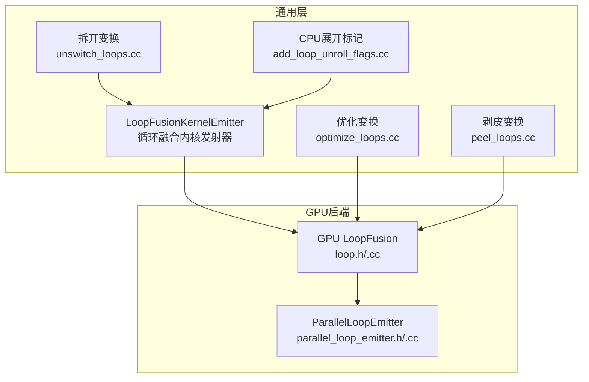
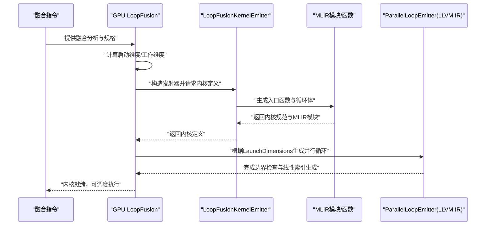
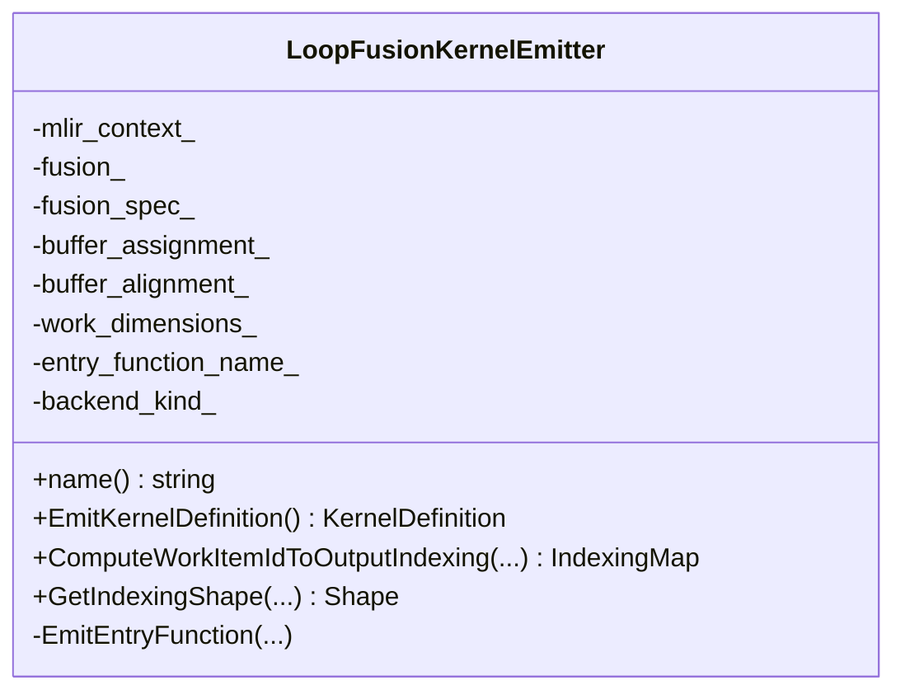
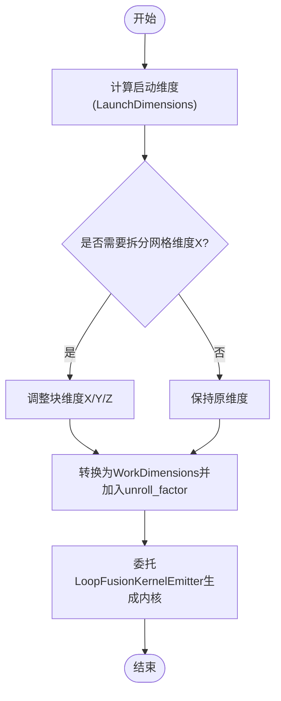
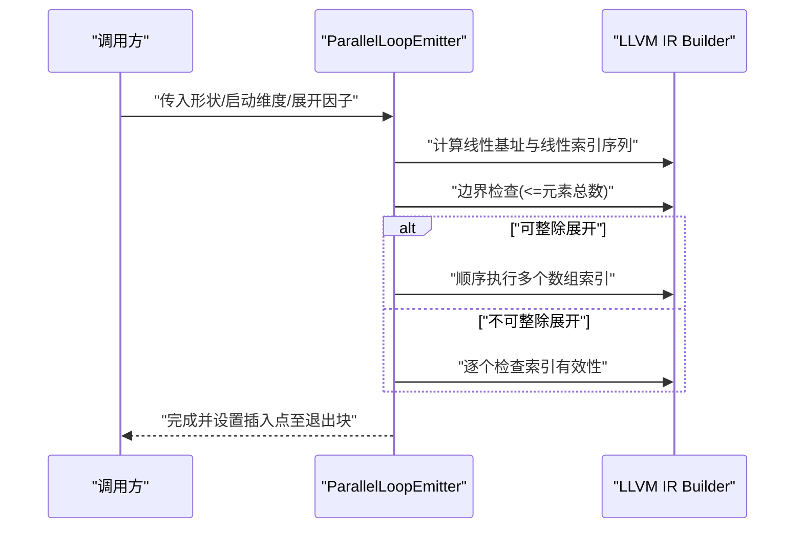
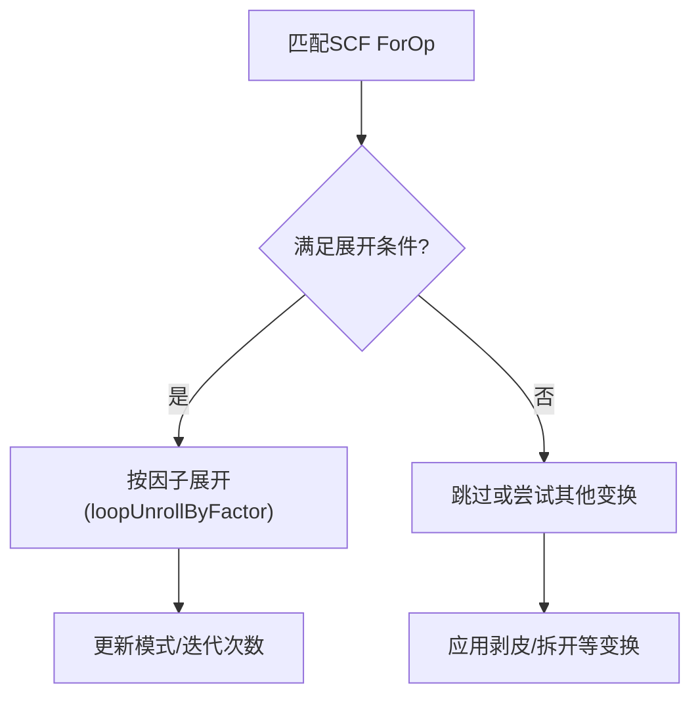
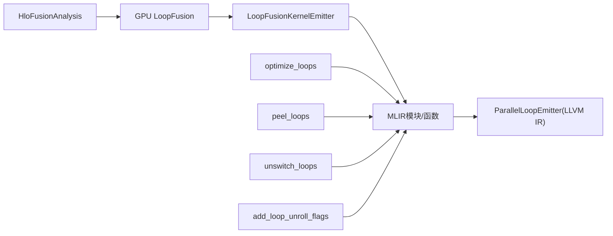

# 循环发射器

<cite>
**本文引用的文件**
- [loop_kernel_emitter.h](file://xla/codegen/emitters/loop_kernel_emitter.h)
- [loop_kernel_emitter.cc](file://xla/codegen/emitters/loop_kernel_emitter.cc)
- [loop.h](file://xla/backends/gpu/codegen/emitters/loop.h)
- [loop.cc](file://xla/backends/gpu/codegen/emitters/loop.cc)
- [parallel_loop_emitter.h](file://xla/backends/gpu/codegen/llvm/parallel_loop_emitter.h)
- [parallel_loop_emitter.cc](file://xla/backends/gpu/codegen/llvm/parallel_loop_emitter.cc)
- [optimize_loops.cc](file://xla/backends/gpu/codegen/emitters/transforms/optimize_loops.cc)
- [peel_loops.cc](file://xla/backends/gpu/codegen/emitters/transforms/peel_loops.cc)
- [unswitch_loops.cc](file://xla/codegen/emitters/transforms/unswitch_loops.cc)
- [add_loop_unroll_flags.cc](file://xla/backends/cpu/codegen/emitters/transforms/add_loop_unroll_flags.cc)
</cite>

## 目录
1. [引言](#引言)
2. [项目结构](#项目结构)
3. [核心组件](#核心组件)
4. [架构总览](#架构总览)
5. [详细组件分析](#详细组件分析)
6. [依赖关系分析](#依赖关系分析)
7. [性能考量](#性能考量)
8. [故障排查指南](#故障排查指南)
9. [结论](#结论)
10. [附录：配置与使用示例路径](#附录配置与使用示例路径)

## 引言
本文件系统性阐述XLA循环内核发射器的设计与实现，重点覆盖以下方面：
- 如何生成高效循环结构：嵌套循环、并行循环与向量化循环的实现路径
- 循环参数绑定机制：循环变量初始化、边界检查与步长控制
- 调度策略：负载均衡、内存局部性与缓存友好访问模式
- 配置选项：循环展开、软件流水线与SIMD向量化设置
- 实际代码示例路径：展示不同类型循环的发射流程与性能优化技巧

## 项目结构
围绕循环发射器的关键模块分布于以下位置：
- 通用循环融合内核发射器：xla/codegen/emitters
- GPU后端循环发射与调度：xla/backends/gpu/codegen/emitters
- GPU后端LLVM并行循环发射器：xla/backends/gpu/codegen/llvm
- 后端变换（CPU/GPU）：xla/backends/*/codegen/emitters/transforms
- 通用变换（CPU/GPU）：xla/codegen/emitters/transforms

图示来源
- [loop_kernel_emitter.h](file://xla/codegen/emitters/loop_kernel_emitter.h#L40-L81)
- [loop_kernel_emitter.cc](file://xla/codegen/emitters/loop_kernel_emitter.cc#L88-L240)
- [loop.h](file://xla/backends/gpu/codegen/emitters/loop.h#L37-L74)
- [loop.cc](file://xla/backends/gpu/codegen/emitters/loop.cc#L117-L142)
- [parallel_loop_emitter.h](file://xla/backends/gpu/codegen/llvm/parallel_loop_emitter.h#L36-L103)
- [parallel_loop_emitter.cc](file://xla/backends/gpu/codegen/llvm/parallel_loop_emitter.cc#L48-L277)
- [optimize_loops.cc](file://xla/backends/gpu/codegen/emitters/transforms/optimize_loops.cc#L136-L171)
- [peel_loops.cc](file://xla/backends/gpu/codegen/emitters/transforms/peel_loops.cc#L55-L130)
- [unswitch_loops.cc](file://xla/codegen/emitters/transforms/unswitch_loops.cc#L38-L104)
- [add_loop_unroll_flags.cc](file://xla/backends/cpu/codegen/emitters/transforms/add_loop_unroll_flags.cc#L49-L129)

章节来源
- [loop_kernel_emitter.h](file://xla/codegen/emitters/loop_kernel_emitter.h#L16-L86)
- [loop_kernel_emitter.cc](file://xla/codegen/emitters/loop_kernel_emitter.cc#L88-L240)
- [loop.h](file://xla/backends/gpu/codegen/emitters/loop.h#L37-L74)
- [loop.cc](file://xla/backends/gpu/codegen/emitters/loop.cc#L117-L142)
- [parallel_loop_emitter.h](file://xla/backends/gpu/codegen/llvm/parallel_loop_emitter.h#L36-L103)
- [parallel_loop_emitter.cc](file://xla/backends/gpu/codegen/llvm/parallel_loop_emitter.cc#L48-L277)
- [optimize_loops.cc](file://xla/backends/gpu/codegen/emitters/transforms/optimize_loops.cc#L136-L171)
- [peel_loops.cc](file://xla/backends/gpu/codegen/emitters/transforms/peel_loops.cc#L55-L130)
- [unswitch_loops.cc](file://xla/codegen/emitters/transforms/unswitch_loops.cc#L38-L104)
- [add_loop_unroll_flags.cc](file://xla/backends/cpu/codegen/emitters/transforms/add_loop_unroll_flags.cc#L49-L129)

## 核心组件
- 通用循环融合内核发射器：负责将融合计算映射到MLIR的Forall/SCF循环，并通过索引映射将工作项映射到输出张量位置，支持并行写入切片。
- GPU循环发射器：基于分析结果计算启动维度，生成WorkDimensions并委托通用发射器生成内核。
- GPU并行循环发射器：在LLVM IR层面按块/线程维度生成并行循环，处理边界检查、线性索引与可选的展开因子。
- 后端变换：对SCF循环进行展开、剥皮与拆开等重写，以提升吞吐与访存局部性。

章节来源
- [loop_kernel_emitter.h](file://xla/codegen/emitters/loop_kernel_emitter.h#L40-L81)
- [loop_kernel_emitter.cc](file://xla/codegen/emitters/loop_kernel_emitter.cc#L88-L240)
- [loop.h](file://xla/backends/gpu/codegen/emitters/loop.h#L37-L74)
- [loop.cc](file://xla/backends/gpu/codegen/emitters/loop.cc#L117-L142)
- [parallel_loop_emitter.h](file://xla/backends/gpu/codegen/llvm/parallel_loop_emitter.h#L36-L103)
- [parallel_loop_emitter.cc](file://xla/backends/gpu/codegen/llvm/parallel_loop_emitter.cc#L48-L277)

## 架构总览
下图展示了从融合指令到最终内核发射的整体流程，以及GPU后端如何结合LLVM IR并行循环发射器完成高效执行。

图示来源
- [loop.cc](file://xla/backends/gpu/codegen/emitters/loop.cc#L123-L142)
- [loop_kernel_emitter.cc](file://xla/codegen/emitters/loop_kernel_emitter.cc#L88-L240)
- [parallel_loop_emitter.cc](file://xla/backends/gpu/codegen/llvm/parallel_loop_emitter.cc#L242-L277)

## 详细组件分析

### 组件A：通用循环融合内核发射器（LoopFusionKernelEmitter）
职责与流程
- 接收融合指令与规格，生成MLIR模块与入口函数
- 计算工作项到输出索引的映射，确保每个工作项写入正确的输出位置
- 使用Forall/SCF循环包裹主体，支持并行写入切片操作
- 将索引映射应用于输出张量插入操作，保证多根融合时的正确性

关键点
- 索引映射：默认工作项索引映射由工具函数提供，支持根形状推导与位宽选择
- 循环体：通过回调构建循环体，将输入张量与索引结果作为操作数调用纯函数
- 并行写入：在循环终止后，使用并行切片插入将结果写回输出张量

图示来源
- [loop_kernel_emitter.h](file://xla/codegen/emitters/loop_kernel_emitter.h#L40-L81)
- [loop_kernel_emitter.cc](file://xla/codegen/emitters/loop_kernel_emitter.cc#L88-L240)

章节来源
- [loop_kernel_emitter.h](file://xla/codegen/emitters/loop_kernel_emitter.h#L40-L81)
- [loop_kernel_emitter.cc](file://xla/codegen/emitters/loop_kernel_emitter.cc#L88-L240)

### 组件B：GPU循环发射器（LoopFusion）
职责与流程
- 基于融合分析与设备信息计算启动维度
- 将启动维度转换为工作维度，并附加展开因子
- 委托通用发射器生成MLIR模块与内核定义
- 提供线程ID到输出/输入索引映射，用于后续访存优化

图示来源
- [loop.cc](file://xla/backends/gpu/codegen/emitters/loop.cc#L97-L121)

章节来源
- [loop.h](file://xla/backends/gpu/codegen/emitters/loop.h#L37-L74)
- [loop.cc](file://xla/backends/gpu/codegen/emitters/loop.cc#L97-L121)

### 组件C：GPU并行循环发射器（ParallelLoopEmitter）
职责与流程
- 按块/线程维度生成并行循环，计算线性基址与线程索引
- 进行边界检查，仅在有效范围内执行循环体
- 支持展开因子，通过重复生成连续索引以利于SLP向量化
- 在元素总数不超过线程×展开因子时，避免内核内部循环

图示来源
- [parallel_loop_emitter.cc](file://xla/backends/gpu/codegen/llvm/parallel_loop_emitter.cc#L153-L277)

章节来源
- [parallel_loop_emitter.h](file://xla/backends/gpu/codegen/llvm/parallel_loop_emitter.h#L36-L103)
- [parallel_loop_emitter.cc](file://xla/backends/gpu/codegen/llvm/parallel_loop_emitter.cc#L153-L277)

### 组件D：循环优化变换（GPU/CPU）
- 展开优化（GPU）：根据循环体大小、trip count与昂贵算子判断是否展开，优先完全展开小循环
- 剥皮变换（GPU）：将循环尾部剥离为独立循环，减少分支与边界处理复杂度
- 拆开变换（通用）：将条件分支内的循环进行拆开，消除运行时分支
- 展开标记（CPU）：为深层嵌套循环注入展开属性，指导后端编译器行为

图示来源
- [optimize_loops.cc](file://xla/backends/gpu/codegen/emitters/transforms/optimize_loops.cc#L136-L171)
- [peel_loops.cc](file://xla/backends/gpu/codegen/emitters/transforms/peel_loops.cc#L55-L130)
- [unswitch_loops.cc](file://xla/codegen/emitters/transforms/unswitch_loops.cc#L38-L104)
- [add_loop_unroll_flags.cc](file://xla/backends/cpu/codegen/emitters/transforms/add_loop_unroll_flags.cc#L49-L129)

章节来源
- [optimize_loops.cc](file://xla/backends/gpu/codegen/emitters/transforms/optimize_loops.cc#L136-L171)
- [peel_loops.cc](file://xla/backends/gpu/codegen/emitters/transforms/peel_loops.cc#L55-L130)
- [unswitch_loops.cc](file://xla/codegen/emitters/transforms/unswitch_loops.cc#L38-L104)
- [add_loop_unroll_flags.cc](file://xla/backends/cpu/codegen/emitters/transforms/add_loop_unroll_flags.cc#L49-L129)

## 依赖关系分析
- LoopFusion依赖HloFusionAnalysis与设备信息，计算LaunchDimensions并转换为WorkDimensions
- LoopFusionKernelEmitter依赖通用发射工具（索引映射、API构建、MLIR模块），生成Forall/SCF循环
- ParallelLoopEmitter直接面向LLVM IR，负责线程维度的边界与索引生成
- 各变换Pass在不同阶段作用于SCF循环，形成“分析→生成→优化”的闭环

图示来源
- [loop.cc](file://xla/backends/gpu/codegen/emitters/loop.cc#L123-L142)
- [loop_kernel_emitter.cc](file://xla/codegen/emitters/loop_kernel_emitter.cc#L88-L240)
- [parallel_loop_emitter.cc](file://xla/backends/gpu/codegen/llvm/parallel_loop_emitter.cc#L242-L277)
- [optimize_loops.cc](file://xla/backends/gpu/codegen/emitters/transforms/optimize_loops.cc#L136-L171)
- [peel_loops.cc](file://xla/backends/gpu/codegen/emitters/transforms/peel_loops.cc#L55-L130)
- [unswitch_loops.cc](file://xla/codegen/emitters/transforms/unswitch_loops.cc#L38-L104)
- [add_loop_unroll_flags.cc](file://xla/backends/cpu/codegen/emitters/transforms/add_loop_unroll_flags.cc#L49-L129)

章节来源
- [loop.cc](file://xla/backends/gpu/codegen/emitters/loop.cc#L123-L142)
- [loop_kernel_emitter.cc](file://xla/codegen/emitters/loop_kernel_emitter.cc#L88-L240)
- [parallel_loop_emitter.cc](file://xla/backends/gpu/codegen/llvm/parallel_loop_emitter.cc#L242-L277)
- [optimize_loops.cc](file://xla/backends/gpu/codegen/emitters/transforms/optimize_loops.cc#L136-L171)
- [peel_loops.cc](file://xla/backends/gpu/codegen/emitters/transforms/peel_loops.cc#L55-L130)
- [unswitch_loops.cc](file://xla/codegen/emitters/transforms/unswitch_loops.cc#L38-L104)
- [add_loop_unroll_flags.cc](file://xla/backends/cpu/codegen/emitters/transforms/add_loop_unroll_flags.cc#L49-L129)

## 性能考量
- 负载均衡
  - GPU后端通过LaunchDimensions将工作均匀分配到线程块，避免部分线程空闲
  - LoopFusion在必要时拆分网格维度X以适配设备限制
- 内存局部性与缓存友好
  - ParallelLoopEmitter按线程连续性生成线性索引，减少跨块/跨线程的随机访问
  - 可选展开因子使连续索引共享指针，便于SLP向量化
- 边界检查与步长控制
  - 通用发射器在Forall循环后进行切片并行写入，避免显式步长控制
  - GPU并行循环发射器在进入循环前进行边界检查，确保不越界
- 循环展开与向量化
  - GPU优化变换根据循环体大小与trip count决定展开因子，优先完全展开小循环
  - CPU侧通过注入展开属性指导后端编译器进行循环展开
  - 向量化：通过连续索引与SLP pass，将标量加载/存储提升为向量形式

章节来源
- [loop.cc](file://xla/backends/gpu/codegen/emitters/loop.cc#L97-L121)
- [parallel_loop_emitter.cc](file://xla/backends/gpu/codegen/llvm/parallel_loop_emitter.cc#L153-L277)
- [optimize_loops.cc](file://xla/backends/gpu/codegen/emitters/transforms/optimize_loops.cc#L136-L171)
- [add_loop_unroll_flags.cc](file://xla/backends/cpu/codegen/emitters/transforms/add_loop_unroll_flags.cc#L49-L129)

## 故障排查指南
- 循环展开失败
  - 检查循环步长与下界是否满足展开要求（步长=1、下界=0）
  - 确认循环体中无昂贵算子导致无法展开
  - 参考路径：[optimize_loops.cc](file://xla/backends/gpu/codegen/emitters/transforms/optimize_loops.cc#L66-L134)
- 嵌套循环深度过大
  - CPU侧可通过注入展开属性降低嵌套深度带来的编译器限制
  - 参考路径：[add_loop_unroll_flags.cc](file://xla/backends/cpu/codegen/emitters/transforms/add_loop_unroll_flags.cc#L49-L129)
- 条件分支导致的分支开销
  - 使用拆开变换将条件分支内的循环拆分为常量分支路径
  - 参考路径：[unswitch_loops.cc](file://xla/codegen/emitters/transforms/unswitch_loops.cc#L38-L104)
- 尾部循环导致的边界处理复杂
  - 使用剥皮变换将尾部剥离为独立循环，简化主循环逻辑
  - 参考路径：[peel_loops.cc](file://xla/backends/gpu/codegen/emitters/transforms/peel_loops.cc#L55-L130)

章节来源
- [optimize_loops.cc](file://xla/backends/gpu/codegen/emitters/transforms/optimize_loops.cc#L66-L134)
- [add_loop_unroll_flags.cc](file://xla/backends/cpu/codegen/emitters/transforms/add_loop_unroll_flags.cc#L49-L129)
- [unswitch_loops.cc](file://xla/codegen/emitters/transforms/unswitch_loops.cc#L38-L104)
- [peel_loops.cc](file://xla/backends/gpu/codegen/emitters/transforms/peel_loops.cc#L55-L130)

## 结论
XLA循环发射器通过“融合分析→工作维度→MLIR循环→并行写入”的链路，实现了对嵌套、并行与向量化循环的统一建模。GPU后端进一步结合LLVM IR并行循环发射器，在线程维度上完成高效的边界检查与索引生成；变换Pass则在编译期对SCF循环进行展开、剥皮与拆开，显著提升吞吐与访存局部性。配合合理的展开因子与向量化策略，可在不同硬件平台上获得稳定的高性能表现。

## 附录：配置与使用示例路径
- 循环展开
  - GPU：参考优化变换中的展开因子计算与应用
    - [optimize_loops.cc](file://xla/backends/gpu/codegen/emitters/transforms/optimize_loops.cc#L66-L134)
  - CPU：参考注入展开属性的Pass
    - [add_loop_unroll_flags.cc](file://xla/backends/cpu/codegen/emitters/transforms/add_loop_unroll_flags.cc#L49-L129)
- 软流水线
  - 可通过变换Pass对循环进行重写以促进流水线
    - [unswitch_loops.cc](file://xla/codegen/emitters/transforms/unswitch_loops.cc#L38-L104)
- SIMD向量化
  - 通过连续索引与SLP pass自动向量化
    - [parallel_loop_emitter.cc](file://xla/backends/gpu/codegen/llvm/parallel_loop_emitter.cc#L184-L194)
- 嵌套循环、并行循环与向量化循环的发射流程
  - 通用循环融合内核发射器
    - [loop_kernel_emitter.cc](file://xla/codegen/emitters/loop_kernel_emitter.cc#L143-L240)
  - GPU循环发射器
    - [loop.cc](file://xla/backends/gpu/codegen/emitters/loop.cc#L123-L142)
  - GPU并行循环发射器
    - [parallel_loop_emitter.cc](file://xla/backends/gpu/codegen/llvm/parallel_loop_emitter.cc#L242-L277)