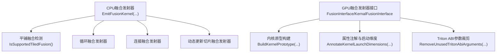
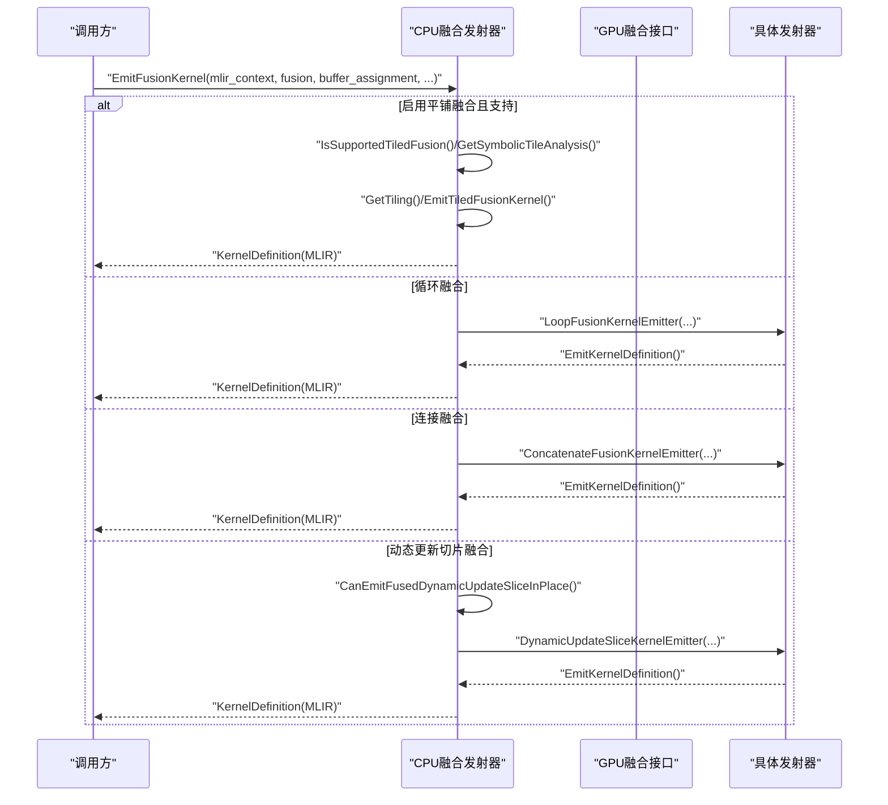
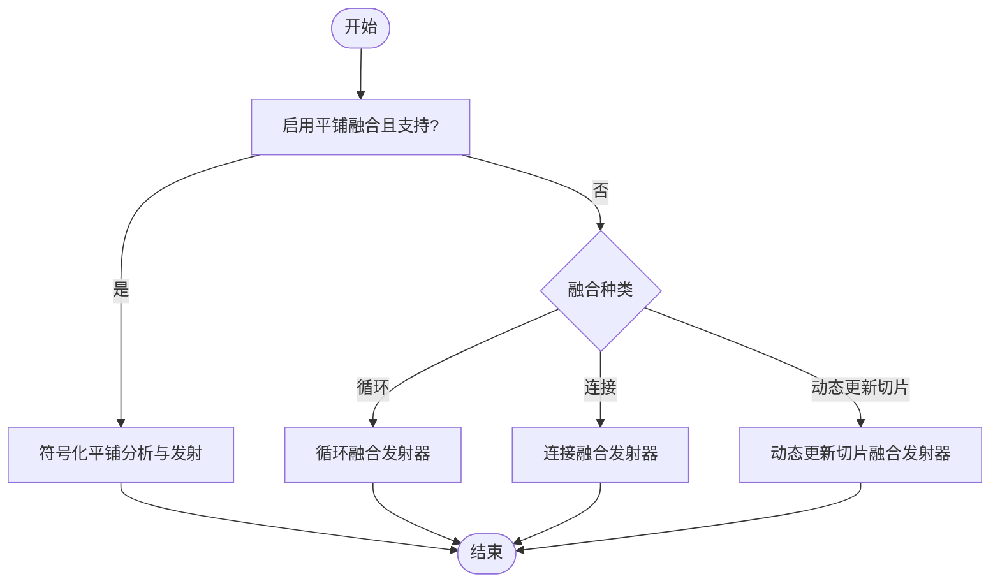
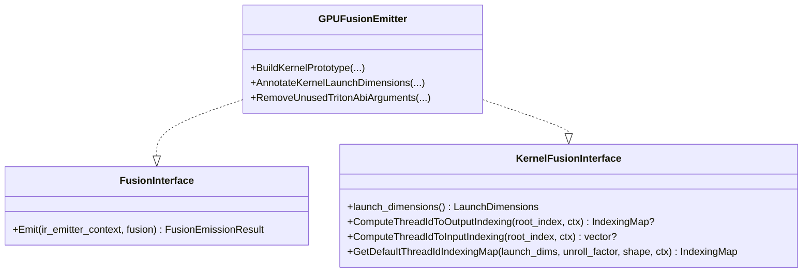
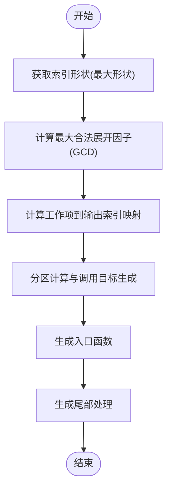
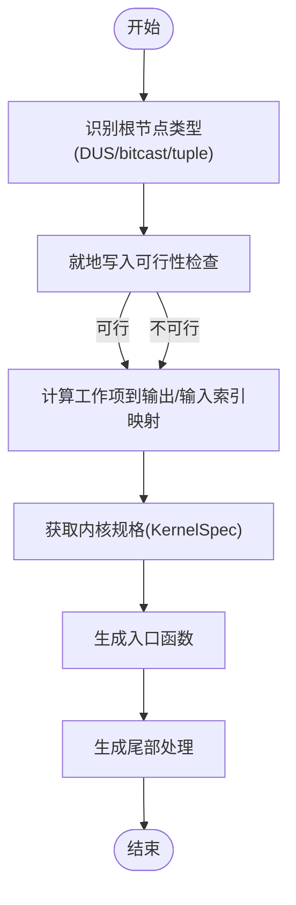
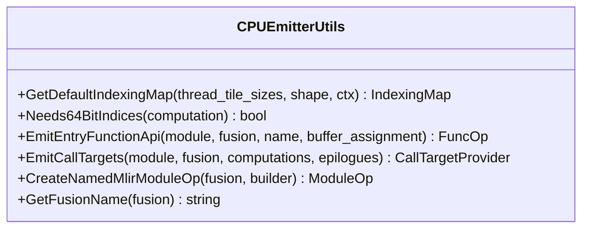
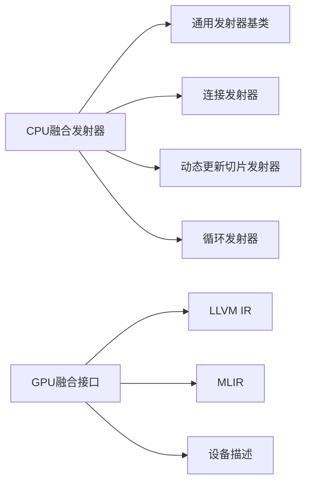

# 融合发射器

<cite>
**本文引用的文件**
- [xla\backends\gpu\codegen\fusion_emitter.h](file://xla/backends/gpu/codegen/fusion_emitter.h)
- [xla\backends\gpu\codegen\fusion_emitter.cc](file://xla/backends/gpu/codegen/fusion_emitter.cc)
- [xla\backends\cpu\codegen\fusion_emitter.h](file://xla/backends/cpu/codegen/fusion_emitter.h)
- [xla\backends\cpu\codegen\fusion_emitter.cc](file://xla/backends/cpu/codegen/fusion_emitter.cc)
- [xla\backends\cpu\codegen\emitters\cpu_fusion_emitter.h](file://xla/backends/cpu/codegen/emitters/cpu_fusion_emitter.h)
- [xla\backends\cpu\codegen\emitters\cpu_fusion_emitter.cc](file://xla/backends/cpu/codegen/emitters/cpu_fusion_emitter.cc)
- [xla\codegen\emitters\concatenate_kernel_emitter.h](file://xla/codegen/emitters/concatenate_kernel_emitter.h)
- [xla\codegen\emitters\dynamic_update_slice_kernel_emitter.h](file://xla/codegen/emitters/dynamic_update_slice_kernel_emitter.h)
</cite>

## 目录
1. [引言](#引言)
2. [项目结构](#项目结构)
3. [核心组件](#核心组件)
4. [架构总览](#架构总览)
5. [详细组件分析](#详细组件分析)
6. [依赖分析](#依赖分析)
7. [性能考量](#性能考量)
8. [故障排查指南](#故障排查指南)
9. [结论](#结论)
10. [附录](#附录)

## 引言
本文件系统性阐述XLA融合内核发射器的设计与实现，重点覆盖以下方面：
- 融合发射器如何将多个HLO操作合并为单一内核，以减少启动开销并提升缓存命中与指令级并行。
- 算子融合策略：基于融合种类（如循环融合、连接融合、动态更新切片融合）选择合适的发射器路径。
- 内存访问优化与计算重用：通过索引映射、工作维度划分、对齐与缓冲区布局优化，降低访存抖动并最大化数据复用。
- 融合包装器基类设计模式：融合点识别、依赖关系分析、执行顺序确定与入口函数生成。
- 具体发射器实现：连接操作发射器与动态更新切片发射器的工作原理与适用场景。
- 性能评估方法：吞吐量测量、内存带宽利用率与GPU占用率分析。
- 最佳实践与常见陷阱：如何在不同后端（CPU/GPU）下正确配置与调优。

## 项目结构
XLA融合发射器在不同后端采用统一的接口与抽象，但具体实现由后端决定：
- GPU后端：定义通用融合接口与CUDA/Triton内核原型构建、属性注解、启动维度设置等能力。
- CPU后端：提供融合内核发射入口、工作维度推导、英雄指令选择与多种特化发射器（连接、动态更新切片、循环等）。
- 通用发射器基类：面向MLIR的内核发射器基类，支持分区计算、调用目标生成、尾部处理等。

**图表来源**
- [xla\backends\cpu\codegen\fusion_emitter.cc](file://xla/backends/cpu/codegen/fusion_emitter.cc#L286-L330)
- [xla\backends\gpu\codegen\fusion_emitter.h](file://xla/backends/gpu/codegen/fusion_emitter.h#L52-L102)
- [xla\backends\gpu\codegen\fusion_emitter.cc](file://xla/backends/gpu/codegen/fusion_emitter.cc#L160-L225)

**章节来源**
- [xla\backends\cpu\codegen\fusion_emitter.h](file://xla/backends/cpu/codegen/fusion_emitter.h#L31-L34)
- [xla\backends\cpu\codegen\fusion_emitter.cc](file://xla/backends/cpu/codegen/fusion_emitter.cc#L286-L330)
- [xla\backends\gpu\codegen\fusion_emitter.h](file://xla/backends/gpu/codegen/fusion_emitter.h#L52-L102)
- [xla\backends\gpu\codegen\fusion_emitter.cc](file://xla/backends/gpu/codegen/fusion_emitter.cc#L160-L225)

## 核心组件
- CPU融合发射器入口
  - 提供统一的融合内核发射入口，根据融合类型与特性选择最优发射器，并生成MLIR内核定义。
  - 支持平铺融合（Tiled Fusion）与回退到循环/连接/动态更新切片发射器。
- GPU融合接口
  - 定义通用融合接口与内核融合接口，负责内核原型构建、属性注解、启动维度设置与索引映射计算。
- 通用发射器基类
  - 面向MLIR的内核发射器基类，支持分区计算、调用目标生成、尾部处理与入口函数生成。
- 特定发射器
  - 连接融合发射器：针对连接操作的形状与索引特性进行优化，支持最大合法展开因子。
  - 动态更新切片融合发射器：针对动态更新切片根节点的就地写入可行性分析与发射。

**章节来源**
- [xla\backends\cpu\codegen\fusion_emitter.cc](file://xla/backends/cpu/codegen/fusion_emitter.cc#L286-L330)
- [xla\backends\gpu\codegen\fusion_emitter.h](file://xla/backends/gpu/codegen/fusion_emitter.h#L52-L102)
- [xla\backends\gpu\codegen\fusion_emitter.cc](file://xla/backends/gpu/codegen/fusion_emitter.cc#L160-L225)
- [xla\codegen\emitters\concatenate_kernel_emitter.h](file://xla/codegen/emitters/concatenate_kernel_emitter.h#L41-L96)
- [xla\codegen\emitters\dynamic_update_slice_kernel_emitter.h](file://xla/codegen/emitters/dynamic_update_slice_kernel_emitter.h#L49-L97)

## 架构总览
XLA融合发射器的整体流程如下：
- 输入：HLO融合指令、缓冲区分配信息、后端配置。
- 选择策略：优先尝试平铺融合；否则按融合种类选择对应发射器；若不支持则返回未实现错误。
- 输出：内核定义（CPU为MLIR内核源，GPU为LLVM模块与Thunk序列）。

**图表来源**
- [xla\backends\cpu\codegen\fusion_emitter.cc](file://xla/backends/cpu/codegen/fusion_emitter.cc#L286-L330)
- [xla\backends\cpu\codegen\fusion_emitter.cc](file://xla/backends/cpu/codegen/fusion_emitter.cc#L215-L235)
- [xla\backends\cpu\codegen\fusion_emitter.cc](file://xla/backends/cpu/codegen/fusion_emitter.cc#L237-L259)
- [xla\backends\cpu\codegen\fusion_emitter.cc](file://xla/backends/cpu/codegen/fusion_emitter.cc#L261-L284)

## 详细组件分析

### CPU融合发射器（EmitFusionKernel）
- 职责
  - 统一入口：根据融合种类与特性选择发射器。
  - 平铺融合：当启用且满足条件时，进行符号化平铺分析与发射。
  - 回退策略：循环融合、连接融合、动态更新切片融合依次尝试。
- 关键逻辑
  - 英雄指令选择：从根指令向上跳过平凡元素运算，优先选择连接或非平凡根。
  - 工作维度：基于布局minor-to-major折叠与分组数推导工作维度。
  - 就地可行性：对动态更新切片融合进行就地写入可行性检查。
- 返回值：MLIR内核定义，包含模块与内存区域名属性。

**图表来源**
- [xla\backends\cpu\codegen\fusion_emitter.cc](file://xla/backends/cpu/codegen/fusion_emitter.cc#L286-L330)
- [xla\backends\cpu\codegen\fusion_emitter.cc](file://xla/backends/cpu/codegen/fusion_emitter.cc#L82-L106)
- [xla\backends\cpu\codegen\fusion_emitter.cc](file://xla/backends/cpu/codegen/fusion_emitter.cc#L140-L169)

**章节来源**
- [xla\backends\cpu\codegen\fusion_emitter.cc](file://xla/backends/cpu/codegen/fusion_emitter.cc#L72-L106)
- [xla\backends\cpu\codegen\fusion_emitter.cc](file://xla/backends/cpu/codegen/fusion_emitter.cc#L140-L169)
- [xla\backends\cpu\codegen\fusion_emitter.cc](file://xla/backends/cpu/codegen/fusion_emitter.cc#L286-L330)

### GPU融合接口（FusionInterface/KernalFusionInterface）
- 职责
  - 定义融合发射的统一接口与内核融合接口，支持计算线程到输出/输入索引映射。
  - 构建内核原型、注解启动维度、移除Triton ABI冗余参数。
- 关键能力
  - 默认线程ID索引映射：基于LaunchDimensions与形状生成默认索引映射。
  - 属性注解：按参数大小与对齐设置dereferenceable与noalias等属性。
  - 启动维度注解：根据设备限制设置nvvm/amdgpu相关属性，避免资源不足导致的启动失败。

**图表来源**
- [xla\backends\gpu\codegen\fusion_emitter.h](file://xla/backends/gpu/codegen/fusion_emitter.h#L52-L102)
- [xla\backends\gpu\codegen\fusion_emitter.cc](file://xla/backends/gpu/codegen/fusion_emitter.cc#L160-L225)
- [xla\backends\gpu\codegen\fusion_emitter.cc](file://xla/backends/gpu/codegen/fusion_emitter.cc#L113-L149)
- [xla\backends\gpu\codegen\fusion_emitter.cc](file://xla/backends/gpu/codegen/fusion_emitter.cc#L227-L291)

**章节来源**
- [xla\backends\gpu\codegen\fusion_emitter.h](file://xla/backends/gpu/codegen/fusion_emitter.h#L52-L102)
- [xla\backends\gpu\codegen\fusion_emitter.cc](file://xla/backends/gpu/codegen/fusion_emitter.cc#L160-L225)
- [xla\backends\gpu\codegen\fusion_emitter.cc](file://xla/backends/gpu/codegen/fusion_emitter.cc#L113-L149)
- [xla\backends\gpu\codegen\fusion_emitter.cc](file://xla/backends/gpu/codegen/fusion_emitter.cc#L227-L291)

### 连接融合发射器（ConcatenateFusionKernelEmitter）
- 适用场景
  - 根节点为连接操作的融合，通常用于拼接不同维度的数据块。
- 关键特性
  - 索引形状：使用“最大形状”作为索引基准。
  - 展开因子：最大合法展开因子为所有操作数在连接维度上的最大公约数。
  - 约束：连接维度必须可整除工作组数量，确保每个线程/工作组只访问有效数据。
- 生成流程
  - 计算工作项到输出索引映射。
  - 分区计算与调用目标生成。
  - 生成入口函数与尾部处理。

**图表来源**
- [xla\codegen\emitters\concatenate_kernel_emitter.h](file://xla/codegen/emitters/concatenate_kernel_emitter.h#L58-L71)
- [xla\codegen\emitters\concatenate_kernel_emitter.h](file://xla/codegen/emitters/concatenate_kernel_emitter.h#L74-L84)

**章节来源**
- [xla\codegen\emitters\concatenate_kernel_emitter.h](file://xla/codegen/emitters/concatenate_kernel_emitter.h#L41-L96)

### 动态更新切片融合发射器（DynamicUpdateSliceKernelEmitter）
- 适用场景
  - 根节点为动态更新切片或其位掩码/元组变体的融合。
- 关键特性
  - 索引形状：使用更新形状作为索引基准。
  - 就地写入：需先判断是否可就地写入，避免读写冲突。
  - 输入索引映射：从线程ID到输入元素的索引映射可能仅部分可计算。
- 生成流程
  - 获取内核规格（KernelSpec）。
  - 计算工作项到输出/输入索引映射。
  - 生成入口函数与尾部处理。

**图表来源**
- [xla\codegen\emitters\dynamic_update_slice_kernel_emitter.h](file://xla/codegen/emitters/dynamic_update_slice_kernel_emitter.h#L66-L72)
- [xla\codegen\emitters\dynamic_update_slice_kernel_emitter.h](file://xla/codegen/emitters/dynamic_update_slice_kernel_emitter.h#L75-L85)

**章节来源**
- [xla\codegen\emitters\dynamic_update_slice_kernel_emitter.h](file://xla/codegen/emitters/dynamic_update_slice_kernel_emitter.h#L49-L97)

### CPU融合发射器基类与工具（cpu_fusion_emitter）
- 职责
  - 提供默认索引映射生成、入口函数API生成、调用目标声明与生成、命名模块创建与融合名称解析。
- 关键能力
  - 默认索引映射：基于线程瓦片尺寸与形状生成仿射映射，约束线程ID与瓦片内线性索引范围。
  - 64位索引判定：遍历HLO图，识别需要64位索引的指令与形状。
  - 入口函数：构造内核API参数（参数与结果），设置属性并标注后端类型。

**图表来源**
- [xla\backends\cpu\codegen\emitters\cpu_fusion_emitter.h](file://xla/backends/cpu/codegen/emitters/cpu_fusion_emitter.h#L43-L66)
- [xla\backends\cpu\codegen\emitters\cpu_fusion_emitter.cc](file://xla/backends/cpu/codegen/emitters/cpu_fusion_emitter.cc#L134-L171)
- [xla\backends\cpu\codegen\emitters\cpu_fusion_emitter.cc](file://xla/backends/cpu/codegen/emitters/cpu_fusion_emitter.cc#L173-L241)
- [xla\backends\cpu\codegen\emitters\cpu_fusion_emitter.cc](file://xla/backends/cpu/codegen/emitters/cpu_fusion_emitter.cc#L243-L291)
- [xla\backends\cpu\codegen\emitters\cpu_fusion_emitter.cc](file://xla/backends/cpu/codegen/emitters/cpu_fusion_emitter.cc#L295-L314)

**章节来源**
- [xla\backends\cpu\codegen\emitters\cpu_fusion_emitter.h](file://xla/backends/cpu/codegen/emitters/cpu_fusion_emitter.h#L43-L66)
- [xla\backends\cpu\codegen\emitters\cpu_fusion_emitter.cc](file://xla/backends/cpu/codegen/emitters/cpu_fusion_emitter.cc#L134-L171)
- [xla\backends\cpu\codegen\emitters\cpu_fusion_emitter.cc](file://xla/backends/cpu/codegen/emitters/cpu_fusion_emitter.cc#L173-L241)
- [xla\backends\cpu\codegen\emitters\cpu_fusion_emitter.cc](file://xla/backends/cpu/codegen/emitters/cpu_fusion_emitter.cc#L243-L291)
- [xla\backends\cpu\codegen\emitters\cpu_fusion_emitter.cc](file://xla/backends/cpu/codegen/emitters/cpu_fusion_emitter.cc#L295-L314)

## 依赖分析
- 模块耦合
  - CPU融合发射器依赖通用发射器基类与特化发射器（连接、动态更新切片、循环）。
  - GPU融合接口依赖LLVM IR与MLIR索引映射、启动维度与设备描述。
- 外部依赖
  - MLIR：用于构建内核模块、索引映射与属性注解。
  - LLVM：用于内核原型构建、属性注解与目标三元组处理。
  - 设备描述：用于启动维度合法性检查与平台特定注解。

**图表来源**
- [xla\backends\cpu\codegen\fusion_emitter.cc](file://xla/backends/cpu/codegen/fusion_emitter.cc#L286-L330)
- [xla\backends\gpu\codegen\fusion_emitter.h](file://xla/backends/gpu/codegen/fusion_emitter.h#L52-L102)
- [xla\backends\gpu\codegen\fusion_emitter.cc](file://xla/backends/gpu/codegen/fusion_emitter.cc#L160-L225)

**章节来源**
- [xla\backends\cpu\codegen\fusion_emitter.cc](file://xla/backends/cpu/codegen/fusion_emitter.cc#L286-L330)
- [xla\backends\gpu\codegen\fusion_emitter.h](file://xla/backends/gpu/codegen/fusion_emitter.h#L52-L102)
- [xla\backends\gpu\codegen\fusion_emitter.cc](file://xla/backends/gpu/codegen/fusion_emitter.cc#L160-L225)

## 性能考量
- 吞吐量测量
  - 使用后端提供的计时与事件查询接口，测量内核启动与执行时间，结合批大小与输入规模计算每秒处理元素数。
- 内存带宽利用率
  - 通过设备计数器（如SM活动、访存带宽）与内核参数（全局/共享内存大小、访问模式）估算理论峰值与实际利用率。
- GPU占用率分析
  - 利用设备指标（SM占用率、内存子系统占用、分支效率）评估并定位瓶颈（寄存器压力、共享内存争用、分支分歧）。
- 优化建议
  - 合理划分工作组与瓦片大小，确保负载均衡与缓存友好。
  - 优先选择可就地写入的融合，减少中间缓冲。
  - 在CPU后端使用平铺融合与合适的展开因子，提升向量化与指令级并行。

[本节为通用指导，无需列出具体文件来源]

## 故障排查指南
- 启动维度越界
  - 现象：启动维度超过硬件限制导致启动失败。
  - 排查：检查设备块维限制与计算出的块数，调整线程/块配置。
  - 参考：启动维度注解与校验逻辑。
- 参数属性缺失
  - 现象：内核参数未设置对齐或别名属性，导致运行时异常。
  - 排查：确认参数注解流程已执行，必要时强制设置对齐与noalias。
- 索引映射不唯一
  - 现象：某些发射器无法从输出索引反推出输入索引（如散射、就地动态更新切片）。
  - 排查：检查融合规格与可行性检查，必要时降级为多步执行。
- 平铺融合不生效
  - 现象：启用平铺融合但未生成平铺内核。
  - 排查：确认满足平铺支持条件与符号化分析成功。

**章节来源**
- [xla\backends\gpu\codegen\fusion_emitter.cc](file://xla/backends/gpu/codegen/fusion_emitter.cc#L113-L149)
- [xla\backends\gpu\codegen\fusion_emitter.cc](file://xla/backends/gpu/codegen/fusion_emitter.cc#L86-L109)
- [xla\backends\cpu\codegen\fusion_emitter.cc](file://xla/backends/cpu/codegen/fusion_emitter.cc#L316-L325)

## 结论
XLA融合发射器通过统一接口与后端特化实现，将多个HLO操作融合为单一内核，显著降低启动开销并提升内存与计算效率。CPU后端侧重于灵活的英雄指令选择与多种特化发射器，GPU后端则强调内核原型构建、属性注解与启动维度控制。结合合理的性能评估与排错流程，可在不同硬件平台上获得稳定高效的融合效果。

[本节为总结性内容，无需列出具体文件来源]

## 附录
- 最佳实践
  - 优先选择连接与动态更新切片等具备明确索引映射的融合类型。
  - 在CPU上启用平铺融合以获得更好的向量化与局部性。
  - 对高带宽需求的内核，关注共享/全局内存访问模式与对齐。
- 常见陷阱
  - 忽视就地写入可行性，导致读写冲突与错误结果。
  - 启动维度配置不当，引发资源不足或低占用。
  - 未正确设置参数属性，导致运行时崩溃或性能下降。

[本节为通用指导，无需列出具体文件来源]