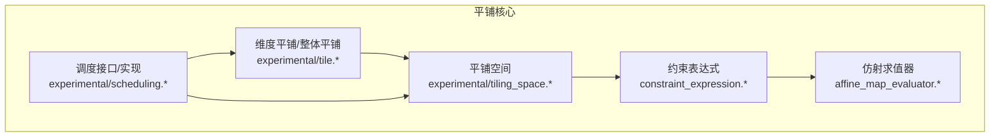
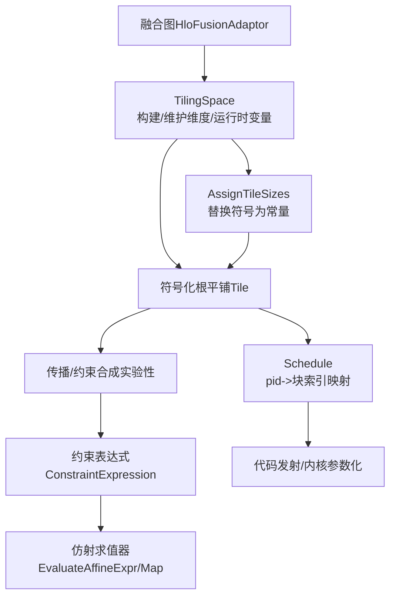
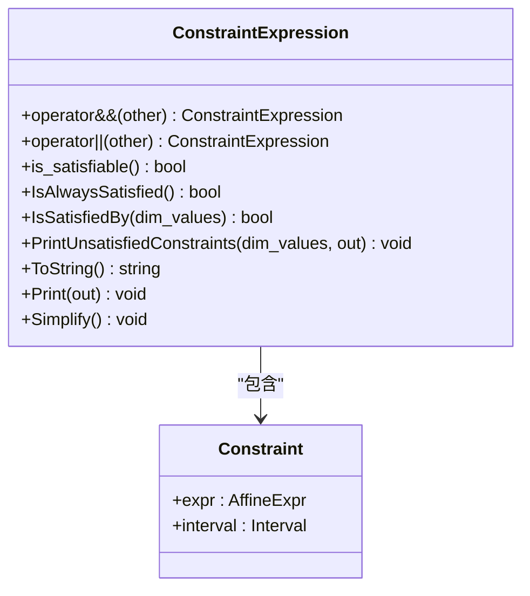
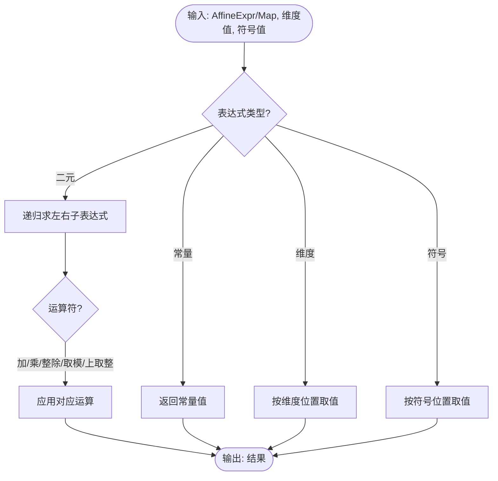
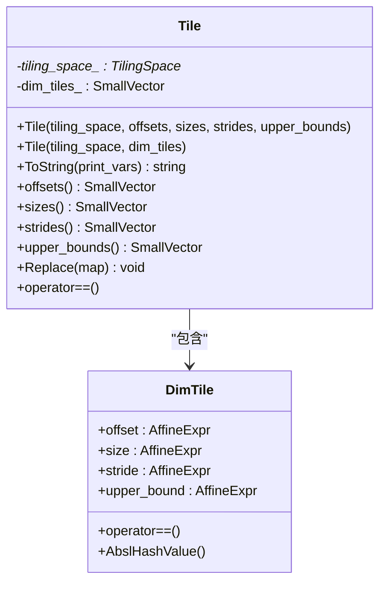
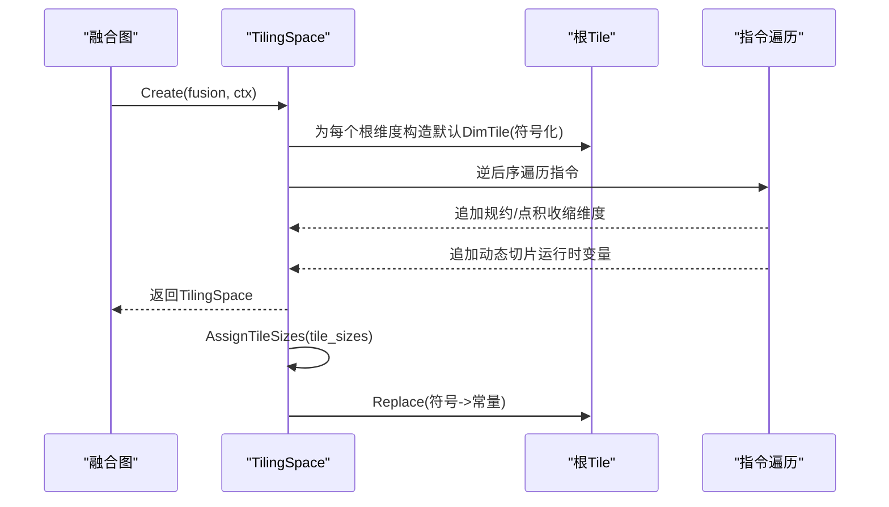
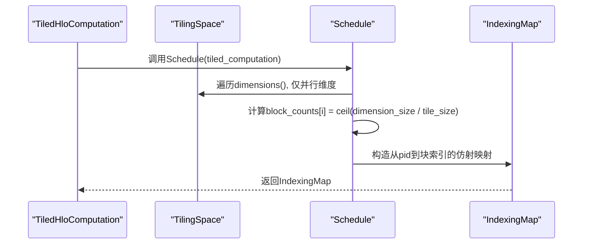
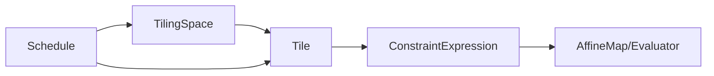

# 平铺系统

<cite>
**本文引用的文件**
- [constraint_expression.h](file://xla/codegen/tiling/constraint_expression.h)
- [constraint_expression.cc](file://xla/codegen/tiling/constraint_expression.cc)
- [affine_map_evaluator.h](file://xla/codegen/tiling/affine_map_evaluator.h)
- [affine_map_evaluator.cc](file://xla/codegen/tiling/affine_map_evaluator.cc)
- [tile.h](file://xla/codegen/tiling/experimental/tile.h)
- [tile.cc](file://xla/codegen/tiling/experimental/tile.cc)
- [tiling_space.h](file://xla/codegen/tiling/experimental/tiling_space.h)
- [tiling_space.cc](file://xla/codegen/tiling/experimental/tiling_space.cc)
- [scheduling.h](file://xla/codegen/tiling/experimental/scheduling.h)
- [scheduling.cc](file://xla/codegen/tiling/experimental/scheduling.cc)
- [tiled_layout.md](file://docs/tiled_layout.md)
- [tile_test.cc](file://xla/codegen/tiling/experimental/tile_test.cc)
</cite>

## 目录
1. [引言](#引言)
2. [项目结构](#项目结构)
3. [核心组件](#核心组件)
4. [架构总览](#架构总览)
5. [详细组件分析](#详细组件分析)
6. [依赖关系分析](#依赖关系分析)
7. [性能考量](#性能考量)
8. [故障排查指南](#故障排查指南)
9. [结论](#结论)
10. [附录](#附录)

## 引言
本文件系统化阐述XLA平铺（tiling）系统的设计与实现，覆盖以下主题：
- 循环平铺的概念与符号化表示：通过仿射表达式与约束表达式对平铺进行符号化建模，支持维度映射、步长计算与上界约束。
- 约束表达式的定义与解析：以析合范式（DNF）组织约束，支持合取与析取组合、可满足性判定与简化。
- 尺寸推导与平铺策略：在融合图中建立“平铺空间”，自动识别并标注并行/规约维度与运行时变量，生成符号化根平铺并按需赋值具体尺寸。
- 优化目标：通过平铺改善内存访问局部性、提升并行度与资源利用率。
- 配置接口与调试工具：提供约束打印、可满足性检查、字符串化格式化输出等能力；结合调度器将进程索引映射到块索引。

## 项目结构
与平铺系统直接相关的代码主要位于以下位置：
- 通用约束与仿射求值：constraint_expression.*、affine_map_evaluator.*
- 实验性平铺数据结构与空间：experimental/tile.*、experimental/tiling_space.*
- 调度接口与实现：experimental/scheduling.*

**图表来源**
- [constraint_expression.h](file://xla/codegen/tiling/constraint_expression.h#L46-L148)
- [affine_map_evaluator.h](file://xla/codegen/tiling/affine_map_evaluator.h#L29-L40)
- [tile.h](file://xla/codegen/tiling/experimental/tile.h#L55-L133)
- [tiling_space.h](file://xla/codegen/tiling/experimental/tiling_space.h#L50-L195)
- [scheduling.h](file://xla/codegen/tiling/experimental/scheduling.h#L25-L28)

**章节来源**
- [constraint_expression.h](file://xla/codegen/tiling/constraint_expression.h#L31-L148)
- [affine_map_evaluator.h](file://xla/codegen/tiling/affine_map_evaluator.h#L29-L40)
- [tile.h](file://xla/codegen/tiling/experimental/tile.h#L34-L133)
- [tiling_space.h](file://xla/codegen/tiling/experimental/tiling_space.h#L38-L195)
- [scheduling.h](file://xla/codegen/tiling/experimental/scheduling.h#L25-L28)

## 核心组件
- 约束表达式（ConstraintExpression）
  - 采用析合范式（DNF）存储一组“合取子句”的析取，便于表达多组并行可行域，并支持合取/析取运算与可满足性判定。
  - 提供“是否总是满足”、“是否不可满足”、“按维度值验证”、“打印未满足约束”、“简化”等能力。
- 仿射求值器（AffineMap/Evaluator）
  - 对仿射表达式与仿射映射进行数值求值，支持常量、维度、符号、二元运算（加、乘、整除、取模、上取整）。
- 维度平铺与整体平铺（DimTile/Tile）
  - 每个维度包含偏移、大小、步长与上界四个仿射表达式；整体平铺由各维度平铺组成，支持字符串化输出与表达式替换。
- 平铺空间（TilingSpace）
  - 记录融合根的符号化平铺、并行/规约维度信息、运行时变量及其可行区间；支持从融合图构建、追加维度与运行时变量、分配具体尺寸并替换符号。
- 调度（Schedule）
  - 将进程ID（pid）线性化后反推为多维块索引，基于平铺空间中的维度大小与块大小计算块计数，返回从pid到块索引的索引映射。

**章节来源**
- [constraint_expression.h](file://xla/codegen/tiling/constraint_expression.h#L46-L148)
- [constraint_expression.cc](file://xla/codegen/tiling/constraint_expression.cc#L93-L170)
- [affine_map_evaluator.h](file://xla/codegen/tiling/affine_map_evaluator.h#L29-L40)
- [affine_map_evaluator.cc](file://xla/codegen/tiling/affine_map_evaluator.cc#L44-L91)
- [tile.h](file://xla/codegen/tiling/experimental/tile.h#L55-L133)
- [tile.cc](file://xla/codegen/tiling/experimental/tile.cc#L75-L182)
- [tiling_space.h](file://xla/codegen/tiling/experimental/tiling_space.h#L50-L195)
- [tiling_space.cc](file://xla/codegen/tiling/experimental/tiling_space.cc#L203-L240)
- [scheduling.h](file://xla/codegen/tiling/experimental/scheduling.h#L25-L28)
- [scheduling.cc](file://xla/codegen/tiling/experimental/scheduling.cc#L33-L54)

## 架构总览
下图展示平铺系统在XLA代码生成管线中的角色与交互：

**图表来源**
- [tiling_space.cc](file://xla/codegen/tiling/experimental/tiling_space.cc#L203-L240)
- [constraint_expression.cc](file://xla/codegen/tiling/constraint_expression.cc#L93-L170)
- [affine_map_evaluator.cc](file://xla/codegen/tiling/affine_map_evaluator.cc#L44-L91)
- [scheduling.cc](file://xla/codegen/tiling/experimental/scheduling.cc#L33-L54)

## 详细组件分析

### 约束表达式（ConstraintExpression）
- 数据结构
  - 内部以“合取子句”的析取形式存储，每个合取子句为若干“仿射表达式 ∈ 区间”的集合。
  - 提供布尔标记指示“是否可满足”、“是否总是满足”。
- 运算与验证
  - 合取/析取：利用分发律展开笛卡尔积，逐项尝试合取并过滤不可满足的合取子句。
  - 可满足性判定：按维度值对每个合取子句进行逐一验证，任一合取子句满足即整体满足。
  - 打印未满足约束：输出首个不满足的合取子句及其具体不满足的约束项。
- 简化
  - 去重与排序、去除恒满足/恒不满足的约束、若所有合取子句均被剔除则整体不可满足。

**图表来源**
- [constraint_expression.h](file://xla/codegen/tiling/constraint_expression.h#L46-L148)
- [constraint_expression.cc](file://xla/codegen/tiling/constraint_expression.cc#L93-L170)

**章节来源**
- [constraint_expression.h](file://xla/codegen/tiling/constraint_expression.h#L31-L148)
- [constraint_expression.cc](file://xla/codegen/tiling/constraint_expression.cc#L93-L170)

### 仿射求值器（AffineMap/Evaluator）
- 功能
  - 对仿射表达式与仿射映射进行数值求值，支持维度标识、符号标识与二元运算。
- 使用场景
  - 在约束表达式验证、平铺表达式替换后验证、以及调度阶段的块计数计算中使用。

**图表来源**
- [affine_map_evaluator.cc](file://xla/codegen/tiling/affine_map_evaluator.cc#L44-L91)

**章节来源**
- [affine_map_evaluator.h](file://xla/codegen/tiling/affine_map_evaluator.h#L29-L40)
- [affine_map_evaluator.cc](file://xla/codegen/tiling/affine_map_evaluator.cc#L44-L91)

### 维度平铺与整体平铺（DimTile/Tile）
- 维度平铺（DimTile）
  - 四元组：偏移、大小、步长、上界均为仿射表达式，支持相等性比较与哈希。
- 整体平铺（Tile）
  - 由各维度平铺组成，支持：
    - 字符串化输出（可选打印变量名）
    - 获取偏移/大小/步长/上界向量
    - 表达式替换（用于将符号替换为具体常量）
    - 相等性比较

**图表来源**
- [tile.h](file://xla/codegen/tiling/experimental/tile.h#L55-L133)
- [tile.cc](file://xla/codegen/tiling/experimental/tile.cc#L75-L182)

**章节来源**
- [tile.h](file://xla/codegen/tiling/experimental/tile.h#L34-L133)
- [tile.cc](file://xla/codegen/tiling/experimental/tile.cc#L56-L182)
- [tile_test.cc](file://xla/codegen/tiling/experimental/tile_test.cc#L48-L70)

### 平铺空间（TilingSpace）
- 角色
  - 在融合根上建立符号化平铺，记录并行/规约维度与运行时变量的可行区间。
- 关键能力
  - 从融合图构建：为每个根维度生成默认维度平铺（符号化），并按逆后序遍历处理指令，补充规约/点积收缩维度与动态切片偏移等运行时变量。
  - 维度与运行时变量管理：提供查询接口、字符串化输出、约束表达式持有。
  - 分配具体尺寸：将符号替换为常量，使平铺从“符号化”变为“具体化”。

**图表来源**
- [tiling_space.cc](file://xla/codegen/tiling/experimental/tiling_space.cc#L203-L240)
- [tiling_space.h](file://xla/codegen/tiling/experimental/tiling_space.h#L116-L161)

**章节来源**
- [tiling_space.h](file://xla/codegen/tiling/experimental/tiling_space.h#L38-L195)
- [tiling_space.cc](file://xla/codegen/tiling/experimental/tiling_space.cc#L84-L139)
- [tiling_space.cc](file://xla/codegen/tiling/experimental/tiling_space.cc#L203-L240)

### 调度（Schedule）
- 目标
  - 将进程ID（pid）映射到多维块索引，以便在并行执行时定位每个工作单元应处理的平铺区域。
- 流程
  - 基于平铺空间中并行维度的大小与块大小计算每维块数，构造仿射映射将pid展平为多维索引。
  - 返回一个索引映射对象，包含变量范围与空范围变量列表。

**图表来源**
- [scheduling.cc](file://xla/codegen/tiling/experimental/scheduling.cc#L33-L54)
- [scheduling.h](file://xla/codegen/tiling/experimental/scheduling.h#L25-L28)

**章节来源**
- [scheduling.h](file://xla/codegen/tiling/experimental/scheduling.h#L25-L28)
- [scheduling.cc](file://xla/codegen/tiling/experimental/scheduling.cc#L33-L54)

### 尺寸推导与平铺策略
- 尺寸推导
  - 通过TilingSpace收集维度与运行时变量的上下界，结合约束表达式进行可行性检查与简化。
  - 在AssignTileSizes阶段，将符号化的维度大小替换为具体常量，完成从符号到具体的转换。
- 平铺策略选择
  - 默认策略：为每个并行维度生成“按符号化tile_size展开”的维度平铺。
  - 具体策略：由上层调度或启发式搜索决定tile_sizes，随后调用AssignTileSizes完成替换。
- 维度映射与步长
  - 偏移=维度id×tile_size，步长通常为1，上界为维度大小；动态切片偏移作为运行时变量参与上界约束。

**章节来源**
- [tiling_space.cc](file://xla/codegen/tiling/experimental/tiling_space.cc#L189-L201)
- [tile.cc](file://xla/codegen/tiling/experimental/tile.cc#L63-L68)

### 与传统布局的关系（可选参考）
- 文档“tiled_layout.md”展示了XLA在TPU上的二维瓦片布局与线性索引公式，有助于理解平铺在内存布局层面的意义与优势。

**章节来源**
- [tiled_layout.md](file://docs/tiled_layout.md#L1-L196)

## 依赖关系分析
- 组件耦合
  - Tile依赖TilingSpace提供的MLIR上下文与变量命名；TilingSpace持有约束表达式并管理维度/运行时变量。
  - Schedule依赖TilingSpace的维度信息与Tile的上界，返回IndexingMap供发射阶段使用。
  - 约束表达式与仿射求值器相互配合，前者用于描述可行域，后者用于验证与求值。
- 外部依赖
  - MLIR的AffineExpr/AffineMap用于符号化表达；absl与llvm容器用于高效存储与操作。

**图表来源**
- [tiling_space.h](file://xla/codegen/tiling/experimental/tiling_space.h#L116-L161)
- [tile.h](file://xla/codegen/tiling/experimental/tile.h#L97-L133)
- [constraint_expression.h](file://xla/codegen/tiling/constraint_expression.h#L46-L148)
- [affine_map_evaluator.h](file://xla/codegen/tiling/affine_map_evaluator.h#L29-L40)
- [scheduling.h](file://xla/codegen/tiling/experimental/scheduling.h#L25-L28)

**章节来源**
- [tiling_space.h](file://xla/codegen/tiling/experimental/tiling_space.h#L116-L161)
- [tile.h](file://xla/codegen/tiling/experimental/tile.h#L97-L133)
- [constraint_expression.h](file://xla/codegen/tiling/constraint_expression.h#L46-L148)
- [affine_map_evaluator.h](file://xla/codegen/tiling/affine_map_evaluator.h#L29-L40)
- [scheduling.h](file://xla/codegen/tiling/experimental/scheduling.h#L25-L28)

## 性能考量
- 内存局部性
  - 通过将逻辑访问模式映射到连续的瓦片布局，减少跨缓存行访问，提高访存效率。
- 并行度与资源利用率
  - 块计数与pid到块索引的映射确保工作负载均匀分布，避免部分SM/SPM闲置。
- 约束与求值开销
  - 约束表达式在构建阶段进行简化与去重，降低运行时验证成本；仿射求值器采用递归与常量分支优化，适合高频路径。

[本节为通用指导，无需列出具体文件来源]

## 故障排查指南
- 约束不可满足
  - 使用“打印未满足约束”功能定位具体不满足的合取子句与约束项，结合维度值与区间进行修正。
- 平铺表达式替换后验证失败
  - 在AssignTileSizes后对Tile执行Replace，再用仿射求值器验证关键表达式是否符合预期。
- 调度失败
  - 若存在非并行维度，调度器会返回未实现错误；请确认仅对并行维度进行调度。

**章节来源**
- [constraint_expression.cc](file://xla/codegen/tiling/constraint_expression.cc#L187-L210)
- [affine_map_evaluator.cc](file://xla/codegen/tiling/affine_map_evaluator.cc#L44-L91)
- [scheduling.cc](file://xla/codegen/tiling/experimental/scheduling.cc#L33-L54)

## 结论
XLA平铺系统通过符号化仿射表达式与约束表达式，实现了对复杂融合图的统一平铺建模。TilingSpace负责维度与运行时变量的收集与约束管理，Tile与DimTile提供灵活的平铺描述，Schedule将pid映射到块索引以支撑并行执行。该体系在保证表达力的同时，提供了可满足性检查、简化与字符串化输出等实用工具，便于调试与性能分析。

[本节为总结性内容，无需列出具体文件来源]

## 附录
- 相关文档与示例
  - “tiled_layout.md”展示了XLA在TPU上的瓦片布局与线性索引公式，有助于理解平铺在内存层面的作用。
- 测试参考
  - “tile_test.cc”演示了Tile的字符串化输出格式与变量绑定方式，可用于快速验证平铺表达式的可读性与一致性。

**章节来源**
- [tiled_layout.md](file://docs/tiled_layout.md#L1-L196)
- [tile_test.cc](file://xla/codegen/tiling/experimental/tile_test.cc#L48-L70)