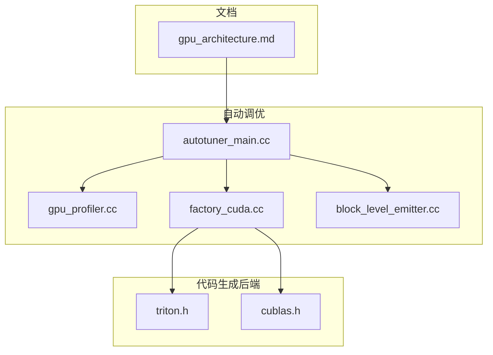
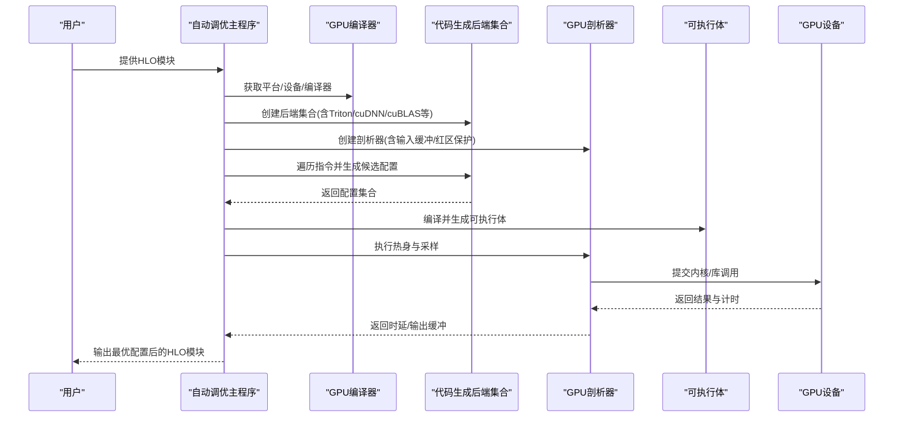
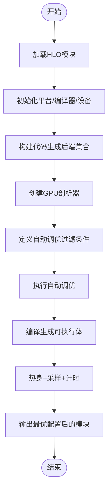
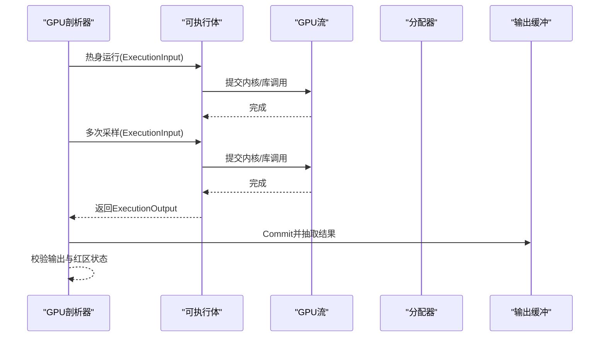
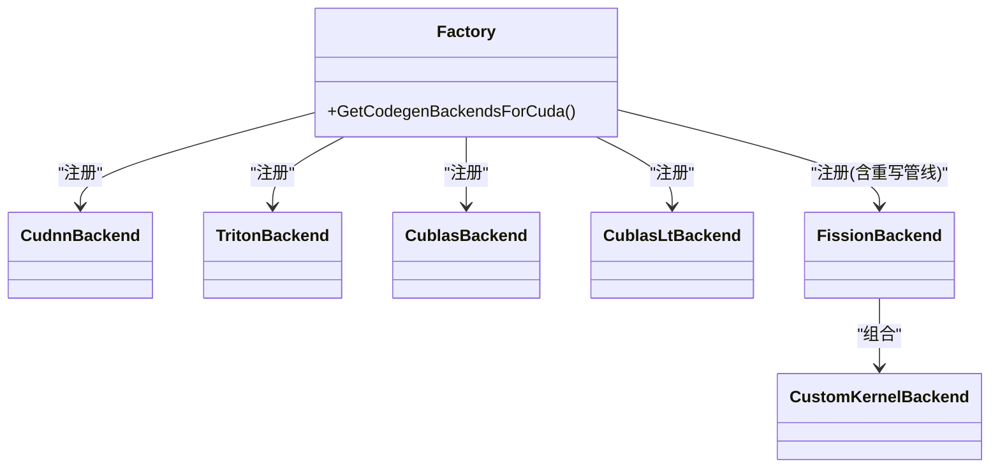
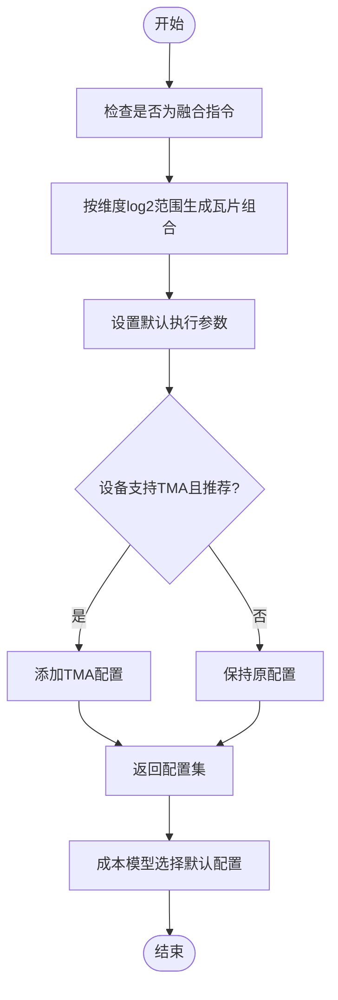
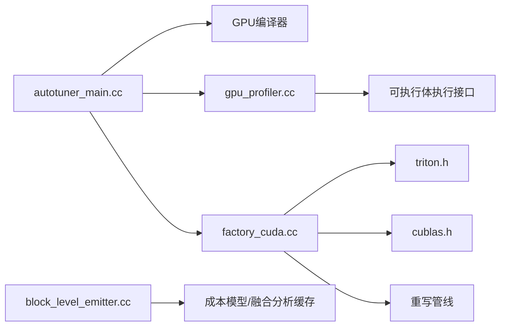

# GPU后端优化

<cite>
**本文引用的文件**
- [gpu_architecture.md](file://docs/gpu_architecture.md)
- [autotuner_main.cc](file://xla/backends/gpu/autotuner/autotuner_main.cc)
- [block_level_emitter.cc](file://xla/backends/gpu/autotuner/block_level_emitter.cc)
- [gpu_profiler.cc](file://xla/backends/gpu/autotuner/gpu_profiler.cc)
- [factory_cuda.cc](file://xla/backends/gpu/autotuner/factory_cuda.cc)
- [triton.h](file://xla/backends/gpu/autotuner/triton.h)
- [cublas.h](file://xla/backends/gpu/autotuner/cublas.h)
</cite>

## 目录
1. [简介](#简介)
2. [项目结构](#项目结构)
3. [核心组件](#核心组件)
4. [架构总览](#架构总览)
5. [详细组件分析](#详细组件分析)
6. [依赖关系分析](#依赖关系分析)
7. [性能考量](#性能考量)
8. [故障排查指南](#故障排查指南)
9. [结论](#结论)
10. [附录](#附录)

## 简介
本文件面向XLA GPU后端的优化与调优，系统梳理GPU特定优化技术（CUDA/HIP代码生成、内核调度、内存访问模式优化、SM利用率提升）、自动调优机制、共享内存管理、线程块配置、warp级并行策略、指令融合、寄存器使用优化以及内存层次结构利用，并提供性能分析工具与调优实践指南。内容基于仓库中的GPU流水线、自动调优框架、代码生成后端与性能剖析器等实现进行归纳总结。

## 项目结构
围绕GPU后端优化，本仓库的关键组织方式如下：
- 文档层：提供GPU体系结构概览与流水线说明，帮助理解从HLO到PTX/TritonIR的转换路径。
- 自动调优层：包含自动调优主程序、GPU剖析器、代码生成后端工厂与具体后端（如Triton、cuBLAS/cuDNN、Fission等）。
- 代码生成层：负责将HLO融合或算子映射到具体执行策略（库调用或自定义内核），并支持成本模型指导的配置选择。

**图表来源**
- [gpu_architecture.md](file://docs/gpu_architecture.md#L20-L254)
- [autotuner_main.cc](file://xla/backends/gpu/autotuner/autotuner_main.cc#L86-L169)
- [gpu_profiler.cc](file://xla/backends/gpu/autotuner/gpu_profiler.cc#L91-L115)
- [factory_cuda.cc](file://xla/backends/gpu/autotuner/factory_cuda.cc#L84-L136)
- [block_level_emitter.cc](file://xla/backends/gpu/autotuner/block_level_emitter.cc#L217-L308)
- [triton.h](file://xla/backends/gpu/autotuner/triton.h#L39-L76)
- [cublas.h](file://xla/backends/gpu/autotuner/cublas.h#L48-L73)

**章节来源**
- [gpu_architecture.md](file://docs/gpu_architecture.md#L20-L254)

## 核心组件
- 自动调优主程序：解析HLO模块、获取GPU编译器与设备信息、构建后端集合、创建剖析器与缓存、按条件筛选需要自动调优的算子并执行。
- GPU剖析器：封装设备输入输出缓冲区、执行热身与多次采样、收集计算时延、校验输出正确性与红区保护。
- 代码生成后端工厂：根据平台注册不同后端（cuDNN、Triton、cuBLAS、cuBLASLt、Fission等），并可按允许列表裁剪后端集合。
- 块级发射器（Block-Level Emitter）：针对融合指令生成候选配置（如输出瓦片大小、warp数、CTA数、流水线阶段、是否启用TMA），并可由成本模型给出默认配置。
- Triton后端：对点积/缩放点积等融合场景生成TritonIR并选择合适的tiling参数。
- cuBLAS后端：将GEMM映射为cuBLAS算法，支持F8场景下的cuBLAS Lt回退。

**章节来源**
- [autotuner_main.cc](file://xla/backends/gpu/autotuner/autotuner_main.cc#L86-L169)
- [gpu_profiler.cc](file://xla/backends/gpu/autotuner/gpu_profiler.cc#L132-L171)
- [factory_cuda.cc](file://xla/backends/gpu/autotuner/factory_cuda.cc#L84-L136)
- [block_level_emitter.cc](file://xla/backends/gpu/autotuner/block_level_emitter.cc#L217-L308)
- [triton.h](file://xla/backends/gpu/autotuner/triton.h#L39-L76)
- [cublas.h](file://xla/backends/gpu/autotuner/cublas.h#L48-L73)

## 架构总览
下图展示从HLO模块到GPU执行的整体流程，包括自动调优、代码生成后端选择、Triton/cuDNN/cuBLAS路径以及运行时执行与CUDA图提取。

**图表来源**
- [autotuner_main.cc](file://xla/backends/gpu/autotuner/autotuner_main.cc#L86-L169)
- [gpu_profiler.cc](file://xla/backends/gpu/autotuner/gpu_profiler.cc#L132-L171)
- [factory_cuda.cc](file://xla/backends/gpu/autotuner/factory_cuda.cc#L84-L136)
- [gpu_architecture.md](file://docs/gpu_architecture.md#L217-L254)

## 详细组件分析

### 组件A：自动调优主程序（autotuner_main）
- 职责：加载HLO模块、获取GPU平台与编译器、构造后端集合、创建剖析器与缓存、按条件筛选融合/库调用指令并执行自动调优。
- 关键逻辑：
  - 平台与编译器初始化，获取设备描述与别名信息。
  - 构建后端集合（优先cuDNN、其次Triton、再cuBLAS/cuBLASLt、最后Fission）。
  - 创建GPU剖析器（含流、分配器、红区缓冲）。
  - 定义自动调优条件：对特定库调用或未带配置的融合（如Triton GEMM、cuDNN融合、自定义融合）进行自动调优。
  - 调用通用自动调优器执行搜索与评估。

**图表来源**
- [autotuner_main.cc](file://xla/backends/gpu/autotuner/autotuner_main.cc#L86-L169)

**章节来源**
- [autotuner_main.cc](file://xla/backends/gpu/autotuner/autotuner_main.cc#L86-L169)

### 组件B：GPU剖析器（gpu_profiler）
- 职责：管理输入/输出缓冲（含红区保护）、执行热身与多次采样、收集计算时延、校验输出正确性。
- 关键逻辑：
  - 从程序形状创建输入缓冲，启用红区填充以检测越界写入。
  - 执行一次热身运行，随后进行多次采样以获得稳定时延。
  - 将执行选项（设备序号、流、分配器、剖析配置）传递给可执行体执行接口。
  - 对输出缓冲与参考缓冲逐叶形状比较，确保数值正确性。

**图表来源**
- [gpu_profiler.cc](file://xla/backends/gpu/autotuner/gpu_profiler.cc#L132-L171)
- [gpu_profiler.cc](file://xla/backends/gpu/autotuner/gpu_profiler.cc#L173-L189)
- [gpu_profiler.cc](file://xla/backends/gpu/autotuner/gpu_profiler.cc#L191-L205)
- [gpu_profiler.cc](file://xla/backends/gpu/autotuner/gpu_profiler.cc#L207-L226)

**章节来源**
- [gpu_profiler.cc](file://xla/backends/gpu/autotuner/gpu_profiler.cc#L132-L171)
- [gpu_profiler.cc](file://xla/backends/gpu/autotuner/gpu_profiler.cc#L173-L189)
- [gpu_profiler.cc](file://xla/backends/gpu/autotuner/gpu_profiler.cc#L191-L205)
- [gpu_profiler.cc](file://xla/backends/gpu/autotuner/gpu_profiler.cc#L207-L226)

### 组件C：代码生成后端工厂（factory_cuda）
- 职责：按平台注册不同代码生成后端，形成统一的后端集合；支持按允许列表裁剪后端。
- 关键逻辑：
  - 注册顺序固定：cuDNN、Triton、cuBLAS、cuBLASLt、Fission（cuBLAS+Fission、cuBLASLt+Fission、CustomKernel+Fission）。
  - 支持通过重写管线（如GemmRewriter、ScaledDotRewriter、CustomKernelFusionRewriter）对HLO进行预处理，以适配不同后端。
  - 可根据后端白名单裁剪最终后端集合。

**图表来源**
- [factory_cuda.cc](file://xla/backends/gpu/autotuner/factory_cuda.cc#L84-L136)

**章节来源**
- [factory_cuda.cc](file://xla/backends/gpu/autotuner/factory_cuda.cc#L84-L136)

### 组件D：块级发射器（block_level_emitter）
- 职责：为融合指令生成候选配置空间（输出瓦片大小、warp数、CTA数、流水线阶段、是否启用TMA），并可由成本模型给出默认配置。
- 关键逻辑：
  - 生成维度上以2为底的对数范围内的瓦片大小组合，跳过零尺寸维度。
  - 默认设置若干执行参数（如num_warps、num_ctas、num_stages、is_tma_allowed）。
  - 若设备支持TMA且推荐使用，则扩展配置集。
  - 成本模型：基于索引性能模型与融合分析缓存，尝试寻找最佳tiling并返回块级参数。

**图表来源**
- [block_level_emitter.cc](file://xla/backends/gpu/autotuner/block_level_emitter.cc#L217-L308)
- [block_level_emitter.cc](file://xla/backends/gpu/autotuner/block_level_emitter.cc#L310-L337)

**章节来源**
- [block_level_emitter.cc](file://xla/backends/gpu/autotuner/block_level_emitter.cc#L217-L308)
- [block_level_emitter.cc](file://xla/backends/gpu/autotuner/block_level_emitter.cc#L310-L337)

### 组件E：Triton后端（triton.h）
- 职责：对融合场景（尤其是点积/缩放点积）生成TritonIR，选择tiling参数，并可覆盖已有配置。
- 关键逻辑：
  - 派生自GPU代码生成基类，支持获取支持配置、默认配置与应用配置。
  - 可能产生错误结果（CanProduceWrongResults为真），需配合校验与重写管线使用。

**章节来源**
- [triton.h](file://xla/backends/gpu/autotuner/triton.h#L39-L76)

### 组件F：cuBLAS后端（cublas.h）
- 职责：将GEMM映射为cuBLAS算法，支持在F8场景下回退到cuBLASLt。
- 关键逻辑：
  - 派生自GPU代码生成基类，提供支持配置、默认配置与应用配置。
  - 内部可判断是否应使用cuBLASLt（例如针对F8矩阵乘）。

**章节来源**
- [cublas.h](file://xla/backends/gpu/autotuner/cublas.h#L48-L73)

## 依赖关系分析
- 自动调优主程序依赖GPU编译器、平台管理器、剖析器与后端集合；后端集合由工厂创建，包含多种代码生成策略。
- 剖析器依赖设备分配器、流、红区缓冲与可执行体执行接口。
- 后端工厂依赖重写管线（如GemmRewriter、ScaledDotRewriter、CustomKernelFusionRewriter）以适配不同后端。
- 块级发射器依赖设备能力（如TMA可用性）、成本模型与融合分析缓存。

**图表来源**
- [autotuner_main.cc](file://xla/backends/gpu/autotuner/autotuner_main.cc#L86-L169)
- [factory_cuda.cc](file://xla/backends/gpu/autotuner/factory_cuda.cc#L84-L136)
- [block_level_emitter.cc](file://xla/backends/gpu/autotuner/block_level_emitter.cc#L310-L337)
- [gpu_profiler.cc](file://xla/backends/gpu/autotuner/gpu_profiler.cc#L173-L189)

**章节来源**
- [autotuner_main.cc](file://xla/backends/gpu/autotuner/autotuner_main.cc#L86-L169)
- [factory_cuda.cc](file://xla/backends/gpu/autotuner/factory_cuda.cc#L84-L136)
- [block_level_emitter.cc](file://xla/backends/gpu/autotuner/block_level_emitter.cc#L310-L337)
- [gpu_profiler.cc](file://xla/backends/gpu/autotuner/gpu_profiler.cc#L173-L189)

## 性能考量
- 指令融合：通过融合避免中间张量写回高带宽内存（HBM），减少访存开销，提高吞吐。
- 瓦片与线程块配置：块级发射器在log2范围内探索输出瓦片大小、warp数、流水线阶段与CTA数，结合成本模型选择最优配置。
- SM利用率与流水线：通过合理设置num_stages与num_warps，提升SM占用率与并发度；在支持TMA的设备上启用TMA以优化全局内存访问。
- 寄存器与共享内存：融合与瓦片设计需平衡寄存器压力与共享内存使用；对共享内存访问进行coalescing与bank冲突规避。
- 库调用与自定义内核：对常见算子优先使用cuBLAS/cuDNN等成熟库；复杂融合场景采用Triton生成高性能内核。
- 运行时与CUDA图：运行时IR支持CUDA图提取，有助于降低启动开销与提升连续内核的执行效率。

[本节为通用性能讨论，不直接分析具体文件]

## 故障排查指南
- 红区保护与越界检测：剖析器在创建输入缓冲时启用红区填充，执行后检查红区状态，若修改则报错并输出失败信息，便于定位越界写入。
- 输出一致性校验：对输出缓冲与参考缓冲逐叶形状进行数值比较，不一致时返回错误，辅助验证自动调优结果的正确性。
- 设备锁与并发控制：剖析器要求独占GPU锁，避免其他任务干扰自动调优过程。
- 自动调优开关：可通过调试选项禁用二进制库自动调优、关闭非确定性操作或调整自动调优级别，以定位问题或加速迭代。

**章节来源**
- [gpu_profiler.cc](file://xla/backends/gpu/autotuner/gpu_profiler.cc#L191-L205)
- [gpu_profiler.cc](file://xla/backends/gpu/autotuner/gpu_profiler.cc#L207-L226)
- [autotuner_main.cc](file://xla/backends/gpu/autotuner/autotuner_main.cc#L138-L142)

## 结论
XLA GPU后端通过“HLO优化—自动调优—代码生成—运行时执行”的完整链路，在融合、库调用与自定义内核之间动态选择最优策略。自动调优主程序与剖析器提供了可靠的评估与验证手段；块级发射器与成本模型指导瓦片与线程块配置；工厂模式整合了cuDNN、Triton、cuBLAS/cuBLASLt与Fission等多后端能力。结合红区保护与输出一致性校验，可在保证正确性的前提下持续优化性能。

[本节为总结性内容，不直接分析具体文件]

## 附录
- GPU流水线与文档参考：可参阅GPU架构文档，了解从HLO到PTX/TritonIR的转换路径与运行时IR/CUDA图集成。

**章节来源**
- [gpu_architecture.md](file://docs/gpu_architecture.md#L217-L254)