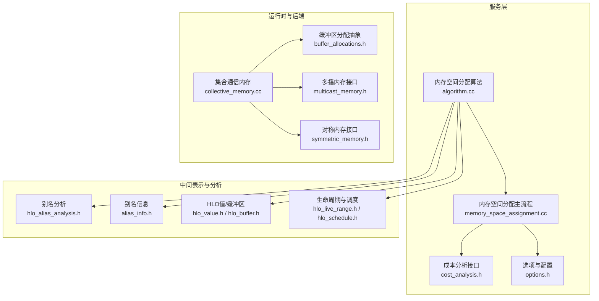
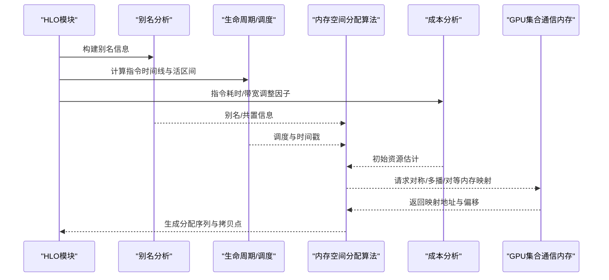
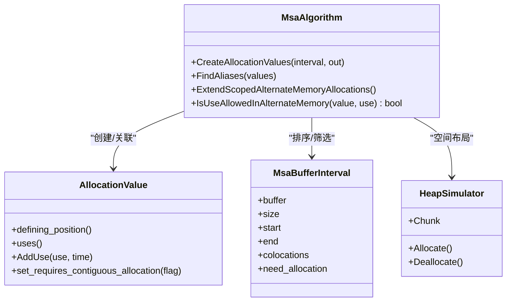
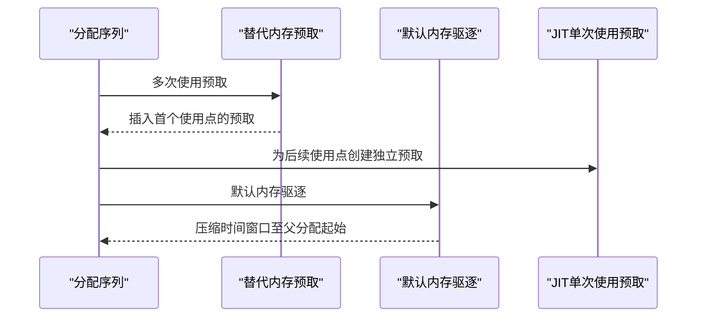
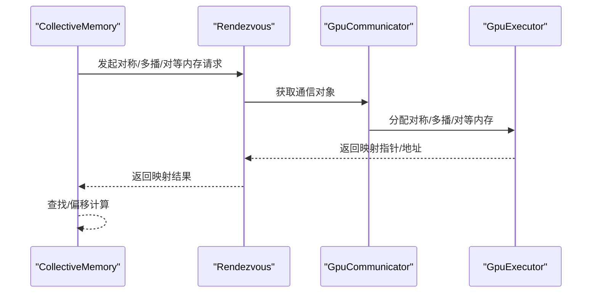
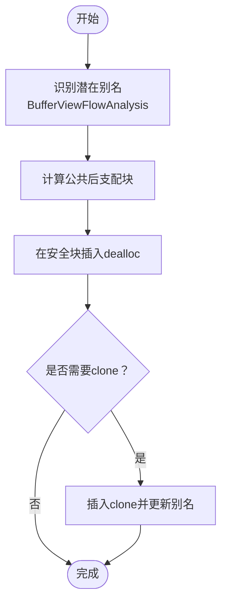
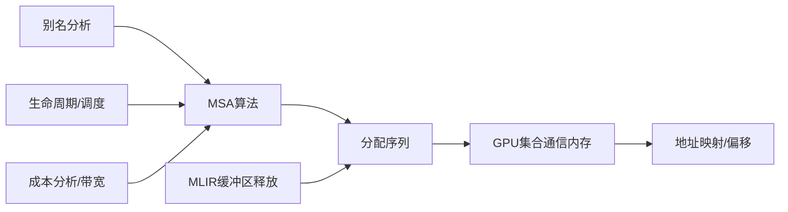

# 内存空间优化

<cite>
**本文引用的文件**
- [xla/service/memory_space_assignment/algorithm.cc](file://xla/service/memory_space_assignment/algorithm.cc)
- [xla/service/memory_space_assignment/memory_space_assignment.cc](file://xla/service/memory_space_assignment/memory_space_assignment.cc)
- [xla/backends/gpu/runtime/collective_memory.cc](file://xla/backends/gpu/runtime/collective_memory.cc)
- [xla/mlir_hlo/deallocation/transforms/buffer_deallocation.cc](file://xla/mlir_hlo/deallocation/transforms/buffer_deallocation.cc)
- [xla/hlo/transforms/memory_space_propagation.cc](file://xla/hlo/transforms/memory_space_propagation.cc)
- [xla/service/memory_space_assignment/cost_analysis.h](file://xla/service/memory_space_assignment/cost_analysis.h)
- [xla/service/memory_space_assignment/options.h](file://xla/service/memory_space_assignment/options.h)
- [xla/service/memory_space_assignment/allocation.h](file://xla/service/memory_space_assignment/allocation.h)
- [xla/service/memory_space_assignment/utils.h](file://xla/service/memory_space_assignment/utils.h)
- [xla/service/memory_space_assignment/buffer_interval_comparator.h](file://xla/service/memory_space_assignment/buffer_interval_comparator.h)
- [xla/service/memory_space_assignment/memory_bound_loop_optimizer.h](file://xla/service/memory_space_assignment/memory_bound_loop_optimizer.h)
- [xla/service/memory_space_assignment/repacking.h](file://xla/service/memory_space_assignment/repacking.h)
- [xla/service/memory_space_assignment/tuning_utils.h](file://xla/service/memory_space_assignment/tuning_utils.h)
- [xla/service/memory_space_assignment/slice.h](file://xla/service/memory_space_assignment/slice.h)
- [xla/service/memory_space_assignment/allocation_value.h](file://xla/service/memory_space_assignment/allocation_value.h)
- [xla/service/heap_simulator/heap_simulator.h](file://xla/service/heap_simulator/heap_simulator.h)
- [xla/service/heap_simulator/allocation_block.h](file://xla/service/heap_simulator/allocation_block.h)
- [xla/service/buffer_value.h](file://xla/service/buffer_value.h)
- [xla/service/hlo_buffer.h](file://xla/service/hlo_buffer.h)
- [xla/service/hlo_value.h](file://xla/service/hlo_value.h)
- [xla/hlo/analysis/hlo_alias_analysis.h](file://xla/hlo/analysis/hlo_alias_analysis.h)
- [xla/hlo/analysis/alias_info.h](file://xla/hlo/analysis/alias_info.h)
- [xla/hlo/ir/hlo_instruction.h](file://xla/hlo/ir/hlo_instruction.h)
- [xla/hlo/ir/hlo_opcode.h](file://xla/hlo/ir/hlo_opcode.h)
- [xla/hlo/ir/hlo_schedule.h](file://xla/hlo/ir/hlo_schedule.h)
- [xla/hlo/utils/hlo_live_range.h](file://xla/hlo/utils/hlo_live_range.h)
- [xla/service/gpu/buffer_allocations.h](file://xla/service/gpu/buffer_allocations.h)
- [xla/stream_executor/gpu/multicast_memory.h](file://xla/stream_executor/gpu/multicast_memory.h)
- [xla/core/collectives/symmetric_memory.h](file://xla/core/collectives/symmetric_memory.h)
- [xla/backends/gpu/collectives/gpu_communicator.h](file://xla/backends/gpu/collectives/gpu_communicator.h)
- [xla/backends/gpu/runtime/collective_cliques.h](file://xla/backends/gpu/runtime/collective_cliques.h)
- [xla/backends/gpu/runtime/collective_params.h](file://xla/backends/gpu/runtime/collective_params.h)
- [xla/backends/gpu/runtime/collective_memory_requests.h](file://xla/backends/gpu/runtime/collective_memory_requests.h)
- [xla/backends/gpu/collectives/gpu_clique_key.h](file://xla/backends/gpu/collectives/gpu_clique_key.h)
- [xla/backends/gpu/runtimes/…/all_to_all_thunk.cc](file://xla/backends/gpu/runtimes/…/all_to_all_thunk.cc)
- [xla/backends/gpu/runtimes/…/buffers_checksum_thunk_test.cc](file://xla/backends/gpu/runtimes/…/buffers_checksum_thunk_test.cc)
- [xla/backends/gpu/runtimes/…/buffers_float_check_thunk_test.cc](file://xla/backends/gpu/runtimes/…/buffers_float_check_thunk_test.cc)
- [xla/backends/gpu/runtimes/…/collective_kernel_thunk_test.cc](file://xla/backends/gpu/runtimes/…/collective_kernel_thunk_test.cc)
- [xla/backends/gpu/host_offloading/gpu_host_offloading_allocator.cc](file://xla/backends/gpu/host_offloading/gpu_host_offloading_allocator.cc)
- [xla/backends/gpu/collectives/gpu_collectives_test.cc](file://xla/backends/gpu/collectives/gpu_collectives_test.cc)
- [xla/backends/autotuner/file_based_autotuner_cache.cc](file://xla/backends/autotuner/file_based_autotuner_cache.cc)
- [xla/backends/profiler/gpu/cupti_collector.cc](file://xla/backends/profiler/gpu/cupti_collector.cc)
- [xla/backends/profiler/gpu/rocm_collector.cc](file://xla/backends/profiler/gpu/rocm_collector.cc)
- [xla/hlo/transforms/simplifiers/hlo_rematerialization.cc](file://xla/hlo/transforms/simplifiers/hlo_rematerialization.cc)
- [xla/service/gpu/autotuning/autotune_cache_key.cc](file://xla/service/gpu/autotuning/autotune_cache_key.cc)
- [xla/service/gpu/gpu_compiler.cc](file://xla/service/gpu/gpu_compiler.cc)
- [xla/service/cpu/dot_op_emitter.cc](file://xla/service/cpu/dot_op_emitter.cc)
- [xla/service/gpu/alias_info_test.cc](file://xla/service/gpu/alias_info_test.cc)
- [xla/service/gpu/gpu_memory_space_assignment.cc](file://xla/service/gpu/gpu_memory_space_assignment.cc)
- [xla/service/memory_space_assignment/algorithm.cc](file://xla/service/memory_space_assignment/algorithm.cc)
- [xla/service/memory_space_assignment/memory_space_assignment.cc](file://xla/service/memory_space_assignment/memory_space_assignment.cc)
- [xla/backends/gpu/runtime/collective_memory.cc](file://xla/backends/gpu/runtime/collective_memory.cc)
- [xla/mlir_hlo/deallocation/transforms/buffer_deallocation.cc](file://xla/mlir_hlo/deallocation/transforms/buffer_deallocation.cc)
</cite>

## 目录
1. [引言](#引言)
2. [项目结构](#项目结构)
3. [核心组件](#核心组件)
4. [架构总览](#架构总览)
5. [详细组件分析](#详细组件分析)
6. [依赖关系分析](#依赖关系分析)
7. [性能考量](#性能考量)
8. [故障排查指南](#故障排查指南)
9. [结论](#结论)
10. [附录](#附录)

## 引言
本文件围绕XLA在GPU与CPU后端上的内存空间分配优化进行系统化梳理，重点覆盖以下方面：
- 内存空间分配算法：基于生命周期与别名分析的堆模拟器、最佳适配与空间布局策略、跨程序预取与异步复制资源管理。
- 缓冲区绑定策略：全局内存、共享内存、寄存器等不同内存域的分配原则与绑定规则；跨设备/进程的对称/多播/对等内存映射。
- 内存层次结构优化：通过内存空间传播、重计算（重利用）与打包（repacking）降低带宽压力与碎片化。
- 访问模式与数据局部性：指令成本分析、内存带宽限制识别、循环内存瓶颈优化。
- 工具与检测：内存使用分析、内存泄漏检测与定位方法。

## 项目结构
XLA的内存空间优化涉及多个层次：
- 高层调度与内存空间分配：服务层的内存空间分配算法与调度集成。
- 中间表示与别名/生命周期分析：HLO与MLIR层的别名信息、缓冲区值与缓冲区图。
- 运行时与后端：GPU运行时的集合通信内存（对称/多播/对等）、主机内存池与传输管理。
- 自动调优与性能分析：设备带宽、成本分析与缓存键生成。

**图表来源**
- [xla/service/memory_space_assignment/algorithm.cc](file://xla/service/memory_space_assignment/algorithm.cc#L1-L8293)
- [xla/service/memory_space_assignment/memory_space_assignment.cc](file://xla/service/memory_space_assignment/memory_space_assignment.cc#L1-L1620)
- [xla/hlo/analysis/hlo_alias_analysis.h](file://xla/hlo/analysis/hlo_alias_analysis.h)
- [xla/hlo/analysis/alias_info.h](file://xla/hlo/analysis/alias_info.h)
- [xla/hlo/ir/hlo_value.h](file://xla/hlo/ir/hlo_value.h)
- [xla/hlo/ir/hlo_buffer.h](file://xla/hlo/ir/hlo_buffer.h)
- [xla/hlo/utils/hlo_live_range.h](file://xla/hlo/utils/hlo_live_range.h)
- [xla/backends/gpu/runtime/collective_memory.cc](file://xla/backends/gpu/runtime/collective_memory.cc#L1-L583)
- [xla/service/gpu/buffer_allocations.h](file://xla/service/gpu/buffer_allocations.h)
- [xla/stream_executor/gpu/multicast_memory.h](file://xla/stream_executor/gpu/multicast_memory.h)
- [xla/core/collectives/symmetric_memory.h](file://xla/core/collectives/symmetric_memory.h)

**章节来源**
- [xla/service/memory_space_assignment/algorithm.cc](file://xla/service/memory_space_assignment/algorithm.cc#L1-L8293)
- [xla/service/memory_space_assignment/memory_space_assignment.cc](file://xla/service/memory_space_assignment/memory_space_assignment.cc#L1-L1620)
- [xla/backends/gpu/runtime/collective_memory.cc](file://xla/backends/gpu/runtime/collective_memory.cc#L1-L583)

## 核心组件
- 内存空间分配算法（MSA）
  - 基于堆模拟器的空间布局与碎片化控制，支持按空间优先级与大小排序的最佳适配策略。
  - 支持跨程序预取（cross-program prefetch）与异步复制资源的初始资源估计。
  - 对While/条件等控制流进行特殊处理，避免在替代内存中分配无法驻留的缓冲区。
- 内存空间分配主流程
  - 将HLO值拆分为AllocationValue，建立使用关系与别名，插入CopyStart/CopyDone以实现异步迁移。
  - 处理从替代内存到默认内存的即时驱逐（eviction），以及替代内存中的单次使用即时预取。
- GPU集合通信内存
  - 提供对称内存（SymmetricMemory）、多播内存（MulticastMemory）与对等内存（PeerMemory）的统一寻址与映射。
  - 通过本地Rendezvous协调所有参与设备，确保一致顺序与无死锁的内存分配与映射。
- MLIR缓冲区释放
  - 基于BufferViewFlowAnalysis识别潜在别名，计算安全的dealloc位置，并在必要时引入clone以保证正确性与完整性。

**章节来源**
- [xla/service/memory_space_assignment/algorithm.cc](file://xla/service/memory_space_assignment/algorithm.cc#L400-L8293)
- [xla/service/memory_space_assignment/memory_space_assignment.cc](file://xla/service/memory_space_assignment/memory_space_assignment.cc#L137-L200)
- [xla/backends/gpu/runtime/collective_memory.cc](file://xla/backends/gpu/runtime/collective_memory.cc#L209-L583)
- [xla/mlir_hlo/deallocation/transforms/buffer_deallocation.cc](file://xla/mlir_hlo/deallocation/transforms/buffer_deallocation.cc#L1-L200)

## 架构总览
XLA内存空间优化的整体流程如下：
- 输入：HLO模块、别名分析、生命周期与调度、设备描述（含带宽信息）。
- 处理：内存空间分配算法根据成本分析与指令时间线估计异步复制资源，决定缓冲区在默认或替代内存中的区间与拷贝点。
- 输出：包含分配区间、拷贝开始/结束、别名与共置信息的最终分配序列；同时在GPU后端生成集合通信内存映射。

**图表来源**
- [xla/service/memory_space_assignment/algorithm.cc](file://xla/service/memory_space_assignment/algorithm.cc#L444-L487)
- [xla/backends/gpu/runtime/collective_memory.cc](file://xla/backends/gpu/runtime/collective_memory.cc#L500-L583)

**章节来源**
- [xla/service/memory_space_assignment/algorithm.cc](file://xla/service/memory_space_assignment/algorithm.cc#L400-L8293)
- [xla/backends/gpu/runtime/collective_memory.cc](file://xla/backends/gpu/runtime/collective_memory.cc#L1-L583)

## 详细组件分析

### 组件A：内存空间分配算法（MSA）
- 关键职责
  - 建立缓冲区区间（MsaBufferInterval），考虑别名与共置，按空间优先级与大小排序。
  - 创建AllocationValue并关联使用点，处理异步操作开始/结束的连续性约束。
  - 识别用户标注或候选的跨程序预取，按比较器排序后优先分配。
  - 扩展作用域分配（scoped allocation）以合并空闲块，减少碎片。
- 数据结构与复杂度
  - 堆模拟器Chunk/Interval管理：时间维度上维护占用与空闲区间，支持对齐与扩展。
  - 别名与共置：通过别名分析与数据流分析构建邻接关系，降低冲突。
  - 时间复杂度：主要受缓冲区数量与指令数影响，区间排序与堆模拟器操作为O(N log N)到O(N^2)，取决于具体实现细节。
- 优化策略
  - 空间优先级：已标注在替代内存的区间优先分配。
  - 成本驱动：结合成本分析与异步指令的带宽调整因子，动态调整初始资源。
  - 控制流处理：While/条件等结构内不将可能被驱逐的缓冲区放入替代内存。

**图表来源**
- [xla/service/memory_space_assignment/algorithm.cc](file://xla/service/memory_space_assignment/algorithm.cc#L489-L585)
- [xla/service/memory_space_assignment/algorithm.cc](file://xla/service/memory_space_assignment/algorithm.cc#L587-L637)
- [xla/service/memory_space_assignment/algorithm.cc](file://xla/service/memory_space_assignment/algorithm.cc#L639-L734)
- [xla/service/heap_simulator/heap_simulator.h](file://xla/service/heap_simulator/heap_simulator.h)

**章节来源**
- [xla/service/memory_space_assignment/algorithm.cc](file://xla/service/memory_space_assignment/algorithm.cc#L489-L734)

### 组件B：内存空间分配主流程与异步复制
- 关键职责
  - 将HLO值拆分为AllocationValue，建立使用关系与别名，插入CopyStart/CopyDone以实现异步迁移。
  - 处理从替代内存到默认内存的即时驱逐（eviction），以及替代内存中的单次使用即时预取。
- 流程要点
  - JIT单次使用预取：将后续多次使用的预取拆分为针对每个首次使用的独立预取，减少冗余。
  - 即时驱逐：对于在默认内存中的驱逐，将其时间窗口压缩至父分配的起始时刻，避免额外驻留。

**图表来源**
- [xla/service/memory_space_assignment/memory_space_assignment.cc](file://xla/service/memory_space_assignment/memory_space_assignment.cc#L137-L200)

**章节来源**
- [xla/service/memory_space_assignment/memory_space_assignment.cc](file://xla/service/memory_space_assignment/memory_space_assignment.cc#L137-L200)

### 组件C：GPU集合通信内存（对称/多播/对等）
- 关键职责
  - 在同一进程中通过Rendezvous协调所有参与设备，按确定顺序分配对称/多播/对等内存，并建立地址映射。
  - 提供按设备/分配索引查找映射地址与偏移的能力，支持范围映射与对等地址查询。
- 优化与注意事项
  - 合并相邻分配、缓存对称内存以减少重复分配开销（注释中给出优化建议）。
  - 多进程模式下对多播与对等内存的支持有限制，需确保在同一进程内执行。

**图表来源**
- [xla/backends/gpu/runtime/collective_memory.cc](file://xla/backends/gpu/runtime/collective_memory.cc#L209-L583)

**章节来源**
- [xla/backends/gpu/runtime/collective_memory.cc](file://xla/backends/gpu/runtime/collective_memory.cc#L209-L583)

### 组件D：MLIR缓冲区释放与别名处理
- 关键职责
  - 基于BufferViewFlowAnalysis识别潜在别名，计算安全的dealloc位置。
  - 在必要时引入clone以消除别名，确保所有缓冲区最终都能被释放。
- 流程要点
  - 遍历分支与块参数，收集所有潜在别名，找到公共后支配块作为释放点。
  - 支持结构化控制流循环，但显式控制流循环当前不完全支持。

**图表来源**
- [xla/mlir_hlo/deallocation/transforms/buffer_deallocation.cc](file://xla/mlir_hlo/deallocation/transforms/buffer_deallocation.cc#L1-L200)

**章节来源**
- [xla/mlir_hlo/deallocation/transforms/buffer_deallocation.cc](file://xla/mlir_hlo/deallocation/transforms/buffer_deallocation.cc#L1-L200)

### 组件E：内存空间传播与绑定
- 关键职责
  - 将HLO指令的内存空间布局传播到其操作数，结合别名分析与形状信息，形成一致的内存域绑定。
  - 支持用户标注与启发式策略，结合成本分析与排序规则进行优化。
- 与MSA的关系
  - 内存空间传播为MSA提供初始布局建议与排序依据，MSA在此基础上进一步细化分配与拷贝点。

**章节来源**
- [xla/hlo/transforms/memory_space_propagation.cc](file://xla/hlo/transforms/memory_space_propagation.cc)

## 依赖关系分析
- 组件耦合
  - MSA依赖别名分析、生命周期与调度、成本分析与设备描述（带宽）。
  - GPU集合通信内存依赖缓冲区分配抽象、通信器与GPU执行器。
  - MLIR缓冲区释放依赖BufferViewFlowAnalysis与Liveness分析。
- 外部依赖
  - 设备带宽、成本分析函数、异步指令带宽调整因子等外部输入影响分配决策。
- 循环与控制流
  - While/条件等结构对替代内存分配有约束，避免在循环体内分配无法驻留的缓冲区。

**图表来源**
- [xla/service/memory_space_assignment/algorithm.cc](file://xla/service/memory_space_assignment/algorithm.cc#L444-L487)
- [xla/backends/gpu/runtime/collective_memory.cc](file://xla/backends/gpu/runtime/collective_memory.cc#L500-L583)
- [xla/mlir_hlo/deallocation/transforms/buffer_deallocation.cc](file://xla/mlir_hlo/deallocation/transforms/buffer_deallocation.cc#L1-L200)

**章节来源**
- [xla/service/memory_space_assignment/algorithm.cc](file://xla/service/memory_space_assignment/algorithm.cc#L444-L487)
- [xla/backends/gpu/runtime/collective_memory.cc](file://xla/backends/gpu/runtime/collective_memory.cc#L500-L583)
- [xla/mlir_hlo/deallocation/transforms/buffer_deallocation.cc](file://xla/mlir_hlo/deallocation/transforms/buffer_deallocation.cc#L1-L200)

## 性能考量
- 带宽与成本
  - 设备带宽与指令成本分析用于估计初始资源与异步复制的重叠影响，避免过度并发导致带宽争用。
  - 循环内存瓶颈优化（MemoryBoundLoopOptimizer）可识别并优化内存带宽受限的循环。
- 数据局部性与访问模式
  - 通过内存空间传播与重计算（重利用）减少全局内存访问次数，提升数据局部性。
  - 对于GEMV等低数据复用场景，应关注内存带宽瓶颈并采用合适的分块/布局策略。
- 碎片化与对齐
  - 堆模拟器与对齐函数确保分配按边界对齐，扩展作用域分配以合并空闲块，降低碎片化。

**章节来源**
- [xla/service/memory_space_assignment/memory_bound_loop_optimizer.h](file://xla/service/memory_space_assignment/memory_bound_loop_optimizer.h)
- [xla/service/memory_space_assignment/algorithm.cc](file://xla/service/memory_space_assignment/algorithm.cc#L105-L107)
- [xla/service/memory_space_assignment/algorithm.cc](file://xla/service/memory_space_assignment/algorithm.cc#L639-L734)
- [xla/service/cpu/dot_op_emitter.cc](file://xla/service/cpu/dot_op_emitter.cc#L490)

## 故障排查指南
- 内存泄漏检测
  - MLIR缓冲区释放Pass会在必要时引入clone以避免内存泄漏，若发现异常，检查是否存在未处理的别名或控制流循环。
  - 在分布式测试中存在已知的非优雅退出导致的内存泄漏提示，需确保正常关闭与资源回收。
- 集合通信内存问题
  - 多进程模式下多播与对等内存不受支持，需确保在同一进程内执行。
  - 若出现地址映射失败，检查缓冲区分配索引与偏移计算逻辑。
- 性能分析
  - 使用设备侧Profiler（如CUPTI/ROCm）采集内存带宽指标，结合成本分析与缓存键生成，定位瓶颈。

**章节来源**
- [xla/mlir_hlo/deallocation/transforms/buffer_deallocation.cc](file://xla/mlir_hlo/deallocation/transforms/buffer_deallocation.cc#L323-L560)
- [xla/backends/gpu/runtime/collective_memory.cc](file://xla/backends/gpu/runtime/collective_memory.cc#L297-L303)
- [xla/backends/gpu/runtime/collective_memory.cc](file://xla/backends/gpu/runtime/collective_memory.cc#L437-L443)
- [xla/backends/profiler/gpu/cupti_collector.cc](file://xla/backends/profiler/gpu/cupti_collector.cc#L559)
- [xla/backends/profiler/gpu/rocm_collector.cc](file://xla/backends/profiler/gpu/rocm_collector.cc#L433)

## 结论
XLA的内存空间优化通过“内存空间分配算法+集合通信内存+MLIR缓冲区释放”的协同，实现了在多内存域（默认/替代）与多设备/进程环境下的高效分配与访问。关键优化点包括：
- 基于成本分析与异步复制资源估计的分配策略；
- 跨程序预取与即时驱逐/预取的精细化控制；
- 集合通信内存的统一映射与偏移计算；
- 别名与生命周期分析保障释放正确性与完整性。

建议在实际部署中结合设备带宽、指令成本与访问模式进行调优，并使用提供的分析与检测工具持续监控内存使用与带宽利用率。

## 附录
- 相关文件路径与用途概览
  - 内存空间分配算法与主流程：[algorithm.cc](file://xla/service/memory_space_assignment/algorithm.cc)、[memory_space_assignment.cc](file://xla/service/memory_space_assignment/memory_space_assignment.cc)
  - 成本分析与选项：[cost_analysis.h](file://xla/service/memory_space_assignment/cost_analysis.h)、[options.h](file://xla/service/memory_space_assignment/options.h)
  - GPU集合通信内存：[collective_memory.cc](file://xla/backends/gpu/runtime/collective_memory.cc)
  - MLIR缓冲区释放：[buffer_deallocation.cc](file://xla/mlir_hlo/deallocation/transforms/buffer_deallocation.cc)
  - HLO内存空间传播：[memory_space_propagation.cc](file://xla/hlo/transforms/memory_space_propagation.cc)
  - 其他辅助：[allocation.h](file://xla/service/memory_space_assignment/allocation.h)、[allocation_value.h](file://xla/service/memory_space_assignment/allocation_value.h)、[heap_simulator.h](file://xla/service/heap_simulator/heap_simulator.h)、[buffer_interval_comparator.h](file://xla/service/memory_space_assignment/buffer_interval_comparator.h)、[repacking.h](file://xla/service/memory_space_assignment/repacking.h)、[tuning_utils.h](file://xla/service/memory_space_assignment/tuning_utils.h)、[slice.h](file://xla/service/memory_space_assignment/slice.h)、[utils.h](file://xla/service/memory_space_assignment/utils.h)