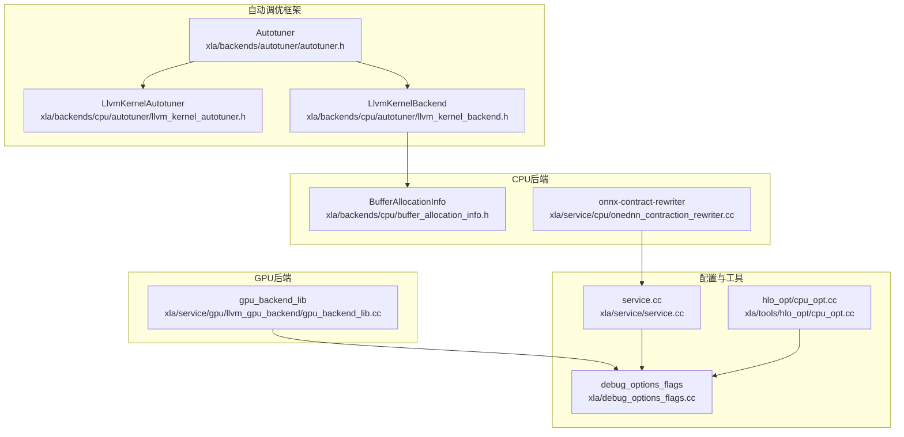
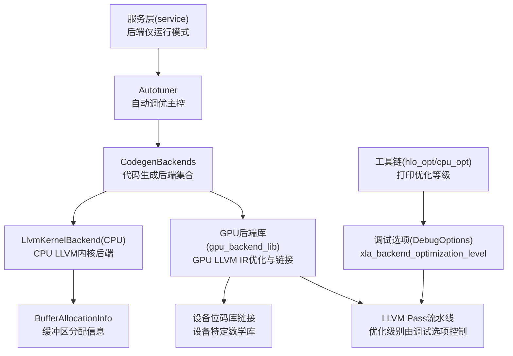
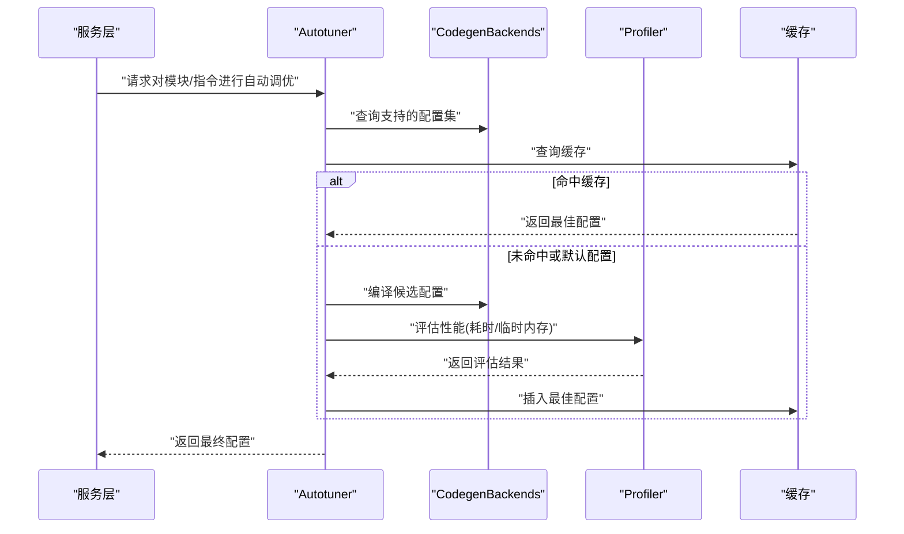
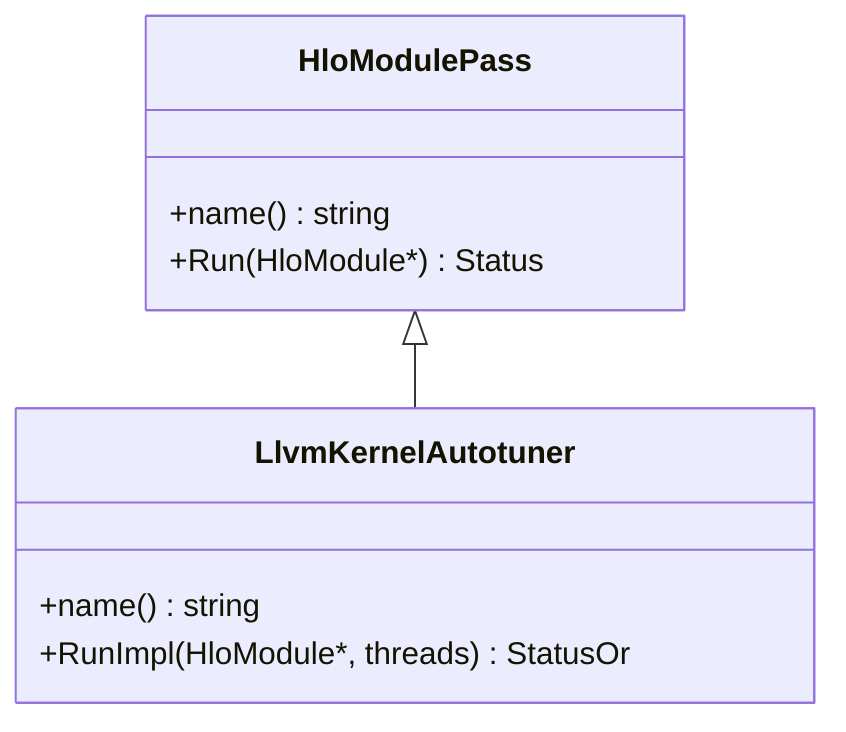
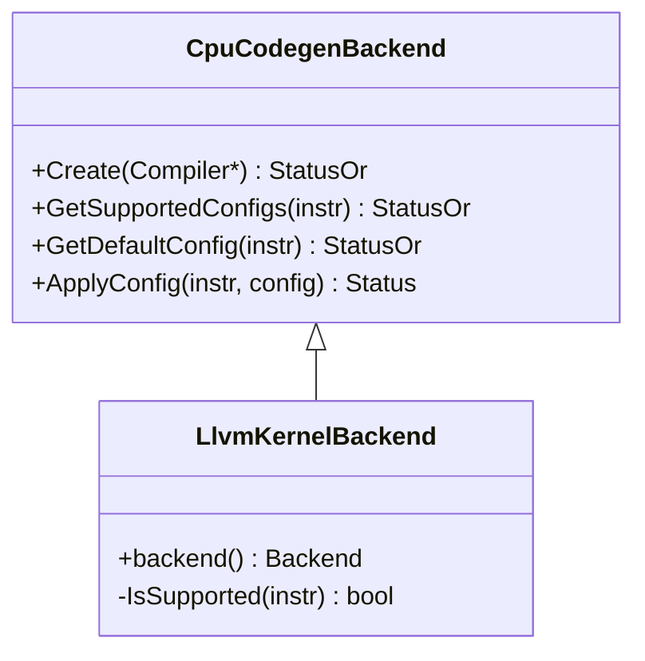
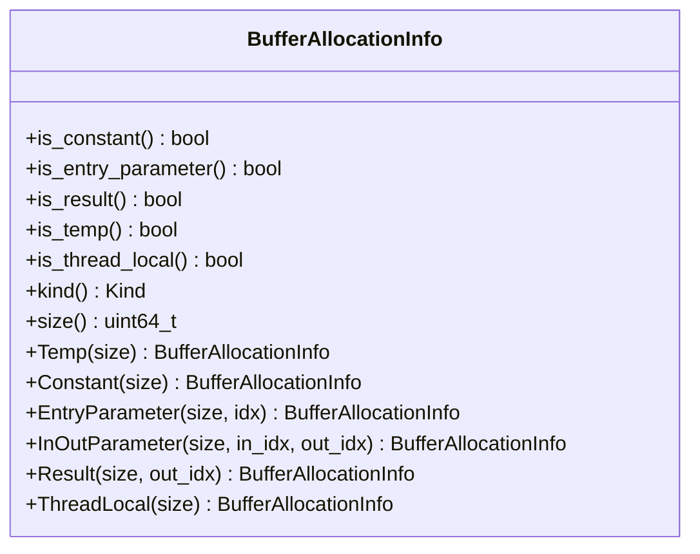
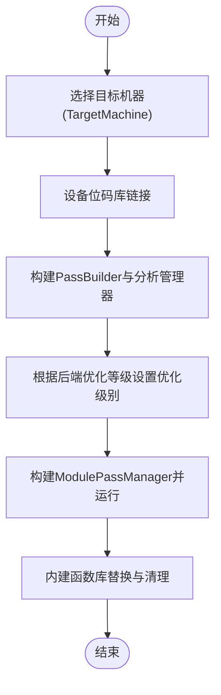
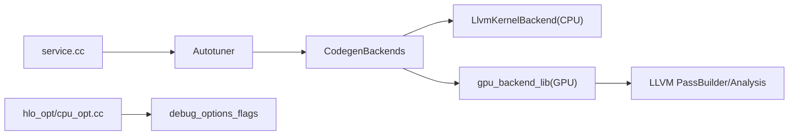

# 后端优化

<cite>
**本文引用的文件**
- [xla/backends/autotuner/autotuner.h](file://xla/backends/autotuner/autotuner.h)
- [xla/backends/cpu/autotuner/llvm_kernel_autotuner.h](file://xla/backends/cpu/autotuner/llvm_kernel_autotuner.h)
- [xla/backends/cpu/autotuner/llvm_kernel_backend.h](file://xla/backends/cpu/autotuner/llvm_kernel_backend.h)
- [xla/backends/cpu/buffer_allocation_info.h](file://xla/backends/cpu/buffer_allocation_info.h)
- [xla/service/gpu/llvm_gpu_backend/gpu_backend_lib.cc](file://xla/service/gpu/llvm_gpu_backend/gpu_backend_lib.cc)
- [xla/debug_options_flags.cc](file://xla/debug_options_flags.cc)
- [xla/service/service.cc](file://xla/service/service.cc)
- [xla/tools/hlo_opt/cpu_opt.cc](file://xla/tools/hlo_opt/cpu_opt.cc)
- [xla/service/cpu/onednn_contraction_rewriter.cc](file://xla/service/cpu/onednn_contraction_rewriter.cc)
</cite>

## 目录
1. [引言](#引言)
2. [项目结构](#项目结构)
3. [核心组件](#核心组件)
4. [架构总览](#架构总览)
5. [详细组件分析](#详细组件分析)
6. [依赖关系分析](#依赖关系分析)
7. [性能考量](#性能考量)
8. [故障排查指南](#故障排查指南)
9. [结论](#结论)
10. [附录](#附录)

## 引言
本文件面向XLA后端优化系统，聚焦CPU与GPU后端的优化技术与实现细节，涵盖内存布局优化、并行化策略、设备特定指令调度、内存空间分配与缓冲区绑定、数据传输优化、性能调优方法与硬件特性利用策略，并提供后端扩展接口与新硬件平台支持的开发指南。内容基于仓库中实际源码进行分析，配合图示帮助读者建立从高层到代码级的完整认知。

## 项目结构
XLA后端优化相关的关键目录与文件如下：
- 自动调优框架：xla/backends/autotuner 及其子模块（CPU侧的llvm_kernel_autotuner与llvm_kernel_backend）
- CPU后端：xla/backends/cpu 下的缓冲区分配信息与CPU侧自动调优器
- GPU后端：xla/service/gpu/llvm_gpu_backend 下的GPU后端库与LLVM IR优化流程
- 调试选项：xla/debug_options_flags.cc 中的后端优化等级开关
- 服务层集成：xla/service/service.cc 的后端仅运行模式与HLO后优化阶段
- 工具链：xla/tools/hlo_opt/cpu_opt.cc 展示后端优化等级在工具中的使用
- CPU深度学习优化：xla/service/cpu/onednn_contraction_rewriter.cc 提供针对卷积/收缩的重写优化

**图表来源**
- [xla/backends/autotuner/autotuner.h](file://xla/backends/autotuner/autotuner.h#L97-L247)
- [xla/backends/cpu/autotuner/llvm_kernel_autotuner.h](file://xla/backends/cpu/autotuner/llvm_kernel_autotuner.h#L37-L47)
- [xla/backends/cpu/autotuner/llvm_kernel_backend.h](file://xla/backends/cpu/autotuner/llvm_kernel_backend.h#L37-L62)
- [xla/backends/cpu/buffer_allocation_info.h](file://xla/backends/cpu/buffer_allocation_info.h#L32-L117)
- [xla/service/gpu/llvm_gpu_backend/gpu_backend_lib.cc](file://xla/service/gpu/llvm_gpu_backend/gpu_backend_lib.cc#L117-L137)
- [xla/debug_options_flags.cc](file://xla/debug_options_flags.cc#L1095-L1101)
- [xla/service/service.cc](file://xla/service/service.cc#L615-L625)
- [xla/tools/hlo_opt/cpu_opt.cc](file://xla/tools/hlo_opt/cpu_opt.cc#L192-L194)
- [xla/service/cpu/onednn_contraction_rewriter.cc](file://xla/service/cpu/onednn_contraction_rewriter.cc#L860-L875)

**章节来源**
- [xla/backends/autotuner/autotuner.h](file://xla/backends/autotuner/autotuner.h#L97-L247)
- [xla/backends/cpu/autotuner/llvm_kernel_autotuner.h](file://xla/backends/cpu/autotuner/llvm_kernel_autotuner.h#L37-L47)
- [xla/backends/cpu/autotuner/llvm_kernel_backend.h](file://xla/backends/cpu/autotuner/llvm_kernel_backend.h#L37-L62)
- [xla/backends/cpu/buffer_allocation_info.h](file://xla/backends/cpu/buffer_allocation_info.h#L32-L117)
- [xla/service/gpu/llvm_gpu_backend/gpu_backend_lib.cc](file://xla/service/gpu/llvm_gpu_backend/gpu_backend_lib.cc#L117-L137)
- [xla/debug_options_flags.cc](file://xla/debug_options_flags.cc#L1095-L1101)
- [xla/service/service.cc](file://xla/service/service.cc#L615-L625)
- [xla/tools/hlo_opt/cpu_opt.cc](file://xla/tools/hlo_opt/cpu_opt.cc#L192-L194)
- [xla/service/cpu/onednn_contraction_rewriter.cc](file://xla/service/cpu/onednn_contraction_rewriter.cc#L860-L875)

## 核心组件
- 自动调优器（Autotuner）：负责对HLO指令或模块进行自动配置选择与性能评估，支持缓存、分布式分片、正确性校验、多后端组合等能力。
- CPU LLVM内核自动调优器（LlvmKernelAutotuner）：作为HLO模块级Pass，在编译阶段尝试对LLVM内核生成路径进行自动调优。
- CPU LLVM内核后端（LlvmKernelBackend）：具体实现某类CPU侧LLVM内核的配置生成与应用，属于自动调优框架的“代码生成后端”之一。
- 缓冲区分配信息（BufferAllocationInfo）：轻量级运行时缓冲区分配元信息，区分常量、临时、入口参数、结果与线程局部等类型，用于AOT等场景。
- GPU后端库（gpu_backend_lib）：封装LLVM IR链接、设备位码库链接、目标机器选择、优化流水线构建与执行、内建函数替换等。
- 调试选项（debug_options_flags）：提供后端优化等级等关键开关，影响LLVM优化级别与Pass行为。
- 服务层（service）：后端仅运行模式与HLO后优化阶段的控制点。
- 工具链（hlo_opt/cpu_opt）：展示如何读取与打印后端优化等级。
- CPU深度学习优化（onednn_contraction_rewriter）：针对卷积/收缩的重写与融合优化。

**章节来源**
- [xla/backends/autotuner/autotuner.h](file://xla/backends/autotuner/autotuner.h#L97-L247)
- [xla/backends/cpu/autotuner/llvm_kernel_autotuner.h](file://xla/backends/cpu/autotuner/llvm_kernel_autotuner.h#L37-L47)
- [xla/backends/cpu/autotuner/llvm_kernel_backend.h](file://xla/backends/cpu/autotuner/llvm_kernel_backend.h#L37-L62)
- [xla/backends/cpu/buffer_allocation_info.h](file://xla/backends/cpu/buffer_allocation_info.h#L32-L117)
- [xla/service/gpu/llvm_gpu_backend/gpu_backend_lib.cc](file://xla/service/gpu/llvm_gpu_backend/gpu_backend_lib.cc#L117-L137)
- [xla/debug_options_flags.cc](file://xla/debug_options_flags.cc#L1095-L1101)
- [xla/service/service.cc](file://xla/service/service.cc#L615-L625)
- [xla/tools/hlo_opt/cpu_opt.cc](file://xla/tools/hlo_opt/cpu_opt.cc#L192-L194)
- [xla/service/cpu/onednn_contraction_rewriter.cc](file://xla/service/cpu/onednn_contraction_rewriter.cc#L860-L875)

## 架构总览
下图展示了自动调优框架与CPU/GPU后端之间的交互关系，以及LLVM IR优化与设备特性利用的关键节点。

**图表来源**
- [xla/backends/autotuner/autotuner.h](file://xla/backends/autotuner/autotuner.h#L97-L247)
- [xla/backends/cpu/autotuner/llvm_kernel_backend.h](file://xla/backends/cpu/autotuner/llvm_kernel_backend.h#L37-L62)
- [xla/backends/cpu/buffer_allocation_info.h](file://xla/backends/cpu/buffer_allocation_info.h#L32-L117)
- [xla/service/gpu/llvm_gpu_backend/gpu_backend_lib.cc](file://xla/service/gpu/llvm_gpu_backend/gpu_backend_lib.cc#L117-L137)
- [xla/debug_options_flags.cc](file://xla/debug_options_flags.cc#L1095-L1101)
- [xla/service/service.cc](file://xla/service/service.cc#L615-L625)
- [xla/tools/hlo_opt/cpu_opt.cc](file://xla/tools/hlo_opt/cpu_opt.cc#L192-L194)

## 详细组件分析

### 自动调优器（Autotuner）
- 功能职责
  - 对单个HLO指令或模块进行自动调优，按过滤条件选择候选指令组。
  - 通过已注册的“代码生成后端”生成多种配置，编译并评估性能，选择最佳配置。
  - 支持缓存命中、默认配置回退、分布式KV分片、日志导出、正确性检查与OOM检测等。
- 关键流程
  - 指令分组与候选配置获取
  - 并行编译与性能评估
  - 最佳配置选择与插入缓存
  - 可选的日志与HLO转储
- 性能与可靠性
  - 支持按持续时间与临时内存（scratch bytes）综合选择。
  - 可配置是否严格要求缓存命中、是否选择首个有效配置以保证可重复性。
  - 支持忽略寄存器溢出警告的配置（在允许范围内）。

**图表来源**
- [xla/backends/autotuner/autotuner.h](file://xla/backends/autotuner/autotuner.h#L105-L122)
- [xla/backends/autotuner/autotuner.h](file://xla/backends/autotuner/autotuner.h#L185-L219)

**章节来源**
- [xla/backends/autotuner/autotuner.h](file://xla/backends/autotuner/autotuner.h#L97-L247)

### CPU LLVM内核自动调优器（LlvmKernelAutotuner）
- 角色定位
  - 作为HLO模块级Pass，扫描模块并尝试对LLVM内核生成路径进行自动调优。
- 行为特征
  - 继承自通用HLO模块Pass接口，提供名称标识与Run实现。
- 适用场景
  - 针对CPU侧LLVM内核的配置空间探索与选择，提升算子执行效率。

**图表来源**
- [xla/backends/cpu/autotuner/llvm_kernel_autotuner.h](file://xla/backends/cpu/autotuner/llvm_kernel_autotuner.h#L37-L47)

**章节来源**
- [xla/backends/cpu/autotuner/llvm_kernel_autotuner.h](file://xla/backends/cpu/autotuner/llvm_kernel_autotuner.h#L37-L47)

### CPU LLVM内核后端（LlvmKernelBackend）
- 角色定位
  - 实现CPU侧LLVM内核的配置生成与应用，属于自动调优框架的“代码生成后端”之一。
- 关键接口
  - 获取支持配置集、默认配置、应用配置。
  - 指定后端类型（LLVM_KERNEL_EMITTER）。
- 与缓冲区分配信息的关系
  - 通过BufferAllocationInfo描述运行时缓冲区需求，辅助AOT与运行时规划。

**图表来源**
- [xla/backends/cpu/autotuner/llvm_kernel_backend.h](file://xla/backends/cpu/autotuner/llvm_kernel_backend.h#L37-L62)
- [xla/backends/cpu/buffer_allocation_info.h](file://xla/backends/cpu/buffer_allocation_info.h#L32-L117)

**章节来源**
- [xla/backends/cpu/autotuner/llvm_kernel_backend.h](file://xla/backends/cpu/autotuner/llvm_kernel_backend.h#L37-L62)
- [xla/backends/cpu/buffer_allocation_info.h](file://xla/backends/cpu/buffer_allocation_info.h#L32-L117)

### 缓冲区分配信息（BufferAllocationInfo）
- 设计目的
  - 在不引入重型依赖的前提下，提供运行时缓冲区分配的轻量信息模型。
- 类型分类
  - 常量、临时、入口参数、结果、线程局部等，便于区分不同生命周期与内存区域。
- 使用场景
  - AOT编译、运行时内存规划、参数与结果绑定、线程局部存储优化。

**图表来源**
- [xla/backends/cpu/buffer_allocation_info.h](file://xla/backends/cpu/buffer_allocation_info.h#L32-L117)

**章节来源**
- [xla/backends/cpu/buffer_allocation_info.h](file://xla/backends/cpu/buffer_allocation_info.h#L32-L117)

### GPU后端库（gpu_backend_lib）
- 目标与功能
  - 封装LLVM IR优化与链接流程，支持设备位码库链接、目标机器选择、Pass流水线构建与执行、内建函数替换等。
- 关键点
  - 根据调试选项设置LLVM优化级别（O0/O1/O2/O3），并构建对应默认优化流水线。
  - 针对CUDA/ROCm/OneAPI等设备类型选择不同的设备位码库与内建函数库。
  - 支持可选的LLVM IR转储，便于调试与分析。
- 与后端优化等级的关系
  - 通过调试选项控制LLVM优化级别，从而影响指令调度、向量化、内联阈值等。

**图表来源**
- [xla/service/gpu/llvm_gpu_backend/gpu_backend_lib.cc](file://xla/service/gpu/llvm_gpu_backend/gpu_backend_lib.cc#L117-L137)
- [xla/service/gpu/llvm_gpu_backend/gpu_backend_lib.cc](file://xla/service/gpu/llvm_gpu_backend/gpu_backend_lib.cc#L249-L362)

**章节来源**
- [xla/service/gpu/llvm_gpu_backend/gpu_backend_lib.cc](file://xla/service/gpu/llvm_gpu_backend/gpu_backend_lib.cc#L117-L137)
- [xla/service/gpu/llvm_gpu_backend/gpu_backend_lib.cc](file://xla/service/gpu/llvm_gpu_backend/gpu_backend_lib.cc#L249-L362)

### 调试选项与服务层集成
- 后端优化等级（xla_backend_optimization_level）
  - 控制LLVM优化级别与Pass行为，影响编译时间与运行时性能。
  - 在工具链与服务层均有体现，便于在不同阶段观察与验证。
- 服务层后端仅运行模式
  - 在启用后端仅运行模式时，HLO后优化阶段成为最终产物，便于隔离后端性能问题。

**章节来源**
- [xla/debug_options_flags.cc](file://xla/debug_options_flags.cc#L1095-L1101)
- [xla/service/service.cc](file://xla/service/service.cc#L615-L625)
- [xla/tools/hlo_opt/cpu_opt.cc](file://xla/tools/hlo_opt/cpu_opt.cc#L192-L194)

### CPU深度学习优化（onednn_contraction_rewriter）
- 作用
  - 针对卷积与收缩（contraction）等算子进行重写与融合，减少中间缓冲与访存开销，提升吞吐。
- 与后端优化的关系
  - 该重写发生在HLO层面，为后续LLVM/GPU/CPU后端生成更高效的IR奠定基础。

**章节来源**
- [xla/service/cpu/onednn_contraction_rewriter.cc](file://xla/service/cpu/onednn_contraction_rewriter.cc#L860-L875)

## 依赖关系分析
- 自动调优框架与后端
  - Autotuner依赖多个CodegenBackend实现（如CPU LLVM内核后端），并通过Profiler与缓存协同工作。
- 后端与LLVM优化
  - GPU后端库直接依赖LLVM PassBuilder与分析管理器，受调试选项控制优化级别。
- 服务层与工具链
  - 服务层控制后端仅运行模式；工具链展示后端优化等级的读取与打印。

**图表来源**
- [xla/backends/autotuner/autotuner.h](file://xla/backends/autotuner/autotuner.h#L97-L247)
- [xla/backends/cpu/autotuner/llvm_kernel_backend.h](file://xla/backends/cpu/autotuner/llvm_kernel_backend.h#L37-L62)
- [xla/service/gpu/llvm_gpu_backend/gpu_backend_lib.cc](file://xla/service/gpu/llvm_gpu_backend/gpu_backend_lib.cc#L249-L362)
- [xla/debug_options_flags.cc](file://xla/debug_options_flags.cc#L1095-L1101)
- [xla/service/service.cc](file://xla/service/service.cc#L615-L625)
- [xla/tools/hlo_opt/cpu_opt.cc](file://xla/tools/hlo_opt/cpu_opt.cc#L192-L194)

**章节来源**
- [xla/backends/autotuner/autotuner.h](file://xla/backends/autotuner/autotuner.h#L97-L247)
- [xla/backends/cpu/autotuner/llvm_kernel_backend.h](file://xla/backends/cpu/autotuner/llvm_kernel_backend.h#L37-L62)
- [xla/service/gpu/llvm_gpu_backend/gpu_backend_lib.cc](file://xla/service/gpu/llvm_gpu_backend/gpu_backend_lib.cc#L249-L362)
- [xla/debug_options_flags.cc](file://xla/debug_options_flags.cc#L1095-L1101)
- [xla/service/service.cc](file://xla/service/service.cc#L615-L625)
- [xla/tools/hlo_opt/cpu_opt.cc](file://xla/tools/hlo_opt/cpu_opt.cc#L192-L194)

## 性能考量
- 后端优化等级
  - 通过调试选项控制LLVM优化级别，平衡编译时间与运行时性能。等级越高，潜在的指令调度与向量化收益越大，但编译成本也更高。
- 临时内存（Scratch Bytes）优化
  - 自动调优器支持在“最短耗时”的窗口内选择占用最小临时内存的配置，有助于降低带宽压力与缓存抖动。
- 设备位码库与内建函数
  - GPU后端库在链接阶段整合设备位码库，并通过内建函数库替换数学运算，充分利用硬件特性（如SIMD、特殊数学原语）。
- 线程局部与参数绑定
  - BufferAllocationInfo区分线程局部与参数/结果缓冲，有助于减少堆分配与跨线程同步开销。
- HLO重写与融合
  - CPU侧的onnx-contract重写减少中间张量与访存，为后端生成更紧凑的IR。

**章节来源**
- [xla/backends/autotuner/autotuner.h](file://xla/backends/autotuner/autotuner.h#L47-L95)
- [xla/service/gpu/llvm_gpu_backend/gpu_backend_lib.cc](file://xla/service/gpu/llvm_gpu_backend/gpu_backend_lib.cc#L249-L362)
- [xla/backends/cpu/buffer_allocation_info.h](file://xla/backends/cpu/buffer_allocation_info.h#L32-L117)
- [xla/service/cpu/onednn_contraction_rewriter.cc](file://xla/service/cpu/onednn_contraction_rewriter.cc#L860-L875)

## 故障排查指南
- 自动调优失败
  - 编译失败、执行失败、越界检查失败、结果错误等均会被记录为失败类型。建议开启详细日志与HLO转储，定位问题配置。
- 寄存器溢出警告
  - 若允许寄存器溢出，可放宽限制；否则应调整配置或回退到默认配置以确保稳定性。
- 缓存命中问题
  - 若期望所有指令均在缓存中，未命中将导致错误；可检查缓存策略与键生成逻辑。
- 后端仅运行模式
  - 在该模式下，HLO后优化阶段即为最终产物，便于隔离后端问题。

**章节来源**
- [xla/backends/autotuner/autotuner.h](file://xla/backends/autotuner/autotuner.h#L139-L152)
- [xla/backends/autotuner/autotuner.h](file://xla/backends/autotuner/autotuner.h#L191-L204)
- [xla/service/service.cc](file://xla/service/service.cc#L615-L625)

## 结论
XLA后端优化体系通过自动调优框架、LLVM IR优化、设备位码库与内建函数替换、HLO重写与融合、以及运行时缓冲区信息建模等手段，系统性地提升CPU与GPU上的执行性能。调试选项（尤其是后端优化等级）是贯穿编译与运行的关键抓手。结合缓存、正确性检查与日志转储，可快速定位与修复性能瓶颈。对于新硬件平台，建议遵循现有后端接口与LLVM集成模式，逐步完成设备位码库链接与内建函数替换，并通过自动调优框架验证配置有效性。

## 附录
- 开发新后端的建议步骤
  - 定义后端接口与配置类型，实现“支持配置集/默认配置/应用配置”三件套。
  - 在自动调优框架中注册后端，使其参与候选配置生成与评估。
  - 集成LLVM IR优化与设备位码库链接，确保与现有Pass流水线兼容。
  - 利用BufferAllocationInfo与HLO重写优化，完善内存布局与算子融合策略。
  - 通过工具链与服务层集成，验证后端仅运行模式下的HLO后优化产物。
- 关键参考文件
  - 自动调优框架与CPU后端接口：见“核心组件”与“详细组件分析”章节所列文件。
  - GPU后端库与LLVM优化：见“GPU后端库（gpu_backend_lib）”章节。
  - 调试选项与服务层：见“调试选项与服务层集成”章节。