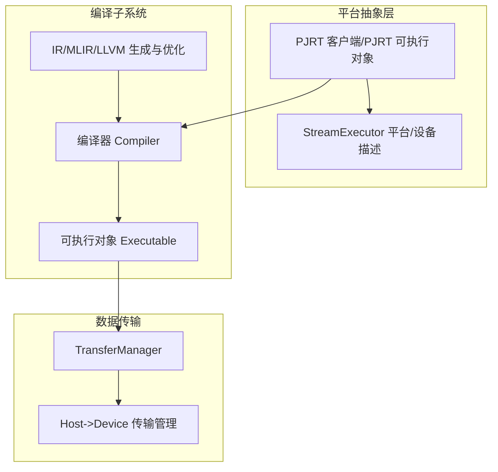
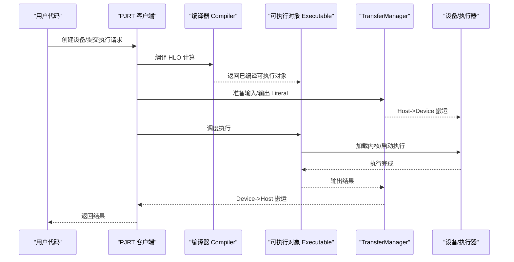
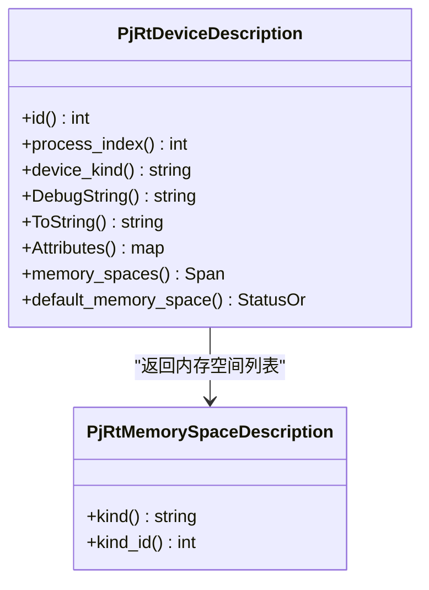
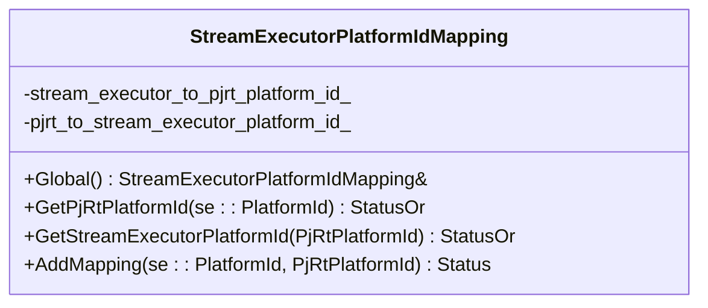
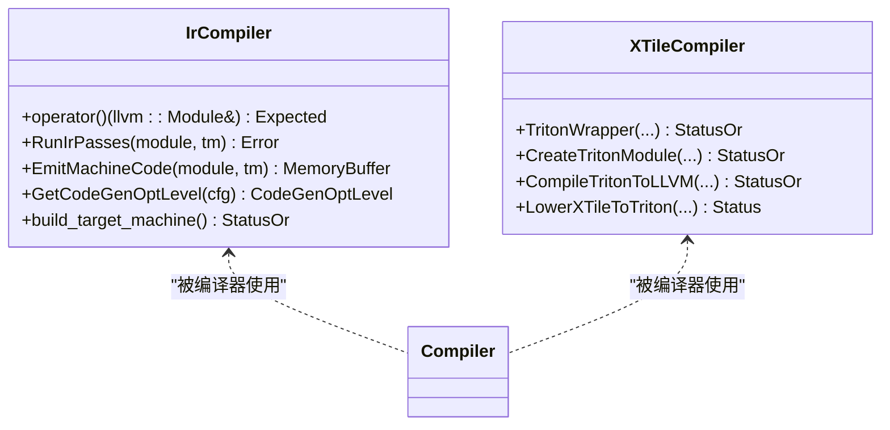
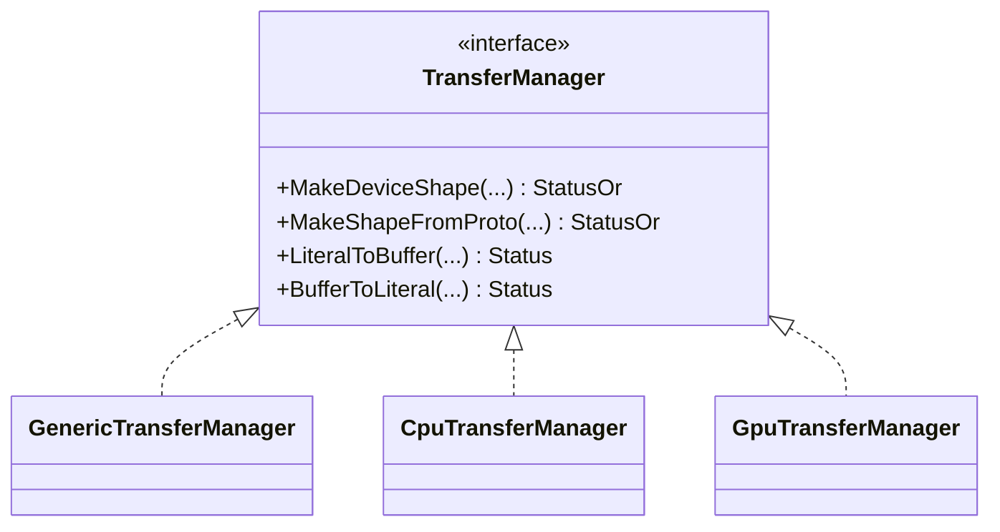
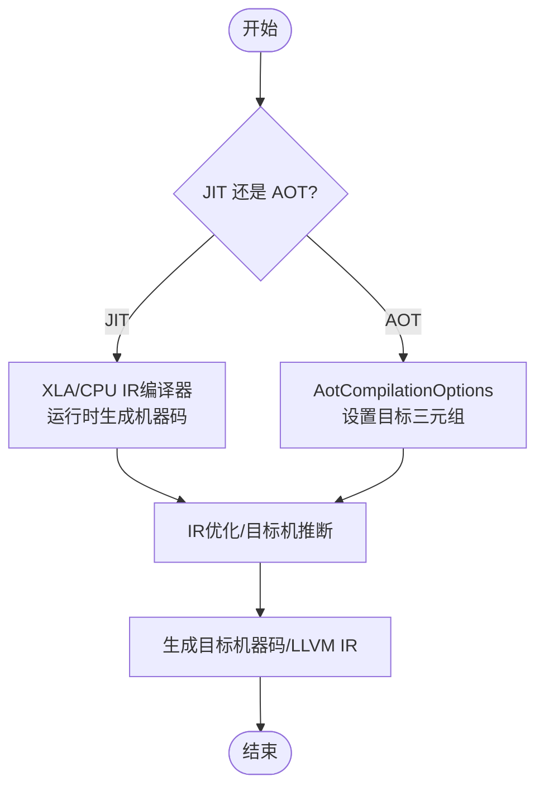
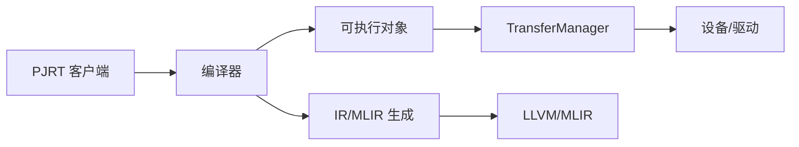

# 后端扩展开发

<cite>
**本文引用的文件**
- [developing_new_backend.md](file://docs/developing_new_backend.md)
- [pjrt_device_description.h](file://xla/pjrt/pjrt_device_description.h)
- [stream_executor_platform_id_mapping.h](file://xla/pjrt/stream_executor_platform_id_mapping.h)
- [ir_compiler.h](file://xla/backends/cpu/codegen/ir_compiler.h)
- [xtile_compiler.h](file://xla/backends/gpu/codegen/triton/xtile_compiler.h)
- [pjrt_stream_executor_client.h](file://xla/pjrt/pjrt_stream_executor_client.h)
- [stream_executor_executable.h](file://xla/pjrt/stream_executor_executable.h)
- [host_to_device_transfer_manager.h](file://xla/pjrt/host_to_device_transfer_manager.h)
- [generic_transfer_manager.h](file://xla/service/generic_transfer_manager.h)
- [cpu_transfer_manager.h](file://xla/service/cpu/cpu_transfer_manager.h)
- [gpu_transfer_manager.h](file://xla/service/gpu/gpu_transfer_manager.h)
- [stream_executor_util.h](file://xla/service/gpu/stream_executor_util.h)
- [compiler.h](file://xla/service/compiler.h)
- [executable.h](file://xla/service/executable.h)
- [stream_executor.h](file://xla/stream_executor/stream_executor.h)
- [transfer_manager.h](file://xla/service/transfer_manager.h)
- [pjrt_client.h](file://xla/pjrt/pjrt_client.h)
- [pjrt_executable.h](file://xla/pjrt/pjrt_executable.h)
- [AotCompilationOptions](file://xla/service/compiler.h)
</cite>

## 目录
1. [引言](#引言)
2. [项目结构](#项目结构)
3. [核心组件](#核心组件)
4. [架构总览](#架构总览)
5. [详细组件分析](#详细组件分析)
6. [依赖关系分析](#依赖关系分析)
7. [性能考量](#性能考量)
8. [故障排查指南](#故障排查指南)
9. [结论](#结论)
10. [附录](#附录)

## 引言
本文件面向系统工程师与硬件厂商，指导如何为XLA开发新的硬件后端。内容覆盖后端接口实现、平台抽象层设计、编译器集成、后端注册机制、设备描述符、执行器接口等关键环节，并提供开发流程、测试验证与性能基准实践建议。

## 项目结构
XLA后端体系由“平台抽象层（PJRT/StreamExecutor）+ 编译器（Compiler/Executable）+ 数据传输（TransferManager）+ 设备描述（DeviceDescription）”构成。不同硬件场景可复用现有CPU/GPU路径或从零实现。

图示来源
- [pjrt_client.h](file://xla/pjrt/pjrt_client.h)
- [pjrt_executable.h](file://xla/pjrt/pjrt_executable.h)
- [stream_executor.h](file://xla/stream_executor/stream_executor.h)
- [compiler.h](file://xla/service/compiler.h)
- [executable.h](file://xla/service/executable.h)
- [host_to_device_transfer_manager.h](file://xla/pjrt/host_to_device_transfer_manager.h)
- [generic_transfer_manager.h](file://xla/service/generic_transfer_manager.h)

章节来源
- [developing_new_backend.md](file://docs/developing_new_backend.md#L1-L77)

## 核心组件
- 平台抽象层（PJRT/StreamExecutor）
  - PJRT设备描述与内存空间：用于对外暴露设备属性、进程索引、默认内存空间等。
  - 平台ID映射：在StreamExecutor与PJRT之间进行平台ID互查，便于互通。
  - PJRT客户端与可执行对象：统一的跨平台执行入口与生命周期管理。
- 编译器与可执行对象
  - Compiler：将HLO计算编译为可执行对象。
  - Executable：在目标平台上调度与执行已编译的计算。
  - 针对CPU/GPU的IR/MLIR生成与优化管线（如XLA/CPU IR编译器、XLA/GPU Triton编译器）。
- 数据传输（TransferManager）
  - 将主机侧Literal数据与设备侧缓冲区互转，封装跨设备的数据搬运细节。
  - 提供通用与特定后端（CPU/GPU）的传输实现。

章节来源
- [pjrt_device_description.h](file://xla/pjrt/pjrt_device_description.h#L51-L100)
- [stream_executor_platform_id_mapping.h](file://xla/pjrt/stream_executor_platform_id_mapping.h#L35-L55)
- [ir_compiler.h](file://xla/backends/cpu/codegen/ir_compiler.h#L52-L143)
- [xtile_compiler.h](file://xla/backends/gpu/codegen/triton/xtile_compiler.h#L50-L150)
- [compiler.h](file://xla/service/compiler.h)
- [executable.h](file://xla/service/executable.h)
- [host_to_device_transfer_manager.h](file://xla/pjrt/host_to_device_transfer_manager.h)
- [generic_transfer_manager.h](file://xla/service/generic_transfer_manager.h)
- [cpu_transfer_manager.h](file://xla/service/cpu/cpu_transfer_manager.h)
- [gpu_transfer_manager.h](file://xla/service/gpu/gpu_transfer_manager.h)

## 架构总览
下图展示从用户调用到设备执行的关键交互：PJRT客户端负责设备发现与任务提交；编译器将HLO转换为可执行对象；执行器负责加载与调度；TransferManager负责数据搬运。

图示来源
- [pjrt_client.h](file://xla/pjrt/pjrt_client.h)
- [compiler.h](file://xla/service/compiler.h)
- [executable.h](file://xla/service/executable.h)
- [host_to_device_transfer_manager.h](file://xla/pjrt/host_to_device_transfer_manager.h)
- [generic_transfer_manager.h](file://xla/service/generic_transfer_manager.h)

## 详细组件分析

### 设备描述与内存空间（PJRT）
- PjRtDeviceDescription定义了设备标识、进程索引、设备型号、调试字符串、属性字典以及内存空间集合与默认内存空间查询接口。
- PjRtMemorySpaceDescription提供内存空间种类与ID，用于区分主机内存、设备本地内存、统一内存等。

图示来源
- [pjrt_device_description.h](file://xla/pjrt/pjrt_device_description.h#L51-L100)

章节来源
- [pjrt_device_description.h](file://xla/pjrt/pjrt_device_description.h#L51-L100)

### 平台ID映射（StreamExecutor <-> PJRT）
- 提供全局映射表，支持双向查找：给定StreamExecutor平台ID获取PJRT平台ID，反之亦然。
- 内部使用互斥锁保护并发访问。

图示来源
- [stream_executor_platform_id_mapping.h](file://xla/pjrt/stream_executor_platform_id_mapping.h#L35-L55)

章节来源
- [stream_executor_platform_id_mapping.h](file://xla/pjrt/stream_executor_platform_id_mapping.h#L35-L55)

### 编译器与可执行对象（CPU/GPU IR/MLIR）
- XLA/CPU IR编译器：面向XLA定制的LLVM IR编译流水线，包含目标机推断、IR优化、机器码生成与钩子回调。
- XLA/GPU Triton编译器：将融合图降级为MLIR，再编译为LLVM IR与目标内核，同时产出共享内存、TMA元数据、线程维度等信息。

图示来源
- [ir_compiler.h](file://xla/backends/cpu/codegen/ir_compiler.h#L52-L143)
- [xtile_compiler.h](file://xla/backends/gpu/codegen/triton/xtile_compiler.h#L50-L150)

章节来源
- [ir_compiler.h](file://xla/backends/cpu/codegen/ir_compiler.h#L52-L143)
- [xtile_compiler.h](file://xla/backends/gpu/codegen/triton/xtile_compiler.h#L50-L150)

### 数据传输（TransferManager）
- TransferManager抽象：定义从Literal到设备句柄的构造与反向搬运逻辑。
- 通用实现与各后端特化实现（CPU/GPU）：根据设备特性选择最优搬运策略与内存布局。

图示来源
- [generic_transfer_manager.h](file://xla/service/generic_transfer_manager.h)
- [cpu_transfer_manager.h](file://xla/service/cpu/cpu_transfer_manager.h)
- [gpu_transfer_manager.h](file://xla/service/gpu/gpu_transfer_manager.h)

章节来源
- [host_to_device_transfer_manager.h](file://xla/pjrt/host_to_device_transfer_manager.h)
- [generic_transfer_manager.h](file://xla/service/generic_transfer_manager.h)
- [cpu_transfer_manager.h](file://xla/service/cpu/cpu_transfer_manager.h)
- [gpu_transfer_manager.h](file://xla/service/gpu/gpu_transfer_manager.h)

### 编译流程（JIT/AOT）
- JIT模式：XLA/CPU后端在运行时生成代码；AOT模式：通过AotCompilationOptions提供LLVM三元组配置目标架构。
- GPU后端可直接基于LLVM IR生成与优化，结合设备能力参数（如块级参数）进行内核调度与内存规划。

图示来源
- [developing_new_backend.md](file://docs/developing_new_backend.md#L33-L34)
- [ir_compiler.h](file://xla/backends/cpu/codegen/ir_compiler.h#L98-L127)

章节来源
- [developing_new_backend.md](file://docs/developing_new_backend.md#L30-L37)
- [ir_compiler.h](file://xla/backends/cpu/codegen/ir_compiler.h#L98-L127)

### 执行器接口（StreamExecutor）
- StreamExecutor为底层设备能力的抽象，涵盖设备初始化、内存分配/释放、内核启动、事件同步等。
- 新后端通常不需要实现全部方法，按需裁剪以满足目标硬件能力。

章节来源
- [stream_executor.h](file://xla/stream_executor/stream_executor.h)
- [developing_new_backend.md](file://docs/developing_new_backend.md#L64-L66)

### 后端注册机制与平台抽象
- 平台ID映射：在StreamExecutor与PJRT之间建立平台ID映射，便于库间互通。
- PJRT客户端：统一管理设备发现、编译、执行与资源回收。
- 编译器/可执行对象：作为编译与执行的桥梁，连接HLO与设备执行环境。

章节来源
- [stream_executor_platform_id_mapping.h](file://xla/pjrt/stream_executor_platform_id_mapping.h#L35-L55)
- [pjrt_client.h](file://xla/pjrt/pjrt_client.h)
- [compiler.h](file://xla/service/compiler.h)
- [executable.h](file://xla/service/executable.h)

## 依赖关系分析
- 组件耦合
  - PJRT客户端依赖平台抽象（设备描述、平台ID映射），并通过编译器/可执行对象完成任务生命周期管理。
  - 编译器依赖IR/MLIR生成与优化模块（CPU/GPU），并产出可执行对象。
  - TransferManager贯穿输入输出数据的搬运，与设备内存模型紧密相关。
- 外部依赖
  - LLVM/MLIR：CPU/GPU后端均依赖LLVM/MLIR进行IR生成与优化。
  - 设备驱动/运行时：GPU后端依赖CUDA/ROCm/Triton等运行时设施。

图示来源
- [pjrt_client.h](file://xla/pjrt/pjrt_client.h)
- [compiler.h](file://xla/service/compiler.h)
- [executable.h](file://xla/service/executable.h)
- [host_to_device_transfer_manager.h](file://xla/pjrt/host_to_device_transfer_manager.h)
- [generic_transfer_manager.h](file://xla/service/generic_transfer_manager.h)

## 性能考量
- 优化级别与目标机推断：根据HLO模块配置选择合适的优化等级与目标特性，减少不必要的IR优化与寄存器压力。
- 内核调度与内存规划：GPU后端通过块级参数、共享内存大小、TMA元数据等影响吞吐与带宽利用率。
- 数据搬运策略：尽量减少Host/Device之间的往返次数，采用异步搬运与重叠计算/通信。
- 缓存与复用：利用编译缓存与内核复用降低冷启动开销。

## 故障排查指南
- 设备/平台识别异常
  - 检查设备描述中的设备型号与属性是否正确，确认平台ID映射是否一致。
- 编译失败
  - 确认IR/MLIR生成阶段未引入非法指令；检查目标三元组与优化选项匹配性。
- 执行错误
  - 核对可执行对象与设备能力的兼容性；检查内核启动参数与共享内存配置。
- 数据搬运错误
  - 校验Literal形状/布局与设备期望一致；确认TransferManager实现与设备内存模型匹配。

章节来源
- [pjrt_device_description.h](file://xla/pjrt/pjrt_device_description.h#L51-L100)
- [stream_executor_platform_id_mapping.h](file://xla/pjrt/stream_executor_platform_id_mapping.h#L35-L55)
- [generic_transfer_manager.h](file://xla/service/generic_transfer_manager.h)
- [gpu_transfer_manager.h](file://xla/service/gpu/gpu_transfer_manager.h)

## 结论
为XLA开发新硬件后端的关键在于：清晰的平台抽象（PJRT/SE）、可扩展的编译器与IR/MLIR生成、稳健的数据传输与设备执行接口。依据硬件特性选择合适路径（CPU/GPU/自研），遵循本文的组件职责与依赖关系，可高效完成从编译到执行的全链路落地。

## 附录
- 开发流程建议
  - 明确硬件能力与目标场景（CPU-like / 非CPU-like / 无LLVM后端）。
  - 复用现有CPU/GPU实现思路，裁剪必要接口，补齐缺失部分。
  - 建立平台ID映射与设备描述，确保PJRT/SE互通。
  - 实现编译器与可执行对象，接入IR/MLIR生成与优化。
  - 实现TransferManager，保证数据搬运正确性与性能。
  - 编写单元/集成测试，覆盖编译、执行与数据路径。
- 测试与基准
  - 单元测试：针对IR生成、优化、内核调度与数据搬运。
  - 集成测试：端到端编译/执行/搬运链路验证。
  - 基准测试：在目标硬件上测量吞吐、延迟与内存占用，对比参考实现。

章节来源
- [developing_new_backend.md](file://docs/developing_new_backend.md#L13-L77)
- [ir_compiler.h](file://xla/backends/cpu/codegen/ir_compiler.h#L52-L143)
- [xtile_compiler.h](file://xla/backends/gpu/codegen/triton/xtile_compiler.h#L50-L150)
- [stream_executor_util.h](file://xla/service/gpu/stream_executor_util.h)