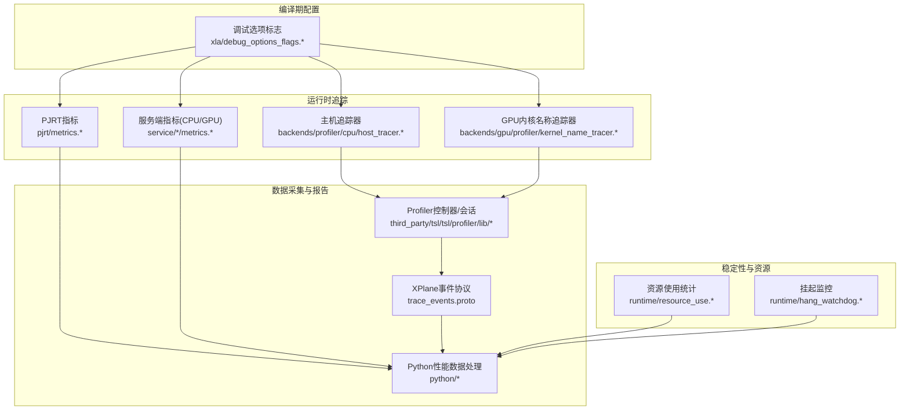
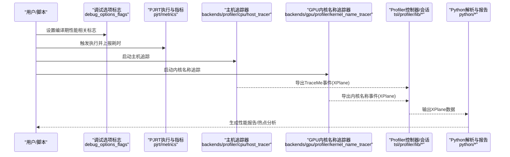
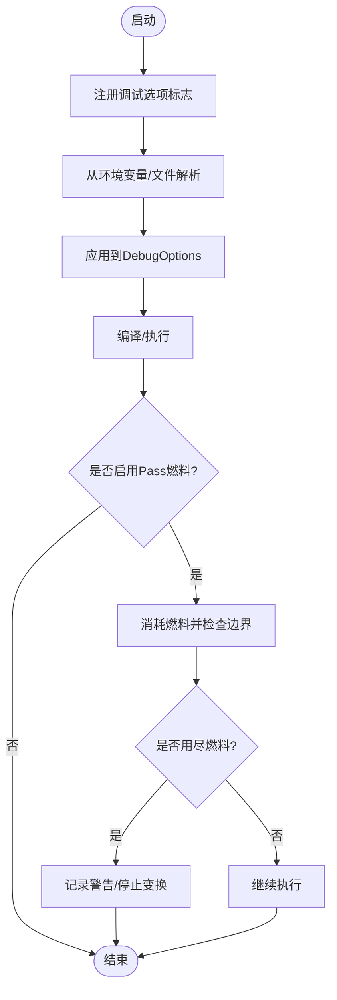
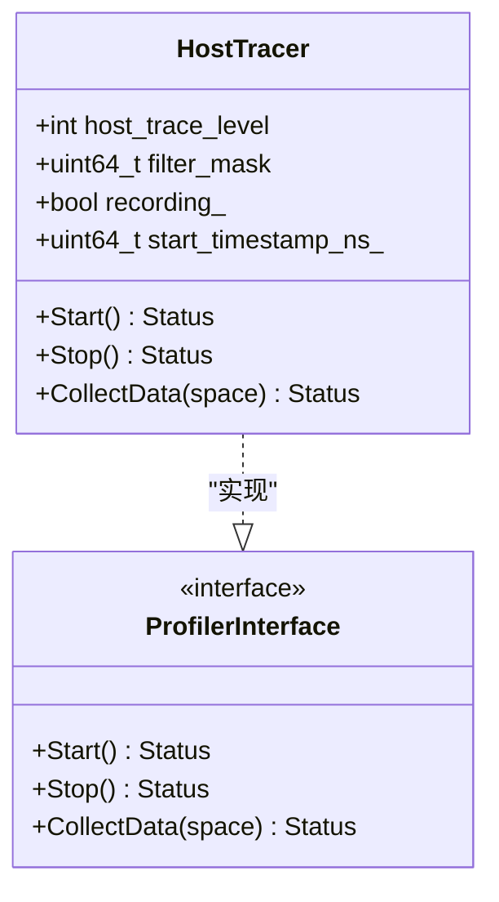
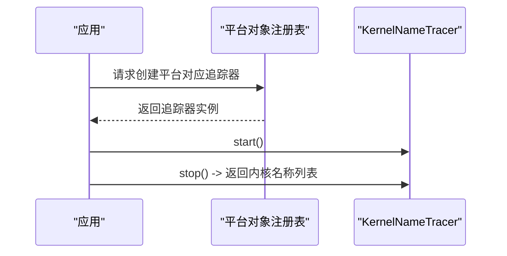
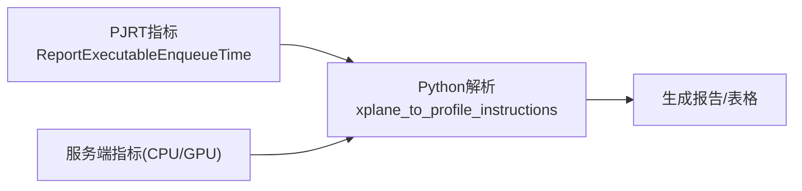
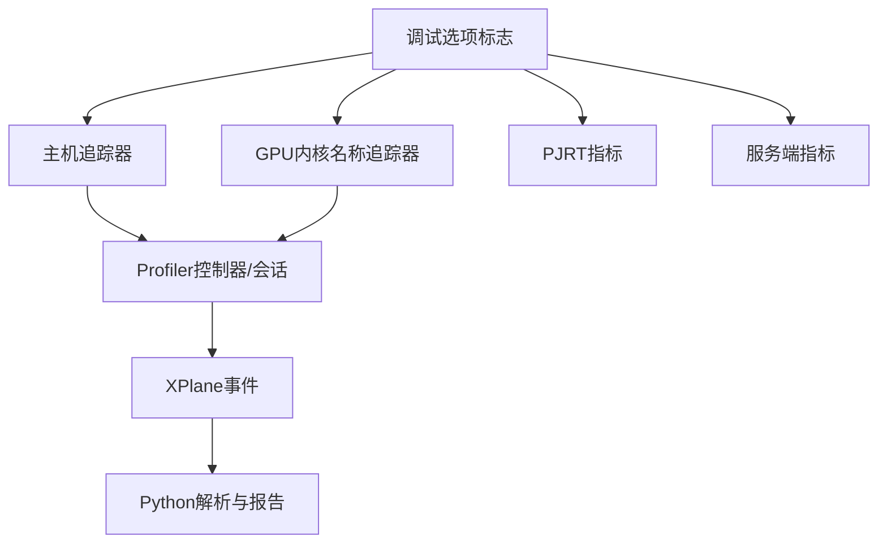

# 性能分析

<cite>
**本文引用的文件**
- [xla/debug_options_flags.cc](file://xla/debug_options_flags.cc)
- [xla/debug_options_flags.h](file://xla/debug_options_flags.h)
- [xla/pjrt/metrics.cc](file://xla/pjrt/metrics.cc)
- [xla/pjrt/metrics.h](file://xla/pjrt/metrics.h)
- [xla/backends/profiler/cpu/host_tracer.cc](file://xla/backends/profiler/cpu/host_tracer.cc)
- [xla/backends/profiler/cpu/host_tracer.h](file://xla/backends/profiler/cpu/host_tracer.h)
- [xla/backends/gpu/profiler/kernel_name_tracer.cc](file://xla/backends/gpu/profiler/kernel_name_tracer.cc)
- [xla/backends/gpu/profiler/kernel_name_tracer.h](file://xla/backends/gpu/profiler/kernel_name_tracer.h)
- [xla/metric_table_report.cc](file://xla/metric_table_report.cc)
- [xla/metric_table_report.h](file://xla/metric_table_report.h)
- [xla/service/gpu/metrics.cc](file://xla/service/gpu/metrics.cc)
- [xla/service/gpu/metrics.h](file://xla/service/gpu/metrics.h)
- [xla/service/cpu/metrics.cc](file://xla/service/cpu/metrics.cc)
- [xla/service/cpu/metrics.h](file://xla/service/cpu/metrics.h)
- [xla/runtime/resource_use.cc](file://xla/runtime/resource_use.cc)
- [xla/runtime/resource_use.h](file://xla/runtime/resource_use.h)
- [xla/runtime/hang_watchdog.cc](file://xla/runtime/hang_watchdog.cc)
- [xla/runtime/hang_watchdog.h](file://xla/runtime/hang_watchdog.h)
- [xla/python/profiler.cc](file://xla/python/profiler.cc)
- [xla/python/profiler_utils.cc](file://xla/python/profiler_utils.cc)
- [xla/python/profiler_utils.h](file://xla/python/profiler_utils.h)
- [xla/python/profile_data.cc](file://xla/python/profile_data.cc)
- [xla/python/xplane_to_profile_instructions.cc](file://xla/python/xplane_to_profile_instructions.cc)
- [xla/python/xplane_to_profile_instructions.h](file://xla/python/xplane_to_profile_instructions.h)
- [docs/tools.md](file://docs/tools.md)
- [docs/hlo_dumps.md](file://docs/hlo_dumps.md)
- [docs/oom_debugging.md](file://docs/oom_debugging.md)
- [third_party/tsl/tsl/profiler/lib/profiler_controller.cc](file://third_party/tsl/tsl/profiler/lib/profiler_controller.cc)
- [third_party/tsl/tsl/profiler/lib/profiler_controller.h](file://third_party/tsl/tsl/profiler/lib/profiler_controller.h)
- [third_party/tsl/tsl/profiler/lib/profiler_session.cc](file://third_party/tsl/tsl/profiler/lib/profiler_session.cc)
- [third_party/tsl/tsl/profiler/lib/profiler_session.h](file://third_party/tsl/tsl/profiler/lib/profiler_session.h)
- [third_party/tsl/tsl/profiler/lib/profiler_factory.cc](file://third_party/tsl/tsl/profiler/lib/profiler_factory.cc)
- [third_party/tsl/tsl/profiler/lib/profiler_factory.h](file://third_party/tsl/tsl/profiler/lib/profiler_factory.h)
- [third_party/tsl/tsl/profiler/lib/profiler_interface.h](file://third_party/tsl/tsl/profiler/lib/profiler_interface.h)
- [third_party/tsl/tsl/profiler/lib/traceme.h](file://third_party/tsl/tsl/profiler/lib/traceme.h)
- [third_party/tsl/tsl/profiler/lib/traceme_encode.h](file://third_party/tsl/tsl/profiler/lib/traceme_encode.h)
- [third_party/tsl/tsl/profiler/protobuf/trace_events.proto](file://third_party/tsl/tsl/profiler/protobuf/trace_events.proto)
</cite>

## 目录
1. [简介](#简介)
2. [项目结构](#项目结构)
3. [核心组件](#核心组件)
4. [架构总览](#架构总览)
5. [详细组件分析](#详细组件分析)
6. [依赖关系分析](#依赖关系分析)
7. [性能考量](#性能考量)
8. [故障排查指南](#故障排查指南)
9. [结论](#结论)
10. [附录](#附录)

## 简介
本文件面向XLA性能分析系统，系统性阐述编译时与运行时的性能分析工具与方法，覆盖执行时间统计、内存使用分析、热点检测、性能配置项、数据采集与报告生成机制，并给出瓶颈识别与优化建议、性能测试与基准工具的使用指南。内容基于仓库中的调试选项、指标上报、主机与GPU追踪器、资源使用与挂起监控、以及Python侧性能数据处理等模块进行整理。

## 项目结构
XLA性能分析能力由多层模块协同实现：
- 调试与编译期配置：通过调试选项标志控制编译路径、融合策略、命令缓冲调度、自动调优等，影响编译时性能与可测量性。
- 运行时指标与追踪：主机端TraceMe追踪、GPU内核名称追踪、PJRT执行计时、服务端CPU/GPU指标等，用于运行时性能观测。
- 数据采集与报告：TSL Profiler控制器与会话、XPlane事件协议、Python侧解析与指令映射，形成统一的采集与可视化入口。
- 资源与稳定性：资源使用统计、挂起监控，辅助定位异常耗时与内存压力。

图表来源
- [xla/debug_options_flags.cc](file://xla/debug_options_flags.cc#L557-L800)
- [xla/backends/profiler/cpu/host_tracer.cc](file://xla/backends/profiler/cpu/host_tracer.cc#L44-L125)
- [xla/backends/gpu/profiler/kernel_name_tracer.cc](file://xla/backends/gpu/profiler/kernel_name_tracer.cc#L28-L37)
- [xla/pjrt/metrics.cc](file://xla/pjrt/metrics.cc#L25-L47)
- [xla/service/cpu/metrics.cc](file://xla/service/cpu/metrics.cc#L1-L200)
- [xla/service/gpu/metrics.cc](file://xla/service/gpu/metrics.cc#L1-L200)
- [third_party/tsl/tsl/profiler/lib/profiler_controller.cc](file://third_party/tsl/tsl/profiler/lib/profiler_controller.cc#L1-L200)
- [third_party/tsl/tsl/profiler/lib/profiler_session.cc](file://third_party/tsl/tsl/profiler/lib/profiler_session.cc#L1-L200)
- [third_party/tsl/tsl/profiler/protobuf/trace_events.proto](file://third_party/tsl/tsl/profiler/protobuf/trace_events.proto#L1-L200)
- [xla/python/xplane_to_profile_instructions.cc](file://xla/python/xplane_to_profile_instructions.cc#L1-L200)
- [xla/runtime/resource_use.cc](file://xla/runtime/resource_use.cc#L1-L200)
- [xla/runtime/hang_watchdog.cc](file://xla/runtime/hang_watchdog.cc#L1-L200)

章节来源
- [xla/debug_options_flags.cc](file://xla/debug_options_flags.cc#L172-L507)
- [xla/backends/profiler/cpu/host_tracer.cc](file://xla/backends/profiler/cpu/host_tracer.cc#L44-L125)
- [xla/backends/gpu/profiler/kernel_name_tracer.cc](file://xla/backends/gpu/profiler/kernel_name_tracer.cc#L28-L37)
- [xla/pjrt/metrics.cc](file://xla/pjrt/metrics.cc#L25-L47)
- [xla/service/cpu/metrics.cc](file://xla/service/cpu/metrics.cc#L1-L200)
- [xla/service/gpu/metrics.cc](file://xla/service/gpu/metrics.cc#L1-L200)
- [third_party/tsl/tsl/profiler/lib/profiler_controller.cc](file://third_party/tsl/tsl/profiler/lib/profiler_controller.cc#L1-L200)
- [third_party/tsl/tsl/profiler/lib/profiler_session.cc](file://third_party/tsl/tsl/profiler/lib/profiler_session.cc#L1-L200)
- [third_party/tsl/tsl/profiler/protobuf/trace_events.proto](file://third_party/tsl/tsl/profiler/protobuf/trace_events.proto#L1-L200)
- [xla/python/xplane_to_profile_instructions.cc](file://xla/python/xplane_to_profile_instructions.cc#L1-L200)
- [xla/runtime/resource_use.cc](file://xla/runtime/resource_use.cc#L1-L200)
- [xla/runtime/hang_watchdog.cc](file://xla/runtime/hang_watchdog.cc#L1-L200)

## 核心组件
- 调试选项与编译期性能控制
  - 提供大量编译期开关（如GPU命令缓冲、融合策略、自动调优、调度模式、精度与数学特性等），用于在编译阶段影响性能与可观测性。
  - 支持从环境变量与文件注入调试选项，便于在不修改代码的情况下快速切换配置。
- 主机端TraceMe追踪
  - 基于TraceMe事件采集主机侧执行细节，支持按级别与过滤掩码控制开销与粒度。
- GPU内核名称追踪
  - 在无法从HLO直接获知内核名时，通过平台工厂创建追踪器以获取实际使用的内核名称，辅助热点定位与融合效果验证。
- 指标上报与报告
  - PJRT与服务端指标计数器用于统计执行次数与累计耗时；TSL Profiler控制器/会话负责采集与导出XPlane；Python侧将XPlane转换为可读的性能指令序列，配合报告工具输出。
- 资源使用与稳定性
  - 资源使用统计与挂起监控用于发现异常耗时、内存压力与死锁风险。

章节来源
- [xla/debug_options_flags.h](file://xla/debug_options_flags.h#L29-L94)
- [xla/backends/profiler/cpu/host_tracer.h](file://xla/backends/profiler/cpu/host_tracer.h#L27-L42)
- [xla/backends/gpu/profiler/kernel_name_tracer.h](file://xla/backends/gpu/profiler/kernel_name_tracer.h#L28-L45)
- [xla/pjrt/metrics.h](file://xla/pjrt/metrics.h#L24-L27)
- [xla/metric_table_report.h](file://xla/metric_table_report.h#L1-L200)
- [xla/runtime/resource_use.h](file://xla/runtime/resource_use.h#L1-L200)
- [xla/runtime/hang_watchdog.h](file://xla/runtime/hang_watchdog.h#L1-L200)

## 架构总览
下图展示从配置到采集再到报告的整体流程，涵盖编译期与运行时的关键节点。

图表来源
- [xla/debug_options_flags.cc](file://xla/debug_options_flags.cc#L557-L800)
- [xla/pjrt/metrics.cc](file://xla/pjrt/metrics.cc#L25-L47)
- [xla/backends/profiler/cpu/host_tracer.cc](file://xla/backends/profiler/cpu/host_tracer.cc#L83-L124)
- [xla/backends/gpu/profiler/kernel_name_tracer.cc](file://xla/backends/gpu/profiler/kernel_name_tracer.cc#L28-L37)
- [third_party/tsl/tsl/profiler/lib/profiler_controller.cc](file://third_party/tsl/tsl/profiler/lib/profiler_controller.cc#L1-L200)
- [third_party/tsl/tsl/profiler/lib/profiler_session.cc](file://third_party/tsl/tsl/profiler/lib/profiler_session.cc#L1-L200)
- [xla/python/xplane_to_profile_instructions.cc](file://xla/python/xplane_to_profile_instructions.cc#L1-L200)

## 详细组件分析

### 组件A：调试选项与编译期性能控制
- 功能要点
  - 默认值集中定义，覆盖后端优化等级、GPU命令缓冲、融合与自动调优、调度模式、数学特性、收集器阈值、延迟隐藏调度器、PGLE/NCCL参数等。
  - 提供标志注册、从环境变量与文件解析、重置默认值、燃料（pass fuel）控制等工具，便于定位编译器Pass问题与进行Bisect。
- 关键接口
  - 注册与解析：[MakeDebugOptionsFlags](file://xla/debug_options_flags.cc#L557-L800)、[GetDebugOptionsFromFlags](file://xla/debug_options_flags.h#L87-L90)、[ParseDebugOptionFlagsFromEnv](file://xla/debug_options_flags.h#L41-L46)、[ParseFlagsFromDebugOptionsFile](file://xla/debug_options_flags.h#L48-L52)。
  - 燃料控制：[ConsumeFuel](file://xla/debug_options_flags.h#L119-L142)、[ResetThreadLocalFuel](file://xla/debug_options_flags.h#L154)。
- 典型用途
  - 通过设置命令缓冲与调度模式评估融合与调度对吞吐的影响。
  - 使用燃料控制定位导致性能退化的特定Pass。

图表来源
- [xla/debug_options_flags.cc](file://xla/debug_options_flags.cc#L557-L800)
- [xla/debug_options_flags.h](file://xla/debug_options_flags.h#L95-L154)

章节来源
- [xla/debug_options_flags.cc](file://xla/debug_options_flags.cc#L172-L507)
- [xla/debug_options_flags.h](file://xla/debug_options_flags.h#L29-L94)
- [xla/debug_options_flags.h](file://xla/debug_options_flags.h#L95-L154)

### 组件B：主机端TraceMe追踪
- 功能要点
  - 通过TraceMeRecorder捕获TraceMe事件，支持不同追踪级别与过滤掩码，避免高开销追踪影响性能。
  - 将事件转换为XPlane并加入主机线程平面，便于统一采集与后续解析。
- 关键接口
  - 创建与组合：[CreateHostTracer](file://xla/backends/profiler/cpu/host_tracer.h#L40-L41)。
  - 生命周期与数据采集：[Start/Stop/CollectData](file://xla/backends/profiler/cpu/host_tracer.cc#L83-L124)。
- 典型用途
  - 定位用户自定义TraceMe热点与高层算子（如XLA/TF算子）的执行细节。
  - 结合过滤掩码与级别控制，平衡观测精度与性能开销。

图表来源
- [xla/backends/profiler/cpu/host_tracer.cc](file://xla/backends/profiler/cpu/host_tracer.cc#L44-L125)
- [xla/backends/profiler/cpu/host_tracer.h](file://xla/backends/profiler/cpu/host_tracer.h#L27-L42)
- [third_party/tsl/tsl/profiler/lib/profiler_interface.h](file://third_party/tsl/tsl/profiler/lib/profiler_interface.h#L1-L200)

章节来源
- [xla/backends/profiler/cpu/host_tracer.cc](file://xla/backends/profiler/cpu/host_tracer.cc#L44-L125)
- [xla/backends/profiler/cpu/host_tracer.h](file://xla/backends/profiler/cpu/host_tracer.h#L27-L42)

### 组件C：GPU内核名称追踪
- 功能要点
  - 通过平台对象注册表按平台创建内核名称追踪器实例，用于在融合或第三方库调用场景下获取实际内核名。
  - 提供启动与停止接口以收集GPU上执行的内核名称列表。
- 关键接口
  - 工厂创建：[KernelNameTracer::Create](file://xla/backends/gpu/profiler/kernel_name_tracer.cc#L28-L37)。
  - 接口定义：[KernelNameTracer](file://xla/backends/gpu/profiler/kernel_name_tracer.h#L32-L45)。
- 典型用途
  - 验证融合是否生效、定位第三方库（如cuBLAS）调用的内核形态与命名。

图表来源
- [xla/backends/gpu/profiler/kernel_name_tracer.cc](file://xla/backends/gpu/profiler/kernel_name_tracer.cc#L28-L37)
- [xla/backends/gpu/profiler/kernel_name_tracer.h](file://xla/backends/gpu/profiler/kernel_name_tracer.h#L32-L45)

章节来源
- [xla/backends/gpu/profiler/kernel_name_tracer.cc](file://xla/backends/gpu/profiler/kernel_name_tracer.cc#L28-L37)
- [xla/backends/gpu/profiler/kernel_name_tracer.h](file://xla/backends/gpu/profiler/kernel_name_tracer.h#L32-L45)

### 组件D：指标上报与报告
- PJRT执行指标
  - 上报执行次数与累计耗时微秒数，便于聚合统计与外部监控集成。
- 服务端指标
  - CPU/GPU服务端指标分别统计执行与资源相关计数，辅助跨组件性能归因。
- 报告与解析
  - TSL Profiler控制器/会话负责采集与导出XPlane；Python侧将XPlane转换为性能指令序列，结合报告工具生成报表。

图表来源
- [xla/pjrt/metrics.cc](file://xla/pjrt/metrics.cc#L25-L47)
- [xla/service/cpu/metrics.cc](file://xla/service/cpu/metrics.cc#L1-L200)
- [xla/service/gpu/metrics.cc](file://xla/service/gpu/metrics.cc#L1-L200)
- [xla/python/xplane_to_profile_instructions.cc](file://xla/python/xplane_to_profile_instructions.cc#L1-L200)
- [xla/metric_table_report.h](file://xla/metric_table_report.h#L1-L200)

章节来源
- [xla/pjrt/metrics.cc](file://xla/pjrt/metrics.cc#L25-L47)
- [xla/service/cpu/metrics.cc](file://xla/service/cpu/metrics.cc#L1-L200)
- [xla/service/gpu/metrics.cc](file://xla/service/gpu/metrics.cc#L1-L200)
- [xla/python/xplane_to_profile_instructions.cc](file://xla/python/xplane_to_profile_instructions.cc#L1-L200)
- [xla/metric_table_report.h](file://xla/metric_table_report.h#L1-L200)

### 组件E：资源使用与稳定性
- 资源使用统计
  - 记录执行过程中的资源占用，辅助内存与带宽瓶颈定位。
- 挂起监控
  - 对长时间无进展的执行进行告警与终止，防止卡死影响整体吞吐。

章节来源
- [xla/runtime/resource_use.cc](file://xla/runtime/resource_use.cc#L1-L200)
- [xla/runtime/hang_watchdog.cc](file://xla/runtime/hang_watchdog.cc#L1-L200)

## 依赖关系分析
- 组件耦合
  - 调试选项标志贯穿编译期与运行时，直接影响追踪器与指标行为。
  - 主机与GPU追踪器依赖TSL Profiler基础设施，统一输出XPlane事件。
  - Python侧解析依赖XPlane协议与指令映射，最终生成报告。
- 外部依赖
  - TSL Profiler控制器/会话与事件协议为通用采集层，向上支撑XLA性能分析。
- 循环依赖
  - 当前结构以“配置→采集→解析→报告”单向依赖为主，未见循环依赖迹象。

图表来源
- [xla/debug_options_flags.cc](file://xla/debug_options_flags.cc#L557-L800)
- [xla/backends/profiler/cpu/host_tracer.cc](file://xla/backends/profiler/cpu/host_tracer.cc#L44-L125)
- [xla/backends/gpu/profiler/kernel_name_tracer.cc](file://xla/backends/gpu/profiler/kernel_name_tracer.cc#L28-L37)
- [xla/pjrt/metrics.cc](file://xla/pjrt/metrics.cc#L25-L47)
- [xla/service/cpu/metrics.cc](file://xla/service/cpu/metrics.cc#L1-L200)
- [xla/service/gpu/metrics.cc](file://xla/service/gpu/metrics.cc#L1-L200)
- [third_party/tsl/tsl/profiler/lib/profiler_controller.cc](file://third_party/tsl/tsl/profiler/lib/profiler_controller.cc#L1-L200)
- [third_party/tsl/tsl/profiler/lib/profiler_session.cc](file://third_party/tsl/tsl/profiler/lib/profiler_session.cc#L1-L200)
- [third_party/tsl/tsl/profiler/protobuf/trace_events.proto](file://third_party/tsl/tsl/profiler/protobuf/trace_events.proto#L1-L200)
- [xla/python/xplane_to_profile_instructions.cc](file://xla/python/xplane_to_profile_instructions.cc#L1-L200)

章节来源
- [third_party/tsl/tsl/profiler/lib/profiler_controller.h](file://third_party/tsl/tsl/profiler/lib/profiler_controller.h#L1-L200)
- [third_party/tsl/tsl/profiler/lib/profiler_session.h](file://third_party/tsl/tsl/profiler/lib/profiler_session.h#L1-L200)
- [third_party/tsl/tsl/profiler/protobuf/trace_events.proto](file://third_party/tsl/tsl/profiler/protobuf/trace_events.proto#L1-L200)

## 性能考量
- 编译期优化与可观测性权衡
  - 命令缓冲与调度模式会影响融合与流水线效率，需结合业务吞吐目标选择。
  - 自动调优与融合策略会增加编译时间，应按需开启并缓存结果。
- 运行时追踪开销
  - 主机TraceMe级别越高、过滤越宽松，开销越大；建议在定位热点时临时提升级别，定位后恢复默认。
  - GPU内核名称追踪仅在需要精确核名时启用，避免额外开销。
- 指标与报告
  - PJRT与服务端指标适合聚合统计，建议与细粒度追踪结合使用。
  - Python解析与报告工具链应与采集端保持版本一致，避免协议不匹配。

## 故障排查指南
- 执行卡顿/挂起
  - 启用挂起监控，观察超时阈值与告警日志，结合资源使用统计定位内存/带宽瓶颈。
- 内存异常
  - 参考OOM调试文档，结合资源使用统计与内存拷贝轨迹，定位峰值与泄漏点。
- 热点定位
  - 使用主机TraceMe与GPU内核名称追踪，结合XPlane与Python解析结果，定位热点算子与内核。
- 配置问题
  - 通过调试选项标志的环境变量注入与文件解析，快速回放问题场景；必要时使用燃料控制进行Pass级Bisect。

章节来源
- [xla/runtime/hang_watchdog.cc](file://xla/runtime/hang_watchdog.cc#L1-L200)
- [xla/runtime/resource_use.cc](file://xla/runtime/resource_use.cc#L1-L200)
- [docs/oom_debugging.md](file://docs/oom_debugging.md#L1-L200)
- [xla/backends/profiler/cpu/host_tracer.cc](file://xla/backends/profiler/cpu/host_tracer.cc#L83-L124)
- [xla/backends/gpu/profiler/kernel_name_tracer.cc](file://xla/backends/gpu/profiler/kernel_name_tracer.cc#L28-L37)
- [xla/python/xplane_to_profile_instructions.cc](file://xla/python/xplane_to_profile_instructions.cc#L1-L200)

## 结论
XLA性能分析体系以“编译期配置—运行时追踪—指标上报—报告解析”为主线，既支持宏观吞吐与稳定性观测，也支持微观热点与内核级定位。通过合理设置调试选项、按需启用追踪器、利用指标与报告工具，可高效完成性能瓶颈识别与优化闭环。

## 附录
- 性能测试与基准工具
  - 参考工具文档，了解可用的性能测试与基准工具及使用方式。
- HLO转储与可视化
  - 参考HLO转储文档，掌握如何导出与分析HLO模块，辅助理解融合与调度效果。
- Python性能工具
  - 参考Python侧profiler与数据处理模块，了解如何在脚本中集成性能分析与报告生成。

章节来源
- [docs/tools.md](file://docs/tools.md#L1-L200)
- [docs/hlo_dumps.md](file://docs/hlo_dumps.md#L1-L200)
- [xla/python/profiler.cc](file://xla/python/profiler.cc#L1-L200)
- [xla/python/profiler_utils.cc](file://xla/python/profiler_utils.cc#L1-L200)
- [xla/python/profiler_utils.h](file://xla/python/profiler_utils.h#L1-L200)
- [xla/python/profile_data.cc](file://xla/python/profile_data.cc#L1-L200)