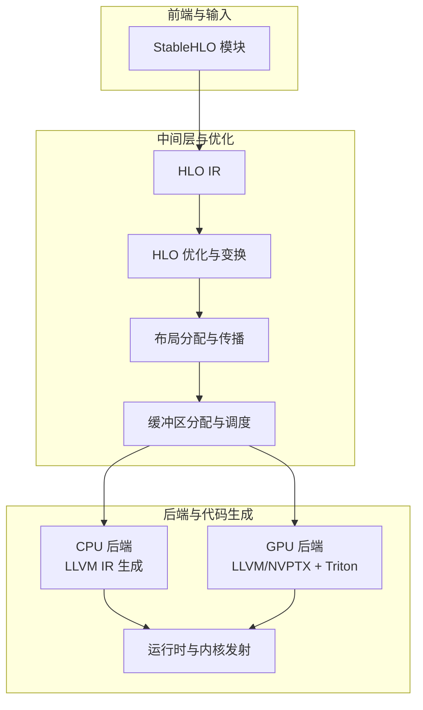
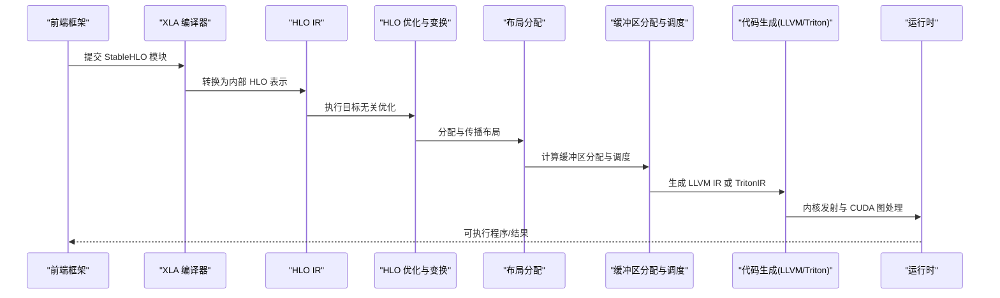
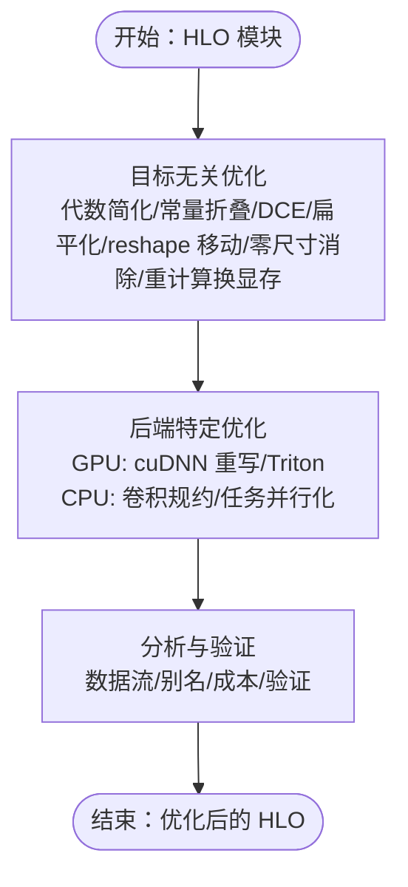
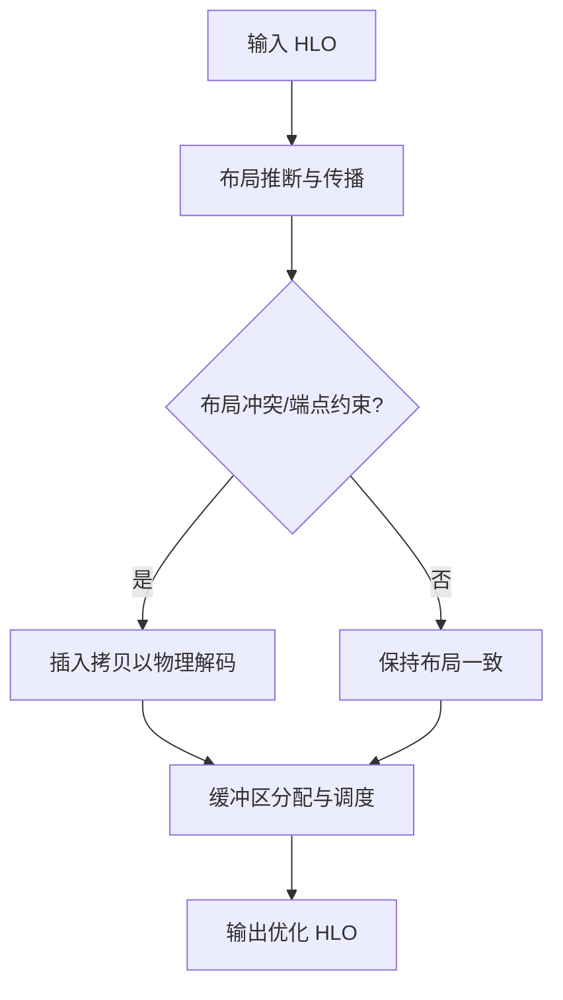
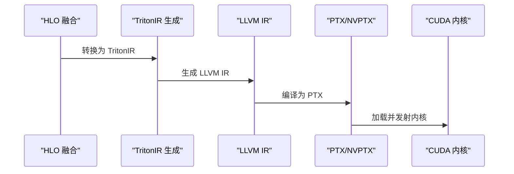
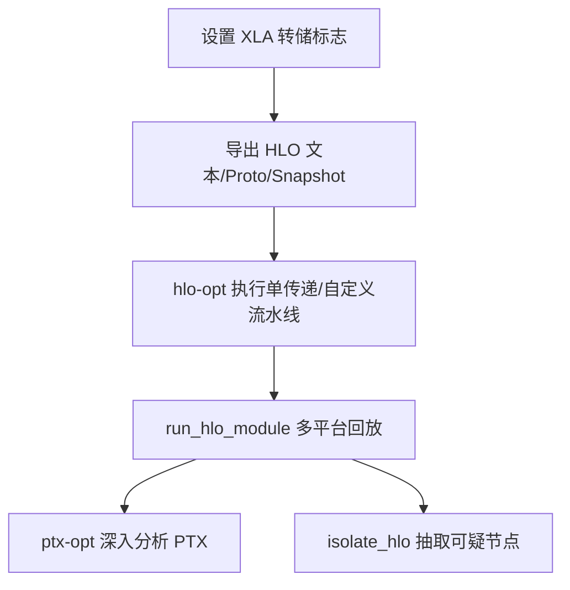
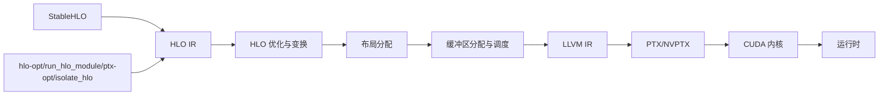

# 编译优化

<cite>
**本文引用的文件**
- [README.md](file://README.md)
- [架构总览.md](file://docs/architecture.md)
- [HLO 传递与优化.md](file://docs/hlo_passes.md)
- [GPU 架构概览.md](file://docs/gpu_architecture.md)
- [工具与命令行.md](file://docs/tools.md)
- [标志与调优指南.md](file://docs/flags_guidance.md)
- [HLO 转储与回放.md](file://docs/hlo_dumps.md)
- [广播语义.md](file://docs/broadcasting.md)
</cite>

## 目录
1. [引言](#引言)
2. [项目结构](#项目结构)
3. [核心组件](#核心组件)
4. [架构总览](#架构总览)
5. [详细组件分析](#详细组件分析)
6. [依赖关系分析](#依赖关系分析)
7. [性能考量](#性能考量)
8. [故障排查指南](#故障排查指南)
9. [结论](#结论)
10. [附录](#附录)

## 引言
本文件面向 XLA 编译优化系统，系统性梳理从 StableHLO 到目标机器码的完整编译管线，覆盖 HLO 级优化、融合策略、内存布局与调度、代码生成与内核发射、以及后端（CPU/GPU）特定优化。同时总结编译选项、性能分析与调试方法，并给出优化案例与最佳实践建议，帮助读者在不同硬件平台上实现稳定且高性能的模型执行。

## 项目结构
XLA 仓库采用模块化组织：前端通过 StableHLO 描述计算图；中间层以 HLO IR 进行跨平台优化；后端针对具体硬件（CPU/GPU/TPU 等）进行代码生成与运行时集成。关键目录与文档如下：
- docs：官方文档，涵盖架构、工具、标志、HLO 转储等
- xla/hlo：HLO IR 定义、分析与变换
- xla/codegen：低层 IR 生成与发射（LLVM/Triton）
- xla/backends：后端适配与特定优化（如 CPU/GPU）
- xla/tools：编译与调试工具链（hlo-opt、run_hlo_module 等）

章节来源
- file://README.md#L1-L50
- file://docs/architecture.md#L35-L72

## 核心组件
- HLO IR 与变换：以形状与语义为中心的中间表示，支持大量可组合的优化与变换（如代数简化、常量折叠、死代码消除、重计算换显存、布局移动、零尺寸消除等），并按后端提供专用变换（如 cuDNN 重写、卷积规约等）。
- 布局与内存：将逻辑形状与物理布局解耦，通过布局分配与传播减少不必要的拷贝；结合缓冲区分配与调度，最小化中间内存占用。
- 代码生成与发射：CPU/GPU 后端使用 LLVM 生成低层 IR 并进一步生成原生代码；GPU 后端还引入 Triton 用于复杂融合与算子的高效实现。
- 运行时：将内核调用序列转换为运行时 IR，进行 CUDA 图提取与编译，最终生成可执行体。

章节来源
- file://docs/hlo_passes.md#L48-L231
- file://docs/gpu_architecture.md#L20-L254
- file://docs/architecture.md#L43-L72

## 架构总览
下图展示从 StableHLO 到目标机器码的关键阶段与交互：

图表来源
- [架构总览.md](file://docs/architecture.md#L43-L72)
- [GPU 架构概览.md](file://docs/gpu_architecture.md#L20-L254)

章节来源
- file://docs/architecture.md#L43-L72
- file://docs/gpu_architecture.md#L20-L254

## 详细组件分析

### HLO 优化与变换
- 目标无关优化：包括代数简化、常量折叠、死代码消除、调用图扁平化、reshape/transpose 移动、零尺寸 HLO 消除、重计算换显存等，显著降低计算与内存开销。
- 后端专用优化：
  - GPU：cuDNN 融合卷积与归一化、Triton 算子生成、SPMD 分区与通信融合。
  - CPU：卷积规约到高效库路径、任务并行化、布局与数据流优化。
- 分析与验证：数据流分析、别名分析、成本分析、HLO 验证等，确保优化正确性与可预测性。

图表来源
- [HLO 传递与优化.md](file://docs/hlo_passes.md#L48-L231)

章节来源
- file://docs/hlo_passes.md#L48-L231

### 内存布局与调度
- 布局解耦：逻辑形状与物理布局分离，布局随图传播并在端点或冲突处插入拷贝。
- 调度与分配：基于未来可见的计算图，最小化中间缓冲区占用，提升内存带宽利用率。
- GPU 特例：布局选择对卷积等算子性能影响显著（如 NHWC 在 Ampere 上的偏好），融合后避免 HBM 材料化。

图表来源
- [GPU 架构概览.md](file://docs/gpu_architecture.md#L130-L154)

章节来源
- file://docs/gpu_architecture.md#L130-L154

### 融合策略与内核发射
- 融合原则：将多步算子合并为单核，避免中间张量写回 HBM，利用寄存器/共享内存传递，显著降低访存瓶颈。
- GPU 融合：复杂融合（含矩阵乘/softmax）由 Triton 将 HLO 融合转为 TritonIR，选择分块参数后生成 PTX。
- 发射与运行时：将内核调用序列转换为运行时 IR，进行 CUDA 图提取与编译，生成可执行体。

图表来源
- [GPU 架构概览.md](file://docs/gpu_architecture.md#L233-L245)

章节来源
- file://docs/gpu_architecture.md#L155-L207
- file://docs/gpu_architecture.md#L233-L245

### CPU 后端特定优化
- 卷积规约：将卷积/规约规范化为高效库路径（如 Eigen），减少手工定制算子需求。
- 任务并行化：将 HLO 划分为可并行任务，充分利用多线程资源。
- 数据布局与重计算：结合布局优化与重计算策略，在内存与计算间取得平衡。

章节来源
- file://docs/hlo_passes.md#L175-L195

### GPU 后端特定优化
- 库选择：优先使用 cuBLAS/cuDNN/NCCL 等高性能库，兼顾融合机会与性能。
- 直接代码生成：对规约、转置等操作直接生成 LLVM IR。
- Triton 生成：对复杂融合（矩阵乘/softmax）生成 TritonIR 并选择最优分块参数。
- 运行时：CUDA 图提取与编译，提升启动与调度效率。

章节来源
- file://docs/gpu_architecture.md#L217-L254

### 工具与调试流程
- HLO 转储：通过环境变量或编程接口导出 HLO 文本/Proto/Snapshot，便于问题定位与回放。
- hlo-opt：独立执行单个 HLO 传递，快速定位问题；支持列出传递、注册自定义传递、格式转换等。
- run_hlo_module：在指定平台（CPU/CUDA/Interpreter）上运行 HLO 模块并对比参考实现。
- ptx-opt：对 LLVM IR 进一步优化并生成 PTX，便于深入分析 GPU 代码质量。
- isolate_hlo：抽取可疑指令及其上下文，生成最小可复现 HLO 子模块。

图表来源
- [HLO 转储与回放.md](file://docs/hlo_dumps.md#L1-L261)
- [工具与命令行.md](file://docs/tools.md#L22-L334)

章节来源
- file://docs/hlo_dumps.md#L1-L261
- file://docs/tools.md#L22-L334

## 依赖关系分析
- 前端到中间层：StableHLO → HLO IR（语义与形状描述）
- 中间层到后端：HLO 优化/布局/调度 → 代码生成（LLVM/Triton）
- 后端到运行时：内核发射 → CUDA 图 → 可执行体
- 工具链支撑：hlo-opt/run_hlo_module/ptx-opt/isolate_hlo 串联调试与验证

图表来源
- [架构总览.md](file://docs/architecture.md#L43-L72)
- [GPU 架构概览.md](file://docs/gpu_architecture.md#L20-L254)
- [工具与命令行.md](file://docs/tools.md#L22-L334)

章节来源
- file://docs/architecture.md#L43-L72
- file://docs/gpu_architecture.md#L20-L254
- file://docs/tools.md#L22-L334

## 性能考量
- 融合优先：在内存受限场景优先考虑融合，减少 HBM 材料化；对 GPU，合理选择 Triton 分块参数以匹配硬件带宽。
- 布局优化：根据后端特性选择合适布局（如卷积 NHWC），减少物理解码与拷贝。
- 调度与内存：启用延迟隐藏调度与分析式延迟估计（GPU），在保证正确性的前提下最大化计算-通信重叠。
- 传递选择：仅启用必要的 HLO 传递，避免过度优化导致编译时间增加；对大模型优先使用单传递验证与小规模回归测试。
- 广播与形状：明确广播维度，避免隐式语义带来的额外拷贝与不必要扩展。

章节来源
- file://docs/gpu_architecture.md#L130-L171
- file://docs/flags_guidance.md#L16-L101
- file://docs/broadcasting.md#L1-L207

## 故障排查指南
- 使用 HLO 转储定位问题：在关键阶段（如 SPMD/分区相关传递）导出 HLO，结合正则过滤与最小化抽取。
- 传递级验证：借助 hlo-opt 执行单传递，快速定位引发错误或性能退化的步骤。
- 回放与对比：使用 run_hlo_module 在 CPU/Interpreter/CUDA 等平台回放，比对数值与性能差异。
- PTX 深入分析：对 GPU 问题，使用 ptx-opt 生成 PTX 并检查寄存器/共享内存使用、分支与访存模式。
- 自定义传递与测试：为新传递注册到 hlo-opt，并编写单元测试，确保回归可控。

章节来源
- file://docs/hlo_dumps.md#L76-L261
- file://docs/tools.md#L65-L334

## 结论
XLA 的编译优化体系以 HLO 为核心，通过目标无关与后端特定优化、布局与调度、以及 LLVM/Triton 代码生成与运行时发射，实现了跨 CPU/GPU/TPU 的高性能执行。配合完善的工具链与调试流程，开发者可在不同硬件平台上稳定地获得优异性能，并持续迭代优化策略。

## 附录
- 关键术语：StableHLO、HLO、布局（Layout）、缓冲区分配（Buffer Assignment）、融合（Fusion）、TritonIR、PTX/NVPTX、CUDA 图
- 推荐阅读：HLO 传递与优化、GPU 架构概览、工具与命令行、标志与调优指南、HLO 转储与回放