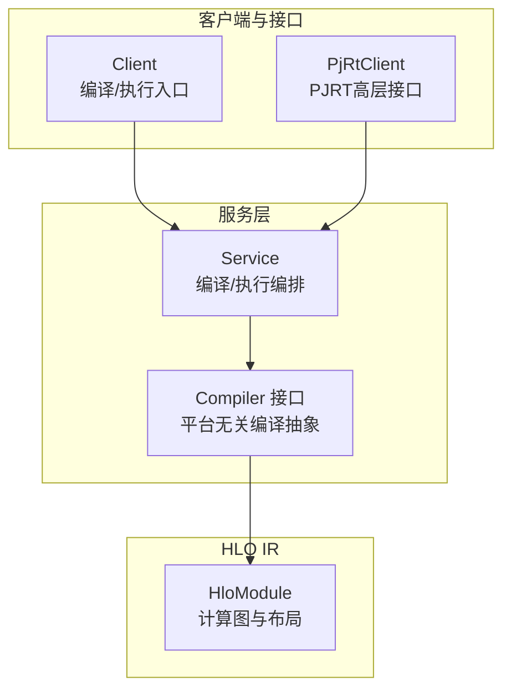
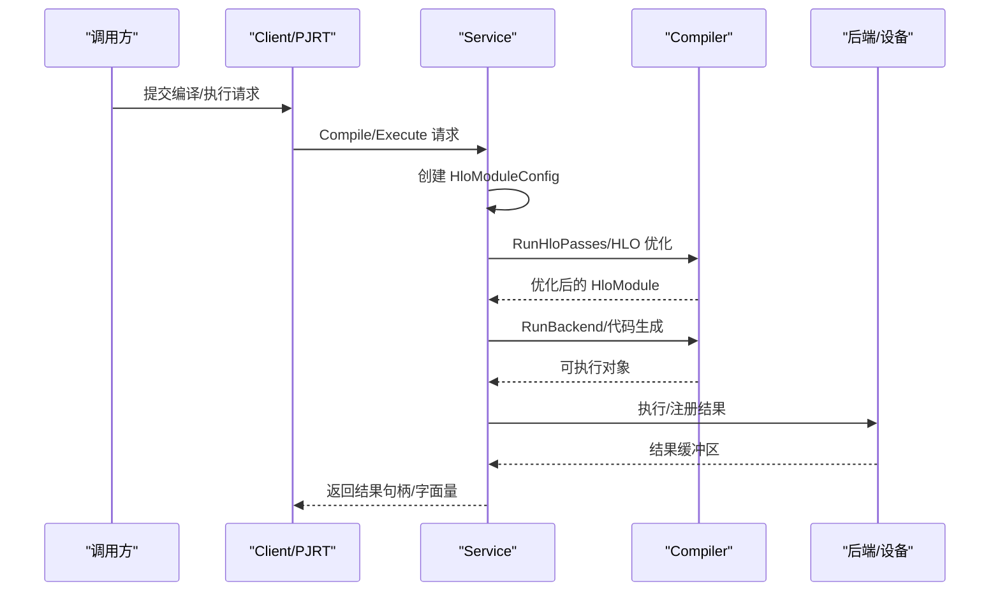
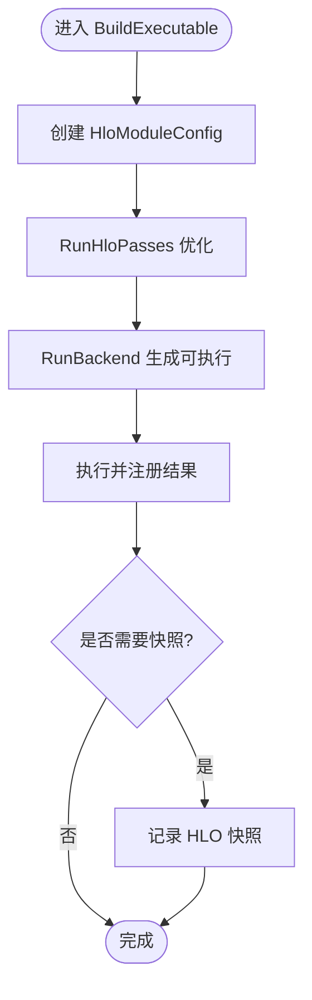
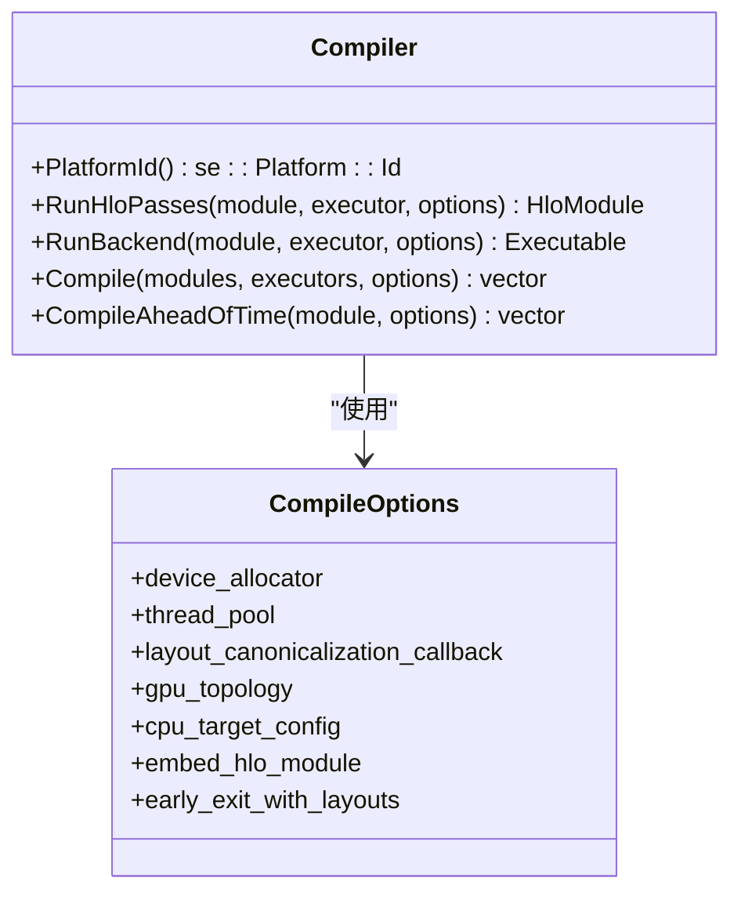
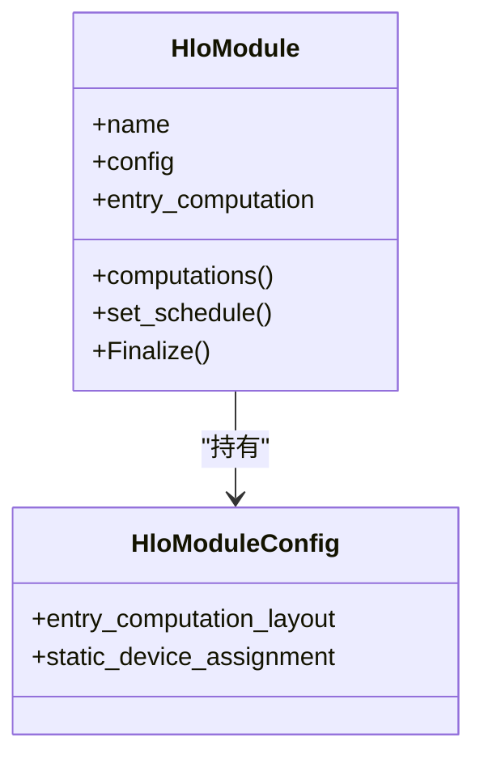
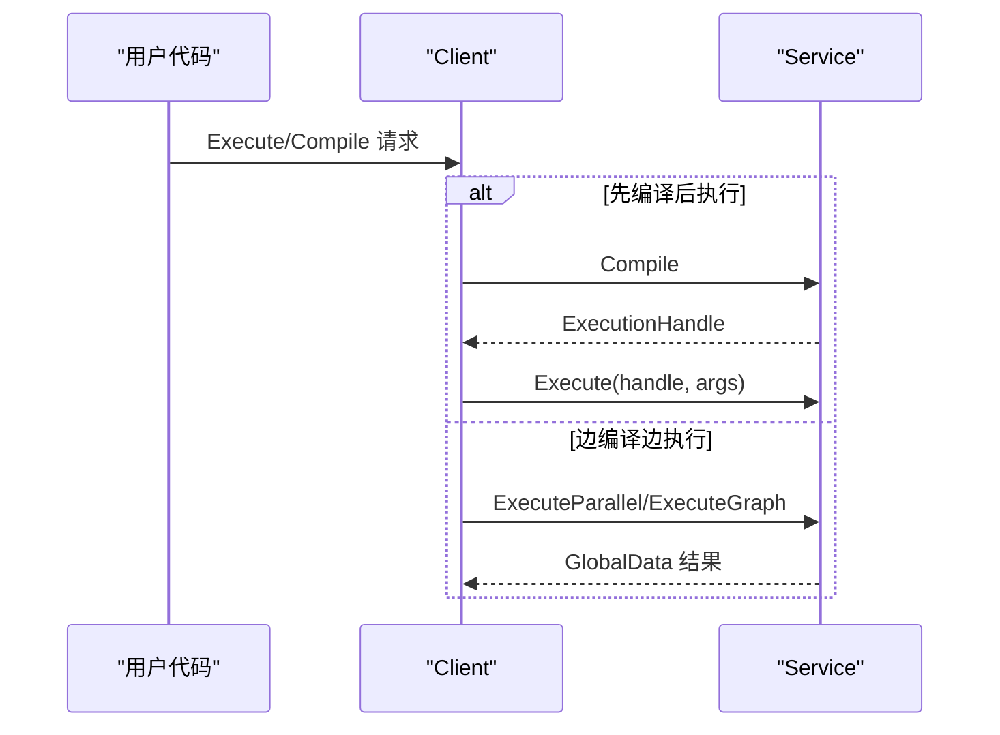
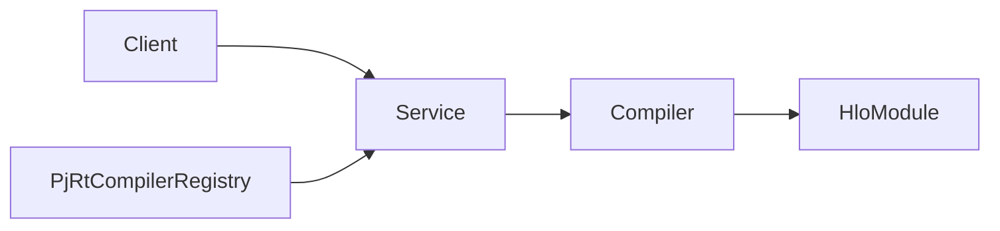
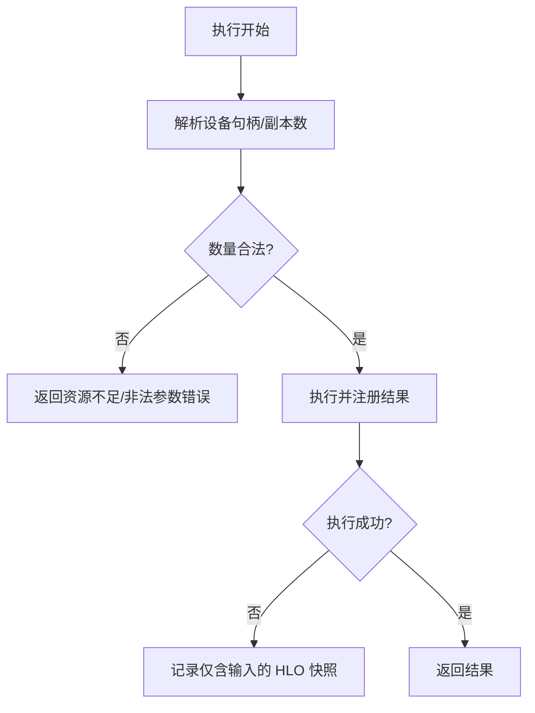

# 编译管道

<cite>
**本文引用的文件**
- [xla\service\service.cc](file://xla/service/service.cc)
- [xla\service\compiler.h](file://xla/service/compiler.h)
- [xla\hlo\ir\hlo_module.cc](file://xla/hlo/ir/hlo_module.cc)
- [xla\client\client.cc](file://xla/client/client.cc)
- [xla\pjrt\pjrt_client.cc](file://xla/pjrt/pjrt_client.cc)
- [xla\pjrt\pjrt_compiler.cc](file://xla/pjrt/pjrt_compiler.cc)
</cite>

## 目录
1. [简介](#简介)
2. [项目结构](#项目结构)
3. [核心组件](#核心组件)
4. [架构总览](#架构总览)
5. [详细组件分析](#详细组件分析)
6. [依赖关系分析](#依赖关系分析)
7. [性能考虑](#性能考虑)
8. [故障排查指南](#故障排查指南)
9. [结论](#结论)

## 简介
本文件系统性梳理 XLA 从 HLO 计算图到可执行代码的完整编译流程，覆盖编译器初始化、模块配置、缓存管理、后端选择、HLO 验证与优化、布局分配、缓冲区分配、代码生成与执行跟踪等关键环节，并给出编译选项配置、内存分配策略、错误处理机制以及性能优化与调试建议。目标是帮助读者在不深入源码细节的前提下，理解 XLA 编译管道的全貌与关键路径。

## 项目结构
围绕编译管道的核心代码主要分布在以下模块：
- 服务层：负责接收编译/执行请求、构建 HloModuleConfig、调度编译与执行、管理设备与内存。
- 编译器接口：定义平台无关的编译抽象，统一 HLO 优化与后端生成接口。
- HLO IR：描述计算图、布局、别名与缓冲区分配等信息。
- 客户端与 PJRT：提供高层编译/执行入口与跨设备/多进程编译能力。

**图表来源**
- [xla\client\client.cc](file://xla/client/client.cc#L104-L120)
- [xla\service\service.cc](file://xla/service/service.cc#L653-L690)
- [xla\service\compiler.h](file://xla/service/compiler.h#L107-L350)
- [xla\hlo\ir\hlo_module.cc](file://xla/hlo/ir/hlo_module.cc#L86-L138)

**章节来源**
- [xla\client\client.cc](file://xla/client/client.cc#L104-L120)
- [xla\service\service.cc](file://xla/service/service.cc#L143-L181)
- [xla\service\compiler.h](file://xla/service/compiler.h#L107-L350)
- [xla\hlo\ir\hlo_module.cc](file://xla/hlo/ir/hlo_module.cc#L86-L138)

## 核心组件
- 客户端接口（Client）：提供编译、执行、传输等高层操作；支持直接编译或“边编译边执行”的路径。
- 服务层（Service）：解析执行选项、创建 HloModuleConfig、调用编译器、执行与结果注册、设备与流管理。
- 编译器接口（Compiler）：定义 RunHloPasses、RunBackend、Compile、CompileAheadOfTime 等抽象，面向不同后端实现。
- HLO 模块（HloModule）：承载计算图、布局、别名与缓冲区分配等元数据，贯穿编译与执行。
- PJRT 客户端与编译器：提供多设备/多进程编译与执行能力，支持注册与变体管理。

**章节来源**
- [xla\client\client.cc](file://xla/client/client.cc#L104-L120)
- [xla\service\service.cc](file://xla/service/service.cc#L237-L265)
- [xla\service\compiler.h](file://xla/service/compiler.h#L107-L350)
- [xla\hlo\ir\hlo_module.cc](file://xla/hlo/ir/hlo_module.cc#L86-L138)
- [xla\pjrt\pjrt_client.cc](file://xla/pjrt/pjrt_client.cc#L49-L73)
- [xla\pjrt\pjrt_compiler.cc](file://xla/pjrt/pjrt_compiler.cc#L45-L127)

## 架构总览
下图展示从高层请求到可执行代码生成与执行的总体流程，包括模块配置、HLO 优化、布局与缓冲区分配、后端生成与执行跟踪。

**图表来源**
- [xla\client\client.cc](file://xla/client/client.cc#L104-L120)
- [xla\service\service.cc](file://xla/service/service.cc#L653-L690)
- [xla\service\service.cc](file://xla/service/service.cc#L627-L650)
- [xla\service\compiler.h](file://xla/service/compiler.h#L164-L190)

## 详细组件分析

### 组件A：编译与执行编排（Service）
- 模块配置创建：根据程序形状、参数形状与执行选项创建 HloModuleConfig，支持默认副本数与线程池设置。
- HLO 优化与后端：先运行 HLO 优化 Pass，再调用后端生成可执行对象；支持仅运行后端（run_backend_only）以跳过优化。
- 执行与结果注册：为每个设备分配流，构造执行选项，执行后将结果注册到全局数据表并返回句柄。
- 快照与跟踪：在需要时记录 HLO 快照（包含输入/输出），便于调试与分析。
- 设备与流管理：按设备句柄解析副本映射，借用流池进行并发执行。

**图表来源**
- [xla\service\service.cc](file://xla/service/service.cc#L237-L265)
- [xla\service\service.cc](file://xla/service/service.cc#L627-L650)
- [xla\service\service.cc](file://xla/service/service.cc#L328-L388)

**章节来源**
- [xla\service\service.cc](file://xla/service/service.cc#L237-L265)
- [xla\service\service.cc](file://xla/service/service.cc#L627-L650)
- [xla\service\service.cc](file://xla/service/service.cc#L328-L388)
- [xla\service\service.cc](file://xla/service/service.cc#L513-L566)

### 组件B：编译器接口（Compiler）
- 抽象职责：统一 HLO 层优化与低级优化/代码生成接口；面向不同平台（CPU/GPU/Interpreter 等）实现。
- 关键方法：
  - RunHloPasses：对 HloModule 运行优化 Pass。
  - RunBackend：将 HloModule 转换为可执行对象。
  - Compile：并行编译多个模块。
  - CompileAheadOfTime：提前编译为静态产物。
- 编译选项：支持设备分配器、线程池、布局规范化回调、拓扑信息、嵌入 HLO、提前退出点等。

**图表来源**
- [xla\service\compiler.h](file://xla/service/compiler.h#L107-L350)

**章节来源**
- [xla\service\compiler.h](file://xla/service/compiler.h#L107-L350)

### 组件C：HLO 模块（HloModule）
- 职责：承载计算图、入口计算、布局、别名与缓冲区分配等元数据；支持最终化、名称唯一化、拓扑排序等。
- 关键行为：替换入口计算、更新布局、建立输入输出别名配置与缓冲捐赠配置。

**图表来源**
- [xla\hlo\ir\hlo_module.cc](file://xla/hlo/ir/hlo_module.cc#L86-L138)

**章节来源**
- [xla\hlo\ir\hlo_module.cc](file://xla/hlo/ir/hlo_module.cc#L86-L138)

### 组件D：客户端与 PJRT（Client/PJRT）
- Client：提供编译、执行、常量计算、设备句柄获取等接口；支持“执行即编译”与“先编译后执行”两种路径。
- PJRT：提供更高层的缓冲区、成本分析、外部引用与异步传输等能力；支持注册编译器变体与编译器工厂。

**图表来源**
- [xla\client\client.cc](file://xla/client/client.cc#L104-L120)
- [xla\client\client.cc](file://xla/client/client.cc#L122-L169)
- [xla\service\service.cc](file://xla/service/service.cc#L431-L570)

**章节来源**
- [xla\client\client.cc](file://xla/client/client.cc#L104-L120)
- [xla\client\client.cc](file://xla/client/client.cc#L122-L169)
- [xla\pjrt\pjrt_client.cc](file://xla/pjrt/pjrt_client.cc#L49-L73)
- [xla\pjrt\pjrt_compiler.cc](file://xla/pjrt/pjrt_compiler.cc#L45-L127)

## 依赖关系分析
- 客户端通过 Service 发起编译/执行；Service 再委托 Compiler 完成 HLO 优化与后端生成。
- HloModule 作为编译与执行的载体，贯穿优化与执行阶段。
- PJRT 提供编译器注册与变体管理，支撑多平台/多变体编译。

**图表来源**
- [xla\client\client.cc](file://xla/client/client.cc#L104-L120)
- [xla\service\service.cc](file://xla/service/service.cc#L653-L690)
- [xla\service\compiler.h](file://xla/service/compiler.h#L107-L350)
- [xla\hlo\ir\hlo_module.cc](file://xla/hlo/ir/hlo_module.cc#L86-L138)
- [xla\pjrt\pjrt_compiler.cc](file://xla/pjrt/pjrt_compiler.cc#L45-L127)

**章节来源**
- [xla\client\client.cc](file://xla/client/client.cc#L104-L120)
- [xla\service\service.cc](file://xla/service/service.cc#L653-L690)
- [xla\service\compiler.h](file://xla/service/compiler.h#L107-L350)
- [xla\hlo\ir\hlo_module.cc](file://xla/hlo/ir/hlo_module.cc#L86-L138)
- [xla\pjrt\pjrt_compiler.cc](file://xla/pjrt/pjrt_compiler.cc#L45-L127)

## 性能考虑
- 并行优化与编译：通过编译选项中的线程池与设备分配器，提升优化与编译吞吐。
- 副本与流复用：服务层按设备句柄借用流池，减少同步开销。
- 提前退出与局部产物：编译选项支持在布局/缓冲区分配后提前退出，用于调试与采样。
- 嵌入 HLO 与快照：在需要时记录 HLO 快照，辅助定位性能瓶颈。
- 多设备拓扑：GPU/AOT 编译选项支持拓扑信息，有助于生成更优内核。

**章节来源**
- [xla\service\compiler.h](file://xla/service/compiler.h#L123-L155)
- [xla\service\service.cc](file://xla/service/service.cc#L355-L368)
- [xla\service\service.cc](file://xla/service/service.cc#L513-L566)

## 故障排查指南
- 形状与布局不匹配：执行前会校验参数形状与布局，不一致将返回错误。
- 设备句柄与副本数：请求中设备句柄数量与副本数需满足可用设备数量约束。
- 执行失败快照：若执行失败，服务层会记录仅含输入的 HLO 快照，便于回溯。
- 错误传播：客户端与服务层均使用状态返回值，建议在上层捕获并记录详细上下文。

**图表来源**
- [xla\service\service.cc](file://xla/service/service.cc#L390-L413)
- [xla\service\service.cc](file://xla/service/service.cc#L431-L570)
- [xla\service\service.cc](file://xla/service/service.cc#L513-L566)

**章节来源**
- [xla\service\service.cc](file://xla/service/service.cc#L205-L216)
- [xla\service\service.cc](file://xla/service/service.cc#L390-L413)
- [xla\service\service.cc](file://xla/service/service.cc#L513-L566)

## 结论
XLA 编译管道以 Service 为核心编排层，借助 Compiler 抽象统一 HLO 优化与后端生成，HloModule 作为中间表示贯穿全流程。客户端与 PJRT 提供高层入口与多平台扩展能力。通过合理的模块配置、并行优化、流复用与快照机制，可在保证正确性的前提下获得良好的性能与可观测性。实际工程中应结合编译选项与调试工具，针对具体后端与拓扑进行针对性优化。