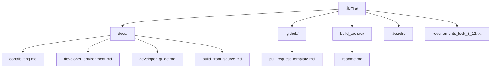
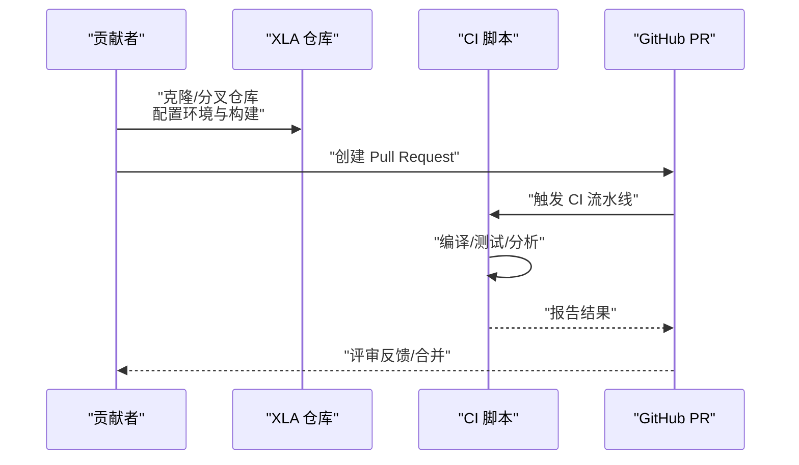
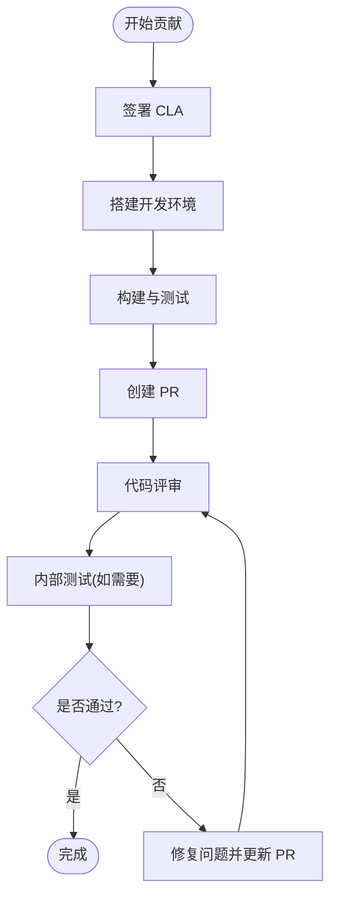
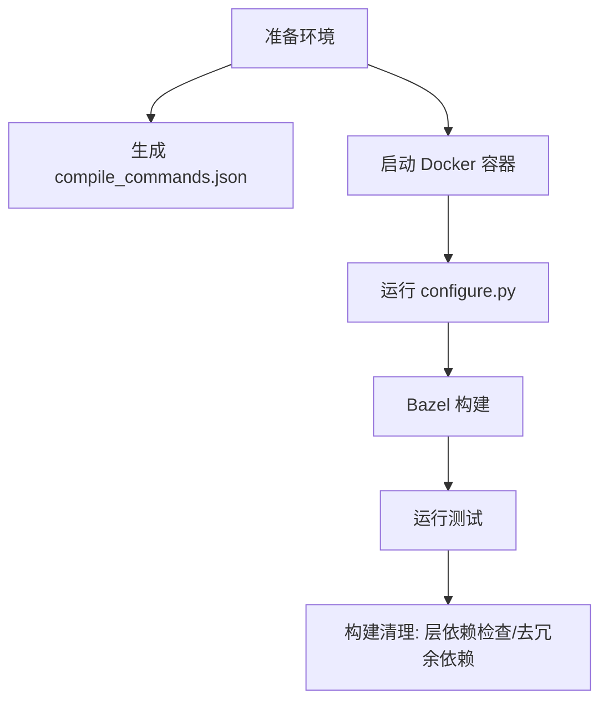
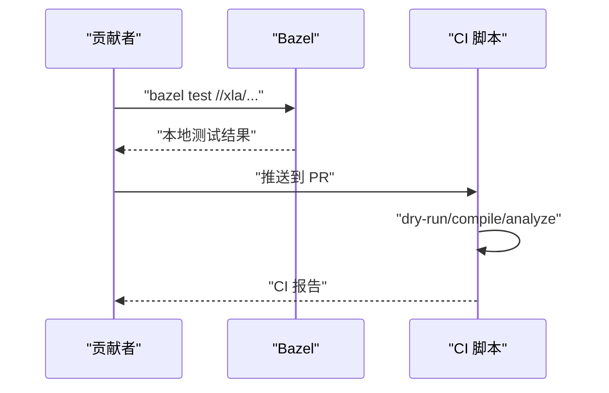
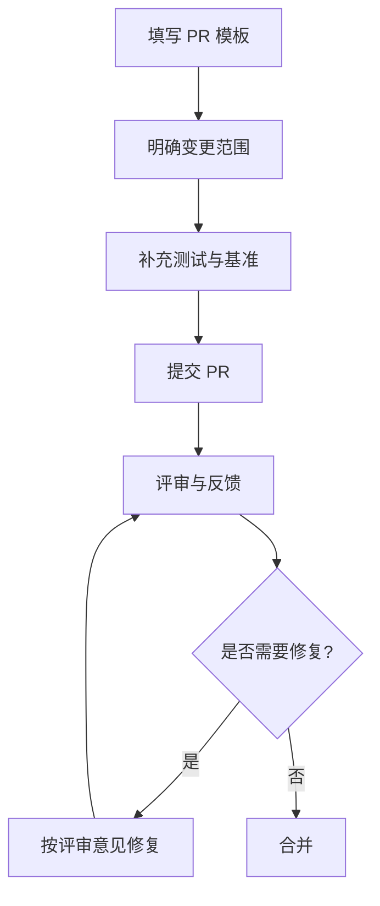
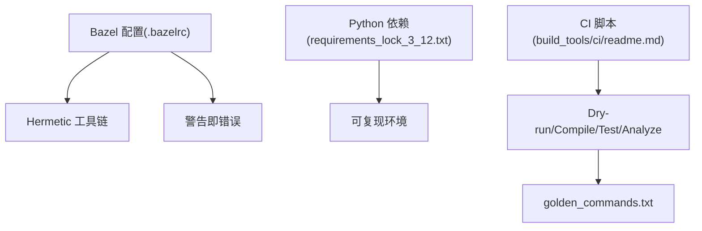

# 贡献指南

<cite>
**本文引用的文件**
- [CONTRIBUTING.md](file://CONTRIBUTING.md)
- [README.md](file://README.md)
- [docs/contributing.md](file://docs/contributing.md)
- [.github/pull_request_template.md](file://.github/pull_request_template.md)
- [docs/developer_environment.md](file://docs/developer_environment.md)
- [docs/developer_guide.md](file://docs/developer_guide.md)
- [docs/build_from_source.md](file://docs/build_from_source.md)
- [build_tools/ci/readme.md](file://build_tools/ci/readme.md)
- [.bazelrc](file://.bazelrc)
- [requirements_lock_3_12.txt](file://requirements_lock_3_12.txt)
</cite>

## 目录
1. [简介](#简介)
2. [项目结构](#项目结构)
3. [核心组件](#核心组件)
4. [架构总览](#架构总览)
5. [详细组件分析](#详细组件分析)
6. [依赖分析](#依赖分析)
7. [性能考虑](#性能考虑)
8. [故障排查指南](#故障排查指南)
9. [结论](#结论)
10. [附录](#附录)

## 简介
本指南面向希望参与 OpenXLA/XLA 项目的贡献者，覆盖从环境搭建、开发流程、代码与文档贡献、测试与评审到社区行为准则的完整路径。无论你是首次贡献还是资深开发者，都可以在此找到清晰的步骤与最佳实践。

## 项目结构
围绕“贡献”主题，仓库中与贡献直接相关的关键位置如下：
- 文档与指南：docs/ 目录下包含贡献、开发者环境、开发者指南、从源码构建等文档
- 提交模板：.github/pull_request_template.md
- CI/CI 工具：build_tools/ci/ 目录下的脚本与说明
- 构建配置：.bazelrc、requirements_lock_3_12.txt 等
- 根级入口：CONTRIBUTING.md、README.md 指向相应文档

图表来源
- [docs/contributing.md](file://docs/contributing.md#L1-L220)
- [docs/developer_environment.md](file://docs/developer_environment.md#L1-L71)
- [docs/developer_guide.md](file://docs/developer_guide.md#L1-L133)
- [docs/build_from_source.md](file://docs/build_from_source.md#L1-L184)
- [.github/pull_request_template.md](file://.github/pull_request_template.md#L1-L25)
- [build_tools/ci/readme.md](file://build_tools/ci/readme.md#L1-L40)
- [.bazelrc](file://.bazelrc#L1-L21)
- [requirements_lock_3_12.txt](file://requirements_lock_3_12.txt#L1-L116)

章节来源
- [README.md](file://README.md#L1-L50)
- [CONTRIBUTING.md](file://CONTRIBUTING.md#L1-L5)

## 核心组件
- 贡献流程与评审：贡献类型、CLAs、行为准则、评审流程与要求
- 开发环境与构建：Docker 容器、Bazel 配置、Hermetic CUDA、编译命令生成
- 测试与基准：单元测试、执行测试、性能提升需包含基准结果
- 提交流程：PR 模板、变更范围控制、避免“范围蔓延”
- 常见问题：基础设施变更、Follow-up PR 的限制

章节来源
- [docs/contributing.md](file://docs/contributing.md#L18-L220)
- [docs/developer_environment.md](file://docs/developer_environment.md#L1-L71)
- [docs/developer_guide.md](file://docs/developer_guide.md#L1-L133)
- [.github/pull_request_template.md](file://.github/pull_request_template.md#L1-L25)

## 架构总览
下图展示了从“本地开发”到“CI 验证”的整体流程，帮助你理解贡献链路中的关键节点与交互。

图表来源
- [docs/developer_guide.md](file://docs/developer_guide.md#L18-L133)
- [build_tools/ci/readme.md](file://build_tools/ci/readme.md#L1-L40)
- [.github/pull_request_template.md](file://.github/pull_request_template.md#L1-L25)

## 详细组件分析

### 贡献流程与评审
- 贡献类型：回答问题、改进文档、代码贡献、生态扩展
- CLA 与行为准则：签署贡献者许可协议；遵循 TensorFlow 社区行为准则
- 评审流程：所有提交均需评审；提交前必须满足编码规范与测试要求；避免评审过程中的范围蔓延
- 内部测试：可能包含内部测试环节，评审人会沟通需要修复的问题

图表来源
- [docs/contributing.md](file://docs/contributing.md#L18-L220)

章节来源
- [docs/contributing.md](file://docs/contributing.md#L18-L220)

### 开发环境与构建
- LSP 与 clangd：生成 compile_commands.json 以支持编辑器智能提示
- 构建清理：层依赖检查、移除 BUILD 文件中的未使用依赖
- Docker 容器：ml-build 镜像用于 CPU/GPU 构建；可启用 GPU 访问
- Bazel 配置：Hermetic CUDA 规则、警告即错误、导入 TensorFlow bazelrc
- 从源码构建：Linux 下 CPU/GPU 支持、无 Docker 的本地构建方式

图表来源
- [docs/developer_environment.md](file://docs/developer_environment.md#L1-L71)
- [docs/build_from_source.md](file://docs/build_from_source.md#L1-L184)
- [.bazelrc](file://.bazelrc#L1-L21)

章节来源
- [docs/developer_environment.md](file://docs/developer_environment.md#L1-L71)
- [docs/build_from_source.md](file://docs/build_from_source.md#L1-L184)
- [.bazelrc](file://.bazelrc#L1-L21)

### 测试与基准
- 单元测试：变更应包含适当的单元测试；避免依赖特定硬件时序；优先使用 mocks/fakes
- 执行测试：端到端执行测试验证优化正确性；建议最多使用 2 张 GPU
- 性能改进：在标题中包含基准结果，使用公共 HLO 基准进行测量
- CI 行为：CI 包含 dry-run/compile/analyze 等阶段；命令变更会生成 golden_commands.txt 以便追踪

图表来源
- [.github/pull_request_template.md](file://.github/pull_request_template.md#L12-L24)
- [build_tools/ci/readme.md](file://build_tools/ci/readme.md#L1-L40)

章节来源
- [.github/pull_request_template.md](file://.github/pull_request_template.md#L1-L25)
- [build_tools/ci/readme.md](file://build_tools/ci/readme.md#L1-L40)

### 提交流程与规范
- PR 模板字段：变更摘要、动机、贡献类型、基准、单元测试、执行测试
- 变更范围：避免评审过程中扩大范围；必要时拆分为多个变更
- Follow-up PR：一般不允许作者以后续 PR 的形式解决当前评审意见

图表来源
- [.github/pull_request_template.md](file://.github/pull_request_template.md#L1-L25)
- [docs/contributing.md](file://docs/contributing.md#L140-L220)

章节来源
- [.github/pull_request_template.md](file://.github/pull_request_template.md#L1-L25)
- [docs/contributing.md](file://docs/contributing.md#L140-L220)

### 不同类型贡献的要求与流程
- 代码贡献：遵循编码风格、保持变更紧凑、提供测试与基准、通过评审与 CI
- 文档贡献：改进或扩展文档，确保与现有风格一致
- 测试贡献：新增或完善单元/执行测试，避免硬件时序依赖
- 设计贡献：在评审前充分沟通设计动机与影响面，必要时提供草图或说明

章节来源
- [docs/contributing.md](file://docs/contributing.md#L110-L138)

## 依赖分析
- 构建系统：Bazel 配置、Hermetic 工具链、警告即错误策略
- Python 运行时依赖：requirements_lock_3_12.txt 固定版本，确保可复现性
- CI：CI 脚本负责 dry-run/compile/test/analyze 流程，并生成 golden_commands.txt 用于命令变更追踪

图表来源
- [.bazelrc](file://.bazelrc#L1-L21)
- [requirements_lock_3_12.txt](file://requirements_lock_3_12.txt#L1-L116)
- [build_tools/ci/readme.md](file://build_tools/ci/readme.md#L1-L40)

章节来源
- [.bazelrc](file://.bazelrc#L1-L21)
- [requirements_lock_3_12.txt](file://requirements_lock_3_12.txt#L1-L116)
- [build_tools/ci/readme.md](file://build_tools/ci/readme.md#L1-L40)

## 性能考虑
- 将性能改进与基准结果一起提交，使用公共 HLO 基准进行测量
- 在 PR 标题中明确性能收益，便于评审快速评估
- 避免引入非必要的硬件时序依赖，确保测试可复现

章节来源
- [.github/pull_request_template.md](file://.github/pull_request_template.md#L12-L14)
- [docs/contributing.md](file://docs/contributing.md#L125-L134)

## 故障排查指南
- 编辑器 LSP 无法工作：确认已生成 compile_commands.json 并使用 clangd
- 依赖问题：使用构建清理工具移除未使用的 BUILD 依赖，减少耦合
- CI 失败：检查 dry-run/compile/test 步骤输出，关注 golden_commands.txt 中的命令变化
- Docker/GPU：若无 GPU，手动指定 CUDA 计算能力；或使用 Hermetic CUDA 规则在无驱动环境下构建

章节来源
- [docs/developer_environment.md](file://docs/developer_environment.md#L15-L71)
- [build_tools/ci/readme.md](file://build_tools/ci/readme.md#L1-L40)
- [docs/build_from_source.md](file://docs/build_from_source.md#L70-L118)

## 结论
通过遵循本指南，你可以高效地完成从环境搭建到代码评审与合并的全流程。请始终关注测试与基准、评审反馈与社区行为准则，共同维护高质量的开源协作生态。

## 附录
- 新手入门建议：先阅读贡献与开发者指南，再逐步尝试小改动与测试用例
- 常见问题：基础设施变更属于常规职责；Follow-up PR 一般不允许，需在原 PR 中解决

章节来源
- [docs/contributing.md](file://docs/contributing.md#L166-L220)
- [docs/developer_guide.md](file://docs/developer_guide.md#L1-L133)