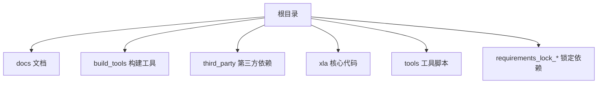
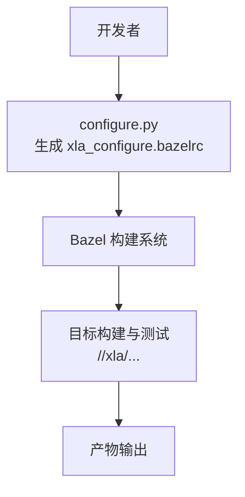
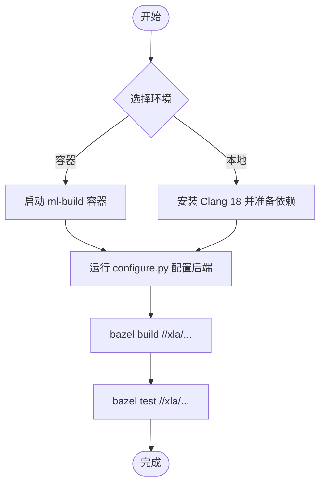
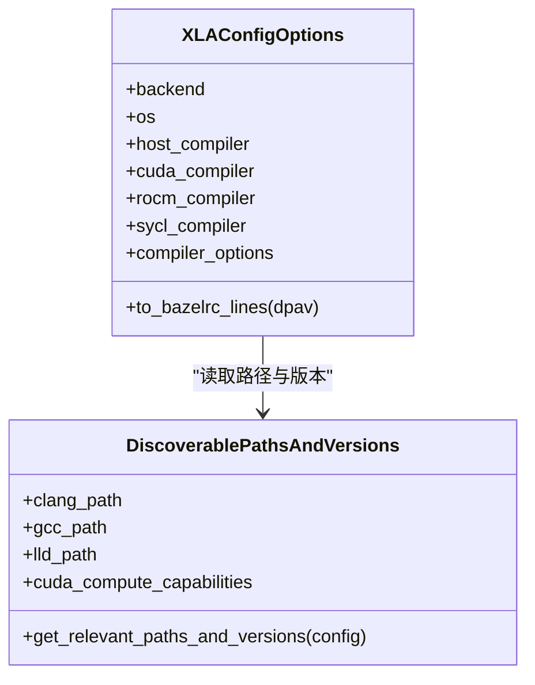
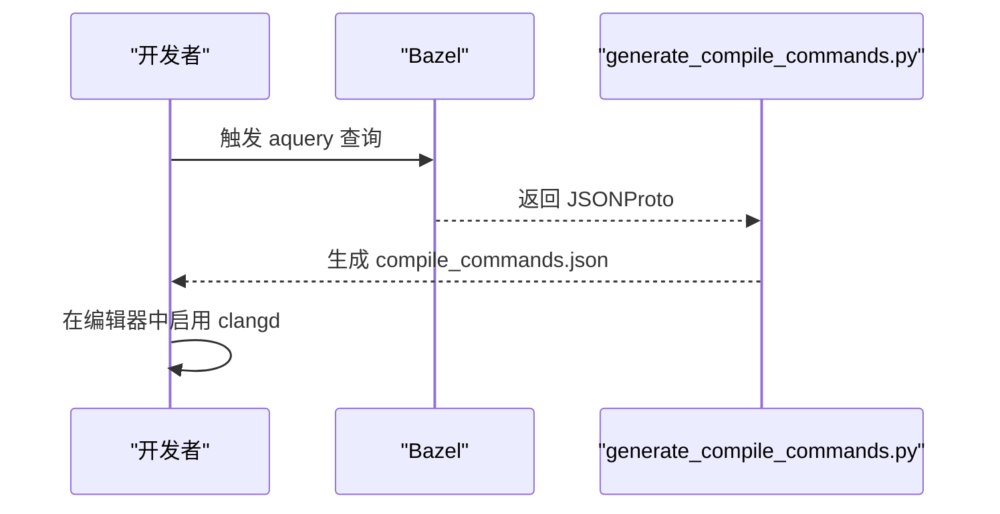
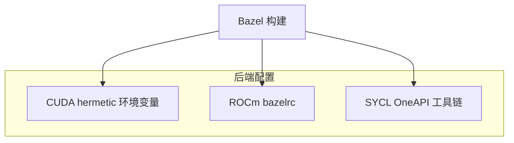
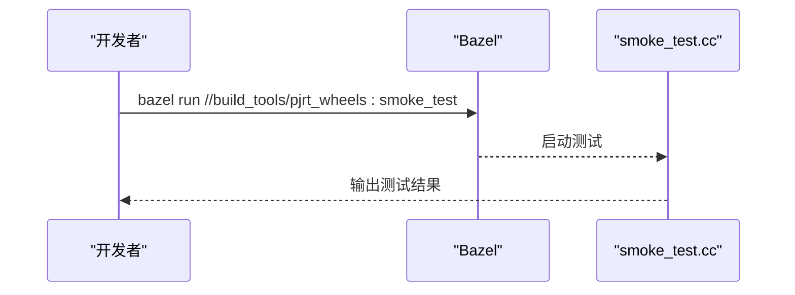
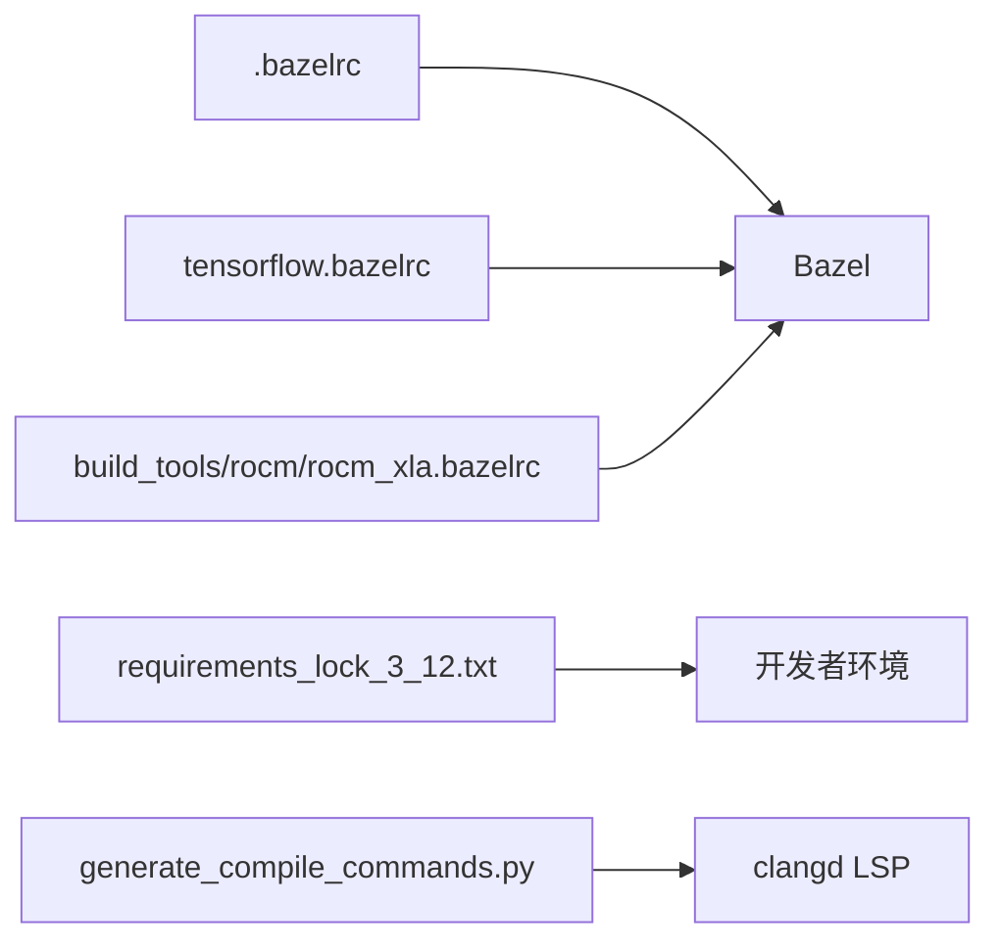

# 快速开始

<cite>
**本文引用的文件**
- [README.md](file://README.md)
- [docs/build_from_source.md](file://docs/build_from_source.md)
- [docs/developer_environment.md](file://docs/developer_environment.md)
- [build_tools/configure/configure.py](file://build_tools/configure/configure.py)
- [requirements_lock_3_12.txt](file://requirements_lock_3_12.txt)
- [build_tools/lint/generate_compile_commands.py](file://build_tools/lint/generate_compile_commands.py)
- [.bazelrc](file://.bazelrc)
- [tensorflow.bazelrc](file://tensorflow.bazelrc)
- [build_tools/rocm/rocm_xla.bazelrc](file://build_tools/rocm/rocm_xla.bazelrc)
- [build_tools/sycl/build.sh](file://build_tools/sycl/build.sh)
- [build_tools/sycl/install_oneapi.sh](file://build_tools/sycl/install_oneapi.sh)
- [build_tools/pjrt_wheels/smoke_test.cc](file://build_tools/pjrt_wheels/smoke_test.cc)
- [xla/examples/README.md](file://xla/examples/README.md)
</cite>

## 目录
1. [简介](#简介)
2. [项目结构](#项目结构)
3. [核心组件](#核心组件)
4. [架构总览](#架构总览)
5. [详细组件分析](#详细组件分析)
6. [依赖关系分析](#依赖关系分析)
7. [性能考虑](#性能考虑)
8. [故障排除指南](#故障排除指南)
9. [结论](#结论)
10. [附录](#附录)

## 简介
本指南面向希望在本地或容器环境中从源码构建与验证 XLA 的开发者，帮助你在最短时间内完成环境准备、依赖安装、配置与编译，并通过简单示例确认 XLA 可用性。XLA 是一个开源的机器学习（ML）编译器，支持在 GPU、CPU 和各类加速器上进行高性能执行优化。

## 项目结构
仓库采用模块化组织方式，核心目录与用途概览如下：
- docs：官方文档，包含从源码构建、开发者环境设置等指南
- build_tools：构建与配置工具集，如 configure 脚本、CI 构建脚本、LSP 工具等
- third_party：第三方依赖与补丁
- xla：XLA 核心实现与后端（CPU/GPU/解释器等）
- tools：CI/工具链相关脚本
- requirements_lock_*：Python 依赖锁定清单

[本图为概念性结构示意，不直接映射到具体源文件，故无图示来源]

## 核心组件
- 配置与构建系统
  - 使用 Bazel 进行构建，配置由 .bazelrc 与 configure.py 生成的 xla_configure.bazelrc 共同决定
  - 支持多后端：CPU、CUDA、ROCm、SYCL
- 开发者环境
  - 提供 LSP（clangd）集成与 compile_commands.json 生成脚本
  - 提供构建清理与依赖检查工具链（如 bant、buildozer）

**章节来源**
- file://docs/build_from_source.md#L1-L184
- file://docs/developer_environment.md#L1-L71

## 架构总览
下图展示了从源码到可执行产物的关键流程：开发者通过 configure.py 生成配置文件，随后使用 Bazel 执行构建与测试。

**图示来源**
- [build_tools/configure/configure.py](file://build_tools/configure/configure.py#L574-L625)
- [docs/build_from_source.md](file://docs/build_from_source.md#L10-L61)

**章节来源**
- file://docs/build_from_source.md#L1-L184
- file://build_tools/configure/configure.py#L574-L625

## 详细组件分析

### 组件一：从源码构建 XLA
- Linux 环境建议使用 ml-build 容器镜像，内置 Clang 18，便于一致化构建
- CPU 支持：可通过 Docker 或本地 Clang 18 构建；本地需自行安装 Clang
- GPU 支持：推荐使用 ml-build 容器并启用 --gpus all；也可在无 GPU 机器上指定 CUDA 计算能力
- 可选：使用 JAX CI/Release 容器复现与 JAX/XLA 一致的构建配置

**图示来源**
- [docs/build_from_source.md](file://docs/build_from_source.md#L20-L114)

**章节来源**
- file://docs/build_from_source.md#L8-L114

### 组件二：配置脚本 configure.py
- 功能：根据后端类型与编译器选择，生成 Bazel 配置文件
- 支持后端：CPU、CUDA、ROCm、SYCL
- 自动检测：Clang/GCC 版本、CUDA 计算能力、链接器路径等
- 输出：写入 xla_configure.bazelrc，供 Bazel 读取

**图示来源**
- [build_tools/configure/configure.py](file://build_tools/configure/configure.py#L299-L473)

**章节来源**
- file://build_tools/configure/configure.py#L16-L625

### 组件三：开发者环境与 LSP 集成
- LSP（clangd）：通过生成 compile_commands.json，配合编辑器实现跳转、补全与错误提示
- 构建清理：使用 bant 与 buildozer 移除 BUILD 文件中的未使用依赖
- Layering 检查：启用 --features=layering_check，避免通过传递依赖误用头文件

**图示来源**
- [docs/developer_environment.md](file://docs/developer_environment.md#L15-L22)
- [build_tools/lint/generate_compile_commands.py](file://build_tools/lint/generate_compile_commands.py#L106-L131)

**章节来源**
- file://docs/developer_environment.md#L1-L71
- file://build_tools/lint/generate_compile_commands.py#L106-L131

### 组件四：后端与工具链配置
- CUDA：通过 hermetic 环境变量控制 CUDA/cuDNN 版本与计算能力
- ROCm：提供专用 bazelrc 与配置脚本
- SYCL：提供 OneAPI 安装与构建脚本

**图示来源**
- [docs/build_from_source.md](file://docs/build_from_source.md#L390-L414)
- [build_tools/rocm/rocm_xla.bazelrc](file://build_tools/rocm/rocm_xla.bazelrc)
- [build_tools/sycl/install_oneapi.sh](file://build_tools/sycl/install_oneapi.sh)

**章节来源**
- file://docs/build_from_source.md#L389-L442
- file://build_tools/rocm/rocm_xla.bazelrc
- file://build_tools/sycl/install_oneapi.sh

### 组件五：Hello World 示例与基本测试
- 基础示例：仓库未提供独立 Hello World 源码，但可通过以下方式快速验证
  - 使用现有工具：运行 smoke_test.cc 进行 PJRT 轮子的基本自检
  - 运行单元测试：bazel test //xla/tests/... 验证核心功能
- Python 依赖：参考 requirements_lock_3_12.txt 安装 NumPy、lit、ml-dtypes 等

**图示来源**
- [build_tools/pjrt_wheels/smoke_test.cc](file://build_tools/pjrt_wheels/smoke_test.cc)
- [requirements_lock_3_12.txt](file://requirements_lock_3_12.txt#L1-L116)

**章节来源**
- file://build_tools/pjrt_wheels/smoke_test.cc
- file://requirements_lock_3_12.txt#L1-L116

## 依赖关系分析
- 构建系统
  - .bazelrc 与 tensorflow.bazelrc 提供全局构建选项与平台配置
  - 不同后端通过各自 bazelrc 注入特定开关与环境变量
- 语言与工具
  - Python 依赖通过 requirements_lock_3_12.txt 固定版本
  - LSP 依赖 compile_commands.json 生成脚本

**图示来源**
- [.bazelrc](file://.bazelrc)
- [tensorflow.bazelrc](file://tensorflow.bazelrc)
- [build_tools/rocm/rocm_xla.bazelrc](file://build_tools/rocm/rocm_xla.bazelrc)
- [requirements_lock_3_12.txt](file://requirements_lock_3_12.txt#L1-L116)
- [build_tools/lint/generate_compile_commands.py](file://build_tools/lint/generate_compile_commands.py#L106-L131)

**章节来源**
- file://.bazelrc
- file://tensorflow.bazelrc
- file://build_tools/rocm/rocm_xla.bazelrc
- file://requirements_lock_3_12.txt#L1-L116
- file://build_tools/lint/generate_compile_commands.py#L106-L131

## 性能考虑
- 使用容器镜像（如 ml-build）可减少环境差异带来的性能波动
- 通过 hermetic 环境变量固定 CUDA/cuDNN 版本，确保构建一致性
- 在本地构建时优先使用 Clang 18，以匹配 CI 默认工具链

[本节为通用建议，无需列出章节来源]

## 故障排除指南
- 无法找到 nvidia-smi 或计算能力查询失败
  - 若无 GPU，需手动指定 CUDA 计算能力
  - 参考：CUDA 计算能力自动检测与手动传参
- 编译器版本不匹配
  - 确保使用 Clang 18（或兼容版本），并在 configure.py 中正确识别
- LSP/clangd 无法解析头文件
  - 重新生成 compile_commands.json 并重启编辑器
- 依赖缺失导致构建失败
  - 按 requirements_lock_3_12.txt 安装所需 Python 包

**章节来源**
- file://build_tools/configure/configure.py#L89-L117
- file://docs/developer_environment.md#L15-L22
- file://requirements_lock_3_12.txt#L1-L116

## 结论
通过本指南，你可以在本地或容器环境中快速完成 XLA 的从源码构建与验证。建议优先使用容器镜像与 configure.py 自动生成配置，随后运行 smoke 测试确认可用性。若遇到问题，可依据“故障排除指南”逐项排查。

[本节为总结性内容，无需列出章节来源]

## 附录

### A. 快速操作清单
- 准备环境：Docker 或 Clang 18
- 生成配置：运行 configure.py 指定后端
- 构建与测试：bazel build //xla/... 与 bazel test //xla/...
- 验证示例：bazel run //build_tools/pjrt_wheels:smoke_test
- 生成 LSP：使用 generate_compile_commands.py 生成 compile_commands.json

**章节来源**
- file://docs/build_from_source.md#L10-L114
- file://build_tools/configure/configure.py#L574-L625
- file://build_tools/pjrt_wheels/smoke_test.cc
- file://docs/developer_environment.md#L15-L22