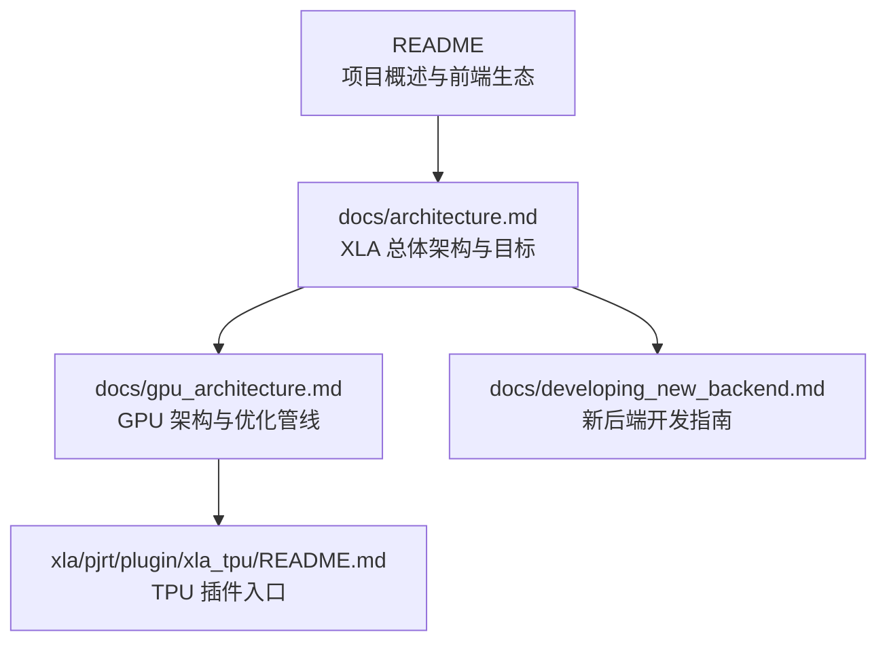
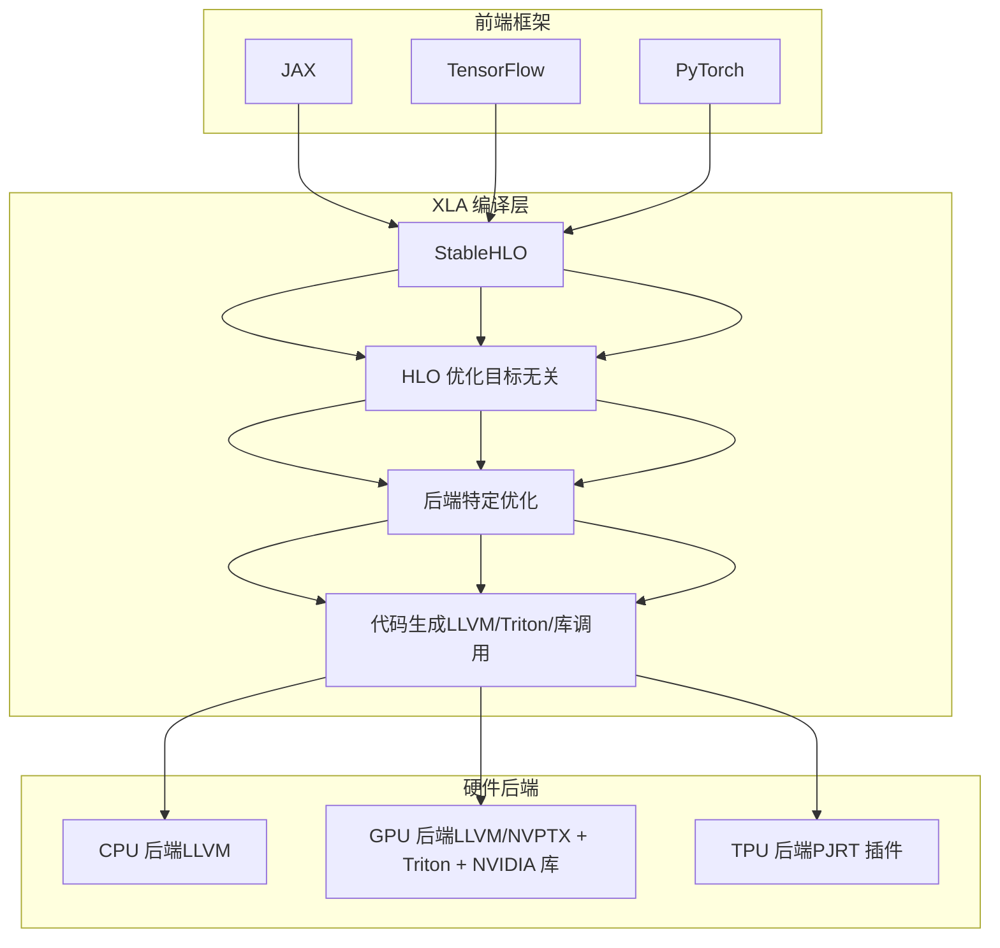
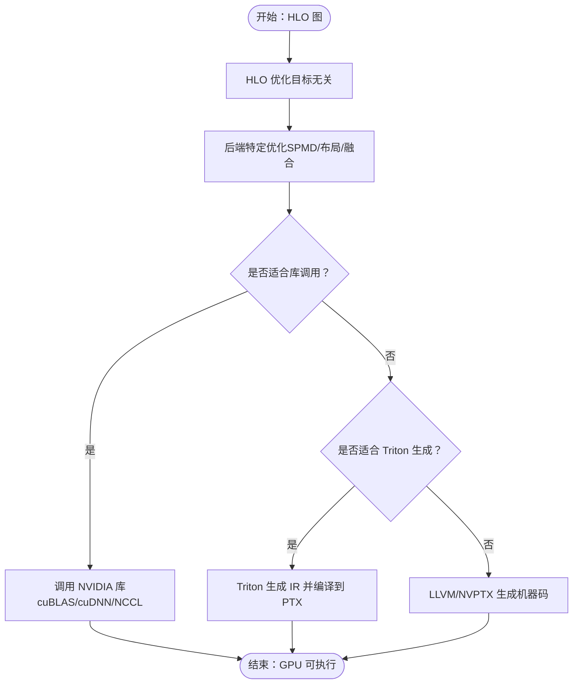
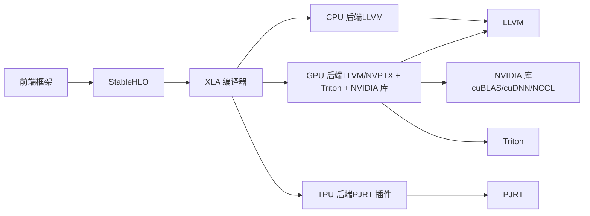

# 支持的硬件平台

<cite>
**本文引用的文件**
- [README.md](file://README.md)
- [architecture.md](file://docs/architecture.md)
- [gpu_architecture.md](file://docs/gpu_architecture.md)
- [developing_new_backend.md](file://docs/developing_new_backend.md)
- [xla_tpu/README.md](file://xla/pjrt/plugin/xla_tpu/README.md)
</cite>

## 目录
1. [简介](#简介)
2. [项目结构](#项目结构)
3. [核心组件](#核心组件)
4. [架构总览](#架构总览)
5. [详细组件分析](#详细组件分析)
6. [依赖分析](#依赖分析)
7. [性能考虑](#性能考虑)
8. [故障排查指南](#故障排查指南)
9. [结论](#结论)
10. [附录](#附录)

## 简介
本文件系统性梳理 XLA 当前支持的硬件平台与适配方式，覆盖 CPU、GPU（NVIDIA/AMD）、以及 TPU 的特性、优化策略与适用场景。结合仓库中的架构文档与后端开发指南，解释 XLA 在不同硬件上的编译与运行路径、内存模型、并行化策略、指令集利用与库选择机制，并给出硬件兼容性矩阵与选型建议。

## 项目结构
围绕“硬件平台支持”的主题，以下文件是理解 XLA 硬件适配的关键：
- 概览与目标：用于理解 XLA 的整体目标与跨平台设计原则
- 架构与编译管线：描述从 StableHLO 到目标机器码的流程，以及后端可插拔的设计
- GPU 架构与优化：详述 GPU 后端的代码生成策略、库选择与 Triton 集成
- 新后端开发指南：说明如何为新硬件实现后端，涵盖 LLVM 与非 LLVM 场景
- TPU 插件入口：说明通过 PJRT 访问 XLA:TPU 的方式

**图示来源**
- [README.md](file://README.md#L1-L50)
- [architecture.md](file://docs/architecture.md#L1-L72)
- [gpu_architecture.md](file://docs/gpu_architecture.md#L1-L254)
- [developing_new_backend.md](file://docs/developing_new_backend.md#L1-L77)
- [xla_tpu/README.md](file://xla/pjrt/plugin/xla_tpu/README.md#L1-L2)

**章节来源**
- [README.md](file://README.md#L1-L50)
- [architecture.md](file://docs/architecture.md#L1-L72)

## 核心组件
- 编译器前端与中间表示
  - 前端框架（如 JAX、TensorFlow、PyTorch）将模型转换为 StableHLO，作为跨框架的统一 IR。
  - XLA 在 HLO 层执行与目标无关的优化（如公共子表达式消除、融合、布局分配），随后进入后端特定优化与代码生成。
- 后端与代码生成
  - CPU/GPU 后端使用 LLVM 进行低层 IR 优化与机器码生成；GPU 后端还集成 NVIDIA 库（cuBLAS/cuDNN/NCCL）与 Triton 以生成高性能核。
  - TPU 通过 PJRT 插件暴露能力，供前端调用。
- 运行时与设备抽象
  - 通过 StreamExecutor 抽象设备资源与操作；PJRT 提供统一的设备访问接口与执行环境。

**章节来源**
- [architecture.md](file://docs/architecture.md#L35-L72)
- [gpu_architecture.md](file://docs/gpu_architecture.md#L20-L254)
- [developing_new_backend.md](file://docs/developing_new_backend.md#L1-L77)

## 架构总览
下图展示了 XLA 在不同硬件平台上的通用编译与执行路径，以及关键优化点与库选择策略。

**图示来源**
- [architecture.md](file://docs/architecture.md#L35-L72)
- [gpu_architecture.md](file://docs/gpu_architecture.md#L20-L254)
- [developing_new_backend.md](file://docs/developing_new_backend.md#L1-L77)
- [xla_tpu/README.md](file://xla/pjrt/plugin/xla_tpu/README.md#L1-L2)

## 详细组件分析

### CPU 平台
- 特点与优势
  - 多架构支持：通过 LLVM 后端适配多种 CPU 指令集（ISA），具备良好的可移植性。
  - 优化策略：在 HLO 层进行融合与布局优化，在 LLVM 层进行指令选择与寄存器/缓存优化。
- 适用场景
  - 资源受限或边缘侧部署；需要跨平台一致性；对延迟敏感但算力需求中等的任务。
- 实现要点
  - 使用 LLVM 为目标 CPU 生成机器码；AOT 模式可通过三元组配置目标架构。
- 参考路径
  - [developing_new_backend.md](file://docs/developing_new_backend.md#L23-L38)

**章节来源**
- [developing_new_backend.md](file://docs/developing_new_backend.md#L23-L38)

### GPU 平台（NVIDIA）
- 特点与优势
  - 强大的并行计算能力与成熟的库生态（cuBLAS/cuDNN/NCCL）。
  - 通过 Triton 生成复杂融合核，结合 PTX/NVPTX 后端获得高吞吐。
- 优化策略
  - HLO 层：SPMD 分区、布局分配、融合（减少 HBM 读写）。
  - 代码生成：优先选择 NVIDIA 库调用；复杂融合走 Triton；其余走 LLVM/NVPTX。
  - 内存模型：融合内避免中间结果写回 HBM，尽量在寄存器/共享内存传递。
- 适用场景
  - 大规模矩阵运算、深度学习训练/推理；追求极致吞吐与带宽利用率。
- 参考路径
  - [gpu_architecture.md](file://docs/gpu_architecture.md#L77-L254)

**图示来源**
- [gpu_architecture.md](file://docs/gpu_architecture.md#L217-L254)

**章节来源**
- [gpu_architecture.md](file://docs/gpu_architecture.md#L77-L254)

### GPU 平台（AMD ROCm/HIP）
- 支持现状
  - 仓库包含 ROCm 相关构建脚本与 CI 配置，表明对 AMD GPU 的支持在持续推进中。
- 优化策略（基于通用模式）
  - 采用 LLVM 后端生成 HIP/ROCm 机器码；若存在成熟库（如 rocBLAS/rocFFT），优先库调用；复杂融合可借助 Triton 或自定义内核。
- 适用场景
  - 需要跨厂商 GPU 的异构计算；对开源生态有要求的场景。
- 参考路径
  - [build_tools/rocm](file://build_tools/rocm/run_xla.sh)（文件存在，具体逻辑需参考脚本内容）

**章节来源**
- [build_tools/rocm](file://build_tools/rocm/run_xla.sh)

### TPU 平台
- 访问方式
  - 通过 PJRT 插件暴露 XLA:TPU 能力，前端通过 PJRT 接口提交计算。
- 优化策略（概念性说明）
  - TPU 具备独特的阵列化架构与量化优势，适合大规模张量计算；XLA 在布局与分片上会针对 TPU 的内存层次与通信拓扑进行优化。
- 适用场景
  - 超大规模模型训练与推理；对吞吐与能效有极高要求。
- 参考路径
  - [xla_tpu/README.md](file://xla/pjrt/plugin/xla_tpu/README.md#L1-L2)

**章节来源**
- [xla_tpu/README.md](file://xla/pjrt/plugin/xla_tpu/README.md#L1-L2)

### 新硬件后端接入（通用指南）
- 三种典型场景
  - 现有 CPU 架构未被官方支持：复用 CPU 后端逻辑，重点在于 LLVM 三元组与目标配置。
  - 非 CPU 类硬件且已有 LLVM 后端：可复用 LLVM IR 生成与编译流程，按硬件特性调整细节。
  - 非 CPU 类硬件且无 LLVM 后端：需实现 Compiler/Executable/TransferManager/StreamExecutor 等核心接口。
- 关键接口与职责
  - StreamExecutor：封装设备资源与操作。
  - Compiler：将 HLO 计算编译为可执行对象。
  - Executable：在设备上启动已编译的计算。
  - TransferManager：主机与设备之间的数据传输。
- 参考路径
  - [developing_new_backend.md](file://docs/developing_new_backend.md#L39-L77)

**章节来源**
- [developing_new_backend.md](file://docs/developing_new_backend.md#L1-L77)

## 依赖分析
- 组件耦合与分层
  - 前端与 XLA：通过 StableHLO 解耦，便于多框架接入。
  - XLA 与后端：通过抽象接口解耦，便于新增硬件后端。
  - 后端与运行时：CPU/GPU 通过 LLVM；TPU 通过 PJRT 插件。
- 外部依赖
  - NVIDIA：cuBLAS/cuDNN/NCCL、LLVM NVPTX 后端、Triton。
  - AMD：ROCm 工具链与相关库（由构建脚本体现）。
  - TPU：PJRT 插件与相关运行时组件。

**图示来源**
- [architecture.md](file://docs/architecture.md#L35-L72)
- [gpu_architecture.md](file://docs/gpu_architecture.md#L217-L254)
- [developing_new_backend.md](file://docs/developing_new_backend.md#L39-L77)
- [xla_tpu/README.md](file://xla/pjrt/plugin/xla_tpu/README.md#L1-L2)

**章节来源**
- [architecture.md](file://docs/architecture.md#L35-L72)
- [gpu_architecture.md](file://docs/gpu_architecture.md#L217-L254)
- [developing_new_backend.md](file://docs/developing_new_backend.md#L39-L77)
- [xla_tpu/README.md](file://xla/pjrt/plugin/xla_tpu/README.md#L1-L2)

## 性能考虑
- 内存模型
  - 通过融合减少中间结果写入 HBM 的次数，优先在寄存器/共享内存传递数据。
  - 布局分配（Layout Assignment）根据硬件特性选择最优内存布局，必要时插入物理转置拷贝。
- 并行化策略
  - SPMD 分区在多设备/多主机场景下重叠计算与通信，提升整体吞吐。
- 指令集与库利用
  - 优先使用经验证的高性能库（如 cuBLAS/cuDNN/NCCL），在复杂融合场景引入 Triton 以突破库的限制。
- AOT 与 JIT
  - AOT 可通过 LLVM 三元组指定目标架构；JIT 则在运行时选择最优策略。

**章节来源**
- [gpu_architecture.md](file://docs/gpu_architecture.md#L130-L254)
- [developing_new_backend.md](file://docs/developing_new_backend.md#L23-L38)

## 故障排查指南
- 常见问题定位
  - 编译阶段：检查 HLO 优化与布局分配是否合理，确认融合是否按预期发生。
  - 代码生成阶段：区分库调用与自定义内核路径，核对 Triton 参数与 LLVM 三元组。
  - 运行阶段：关注设备内存占用与拷贝开销，评估是否可通过布局或融合优化降低内存压力。
- 资源与工具
  - 参考文档与构建脚本，定位平台特定的编译与测试流程。

**章节来源**
- [gpu_architecture.md](file://docs/gpu_architecture.md#L217-L254)
- [developing_new_backend.md](file://docs/developing_new_backend.md#L39-L77)

## 结论
XLA 通过“StableHLO + 目标无关优化 + 后端特定代码生成”的架构，实现了对 CPU、GPU（NVIDIA/AMD）与 TPU 的广泛支持。不同硬件平台在内存模型、并行化策略与库选择上各有侧重：CPU 注重跨平台一致性，GPU 注重融合与库加速，TPU 注重大规模张量计算与能效。对于新硬件，XLA 提供清晰的后端接口与开发路径，便于快速适配。

## 附录

### 硬件兼容性矩阵（基于仓库信息）
- CPU
  - 支持状态：通过 LLVM 后端适配多架构，适合 AOT/JIT。
  - 适用场景：跨平台部署、边缘侧、对延迟敏感任务。
- GPU（NVIDIA）
  - 支持状态：LLVM NVPTX + Triton + NVIDIA 库，面向 Ampere 等架构优化。
  - 适用场景：大规模矩阵运算、深度学习训练/推理。
- GPU（AMD）
  - 支持状态：仓库包含 ROCm 构建与 CI 配置，表明持续支持中。
  - 适用场景：开源生态与跨厂商异构计算。
- TPU
  - 支持状态：通过 PJRT 插件暴露能力。
  - 适用场景：超大规模模型训练/推理，强调吞吐与能效。

**章节来源**
- [architecture.md](file://docs/architecture.md#L67-L72)
- [gpu_architecture.md](file://docs/gpu_architecture.md#L1-L254)
- [developing_new_backend.md](file://docs/developing_new_backend.md#L1-L77)
- [xla_tpu/README.md](file://xla/pjrt/plugin/xla_tpu/README.md#L1-L2)