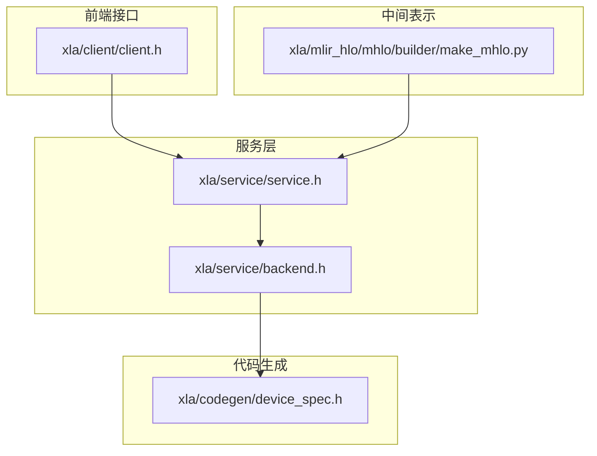
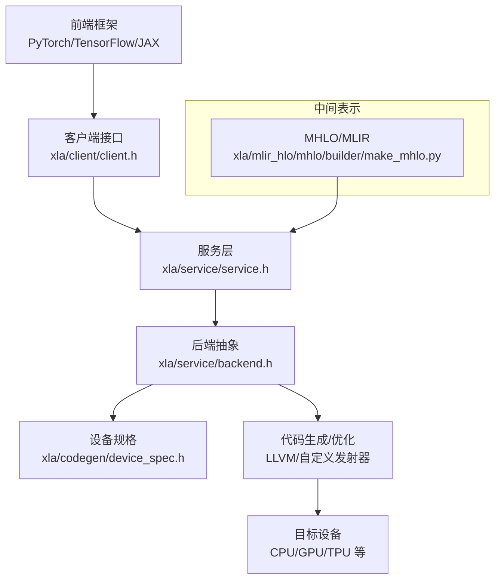
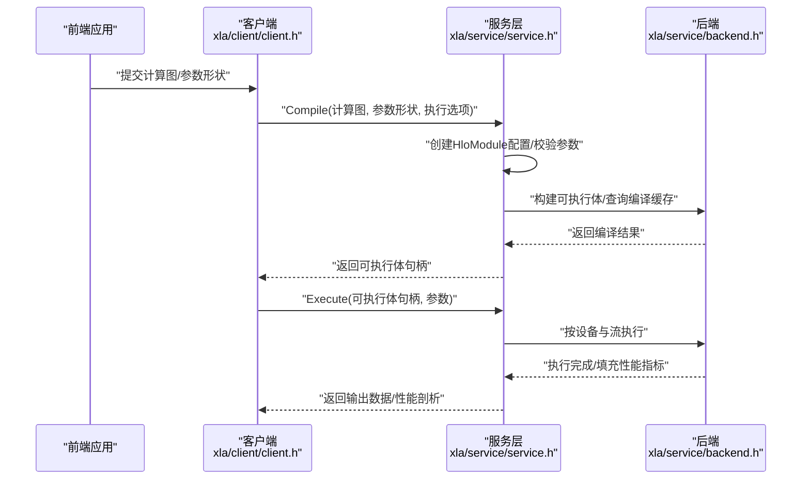
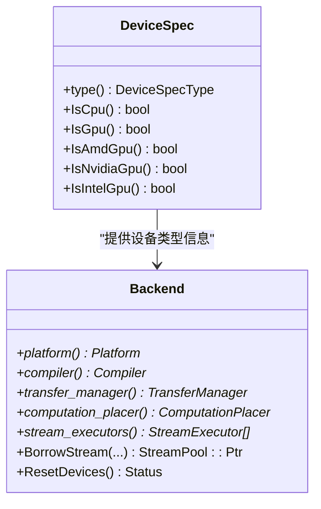
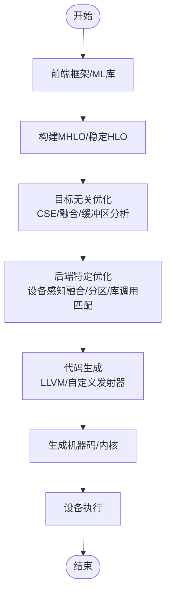
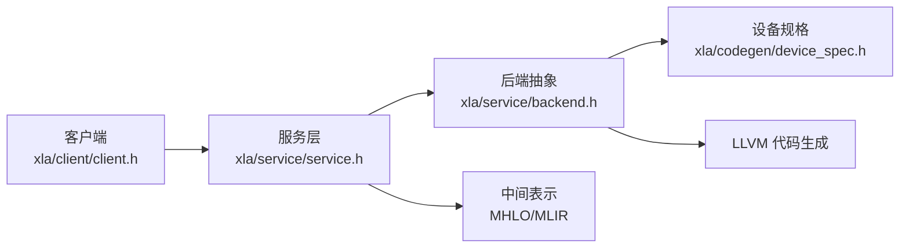

# 架构总览

<cite>
**本文引用的文件**
- [README.md](file://README.md)
- [docs/architecture.md](file://docs/architecture.md)
- [xla/client/client.h](file://xla/client/client.h)
- [xla/service/service.h](file://xla/service/service.h)
- [xla/service/backend.h](file://xla/service/backend.h)
- [xla/codegen/device_spec.h](file://xla/codegen/device_spec.h)
- [xla/mlir_hlo/mhlo/builder/make_mhlo.py](file://xla/mlir_hlo/mhlo/builder/make_mhlo.py)
</cite>

## 目录
1. [引言](#引言)
2. [项目结构](#项目结构)
3. [核心组件](#核心组件)
4. [架构总览](#架构总览)
5. [详细组件分析](#详细组件分析)
6. [依赖分析](#依赖分析)
7. [性能考虑](#性能考虑)
8. [故障排查指南](#故障排查指南)
9. [结论](#结论)
10. [附录](#附录)

## 引言
本文件面向希望深入理解XLA（加速线性代数）整体架构与编译流程的开发者，系统梳理从前端接口、中间表示、后端优化到代码生成的关键层次，解释从高层ML操作到优化后机器码的完整编译管线，并给出架构决策的技术考量、性能权衡与扩展性设计建议。XLA作为OpenXLA生态的核心编译器，支持多框架前端（如PyTorch、TensorFlow、JAX）与多硬件后端（CPU/GPU/TPU等），通过稳定化的中间表示（StableHLO/MHLO）实现跨平台可移植性与高性能执行。

## 项目结构
XLA仓库采用模块化分层组织：前端接口（client）负责与上层框架交互；服务层（service）统一编排编译与执行；后端（backend）封装平台能力；代码生成（codegen）负责目标代码发射；MLIR/HLO子树提供中间表示与转换工具。下图展示与本文相关的主要目录与职责映射：

图表来源
- [xla/client/client.h](file://xla/client/client.h#L40-L222)
- [xla/service/service.h](file://xla/service/service.h#L141-L352)
- [xla/service/backend.h](file://xla/service/backend.h#L81-L213)
- [xla/codegen/device_spec.h](file://xla/codegen/device_spec.h#L31-L64)
- [xla/mlir_hlo/mhlo/builder/make_mhlo.py](file://xla/mlir_hlo/mhlo/builder/make_mhlo.py)

章节来源
- [README.md](file://README.md#L1-L50)
- [docs/architecture.md](file://docs/architecture.md#L1-L72)

## 核心组件
- 前端客户端（Client）
  - 提供编译、执行、数据传输、通道管理等API，屏蔽底层设备与执行细节。
  - 关键方法包括编译计算图、执行已编译可执行体、批量执行、设备句柄获取、输入/输出队列传输等。
- 服务（Service）
  - 统一编排编译与执行生命周期，维护全局状态（分配跟踪、通道跟踪、执行跟踪、编译缓存）。
  - 负责将高层计算图转换为HLO模块配置，构建可执行体或持久化结果，并在指定设备上执行。
- 后端（Backend）
  - 封装平台能力，提供编译器、传输管理器、设备地址分配器、流池化等基础设施。
  - 管理多个设备的StreamExecutor，支持流借用、线程池、设备等价性判断与重置。
- 设备规格（DeviceSpec）
  - 抽象CPU/GPU设备差异，识别NVIDIA/AMD/Intel等不同GPU族别，为代码生成与优化提供目标信息。
- 中间表示（MHLO/MLIR）
  - 通过MHLO构建器将前端图转换为稳定化的高阶语言（HLO）表示，便于后续跨平台优化与代码生成。

章节来源
- [xla/client/client.h](file://xla/client/client.h#L40-L222)
- [xla/service/service.h](file://xla/service/service.h#L141-L352)
- [xla/service/backend.h](file://xla/service/backend.h#L81-L213)
- [xla/codegen/device_spec.h](file://xla/codegen/device_spec.h#L31-L64)
- [xla/mlir_hlo/mhlo/builder/make_mhlo.py](file://xla/mlir_hlo/mhlo/builder/make_mhlo.py)

## 架构总览
XLA的总体架构以“前端-服务-后端-代码生成-目标设备”为主线，形成清晰的分层与解耦。前端通过客户端提交计算图，服务层进行模块配置与可执行体构建，后端选择具体平台与设备，代码生成层针对目标硬件进行优化与发射，最终由设备执行。

图表来源
- [xla/client/client.h](file://xla/client/client.h#L40-L222)
- [xla/service/service.h](file://xla/service/service.h#L141-L352)
- [xla/service/backend.h](file://xla/service/backend.h#L81-L213)
- [xla/codegen/device_spec.h](file://xla/codegen/device_spec.h#L31-L64)
- [xla/mlir_hlo/mhlo/builder/make_mhlo.py](file://xla/mlir_hlo/mhlo/builder/make_mhlo.py)

章节来源
- [docs/architecture.md](file://docs/architecture.md#L35-L72)

## 详细组件分析

### 客户端-服务交互序列
该序列图展示从客户端提交计算到服务完成编译与执行的关键调用链路，体现服务层对编译缓存、设备选择与执行跟踪的管理。

图表来源
- [xla/client/client.h](file://xla/client/client.h#L67-L101)
- [xla/service/service.h](file://xla/service/service.h#L154-L171)
- [xla/service/backend.h](file://xla/service/backend.h#L284-L311)

章节来源
- [xla/client/client.h](file://xla/client/client.h#L49-L101)
- [xla/service/service.h](file://xla/service/service.h#L154-L171)

### 设备规格与后端适配
DeviceSpec用于区分CPU/GPU族别（NVIDIA/AMD/Intel），为后端优化与代码生成提供目标信息，确保在不同硬件上进行针对性的调度与发射。

图表来源
- [xla/codegen/device_spec.h](file://xla/codegen/device_spec.h#L31-L64)
- [xla/service/backend.h](file://xla/service/backend.h#L94-L127)

章节来源
- [xla/codegen/device_spec.h](file://xla/codegen/device_spec.h#L31-L64)
- [xla/service/backend.h](file://xla/service/backend.h#L81-L127)

### 编译流水线与优化阶段
XLA的编译管线分为三个主要阶段：前端到HLO的优化与分析、后端特定优化、目标代码生成。下图给出概念性流程，对应实际代码中的模块配置、可执行体构建与执行路径。

图表来源
- [docs/architecture.md](file://docs/architecture.md#L43-L66)

章节来源
- [docs/architecture.md](file://docs/architecture.md#L43-L66)

## 依赖分析
- 组件耦合与内聚
  - 客户端与服务层通过抽象接口解耦，便于替换与扩展。
  - 服务层与后端通过Compiler/TransferManager/ComputationPlacer等接口协作，保持平台无关性。
  - 后端与设备规格通过DeviceSpec与StreamExecutor对接，实现多硬件族支持。
- 外部依赖与集成点
  - 代码生成层广泛使用LLVM进行低级IR优化与目标码生成。
  - 中间表示基于MLIR/HLO，提供稳定的跨框架桥接层。
- 潜在循环依赖
  - 服务层与后端通过指针与工厂模式避免直接循环引用，保持单向依赖。
- 接口契约
  - 客户端API明确编译/执行/传输语义；服务层提供统一的模块配置与可执行体构建入口；后端提供设备与资源管理能力。

图表来源
- [xla/client/client.h](file://xla/client/client.h#L40-L222)
- [xla/service/service.h](file://xla/service/service.h#L141-L352)
- [xla/service/backend.h](file://xla/service/backend.h#L81-L213)
- [xla/codegen/device_spec.h](file://xla/codegen/device_spec.h#L31-L64)

章节来源
- [xla/client/client.h](file://xla/client/client.h#L40-L222)
- [xla/service/service.h](file://xla/service/service.h#L141-L352)
- [xla/service/backend.h](file://xla/service/backend.h#L81-L213)
- [xla/codegen/device_spec.h](file://xla/codegen/device_spec.h#L31-L64)

## 性能考虑
- 执行速度提升
  - 子图编译减少短生命周期算子开销，流水线操作融合降低内存带宽压力，常量传播与形状特化提升指令效率。
- 内存使用优化
  - 运行时缓冲区分析与调度，消除中间存储缓冲，降低峰值内存占用。
- 自定义算子依赖降低
  - 通过自动融合与优化，减少手写高性能算子的需求，提升通用性与可维护性。
- 可移植性与扩展性
  - 通过稳定HLO与MLIR中间层，新硬件后端可快速接入；后端抽象支持多ISA与编程模型（CUDA/ROCm/OneAPI等）。
- 并行与资源管理
  - 流池化与线程池配置提升并发度；设备重置与等价性判断保障多设备场景一致性。

章节来源
- [docs/architecture.md](file://docs/architecture.md#L8-L34)
- [xla/service/backend.h](file://xla/service/backend.h#L129-L153)

## 故障排查指南
- 编译与执行问题
  - 使用服务层提供的模块配置与可执行体构建接口定位问题；检查编译缓存命中情况与设备句柄有效性。
- 设备与传输异常
  - 核查设备句柄与复制/入队/出队接口的形状布局一致性；必要时重置设备状态。
- 性能剖析与诊断
  - 利用执行剖析对象收集时间线与资源使用；结合通道与分配跟踪定位瓶颈。
- 错误处理与日志
  - 通过状态对象与错误码进行统一处理；关注致命错误sink与调试上下文工具。

章节来源
- [xla/service/service.h](file://xla/service/service.h#L141-L245)
- [xla/client/client.h](file://xla/client/client.h#L141-L152)

## 结论
XLA通过清晰的分层架构与稳定的中间表示，实现了从多框架前端到多硬件后端的高效编译与执行。其设计在性能、内存与可移植性之间取得平衡，并以模块化与抽象化支撑持续扩展。理解客户端-服务-后端-代码生成的交互关系与编译管线，有助于开发者更高效地定位问题、优化性能并扩展新硬件支持。

## 附录
- 相关文档与资源
  - 项目主页与生态介绍参见根目录README。
  - 架构与目标说明参见docs/architecture.md。
  - 中间表示构建器位于xla/mlir_hlo/mhlo/builder/make_mhlo.py。

章节来源
- [README.md](file://README.md#L1-L50)
- [docs/architecture.md](file://docs/architecture.md#L1-L72)
- [xla/mlir_hlo/mhlo/builder/make_mhlo.py](file://xla/mlir_hlo/mhlo/builder/make_mhlo.py)